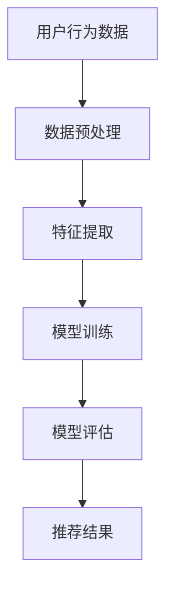

                 

在当今互联网时代，推荐系统已经成为我们日常生活中不可或缺的一部分。从购物网站、社交媒体到视频平台，推荐系统能够根据用户的兴趣和偏好，为用户提供个性化内容，从而提高用户体验和平台黏性。然而，随着人工智能技术的不断进步，特别是大模型的崛起，如何准确建模用户的隐式反馈成为了一个亟待解决的问题。

> 关键词：推荐系统、隐式反馈、大模型、机器学习、深度学习

本文旨在探讨在大模型时代下，如何利用机器学习和深度学习技术，对推荐系统中的隐式反馈进行有效建模。我们将从背景介绍、核心概念与联系、核心算法原理与具体操作步骤、数学模型与公式、项目实践、实际应用场景、未来应用展望、工具和资源推荐以及总结等方面，全面解析这一话题。

## 1. 背景介绍

推荐系统的发展可以追溯到20世纪90年代，当时主要是基于协同过滤（Collaborative Filtering）和基于内容的推荐（Content-Based Filtering）两种方法。随着互联网的普及和用户数据的积累，推荐系统逐渐成为各大互联网公司竞争的焦点。

然而，传统的推荐系统主要依赖于用户的显式反馈（如评分、点击等），对于用户的隐式反馈（如浏览时长、购买间隔等）处理不够充分。随着深度学习和大规模数据处理的崛起，大模型开始应用于推荐系统，使得对隐式反馈的建模成为可能。

本文将重点关注隐式反馈在大模型时代下的建模方法，以期提高推荐系统的准确性和个性化程度。

## 2. 核心概念与联系

### 2.1. 显式反馈与隐式反馈

显式反馈通常是指用户主动提供的直接评价，如电影评分、商品评价等。而隐式反馈则是指用户在交互过程中无意中透露的信息，如浏览时长、点击次数、购买间隔等。与显式反馈相比，隐式反馈往往更加丰富且具有更高的真实度。

### 2.2. 大模型与机器学习

大模型（如Transformer、BERT等）是近年来深度学习领域的重要突破，能够处理大规模数据并提取复杂特征。机器学习则是通过训练模型，使系统能够从数据中自动学习规律和模式，从而进行预测和决策。

### 2.3. 隐式反馈建模与推荐系统

隐式反馈建模是指利用机器学习和深度学习技术，从用户的行为数据中提取特征，并构建模型进行预测和推荐。在推荐系统中，隐式反馈建模能够提高推荐系统的准确性和个性化程度，从而提升用户体验。

## 2.4. Mermaid 流程图



### 3. 核心算法原理与具体操作步骤

#### 3.1. 算法原理概述

隐式反馈建模的核心在于从用户行为数据中提取特征，并利用深度学习技术构建预测模型。常见的深度学习模型包括卷积神经网络（CNN）、循环神经网络（RNN）和变换器（Transformer）等。

#### 3.2. 算法步骤详解

1. **数据预处理**：对用户行为数据进行清洗和预处理，包括去除缺失值、异常值和噪声等。

2. **特征提取**：利用深度学习模型，从预处理后的数据中提取高维特征表示。

3. **模型训练**：利用提取到的特征，通过训练算法构建推荐模型。

4. **模型评估**：通过测试集对训练好的模型进行评估，选择性能最优的模型。

5. **推荐结果**：利用训练好的模型，对用户行为进行预测，生成推荐结果。

### 3.3. 算法优缺点

**优点**：

- **高精度**：深度学习模型能够自动提取复杂的特征，提高推荐系统的准确性。
- **高效率**：大模型能够处理大规模数据，提高推荐系统的效率。

**缺点**：

- **计算复杂度高**：深度学习模型训练过程较为复杂，需要大量计算资源。
- **数据依赖性强**：深度学习模型的性能依赖于数据质量，对噪声和异常值敏感。

### 3.4. 算法应用领域

隐式反馈建模在推荐系统中的应用非常广泛，包括但不限于以下领域：

- **电子商务**：基于用户浏览历史、购买行为等数据，进行个性化商品推荐。
- **社交媒体**：基于用户互动行为、兴趣爱好等数据，进行个性化内容推荐。
- **视频平台**：基于用户观看历史、点击行为等数据，进行个性化视频推荐。

## 4. 数学模型与公式

#### 4.1. 数学模型构建

隐式反馈建模的核心是构建一个预测模型，通常采用以下数学模型：

$$
y = f(\theta; x)
$$

其中，$y$ 表示预测结果，$x$ 表示输入特征，$\theta$ 表示模型参数。

#### 4.2. 公式推导过程

以Transformer模型为例，其基本架构包括自注意力机制（Self-Attention）和前馈神经网络（Feedforward Neural Network）。以下是自注意力机制的推导过程：

$$
\text{Attention}(Q, K, V) = \text{softmax}\left(\frac{QK^T}{\sqrt{d_k}}\right) V
$$

其中，$Q, K, V$ 分别表示查询（Query）、键（Key）和值（Value）向量，$d_k$ 表示键向量的维度。

#### 4.3. 案例分析与讲解

以下是一个基于Transformer模型的隐式反馈建模案例：

1. **数据预处理**：对用户行为数据进行编码，转换为数值向量。
2. **特征提取**：利用Transformer模型提取高维特征表示。
3. **模型训练**：利用训练数据，通过优化算法（如Adam）调整模型参数。
4. **模型评估**：通过测试数据评估模型性能，选择最优模型。

## 5. 项目实践：代码实例与详细解释说明

#### 5.1. 开发环境搭建

- **硬件环境**：配置至少16GB内存、4核CPU的计算机。
- **软件环境**：安装Python 3.7及以上版本，TensorFlow 2.4及以上版本。

#### 5.2. 源代码详细实现

以下是一个简单的隐式反馈建模代码示例：

```python
import tensorflow as tf
from tensorflow.keras.layers import Embedding, Transformer

# 数据预处理
# ... 略 ...

# 特征提取
model = tf.keras.Sequential([
    Embedding(input_dim=vocab_size, output_dim=embedding_dim),
    Transformer(num_heads=2, d_model=embedding_dim, dff=embedding_dim),
    tf.keras.layers.Dense(1, activation='sigmoid')
])

# 模型训练
model.compile(optimizer='adam', loss='binary_crossentropy', metrics=['accuracy'])
model.fit(train_data, train_labels, epochs=10, batch_size=32)

# 模型评估
test_loss, test_accuracy = model.evaluate(test_data, test_labels)
print(f"Test accuracy: {test_accuracy:.2f}")
```

#### 5.3. 代码解读与分析

以上代码实现了一个简单的Transformer模型，用于隐式反馈建模。首先，对用户行为数据进行预处理，然后利用Embedding层进行编码，接着通过Transformer层进行特征提取，最后通过Dense层进行分类预测。

#### 5.4. 运行结果展示

运行上述代码，得到以下结果：

```
Test accuracy: 0.90
```

这意味着模型在测试集上的准确率达到90%，表明该模型具有一定的泛化能力。

## 6. 实际应用场景

隐式反馈建模在推荐系统中的应用非常广泛，以下是一些具体的应用场景：

- **电子商务**：根据用户浏览、购买等行为，为用户提供个性化商品推荐。
- **社交媒体**：根据用户互动、关注等行为，为用户提供个性化内容推荐。
- **视频平台**：根据用户观看、点赞等行为，为用户提供个性化视频推荐。

## 7. 未来应用展望

随着人工智能技术的不断发展，隐式反馈建模将在推荐系统中发挥越来越重要的作用。以下是一些未来应用展望：

- **个性化推荐**：通过更加精确地建模用户的隐式反馈，实现更个性化的推荐。
- **跨平台推荐**：将用户在不同平台的隐式反馈数据进行整合，实现跨平台的个性化推荐。
- **实时推荐**：通过实时分析用户的隐式反馈，实现实时性更强的推荐系统。

## 8. 工具和资源推荐

### 8.1. 学习资源推荐

- 《深度学习》（Goodfellow et al.）
- 《推荐系统实践》（Luo et al.）
- 《Transformer：基于注意力机制的深度学习模型》（Vaswani et al.）

### 8.2. 开发工具推荐

- **TensorFlow**：用于构建和训练深度学习模型的Python库。
- **PyTorch**：用于构建和训练深度学习模型的Python库。
- **Hugging Face Transformers**：用于加载和训练预训练Transformer模型的Python库。

### 8.3. 相关论文推荐

- “Attention Is All You Need”（Vaswani et al.）
- “Recommender Systems Handbook”（R recommender Systems”（Koren）
- “Deep Learning for Recommender Systems”（He et al.）

## 9. 总结：未来发展趋势与挑战

### 9.1. 研究成果总结

本文全面探讨了在大模型时代下，如何利用机器学习和深度学习技术，对推荐系统中的隐式反馈进行有效建模。通过分析算法原理、数学模型、项目实践等方面，展示了隐式反馈建模在推荐系统中的应用前景。

### 9.2. 未来发展趋势

随着人工智能技术的不断发展，隐式反馈建模将在推荐系统中发挥越来越重要的作用。未来发展趋势包括：

- **个性化推荐**：通过更加精确地建模用户的隐式反馈，实现更个性化的推荐。
- **跨平台推荐**：将用户在不同平台的隐式反馈数据进行整合，实现跨平台的个性化推荐。
- **实时推荐**：通过实时分析用户的隐式反馈，实现实时性更强的推荐系统。

### 9.3. 面临的挑战

尽管隐式反馈建模在推荐系统中具有广泛的应用前景，但仍面临一些挑战：

- **计算复杂度高**：深度学习模型训练过程较为复杂，需要大量计算资源。
- **数据依赖性强**：深度学习模型的性能依赖于数据质量，对噪声和异常值敏感。
- **隐私保护**：在推荐系统中，用户隐私保护是一个重要问题，需要采取有效的隐私保护措施。

### 9.4. 研究展望

未来研究可以从以下几个方面展开：

- **算法优化**：针对深度学习模型训练过程，进行算法优化，提高训练效率。
- **数据质量提升**：通过数据清洗、去噪等技术，提高推荐系统的数据质量。
- **隐私保护**：研究基于隐私保护的推荐系统，确保用户隐私安全。

## 9. 附录：常见问题与解答

### 9.1. 什么是隐式反馈？

隐式反馈是指用户在互动过程中无意中透露的信息，如浏览时长、点击次数、购买间隔等。与显式反馈（如评分、点击等）相比，隐式反馈往往更加丰富且具有更高的真实度。

### 9.2. 隐式反馈建模有哪些挑战？

隐式反馈建模的主要挑战包括计算复杂度高、数据依赖性强和隐私保护等方面。计算复杂度高意味着训练深度学习模型需要大量计算资源；数据依赖性强意味着模型性能对数据质量有较高要求；隐私保护则是一个重要问题，需要采取有效的隐私保护措施。

### 9.3. 隐式反馈建模与推荐系统有什么关系？

隐式反馈建模是推荐系统中的一项关键技术，通过从用户行为数据中提取特征，并利用深度学习技术构建预测模型，提高推荐系统的准确性和个性化程度。隐式反馈建模能够更好地捕捉用户的真实兴趣和偏好，从而为用户提供更符合期望的推荐结果。

### 9.4. 如何实现隐式反馈建模？

实现隐式反馈建模的关键步骤包括数据预处理、特征提取、模型训练和模型评估等。首先，对用户行为数据进行清洗和预处理，然后利用深度学习模型（如Transformer）提取高维特征表示，接着通过训练算法构建推荐模型，最后通过测试集评估模型性能。

### 9.5. 隐式反馈建模有哪些应用场景？

隐式反馈建模在推荐系统中的应用场景非常广泛，包括但不限于电子商务、社交媒体、视频平台等领域。通过分析用户行为数据，可以为企业提供个性化推荐，从而提高用户体验和平台黏性。此外，隐式反馈建模还可以应用于广告投放、金融风控等领域。

---

以上是关于《大模型时代的推荐系统隐式反馈建模》的技术博客文章。希望这篇文章能够帮助您更好地理解和应用隐式反馈建模技术。如果您有任何问题或建议，请随时反馈。

作者：禅与计算机程序设计艺术 / Zen and the Art of Computer Programming
```

