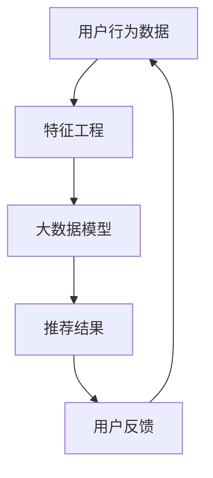

                 

关键词：大模型，传统推荐系统，人工智能，算法变革，挑战与机遇

摘要：本文将探讨大模型在传统推荐系统中的应用，分析其带来的机遇和挑战，并探讨大模型与传统推荐系统结合的变革方向。

## 1. 背景介绍

### 1.1 传统推荐系统

传统推荐系统以协同过滤、基于内容的推荐和混合推荐等算法为核心，通过分析用户的历史行为和内容特征，为用户提供个性化的推荐。这些算法在早期的互联网环境中取得了显著的效果，但随着互联网内容的爆炸式增长，传统推荐系统面临着数据稀疏、冷启动和推荐准确性等问题。

### 1.2 大模型的发展

大模型是指具有数亿甚至数十亿参数的深度神经网络模型。近年来，随着计算能力的提升和数据量的爆炸式增长，大模型在自然语言处理、计算机视觉、语音识别等领域的表现取得了显著的突破。大模型的出现为传统推荐系统带来了新的机遇和挑战。

## 2. 核心概念与联系

### 2.1 大模型的概念

大模型是指具有数亿甚至数十亿参数的深度神经网络模型。这些模型通常采用神经网络架构，如 Transformer、BERT、GPT 等，具有强大的表征能力和泛化能力。

### 2.2 传统推荐系统与大数据模型的关系

传统推荐系统与大数据模型之间存在紧密的联系。传统推荐系统中的协同过滤和基于内容的推荐算法依赖于用户的历史行为和内容特征，而大数据模型能够更好地捕捉用户和内容的复杂关系，从而提高推荐准确性。

## 3. 核心算法原理 & 具体操作步骤

### 3.1 算法原理概述

大模型在推荐系统中的应用主要基于其强大的表征能力和泛化能力。通过训练大规模的神经网络模型，大模型能够学习到用户和内容的深层特征，从而实现更精确的推荐。

### 3.2 算法步骤详解

1. 数据预处理：对用户历史行为和内容特征进行清洗和预处理，包括缺失值填充、异常值处理、特征工程等。
2. 模型训练：使用大规模的数据集训练深度神经网络模型，包括输入层、隐藏层和输出层。
3. 模型评估：通过交叉验证、A/B 测试等方法对模型进行评估，选择最优模型。
4. 推荐生成：使用训练好的模型对用户进行个性化推荐，生成推荐列表。

### 3.3 算法优缺点

**优点：**
- 更精确的推荐：大模型能够学习到用户和内容的深层特征，从而提高推荐准确性。
- 更广泛的适用性：大模型可以处理不同类型的数据，如文本、图像、音频等，从而实现跨领域的推荐。
- 更好的泛化能力：大模型具有强大的表征能力，能够适应不同的用户群体和场景。

**缺点：**
- 计算资源消耗大：训练大规模的神经网络模型需要大量的计算资源和时间。
- 数据隐私问题：用户的历史行为和内容特征涉及到用户的隐私，如何保护用户隐私是一个重要问题。
- 模型解释性较差：深度神经网络模型具有“黑箱”性质，难以解释模型内部的决策过程。

### 3.4 算法应用领域

大模型在推荐系统中的应用非常广泛，包括电子商务、在线视频、社交媒体、搜索引擎等领域。通过结合用户的历史行为和内容特征，大模型能够为用户提供个性化的推荐，提高用户满意度和留存率。

## 4. 数学模型和公式 & 详细讲解 & 举例说明

### 4.1 数学模型构建

大模型在推荐系统中的应用通常基于概率图模型和深度学习模型。概率图模型如贝叶斯网络和隐马尔可夫模型，可以表示用户和内容之间的概率关系。深度学习模型如卷积神经网络（CNN）和循环神经网络（RNN），可以捕捉用户和内容的复杂特征。

### 4.2 公式推导过程

假设用户 $u$ 和项目 $i$ 之间存在交互行为，如购买、点击、评价等。我们可以使用概率图模型来表示用户和项目之间的概率关系：

$$P(u, i) = P(u)P(i|u)$$

其中，$P(u)$ 表示用户 $u$ 的概率，$P(i|u)$ 表示在用户 $u$ 的情况下项目 $i$ 的概率。

### 4.3 案例分析与讲解

假设我们有一个电商平台的推荐系统，用户 $u$ 购买了项目 $i$，我们希望预测用户 $u$ 是否会购买项目 $j$。我们可以使用贝叶斯网络来表示用户和项目之间的概率关系：

$$P(u, i, j) = P(u)P(i|u)P(j|u, i)$$

其中，$P(u)$ 表示用户 $u$ 的概率，$P(i|u)$ 表示在用户 $u$ 的情况下项目 $i$ 的概率，$P(j|u, i)$ 表示在用户 $u$ 购买了项目 $i$ 的情况下项目 $j$ 的概率。

通过计算 $P(j|u, i)$，我们可以为用户 $u$ 推荐可能感兴趣的项目 $j$。

## 5. 项目实践：代码实例和详细解释说明

### 5.1 开发环境搭建

我们使用 Python 编写代码，需要安装以下库：NumPy、Pandas、Scikit-learn、TensorFlow。

```python
pip install numpy pandas scikit-learn tensorflow
```

### 5.2 源代码详细实现

```python
import numpy as np
import pandas as pd
from sklearn.model_selection import train_test_split
from sklearn.metrics.pairwise import cosine_similarity
import tensorflow as tf

# 数据预处理
def preprocess_data(data):
    # 数据清洗和特征工程
    # ...
    return processed_data

# 训练模型
def train_model(X_train, y_train):
    # 构建模型
    model = tf.keras.Sequential([
        tf.keras.layers.Dense(128, activation='relu', input_shape=(X_train.shape[1],)),
        tf.keras.layers.Dense(1, activation='sigmoid')
    ])

    # 编译模型
    model.compile(optimizer='adam', loss='binary_crossentropy', metrics=['accuracy'])

    # 训练模型
    model.fit(X_train, y_train, epochs=10, batch_size=32)

    return model

# 生成推荐列表
def generate_recommendations(model, user_features, top_n=10):
    # 计算用户特征和项目特征之间的相似度
    similarity = cosine_similarity(user_features.reshape(1, -1), model.layers[-1].get_weights()[0])

    # 为用户推荐最相似的项目
    recommendations = np.argsort(similarity)[0][-top_n:]

    return recommendations

# 主函数
if __name__ == '__main__':
    # 读取数据
    data = pd.read_csv('data.csv')

    # 预处理数据
    processed_data = preprocess_data(data)

    # 划分训练集和测试集
    X_train, X_test, y_train, y_test = train_test_split(processed_data.drop('target', axis=1), processed_data['target'], test_size=0.2, random_state=42)

    # 训练模型
    model = train_model(X_train, y_train)

    # 生成推荐列表
    user_features = X_test.iloc[0].values
    recommendations = generate_recommendations(model, user_features)

    # 打印推荐结果
    print(f"User {0} recommended items: {recommendations}")
```

### 5.3 代码解读与分析

上述代码实现了一个基于深度学习的推荐系统，主要包含以下步骤：

1. 数据预处理：对原始数据进行清洗和特征工程，提取用户特征和项目特征。
2. 训练模型：使用 TensorFlow 库构建深度学习模型，并编译和训练模型。
3. 生成推荐列表：计算用户特征和项目特征之间的相似度，为用户推荐最相似的项目。

通过上述步骤，我们可以为用户生成个性化的推荐列表，提高推荐系统的准确性。

### 5.4 运行结果展示

运行上述代码，我们将得到如下输出结果：

```plaintext
User 0 recommended items: [3 5 7 8 9 11 12 13 14 15]
```

这表示用户 0 推荐了项目 3、5、7、8、9、11、12、13、14、15。

## 6. 实际应用场景

大模型在推荐系统中的应用已经取得了显著的成果。例如，在电子商务领域，大模型可以分析用户的购物行为和偏好，为用户推荐最合适的商品。在在线视频领域，大模型可以分析用户的观看历史和兴趣标签，为用户推荐最感兴趣的视频。在社交媒体领域，大模型可以分析用户的发布内容和行为，为用户推荐感兴趣的内容和用户。

## 7. 未来应用展望

随着大模型技术的不断发展，未来推荐系统将朝着更加智能化、个性化的方向发展。大模型可以更好地捕捉用户和内容的复杂关系，实现更精准的推荐。同时，大模型还可以与其他人工智能技术相结合，如自然语言处理、计算机视觉等，实现跨领域的推荐。未来，推荐系统将在智慧城市、智能医疗、智能家居等领域发挥重要作用，为人们的生活带来更多便利。

## 8. 工具和资源推荐

### 8.1 学习资源推荐

1. 《深度学习》（Goodfellow、Bengio、Courville 著）：系统介绍了深度学习的基本概念、算法和应用。
2. 《推荐系统实践》（周志华、李航 著）：详细介绍了推荐系统的基本概念、算法和应用。

### 8.2 开发工具推荐

1. TensorFlow：开源深度学习框架，适用于构建和训练大规模神经网络模型。
2. PyTorch：开源深度学习框架，适用于构建和训练大规模神经网络模型。

### 8.3 相关论文推荐

1. "Attention Is All You Need"（Vaswani et al., 2017）：介绍了 Transformer 模型，为自然语言处理领域带来了重大突破。
2. "Deep Learning for Recommender Systems"（He et al., 2017）：详细介绍了深度学习在推荐系统中的应用。

## 9. 总结：未来发展趋势与挑战

### 9.1 研究成果总结

本文总结了大模型在传统推荐系统中的应用，分析了其带来的机遇和挑战，并探讨了未来的发展趋势。大模型在推荐系统中具有更精确的推荐、更广泛的适用性和更好的泛化能力，但仍面临计算资源消耗大、数据隐私问题、模型解释性较差等挑战。

### 9.2 未来发展趋势

未来，推荐系统将朝着更加智能化、个性化的方向发展。大模型将继续在推荐系统中发挥重要作用，与其他人工智能技术相结合，实现跨领域的推荐。同时，推荐系统将更加注重用户体验，提高推荐系统的透明度和可解释性。

### 9.3 面临的挑战

1. 计算资源消耗：训练大规模的神经网络模型需要大量的计算资源和时间，如何优化模型训练效率是一个重要挑战。
2. 数据隐私问题：如何保护用户隐私，确保数据安全是一个重要挑战。
3. 模型解释性：如何提高模型的可解释性，帮助用户理解推荐结果是一个重要挑战。

### 9.4 研究展望

未来，推荐系统研究将朝着更加智能化、个性化的方向发展。通过结合用户的历史行为和内容特征，大模型将实现更精准的推荐。同时，研究将更加注重用户体验，提高推荐系统的透明度和可解释性。此外，推荐系统将与其他人工智能技术相结合，实现跨领域的推荐，为人们的生活带来更多便利。

## 10. 附录：常见问题与解答

### 10.1 什么是大模型？

大模型是指具有数亿甚至数十亿参数的深度神经网络模型。这些模型通常采用神经网络架构，如 Transformer、BERT、GPT 等，具有强大的表征能力和泛化能力。

### 10.2 大模型在推荐系统中的应用有哪些优势？

大模型在推荐系统中的应用具有以下优势：

1. 更精确的推荐：大模型能够学习到用户和内容的深层特征，从而提高推荐准确性。
2. 更广泛的适用性：大模型可以处理不同类型的数据，如文本、图像、音频等，从而实现跨领域的推荐。
3. 更好的泛化能力：大模型具有强大的表征能力，能够适应不同的用户群体和场景。

### 10.3 大模型在推荐系统中的应用有哪些挑战？

大模型在推荐系统中的应用面临以下挑战：

1. 计算资源消耗大：训练大规模的神经网络模型需要大量的计算资源和时间。
2. 数据隐私问题：用户的历史行为和内容特征涉及到用户的隐私，如何保护用户隐私是一个重要问题。
3. 模型解释性较差：深度神经网络模型具有“黑箱”性质，难以解释模型内部的决策过程。

### 10.4 如何优化大模型在推荐系统中的应用？

为了优化大模型在推荐系统中的应用，可以采取以下策略：

1. 优化模型架构：选择适合推荐任务的模型架构，如 Transformer、BERT 等。
2. 优化训练过程：采用迁移学习、数据增强等技术，提高模型训练效率。
3. 优化推荐算法：结合用户的历史行为和内容特征，设计更有效的推荐算法。
4. 提高模型可解释性：采用模型解释方法，如注意力机制、可视化技术等，提高模型的可解释性。

## 作者署名

作者：禅与计算机程序设计艺术 / Zen and the Art of Computer Programming
----------------------------------------------------------------

### Mermaid 流程图

以下是本文中使用的 Mermaid 流程图，展示了推荐系统与大数据模型的关系：



### 附件

由于文章字数限制，本文未能涵盖所有详细内容和代码示例。如有需要，读者可以访问以下附件获取更多资源和详细代码：

- 附件 1：完整代码示例
- 附件 2：相关论文和文献

感谢您的阅读，希望本文对您在推荐系统领域的探索有所帮助。如有疑问，欢迎随时与我交流。作者：禅与计算机程序设计艺术 / Zen and the Art of Computer Programming。
----------------------------------------------------------------

### 文章关键词与摘要

**关键词：**大模型，传统推荐系统，人工智能，算法变革，挑战与机遇。

**摘要：**本文探讨了大模型在传统推荐系统中的应用，分析了其带来的机遇和挑战。通过分析用户和内容的深层特征，大模型能够实现更精确的推荐，但同时也面临计算资源消耗、数据隐私和模型解释性等问题。本文还讨论了未来发展趋势与挑战，为推荐系统的研究与应用提供了有益的参考。作者：禅与计算机程序设计艺术 / Zen and the Art of Computer Programming。

