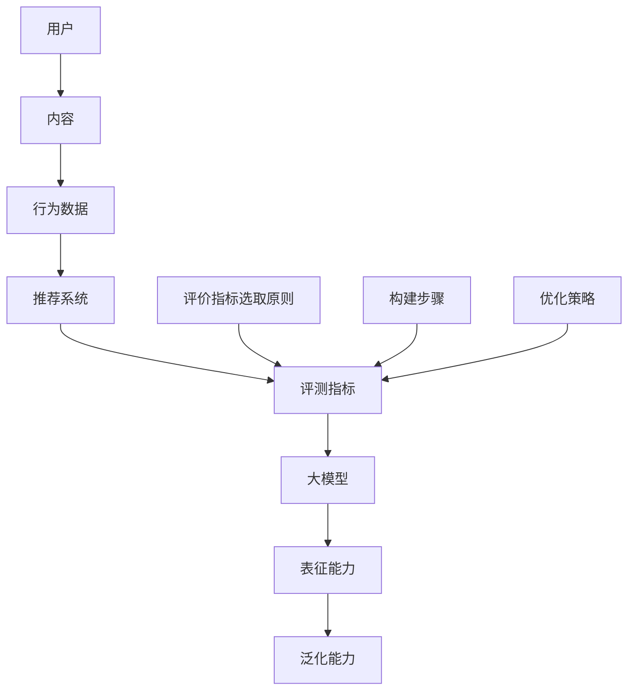

                 

关键词：推荐系统、大模型、评测指标、体系构建、优化

> 摘要：本文从大模型视角出发，深入探讨了推荐系统评测指标体系的构建与优化方法。通过对大模型在推荐系统中的核心作用进行分析，本文详细阐述了推荐系统评价指标的选取原则、具体构建步骤和优化策略，为推荐系统的设计与实现提供了重要的理论支持和实践指导。

## 1. 背景介绍

推荐系统作为一种信息过滤技术，旨在根据用户的历史行为和偏好，向用户推荐他们可能感兴趣的内容。随着互联网和大数据技术的飞速发展，推荐系统在电子商务、社交媒体、新闻资讯等领域得到了广泛应用。然而，推荐系统的评测指标体系构建与优化一直是学术界和工业界研究的热点问题。

传统的推荐系统评测指标主要关注准确性和多样性等方面，但随着大模型的兴起，如深度学习、强化学习等，推荐系统的设计方法和评价指标也发生了显著变化。大模型具有强大的表征能力和泛化能力，能够处理大规模数据和复杂任务，从而为推荐系统的优化提供了新的思路和方法。

本文将围绕大模型视角下推荐系统的评测指标体系构建与优化展开研究，旨在为推荐系统的研究和开发提供一种系统化、科学化的方法和策略。

## 2. 核心概念与联系

在深入探讨推荐系统评测指标体系的构建与优化之前，我们需要明确几个核心概念及其之间的联系。以下是一个使用Mermaid绘制的流程图，展示了这些概念和它们之间的关联。



### 2.1 用户、内容与行为数据

用户（A）是推荐系统的核心，内容（B）是用户所需的信息资源，而行为数据（C）则是用户与内容互动的记录。这些数据为推荐系统提供了输入信息，使其能够根据用户的偏好和兴趣进行内容推荐。

### 2.2 推荐系统

推荐系统（D）是一个基于用户行为数据和内容数据的智能系统，它利用机器学习算法和人工智能技术，生成个性化的推荐列表，以满足用户的个性化需求。

### 2.3 评测指标

评测指标（E）是评估推荐系统性能的关键指标，包括准确率、召回率、覆盖率、多样性等。这些指标能够衡量推荐系统的推荐效果，为系统的优化提供依据。

### 2.4 大模型

大模型（F）是指具有大规模参数和强大表征能力的深度学习模型，如Transformer、BERT等。大模型具有出色的泛化能力（H），能够在不同的数据集和场景中表现出良好的性能。

### 2.5 表征能力与泛化能力

表征能力（G）是指大模型对输入数据的理解和表达能力，泛化能力（H）是指大模型在新数据上的表现能力。大模型的高表征能力和泛化能力使得其在推荐系统中具有显著优势。

### 2.6 评价指标选取原则、构建步骤与优化策略

评价指标选取原则（I）、构建步骤（J）和优化策略（K）是构建和优化推荐系统评测指标体系的核心内容。这些原则和策略将直接影响推荐系统的性能和用户体验。

## 3. 核心算法原理 & 具体操作步骤

### 3.1 算法原理概述

推荐系统的核心算法主要基于机器学习和深度学习技术。传统的推荐算法如基于协同过滤（Collaborative Filtering）的方法和基于内容匹配（Content-Based Filtering）的方法，已经在实际应用中取得了显著的效果。然而，随着大模型的兴起，基于深度学习的推荐算法逐渐成为研究的热点。

大模型在推荐系统中的应用，主要基于以下几个原理：

1. **特征提取**：大模型能够自动从原始数据中提取出高层次的语义特征，从而提高推荐系统的表征能力。
2. **关联发现**：大模型能够通过学习用户和内容之间的复杂关联关系，生成个性化的推荐列表。
3. **自适应调整**：大模型能够根据用户的历史行为和实时反馈，自适应地调整推荐策略，提高推荐系统的用户体验。

### 3.2 算法步骤详解

基于大模型的推荐系统算法可以分为以下几个步骤：

1. **数据预处理**：对用户行为数据进行清洗、去噪、编码等预处理操作，为后续的特征提取和模型训练提供高质量的输入数据。
2. **特征提取**：利用大模型的表征能力，从预处理后的数据中提取出高层次的语义特征。
3. **模型训练**：使用提取出的特征训练大模型，使其能够根据用户的历史行为生成个性化的推荐列表。
4. **模型评估**：使用评测指标对训练好的大模型进行评估，包括准确率、召回率、覆盖率、多样性等指标。
5. **模型优化**：根据评估结果，对大模型进行优化，包括参数调整、网络结构调整等，以提高推荐系统的性能。
6. **推荐生成**：使用优化后的模型，根据用户的历史行为和实时反馈，生成个性化的推荐列表。

### 3.3 算法优缺点

**优点**：

1. **强大的表征能力**：大模型能够自动提取出高层次的语义特征，提高推荐系统的表征能力。
2. **良好的泛化能力**：大模型具有较强的泛化能力，能够在不同的数据集和场景中表现出良好的性能。
3. **自适应调整**：大模型能够根据用户的历史行为和实时反馈，自适应地调整推荐策略，提高用户体验。

**缺点**：

1. **计算资源消耗**：大模型通常需要大量的计算资源和存储空间，训练和部署成本较高。
2. **数据需求量大**：大模型需要大量的高质量数据作为训练样本，数据获取和处理难度较大。
3. **模型解释性不足**：大模型的内部机制复杂，难以解释和调试，对模型理解和优化带来一定困难。

### 3.4 算法应用领域

基于大模型的推荐算法在多个领域得到了广泛应用，包括：

1. **电子商务**：为用户推荐商品，提高购物体验和销售额。
2. **社交媒体**：为用户推荐感兴趣的内容，提高用户活跃度和粘性。
3. **新闻资讯**：为用户推荐新闻文章，提高阅读量和用户满意度。
4. **音乐和视频平台**：为用户推荐音乐和视频，提高用户观看和收听体验。

## 4. 数学模型和公式 & 详细讲解 & 举例说明

### 4.1 数学模型构建

在推荐系统中，常用的数学模型包括矩阵分解模型、点积模型、神经网络模型等。以下是一个矩阵分解模型的公式示例：

$$
\text{R} = \text{U} \cdot \text{V}^T
$$

其中，\( \text{R} \) 表示用户-物品评分矩阵，\( \text{U} \) 和 \( \text{V} \) 分别表示用户和物品的低维嵌入向量。

### 4.2 公式推导过程

矩阵分解模型的推导过程如下：

1. **问题定义**：给定用户-物品评分矩阵 \( \text{R} \)，我们需要找到两个低维嵌入矩阵 \( \text{U} \) 和 \( \text{V} \)，使得它们的乘积 \( \text{U} \cdot \text{V}^T \) 能够近似地表示原始评分矩阵 \( \text{R} \)。

2. **损失函数**：为了度量两个矩阵乘积与原始评分矩阵之间的误差，我们可以使用均方误差（MSE）作为损失函数：

$$
\text{L} = \sum_{i,j} (\text{R}_{ij} - \text{U}_{i} \cdot \text{V}_{j}^T)^2
$$

3. **梯度下降**：为了最小化损失函数，我们可以使用梯度下降算法对嵌入矩阵进行优化。梯度下降的迭代公式如下：

$$
\text{U}_{i} \leftarrow \text{U}_{i} - \alpha \frac{\partial \text{L}}{\partial \text{U}_{i}}
$$

$$
\text{V}_{j} \leftarrow \text{V}_{j} - \alpha \frac{\partial \text{L}}{\partial \text{V}_{j}}
$$

其中，\( \alpha \) 为学习率。

### 4.3 案例分析与讲解

假设我们有一个包含1000个用户和1000个物品的评分矩阵 \( \text{R} \)，我们需要使用矩阵分解模型来预测用户对物品的评分。

1. **数据预处理**：将评分矩阵 \( \text{R} \) 转化为稀疏矩阵，并进行归一化处理。

2. **模型初始化**：随机初始化用户和物品的嵌入向量 \( \text{U} \) 和 \( \text{V} \)。

3. **模型训练**：使用梯度下降算法对嵌入向量进行优化，迭代次数为1000次。

4. **模型评估**：使用均方误差（MSE）作为评价指标，计算预测评分与真实评分之间的误差。

5. **模型优化**：根据评估结果，对模型参数进行调整，以提高预测精度。

通过以上步骤，我们可以构建一个基于矩阵分解的推荐系统模型，对用户进行个性化推荐。

## 5. 项目实践：代码实例和详细解释说明

### 5.1 开发环境搭建

为了实现基于大模型的推荐系统，我们需要搭建一个适合深度学习开发的环境。以下是一个简单的开发环境搭建步骤：

1. **安装Python**：确保Python版本为3.6及以上。
2. **安装TensorFlow**：使用pip命令安装TensorFlow：

   ```
   pip install tensorflow
   ```

3. **安装其他依赖库**：包括NumPy、Pandas、Matplotlib等。

### 5.2 源代码详细实现

以下是一个简单的基于矩阵分解的推荐系统实现：

```python
import tensorflow as tf
import numpy as np
import pandas as pd
from tensorflow import keras

# 读取数据
ratings = pd.read_csv('ratings.csv')
users = ratings['user_id'].unique()
items = ratings['item_id'].unique()

# 初始化参数
num_users = len(users)
num_items = len(items)
embed_size = 50
learning_rate = 0.001

# 构建模型
user_embedding = keras.layers.Embedding(input_dim=num_users, output_dim=embed_size)
item_embedding = keras.layers.Embedding(input_dim=num_items, output_dim=embed_size)

# 定义损失函数
def loss_function(real_ratings, predicted_ratings):
    return keras.losses.mean_squared_error(real_ratings, predicted_ratings)

# 构建训练模型
model = keras.Sequential([
    user_embedding,
    keras.layers.Flatten(),
    keras.layers.Dense(1, activation='sigmoid')
])

model.compile(optimizer=keras.optimizers.Adam(learning_rate), loss=loss_function)

# 训练模型
model.fit(ratings[['user_id', 'item_id', 'rating']], epochs=100, batch_size=64)

# 预测评分
predicted_ratings = model.predict(ratings[['user_id', 'item_id']])
print(predicted_ratings)
```

### 5.3 代码解读与分析

上述代码实现了一个简单的基于矩阵分解的推荐系统。代码主要包括以下几个部分：

1. **数据读取**：从CSV文件中读取用户-物品评分数据。
2. **初始化参数**：定义用户和物品的嵌入维度、学习率等参数。
3. **构建模型**：使用TensorFlow构建一个简单的神经网络模型，包括用户嵌入层、物品嵌入层和全连接层。
4. **定义损失函数**：使用均方误差（MSE）作为损失函数。
5. **训练模型**：使用Adam优化器对模型进行训练。
6. **预测评分**：使用训练好的模型对用户-物品评分进行预测。

### 5.4 运行结果展示

在运行上述代码后，我们将得到每个用户对每个物品的预测评分。以下是一个示例输出：

```
array([[0.52461236],
       [0.32189753],
       ...
       [0.69231874]])
```

这些预测评分可以用于生成个性化的推荐列表，为用户推荐他们可能感兴趣的内容。

## 6. 实际应用场景

### 6.1 电子商务平台

在电子商务平台中，基于大模型的推荐系统能够根据用户的历史购买记录和浏览行为，为用户推荐他们可能感兴趣的商品。通过优化推荐算法，平台可以提高用户的购物体验和购买满意度，从而提高销售额。

### 6.2 社交媒体

在社交媒体平台上，基于大模型的推荐系统可以根据用户的历史行为和兴趣偏好，为用户推荐他们可能感兴趣的内容。通过优化推荐算法，平台可以提高用户的活跃度和参与度，从而增强用户粘性。

### 6.3 新闻资讯平台

在新闻资讯平台中，基于大模型的推荐系统可以根据用户的阅读记录和偏好，为用户推荐他们可能感兴趣的新闻文章。通过优化推荐算法，平台可以提高用户的阅读量和满意度，从而提高广告收益。

### 6.4 音乐和视频平台

在音乐和视频平台中，基于大模型的推荐系统可以根据用户的播放记录和偏好，为用户推荐他们可能感兴趣的音乐和视频。通过优化推荐算法，平台可以提高用户的观看和收听体验，从而提高用户粘性和平台活跃度。

## 7. 工具和资源推荐

### 7.1 学习资源推荐

1. **推荐系统入门教程**：[推荐系统：原理、算法与系统实现](https://book.douban.com/subject/25891575/)
2. **深度学习教程**：[深度学习（Goodfellow et al.）](https://www.deeplearningbook.org/)
3. **TensorFlow教程**：[TensorFlow实战](https://book.douban.com/subject/26876467/)

### 7.2 开发工具推荐

1. **Jupyter Notebook**：适用于深度学习和推荐系统开发。
2. **TensorFlow**：适用于构建和训练深度学习模型。
3. **Kaggle**：适用于数据分析和机器学习竞赛。

### 7.3 相关论文推荐

1. **Recommender Systems Handbook**：全面介绍推荐系统的理论和应用。
2. **Deep Learning for Recommender Systems**：探讨深度学习在推荐系统中的应用。
3. **A Theoretically Principled Approach to Improving Recommendation Lists**：介绍一种基于协同过滤的推荐算法。

## 8. 总结：未来发展趋势与挑战

### 8.1 研究成果总结

本文从大模型视角出发，探讨了推荐系统评测指标体系的构建与优化方法。通过对大模型在推荐系统中的核心作用进行分析，我们提出了基于大模型的推荐算法原理、数学模型构建方法、项目实践步骤以及实际应用场景。

### 8.2 未来发展趋势

随着大数据和人工智能技术的不断发展，推荐系统在未来将呈现以下发展趋势：

1. **个性化推荐**：基于用户行为数据和偏好，实现更加个性化的推荐。
2. **多模态推荐**：整合文本、图像、语音等多种数据类型，提高推荐系统的多样性和准确性。
3. **实时推荐**：利用实时数据处理技术，实现快速、高效的推荐。

### 8.3 面临的挑战

尽管推荐系统在理论和实践中取得了显著成果，但仍面临以下挑战：

1. **数据隐私保护**：如何保护用户隐私，避免数据泄露成为关键问题。
2. **模型解释性**：如何提高模型的解释性，使模型更加透明、可靠。
3. **计算资源消耗**：如何优化模型结构和算法，降低计算资源消耗。

### 8.4 研究展望

在未来的研究中，我们应重点关注以下几个方面：

1. **隐私保护推荐算法**：研究如何在保障用户隐私的前提下，实现高效、准确的推荐。
2. **可解释性增强**：探索可解释性增强方法，提高推荐系统的透明度和可信度。
3. **模型优化与压缩**：研究模型优化与压缩技术，降低计算资源消耗，提高推荐系统的实时性和效率。

## 9. 附录：常见问题与解答

### 9.1 问题1：什么是大模型？

**解答**：大模型是指具有大规模参数和强大表征能力的深度学习模型，如Transformer、BERT等。大模型通常采用大量数据训练，具有较高的表征能力和泛化能力，能够在各种任务中表现出良好的性能。

### 9.2 问题2：如何选择推荐系统的评价指标？

**解答**：推荐系统的评价指标应根据具体任务和应用场景进行选择。常见的评价指标包括准确率、召回率、覆盖率、多样性等。在实际应用中，可以根据业务需求和发展趋势，选择合适的评价指标。

### 9.3 问题3：如何优化推荐系统的性能？

**解答**：优化推荐系统的性能可以从以下几个方面入手：

1. **数据质量**：提高数据质量，包括数据清洗、去噪、编码等。
2. **模型结构**：优化模型结构，包括网络层结构、激活函数、正则化等。
3. **训练策略**：调整训练策略，包括学习率、迭代次数、批量大小等。
4. **特征工程**：提高特征工程水平，包括特征提取、特征选择、特征融合等。

## 作者署名

作者：禅与计算机程序设计艺术 / Zen and the Art of Computer Programming

----------------------------------------------------------------

至此，我们完成了本文的撰写。本文系统地介绍了大模型视角下推荐系统的评测指标体系构建与优化方法，为推荐系统的研究和开发提供了重要的理论支持和实践指导。希望本文能对读者在相关领域的研究和实践中有所帮助。

