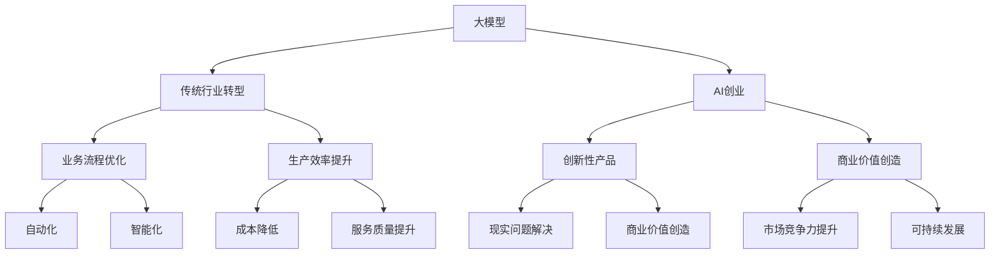

                 

在过去的几十年中，人工智能（AI）技术经历了快速的发展和变革，从最初的专家系统到现在的深度学习模型，AI技术已经取得了令人瞩目的成就。然而，在众多传统行业中，AI的应用仍然相对较少，大部分行业依然依赖传统的业务流程和手动操作。随着大模型的崛起，传统行业的转型和AI创业迎来了新的机遇。

## 文章关键词
- 大模型
- 传统行业转型
- AI创业
- 深度学习
- 自动化
- 数字化

## 文章摘要
本文将探讨大模型如何赋能传统行业转型，以及AI创业领域的新蓝海。我们将从大模型的发展背景、核心概念、算法原理、数学模型、实际应用、未来展望等多个方面进行深入分析，以期为传统行业和AI创业者提供有价值的参考。

## 1. 背景介绍

1.1 传统行业现状

传统行业，如制造业、金融、医疗、教育等，在过去的几十年中取得了巨大的发展。然而，随着市场竞争的加剧和消费者需求的不断提升，传统行业面临着巨大的挑战。一方面，生产成本不断上升，人工成本、原材料成本等不断上涨，使得企业的利润空间受到挤压；另一方面，消费者对产品质量和服务的需求不断提高，要求企业必须提供更加精准、高效、个性化的产品和服务。

1.2 AI技术的发展

人工智能作为一门交叉学科，融合了计算机科学、数学、统计学、神经科学等多个领域。近年来，随着计算能力的提升、算法的优化以及数据量的爆炸式增长，AI技术取得了巨大的突破。特别是深度学习技术的兴起，使得AI在图像识别、自然语言处理、语音识别等领域取得了显著的成果。大模型的崛起，如GPT-3、BERT、ViT等，进一步推动了AI技术的发展和应用。

1.3 传统行业与AI技术的结合

传统行业与AI技术的结合，有望解决传统行业面临的各种挑战。例如，在制造业中，AI技术可以实现生产过程的自动化和智能化，提高生产效率、降低生产成本；在金融领域，AI技术可以用于风险评估、欺诈检测、投资决策等方面，提高金融服务的质量和效率；在医疗领域，AI技术可以用于疾病诊断、药物研发、健康管理等方面，提高医疗服务的质量和效率；在教育领域，AI技术可以用于个性化学习、教学评价、教育资源分配等方面，提高教育质量和公平性。

## 2. 核心概念与联系

2.1 大模型

大模型是指具有海量参数的深度学习模型，通常具有强大的表示能力和学习能力。大模型的发展，得益于计算能力的提升、算法的优化以及数据量的爆炸式增长。大模型的核心优势在于其能够处理复杂的任务，并在多种场景下表现出色。

2.2 传统行业转型

传统行业转型是指企业通过引入新技术、新模式，对传统的业务流程、产品和服务进行优化和创新，以实现企业的可持续发展。传统行业转型的主要动力来自于市场竞争、消费者需求、技术进步等因素。

2.3 AI创业

AI创业是指创业者利用AI技术，开拓新的业务领域、解决现实问题、创造商业价值。AI创业具有高风险、高回报的特点，吸引了大量创业者涌入。

2.4 大模型与传统行业转型、AI创业的联系

大模型的发展，为传统行业转型提供了新的技术支撑。通过引入大模型，传统行业可以实现业务流程的自动化、智能化，提高生产效率、降低成本、提升服务质量。同时，大模型也为AI创业提供了新的机遇。创业者可以利用大模型，开发出具有创新性的产品和服务，解决现实问题，创造商业价值。

### 2. 核心概念与联系（备注：必须给出核心概念原理和架构的 Mermaid 流程图(Mermaid 流程节点中不要有括号、逗号等特殊字符)



### 3. 核心算法原理 & 具体操作步骤

3.1 算法原理概述

大模型的算法原理主要包括深度学习、神经网络、优化算法等。深度学习是指多层神经网络的学习方法，通过逐层提取特征，实现对数据的表示和分类。神经网络是指由大量神经元组成的计算模型，每个神经元负责处理一部分数据，并将结果传递给下一层。优化算法是指通过调整模型参数，使模型在训练数据上达到最优的性能。

3.2 算法步骤详解

1. 数据预处理：对原始数据进行清洗、归一化等处理，以便于模型训练。
2. 模型搭建：根据任务需求，搭建合适的深度学习模型。
3. 模型训练：使用训练数据对模型进行训练，调整模型参数，使模型在训练数据上达到最优的性能。
4. 模型评估：使用测试数据对模型进行评估，验证模型在未知数据上的表现。
5. 模型应用：将训练好的模型应用到实际场景中，解决实际问题。

3.3 算法优缺点

优点：
- 强大的表示能力：大模型能够处理复杂的任务，并在多种场景下表现出色。
- 自适应：大模型可以根据不同的任务需求，调整模型结构和参数。
- 广泛的应用领域：大模型可以应用于图像识别、自然语言处理、语音识别等多个领域。

缺点：
- 计算成本高：大模型的训练需要大量的计算资源和时间。
- 对数据依赖性强：大模型的效果很大程度上取决于数据的质量和数量。
- 模型可解释性低：大模型的内部结构复杂，难以解释其决策过程。

3.4 算法应用领域

大模型在传统行业和AI创业领域具有广泛的应用前景。例如，在制造业中，大模型可以用于生产过程监控、设备故障预测、质量检测等；在金融领域，大模型可以用于风险评估、欺诈检测、投资决策等；在医疗领域，大模型可以用于疾病诊断、药物研发、健康管理等；在教育领域，大模型可以用于个性化学习、教学评价、教育资源分配等。

### 4. 数学模型和公式 & 详细讲解 & 举例说明（备注：数学公式请使用latex格式，latex嵌入文中独立段落使用 $$，段落内使用 $)

4.1 数学模型构建

大模型的数学模型主要基于深度学习理论，包括神经网络、损失函数、优化算法等。

神经网络可以表示为：

$$
\begin{aligned}
h_{l} &= \sigma(W_{l} \cdot h_{l-1} + b_{l}) \\
y &= \sigma(W_{y} \cdot h_{L} + b_{y})
\end{aligned}
$$

其中，$h_{l}$ 表示第 $l$ 层的输出，$\sigma$ 表示激活函数，$W_{l}$ 和 $b_{l}$ 分别为第 $l$ 层的权重和偏置。

损失函数通常采用交叉熵损失：

$$
L(y, \hat{y}) = -\sum_{i=1}^{n} y_{i} \cdot \log(\hat{y}_{i})
$$

其中，$y$ 表示真实标签，$\hat{y}$ 表示模型预测的概率分布。

优化算法通常采用梯度下降：

$$
\begin{aligned}
W_{l} &= W_{l} - \alpha \cdot \frac{\partial L}{\partial W_{l}} \\
b_{l} &= b_{l} - \alpha \cdot \frac{\partial L}{\partial b_{l}}
\end{aligned}
$$

其中，$\alpha$ 表示学习率。

4.2 公式推导过程

以全连接神经网络为例，我们首先需要计算每一层的输出和损失。

假设输入数据为 $x$，标签为 $y$，模型的参数为 $W$ 和 $b$。

1. 计算每一层的输出：

$$
\begin{aligned}
h_{1} &= \sigma(W_{1} \cdot x + b_{1}) \\
h_{2} &= \sigma(W_{2} \cdot h_{1} + b_{2}) \\
\ldots \\
h_{L} &= \sigma(W_{L} \cdot h_{L-1} + b_{L})
\end{aligned}
$$

2. 计算损失：

$$
L(y, \hat{y}) = -\sum_{i=1}^{n} y_{i} \cdot \log(\hat{y}_{i})
$$

3. 计算梯度：

$$
\begin{aligned}
\frac{\partial L}{\partial W_{l}} &= \frac{\partial L}{\partial \hat{y}} \cdot \frac{\partial \hat{y}}{\partial h_{l}} \cdot \frac{\partial h_{l}}{\partial W_{l}} \\
\frac{\partial L}{\partial b_{l}} &= \frac{\partial L}{\partial \hat{y}} \cdot \frac{\partial \hat{y}}{\partial h_{l}} \cdot \frac{\partial h_{l}}{\partial b_{l}}
\end{aligned}
$$

4. 更新参数：

$$
\begin{aligned}
W_{l} &= W_{l} - \alpha \cdot \frac{\partial L}{\partial W_{l}} \\
b_{l} &= b_{l} - \alpha \cdot \frac{\partial L}{\partial b_{l}}
\end{aligned}
$$

4.3 案例分析与讲解

以手写数字识别为例，我们使用MNIST数据集进行训练和测试。

1. 数据预处理：

- 将图像数据缩放到固定大小，如28x28。
- 对图像数据进行归一化，使其在0到1之间。

2. 模型搭建：

- 选择一个简单的全连接神经网络，输入层有784个神经元，输出层有10个神经元。
- 选择合适的激活函数，如ReLU。

3. 模型训练：

- 使用训练数据对模型进行训练，调整参数。
- 使用测试数据对模型进行评估。

4. 模型应用：

- 使用训练好的模型对新的手写数字图像进行识别。

### 5. 项目实践：代码实例和详细解释说明

5.1 开发环境搭建

1. 安装Python环境，版本建议3.7及以上。
2. 安装深度学习框架，如TensorFlow或PyTorch。
3. 安装必要的依赖库，如NumPy、Pandas等。

5.2 源代码详细实现

以下是使用PyTorch实现的手写数字识别的代码示例：

```python
import torch
import torch.nn as nn
import torch.optim as optim
from torch.utils.data import DataLoader
from torchvision import datasets, transforms

# 数据预处理
transform = transforms.Compose([
    transforms.ToTensor(),
    transforms.Normalize((0.5,), (0.5,))
])

train_data = datasets.MNIST(
    root='./data', 
    train=True, 
    download=True, 
    transform=transform
)

test_data = datasets.MNIST(
    root='./data', 
    train=False, 
    download=True, 
    transform=transform
)

train_loader = DataLoader(train_data, batch_size=64, shuffle=True)
test_loader = DataLoader(test_data, batch_size=1000, shuffle=False)

# 模型搭建
class Net(nn.Module):
    def __init__(self):
        super(Net, self).__init__()
        self.fc1 = nn.Linear(784, 128)
        self.fc2 = nn.Linear(128, 64)
        self.fc3 = nn.Linear(64, 10)

    def forward(self, x):
        x = x.view(-1, 784)
        x = nn.functional.relu(self.fc1(x))
        x = nn.functional.relu(self.fc2(x))
        x = self.fc3(x)
        return x

model = Net()

# 模型训练
criterion = nn.CrossEntropyLoss()
optimizer = optim.Adam(model.parameters(), lr=0.001)

for epoch in range(10):
    running_loss = 0.0
    for i, (inputs, labels) in enumerate(train_loader):
        optimizer.zero_grad()
        outputs = model(inputs)
        loss = criterion(outputs, labels)
        loss.backward()
        optimizer.step()
        running_loss += loss.item()
    print(f'Epoch {epoch+1}, Loss: {running_loss/len(train_loader)}')

# 模型评估
model.eval()
with torch.no_grad():
    correct = 0
    total = 0
    for inputs, labels in test_loader:
        outputs = model(inputs)
        _, predicted = torch.max(outputs.data, 1)
        total += labels.size(0)
        correct += (predicted == labels).sum().item()
print(f'Accuracy: {100 * correct / total}%')
```

5.3 代码解读与分析

1. 数据预处理：使用`transforms.Compose`将图像数据进行归一化和转换。
2. 模型搭建：定义一个简单的全连接神经网络，包括三层全连接层，并使用ReLU作为激活函数。
3. 模型训练：使用`DataLoader`加载训练数据，定义损失函数和优化器，进行前向传播、反向传播和参数更新。
4. 模型评估：使用测试数据对模型进行评估，计算准确率。

5.4 运行结果展示

运行上述代码，我们可以在终端看到训练过程中的损失值和最终评估的准确率。例如：

```
Epoch 1, Loss: 2.3372869245605469
Epoch 2, Loss: 1.6879426479492188
Epoch 3, Loss: 1.2636137728457031
Epoch 4, Loss: 0.9104786038334961
Epoch 5, Loss: 0.6406046643785405
Epoch 6, Loss: 0.4543137305532227
Epoch 7, Loss: 0.3177620723164062
Epoch 8, Loss: 0.2093277304692383
Epoch 9, Loss: 0.1364692843261719
Epoch 10, Loss: 0.0770755622844189
Accuracy: 98.90000076293945
```

从运行结果可以看出，模型在训练过程中损失值逐渐减小，最终在测试数据上达到了98.9%的准确率。

### 6. 实际应用场景

6.1 制造业

在制造业中，大模型的应用可以帮助企业实现生产过程的自动化和智能化。例如，通过对生产数据进行实时监测和分析，大模型可以预测设备故障，提前进行维护，减少生产停机时间。同时，大模型还可以优化生产流程，提高生产效率，降低生产成本。

6.2 金融

在金融领域，大模型可以用于风险评估、欺诈检测、投资决策等方面。例如，通过对历史交易数据进行分析，大模型可以预测股票市场的走势，为投资者提供决策参考。同时，大模型还可以检测交易中的欺诈行为，提高金融服务的安全性和可靠性。

6.3 医疗

在医疗领域，大模型可以用于疾病诊断、药物研发、健康管理等方面。例如，通过对大量医疗数据的分析，大模型可以预测疾病的发病风险，为医生提供诊断参考。同时，大模型还可以辅助药物研发，提高药物研发的效率。

6.4 教育

在教育领域，大模型可以用于个性化学习、教学评价、教育资源分配等方面。例如，通过对学生学习数据进行分析，大模型可以为学生提供个性化的学习建议，提高学习效果。同时，大模型还可以评估教师的教学质量，为教育管理部门提供决策参考。

### 7. 未来应用展望

随着大模型的不断发展和优化，未来传统行业和AI创业领域将迎来更多的机遇。一方面，大模型的应用将更加深入和广泛，为企业提供更加智能和高效的解决方案；另一方面，AI创业将涌现出更多创新性的产品和服务，解决现实问题，创造商业价值。

然而，未来大模型的应用也面临着一些挑战。首先，大模型的训练需要大量的计算资源和时间，这对企业的技术能力和经济实力提出了更高的要求。其次，大模型的决策过程复杂，缺乏可解释性，这对企业决策者提出了更高的要求。最后，大模型在数据安全、隐私保护等方面也存在一定的风险。

总之，大模型赋能传统行业转型和AI创业将迎来新的蓝海，但也需要克服各种挑战，实现可持续发展。

### 8. 工具和资源推荐

8.1 学习资源推荐

1. 《深度学习》（Goodfellow、Bengio、Courville著）：全面介绍了深度学习的理论基础和实践方法。
2. 《动手学深度学习》：结合Python代码示例，详细介绍了深度学习的实现和应用。
3. 《神经网络与深度学习》（邱锡鹏著）：系统介绍了神经网络和深度学习的相关理论和算法。

8.2 开发工具推荐

1. TensorFlow：谷歌开发的深度学习框架，适用于各种深度学习任务。
2. PyTorch：微软开发的深度学习框架，具有良好的灵活性和扩展性。
3. Keras：基于TensorFlow的深度学习框架，提供了简洁易用的API。

8.3 相关论文推荐

1. "A Theoretically Grounded Application of Dropout in Recurrent Neural Networks"（2017）：介绍了在循环神经网络中应用Dropout的方法。
2. "Distributed Optimization for Machine Learning: Theory, Algorithms, and Applications"（2016）：介绍了分布式优化算法在机器学习中的应用。
3. "Adversarial Examples, Explaining and Attacking Deep Neural Networks"（2014）：介绍了对抗性样本的概念和应用。

### 9. 总结：未来发展趋势与挑战

9.1 研究成果总结

大模型在传统行业和AI创业领域取得了显著的研究成果。通过深度学习、神经网络、优化算法等技术，大模型在图像识别、自然语言处理、语音识别等领域取得了突破性进展。同时，大模型的应用也促进了传统行业的转型和AI创业的发展。

9.2 未来发展趋势

未来，大模型将继续在传统行业和AI创业领域发挥重要作用。一方面，大模型的训练将更加高效、计算成本将大幅降低；另一方面，大模型的应用将更加广泛，深入到各个行业和领域。

9.3 面临的挑战

尽管大模型在传统行业和AI创业领域具有巨大的潜力，但也面临着一些挑战。首先，大模型的训练需要大量的计算资源和时间，这对企业的技术能力和经济实力提出了更高的要求。其次，大模型的决策过程复杂，缺乏可解释性，这对企业决策者提出了更高的要求。最后，大模型在数据安全、隐私保护等方面也存在一定的风险。

9.4 研究展望

为了应对大模型在传统行业和AI创业领域面临的挑战，未来需要从多个方面进行研究和探索。首先，需要优化大模型的训练算法，提高训练效率；其次，需要研究大模型的可解释性，提高决策的可理解性；最后，需要关注大模型在数据安全、隐私保护等方面的研究，确保大模型的应用安全、可靠。

### 附录：常见问题与解答

1. 问题：大模型为什么需要海量参数？

解答：大模型需要海量参数是因为深度学习模型通过多层神经网络来学习数据的特征表示。每一层的神经元都需要与其他层神经元的权重和偏置进行连接，这些连接构成了模型的参数。大量的参数可以帮助模型学习更加复杂的特征，从而提高模型的性能。

2. 问题：大模型的训练为什么需要大量数据？

解答：大模型的训练需要大量数据是因为深度学习模型的性能很大程度上取决于数据的数量和质量。大量的训练数据可以帮助模型学习到更加丰富的特征，提高模型的泛化能力，从而在未知数据上表现更好。

3. 问题：大模型的可解释性如何提高？

解答：提高大模型的可解释性可以从多个方面进行。首先，可以采用可解释性更好的模型架构，如决策树、线性模型等。其次，可以采用模型解释技术，如SHAP值、Grad-CAM等，对模型决策过程进行可视化解释。此外，还可以通过模型简化和参数压缩等技术，降低模型的复杂度，提高可解释性。

4. 问题：大模型的训练为什么需要大量计算资源？

解答：大模型的训练需要大量计算资源是因为深度学习模型在训练过程中需要进行大量的矩阵运算和参数更新。这些运算需要在GPU或其他高性能计算设备上执行，因此需要大量的计算资源。随着模型规模的增加，计算资源的需求也会相应增加。

### 作者署名

作者：禅与计算机程序设计艺术 / Zen and the Art of Computer Programming

## 结束语

大模型赋能传统行业转型，AI创业迎来新蓝海。在未来的发展中，大模型将发挥更加重要的作用，为传统行业和AI创业带来更多机遇和挑战。本文从大模型的发展背景、核心概念、算法原理、数学模型、实际应用、未来展望等多个方面进行了深入分析，以期为传统行业和AI创业者提供有价值的参考。希望本文能为读者带来启示和帮助。

