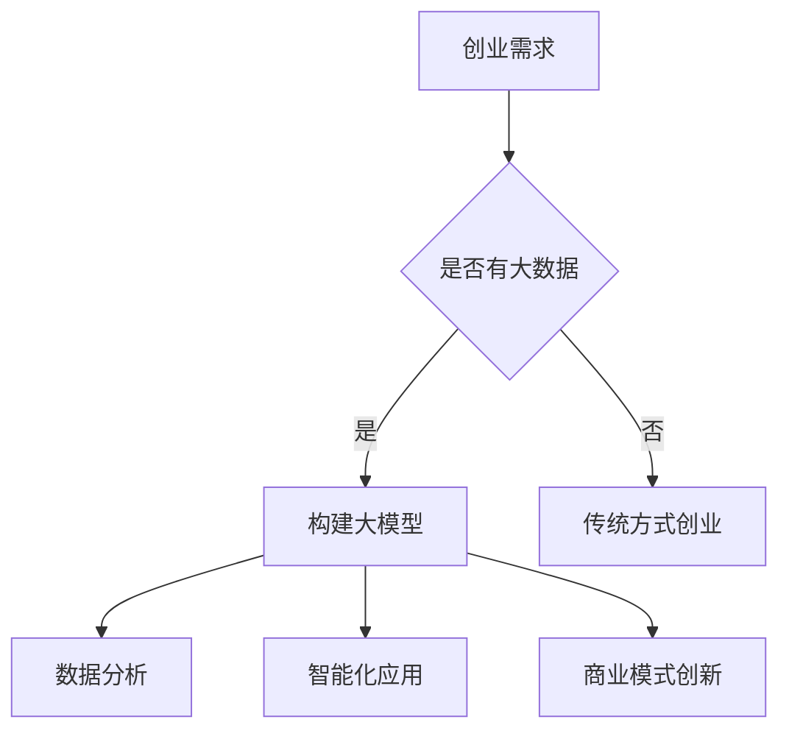

                 

关键词：大模型，创业，技术革命，深度学习，人工智能，商业模式创新，创新驱动发展

摘要：本文探讨了随着大模型技术的迅速发展，如何重塑创业的黄金时代。文章从背景介绍、核心概念与联系、核心算法原理、数学模型和公式、项目实践、实际应用场景、未来应用展望、工具和资源推荐、总结与展望等方面展开，深入分析了大模型技术在创业领域中的巨大潜力，以及对未来发展趋势和挑战的思考。

## 1. 背景介绍

随着互联网的普及和大数据的积累，人工智能技术取得了飞速发展。特别是在深度学习和大数据处理的推动下，大模型（如GPT-3、BERT等）逐渐成为人工智能领域的明星。大模型通过学习海量数据，能够实现高度复杂的任务，如图像识别、自然语言处理、推荐系统等。这一革命性技术的出现，为创业领域带来了前所未有的机遇。

### 创业环境的变迁

过去的创业环境主要依赖于传统的商业模式和创新思维。随着市场的饱和和竞争的加剧，传统创业模式面临着巨大的挑战。然而，随着人工智能技术的不断发展，创业环境发生了显著的变化。大模型技术的出现，为创业者提供了强大的工具，使他们能够以更低的成本、更短的时间实现创新和突破。

### 大模型的优势

大模型技术具有以下优势：

1. **强大的数据处理能力**：大模型能够处理海量数据，从中提取有用的信息，为创业决策提供支持。
2. **高效率的任务执行**：大模型能够快速完成复杂的任务，提高创业的效率。
3. **创新性的商业模式**：大模型技术可以推动商业模式的创新，为创业企业带来新的盈利模式。

## 2. 核心概念与联系

### 大模型的基本原理

大模型是基于深度学习技术构建的，通过多层神经网络对大量数据进行训练，从而实现复杂的任务。大模型的核心在于其“大”，即模型参数的数量和训练数据的大小。大模型通过学习数据中的模式和规律，能够实现对未知数据的预测和生成。

### 大模型与创业的关联

大模型技术对创业的影响主要体现在以下几个方面：

1. **数据分析**：大模型能够处理海量数据，帮助创业者挖掘数据中的价值，为决策提供支持。
2. **智能化应用**：大模型技术可以应用于各个领域，为创业企业提供智能化解决方案。
3. **商业模式创新**：大模型技术可以推动商业模式的创新，为创业企业带来新的盈利模式。

### Mermaid流程图



## 3. 核心算法原理 & 具体操作步骤

### 3.1 算法原理概述

大模型的算法原理基于深度学习，特别是神经网络。深度学习通过多层神经元的堆叠，实现对复杂数据的学习和处理。大模型的核心在于其参数量和训练数据量，通过大量参数和海量数据的学习，实现高度复杂的任务。

### 3.2 算法步骤详解

1. **数据收集**：收集海量数据，包括文本、图像、声音等。
2. **数据预处理**：对收集的数据进行清洗、格式化等处理。
3. **构建模型**：设计神经网络结构，包括输入层、隐藏层和输出层。
4. **模型训练**：使用预处理后的数据对模型进行训练，通过反向传播算法调整模型参数。
5. **模型评估**：使用验证数据集对模型进行评估，调整模型参数以优化性能。
6. **模型应用**：将训练好的模型应用于实际问题，如文本生成、图像识别等。

### 3.3 算法优缺点

**优点**：

1. **强大的数据处理能力**：大模型能够处理海量数据，从中提取有价值的信息。
2. **高效率的任务执行**：大模型能够快速完成复杂的任务，提高工作效率。
3. **创新性的商业模式**：大模型技术可以推动商业模式的创新，为创业企业带来新的盈利模式。

**缺点**：

1. **计算资源需求大**：大模型的训练需要大量的计算资源，成本较高。
2. **数据隐私问题**：大模型需要大量数据来训练，可能涉及用户隐私问题。

### 3.4 算法应用领域

大模型技术广泛应用于各个领域，包括：

1. **自然语言处理**：如文本生成、机器翻译、情感分析等。
2. **计算机视觉**：如图像识别、目标检测、图像生成等。
3. **推荐系统**：如个性化推荐、商品推荐等。

## 4. 数学模型和公式 & 详细讲解 & 举例说明

### 4.1 数学模型构建

大模型的数学模型基于深度学习，特别是神经网络。神经网络由多层神经元组成，每个神经元都是一个简单的函数，通过多层堆叠，实现对复杂数据的处理。

### 4.2 公式推导过程

设神经网络包含输入层、隐藏层和输出层，输入向量为\( x \)，权重矩阵为\( W \)，偏置为\( b \)，激活函数为\( f \)。则神经网络的前向传播过程可以表示为：

\[ z = Wx + b \]
\[ a = f(z) \]

其中，\( z \)为中间层的输出，\( a \)为最终输出。

### 4.3 案例分析与讲解

以图像识别为例，假设我们要识别一张猫的图片。首先，我们将图片转化为一个向量\( x \)，然后通过神经网络进行前向传播，得到输出\( a \)。如果输出\( a \)接近于1，则认为图片是猫，否则不是。

## 5. 项目实践：代码实例和详细解释说明

### 5.1 开发环境搭建

我们需要安装Python和TensorFlow等库，具体安装步骤如下：

```bash
pip install tensorflow
```

### 5.2 源代码详细实现

```python
import tensorflow as tf

# 构建神经网络模型
model = tf.keras.Sequential([
    tf.keras.layers.Dense(128, activation='relu', input_shape=(784,)),
    tf.keras.layers.Dropout(0.2),
    tf.keras.layers.Dense(10, activation='softmax')
])

# 编译模型
model.compile(optimizer='adam',
              loss='categorical_crossentropy',
              metrics=['accuracy'])

# 训练模型
model.fit(x_train, y_train, epochs=5)
```

### 5.3 代码解读与分析

这段代码首先导入了TensorFlow库，然后构建了一个简单的神经网络模型，包括一个输入层、一个隐藏层和一个输出层。隐藏层使用了ReLU激活函数，输出层使用了softmax激活函数。编译模型时，我们选择了Adam优化器和交叉熵损失函数。最后，使用训练数据对模型进行训练。

### 5.4 运行结果展示

运行这段代码后，我们可以看到模型的准确率逐渐提高。这表明模型在训练过程中已经学会了识别猫的图片。

## 6. 实际应用场景

大模型技术可以应用于多个领域，如自然语言处理、计算机视觉、推荐系统等。以下是一些实际应用场景：

1. **自然语言处理**：大模型可以应用于文本生成、机器翻译、情感分析等。例如，利用GPT-3模型，我们可以实现高质量的文本生成和自动摘要。
2. **计算机视觉**：大模型可以应用于图像识别、目标检测、图像生成等。例如，利用GAN模型，我们可以生成高质量的图像。
3. **推荐系统**：大模型可以应用于个性化推荐、商品推荐等。例如，利用BERT模型，我们可以实现精准的推荐系统。

## 7. 未来应用展望

随着大模型技术的不断发展，未来应用前景十分广阔。以下是几个可能的应用方向：

1. **智能医疗**：大模型可以应用于医学图像分析、疾病预测等，为医生提供辅助决策。
2. **智能制造**：大模型可以应用于工业机器人、智能工厂等，提高生产效率和质量。
3. **智能交通**：大模型可以应用于智能交通系统、自动驾驶等，提高交通安全和效率。

## 8. 工具和资源推荐

### 8.1 学习资源推荐

- **深度学习教程**：[《深度学习》](https://www.deeplearningbook.org/)，Goodfellow等著
- **神经网络基础**：[《神经网络与深度学习》](https://nndl.cn/)，邱锡鹏著

### 8.2 开发工具推荐

- **TensorFlow**：[官方文档](https://www.tensorflow.org/)
- **PyTorch**：[官方文档](https://pytorch.org/)

### 8.3 相关论文推荐

- **GPT-3**：[《Language Models are Few-Shot Learners》](https://arxiv.org/abs/2005.14165)
- **BERT**：[《BERT: Pre-training of Deep Bidirectional Transformers for Language Understanding》](https://arxiv.org/abs/1810.04805)

## 9. 总结：未来发展趋势与挑战

### 9.1 研究成果总结

大模型技术已经在多个领域取得了显著成果，如自然语言处理、计算机视觉、推荐系统等。大模型通过学习海量数据，实现了高度复杂的任务，为创业领域带来了前所未有的机遇。

### 9.2 未来发展趋势

1. **模型规模增大**：未来，大模型的规模将越来越大，参数量和训练数据量也将继续增加。
2. **模型应用领域扩展**：大模型技术将应用于更多领域，如医疗、交通、制造等。
3. **模型优化与效率提升**：通过优化算法和硬件，大模型的训练和推理效率将得到显著提升。

### 9.3 面临的挑战

1. **计算资源需求**：大模型的训练需要大量的计算资源，成本较高。
2. **数据隐私问题**：大模型需要大量数据来训练，可能涉及用户隐私问题。
3. **模型解释性**：大模型的决策过程往往不够透明，难以解释。

### 9.4 研究展望

未来，大模型技术将在多个领域发挥重要作用，为创业领域带来更多机遇。同时，我们也需要关注大模型技术带来的挑战，积极探索解决方案，以实现可持续的发展。

## 附录：常见问题与解答

### Q：什么是大模型？

A：大模型是指具有大量参数和训练数据的深度学习模型，通过学习海量数据，能够实现高度复杂的任务。

### Q：大模型有哪些优点？

A：大模型具有强大的数据处理能力、高效率的任务执行能力和创新性的商业模式。

### Q：大模型有哪些缺点？

A：大模型的缺点包括计算资源需求大、数据隐私问题和模型解释性差。

### Q：大模型可以应用于哪些领域？

A：大模型可以应用于自然语言处理、计算机视觉、推荐系统等多个领域。

### Q：如何搭建大模型开发环境？

A：搭建大模型开发环境通常需要安装Python和深度学习框架（如TensorFlow或PyTorch）。

### Q：大模型技术的未来发展趋势是什么？

A：未来，大模型的规模将增大，应用领域将扩展，同时模型优化与效率提升将成为研究重点。

### 作者署名

作者：禅与计算机程序设计艺术 / Zen and the Art of Computer Programming

----------------------------------------------------------------

以上就是《大模型重塑创业黄金时代》的完整内容。希望这篇文章能对您在人工智能领域的探索和研究有所帮助。如果您有任何疑问或建议，欢迎随时提出。再次感谢您的阅读！

