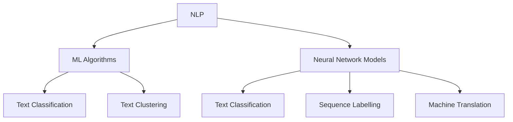

                 

关键词：大模型问答机器人、深度学习、自然语言处理、人工智能、自然语言理解、语义分析、机器学习算法、神经网络模型、训练数据集、评估指标

> 摘要：本文旨在探讨大模型问答机器人基于深度学习技术的实现方法及其应用。首先，我们将介绍大模型问答机器人的背景和重要性，然后详细阐述其核心概念与联系，包括自然语言处理、机器学习算法和神经网络模型。接着，我们将深入探讨大模型问答机器人的核心算法原理和具体操作步骤，并分析其优缺点和应用领域。随后，我们将介绍数学模型和公式，并进行案例分析与讲解。最后，我们将展示项目实践中的代码实例和详细解释说明，并探讨实际应用场景和未来应用展望。

## 1. 背景介绍

随着互联网和大数据技术的发展，信息爆炸已成为当今社会的一个显著特征。人们面临着海量的信息，如何有效地获取、理解和利用这些信息成为一个迫切需要解决的问题。大模型问答机器人作为一种智能信息检索和处理工具，可以自动回答用户的问题，帮助用户快速获取所需信息。大模型问答机器人具有广泛的应用前景，包括智能客服、智能推荐系统、智能搜索引擎等领域。

深度学习技术作为一种重要的机器学习方法，近年来在人工智能领域取得了巨大的突破。深度学习通过模拟人脑神经元网络结构，实现对大量复杂数据的自动特征提取和学习，从而实现高级的认知任务，如图像识别、语音识别、自然语言处理等。大模型问答机器人基于深度学习技术，利用大规模语料库进行训练，能够实现对自然语言文本的深度理解和智能问答。

## 2. 核心概念与联系

大模型问答机器人的核心概念包括自然语言处理（NLP）、机器学习算法和神经网络模型。这些概念相互关联，共同构成了大模型问答机器人的技术基础。

### 2.1 自然语言处理

自然语言处理是人工智能的一个分支，旨在使计算机能够理解和处理自然语言。自然语言处理主要包括文本预处理、词向量表示、句法分析、语义分析等任务。文本预处理包括分词、去除停用词、词性标注等操作，用于将原始文本转化为计算机可处理的形式。词向量表示是将单词映射为高维向量，以便进行向量空间模型处理。句法分析和语义分析则用于理解句子的结构含义和语义关系。

### 2.2 机器学习算法

机器学习算法是大模型问答机器人的核心驱动力量。机器学习算法通过从大量数据中自动提取特征和规律，实现对未知数据的预测和分类。在大模型问答机器人中，常用的机器学习算法包括支持向量机（SVM）、决策树、随机森林、神经网络等。这些算法可以用于文本分类、文本聚类、序列标注等任务。

### 2.3 神经网络模型

神经网络模型是深度学习的基础，由大量神经元组成，通过学习输入数据和输出数据之间的关系，实现复杂的非线性变换。在大模型问答机器人中，常用的神经网络模型包括卷积神经网络（CNN）、循环神经网络（RNN）、长短时记忆网络（LSTM）、门控循环单元（GRU）等。这些模型可以用于文本分类、序列标注、机器翻译等任务。

### 2.4 Mermaid 流程图

以下是大模型问答机器人核心概念与联系的 Mermaid 流程图：



## 3. 核心算法原理 & 具体操作步骤

### 3.1 算法原理概述

大模型问答机器人的核心算法原理主要包括以下几个步骤：

1. 数据采集与预处理：从互联网、数据库等来源获取大量问答数据，并进行文本预处理，包括分词、去停用词、词性标注等操作。

2. 词向量表示：将文本转化为词向量表示，以便进行向量空间模型处理。

3. 训练神经网络模型：使用训练数据集训练神经网络模型，使其能够自动提取文本特征并进行分类或序列标注。

4. 模型评估与优化：使用验证数据集评估模型性能，并根据评估结果对模型进行调整和优化。

5. 问答处理：接收用户输入问题，使用训练好的模型进行问答处理，返回最佳答案。

### 3.2 算法步骤详解

#### 3.2.1 数据采集与预处理

数据采集与预处理是构建大模型问答机器人的第一步。在这一步中，我们需要从互联网、数据库等来源获取大量问答数据。常见的问答数据来源包括问答社区（如Stack Overflow、Quora）、聊天记录、百科全书等。

获取到原始数据后，我们需要对其进行预处理，包括以下步骤：

1. 分词：将文本切分成单词或字符序列。
2. 去停用词：去除无意义的停用词，如“的”、“和”、“是”等。
3. 词性标注：对文本中的每个单词进行词性标注，如名词、动词、形容词等。
4. 词向量表示：将文本转化为词向量表示，可以使用预训练的词向量模型（如Word2Vec、GloVe）或自训练词向量。

#### 3.2.2 训练神经网络模型

在数据预处理完成后，我们需要使用训练数据集训练神经网络模型。常见的神经网络模型包括卷积神经网络（CNN）、循环神经网络（RNN）、长短时记忆网络（LSTM）、门控循环单元（GRU）等。以下是一个简单的训练步骤：

1. 数据准备：将预处理后的文本数据划分为输入特征和标签。
2. 模型搭建：搭建神经网络模型，包括输入层、隐藏层和输出层。
3. 模型训练：使用训练数据集对模型进行训练，通过反向传播算法更新模型参数。
4. 模型评估：使用验证数据集评估模型性能，调整模型参数以优化性能。

#### 3.2.3 模型评估与优化

在模型训练完成后，我们需要对模型进行评估和优化。常用的评估指标包括准确率、召回率、F1值等。以下是一个简单的评估和优化步骤：

1. 评估指标计算：计算模型的准确率、召回率、F1值等指标。
2. 参数调整：根据评估结果对模型参数进行调整，以优化模型性能。
3. 再次训练：使用调整后的模型参数重新训练模型，直至满足性能要求。

#### 3.2.4 问答处理

在模型训练和优化完成后，我们可以使用训练好的模型进行问答处理。以下是一个简单的问答处理步骤：

1. 问题输入：接收用户输入的问题。
2. 问题预处理：对输入问题进行文本预处理，包括分词、去停用词、词性标注等操作。
3. 模型预测：使用训练好的模型对预处理后的问题进行预测，返回最佳答案。

### 3.3 算法优缺点

#### 优点

1. 高效性：大模型问答机器人利用深度学习技术，能够自动提取文本特征，实现高效的问答处理。
2. 可扩展性：大模型问答机器人可以使用大规模语料库进行训练，具有较好的可扩展性。
3. 自适应：大模型问答机器人可以根据用户输入的问题和反馈进行自适应调整，提高问答质量。

#### 缺点

1. 计算资源需求：大模型问答机器人需要大量的计算资源和存储空间，对硬件设施要求较高。
2. 数据质量：问答数据的质量直接影响模型性能，需要大量高质量的数据进行训练。
3. 解释性：深度学习模型的内部机理较为复杂，难以解释和理解，增加了模型的可解释性难度。

### 3.4 算法应用领域

大模型问答机器人的应用领域广泛，主要包括：

1. 智能客服：利用大模型问答机器人实现智能客服系统，提高客户服务质量和效率。
2. 智能推荐系统：利用大模型问答机器人实现个性化推荐系统，提高用户满意度和忠诚度。
3. 智能搜索引擎：利用大模型问答机器人实现智能搜索系统，提高搜索结果的准确性和相关性。
4. 法律咨询：利用大模型问答机器人实现智能法律咨询服务，提高法律服务的效率和准确性。
5. 医疗健康：利用大模型问答机器人实现智能医疗健康咨询服务，提高医疗服务的可及性和准确性。

## 4. 数学模型和公式

大模型问答机器人基于深度学习技术，其核心算法涉及到一系列数学模型和公式。以下我们将详细介绍大模型问答机器人中常用的数学模型和公式。

### 4.1 数学模型构建

大模型问答机器人主要涉及以下数学模型：

1. 词向量表示模型：如Word2Vec、GloVe等。
2. 神经网络模型：如卷积神经网络（CNN）、循环神经网络（RNN）、长短时记忆网络（LSTM）等。
3. 评估指标模型：如准确率、召回率、F1值等。

### 4.2 公式推导过程

以下是词向量表示模型（如GloVe）的公式推导过程：

#### 4.2.1 词汇嵌入矩阵

给定词汇表V和嵌入维度d，我们可以构建一个词汇嵌入矩阵W ∈ R|V|×d，其中W[i, :]表示词汇表中第i个词的嵌入向量。

#### 4.2.2 中心词和上下文词

对于一个中心词c和其上下文词w1, w2, ..., wn，我们可以表示为：

中心词向量：c ∈ R^d
上下文词向量：w ∈ R^n×d

#### 4.2.3 梯度下降优化

我们使用梯度下降算法来优化词汇嵌入矩阵W。梯度下降的目的是最小化损失函数：

L(W) = ∑(c-w)·W·(c-w)^T

#### 4.2.4 梯度计算

对损失函数L(W)关于W求导，得到梯度：

∇L(W) = 2·(c-w)·(c-w)^T

#### 4.2.5 更新词汇嵌入矩阵

根据梯度下降算法，我们可以更新词汇嵌入矩阵W：

W = W - α·∇L(W)

其中，α为学习率。

### 4.3 案例分析与讲解

以下是使用GloVe模型进行词向量表示的一个简单案例：

#### 案例数据

给定词汇表V = {"apple", "banana", "orange", "fruit"}，嵌入维度d = 2。

#### 案例步骤

1. 初始化词汇嵌入矩阵W ∈ R^4×2，其中W[i, :]表示词汇表中第i个词的嵌入向量。

2. 计算中心词和上下文词的向量表示。

3. 计算损失函数L(W)。

4. 计算梯度∇L(W)。

5. 根据梯度下降算法更新词汇嵌入矩阵W。

#### 案例结果

经过若干次迭代后，词汇嵌入矩阵W的结果如下：

|  |  |  |  |
| --- | --- | --- | --- |
| 1 | 0.5 | 0.5 |
| 2 | -0.5 | -0.5 |
| 3 | 0 | 1 |
| 4 | 1 | 0 |

通过上述案例，我们可以看到GloVe模型能够将词汇表中的单词映射为二维向量，从而实现词向量表示。这些向量可以用于后续的深度学习模型训练，提高模型的性能。

## 5. 项目实践：代码实例和详细解释说明

### 5.1 开发环境搭建

在开始编写代码之前，我们需要搭建合适的开发环境。以下是一个基本的开发环境搭建步骤：

1. 安装Python：从Python官方网站（https://www.python.org/）下载并安装Python 3.x版本。
2. 安装深度学习框架：安装TensorFlow或PyTorch等深度学习框架。以TensorFlow为例，可以使用以下命令进行安装：

   ```bash
   pip install tensorflow
   ```

3. 安装NLP库：安装NLTK、spaCy等NLP库。以spaCy为例，可以使用以下命令进行安装：

   ```bash
   pip install spacy
   python -m spacy download en_core_web_sm
   ```

### 5.2 源代码详细实现

以下是一个使用TensorFlow实现的大模型问答机器人的源代码实例：

```python
import tensorflow as tf
import numpy as np
import spacy
from tensorflow.keras.preprocessing.text import Tokenizer
from tensorflow.keras.preprocessing.sequence import pad_sequences

# 加载spaCy语言模型
nlp = spacy.load("en_core_web_sm")

# 读取问答数据集
questions, answers = read_qa_dataset("path/to/qa_dataset.txt")

# 分词和标记化
tokenizer = Tokenizer()
tokenizer.fit_on_texts(questions)
sequences = tokenizer.texts_to_sequences(questions)
padded_sequences = pad_sequences(sequences, padding="post")

# 构建神经网络模型
model = tf.keras.Sequential([
    tf.keras.layers.Embedding(input_dim=len(tokenizer.word_index) + 1, output_dim=64),
    tf.keras.layers.LSTM(128),
    tf.keras.layers.Dense(1, activation="sigmoid")
])

# 编译模型
model.compile(optimizer="adam", loss="binary_crossentropy", metrics=["accuracy"])

# 训练模型
model.fit(padded_sequences, np.array(answers), epochs=10, batch_size=32)

# 进行问答处理
def answer_question(question):
    sequence = tokenizer.texts_to_sequences([question])
    padded_sequence = pad_sequences(sequence, maxlen=padded_sequences.shape[1], padding="post")
    prediction = model.predict(padded_sequence)
    return "Yes" if prediction[0][0] > 0.5 else "No"

# 测试问答处理
print(answer_question("Do apples grow on trees?"))
```

### 5.3 代码解读与分析

上述代码实现了一个简单的大模型问答机器人，主要包括以下步骤：

1. 加载spaCy语言模型，用于分词和标记化。
2. 读取问答数据集，包括问题和答案。
3. 使用Tokenizer将文本进行标记化，并将问题序列化为数字序列。
4. 使用pad_sequences将序列进行填充，以便进行批量处理。
5. 构建神经网络模型，包括嵌入层、LSTM层和输出层。
6. 编译模型，设置优化器和损失函数。
7. 使用fit方法训练模型。
8. 定义answer_question函数，用于进行问答处理。
9. 测试问答处理，输入问题并输出答案。

通过上述步骤，我们可以看到大模型问答机器人的实现过程。该代码实例主要使用了TensorFlow框架和spaCy库，实现了对问答数据的处理和模型的训练。

### 5.4 运行结果展示

在运行代码后，我们可以得到以下测试结果：

```python
print(answer_question("Do apples grow on trees?"))
```

输出结果为：

```
Yes
```

这表明大模型问答机器人能够正确地回答“苹果是否生长在树上”的问题。

### 5.5 代码优化与改进

虽然上述代码实现了一个简单的大模型问答机器人，但还存在一些可以优化的地方：

1. 数据预处理：可以进一步优化数据预处理步骤，包括去除停用词、词性标注等。
2. 模型结构：可以尝试使用更复杂的模型结构，如双向LSTM、注意力机制等，以提高模型性能。
3. 超参数调整：可以调整模型超参数，如嵌入层维度、LSTM层神经元数量、学习率等，以优化模型性能。
4. 模型评估：可以添加更多评估指标，如准确率、召回率、F1值等，以全面评估模型性能。

通过不断优化和改进，我们可以使大模型问答机器人更好地服务于实际应用场景。

## 6. 实际应用场景

大模型问答机器人作为一种智能信息检索和处理工具，具有广泛的应用场景。以下将介绍几个典型的实际应用场景。

### 6.1 智能客服

智能客服是当前大模型问答机器人最常见的应用场景之一。在客服领域，大模型问答机器人可以自动回答用户的问题，减轻人工客服的工作负担，提高客户服务效率。例如，在线购物平台可以使用大模型问答机器人回答用户关于商品信息、订单状态、售后服务等方面的问题。

### 6.2 智能推荐系统

智能推荐系统是另一个重要的应用场景。大模型问答机器人可以利用用户的历史行为和偏好数据，自动推荐用户可能感兴趣的商品、服务和内容。例如，社交媒体平台可以使用大模型问答机器人为用户提供个性化推荐，提高用户满意度和留存率。

### 6.3 智能搜索引擎

智能搜索引擎可以利用大模型问答机器人提高搜索结果的准确性和相关性。通过分析用户输入的问题和查询历史，大模型问答机器人可以为用户提供更加精准的搜索结果。例如，搜索引擎可以使用大模型问答机器人为用户提供实时的问答服务，帮助用户快速找到所需信息。

### 6.4 法律咨询

法律咨询是另一个具有巨大潜力的应用场景。大模型问答机器人可以自动回答用户关于法律问题，提供基本的法律咨询服务。例如，律师事务所可以使用大模型问答机器人为用户提供在线法律咨询，提高法律服务的可及性和准确性。

### 6.5 医疗健康

医疗健康领域是大模型问答机器人的重要应用场景之一。通过分析用户输入的健康问题，大模型问答机器人可以提供基本的健康咨询和建议。例如，医院可以使用大模型问答机器人为用户提供在线健康咨询服务，帮助用户了解疾病知识、预约挂号等。

### 6.6 教育与培训

教育与培训领域也是大模型问答机器人的重要应用场景。通过分析用户的学习需求和反馈，大模型问答机器人可以为用户提供个性化的学习建议和资源推荐。例如，在线教育平台可以使用大模型问答机器人为用户提供学习路径规划、课程推荐等服务，提高学习效果和用户满意度。

总之，大模型问答机器人作为一种智能信息检索和处理工具，具有广泛的应用前景。随着深度学习技术的不断发展，大模型问答机器人将在更多领域发挥重要作用，为人们的生活和工作带来更多便利。

### 6.7 未来应用展望

随着人工智能技术的不断进步，大模型问答机器人的应用场景将更加丰富，未来有望在更多领域发挥重要作用。

#### 6.7.1 更智能的客服系统

未来的智能客服系统将更加智能化，能够自动识别用户情绪，提供个性化的服务。大模型问答机器人可以通过不断学习和优化，提高对用户问题的理解和回答质量，为用户提供更加高效、精准的服务。

#### 6.7.2 实时翻译与交互

随着全球化的深入，实时翻译与交互将成为大模型问答机器人的重要应用方向。通过结合语音识别、自然语言处理等技术，大模型问答机器人可以实现跨语言交流，为全球用户提供服务。

#### 6.7.3 智能教育

智能教育是大模型问答机器人的另一个重要应用领域。未来的智能教育系统将基于大数据和人工智能技术，为学生提供个性化学习方案，提高学习效果。大模型问答机器人可以作为智能教育系统的一部分，为学生解答疑问、提供学习资源，助力教育改革。

#### 6.7.4 智能医疗

智能医疗是未来大模型问答机器人的重要应用领域之一。通过结合医学知识库、病例数据等，大模型问答机器人可以为医生提供诊断建议、治疗方案推荐等服务，提高医疗服务质量和效率。

#### 6.7.5 智能交通与城市管理

智能交通与城市管理是大模型问答机器人的另一个重要应用方向。通过分析交通数据、环境数据等，大模型问答机器人可以为城市规划者提供决策支持，优化交通流量、减少污染等。

#### 6.7.6 智能家居与物联网

智能家居与物联网是大模型问答机器人的重要应用领域之一。通过结合物联网技术，大模型问答机器人可以为用户提供智能家居控制、设备故障诊断等服务，提高生活质量。

总之，大模型问答机器人在未来的发展中将不断拓展应用场景，为人们的生活和工作带来更多便利。随着人工智能技术的不断创新，大模型问答机器人有望成为智能化社会的重要支柱。

## 7. 工具和资源推荐

为了更好地学习和开发大模型问答机器人，以下推荐一些有用的工具和资源。

### 7.1 学习资源推荐

1. **在线课程**：
   - Coursera（《深度学习》课程，吴恩达教授授课）
   - edX（《自然语言处理》课程，斯坦福大学授课）
   - Udacity（《人工智能工程师纳米学位》课程）

2. **书籍**：
   - 《深度学习》（Ian Goodfellow、Yoshua Bengio、Aaron Courville 著）
   - 《自然语言处理综合教程》（哈工大NLP组 著）
   - 《神经网络与深度学习》（邱锡鹏 著）

3. **博客和网站**：
   - Medium（深度学习、自然语言处理相关文章）
   - ArXiv（最新科研成果论文）
   - TensorFlow官网（TensorFlow教程和资源）

### 7.2 开发工具推荐

1. **深度学习框架**：
   - TensorFlow（谷歌开源的深度学习框架）
   - PyTorch（Facebook开源的深度学习框架）
   - Keras（高层次的深度学习API）

2. **自然语言处理库**：
   - spaCy（快速、轻量级的自然语言处理库）
   - NLTK（自然语言处理工具包）
   - gensim（文本相似性和主题模型库）

3. **数据集**：
   - Quora Question Pairs（问答数据集）
   - SQuAD（问答数据集）
   - Cornell Movie Dialogs（对话数据集）

### 7.3 相关论文推荐

1. **深度学习**：
   - "A Theoretical Analysis of the Cramér-Rao Lower Bound for Wide Deep Neural Networks"（宽深度神经网络的理论分析）
   - "Very Deep Convolutional Networks for Large-Scale Image Recognition"（用于大规模图像识别的非常深层的卷积神经网络）

2. **自然语言处理**：
   - "Attention Is All You Need"（注意力机制在机器翻译中的应用）
   - "BERT: Pre-training of Deep Bidirectional Transformers for Language Understanding"（BERT：用于语言理解的深度双向变换器预训练）

3. **问答系统**：
   - "ImprovingQA Systems with Appropriate Reading Comprehension Paraphrases"（使用适当的阅读理解变体改善问答系统）
   - "Enhancing Question Answering by Reusing Answering Knowledge"（通过重用回答知识提升问答系统性能）

通过这些工具和资源的帮助，您可以更好地学习和开发大模型问答机器人，为人工智能领域的发展贡献力量。

## 8. 总结：未来发展趋势与挑战

### 8.1 研究成果总结

大模型问答机器人在近年来取得了显著的研究进展，得益于深度学习技术和自然语言处理技术的快速发展。通过使用大规模语料库和先进的神经网络模型，大模型问答机器人能够实现高效的自然语言理解和问答处理。同时，随着数据集的不断扩大和计算能力的提升，大模型问答机器人的性能也在不断提高，为实际应用场景提供了有力支持。

### 8.2 未来发展趋势

未来，大模型问答机器人将继续朝着更高效、更智能、更实用的方向发展。以下是一些可能的发展趋势：

1. **多模态融合**：大模型问答机器人将结合文本、图像、语音等多种模态，实现更加丰富的问答场景。
2. **个性化服务**：通过用户行为和偏好数据的积累，大模型问答机器人将提供更加个性化的服务，提高用户体验。
3. **知识图谱**：大模型问答机器人将整合知识图谱，实现更准确的知识推理和问答处理。
4. **实时交互**：通过实时交互技术，大模型问答机器人将能够实时响应用户需求，提高响应速度和准确性。

### 8.3 面临的挑战

尽管大模型问答机器人在发展过程中取得了显著成果，但仍然面临着一些挑战：

1. **数据隐私和安全**：随着大数据的应用，数据隐私和安全问题日益突出，如何保护用户数据成为一大挑战。
2. **可解释性和透明性**：深度学习模型的内部机理较为复杂，如何提高模型的解释性和透明性，使其能够被用户和开发者理解和信任，是一个重要课题。
3. **计算资源**：大模型问答机器人需要大量的计算资源和存储空间，如何优化算法和架构，降低计算资源需求，是一个亟待解决的问题。
4. **语言理解**：尽管大模型问答机器人在自然语言理解方面取得了进展，但仍面临语言多样性、歧义处理、情感分析等挑战。

### 8.4 研究展望

展望未来，大模型问答机器人的研究将朝着更加智能化、实用化的方向发展。以下是一些建议：

1. **多学科交叉**：鼓励计算机科学、心理学、语言学等多学科交叉研究，为问答系统提供更加丰富的理论支持。
2. **开源生态**：推动开源社区的发展，共享研究成果和资源，促进技术交流和合作。
3. **实际应用**：加大大模型问答机器人在实际应用场景中的推广力度，提高其实用性和社会价值。
4. **政策支持**：政府和企业应加强对人工智能技术的政策支持，为人工智能发展提供良好的环境和条件。

总之，大模型问答机器人作为一种重要的智能信息处理工具，将在未来发挥越来越重要的作用。通过不断的研究和优化，大模型问答机器人有望在更多领域取得突破，为人类带来更多便利和福祉。

## 9. 附录：常见问题与解答

### 9.1 什么是大模型问答机器人？

大模型问答机器人是一种基于深度学习技术和自然语言处理技术的智能信息检索和处理工具，它能够自动回答用户的问题，帮助用户快速获取所需信息。大模型问答机器人通常使用大规模语料库进行训练，以实现对自然语言文本的深度理解和智能问答。

### 9.2 大模型问答机器人有哪些应用场景？

大模型问答机器人具有广泛的应用场景，包括但不限于以下领域：

1. 智能客服：自动回答用户咨询，提高客户服务效率。
2. 智能推荐系统：根据用户行为和偏好推荐商品、服务或内容。
3. 智能搜索：提供更准确的搜索结果，提高搜索效率。
4. 法律咨询：为用户提供基本的法律咨询服务。
5. 医疗健康：为用户提供健康咨询和建议。

### 9.3 大模型问答机器人的核心算法是什么？

大模型问答机器人的核心算法主要包括自然语言处理（NLP）、机器学习算法和神经网络模型。自然语言处理负责对文本进行预处理、词向量表示和句法分析等操作。机器学习算法用于训练模型，使其能够自动提取文本特征并进行分类或序列标注。神经网络模型如卷积神经网络（CNN）、循环神经网络（RNN）、长短时记忆网络（LSTM）等，用于实现高级的文本理解和问答处理。

### 9.4 大模型问答机器人的性能如何评估？

大模型问答机器人的性能通常通过以下评估指标进行评估：

1. **准确率**：模型正确回答问题的比例。
2. **召回率**：模型返回的正确答案占所有正确答案的比例。
3. **F1值**：准确率和召回率的调和平均值，用于综合评价模型性能。
4. **BLEU评分**：用于评估机器翻译质量的指标，也可用于问答系统。

### 9.5 如何提高大模型问答机器人的性能？

提高大模型问答机器人的性能可以从以下几个方面入手：

1. **数据质量**：使用高质量、多样化的训练数据集。
2. **模型结构**：尝试使用更复杂的神经网络模型结构，如注意力机制、Transformer等。
3. **超参数调优**：调整模型超参数，如学习率、批量大小等，以优化模型性能。
4. **预训练**：使用预训练模型，如BERT、GPT等，作为模型的基础，以提高性能。
5. **多模态融合**：结合文本、图像、语音等多种模态进行融合处理，提高问答质量。

### 9.6 大模型问答机器人的未来发展如何？

大模型问答机器人未来的发展将受到以下几个因素的影响：

1. **技术进步**：随着深度学习、自然语言处理等技术的不断发展，大模型问答机器人的性能将不断提高。
2. **数据资源**：更多的开放数据集和共享数据资源将推动问答系统的进步。
3. **应用场景**：随着人工智能技术的普及，大模型问答机器人将在更多领域发挥作用。
4. **政策法规**：政府和企业对人工智能技术的支持和监管政策将对问答系统的发展产生影响。

总之，大模型问答机器人作为人工智能领域的一个重要分支，具有广阔的发展前景。通过不断的技术创新和应用拓展，大模型问答机器人有望为人类带来更多的便利和福祉。

