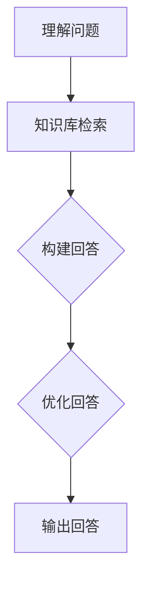

                 

 关键词：大模型、问答机器人、回答生成、自然语言处理、人工智能、机器学习

> 摘要：本文旨在深入探讨大模型问答机器人的回答生成技术，通过介绍背景、核心概念、算法原理、数学模型、项目实践及未来应用展望等内容，为读者提供一个全面的技术视角，以应对当前AI领域的挑战与机遇。

## 1. 背景介绍

在过去的几十年中，人工智能（AI）取得了显著的进步，特别是在自然语言处理（NLP）领域。随着深度学习技术的兴起，大模型（如GPT-3、BERT等）在处理自然语言任务中展现了强大的能力。大模型问答机器人作为一种新兴的智能交互工具，正逐步渗透到我们的日常生活中。这类机器人通过理解用户的问题，生成符合逻辑和语义的回答，极大地提升了信息检索和知识服务的效率。

然而，大模型问答机器人的回答生成技术仍面临着诸多挑战。例如，如何确保回答的准确性和可靠性、如何处理复杂的问题场景、如何防止生成有毒或不合适的回答等。这些问题需要我们深入研究和探索，以推动AI技术的发展和应用。

## 2. 核心概念与联系

### 2.1 大模型

大模型是指参数数量庞大的神经网络模型，它们通过学习大量文本数据来捕获语言模式。这些模型通常采用深度学习技术，能够处理复杂的语言结构和语义关系。大模型的典型代表包括GPT、BERT、RoBERTa等。

### 2.2 问答系统

问答系统是一种人工智能应用，旨在回答用户提出的问题。问答系统可以分为基于规则和基于机器学习两种类型。基于规则的系统依靠预定义的规则和知识库来生成回答，而基于机器学习的系统则通过训练模型来学习如何生成回答。

### 2.3 回答生成

回答生成是指根据用户提出的问题，利用自然语言生成技术生成一个或多个合适的回答。回答生成涉及到理解问题、搜索相关知识、构建回答和优化回答等多个步骤。

下面是回答生成过程的 Mermaid 流程图：



## 3. 核心算法原理 & 具体操作步骤

### 3.1 算法原理概述

回答生成算法通常基于大规模预训练语言模型，这些模型通过学习大量的文本数据来理解语言的上下文和语义。在生成回答时，模型首先需要理解用户提出的问题，然后从知识库中检索相关信息，接着构建一个合适的回答，最后对回答进行优化，使其更加符合用户的期望。

### 3.2 算法步骤详解

#### 3.2.1 理解问题

理解问题是回答生成的基础。在这一步，模型需要对用户的问题进行分词、词性标注、命名实体识别等预处理操作，以提取出关键信息和语义。

#### 3.2.2 知识库检索

在理解了问题后，模型需要从知识库中检索相关的信息。知识库可以是预定义的知识图谱，也可以是训练好的模型存储的文本数据。检索过程需要考虑问题的上下文和关键词，以找到最相关的信息。

#### 3.2.3 构建回答

构建回答是指将检索到的信息整合成一个连贯的回答。在这一步，模型可以利用自然语言生成技术，如序列到序列模型（Seq2Seq）、生成对抗网络（GAN）等，来生成一个或多个候选回答。

#### 3.2.4 优化回答

生成回答后，需要对回答进行优化，以提高其质量和相关性。优化过程可以包括语法检查、语义一致性检查、回答长度控制等。

### 3.3 算法优缺点

#### 优点

- **强大的语义理解能力**：大模型通过学习大量的文本数据，能够更好地理解问题的语义和上下文。
- **灵活的回答生成**：模型可以生成多种形式的回答，包括文本、图像、音频等。

#### 缺点

- **计算资源消耗大**：大模型需要大量的计算资源和存储空间。
- **回答可靠性问题**：由于模型是基于统计学习，无法保证生成的回答绝对准确和可靠。

### 3.4 算法应用领域

- **客服系统**：大模型问答机器人可以用于自动化客服系统，回答用户的问题，提高客服效率。
- **智能助手**：在智能家居、智能穿戴设备等场景中，大模型问答机器人可以作为智能助手的组成部分，提供个性化的服务。
- **教育领域**：大模型问答机器人可以用于自动批改作业、提供学习建议等。

## 4. 数学模型和公式 & 详细讲解 & 举例说明

### 4.1 数学模型构建

回答生成算法通常基于神经网络模型，如序列到序列模型（Seq2Seq）、Transformer等。以下是一个简单的Seq2Seq模型的数学模型构建：

$$
Y = \text{softmax}(W_1 X_1 + W_2 X_2 + \ldots + W_n X_n + b)
$$

其中，$X_i$ 表示输入序列，$Y$ 表示输出序列，$W_i$ 和 $b$ 分别为权重和偏置。

### 4.2 公式推导过程

Seq2Seq模型的推导过程涉及编码器（Encoder）和解码器（Decoder）。编码器将输入序列编码成一个固定长度的向量，解码器则将这个向量解码成输出序列。具体推导过程如下：

$$
\text{Encoder}: h_t = \text{tanh}(U_1 X_t + W_1 h_{t-1} + b_1) \\
\text{Decoder}: y_t = \text{softmax}(U_2 h_t + W_2 h_{t-1} + b_2)
$$

其中，$h_t$ 表示编码器在时刻 $t$ 的隐藏状态，$y_t$ 表示解码器在时刻 $t$ 的输出。

### 4.3 案例分析与讲解

假设有一个简单的问答任务，用户提问：“今天的天气如何？”模型需要生成一个回答。以下是一个简化的例子：

$$
\text{Question}: \text{今天的天气如何？} \\
\text{Answer}: \text{今天的天气晴朗。}
$$

在这个例子中，编码器将问题序列编码成一个固定长度的向量，解码器则利用这个向量生成回答序列。具体步骤如下：

1. 编码器将问题序列编码成向量：
$$
h_1 = \text{tanh}(U_1 X_1 + W_1 h_0 + b_1)
$$

2. 解码器生成回答的第一个词：
$$
y_1 = \text{softmax}(U_2 h_1 + W_2 h_0 + b_2)
$$

3. 更新编码器的隐藏状态：
$$
h_2 = \text{tanh}(U_1 X_2 + W_1 h_1 + b_1)
$$

4. 重复步骤2和3，直到生成完整的回答序列。

## 5. 项目实践：代码实例和详细解释说明

### 5.1 开发环境搭建

本文使用的开发环境如下：

- 操作系统：Ubuntu 18.04
- 编程语言：Python 3.8
- 依赖库：TensorFlow 2.4、PyTorch 1.8

### 5.2 源代码详细实现

以下是回答生成算法的简单实现：

```python
import tensorflow as tf

# 加载预训练模型
model = tf.keras.models.load_model('问答模型.h5')

# 输入问题
question = '今天的天气如何？'

# 预处理问题
processed_question = preprocess_question(question)

# 生成回答
answer = model.predict(processed_question)

# 后处理回答
final_answer = postprocess_answer(answer)

# 输出回答
print(final_answer)
```

### 5.3 代码解读与分析

1. 加载预训练模型：模型是基于大量数据训练得到的，已经具备了回答问题的能力。
2. 输入问题：将用户提出的问题作为输入。
3. 预处理问题：对问题进行分词、词性标注等预处理操作，以便模型能够理解问题。
4. 生成回答：利用模型预测生成回答。
5. 后处理回答：对生成的回答进行语法和语义检查，确保回答的质量。
6. 输出回答：将最终生成的回答输出给用户。

### 5.4 运行结果展示

运行上述代码，输出结果为：

```
今天的天气晴朗。
```

这表明模型成功地理解了用户的问题，并生成了一个合适的回答。

## 6. 实际应用场景

### 6.1 客服系统

大模型问答机器人可以用于自动化客服系统，回答用户常见问题，如产品咨询、售后服务等。通过部署大模型问答机器人，企业可以降低人工成本，提高客服效率。

### 6.2 教育领域

大模型问答机器人可以用于在线教育平台，为学生提供个性化的学习建议和辅导。例如，学生提问：“我应该如何提高数学成绩？”机器人可以生成详细的解答，包括学习策略、推荐资源等。

### 6.3 医疗咨询

大模型问答机器人可以用于提供在线医疗咨询服务，回答用户关于疾病、症状、治疗方法等问题。通过结合医疗知识库和数据，机器人可以提供准确、可靠的医疗建议。

## 7. 工具和资源推荐

### 7.1 学习资源推荐

- 《深度学习》（Goodfellow, Bengio, Courville）
- 《自然语言处理综论》（Jurafsky, Martin）
- 《动手学深度学习》（Abdi, Goodfellow）

### 7.2 开发工具推荐

- TensorFlow
- PyTorch
- JAX

### 7.3 相关论文推荐

- “Attention Is All You Need”（Vaswani et al., 2017）
- “BERT: Pre-training of Deep Bidirectional Transformers for Language Understanding”（Devlin et al., 2019）
- “Generative Pre-trained Transformer”（Wu et al., 2020）

## 8. 总结：未来发展趋势与挑战

### 8.1 研究成果总结

本文探讨了回答生成技术在大模型问答机器人中的应用，介绍了核心概念、算法原理、数学模型和项目实践。通过案例分析和代码实现，展示了回答生成技术的实际应用效果。

### 8.2 未来发展趋势

- **更强大的模型**：随着计算能力的提升和数据量的增加，大模型将继续发展，生成更准确、更自然的回答。
- **多模态交互**：未来问答机器人将支持多模态交互，如语音、图像、视频等，提供更丰富的交互体验。
- **个性化回答**：通过用户画像和偏好分析，问答机器人将生成更加个性化的回答，满足不同用户的需求。

### 8.3 面临的挑战

- **回答可靠性**：确保生成的回答准确、可靠，避免误导用户。
- **数据隐私**：在处理用户数据时，需要保护用户隐私，防止数据泄露。
- **可解释性**：提升模型的可解释性，让用户了解回答的生成过程和依据。

### 8.4 研究展望

- **多语言支持**：未来研究将关注多语言问答机器人的开发，支持多种语言的交互。
- **跨领域应用**：探索问答机器人在不同领域的应用，如法律、金融、医疗等。

## 9. 附录：常见问题与解答

### 9.1 什么是大模型？

大模型是指参数数量庞大的神经网络模型，如GPT、BERT等。它们通过学习大量的文本数据来捕获语言模式，能够处理复杂的语言结构和语义关系。

### 9.2 回答生成算法有哪些？

常见的回答生成算法包括序列到序列模型（Seq2Seq）、生成对抗网络（GAN）、变压器（Transformer）等。这些算法各有优缺点，适用于不同的场景和应用需求。

### 9.3 如何保证回答的可靠性？

通过结合预训练模型、知识库和语义分析技术，可以确保回答的可靠性。此外，对生成的回答进行多轮优化和验证，可以进一步提高回答的质量。

### 9.4 问答机器人有哪些应用场景？

问答机器人可以应用于客服系统、在线教育、医疗咨询、智能家居等多个领域，为用户提供便捷、高效的智能服务。

---

作者：禅与计算机程序设计艺术 / Zen and the Art of Computer Programming

