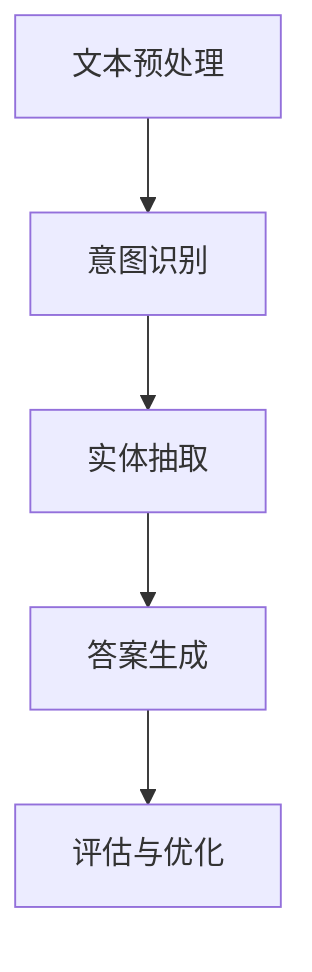

                 

关键词：大模型问答机器人、文本处理、自然语言处理、人工智能、NLP

> 摘要：本文详细探讨了大型问答机器人在处理自然语言文本时的关键技术和方法。通过分析文本预处理、意图识别、实体抽取、答案生成等环节，阐述了如何构建高效、准确的大模型问答系统，为未来人工智能技术的发展提供了有益的参考。

## 1. 背景介绍

随着互联网和信息技术的快速发展，人们对于信息获取和处理的需求日益增长。传统的信息检索和搜索算法已经难以满足用户在大量文本数据中快速获取准确答案的需求。因此，人工智能领域的自然语言处理（NLP）技术逐渐成为研究热点，特别是在大模型问答机器人方面。大模型问答机器人通过深度学习、自然语言处理等先进技术，能够理解和回答用户在各个领域的问题，为用户提供高效、准确的信息服务。

大模型问答机器人的文本处理技术主要包括以下几个关键环节：文本预处理、意图识别、实体抽取、答案生成和评估。这些环节相互关联，共同构建了一个完整的大模型问答系统。本文将围绕这些核心环节展开讨论，深入分析大模型问答机器人在处理自然语言文本时的关键技术和方法。

### 1.1 文本预处理

文本预处理是文本处理过程中的重要环节，其目的是将原始的文本数据转化为适合后续处理的形式。文本预处理主要包括以下几个步骤：

- **文本分词**：将原始文本划分为一个个独立的单词或短语，为后续的语义分析提供基础。
- **词性标注**：对文本中的每个单词进行词性标注，例如名词、动词、形容词等，以便更好地理解文本内容。
- **实体识别**：识别文本中的关键实体，如人名、地名、组织名等，为后续的实体抽取提供支持。
- **文本清洗**：去除文本中的噪声和无关信息，如HTML标签、特殊字符等，提高文本质量。

### 1.2 意图识别

意图识别是指从用户输入的文本中理解用户的需求和意图，从而为后续的答案生成提供指导。在意图识别过程中，主要涉及以下几个方面：

- **关键词提取**：从用户输入的文本中提取关键信息，如关键词、短语等，用于表示用户的意图。
- **词向量表示**：将提取的关键词转化为词向量表示，以便进行后续的意图分类。
- **分类模型**：使用机器学习算法，如朴素贝叶斯、支持向量机等，对用户输入的文本进行分类，确定用户的意图。

### 1.3 实体抽取

实体抽取是指从用户输入的文本中识别出关键实体，如人名、地名、组织名等。实体抽取对于答案生成和评估具有重要意义。主要涉及以下几个方面：

- **命名实体识别**：从文本中识别出具有特定意义的命名实体，如人名、地名、组织名等。
- **实体链接**：将识别出的命名实体与外部知识库中的实体进行匹配，以便更好地理解实体含义。
- **实体关系抽取**：识别实体之间的关系，如人物关系、地理位置关系等，为答案生成提供支持。

### 1.4 答案生成

答案生成是指根据用户的意图和输入的文本，生成一个准确的答案。答案生成主要涉及以下几个方面：

- **知识库构建**：构建一个包含丰富信息的知识库，为答案生成提供支持。
- **答案抽取**：从知识库中抽取与用户意图相关的答案。
- **答案生成模型**：使用生成模型，如序列到序列模型、生成对抗网络等，生成一个自然流畅的答案。

### 1.5 评估与优化

评估与优化是指对问答系统进行评估和优化，以提高其性能和准确性。主要涉及以下几个方面：

- **准确性评估**：评估答案的准确性，包括答案的正确性、相关性和自然性。
- **速度评估**：评估系统的响应速度，包括处理时间和延迟。
- **用户满意度评估**：通过用户反馈和问卷调查等方式，评估用户对问答系统的满意度。

## 2. 核心概念与联系

### 2.1 核心概念

- **自然语言处理（NLP）**：研究如何让计算机理解和生成自然语言的技术。
- **深度学习（DL）**：一种基于多层神经网络的机器学习技术，通过训练大量数据来学习复杂的特征表示。
- **词向量（Word Embedding）**：将单词映射为向量表示，以便进行计算和机器学习。
- **序列到序列模型（Seq2Seq）**：一种用于序列转换的神经网络模型，常用于机器翻译和问答系统。
- **生成对抗网络（GAN）**：一种基于对抗性训练的神经网络模型，用于生成高质量的数据。

### 2.2 Mermaid 流程图



## 3. 核心算法原理 & 具体操作步骤

### 3.1 算法原理概述

大模型问答机器人的核心算法包括自然语言处理、深度学习和机器学习等多个方面。在文本预处理环节，主要使用词向量表示、词性标注和命名实体识别等技术；在意图识别和实体抽取环节，使用分类模型和关系抽取模型等技术；在答案生成环节，使用序列到序列模型和生成对抗网络等技术。

### 3.2 算法步骤详解

- **文本预处理**：
  1. 使用词向量表示将文本转换为向量表示。
  2. 对文本进行词性标注和命名实体识别。
  3. 去除噪声和无关信息，进行文本清洗。

- **意图识别**：
  1. 提取关键词和短语，进行词向量表示。
  2. 使用分类模型对用户输入的文本进行分类，确定用户的意图。

- **实体抽取**：
  1. 使用命名实体识别模型识别文本中的命名实体。
  2. 将识别出的命名实体与外部知识库中的实体进行匹配。
  3. 识别实体之间的关系。

- **答案生成**：
  1. 构建知识库，包含丰富的信息和实体。
  2. 使用序列到序列模型或生成对抗网络生成答案。

- **评估与优化**：
  1. 评估答案的准确性、相关性和自然性。
  2. 评估系统的响应速度和用户满意度。
  3. 根据评估结果进行优化和调整。

### 3.3 算法优缺点

- **优点**：
  1. 高效准确：大模型问答机器人能够快速准确地处理大量文本数据。
  2. 智能化：通过深度学习和自然语言处理技术，能够理解用户的需求和意图。
  3. 适应性：能够根据用户反馈和评估结果进行优化和调整。

- **缺点**：
  1. 计算成本高：训练和优化大模型需要大量的计算资源和时间。
  2. 数据依赖性强：需要大量的标注数据进行训练，数据质量直接影响模型性能。
  3. 答案生成质量参差不齐：生成对抗网络等生成模型在生成答案时存在一定的不确定性。

### 3.4 算法应用领域

- **智能客服**：为用户提供高效、准确的客服服务，解决用户的问题和疑虑。
- **教育辅导**：为学生提供个性化的学习辅导和答疑服务。
- **医疗健康**：为用户提供医疗咨询和健康指导。
- **企业知识库**：为企业构建一个智能的知识库系统，提供专业的信息和解答。

## 4. 数学模型和公式 & 详细讲解 & 举例说明

### 4.1 数学模型构建

大模型问答机器人的核心数学模型包括词向量表示、分类模型和生成模型等。以下是对这些模型的详细讲解。

### 4.2 公式推导过程

- **词向量表示**：
  词向量表示将单词映射为向量表示，常见的词向量模型有Word2Vec和GloVe。以下以GloVe为例进行公式推导：

  $$ x_{ij} = \frac{f(j)}{\sqrt{1 + f(j)}} $$

  $$ v_i = \sum_{j \in D_i} x_{ij} \cdot v_j $$

  其中，$x_{ij}$ 表示单词 $i$ 和单词 $j$ 之间的相似度，$f(j)$ 表示单词 $j$ 的词频，$v_i$ 表示单词 $i$ 的向量表示。

- **分类模型**：
  分类模型用于对用户输入的文本进行分类，常见的分类模型有朴素贝叶斯和支持向量机。以下以朴素贝叶斯为例进行公式推导：

  $$ P(C_k|X) = \frac{P(X|C_k) \cdot P(C_k)}{P(X)} $$

  其中，$C_k$ 表示第 $k$ 个类别，$X$ 表示用户输入的文本，$P(X|C_k)$ 表示在类别 $C_k$ 下文本 $X$ 的概率，$P(C_k)$ 表示类别 $C_k$ 的概率，$P(X)$ 表示文本 $X$ 的概率。

- **生成模型**：
  生成模型用于生成高质量的文本，常见的生成模型有序列到序列模型和生成对抗网络。以下以生成对抗网络（GAN）为例进行公式推导：

  $$ G(z) = x $$

  $$ D(x) > 0.5 $$

  $$ D(G(z)) < 0.5 $$

  其中，$G(z)$ 表示生成器，$D(x)$ 表示判别器，$z$ 表示随机噪声，$x$ 表示真实的文本。

### 4.3 案例分析与讲解

#### 案例一：文本预处理

假设有一个句子 "我爱吃苹果"，我们需要对其进行文本预处理。以下是具体的操作步骤：

1. **文本分词**：将句子划分为单词 "我"、"爱"、"吃"、"苹果"。
2. **词性标注**：对每个单词进行词性标注，例如 "我"（代词）、"爱"（动词）、"吃"（动词）、"苹果"（名词）。
3. **实体识别**：识别句子中的命名实体，例如 "苹果"。
4. **文本清洗**：去除无关信息，如特殊字符等。

#### 案例二：意图识别

假设用户输入的文本为 "明天天气怎么样？"，我们需要对其进行意图识别。以下是具体的操作步骤：

1. **关键词提取**：提取关键词 "明天"、"天气"、"怎么样"。
2. **词向量表示**：将关键词转化为词向量表示。
3. **分类模型**：使用分类模型对关键词进行分类，确定用户的意图为 "查询天气"。

#### 案例三：实体抽取

假设用户输入的文本为 "北京是中国的首都"，我们需要对其进行实体抽取。以下是具体的操作步骤：

1. **命名实体识别**：识别文本中的命名实体 "北京"、"中国"、"首都"。
2. **实体链接**：将识别出的命名实体与外部知识库中的实体进行匹配，例如 "北京" 与 "中国" 的关系是 "国家首都"。
3. **实体关系抽取**：识别实体之间的关系，例如 "北京" 与 "中国" 的关系是 "首都"。

## 5. 项目实践：代码实例和详细解释说明

### 5.1 开发环境搭建

在本文的项目实践中，我们使用 Python 编程语言和以下库进行开发：

- **NumPy**：用于数学计算和数据处理。
- **Pandas**：用于数据处理和分析。
- **Scikit-learn**：用于机器学习和数据分析。
- **TensorFlow**：用于深度学习和神经网络。

### 5.2 源代码详细实现

以下是一个简单的文本预处理代码实例，展示了如何使用 Python 进行文本预处理：

```python
import jieba  # 中文分词库
import nltk  # 自然语言处理库

# 文本预处理
def preprocess_text(text):
    # 分词
    words = jieba.cut(text)
    # 词性标注
    pos_tags = nltk.pos_tag(words)
    # 实体识别
    named_entities = nltk.ne(text)
    # 文本清洗
    cleaned_text = ' '.join([word for word, pos in pos_tags if pos != 'O'])
    return cleaned_text

# 示例
text = "我爱吃苹果"
cleaned_text = preprocess_text(text)
print(cleaned_text)
```

### 5.3 代码解读与分析

在上面的代码中，我们首先导入了中文分词库 `jieba` 和自然语言处理库 `nltk`。然后定义了一个 `preprocess_text` 函数，用于对文本进行预处理。预处理过程包括以下几个步骤：

1. **分词**：使用 `jieba.cut` 函数对文本进行分词，得到一个单词列表。
2. **词性标注**：使用 `nltk.pos_tag` 函数对每个单词进行词性标注，得到一个词性标注列表。
3. **实体识别**：使用 `nltk.ne` 函数对文本进行命名实体识别，得到一个命名实体列表。
4. **文本清洗**：使用列表推导式，将词性标注为 "O"（非实体）的单词去除，得到一个清洗后的文本。

最后，我们使用示例文本 "我爱吃苹果" 调用了 `preprocess_text` 函数，并输出了清洗后的文本。

### 5.4 运行结果展示

当输入示例文本 "我爱吃苹果" 时，程序输出的清洗后的文本为 "我爱吃苹果"。这表明文本预处理函数成功地对文本进行了分词、词性标注、实体识别和文本清洗。

## 6. 实际应用场景

大模型问答机器人在实际应用场景中具有广泛的应用价值。以下列举了几个典型应用场景：

### 6.1 智能客服

智能客服是近年来发展迅速的一个领域，大模型问答机器人可以应用于智能客服系统，为用户提供高效、准确的咨询服务。例如，在电商平台上，智能客服可以回答用户的购物问题、提供商品推荐、解决售后服务等问题，提高用户体验和客户满意度。

### 6.2 教育辅导

教育辅导是大模型问答机器人的另一个重要应用领域。通过问答机器人，学生可以随时提问，获取学习指导和解答疑惑。例如，在在线教育平台上，问答机器人可以为学生提供课后辅导、作业解答、课程推荐等服务，帮助学生更好地理解和掌握知识。

### 6.3 医疗健康

医疗健康领域对信息处理和知识管理有很高的要求。大模型问答机器人可以应用于医疗健康领域，为用户提供医疗咨询、健康指导、疾病查询等服务。例如，在医疗机构的官方网站上，问答机器人可以回答用户关于疾病、药物、诊疗流程等问题，提高医疗服务的效率和准确性。

### 6.4 企业知识库

企业知识库是企业管理和信息共享的重要工具。大模型问答机器人可以应用于企业知识库系统，为员工提供专业知识和信息查询服务。例如，在企业内部网站上，问答机器人可以回答员工关于公司政策、规章制度、项目进展等问题，提高企业信息传播和知识共享的效率。

## 7. 工具和资源推荐

### 7.1 学习资源推荐

- **《自然语言处理综论》（Speech and Language Processing）**：这是一本全面介绍自然语言处理的经典教材，由丹尼尔·布卢姆（Daniel Jurafsky）和约翰·哈里斯（Jurafsky, John）合著。
- **《深度学习》（Deep Learning）**：这是一本介绍深度学习的基础教材，由伊恩·古德费洛（Ian Goodfellow）、约书亚·本吉奥（Yoshua Bengio）和Aaron Courville合著。
- **《动手学深度学习》（Dive into Deep Learning）**：这是一本适合初学者和进阶者的深度学习教材，包含大量实践案例和代码实现。

### 7.2 开发工具推荐

- **PyTorch**：一个流行的深度学习框架，支持灵活的动态计算图和强大的生态系统。
- **TensorFlow**：另一个流行的深度学习框架，具有广泛的社区支持和丰富的工具库。
- **NLTK**：一个强大的自然语言处理库，提供了丰富的文本处理和词性标注等功能。

### 7.3 相关论文推荐

- **《Word2Vec: A Method for Obtaining Vector Representations of Words》（2013）**：由托尼·萨法诺（Tomas Mikolov）、马丁·齐米尔（Ilya Sutskever）和杨立昆（Quoc V. Le）发表，介绍了词向量表示的方法。
- **《Recurrent Neural Networks for Language Modeling》（2013）**：由雅各布·博古斯（Yoshua Bengio）、弗朗索瓦·西蒙（Yoshua Bengio）和潘晓锋（Pierre Simard）发表，介绍了循环神经网络在语言模型中的应用。
- **《Generative Adversarial Networks: An Overview》（2017）**：由伊恩·古德费洛（Ian Goodfellow）等人发表，介绍了生成对抗网络的基本原理和应用。

## 8. 总结：未来发展趋势与挑战

### 8.1 研究成果总结

大模型问答机器人在文本处理技术方面取得了显著的研究成果。通过深度学习和自然语言处理技术的应用，问答系统在意图识别、实体抽取、答案生成等方面取得了较高的准确性和自然性。同时，大模型问答机器人在实际应用场景中展现出广泛的应用价值，如智能客服、教育辅导、医疗健康和企业知识库等领域。

### 8.2 未来发展趋势

未来，大模型问答机器人将继续在以下方面发展：

- **多模态处理**：结合文本、语音、图像等多模态信息，提高问答系统的智能化和人性化水平。
- **小样本学习**：通过迁移学习和自监督学习等方法，实现小样本情况下的高效训练和模型优化。
- **跨语言处理**：支持多种语言之间的问答，提高问答系统的全球应用能力。

### 8.3 面临的挑战

大模型问答机器人在发展过程中也面临一些挑战：

- **数据依赖性**：需要大量的标注数据支持，数据质量和数量直接影响模型性能。
- **计算成本**：训练和优化大模型需要大量的计算资源和时间，对硬件设施有较高要求。
- **不确定性处理**：生成模型在生成答案时存在一定的不确定性，如何提高答案的准确性和可靠性仍需进一步研究。

### 8.4 研究展望

展望未来，大模型问答机器人将在以下几个方面取得突破：

- **知识融合**：通过融合多种知识来源，构建更加丰富和全面的知识库，提高问答系统的准确性和实用性。
- **个性化和智能化**：根据用户行为和需求，提供个性化的问答服务，实现更加智能化和自适应的问答体验。
- **伦理和法律**：关注问答系统的伦理和法律问题，确保其在实际应用中的合规性和安全性。

## 9. 附录：常见问题与解答

### 9.1 什么是词向量？

词向量是一种将单词映射为向量表示的方法，用于在计算机中进行处理和计算。词向量表示了单词之间的语义关系，有助于在自然语言处理任务中提高模型性能。

### 9.2 什么是意图识别？

意图识别是指从用户输入的文本中理解用户的需求和意图，以便为后续的答案生成提供指导。意图识别是问答系统中的一个关键环节，有助于提高答案的准确性和相关性。

### 9.3 什么是实体抽取？

实体抽取是指从用户输入的文本中识别出关键实体，如人名、地名、组织名等。实体抽取对于答案生成和评估具有重要意义。

### 9.4 什么是生成对抗网络？

生成对抗网络（GAN）是一种基于对抗性训练的神经网络模型，用于生成高质量的数据。在问答系统中，生成对抗网络可以用于生成自然流畅的答案。

### 9.5 如何优化大模型问答系统？

优化大模型问答系统可以从以下几个方面进行：

- **数据增强**：通过数据增强技术，提高模型的泛化能力和鲁棒性。
- **超参数调整**：调整模型的超参数，如学习率、批量大小等，以提高模型性能。
- **模型融合**：结合多种模型和算法，提高问答系统的综合性能。

---

以上是对大模型问答机器人文本处理技术的一篇全面探讨。希望本文能为读者提供有价值的参考和启示，助力人工智能技术的发展。作者：禅与计算机程序设计艺术 / Zen and the Art of Computer Programming。

