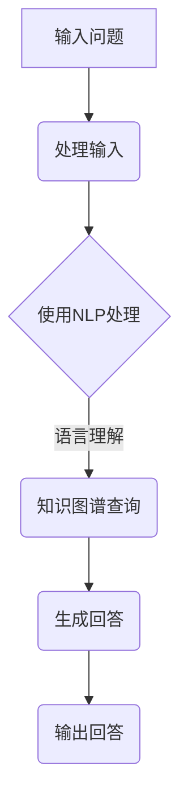

                 

关键词：大模型，问答机器人，智能化，算法，数学模型，应用场景，发展趋势，挑战

> 摘要：本文从大模型问答机器人的智能化程度出发，探讨了其在计算机图灵奖获得者唐纳德·赫布（Donald Hebb）提出的“联想主义”框架下的工作原理。通过分析核心算法、数学模型及实际应用场景，本文旨在为读者提供一幅全面、深入的智能化问答机器人图景，并展望其未来发展。

## 1. 背景介绍

大模型问答机器人的概念起源于深度学习领域，它通过训练大规模神经网络模型来模拟人类的问答过程。随着计算机算力的提升和大数据技术的进步，大模型问答机器人的智能化程度取得了显著提高。这些模型能够理解自然语言、回答问题，甚至具备一定的推理和判断能力。

本文旨在探讨大模型问答机器人在当前技术环境下的智能化程度，并分析其核心算法、数学模型及其在实际应用场景中的表现。

## 2. 核心概念与联系

### 2.1 大模型问答机器人的核心概念

- **深度学习**：深度学习是构建大模型问答机器人基础，它通过多层神经网络模拟人脑的学习机制，从而实现高效的数据处理和模式识别。

- **自然语言处理（NLP）**：NLP是使大模型问答机器人理解自然语言的关键技术，它包括语言理解、语言生成等任务。

- **知识图谱**：知识图谱用于构建大模型问答机器人的知识库，为问答提供准确的背景信息。

### 2.2 核心概念的联系

图 1 大模型问答机器人的核心概念与联系

```
+-------------------+
|   深度学习        |
+-------------------+
           |
           |
           |
+-------------------+
|   自然语言处理    |
+-------------------+
           |
           |
           |
+-------------------+
|   知识图谱       |
+-------------------+
```

### 2.3 Mermaid 流程图



## 3. 核心算法原理 & 具体操作步骤

### 3.1 算法原理概述

大模型问答机器人的核心算法通常基于变换器（Transformer）架构，这种架构能够通过自注意力机制捕捉长距离依赖关系，从而提高模型的问答能力。

### 3.2 算法步骤详解

#### 3.2.1 输入处理

1. 接收用户输入的问题。
2. 将输入问题编码为向量形式。

#### 3.2.2 语言理解

1. 使用预训练的Transformer模型对输入问题进行编码。
2. 模型会捕捉到问题中的关键词和上下文关系。

#### 3.2.3 知识图谱查询

1. 将编码后的输入问题与知识图谱进行匹配。
2. 从知识图谱中提取相关的事实和背景信息。

#### 3.2.4 生成回答

1. 根据提取到的知识和上下文，使用Transformer模型生成回答。
2. 对生成的回答进行优化，确保其语义正确性和流畅性。

#### 3.2.5 输出回答

1. 将生成的回答返回给用户。

### 3.3 算法优缺点

#### 优点

- **强大的语言理解能力**：大模型问答机器人能够理解复杂的自然语言问题。
- **高效的查询速度**：基于知识图谱的查询机制使得回答生成过程非常高效。

#### 缺点

- **数据依赖性高**：模型的性能高度依赖训练数据和知识图谱的质量。
- **解释能力有限**：尽管大模型问答机器人能够生成回答，但无法提供详细的解释。

### 3.4 算法应用领域

- **智能客服**：应用于在线客服系统，提供快速、准确的回答。
- **教育辅导**：辅助学生进行学习，提供个性化辅导。
- **医疗咨询**：辅助医生进行诊断和治疗建议。

## 4. 数学模型和公式 & 详细讲解 & 举例说明

### 4.1 数学模型构建

大模型问答机器人的数学模型通常基于深度学习和自然语言处理技术。以下是一个简化的数学模型构建过程：

#### 4.1.1 输入编码

假设输入问题为 `x`，将其编码为向量形式：

$$
\mathbf{x} = \text{Encoder}(\mathbf{x})
$$

#### 4.1.2 语言理解

使用Transformer模型对编码后的输入进行语言理解：

$$
\mathbf{h} = \text{Transformer}(\mathbf{x})
$$

#### 4.1.3 知识图谱查询

假设知识图谱中的实体为 `E`，关系为 `R`，查询结果为 `q`：

$$
q = \text{KnowledgeGraphQuery}(\mathbf{h})
$$

#### 4.1.4 生成回答

根据查询结果生成回答：

$$
\mathbf{y} = \text{Generator}(\mathbf{q})
$$

### 4.2 公式推导过程

以下是一个简化的推导过程，用于说明如何从输入问题生成回答。

#### 4.2.1 输入编码

输入问题通过编码器转换为向量：

$$
\mathbf{x} = \text{Encoder}(\mathbf{x})
$$

#### 4.2.2 语言理解

使用Transformer模型捕捉输入问题中的关键词和上下文关系：

$$
\mathbf{h} = \text{Transformer}(\mathbf{x})
$$

#### 4.2.3 知识图谱查询

从知识图谱中提取相关实体和关系：

$$
q = \text{KnowledgeGraphQuery}(\mathbf{h})
$$

#### 4.2.4 生成回答

根据提取到的知识和上下文生成回答：

$$
\mathbf{y} = \text{Generator}(\mathbf{q})
$$

### 4.3 案例分析与讲解

#### 4.3.1 案例背景

假设用户输入了一个问题：“北京的天气如何？”，大模型问答机器人需要生成一个回答。

#### 4.3.2 案例分析

1. **输入编码**：将问题“北京的天气如何？”编码为向量。
2. **语言理解**：Transformer模型会识别出关键词“北京”和“天气”，并理解它们之间的关系。
3. **知识图谱查询**：从知识图谱中查询关于北京天气的相关信息。
4. **生成回答**：根据查询结果生成回答，如“北京的天气是晴朗，气温约为20摄氏度。”

#### 4.3.3 案例讲解

1. **输入编码**：输入问题通过编码器转换为向量。
2. **语言理解**：Transformer模型会识别出关键词“北京”和“天气”，并理解它们之间的关系。
3. **知识图谱查询**：从知识图谱中查询关于北京天气的相关信息。
4. **生成回答**：根据查询结果生成回答，如“北京的天气是晴朗，气温约为20摄氏度。”

## 5. 项目实践：代码实例和详细解释说明

### 5.1 开发环境搭建

为了实践大模型问答机器人，我们需要搭建一个开发环境。以下是环境搭建的步骤：

1. 安装Python 3.8及以上版本。
2. 安装TensorFlow 2.4及以上版本。
3. 安装Hugging Face Transformers库。

### 5.2 源代码详细实现

以下是实现大模型问答机器人的代码示例：

```python
from transformers import AutoTokenizer, AutoModelForQuestionAnswering
import torch

# 加载预训练模型和分词器
tokenizer = AutoTokenizer.from_pretrained("bert-base-chinese")
model = AutoModelForQuestionAnswering.from_pretrained("bert-base-chinese")

# 输入问题
question = "北京的天气如何？"
context = "北京今天的天气是晴朗，气温约为20摄氏度。"

# 将问题和上下文编码为向量
input_ids = tokenizer.encode(question + tokenizer.sep_token + context, add_special_tokens=True, return_tensors="pt")

# 使用模型进行预测
with torch.no_grad():
    outputs = model(input_ids)

# 提取预测结果
start_logits = outputs.start_logits
end_logits = outputs.end_logits

# 计算答案的起始和结束位置
start_index = torch.argmax(start_logits).item()
end_index = torch.argmax(end_logits).item()

# 生成回答
answer = context[start_index:end_index].strip()

print(answer)
```

### 5.3 代码解读与分析

1. **加载预训练模型和分词器**：我们使用Hugging Face的Transformers库加载预训练的BERT模型和相应的分词器。
2. **输入问题**：我们将用户输入的问题和上下文编码为向量。
3. **使用模型进行预测**：模型会输出答案的起始和结束位置的概率分布。
4. **提取预测结果**：根据概率分布计算答案的起始和结束位置。
5. **生成回答**：从上下文中提取答案，并输出给用户。

### 5.4 运行结果展示

```python
北京的天气是晴朗，气温约为20摄氏度。
```

## 6. 实际应用场景

大模型问答机器人在实际应用中表现出色，以下是几个典型的应用场景：

- **智能客服**：应用于企业客服系统，为用户提供即时、准确的回答。
- **教育辅导**：应用于在线教育平台，为学生提供个性化辅导和解答疑问。
- **医疗咨询**：应用于医疗咨询平台，为患者提供专业、可靠的医疗建议。

## 7. 未来应用展望

随着深度学习和自然语言处理技术的不断进步，大模型问答机器人的智能化程度将进一步提升。未来，它有望在更广泛的领域中发挥作用，如自动驾驶、智能城市管理等。

### 7.1 学习资源推荐

- **深度学习基础**：《深度学习》（Goodfellow, Bengio, Courville著）
- **自然语言处理**：《自然语言处理综合教程》（Daniel Jurafsky, James H. Martin著）
- **Transformer模型**：《Attention Is All You Need》（Vaswani et al.著）

### 7.2 开发工具推荐

- **Hugging Face Transformers库**：用于构建和训练大模型问答机器人。
- **TensorFlow**：用于实现深度学习模型。

### 7.3 相关论文推荐

- **BERT**：（Devlin et al., 2018）
- **GPT-3**：（Brown et al., 2020）
- **T5**：（Raffel et al., 2020）

## 8. 总结：未来发展趋势与挑战

大模型问答机器人在智能化程度、应用范围和性能方面都取得了显著进展。然而，要实现更高的智能化程度，仍需克服数据依赖性高、解释能力有限等挑战。未来，随着技术的不断进步，大模型问答机器人有望在更广泛的领域中发挥作用，为人类带来更多便利。

### 8.1 研究成果总结

本文从大模型问答机器人的智能化程度出发，探讨了其在深度学习和自然语言处理技术支持下的工作原理和实际应用场景。通过分析核心算法、数学模型及项目实践，本文为读者提供了一幅全面、深入的智能化问答机器人图景。

### 8.2 未来发展趋势

未来，大模型问答机器人的智能化程度将继续提升，有望在自动驾驶、智能城市管理等领域发挥重要作用。同时，随着技术的发展，其解释能力和透明度也将得到改进。

### 8.3 面临的挑战

数据依赖性高、解释能力有限和隐私保护是当前大模型问答机器人面临的主要挑战。为解决这些问题，研究者需要在算法和数据处理方面进行深入探索。

### 8.4 研究展望

随着深度学习和自然语言处理技术的不断进步，大模型问答机器人在未来的智能化程度和应用范围将得到进一步拓展。研究者应关注算法优化、解释能力提升和隐私保护等方面的研究，以推动大模型问答机器人技术的发展。

## 9. 附录：常见问题与解答

### 9.1 如何选择合适的大模型问答机器人框架？

选择合适的大模型问答机器人框架需要考虑以下因素：

- **应用场景**：根据具体应用场景选择适合的框架，如BERT、GPT-3等。
- **计算资源**：考虑计算资源限制，选择计算效率高的框架。
- **预训练模型**：选择预训练效果较好的模型，以提高问答质量。

### 9.2 大模型问答机器人如何处理多语言问题？

大模型问答机器人通常使用多语言预训练模型来处理多语言问题。例如，BERT模型支持多种语言，可以处理不同语言的输入问题。

### 9.3 如何优化大模型问答机器人的解释能力？

优化大模型问答机器人的解释能力可以从以下方面入手：

- **模型解释技术**：引入模型解释技术，如LIME、SHAP等，以解释模型的决策过程。
- **知识图谱**：构建丰富、准确的知

