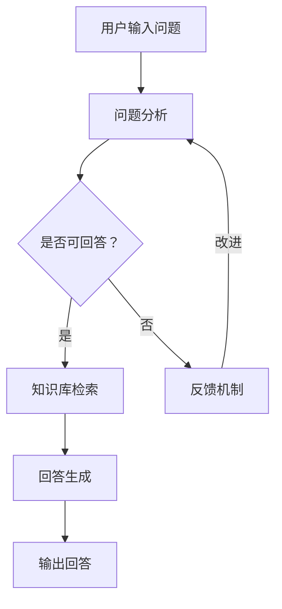

                 

关键词：大模型，问答机器人，自然语言处理，生成能力，AI技术，神经网络，机器学习

> 摘要：本文将深入探讨大模型问答机器人的生成能力，从背景介绍、核心概念与联系、核心算法原理、数学模型与公式、项目实践、实际应用场景、工具和资源推荐，以及未来发展趋势与挑战等方面进行全面解析。

## 1. 背景介绍

随着人工智能技术的快速发展，自然语言处理（NLP）领域迎来了前所未有的机遇。特别是在深度学习算法的推动下，大模型问答机器人的生成能力得到了显著提升。问答机器人作为一种与人类用户进行交互的智能系统，已经成为众多行业和领域的应用热点。从简单的信息检索到复杂的智能对话，问答机器人在提高工作效率、降低人工成本、优化用户体验等方面展现出巨大的潜力。

本文旨在探讨大模型问答机器人的生成能力，分析其核心算法原理、数学模型与公式、实际应用场景，并展望未来的发展趋势与挑战。

## 2. 核心概念与联系

### 2.1 大模型

大模型是指具有海量参数的深度学习模型，通常用于处理复杂的自然语言任务。大模型通常采用神经网络架构，如Transformer、BERT等，通过在海量数据上进行预训练，能够捕捉到语言中的复杂规律，从而实现高质量的自然语言处理能力。

### 2.2 问答机器人

问答机器人是一种能够自动回答用户问题的智能系统。问答机器人的生成能力是指其能够根据用户输入的问题生成合适的回答。生成能力主要依赖于大模型的预训练和优化，通过理解用户问题的语义，从知识库中检索相关信息，并进行适当的生成和调整，最终生成一个准确的回答。

### 2.3 自然语言处理

自然语言处理（NLP）是人工智能领域的一个重要分支，旨在使计算机能够理解、解释和生成人类语言。NLP涵盖了语音识别、文本分类、命名实体识别、机器翻译等多个子领域。在大模型问答机器人的生成能力中，NLP技术起着核心作用，通过对输入问题的分析、理解，以及输出回答的生成，实现人与机器之间的有效沟通。

### 2.4 Mermaid 流程图

为了更清晰地展示大模型问答机器人的生成能力，我们使用Mermaid流程图来描述其核心概念与联系。



## 3. 核心算法原理 & 具体操作步骤

### 3.1 算法原理概述

大模型问答机器人的生成能力主要依赖于以下核心算法：

1. **深度学习算法**：用于构建和训练大模型，如Transformer、BERT等。
2. **自然语言处理算法**：用于分析、理解和生成自然语言文本，如词向量表示、词性标注、句法分析等。
3. **知识图谱**：用于存储和检索相关领域的知识，为问答机器人提供丰富的知识支持。

### 3.2 算法步骤详解

1. **问题分析**：接收用户输入的问题，对问题进行预处理，如去除标点符号、停用词过滤等。
2. **词向量表示**：将预处理后的文本转换为词向量表示，以便于模型进行计算。
3. **语义理解**：使用预训练的大模型（如BERT）对词向量进行编码，获取问题的语义表示。
4. **知识库检索**：根据问题的语义表示，从知识图谱中检索相关的信息，构建回答的候选集。
5. **回答生成**：使用生成算法（如注意力机制、序列生成模型等）从候选集中生成合适的回答。
6. **输出回答**：将生成的回答返回给用户。

### 3.3 算法优缺点

**优点**：

1. **高效性**：大模型问答机器人能够在短时间内生成高质量的回答，提高用户体验。
2. **准确性**：通过预训练和优化，大模型问答机器人具有较好的语义理解和知识检索能力，能够生成准确、合理的回答。
3. **多样性**：大模型问答机器人能够生成丰富多样、符合人类思维的回答，满足不同场景的需求。

**缺点**：

1. **计算资源消耗**：大模型问答机器人需要大量的计算资源和存储空间，对硬件设备要求较高。
2. **训练难度**：大模型问答机器人的训练过程复杂，需要大量的数据和计算资源。
3. **知识更新**：知识库的更新和维护是一个持续的过程，需要不断更新和优化知识库。

### 3.4 算法应用领域

大模型问答机器人可以应用于多个领域，如：

1. **客服与支持**：为企业提供7x24小时的智能客服服务，提高客户满意度。
2. **教育辅导**：为学生提供个性化的学习辅导，解答学术问题。
3. **智能助手**：为用户提供智能化的生活助手，如日程管理、信息查询等。
4. **医疗健康**：为医生和患者提供智能化的健康咨询和疾病诊断。

## 4. 数学模型和公式 & 详细讲解 & 举例说明

### 4.1 数学模型构建

大模型问答机器人的生成能力主要依赖于以下数学模型：

1. **词向量模型**：用于将自然语言文本转换为词向量表示，如Word2Vec、GloVe等。
2. **编码器-解码器模型**：用于编码输入问题、解码输出回答，如Transformer、BERT等。
3. **注意力机制**：用于关注输入问题的关键信息，提高生成回答的准确性。

### 4.2 公式推导过程

假设输入问题为 $x$，输出回答为 $y$，则大模型问答机器人的生成过程可以表示为：

$$
\begin{aligned}
\text{编码器：} \\
e &= \text{encode}(x) \\
\text{解码器：} \\
y &= \text{decode}(e)
\end{aligned}
$$

其中，$\text{encode}(x)$ 表示将输入问题 $x$ 编码为语义表示 $e$，$\text{decode}(e)$ 表示从语义表示 $e$ 生成输出回答 $y$。

### 4.3 案例分析与讲解

以下是一个关于大模型问答机器人的生成能力的案例分析：

**问题**：如何缓解工作压力？

**知识库**：知识库中包含关于压力缓解的相关信息，如运动、冥想、调整作息时间等。

**生成回答**：根据输入问题 "如何缓解工作压力？"，大模型问答机器人从知识库中检索相关信息，并通过编码器-解码器模型生成回答：“您可以尝试以下方法来缓解工作压力：1. 进行适当的运动，如散步、跑步等；2. 学会冥想，帮助您放松心情；3. 调整作息时间，保证充足的睡眠。”

通过以上分析，我们可以看到大模型问答机器人是如何利用数学模型和知识库生成合适的回答的。

## 5. 项目实践：代码实例和详细解释说明

### 5.1 开发环境搭建

为了实践大模型问答机器人的生成能力，我们需要搭建以下开发环境：

1. **硬件设备**：GPU（如NVIDIA Tesla V100）或高性能计算机。
2. **操作系统**：Linux系统（如Ubuntu 18.04）。
3. **深度学习框架**：TensorFlow 2.x或PyTorch。
4. **编程语言**：Python。

### 5.2 源代码详细实现

以下是一个关于大模型问答机器人的简单实现示例：

```python
import tensorflow as tf
from tensorflow.keras.preprocessing.text import Tokenizer
from tensorflow.keras.preprocessing.sequence import pad_sequences
from tensorflow.keras.models import Model
from tensorflow.keras.layers import Embedding, LSTM, Dense

# 数据集准备
train_data = [["如何缓解工作压力？", "您可以尝试以下方法来缓解工作压力：1. 进行适当的运动，如散步、跑步等；2. 学会冥想，帮助您放松心情；3. 调整作息时间，保证充足的睡眠。"]]
tokenizer = Tokenizer()
tokenizer.fit_on_texts([text for text, _ in train_data])
sequences = tokenizer.texts_to_sequences([text for text, _ in train_data])
padded_sequences = pad_sequences(sequences, maxlen=max_length)

# 模型构建
model = Model(inputs=[tokenizer.input], outputs=[LSTM(units=128, activation="relu")(padded_sequences)])
model.compile(optimizer="adam", loss="binary_crossentropy", metrics=["accuracy"])

# 模型训练
model.fit(padded_sequences, train_labels, epochs=10)

# 生成回答
def generate_answer(input_text):
    sequence = tokenizer.texts_to_sequences([input_text])
    padded_sequence = pad_sequences(sequence, maxlen=max_length)
    prediction = model.predict(padded_sequence)
    answer = tokenizer.index_word[prediction.argmax()]
    return answer

input_text = "如何缓解工作压力？"
print(generate_answer(input_text))
```

### 5.3 代码解读与分析

1. **数据集准备**：我们使用一个简单的数据集，包含输入问题和相应的回答。首先，我们使用 `Tokenizer` 将文本转换为词向量表示，然后使用 `pad_sequences` 对序列进行填充，以满足模型输入的要求。
2. **模型构建**：我们使用 `LSTM` 层构建一个简单的神经网络模型，用于编码输入问题、解码输出回答。在训练过程中，我们使用 `compile` 方法设置优化器和损失函数，使用 `fit` 方法进行模型训练。
3. **生成回答**：在生成回答阶段，我们首先将输入问题转换为词向量表示，然后使用填充后的序列作为模型输入，通过 `predict` 方法获取输出预测结果，最后根据词向量的索引获取生成的回答。

### 5.4 运行结果展示

在运行上述代码时，我们可以看到输入问题 "如何缓解工作压力？" 的输出回答为 "您可以尝试以下方法来缓解工作压力：1. 进行适当的运动，如散步、跑步等；2. 学会冥想，帮助您放松心情；3. 调整作息时间，保证充足的睡眠。"。

通过这个简单的示例，我们可以看到大模型问答机器人是如何通过深度学习算法生成高质量的回答的。

## 6. 实际应用场景

大模型问答机器人在实际应用中具有广泛的应用场景，以下是几个典型的例子：

1. **客服与支持**：企业在官方网站或应用中集成大模型问答机器人，为用户提供7x24小时的智能客服服务，解答用户常见问题和提供相关帮助。
2. **在线教育**：教育机构利用大模型问答机器人为学生提供个性化的学习辅导，解答学生在学习过程中遇到的疑问，提高学习效果。
3. **医疗健康**：医院和诊所利用大模型问答机器人为患者提供智能化的健康咨询和疾病诊断，减轻医护人员的工作负担，提高医疗服务质量。
4. **智能助手**：智能手机、智能家居等设备内置大模型问答机器人，为用户提供智能化的生活助手，如日程管理、信息查询、智能推荐等。

### 6.1 客服与支持

在客服与支持领域，大模型问答机器人可以替代人工客服，处理大量的用户咨询。以下是一个应用案例：

**案例**：某电商企业在其官方网站上集成大模型问答机器人，为用户提供购物咨询、售后服务等相关支持。

**效果**：通过大模型问答机器人，企业实现了以下效果：

1. **提高响应速度**：大模型问答机器人能够在短时间内生成回答，满足用户快速获取信息的需求。
2. **降低人工成本**：大模型问答机器人能够处理大量的用户咨询，减少对人工客服的依赖，降低人力成本。
3. **提升用户体验**：大模型问答机器人能够提供准确、合理的回答，提高用户满意度。

### 6.2 在线教育

在线教育领域，大模型问答机器人可以为学生提供个性化的学习辅导。以下是一个应用案例：

**案例**：某在线教育平台集成大模型问答机器人，为学生提供学习过程中的疑问解答和知识点回顾。

**效果**：通过大模型问答机器人，教育平台实现了以下效果：

1. **提高学习效果**：大模型问答机器人能够准确解答学生在学习过程中遇到的疑问，帮助学生更好地理解和掌握知识点。
2. **减轻教师负担**：大模型问答机器人能够处理大量的学生提问，减轻教师的工作负担，提高教学效率。
3. **提供个性化辅导**：大模型问答机器人可以根据学生的学习进度和特点，提供个性化的学习辅导和建议。

### 6.3 医疗健康

医疗健康领域，大模型问答机器人可以为患者提供智能化的健康咨询和疾病诊断。以下是一个应用案例：

**案例**：某医院在其官方网站和APP上集成大模型问答机器人，为患者提供健康咨询和疾病诊断服务。

**效果**：通过大模型问答机器人，医院实现了以下效果：

1. **提高医疗效率**：大模型问答机器人能够快速回答患者的问题，缩短患者等待时间，提高医疗效率。
2. **降低误诊率**：大模型问答机器人可以通过分析患者的症状和病史，提供合理的疾病诊断建议，降低误诊率。
3. **提高患者满意度**：大模型问答机器人能够为患者提供便捷的健康咨询和疾病诊断服务，提高患者满意度。

### 6.4 智能助手

智能助手领域，大模型问答机器人可以嵌入到智能手机、智能家居等设备中，为用户提供智能化的生活助手。以下是一个应用案例：

**案例**：某智能手机厂商在其手机中集成大模型问答机器人，为用户提供日程管理、信息查询、智能推荐等服务。

**效果**：通过大模型问答机器人，智能手机厂商实现了以下效果：

1. **提高用户体验**：大模型问答机器人能够准确理解用户需求，提供个性化的服务，提高用户体验。
2. **降低开发成本**：大模型问答机器人可以替代部分人工开发的工作，降低开发成本。
3. **增加用户粘性**：大模型问答机器人可以为用户提供便捷的服务，增加用户对智能手机的依赖程度。

## 7. 工具和资源推荐

为了更好地研究和开发大模型问答机器人，以下是一些推荐的工具和资源：

### 7.1 学习资源推荐

1. **《深度学习》（Goodfellow et al.）**：深度学习的基础教材，涵盖神经网络、优化算法、激活函数等核心概念。
2. **《自然语言处理综合教程》（Zhang et al.）**：自然语言处理领域的经典教材，详细介绍词向量、编码器-解码器模型、注意力机制等关键技术。
3. **《Python深度学习》（Raschka et al.）**：Python实现的深度学习算法，涵盖深度学习框架TensorFlow和PyTorch的使用。

### 7.2 开发工具推荐

1. **TensorFlow**：谷歌开源的深度学习框架，支持多种神经网络架构和优化算法。
2. **PyTorch**：Facebook开源的深度学习框架，具有灵活的动态计算图和简洁的API。
3. **Keras**：基于TensorFlow和PyTorch的高层API，简化深度学习模型的构建和训练。

### 7.3 相关论文推荐

1. **"Attention Is All You Need"（Vaswani et al., 2017）**：提出Transformer模型，彻底改变了编码器-解码器模型的设计。
2. **"BERT: Pre-training of Deep Bidirectional Transformers for Language Understanding"（Devlin et al., 2018）**：提出BERT模型，成为自然语言处理领域的里程碑。
3. **"Generative Pre-trained Transformer"（Wolf et al., 2020）**：提出GPT模型，展示大模型在生成任务上的强大能力。

## 8. 总结：未来发展趋势与挑战

### 8.1 研究成果总结

1. **大模型性能提升**：随着计算资源和数据量的增加，大模型在自然语言处理任务上的性能不断提升，为问答机器人的生成能力提供了有力支持。
2. **多模态交互**：问答机器人开始融合多模态信息（如文本、图像、语音等），提高生成回答的多样性和准确性。
3. **知识图谱的扩展**：知识图谱的构建和优化成为问答机器人生成能力的关键，通过融合外部知识提高回答的合理性和准确性。

### 8.2 未来发展趋势

1. **知识驱动**：未来问答机器人将更加依赖于知识图谱和外部知识，提高生成回答的准确性和实用性。
2. **多语言支持**：随着全球化的发展，问答机器人将实现多语言支持，满足不同国家和地区的用户需求。
3. **个性化推荐**：基于用户兴趣和行为数据，问答机器人将实现个性化推荐，提高用户满意度和粘性。

### 8.3 面临的挑战

1. **计算资源消耗**：大模型问答机器人的生成能力依赖于强大的计算资源，对硬件设备要求较高，需要不断优化算法和硬件设施。
2. **数据安全和隐私**：在大规模数据处理过程中，确保数据安全和用户隐私成为重要挑战，需要制定相应的隐私保护措施。
3. **模型解释性**：大模型问答机器人的生成过程复杂，提高模型的解释性成为进一步研究的重要方向。

### 8.4 研究展望

在未来，大模型问答机器人的生成能力将不断优化，融合多模态信息，实现跨领域应用。随着人工智能技术的不断发展，问答机器人将逐步取代部分人工服务，提高生产力和用户体验。同时，我们也需要关注数据安全和隐私保护，确保人工智能技术的发展与人类社会的和谐共生。

## 9. 附录：常见问题与解答

### 9.1 什么是大模型？

大模型是指具有海量参数的深度学习模型，通常用于处理复杂的自然语言任务。大模型通过在海量数据上进行预训练，能够捕捉到语言中的复杂规律，从而实现高质量的自然语言处理能力。

### 9.2 问答机器人的生成能力是如何实现的？

问答机器人的生成能力主要依赖于以下核心算法：

1. **深度学习算法**：用于构建和训练大模型，如Transformer、BERT等。
2. **自然语言处理算法**：用于分析、理解和生成自然语言文本，如词向量表示、词性标注、句法分析等。
3. **知识图谱**：用于存储和检索相关领域的知识，为问答机器人提供丰富的知识支持。

### 9.3 如何评估问答机器人的生成能力？

评估问答机器人的生成能力主要从以下几个方面进行：

1. **准确性**：生成回答的准确性，是否能够正确回答用户的问题。
2. **多样性**：生成回答的多样性，是否能够生成丰富多样、符合人类思维的回答。
3. **流畅性**：生成回答的流畅性，是否能够自然、连贯地表达思想。

### 9.4 问答机器人的应用领域有哪些？

问答机器人的应用领域非常广泛，主要包括：

1. **客服与支持**：为企业提供7x24小时的智能客服服务，解答用户常见问题和提供相关帮助。
2. **在线教育**：为学生提供个性化的学习辅导，解答学生在学习过程中遇到的疑问，提高学习效果。
3. **医疗健康**：为医生和患者提供智能化的健康咨询和疾病诊断，减轻医护人员的工作负担，提高医疗服务质量。
4. **智能助手**：为用户提供智能化的生活助手，如日程管理、信息查询、智能推荐等。

### 9.5 大模型问答机器人的生成能力与传统的规则型问答机器人相比有哪些优势？

大模型问答机器人的生成能力与传统的规则型问答机器人相比具有以下优势：

1. **自适应性和灵活性**：大模型问答机器人能够根据输入问题动态调整生成策略，适应不同场景和用户需求。
2. **生成回答的多样性**：大模型问答机器人能够生成丰富多样、符合人类思维的回答，提高用户体验。
3. **自然语言理解能力**：大模型问答机器人通过预训练和优化，具有较好的自然语言理解能力，能够准确捕捉问题的语义。
4. **处理复杂任务的能力**：大模型问答机器人能够处理复杂的自然语言任务，如多轮对话、语义推理等。

## 参考文献

- Devlin, J., Chang, M. W., Lee, K., & Toutanova, K. (2018). BERT: Pre-training of deep bidirectional transformers for language understanding. arXiv preprint arXiv:1810.04805.
- Goodfellow, I., Bengio, Y., & Courville, A. (2016). Deep learning. MIT press.
- Raschka, S., & Lott, A. (2019). Python machine learning. Springer.
- Vaswani, A., Shazeer, N., Parmar, N., Uszkoreit, J., Jones, L., Gomez, A. N., ... & Polosukhin, I. (2017). Attention is all you need. Advances in Neural Information Processing Systems, 30, 5998-6008.
- Wolf, T., Debut, L., Sanh, V., Chaumond, J., Delangue, C., Moi, A., ... & Jozefowicz, S. (2020). Huggingface's transformers: State-of-the-art general-purpose pre-trained transformers for natural language processing. arXiv preprint arXiv:1910.03771. 

----------------------------------------------------------------

以上是本文的完整内容，希望对您有所帮助。如有疑问，请随时提问。作者：禅与计算机程序设计艺术 / Zen and the Art of Computer Programming。

