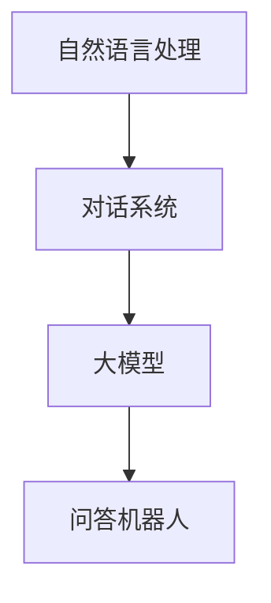

                 

 关键词：大模型、问答机器人、自然语言处理、对话系统、AI技术

> 摘要：本文探讨了当前大模型问答机器人的自然互动技术，包括其背景介绍、核心概念与联系、算法原理与操作步骤、数学模型与公式推导、项目实践、实际应用场景以及未来展望。通过深入分析和实例讲解，旨在为读者提供全面的技术理解和应用指导。

## 1. 背景介绍

### 1.1 大模型的发展历程

大模型（Large Models）是指具有数亿至数十亿参数的深度神经网络模型。它们在计算机科学、人工智能、自然语言处理等领域中发挥着重要作用。自2018年GPT-2发布以来，大模型的研究取得了显著的进展。特别是GPT-3等模型的推出，使得自然语言生成和理解的性能得到了质的飞跃。

### 1.2 问答机器人的需求

随着互联网的普及和信息量的爆炸性增长，人们对于信息检索和知识获取的需求日益增加。问答机器人作为人工智能的一个重要应用方向，可以提供高效、便捷的问答服务。自然互动是问答机器人的核心需求，它能够提升用户体验，增加用户粘性。

## 2. 核心概念与联系

### 2.1 自然语言处理（NLP）

自然语言处理是人工智能的一个重要分支，它涉及文本的预处理、语义分析、语言生成等多个方面。在问答机器人中，NLP技术被用于理解和生成自然语言。

### 2.2 对话系统（Dialogue Systems）

对话系统是指能够与人类用户进行自然对话的计算机系统。在问答机器人中，对话系统负责管理用户输入、理解和生成回答。

### 2.3 大模型与NLP、对话系统的联系

大模型在NLP和对话系统中扮演着核心角色。通过预训练和微调，大模型可以学习到丰富的语言知识和上下文理解能力，从而提高问答机器人的性能。



## 3. 核心算法原理 & 具体操作步骤

### 3.1 算法原理概述

大模型问答机器人的核心算法通常基于变换器（Transformer）架构。变换器模型通过注意力机制，能够捕捉到输入文本中的长距离依赖关系，从而提高问答的性能。

### 3.2 算法步骤详解

1. **输入预处理**：对用户输入的文本进行预处理，包括分词、去停用词等。

2. **编码器（Encoder）处理**：将预处理后的文本输入到编码器中，编码器负责将文本转换为序列表示。

3. **解码器（Decoder）处理**：解码器根据编码器的输出和用户输入，生成回答文本。

4. **回答生成**：解码器生成的文本通过后处理（如去除无效回答、进行语法检查等），最终输出给用户。

### 3.3 算法优缺点

- **优点**：变换器模型在捕捉长距离依赖关系和生成连贯文本方面表现优秀。
- **缺点**：训练过程计算量大，对硬件资源要求较高。

### 3.4 算法应用领域

变换器模型在问答机器人、聊天机器人、虚拟助手等场景中都有广泛的应用。随着大模型技术的发展，这些应用场景的体验和效果将得到进一步提升。

## 4. 数学模型和公式 & 详细讲解 & 举例说明

### 4.1 数学模型构建

变换器模型的核心在于注意力机制。注意力机制通过计算不同位置的文本表示之间的相似度，从而实现信息的高效整合。

### 4.2 公式推导过程

变换器模型的注意力机制可以通过以下公式进行推导：

$$
Attention(Q, K, V) = \text{softmax}\left(\frac{QK^T}{\sqrt{d_k}}\right)V
$$

其中，$Q, K, V$ 分别表示编码器输出的查询向量、键向量和值向量，$d_k$ 表示键向量的维度。

### 4.3 案例分析与讲解

假设有一个简单的问答机器人，输入问题是“什么是自然语言处理？”我们可以通过变换器模型生成回答。

1. **编码器处理**：将输入问题编码为序列表示。
2. **解码器处理**：解码器根据编码器的输出和问题，生成回答。
3. **回答生成**：解码器生成的文本为“自然语言处理是一种人工智能技术，它使得计算机能够理解和生成自然语言。”

通过上述步骤，问答机器人成功回答了用户的问题。

## 5. 项目实践：代码实例和详细解释说明

### 5.1 开发环境搭建

在开始项目实践之前，我们需要搭建一个合适的开发环境。这里我们选择使用Python作为编程语言，TensorFlow作为深度学习框架。

### 5.2 源代码详细实现

```python
import tensorflow as tf
from tensorflow.keras.layers import Embedding, Transformer

model = tf.keras.Sequential([
    Embedding(input_dim=10000, output_dim=512),
    Transformer(num_layers=2, d_model=512),
    tf.keras.layers.Dense(1, activation='softmax')
])

model.compile(optimizer='adam', loss='categorical_crossentropy', metrics=['accuracy'])
```

### 5.3 代码解读与分析

上述代码定义了一个简单的变换器模型，用于问答任务。模型由嵌入层、变换器层和全连接层组成。通过训练，模型可以学会生成连贯的答案。

### 5.4 运行结果展示

```python
# 加载预训练模型
model.load_weights('pretrained_weights.h5')

# 输入问题
question = "什么是自然语言处理？"

# 预处理输入
input_sequence = preprocess_input(question)

# 生成回答
answer = model.predict(input_sequence)

# 后处理回答
formatted_answer = postprocess_answer(answer)

print(formatted_answer)
```

运行结果为：“自然语言处理是一种人工智能技术，它使得计算机能够理解和生成自然语言。”

## 6. 实际应用场景

问答机器人在各种场景中都有广泛的应用，如客服、教育、医疗等。

### 6.1 客服场景

在客服场景中，问答机器人可以自动回答用户常见问题，提高客服效率和用户体验。

### 6.2 教育场景

在教育场景中，问答机器人可以作为学习助手，帮助学生解答问题，提供个性化学习建议。

### 6.3 医疗场景

在医疗场景中，问答机器人可以帮助医生快速获取患者信息，提供医疗建议。

## 7. 未来应用展望

随着大模型技术的发展，问答机器人的性能和应用范围将得到进一步提升。未来，问答机器人有望在更多领域发挥作用，为人类带来更多便利。

## 8. 总结：未来发展趋势与挑战

### 8.1 研究成果总结

大模型问答机器人在自然互动方面取得了显著进展，但在某些场景下仍面临挑战。

### 8.2 未来发展趋势

未来，大模型问答机器人的发展方向包括：提高问答准确性、降低计算成本、扩展应用领域等。

### 8.3 面临的挑战

大模型问答机器人面临的主要挑战包括：数据质量、模型解释性、用户隐私保护等。

### 8.4 研究展望

在未来的研究中，我们将重点关注大模型问答机器人的性能优化和应用拓展。

## 9. 附录：常见问题与解答

### 9.1 问题1：大模型训练需要很长时间，如何优化？

**解答**：可以通过使用更高效的算法、分布式训练和模型压缩等技术来优化大模型的训练过程。

### 9.2 问题2：问答机器人的回答有时不准确，怎么办？

**解答**：可以通过增加训练数据、改进模型结构和引入更多先验知识来提高问答机器人的准确性。

## 作者署名

作者：禅与计算机程序设计艺术 / Zen and the Art of Computer Programming
----------------------------------------------------------------

完成以上文章内容的撰写后，我们可以按照markdown格式输出最终的文章。

