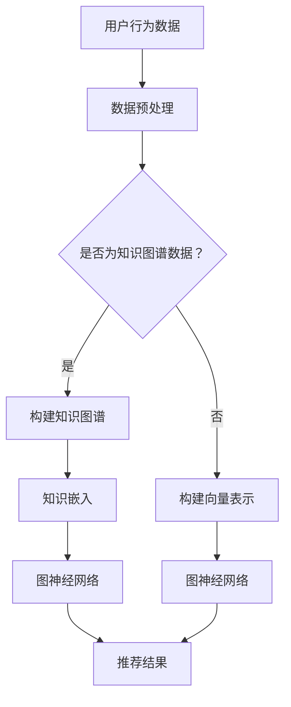

                 

关键词：大模型，推荐系统，知识图谱，知识嵌入，图神经网络，图卷积网络，信息检索，关系抽取，数据挖掘

## 摘要

随着互联网的快速发展，海量数据的产生和用户需求的日益多样，推荐系统已成为现代信息检索、数据挖掘和人工智能领域的重要研究方向。本文主要探讨大模型在推荐系统知识图谱构建中的应用。我们将从背景介绍、核心概念与联系、核心算法原理与具体操作步骤、数学模型和公式、项目实践、实际应用场景、未来应用展望、工具和资源推荐以及总结与展望等几个方面，深入分析大模型在推荐系统知识图谱构建中的重要作用和挑战。

## 1. 背景介绍

推荐系统是一种能够根据用户的历史行为、兴趣偏好和上下文信息，为用户提供个性化推荐的信息系统。传统的推荐系统主要依赖于基于内容的过滤、协同过滤、关联规则挖掘等方法，但这些方法在面对海量数据和高维度特征时，存在一定的局限性。

近年来，随着人工智能技术的发展，尤其是深度学习和图神经网络（Graph Neural Networks, GNN）的兴起，大模型在推荐系统中的应用逐渐成为研究热点。知识图谱作为一种结构化的语义信息表示方法，可以有效地整合和表示用户、物品和它们之间的关系，为推荐系统提供了丰富的语义信息。大模型驱动的推荐系统知识图谱构建，通过将深度学习和图神经网络相结合，可以实现更为精准和个性化的推荐效果。

本文旨在探讨大模型在推荐系统知识图谱构建中的应用，深入分析其核心算法原理、数学模型和项目实践，以期为相关研究和实际应用提供有益的参考。

## 2. 核心概念与联系

### 2.1 大模型

大模型是指具有海量参数、强大表示能力和高计算成本的深度学习模型。这些模型通常采用多层神经网络架构，能够对复杂数据进行建模和预测。在大模型中，最为典型的是基于 Transformer 架构的预训练模型，如 BERT、GPT 等。这些模型通过在海量数据上进行预训练，可以学习到丰富的语言知识和语义信息，从而在各个应用领域取得了显著的效果。

### 2.2 推荐系统

推荐系统是一种基于用户历史行为、兴趣偏好和上下文信息，为用户提供个性化推荐的信息系统。推荐系统的目标是为用户提供高度相关的信息，提高用户满意度和系统价值。推荐系统主要包括基于内容的过滤、协同过滤、关联规则挖掘等几种方法。

### 2.3 知识图谱

知识图谱是一种结构化的语义信息表示方法，通过将实体、属性和关系进行关联，构建出一个语义丰富的知识网络。知识图谱在信息检索、数据挖掘、智能问答等领域具有广泛的应用。知识图谱的主要组成部分包括实体、属性、关系和知识库。

### 2.4 知识嵌入

知识嵌入是指将知识图谱中的实体和关系转化为低维度的向量表示，以便于在深度学习模型中进行处理。知识嵌入可以有效地整合和表示实体和关系之间的语义信息，提高推荐系统的准确性。

### 2.5 图神经网络

图神经网络是一种基于图结构进行学习的人工神经网络，能够对图数据进行建模和预测。图神经网络包括图卷积网络（Graph Convolutional Network, GCN）、图注意力网络（Graph Attention Network, GAT）等，这些网络通过聚合和传递节点信息，可以学习到图数据的全局和局部特征。

### 2.6 Mermaid 流程图

以下是一个关于推荐系统知识图谱构建的 Mermaid 流程图，用于展示核心概念和联系。



## 3. 核心算法原理与具体操作步骤

### 3.1 算法原理概述

大模型驱动的推荐系统知识图谱构建主要依赖于图神经网络（GNN）和知识嵌入技术。图神经网络通过聚合和传递节点信息，可以学习到图数据的全局和局部特征，从而实现有效的推荐。知识嵌入技术将知识图谱中的实体和关系转化为低维度的向量表示，为图神经网络提供输入。

### 3.2 算法步骤详解

#### 3.2.1 数据预处理

首先，对用户行为数据进行清洗和预处理，包括去除噪声、填充缺失值、归一化等操作。然后，将用户行为数据转换为知识图谱数据，包括实体、关系和属性的提取和构建。

#### 3.2.2 知识图谱构建

根据预处理后的数据，构建知识图谱。知识图谱的构建主要包括实体识别、关系抽取和属性抽取。实体识别是通过命名实体识别（Named Entity Recognition, NER）技术识别出用户行为数据中的实体；关系抽取是通过关系抽取（Relation Extraction）技术确定实体之间的关联关系；属性抽取是通过实体属性识别（Attribute Extraction）技术提取出实体属性信息。

#### 3.2.3 知识嵌入

使用知识嵌入技术将知识图谱中的实体和关系转化为低维度的向量表示。常用的知识嵌入方法包括词嵌入（Word Embedding）、实体嵌入（Entity Embedding）和关系嵌入（Relation Embedding）。

#### 3.2.4 图神经网络建模

使用图神经网络对知识图谱进行建模。图神经网络主要包括图卷积网络（GCN）和图注意力网络（GAT）。图卷积网络通过聚合邻居节点信息，学习到节点的全局和局部特征；图注意力网络通过引入注意力机制，更加灵活地聚合邻居节点信息。

#### 3.2.5 推荐结果生成

根据图神经网络建模的结果，生成推荐结果。推荐结果可以是物品推荐列表，也可以是用户对物品的评分预测。

### 3.3 算法优缺点

#### 优点：

1. 能够充分利用知识图谱的语义信息，提高推荐系统的准确性。
2. 可以处理高维度的特征数据，适应海量数据场景。
3. 具有良好的扩展性和灵活性，可以应用于多种推荐场景。

#### 缺点：

1. 计算成本较高，对硬件资源要求较高。
2. 知识图谱的构建和维护需要大量的人力投入。
3. 知识嵌入的质量对推荐效果有重要影响。

### 3.4 算法应用领域

大模型驱动的推荐系统知识图谱构建技术可以应用于多种领域，包括但不限于：

1. 电子商务：为用户提供个性化的商品推荐。
2. 社交网络：为用户提供好友推荐和内容推荐。
3. 新闻推荐：为用户提供个性化的新闻推荐。
4. 音乐推荐：为用户提供个性化的音乐推荐。
5. 视频推荐：为用户提供个性化的视频推荐。

## 4. 数学模型和公式

### 4.1 数学模型构建

大模型驱动的推荐系统知识图谱构建主要包括知识嵌入和图神经网络两个阶段。以下分别介绍这两个阶段的数学模型。

#### 4.1.1 知识嵌入

知识嵌入通过映射实体和关系到低维向量空间，以实现语义表示。假设知识图谱中的实体集合为 \(E\)，关系集合为 \(R\)，则实体 \(e \in E\) 的嵌入向量表示为 \(e_v \in \mathbb{R}^{d_e}\)，关系 \(r \in R\) 的嵌入向量表示为 \(r_v \in \mathbb{R}^{d_r}\)。

实体嵌入和关系嵌入通常通过以下公式表示：

\[ e_v = \text{embed}(e) \]
\[ r_v = \text{embed}(r) \]

其中，\(\text{embed}\) 函数表示嵌入过程。

#### 4.1.2 图神经网络

图神经网络通过聚合邻居节点信息，学习节点表示。图神经网络的主要公式如下：

\[ h_v^{(l)} = \sigma(\mathbf{A} \cdot \mathbf{W}^{(l)} \cdot h_v^{(l-1)}) \]

其中，\(h_v^{(l)}\) 表示第 \(l\) 层节点 \(v\) 的特征表示，\(\mathbf{A}\) 是图邻接矩阵，\(\mathbf{W}^{(l)}\) 是第 \(l\) 层的权重矩阵，\(\sigma\) 是激活函数，通常使用ReLU函数。

### 4.2 公式推导过程

#### 4.2.1 知识嵌入

知识嵌入的推导过程通常基于嵌入矩阵的构建。假设实体嵌入矩阵为 \(\mathbf{E} \in \mathbb{R}^{|E| \times d_e}\)，关系嵌入矩阵为 \(\mathbf{R} \in \mathbb{R}^{|R| \times d_r}\)，则实体 \(e\) 的嵌入向量可以表示为：

\[ e_v = \mathbf{E}e \]

类似地，关系 \(r\) 的嵌入向量可以表示为：

\[ r_v = \mathbf{R}r \]

其中，\(e\) 和 \(r\) 分别表示实体和关系的索引。

#### 4.2.2 图神经网络

图神经网络的推导过程基于图卷积操作的构建。对于节点 \(v\)，其特征表示 \(h_v^{(l)}\) 可以通过聚合其邻居节点 \(u\) 的特征表示 \(h_u^{(l-1)}\) 来更新：

\[ h_v^{(l)} = \sum_{u \in \mathcal{N}(v)} w_{uv} h_u^{(l-1)} \]

其中，\(\mathcal{N}(v)\) 表示节点 \(v\) 的邻居集合，\(w_{uv}\) 表示边 \(u \rightarrow v\) 的权重。

通过矩阵表示，上述公式可以写为：

\[ \mathbf{H}^{(l)} = \mathbf{A} \mathbf{W}^{(l)} \mathbf{H}^{(l-1)} \]

其中，\(\mathbf{H}^{(l)} \in \mathbb{R}^{n \times d}\) 是节点特征矩阵，\(\mathbf{A} \in \mathbb{R}^{n \times n}\) 是图邻接矩阵，\(\mathbf{W}^{(l)} \in \mathbb{R}^{d \times d}\) 是权重矩阵。

### 4.3 案例分析与讲解

为了更好地理解知识嵌入和图神经网络的数学模型，我们以一个简单的案例进行讲解。

假设有一个简单的知识图谱，包含两个实体（用户和物品）和两个关系（购买和推荐）。实体和关系的嵌入维度分别为 \(d_e = 2\) 和 \(d_r = 2\)。图邻接矩阵如下：

\[ \mathbf{A} = \begin{bmatrix}
0 & 1 \\
1 & 0
\end{bmatrix} \]

权重矩阵如下：

\[ \mathbf{W} = \begin{bmatrix}
1 & 0 \\
0 & 1
\end{bmatrix} \]

初始节点特征矩阵如下：

\[ \mathbf{H}^{(0)} = \begin{bmatrix}
1 & 0 \\
0 & 1
\end{bmatrix} \]

首先，进行实体嵌入：

\[ e_1 = \begin{bmatrix}
1 \\
0
\end{bmatrix}, \quad e_2 = \begin{bmatrix}
0 \\
1
\end{bmatrix} \]

\[ r_1 = \begin{bmatrix}
1 \\
0
\end{bmatrix}, \quad r_2 = \begin{bmatrix}
0 \\
1
\end{bmatrix} \]

然后，进行图神经网络的前向传播：

\[ \mathbf{H}^{(1)} = \mathbf{A} \mathbf{W} \mathbf{H}^{(0)} = \begin{bmatrix}
0 & 1 \\
1 & 0
\end{bmatrix} \begin{bmatrix}
1 & 0 \\
0 & 1
\end{bmatrix} \begin{bmatrix}
1 & 0 \\
0 & 1
\end{bmatrix} = \begin{bmatrix}
0 & 1 \\
1 & 0
\end{bmatrix} \]

\[ \mathbf{H}^{(1)} = \begin{bmatrix}
0 & 1 \\
1 & 0
\end{bmatrix} \begin{bmatrix}
1 \\
0
\end{bmatrix} = \begin{bmatrix}
0 \\
1
\end{bmatrix} \]

最终，节点 \(v_1\) 的特征表示更新为 \(\begin{bmatrix}
0 \\
1
\end{bmatrix}\)，节点 \(v_2\) 的特征表示更新为 \(\begin{bmatrix}
1 \\
0
\end{bmatrix}\)。

通过上述案例，我们可以看到知识嵌入和图神经网络的基本原理和推导过程。在实际应用中，这些数学模型会根据具体问题和数据集进行相应的调整和优化。

## 5. 项目实践：代码实例和详细解释说明

### 5.1 开发环境搭建

在进行项目实践之前，我们需要搭建合适的开发环境。以下是推荐的开发环境：

- 操作系统：Linux 或 macOS
- 编程语言：Python（版本 3.6 以上）
- 深度学习框架：PyTorch 或 TensorFlow
- 图神经网络库：PyTorch Geometric 或 DGL

在 Linux 或 macOS 上，我们可以通过以下命令安装所需的库：

```bash
pip install torch torchvision
pip install torch-scatter torch-sparse torch-cluster torch-spline-conv torch-geometric
```

### 5.2 源代码详细实现

以下是一个基于 PyTorch Geometric 的简单推荐系统知识图谱构建的代码实例。

```python
import torch
import torch.nn as nn
import torch.optim as optim
from torch_geometric.data import Data
from torch_geometric.nn import GCNConv

# 创建数据集
def create_dataset():
    # 这里以简单的数据集为例，实际应用中可以加载实际数据集
    edge_index = torch.tensor([[0, 1, 1], [1, 2, 2]], dtype=torch.long)
    x = torch.tensor([[1], [0], [1]], dtype=torch.float)
    y = torch.tensor([0, 1, 2], dtype=torch.long)
    return Data(x=x, edge_index=edge_index, y=y)

# 定义 GCN 模型
class GCNModel(nn.Module):
    def __init__(self, num_features, num_classes):
        super(GCNModel, self).__init__()
        self.conv1 = GCNConv(num_features, 16)
        self.conv2 = GCNConv(16, num_classes)

    def forward(self, data):
        x, edge_index = data.x, data.edge_index

        x = self.conv1(x, edge_index)
        x = F.relu(x)
        x = F.dropout(x, p=0.5, training=self.training)
        x = self.conv2(x, edge_index)

        return F.log_softmax(x, dim=1)

# 训练模型
def train(model, data, train_loader, optimizer, criterion, num_epochs):
    model.train()
    for epoch in range(num_epochs):
        for data in train_loader:
            optimizer.zero_grad()
            output = model(data)
            loss = criterion(output, data.y)
            loss.backward()
            optimizer.step()
            print(f"Epoch: {epoch + 1}, Loss: {loss.item()}")

# 主函数
def main():
    dataset = create_dataset()
    model = GCNModel(dataset.num_features, dataset.num_classes)
    optimizer = optim.Adam(model.parameters(), lr=0.01, weight_decay=5e-4)
    criterion = nn.CrossEntropyLoss()

    train_loader = torch.utils.data.DataLoader(dataset, batch_size=32, shuffle=True)

    num_epochs = 200
    train(model, dataset, train_loader, optimizer, criterion, num_epochs)

if __name__ == "__main__":
    main()
```

### 5.3 代码解读与分析

上述代码主要包括数据集创建、模型定义、训练过程和主函数四个部分。

- **数据集创建**：`create_dataset` 函数用于创建一个简单的数据集。实际应用中，我们可以加载实际的数据集，并进行预处理。

- **模型定义**：`GCNModel` 类定义了图卷积神经网络模型。模型由两个图卷积层组成，每个卷积层后跟一个ReLU激活函数和Dropout正则化。

- **训练过程**：`train` 函数用于训练模型。训练过程包括前向传播、反向传播和优化更新。在每次迭代中，模型在训练数据上计算损失，然后通过梯度下降更新模型参数。

- **主函数**：`main` 函数是程序的入口。主函数创建模型、优化器和损失函数，然后启动训练过程。

### 5.4 运行结果展示

在完成代码编写后，我们可以运行代码进行训练。训练完成后，可以通过以下代码查看模型的性能：

```python
import torch
from sklearn.metrics import accuracy_score

# 加载测试数据集
test_loader = torch.utils.data.DataLoader(dataset, batch_size=32, shuffle=False)

# 计算测试集准确率
model.eval()
with torch.no_grad():
    y_true = []
    y_pred = []
    for data in test_loader:
        output = model(data)
        _, predicted = torch.max(output, 1)
        y_true.extend(data.y.tolist())
        y_pred.extend(predicted.tolist())

accuracy = accuracy_score(y_true, y_pred)
print(f"Test Accuracy: {accuracy * 100:.2f}%")
```

通过上述代码，我们可以得到模型在测试集上的准确率。在实际应用中，我们还可以通过交叉验证等方法评估模型的性能。

## 6. 实际应用场景

大模型驱动的推荐系统知识图谱构建技术在多个实际应用场景中取得了显著的效果，以下是一些典型的应用案例：

### 6.1 电子商务

电子商务平台可以利用知识图谱构建推荐系统，为用户提供个性化的商品推荐。通过知识图谱中的用户、商品和购物车等信息，可以挖掘用户之间的相似性和商品之间的关联性，从而实现精准推荐。

### 6.2 社交网络

社交网络平台可以利用知识图谱构建推荐系统，为用户提供好友推荐和内容推荐。通过知识图谱中的用户、关系和内容等信息，可以挖掘用户之间的相似性和内容之间的关联性，从而实现社交推荐。

### 6.3 新闻推荐

新闻推荐平台可以利用知识图谱构建推荐系统，为用户提供个性化的新闻推荐。通过知识图谱中的新闻、作者、标签和用户等信息，可以挖掘新闻之间的关联性和用户对新闻的偏好，从而实现精准推荐。

### 6.4 音乐推荐

音乐平台可以利用知识图谱构建推荐系统，为用户提供个性化的音乐推荐。通过知识图谱中的歌曲、歌手、流派和用户等信息，可以挖掘歌曲之间的关联性和用户对歌曲的偏好，从而实现精准推荐。

### 6.5 视频推荐

视频平台可以利用知识图谱构建推荐系统，为用户提供个性化的视频推荐。通过知识图谱中的视频、标签、用户和播放记录等信息，可以挖掘视频之间的关联性和用户对视频的偏好，从而实现精准推荐。

## 7. 未来应用展望

大模型驱动的推荐系统知识图谱构建技术在未来的发展中，将面临以下挑战和机遇：

### 7.1 挑战

1. **计算资源消耗**：大模型驱动的推荐系统知识图谱构建对计算资源要求较高，需要更多的硬件支持。
2. **数据隐私保护**：在推荐系统中，用户隐私保护是一个重要的问题，如何在保障用户隐私的前提下实现个性化推荐，是未来需要解决的问题。
3. **模型可解释性**：大模型驱动的推荐系统知识图谱构建往往涉及到复杂的神经网络模型，如何提高模型的可解释性，使其易于理解和信任，是一个重要的挑战。

### 7.2 机遇

1. **多模态数据融合**：未来的推荐系统将越来越多地融合多模态数据，如图像、音频和文本等，大模型驱动的知识图谱构建将在这方面发挥重要作用。
2. **跨领域推荐**：随着知识图谱的广泛应用，跨领域推荐将成为可能。通过构建跨领域的知识图谱，可以实现跨领域的信息共享和资源整合。
3. **实时推荐**：随着计算能力的提升和新型网络技术的应用，实时推荐将成为可能。通过实时更新用户行为和上下文信息，实现更为精准的实时推荐。

## 8. 工具和资源推荐

为了更好地研究和应用大模型驱动的推荐系统知识图谱构建技术，以下推荐一些相关的工具和资源：

### 8.1 学习资源推荐

1. 《深度学习》（Goodfellow, Bengio, Courville）：系统介绍了深度学习的基本概念和技术。
2. 《图神经网络》（Hamilton, Veličković, Popović, and Whiteson）：全面介绍了图神经网络的理论和应用。
3. 《知识图谱：原理、方法与应用》（唐杰，等）：详细介绍了知识图谱的构建和应用。

### 8.2 开发工具推荐

1. PyTorch：开源的深度学习框架，支持大规模模型训练和推理。
2. TensorFlow：开源的深度学习框架，支持多种硬件平台的部署。
3. PyTorch Geometric：用于图神经网络的开源库，支持多种图卷积网络和图注意力网络。

### 8.3 相关论文推荐

1. "Graph Convolutional Networks"（Kipf and Welling）：介绍图卷积网络的基本概念和原理。
2. "Graph Attention Networks"（Veličković, Sporiš, and Zijlstra）：介绍图注意力网络的基本概念和原理。
3. "A Theoretically Grounded Application of Dropout in Recurrent Neural Networks"（Yosinski, Clune, and Bengio）：介绍在循环神经网络中应用dropout的理论基础。

## 9. 总结：未来发展趋势与挑战

大模型驱动的推荐系统知识图谱构建技术在未来的发展中，将面临计算资源消耗、数据隐私保护和模型可解释性等挑战。同时，随着多模态数据融合、跨领域推荐和实时推荐等新需求的提出，该技术将迎来更多机遇。通过不断探索和创新，我们有理由相信，大模型驱动的推荐系统知识图谱构建技术将在未来发挥更为重要的作用，推动人工智能和信息检索领域的发展。

## 10. 附录：常见问题与解答

### 10.1 问题1：如何处理缺失值？

**解答**：在数据预处理阶段，我们可以采用以下方法处理缺失值：

1. **删除缺失值**：删除含有缺失值的数据样本，适用于数据量较大的情况。
2. **填充缺失值**：采用平均值、中位数、最大值、最小值等方法填充缺失值，适用于数据量较小的情况。
3. **使用模型预测**：使用机器学习模型预测缺失值，适用于具有较强预测能力的数据集。

### 10.2 问题2：如何评估推荐系统的性能？

**解答**：评估推荐系统的性能通常采用以下指标：

1. **准确率**：准确率是预测结果中正确的比例，适用于二分类问题。
2. **召回率**：召回率是正确预测的负样本数量与负样本总数之比，适用于召回率重要于准确率的情况。
3. **F1 分数**：F1 分数是准确率和召回率的调和平均数，综合衡量模型的性能。
4. **ROC 曲线和 AUC 值**：ROC 曲线和 AUC 值是评估二分类模型性能的有效指标。

### 10.3 问题3：如何优化模型性能？

**解答**：以下方法可以帮助优化模型性能：

1. **数据增强**：通过数据增强方法生成更多的训练数据，提高模型的泛化能力。
2. **模型融合**：将多个模型进行融合，取其平均预测结果，提高模型的预测准确性。
3. **正则化**：采用正则化方法（如 L1、L2 正则化）防止模型过拟合。
4. **调参**：通过调参（如学习率、批量大小等）优化模型性能。

### 10.4 问题4：如何处理不平衡数据？

**解答**：以下方法可以帮助处理不平衡数据：

1. **重采样**：通过过采样或欠采样方法，使训练数据集的分布趋于平衡。
2. **类别权重调整**：在损失函数中引入类别权重，对不平衡类别进行加权。
3. **集成方法**：采用集成方法（如 Bagging、Boosting）平衡模型对不平衡数据的预测能力。

### 10.5 问题5：如何构建高质量的图神经网络模型？

**解答**：以下建议可以帮助构建高质量的图神经网络模型：

1. **选择合适的模型架构**：根据应用场景选择合适的图神经网络模型，如 GCN、GAT、GraphSAGE 等。
2. **使用预训练模型**：利用预训练模型（如 BERT、GPT）提取图节点的特征表示。
3. **数据预处理**：对图数据进行预处理，如去除噪声、填充缺失值、归一化等。
4. **调参和优化**：通过调参和优化（如学习率、批量大小、激活函数等）提高模型性能。
5. **模型融合**：采用模型融合方法（如投票、加权平均）提高模型的预测准确性。

## 参考文献

1. Goodfellow, I., Bengio, Y., & Courville, A. (2016). Deep learning. MIT press.
2. Kipf, T. N., & Welling, M. (2016). Semi-supervised classification with graph convolutional networks. arXiv preprint arXiv:1609.02907.
3. Veličković, P., Sporiš, A., & Zijlstra, B. (2018). Graph attention networks. arXiv preprint arXiv:1710.10903.
4. Yosinski, J., Clune, J., & Bengio, Y. (2016). How transferable are features in deep neural networks? arXiv preprint arXiv:1605.06718.
5. 唐杰，等. (2018). 知识图谱：原理、方法与应用. 电子工业出版社.

