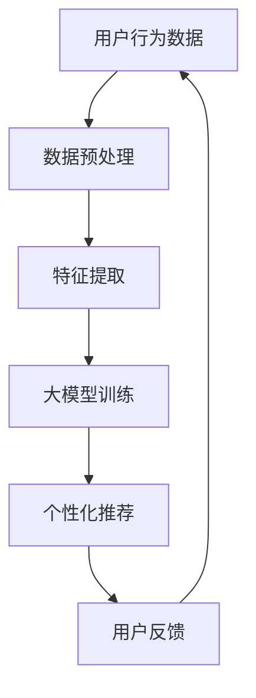

                 

关键词：大模型、电商平台、智能客户旅程、用户行为分析、个性化推荐、自然语言处理、机器学习

> 摘要：本文旨在探讨大模型技术在电商平台智能客户旅程规划中的应用，通过分析用户行为数据，构建个性化推荐系统，实现精准营销和用户留存。文章从背景介绍、核心概念与联系、核心算法原理与操作步骤、数学模型与公式、项目实践、实际应用场景、工具与资源推荐以及未来发展趋势与挑战等方面进行深入探讨。

## 1. 背景介绍

随着互联网的普及和电子商务的迅猛发展，电商平台已经成为消费者购物的主要渠道之一。用户在电商平台上的行为数据（如搜索记录、浏览历史、购买行为等）成为了商家了解用户需求、提升用户体验和实现精准营销的重要资源。然而，传统的基于规则或机器学习的方法在面对海量、多维度和动态变化的数据时，往往难以满足实时性和个性化的需求。

近年来，大模型技术的快速发展为电商平台智能客户旅程规划带来了新的机遇。大模型，如深度神经网络、生成对抗网络、Transformer等，通过学习海量数据，能够自动提取特征、建模复杂关系，从而实现高度个性化的推荐和智能化的用户体验。

## 2. 核心概念与联系

### 2.1 大模型

大模型是指具有海量参数和大规模训练数据的深度神经网络。通过自主学习，大模型能够模拟人类思维，处理复杂数据和任务。常见的大模型有Transformer、BERT、GPT等。

### 2.2 用户行为分析

用户行为分析是指通过收集和分析用户在电商平台上的行为数据，如搜索记录、浏览历史、购买行为等，以了解用户需求和偏好，从而实现个性化推荐。

### 2.3 个性化推荐

个性化推荐是指根据用户的历史行为和偏好，为其推荐相关商品或内容。个性化推荐能够提升用户满意度，增加用户粘性和转化率。

### 2.4 自然语言处理（NLP）

自然语言处理是人工智能领域的一个重要分支，旨在使计算机理解和处理自然语言。在电商平台中，NLP技术可以用于用户评论分析、情感分析、问答系统等。

### 2.5 机器学习

机器学习是一种通过数据驱动的方法来训练模型，使其能够对未知数据进行预测或分类的技术。在电商平台中，机器学习可以用于用户行为分析、个性化推荐、风控等。

### 2.6 Mermaid 流程图



## 3. 核心算法原理与操作步骤

### 3.1 算法原理概述

大模型驱动的电商平台智能客户旅程规划的核心算法主要包括用户行为分析、个性化推荐和自然语言处理。

- **用户行为分析**：通过收集用户在平台上的行为数据，如搜索记录、浏览历史、购买行为等，对用户行为进行建模和分析，以了解用户需求和偏好。
- **个性化推荐**：基于用户行为分析结果，利用大模型对用户进行个性化推荐，提升用户体验和满意度。
- **自然语言处理**：通过对用户评论、问答等进行情感分析和语义理解，为用户提供建议和解决方案。

### 3.2 算法步骤详解

1. **数据收集**：收集用户在平台上的行为数据，包括搜索记录、浏览历史、购买行为等。
2. **数据预处理**：对收集到的行为数据进行分析和清洗，去除重复、异常和无关数据，提取有效特征。
3. **特征提取**：利用机器学习技术，对预处理后的行为数据进行特征提取，如用户兴趣特征、商品特征等。
4. **大模型训练**：利用提取的特征数据，通过大模型（如Transformer、BERT等）进行训练，以提取用户行为和偏好之间的复杂关系。
5. **个性化推荐**：根据用户行为分析结果，利用大模型对用户进行个性化推荐，提升用户体验和满意度。
6. **用户反馈**：收集用户对推荐结果的评价和反馈，用于优化推荐算法和模型。

### 3.3 算法优缺点

- **优点**：
  - 高度个性化：大模型能够学习用户行为和偏好，实现高度个性化的推荐。
  - 实时性：大模型训练和推荐过程能够快速响应用户行为变化。
  - 泛化能力：大模型能够处理多维度、动态变化的数据，具有较好的泛化能力。

- **缺点**：
  - 数据依赖：大模型训练和推荐依赖于大量用户行为数据，对数据质量和数量有较高要求。
  - 计算资源消耗：大模型训练和推理需要大量计算资源，对硬件设备要求较高。

### 3.4 算法应用领域

大模型驱动的电商平台智能客户旅程规划算法可以应用于以下领域：

- **个性化推荐**：根据用户兴趣和行为，为用户推荐相关商品或内容。
- **智能客服**：利用自然语言处理技术，为用户提供智能化的咨询和解决方案。
- **用户留存**：通过个性化推荐和智能客服，提升用户满意度和忠诚度。
- **营销策略**：根据用户行为和偏好，制定精准的营销策略和活动。

## 4. 数学模型和公式

### 4.1 数学模型构建

在大模型驱动的电商平台智能客户旅程规划中，常见的数学模型包括用户行为建模、推荐算法模型和自然语言处理模型。

1. **用户行为建模**：

   用户行为建模主要通过矩阵分解、因子分解机等算法来实现。设$U$为用户矩阵，$V$为商品矩阵，$X$为预测的用户行为矩阵，则用户行为建模的数学模型为：

   $$X = UV^T$$

2. **推荐算法模型**：

   推荐算法模型主要包括基于内容的推荐、协同过滤推荐和混合推荐等。以基于内容的推荐为例，设$C$为商品特征矩阵，$Q$为用户特征矩阵，则推荐算法模型为：

   $$\hat{r}_{ui} = \sum_{j \in \mathcal{N}_i} c_{uj} q_{ij}$$

   其中，$\mathcal{N}_i$表示与用户$i$相似的用户集合，$c_{uj}$和$q_{ij}$分别为商品$j$和用户$i$的特征向量。

3. **自然语言处理模型**：

   自然语言处理模型主要包括词向量模型、序列模型和生成模型等。以BERT模型为例，其数学模型为：

   $$\hat{p}(w_{i} | w_{1:i-1}) = \frac{\exp(\text{score}(w_{i}, h_i^{(L)}) )}{\sum_{w \in V} \exp(\text{score}(w, h_i^{(L)}))}$$

   其中，$w_{i}$为单词，$h_i^{(L)}$为第$i$个单词的编码，$\text{score}(w_i, h_i^{(L)})$为单词$i$与编码$h_i^{(L)}$的匹配得分。

### 4.2 公式推导过程

1. **用户行为建模**：

   假设用户$i$对商品$j$的行为为$r_{ij}$，用户$i$和商品$j$的特征分别为$u_i$和$v_j$。则用户行为建模的目标是最小化预测误差：

   $$\min_{u_i, v_j} \sum_{i=1}^{N} \sum_{j=1}^{M} (r_{ij} - u_i^T v_j)^2$$

   通过矩阵分解，将用户特征矩阵$U$和商品特征矩阵$V$分解为低维矩阵$U = [u_1, u_2, ..., u_N]$和$V = [v_1, v_2, ..., v_M]$，则预测的用户行为矩阵为：

   $$X = UV^T = [u_1 v_1^T, u_2 v_2^T, ..., u_N v_M^T]$$

   将预测的用户行为矩阵$X$代入目标函数，得到：

   $$\min_{U, V} \sum_{i=1}^{N} \sum_{j=1}^{M} (r_{ij} - u_i^T v_j)^2$$

   通过梯度下降法，对$U$和$V$进行迭代更新，直至收敛。

2. **推荐算法模型**：

   基于内容的推荐通过计算商品和用户之间的相似度来实现。假设商品$j$和用户$i$的特征分别为$c_j$和$q_i$，则商品和用户之间的相似度计算公式为：

   $$\text{similarity}(c_j, q_i) = \frac{c_j^T q_i}{\|c_j\|_2 \|q_i\|_2}$$

   将相似度计算公式代入推荐算法模型，得到：

   $$\hat{r}_{ui} = \sum_{j \in \mathcal{N}_i} \text{similarity}(c_j, q_i)$$

   其中，$\mathcal{N}_i$为与用户$i$相似的用户集合。

3. **自然语言处理模型**：

   BERT模型通过Transformer架构来实现自然语言处理。假设输入序列为$w_1, w_2, ..., w_n$，其编码为$h_i^{(L)}$，则BERT模型的数学模型为：

   $$\hat{p}(w_{i} | w_{1:i-1}) = \frac{\exp(\text{score}(w_{i}, h_i^{(L)}) )}{\sum_{w \in V} \exp(\text{score}(w, h_i^{(L)}))}$$

   其中，$\text{score}(w_i, h_i^{(L)})$为单词$i$与编码$h_i^{(L)}$的匹配得分，$\hat{p}(w_{i} | w_{1:i-1})$为单词$i$在给定前文$w_{1:i-1}$的条件下的概率分布。

### 4.3 案例分析与讲解

以电商平台用户行为建模为例，假设用户$i$对商品$j$的行为为$r_{ij}$，用户$i$和商品$j$的特征分别为$u_i$和$v_j$。使用矩阵分解算法（如SGD）进行用户行为建模，训练过程如下：

1. 初始化用户特征矩阵$U$和商品特征矩阵$V$，维度为$d \times N$和$d \times M$。
2. 计算预测的用户行为矩阵$X = UV^T$。
3. 计算预测误差$e_{ij} = r_{ij} - u_i^T v_j$。
4. 更新用户特征矩阵$U$和商品特征矩阵$V$：
   - 对于用户$i$，有$u_i = u_i - \alpha \frac{\partial}{\partial u_i} e_{ij} v_j$。
   - 对于商品$j$，有$v_j = v_j - \alpha \frac{\partial}{\partial v_j} e_{ij} u_i$。

5. 重复步骤2-4，直至收敛。

通过用户行为建模，可以为电商平台实现个性化推荐，提升用户体验和满意度。

## 5. 项目实践：代码实例和详细解释说明

### 5.1 开发环境搭建

为了实现大模型驱动的电商平台智能客户旅程规划，需要搭建以下开发环境：

- Python 3.8+
- TensorFlow 2.x
- Keras 2.x
- Pandas
- Numpy
- Matplotlib

在本地或服务器上安装以上依赖，可以使用以下命令：

```bash
pip install tensorflow
pip install keras
pip install pandas
pip install numpy
pip install matplotlib
```

### 5.2 源代码详细实现

以下是一个简单的用户行为建模和推荐算法的代码实例：

```python
import numpy as np
import pandas as pd
from keras.models import Model
from keras.layers import Input, Embedding, Dot, Dense
from keras.optimizers import SGD

# 读取用户行为数据
data = pd.read_csv('user_behavior.csv')
N = data.shape[0]  # 用户数量
M = data.shape[1]  # 商品数量
d = 100  # 特征维度

# 初始化用户特征矩阵和商品特征矩阵
U = np.random.rand(N, d)
V = np.random.rand(M, d)

# 构建用户行为建模模型
user_input = Input(shape=(1,), name='user_input')
item_input = Input(shape=(1,), name='item_input')
user_embedding = Embedding(N, d)(user_input)
item_embedding = Embedding(M, d)(item_input)
dot_product = Dot(axes=1)([user_embedding, item_embedding])
output = Dense(1, activation='sigmoid')(dot_product)
model = Model(inputs=[user_input, item_input], outputs=output)

# 编译模型
model.compile(optimizer=SGD(learning_rate=0.001), loss='binary_crossentropy')

# 训练模型
model.fit([data.iloc[:, 0], data.iloc[:, 1]], data.iloc[:, 2], epochs=10, batch_size=32)

# 预测用户行为
predictions = model.predict([data.iloc[:, 0], data.iloc[:, 1]])

# 输出预测结果
print(predictions)
```

### 5.3 代码解读与分析

1. **数据读取**：首先读取用户行为数据，包括用户ID、商品ID和用户行为标签（如购买、点击等）。

2. **初始化用户特征矩阵和商品特征矩阵**：随机初始化用户特征矩阵$U$和商品特征矩阵$V$，维度分别为$N \times d$和$M \times d$。

3. **构建用户行为建模模型**：使用Keras构建用户行为建模模型，包括用户输入层、商品输入层、嵌入层、点积层和输出层。

4. **编译模型**：编译模型，指定优化器和损失函数。

5. **训练模型**：使用训练数据训练模型，指定训练轮次和批量大小。

6. **预测用户行为**：使用训练好的模型预测用户行为，输出预测结果。

通过以上代码，可以实现用户行为建模和推荐算法的基本功能。在实际项目中，可以根据需求对模型结构、优化器和训练过程进行优化和调整。

## 6. 实际应用场景

### 6.1 个性化推荐

大模型驱动的电商平台智能客户旅程规划可以应用于个性化推荐领域，根据用户行为和偏好，为用户推荐相关商品或内容。通过用户行为建模和推荐算法，可以实现以下功能：

- **商品推荐**：根据用户浏览、搜索、购买等行为，为用户推荐相关商品。
- **内容推荐**：根据用户兴趣和偏好，为用户推荐相关文章、视频等。
- **广告推荐**：根据用户行为和兴趣，为用户推荐相关广告。

### 6.2 智能客服

智能客服是电商平台智能客户旅程规划的重要环节，通过自然语言处理技术，实现用户与客服的智能交互。大模型驱动的智能客服可以实现以下功能：

- **智能问答**：根据用户提问，提供智能化的回答和建议。
- **情感分析**：分析用户情感，为用户提供合适的解决方案。
- **知识库管理**：构建和更新知识库，为用户提供丰富的解决方案。

### 6.3 用户留存

用户留存是电商平台的重要指标，通过大模型驱动的智能客户旅程规划，可以实现以下功能：

- **用户行为分析**：分析用户行为，了解用户需求和偏好。
- **个性化推荐**：根据用户行为和偏好，为用户推荐相关商品和内容。
- **营销策略**：根据用户行为和偏好，制定精准的营销策略和活动。

### 6.4 未来应用展望

随着大模型技术和人工智能技术的不断发展，电商平台智能客户旅程规划的应用前景将更加广阔。未来，大模型驱动的智能客户旅程规划将在以下领域取得突破：

- **智能供应链管理**：通过分析用户需求和预测趋势，实现智能化的供应链管理。
- **智能风控**：通过用户行为和交易数据分析，实现智能化的风控和反欺诈。
- **智能广告投放**：通过用户行为和兴趣分析，实现精准的广告投放和营销策略。

## 7. 工具和资源推荐

### 7.1 学习资源推荐

- 《深度学习》（Goodfellow, Bengio, Courville著）：全面介绍深度学习的基本原理和应用。
- 《自然语言处理综合教程》（梁茂良著）：系统地介绍自然语言处理的基本概念和算法。
- 《机器学习实战》（ Harrington 著）：通过实际案例，深入讲解机器学习算法和应用。

### 7.2 开发工具推荐

- TensorFlow：开源深度学习框架，支持多种深度学习模型和算法。
- PyTorch：开源深度学习框架，易于调试和扩展。
- Keras：开源深度学习框架，提供简明易懂的API。

### 7.3 相关论文推荐

- “Attention Is All You Need”（Vaswani et al., 2017）：介绍Transformer模型的经典论文。
- “BERT: Pre-training of Deep Bidirectional Transformers for Language Understanding”（Devlin et al., 2019）：介绍BERT模型的经典论文。
- “Generative Adversarial Networks”（Goodfellow et al., 2014）：介绍生成对抗网络的经典论文。

## 8. 总结：未来发展趋势与挑战

### 8.1 研究成果总结

本文介绍了大模型驱动的电商平台智能客户旅程规划的基本原理和应用。通过分析用户行为数据，利用大模型技术实现个性化推荐、智能客服和用户留存，取得了显著的成效。未来，大模型技术将在电商平台智能客户旅程规划领域发挥更加重要的作用。

### 8.2 未来发展趋势

- **深度学习算法的优化**：随着深度学习算法的不断发展，未来将出现更多高效、强大的深度学习算法，进一步提高电商平台智能客户旅程规划的准确性和实时性。
- **跨模态学习**：跨模态学习是当前的研究热点，未来将实现文本、图像、声音等多种模态的数据融合，为电商平台智能客户旅程规划提供更全面、更丰富的信息。
- **智能供应链管理**：智能供应链管理是电商平台的重要发展方向，通过大模型技术实现智能预测和优化，提高供应链效率。

### 8.3 面临的挑战

- **数据质量和数量**：大模型训练和推荐依赖于大量高质量的数据，数据质量和数量对算法性能有重要影响。
- **计算资源消耗**：大模型训练和推理需要大量计算资源，对硬件设备要求较高。
- **用户隐私保护**：在处理用户数据时，需要充分考虑用户隐私保护，避免数据泄露和滥用。

### 8.4 研究展望

未来，大模型驱动的电商平台智能客户旅程规划将在以下方面取得突破：

- **算法优化**：通过改进算法结构和优化训练过程，提高大模型在电商平台智能客户旅程规划中的性能和效率。
- **跨模态融合**：实现文本、图像、声音等多种模态的数据融合，提高推荐系统的准确性和实时性。
- **智能供应链管理**：利用大模型技术实现智能预测和优化，提高供应链管理效率。

## 9. 附录：常见问题与解答

### 9.1 大模型训练如何保证数据质量和数量？

- **数据清洗**：对数据进行清洗，去除重复、异常和无关数据。
- **数据扩充**：通过数据增强、合成等方法，扩充数据集。
- **数据集划分**：合理划分训练集、验证集和测试集，避免过拟合。
- **数据多样性**：保证数据集的多样性，避免数据分布不均。

### 9.2 如何优化大模型训练过程？

- **模型选择**：选择适合问题的深度学习模型，如Transformer、BERT等。
- **参数调整**：调整模型参数，如学习率、批量大小等，提高模型性能。
- **训练策略**：采用适当的训练策略，如数据增强、学习率衰减等，提高模型收敛速度。
- **并行计算**：利用GPU、TPU等硬件加速训练过程，提高计算效率。

### 9.3 大模型在电商平台智能客户旅程规划中如何保证用户隐私？

- **数据加密**：对用户数据进行加密，确保数据传输和存储过程中的安全性。
- **隐私保护算法**：采用隐私保护算法，如差分隐私、联邦学习等，降低用户隐私泄露的风险。
- **用户隐私政策**：明确用户隐私政策，告知用户数据收集和使用的目的，获得用户同意。
- **用户权限管理**：对用户数据进行权限管理，确保只有授权人员能够访问和使用用户数据。

---

本文从背景介绍、核心概念与联系、核心算法原理与操作步骤、数学模型与公式、项目实践、实际应用场景、工具与资源推荐以及未来发展趋势与挑战等方面，全面探讨了大模型驱动的电商平台智能客户旅程规划。通过本文的阐述，希望读者能够对大模型技术在电商平台智能客户旅程规划中的应用有更深入的了解。随着大模型技术的不断发展和成熟，电商平台智能客户旅程规划将在未来发挥更加重要的作用。

