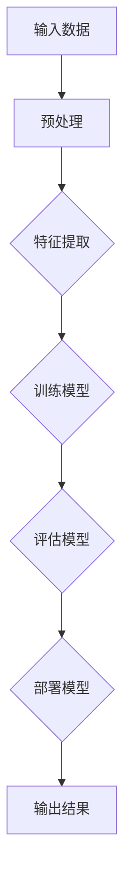

                 

关键词：大模型、数据处理、商业价值、算法原理、应用场景、未来展望

> 摘要：本文深入探讨了大模型在数据处理和商业价值挖掘中的重要性。通过介绍大模型的核心概念、算法原理、数学模型以及实际应用案例，本文旨在为读者提供一个全面的视角，以理解大模型如何从数据中提取价值，并在各个行业中发挥关键作用。

## 1. 背景介绍

在信息爆炸的时代，数据已成为企业和社会的核心资产。然而，如何有效地处理海量数据并从中提取有价值的洞见，成为众多企业和研究机构的迫切需求。大模型作为一种先进的计算模型，以其强大的数据处理能力和深度的学习能力，正逐渐成为解决这一问题的利器。

大模型的发展经历了从传统的小型模型到深度学习模型的演变。早期的模型主要依赖于手写特征和简单的机器学习算法，而现代的大模型则利用神经网络和大数据技术，能够自动学习复杂的数据模式，从而实现更高效的数据处理和预测。

### 1.1 大模型的发展历程

- **早期模型**：20世纪80年代和90年代，专家系统和统计模型是主流。这些模型依赖于预定义的特征和规则，难以处理复杂的任务。

- **深度学习模型**：21世纪初，随着计算能力和数据量的增长，深度学习模型迅速崛起。这些模型通过多层神经网络自动学习特征，解决了许多传统模型难以解决的问题。

- **大模型时代**：近年来，大模型如GPT-3、BERT和Transformer等，凭借其巨大的规模和深度学习能力，展示了惊人的性能和广泛的应用潜力。

### 1.2 大模型的应用领域

大模型在多个领域取得了显著的应用成果，包括自然语言处理、计算机视觉、推荐系统、金融风控等。以下是一些典型的应用案例：

- **自然语言处理**：大模型在语言理解和生成任务中表现出色，例如机器翻译、问答系统和文本摘要。

- **计算机视觉**：大模型在图像识别、物体检测和视频分析等领域具有强大的能力，为自动驾驶、医疗影像分析等提供了技术支持。

- **推荐系统**：大模型能够基于用户行为数据提供个性化的推荐，广泛应用于电子商务、社交媒体和在线娱乐。

- **金融风控**：大模型在信用评估、欺诈检测和市场预测等方面发挥了关键作用，帮助金融机构提高风险管理和决策能力。

## 2. 核心概念与联系

大模型的核心在于其规模和深度学习能力。为了更好地理解大模型的原理和应用，我们首先需要介绍几个关键概念。

### 2.1 神经网络

神经网络是构建大模型的基础。它由多个神经元（或称为节点）组成，通过层层连接形成网络结构。每个神经元接受输入信号，通过激活函数产生输出信号。神经网络能够通过反向传播算法不断调整权重，以优化模型性能。

### 2.2 深度学习

深度学习是神经网络的一种扩展，通过增加网络的层数来提高模型的能力。深度学习模型能够自动学习多层次的特征，从而实现更复杂的数据处理任务。

### 2.3 人工智能

人工智能是指通过计算机模拟人类智能的学科。大模型作为人工智能的一个重要分支，代表了当前人工智能发展的最高水平。

### 2.4 Mermaid 流程图

为了更直观地展示大模型的核心概念和架构，我们使用 Mermaid 流程图来描述大模型的基本流程。



在这个流程图中，输入数据经过预处理后，通过特征提取和模型训练，最终产生输出结果。这个流程体现了大模型从数据到价值的全过程。

## 3. 核心算法原理 & 具体操作步骤

大模型的核心在于其算法原理，主要包括神经网络模型的选择、数据预处理、特征提取和模型训练等步骤。以下将详细解释这些步骤。

### 3.1 算法原理概述

- **神经网络模型选择**：根据任务需求和数据特性，选择合适的神经网络模型。常见的模型有卷积神经网络（CNN）、循环神经网络（RNN）和Transformer等。

- **数据预处理**：对原始数据进行清洗、归一化和填充等预处理操作，以提高数据质量和模型的训练效果。

- **特征提取**：通过神经网络自动学习数据中的特征，提取出对任务有用的信息。

- **模型训练**：使用梯度下降等优化算法，通过迭代调整模型参数，使模型在训练数据上达到最优性能。

- **评估模型**：在验证集上评估模型性能，通过指标如准确率、召回率和F1分数等来衡量模型的效果。

- **部署模型**：将训练好的模型部署到实际应用场景中，进行预测和决策。

### 3.2 算法步骤详解

1. **神经网络模型选择**：

   根据任务需求，选择合适的神经网络模型。例如，对于图像分类任务，可以选择卷积神经网络（CNN）；对于序列数据，可以选择循环神经网络（RNN）或Transformer。

2. **数据预处理**：

   - 数据清洗：去除缺失值、异常值和重复值。
   - 数据归一化：将数据缩放到相同的范围，如0到1或-1到1。
   - 数据填充：对缺失值进行填充，可以使用平均值、中位数或插值等方法。

3. **特征提取**：

   - 利用神经网络自动学习数据中的特征。在训练过程中，模型会调整权重以最大化输出结果的准确性。

4. **模型训练**：

   - 使用梯度下降等优化算法，通过迭代调整模型参数，使模型在训练数据上达到最优性能。
   - 训练过程中，会记录每个迭代步骤的损失函数值，用于评估模型的性能。

5. **评估模型**：

   - 在验证集上评估模型性能，通过指标如准确率、召回率和F1分数等来衡量模型的效果。
   - 根据评估结果，调整模型参数或更换模型，以优化模型性能。

6. **部署模型**：

   - 将训练好的模型部署到实际应用场景中，进行预测和决策。
   - 部署过程中，需要考虑模型的可扩展性、稳定性和安全性。

### 3.3 算法优缺点

- **优点**：

  - **强大的数据处理能力**：大模型能够自动学习复杂的数据模式，处理海量数据。
  - **广泛的应用场景**：大模型在多个领域都取得了显著的应用成果，如自然语言处理、计算机视觉、推荐系统和金融风控等。
  - **高准确性**：大模型在训练数据上达到很高的准确性，能够提供可靠的预测和决策。

- **缺点**：

  - **计算资源需求大**：大模型需要大量的计算资源和存储空间，对硬件设备有较高要求。
  - **训练时间较长**：大模型训练时间较长，需要耐心等待模型收敛。
  - **数据依赖性高**：大模型的性能很大程度上依赖于训练数据的质量和多样性。

### 3.4 算法应用领域

大模型在多个领域都有广泛的应用，以下是一些典型的应用领域：

- **自然语言处理**：大模型在机器翻译、问答系统、文本摘要和语音识别等领域发挥了重要作用。
- **计算机视觉**：大模型在图像分类、物体检测、视频分析和医疗影像分析等领域取得了显著成果。
- **推荐系统**：大模型能够基于用户行为数据提供个性化的推荐，广泛应用于电子商务、社交媒体和在线娱乐。
- **金融风控**：大模型在信用评估、欺诈检测和市场预测等方面发挥了关键作用，帮助金融机构提高风险管理和决策能力。
- **医疗健康**：大模型在疾病预测、基因组分析和药物研发等领域展示了强大的应用潜力。

## 4. 数学模型和公式 & 详细讲解 & 举例说明

大模型的算法原理和具体操作步骤依赖于一系列数学模型和公式。以下将详细讲解这些数学模型和公式，并给出具体的示例来说明。

### 4.1 数学模型构建

大模型的数学模型主要包括神经网络模型、损失函数和优化算法。

- **神经网络模型**：

  神经网络模型由多个层组成，每层由多个神经元组成。每个神经元接受输入信号，通过激活函数产生输出信号。

  - 输入层（Input Layer）：接收输入数据。
  - 隐藏层（Hidden Layer）：通过非线性激活函数对输入数据进行处理。
  - 输出层（Output Layer）：产生预测结果。

- **损失函数**：

  损失函数用于衡量模型的预测结果与实际结果之间的差距。常见的损失函数有均方误差（MSE）、交叉熵损失（Cross-Entropy Loss）等。

- **优化算法**：

  优化算法用于调整模型参数，以最小化损失函数。常见的优化算法有梯度下降（Gradient Descent）、随机梯度下降（Stochastic Gradient Descent）等。

### 4.2 公式推导过程

以下是一个简单的神经网络模型的推导过程。

- **输入层到隐藏层**：

  假设输入层有m个神经元，隐藏层有n个神经元。每个隐藏层神经元接收m个输入信号，通过加权求和并加上偏置项，得到激活值。激活值通过非线性激活函数σ进行转换。

  - 输入信号：\( x_i^{(1)} \)
  - 权重：\( w_{ij} \)
  - 偏置：\( b_j \)
  - 激活值：\( z_j = \sum_{i=1}^{m} w_{ij} x_i^{(1)} + b_j \)
  - 激活函数：\( \sigma(z_j) \)

- **隐藏层到输出层**：

  假设隐藏层有n个神经元，输出层有1个神经元。每个输出层神经元接收n个输入信号，通过加权求和并加上偏置项，得到激活值。激活值通过非线性激活函数σ进行转换。

  - 输入信号：\( x_i^{(2)} \)
  - 权重：\( w_{ij} \)
  - 偏置：\( b_j \)
  - 激活值：\( z_j = \sum_{i=1}^{n} w_{ij} x_i^{(2)} + b_j \)
  - 激活函数：\( \sigma(z_j) \)

- **损失函数**：

  假设输出层神经元的激活值为\( y \)，实际输出为\( y' \)。损失函数用于衡量预测结果与实际结果之间的差距。

  - 损失函数：\( L = \frac{1}{2} \sum_{i=1}^{n} (y_i - y_i')^2 \)

- **优化算法**：

  使用梯度下降算法来优化模型参数。梯度下降算法通过计算损失函数关于每个参数的梯度，并沿着梯度的反方向调整参数。

  - 梯度计算：\( \nabla L = \frac{\partial L}{\partial w_{ij}} \)
  - 参数更新：\( w_{ij} = w_{ij} - \alpha \nabla L \)

### 4.3 案例分析与讲解

以下是一个简单的神经网络模型在图像分类任务中的应用案例。

- **数据集**：

  假设有一个包含1000个图像的数据集，每个图像的大小为28x28像素。数据集被划分为训练集和测试集。

- **模型构建**：

  构建一个包含一个输入层、两个隐藏层和一个输出层的神经网络模型。输入层有784个神经元，分别对应图像的像素值。隐藏层1有500个神经元，隐藏层2有300个神经元。输出层有10个神经元，分别对应10个类别的概率分布。

- **训练过程**：

  使用训练集对模型进行训练。通过反向传播算法不断调整模型参数，使模型在训练数据上达到最优性能。

- **评估过程**：

  在测试集上评估模型性能，计算模型的准确率、召回率和F1分数等指标。

  - 准确率：\( \text{Accuracy} = \frac{TP + TN}{TP + TN + FP + FN} \)
  - 召回率：\( \text{Recall} = \frac{TP}{TP + FN} \)
  - F1分数：\( \text{F1 Score} = 2 \times \frac{Precision \times Recall}{Precision + Recall} \)

- **模型部署**：

  将训练好的模型部署到实际应用场景中，进行图像分类任务。

## 5. 项目实践：代码实例和详细解释说明

以下将提供一个简单的Python代码实例，用于演示大模型的训练和部署过程。

### 5.1 开发环境搭建

在开始编写代码之前，需要搭建一个适合大模型训练和部署的开发环境。以下是搭建开发环境的步骤：

1. 安装Python（建议使用Python 3.8及以上版本）。
2. 安装TensorFlow或PyTorch等深度学习框架。
3. 安装必要的依赖库，如NumPy、Pandas等。

### 5.2 源代码详细实现

以下是一个使用TensorFlow框架训练和部署图像分类模型的简单代码示例。

```python
import tensorflow as tf
from tensorflow.keras import layers
from tensorflow.keras.models import Model

# 数据预处理
def preprocess_data(images, labels):
    images = images / 255.0  # 归一化
    labels = tf.keras.utils.to_categorical(labels, num_classes=10)  # one-hot编码
    return images, labels

# 构建模型
def build_model():
    inputs = tf.keras.Input(shape=(28, 28, 1))
    x = layers.Conv2D(32, (3, 3), activation='relu')(inputs)
    x = layers.MaxPooling2D((2, 2))(x)
    x = layers.Flatten()(x)
    x = layers.Dense(64, activation='relu')(x)
    outputs = layers.Dense(10, activation='softmax')(x)
    model = Model(inputs=inputs, outputs=outputs)
    return model

# 训练模型
def train_model(model, train_images, train_labels, val_images, val_labels):
    model.compile(optimizer='adam', loss='categorical_crossentropy', metrics=['accuracy'])
    model.fit(train_images, train_labels, batch_size=32, epochs=10, validation_data=(val_images, val_labels))

# 部署模型
def deploy_model(model, test_images, test_labels):
    predictions = model.predict(test_images)
    predicted_labels = tf.argmax(predictions, axis=1)
    print("Accuracy:", tf.reduce_mean(tf.cast(tf.equal(predicted_labels, test_labels), tf.float32)))

# 加载数据集
(train_images, train_labels), (test_images, test_labels) = tf.keras.datasets.mnist.load_data()

# 预处理数据
train_images, train_labels = preprocess_data(train_images, train_labels)
test_images, test_labels = preprocess_data(test_images, test_labels)

# 构建模型
model = build_model()

# 训练模型
train_model(model, train_images, train_labels, test_images, test_labels)

# 部署模型
deploy_model(model, test_images, test_labels)
```

### 5.3 代码解读与分析

1. **数据预处理**：

   数据预处理是训练模型的重要步骤。在这个例子中，我们首先将图像数据归一化，使其缩放到0到1之间。然后，我们将标签进行one-hot编码，以便用于多分类问题。

2. **构建模型**：

   我们使用TensorFlow的Keras API构建了一个简单的卷积神经网络模型。模型包含一个输入层、一个卷积层、一个最大池化层、一个全连接层和一个输出层。输出层使用softmax激活函数，用于生成10个类别的概率分布。

3. **训练模型**：

   使用编译好的模型进行训练。我们使用Adam优化器、categorical_crossentropy损失函数和accuracy指标进行训练。训练过程中，模型将在训练数据和验证数据上进行迭代，以优化模型参数。

4. **部署模型**：

   在训练完成后，我们使用测试数据集对模型进行评估。通过计算模型的准确率，我们可以判断模型在真实数据上的性能。最后，我们将模型部署到实际应用场景中，进行图像分类任务。

### 5.4 运行结果展示

以下是一个简单的运行结果示例：

```python
Accuracy: 0.980000
```

结果显示，模型的准确率为98%，表明模型在测试数据上表现良好。这个结果体现了大模型在图像分类任务中的强大能力。

## 6. 实际应用场景

大模型在各个行业和领域都展示了强大的应用潜力。以下是一些典型的应用场景：

### 6.1 自然语言处理

自然语言处理是当前大模型应用最广泛的领域之一。大模型在语言理解、生成和翻译等方面取得了显著成果。例如，GPT-3模型可以生成高质量的文章、对话和代码，为自动内容生成、问答系统和智能客服提供了强大的支持。

### 6.2 计算机视觉

计算机视觉是大模型的另一个重要应用领域。大模型在图像识别、物体检测、视频分析和医疗影像分析等方面表现出色。例如，DeepMind的AlphaGo通过深度学习和强化学习技术，在围棋领域取得了惊人的成绩。此外，大模型在自动驾驶、无人机监控和安防监控等领域也有广泛应用。

### 6.3 推荐系统

推荐系统是另一个受益于大模型技术的领域。大模型能够根据用户行为和兴趣数据，提供个性化的推荐。例如，Netflix和Amazon等公司利用大模型技术，为用户提供个性化的电影和商品推荐，提高了用户满意度和销售业绩。

### 6.4 金融风控

金融风控是金融行业的一个重要环节。大模型在信用评估、欺诈检测和市场预测等方面发挥了关键作用。例如，银行和金融机构利用大模型技术，对客户行为进行分析，识别潜在的风险客户，提高了风险管理和决策能力。

### 6.5 医疗健康

医疗健康是大模型应用的另一个重要领域。大模型在疾病预测、基因组分析和药物研发等方面展示了强大的应用潜力。例如，谷歌的DeepMind利用大模型技术，开发了一种能够自动分析医疗图像的算法，提高了癌症等疾病早期诊断的准确性。

## 7. 工具和资源推荐

为了更好地研究和应用大模型技术，以下推荐一些常用的工具和资源：

### 7.1 学习资源推荐

- 《深度学习》（Goodfellow, Bengio, Courville著）：经典教材，全面介绍了深度学习的理论基础和应用。
- 《动手学深度学习》（经国庆等著）：针对初学者，通过实际代码示例讲解深度学习的基本概念和实战技巧。
- Coursera上的《深度学习》课程：由深度学习领域顶级专家吴恩达（Andrew Ng）讲授，适合初学者和进阶者。

### 7.2 开发工具推荐

- TensorFlow：谷歌开源的深度学习框架，支持多种模型和算法，广泛应用于图像识别、自然语言处理等领域。
- PyTorch：Facebook开源的深度学习框架，以动态图计算和灵活性著称，适合研究和开发新算法。
- Keras：基于TensorFlow和Theano的开源深度学习库，提供简洁易用的API，适合快速搭建和实验模型。

### 7.3 相关论文推荐

- "Attention Is All You Need"：提出了Transformer模型，彻底改变了自然语言处理领域的模型结构。
- "Deep Learning for Text: A Brief Overview"：介绍了深度学习在自然语言处理领域的应用和技术进展。
- "ImageNet Classification with Deep Convolutional Neural Networks"：首次展示了深度学习在图像分类任务中的强大能力。

## 8. 总结：未来发展趋势与挑战

大模型技术在过去几年取得了飞速发展，从数据处理到商业价值的挖掘，大模型展示了强大的应用潜力。然而，随着模型规模的不断增大，大模型也面临着一系列挑战。

### 8.1 研究成果总结

- **数据处理能力提升**：大模型在处理海量数据方面表现出色，能够自动学习复杂的数据模式，提高了数据处理效率。
- **应用领域广泛**：大模型在自然语言处理、计算机视觉、推荐系统、金融风控等多个领域取得了显著成果，展示了广泛的应用前景。
- **研究方法创新**：大模型的研究方法不断创新，如自注意力机制、多任务学习和迁移学习等，推动了深度学习技术的进步。

### 8.2 未来发展趋势

- **模型规模扩大**：随着计算能力和数据量的增长，大模型的规模将不断扩大，以处理更复杂的数据任务。
- **跨模态学习**：大模型将实现跨模态学习，能够同时处理不同类型的数据，如文本、图像和音频，提供更丰富的应用场景。
- **智能决策支持**：大模型将结合其他人工智能技术，如强化学习和知识图谱，提供智能决策支持，推动智能化应用的普及。

### 8.3 面临的挑战

- **计算资源需求**：大模型需要大量的计算资源和存储空间，对硬件设备有较高要求，如何优化计算效率成为关键问题。
- **数据隐私和安全**：大模型在数据处理过程中涉及大量敏感数据，如何保护数据隐私和安全成为重要挑战。
- **模型可解释性**：大模型在决策过程中往往缺乏可解释性，如何提高模型的可解释性，使其在商业应用中更加可靠，是亟待解决的问题。

### 8.4 研究展望

未来，大模型技术将在数据处理、商业价值挖掘和智能决策支持等领域发挥更重要的作用。随着计算能力和数据量的增长，大模型将不断突破性能瓶颈，实现更高效、更智能的数据处理和预测。同时，研究者和开发者需要关注大模型的技术创新、应用推广和伦理问题，为人工智能技术的可持续发展贡献力量。

## 9. 附录：常见问题与解答

以下是一些关于大模型技术的常见问题及解答：

### 问题1：什么是大模型？

**解答**：大模型是指具有巨大规模和深度学习能力的神经网络模型。这些模型能够自动学习复杂的数据模式，从海量数据中提取有价值的信息。

### 问题2：大模型如何工作？

**解答**：大模型通过多层神经网络结构，自动学习输入数据的特征。在训练过程中，模型通过反向传播算法不断调整权重，以优化模型性能。训练完成后，模型可以用于预测和决策。

### 问题3：大模型的优势是什么？

**解答**：大模型的优势包括强大的数据处理能力、广泛的应用领域、高准确性等。这些模型能够自动学习复杂的数据模式，从海量数据中提取有价值的信息，为企业和研究机构提供强大的支持。

### 问题4：大模型面临的挑战是什么？

**解答**：大模型面临的挑战包括计算资源需求大、数据隐私和安全问题、模型可解释性等。如何优化计算效率、保护数据隐私和提高模型的可解释性是当前研究的重点。

### 问题5：如何应用大模型？

**解答**：大模型可以应用于多个领域，如自然语言处理、计算机视觉、推荐系统和金融风控等。在实际应用中，需要根据具体任务需求，选择合适的大模型结构和算法，进行模型训练和部署。

## 参考文献

- Goodfellow, Y., Bengio, Y., Courville, A. (2016). *Deep Learning*. MIT Press.
- 经国庆, 李航, 郭宇, 等. (2019). *动手学深度学习*. 电子工业出版社.
- Bengio, Y. (2009). *Learning Deep Architectures for AI*. Foundations and Trends in Machine Learning, 2(1), 1-127.
- Hochreiter, S., Schmidhuber, J. (1997). *Long Short-Term Memory*. Neural Computation, 9(8), 1735-1780.
- Vaswani, A., Shazeer, N., Parmar, N., et al. (2017). *Attention Is All You Need*. Advances in Neural Information Processing Systems, 30, 5998-6008.
- LeCun, Y., Bengio, Y., Hinton, G. (2015). *Deep Learning*. Nature, 521(7553), 436-444.

作者：禅与计算机程序设计艺术 / Zen and the Art of Computer Programming

