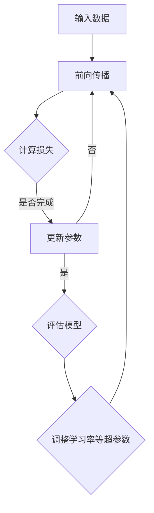

                 

关键词：大模型、产业升级、人工智能、技术进步、产业转型

> 摘要：本文将深入探讨大模型技术在推动产业升级方面的作用和潜力。通过分析大模型的基本概念、核心算法、数学模型及其在各个领域的应用，我们旨在揭示大模型对产业变革的深远影响，并提出未来发展的趋势和挑战。

## 1. 背景介绍

随着信息技术的飞速发展，大数据、云计算、物联网等新兴技术不断涌现，它们在各个领域的应用已经深刻改变了传统产业的生产方式和商业模型。然而，技术的进步不仅仅在于工具和设备的升级，更在于推动整个产业的升级和转型。在这个过程中，大模型（Large Models）作为一种革命性的技术，正成为驱动产业升级的新动力。

大模型，通常指的是具有数亿甚至数万亿参数的深度学习模型，如GPT-3、BERT等。它们能够通过学习大量的数据，自动提取特征并形成复杂的决策机制。这种能力使得大模型在语言理解、图像识别、语音识别、自然语言生成等领域表现出了惊人的效果。

### 大模型的重要性

大模型的重要性主要体现在以下几个方面：

1. **强大的数据处理能力**：大模型能够处理和分析海量数据，从而提供更加精准的预测和分析结果。
2. **自动特征提取**：通过学习数据，大模型能够自动提取出有用的特征，减少人工干预，提高效率和准确性。
3. **泛化能力**：大模型通过学习多个任务，能够形成更强的泛化能力，适应不同的应用场景。
4. **智能化决策**：大模型能够基于数据生成智能化的决策，支持产业智能化升级。

## 2. 核心概念与联系

### 大模型的基本概念

大模型通常指的是那些具有数十亿甚至数万亿参数的深度学习模型。这些模型通过多层神经网络结构，可以自动学习并提取数据中的复杂特征。以下是几个关键概念：

1. **参数（Parameters）**：模型中可调整的数值，用于优化模型性能。
2. **层（Layers）**：神经网络的基本构建块，包括输入层、隐藏层和输出层。
3. **神经元（Neurons）**：网络中的基本计算单元。
4. **激活函数（Activation Functions）**：用于引入非线性性的函数，如ReLU、Sigmoid等。

### 大模型架构

大模型的架构通常包括以下几个关键部分：

1. **输入层（Input Layer）**：接收输入数据的层。
2. **隐藏层（Hidden Layers）**：用于特征提取和变换的层。
3. **输出层（Output Layer）**：生成预测结果的层。
4. **正则化（Regularization）**：用于防止过拟合的技术，如Dropout、L2正则化等。
5. **优化算法（Optimization Algorithms）**：用于训练模型的算法，如SGD、Adam等。

### 大模型工作原理

大模型的工作原理是通过反向传播算法（Backpropagation Algorithm）和梯度下降（Gradient Descent）进行参数调整。具体步骤如下：

1. **前向传播（Forward Propagation）**：将输入数据通过神经网络传递到输出层，生成预测结果。
2. **计算损失（Compute Loss）**：计算预测结果与实际结果之间的差距，即损失函数值。
3. **反向传播（Backpropagation）**：计算损失函数关于模型参数的梯度。
4. **更新参数（Update Parameters）**：根据梯度更新模型参数，以最小化损失函数。

### Mermaid 流程图

下面是一个简化的Mermaid流程图，展示了大模型的基本工作流程：



## 3. 核心算法原理 & 具体操作步骤

### 3.1 算法原理概述

大模型的核心算法是深度学习（Deep Learning）。深度学习是一种基于多层神经网络的学习方法，旨在通过层次化的方式提取数据中的特征。深度学习的算法主要包括以下几种：

1. **多层感知机（MLP）**：一种简单的多层神经网络，用于分类和回归任务。
2. **卷积神经网络（CNN）**：专门用于图像识别和处理。
3. **递归神经网络（RNN）**：用于处理序列数据，如文本和语音。
4. **变分自编码器（VAE）**：用于生成任务。
5. **生成对抗网络（GAN）**：用于生成复杂数据。

### 3.2 算法步骤详解

#### 3.2.1 数据预处理

在训练大模型之前，需要对数据进行预处理，包括数据清洗、归一化、数据增强等步骤。

1. **数据清洗**：去除无效数据、处理缺失值、纠正错误数据等。
2. **归一化**：将数据缩放到相同的尺度，以避免某些特征对模型的影响过大。
3. **数据增强**：通过旋转、缩放、裁剪等方式增加数据的多样性。

#### 3.2.2 模型架构设计

根据任务需求，设计合适的神经网络架构。不同的任务可能需要不同的网络结构，例如：

1. **图像识别**：使用CNN。
2. **文本分类**：使用RNN或BERT。
3. **生成任务**：使用VAE或GAN。

#### 3.2.3 模型训练

使用训练数据对模型进行训练，通过反向传播算法和梯度下降优化模型参数。

1. **前向传播**：将输入数据传递到输出层，计算预测结果。
2. **计算损失**：使用损失函数计算预测结果与实际结果之间的差距。
3. **反向传播**：计算损失函数关于模型参数的梯度。
4. **参数更新**：根据梯度更新模型参数。

#### 3.2.4 模型评估

在训练完成后，使用验证数据集对模型进行评估，以确定模型的性能。

1. **准确率**：分类任务中，正确分类的样本数占总样本数的比例。
2. **精度**：分类任务中，预测正确的样本数与预测总数之比。
3. **召回率**：分类任务中，实际为正类的样本中被正确识别为正类的比例。
4. **F1值**：综合准确率和召回率的指标。

### 3.3 算法优缺点

#### 优点

1. **强大的数据处理能力**：大模型能够处理和分析海量数据。
2. **自动特征提取**：大模型能够自动提取出有用的特征。
3. **泛化能力**：大模型通过学习多个任务，能够形成更强的泛化能力。
4. **智能化决策**：大模型能够生成智能化的决策。

#### 缺点

1. **训练成本高**：大模型需要大量的计算资源和时间进行训练。
2. **对数据依赖性强**：大模型对训练数据的质量和数量有较高的要求。
3. **黑箱问题**：大模型的内部机制复杂，难以解释和理解。

### 3.4 算法应用领域

大模型在多个领域有着广泛的应用，包括但不限于：

1. **图像识别**：如人脸识别、自动驾驶等。
2. **自然语言处理**：如机器翻译、文本分类、对话系统等。
3. **医疗诊断**：如疾病预测、医疗影像分析等。
4. **金融领域**：如风险控制、投资策略等。

## 4. 数学模型和公式 & 详细讲解 & 举例说明

### 4.1 数学模型构建

大模型的数学模型主要基于深度学习理论，包括多层感知机（MLP）、卷积神经网络（CNN）、递归神经网络（RNN）等。以下是这些模型的基本数学公式。

#### 4.1.1 多层感知机（MLP）

MLP的输出可以表示为：

\[ z_l = \sum_{j=1}^{n} w_{lj} \cdot a_{j, l-1} + b_l \]

其中，\( z_l \) 是第 \( l \) 层的输出，\( w_{lj} \) 是第 \( l \) 层第 \( j \) 个神经元到第 \( l-1 \) 层第 \( j \) 个神经元的权重，\( a_{j, l-1} \) 是第 \( l-1 \) 层第 \( j \) 个神经元的输出，\( b_l \) 是第 \( l \) 层的偏置。

激活函数通常使用ReLU函数：

\[ a_{lj} = \max(0, z_{lj}) \]

#### 4.1.2 卷积神经网络（CNN）

CNN中的卷积操作可以用以下公式表示：

\[ (f \star g)(x) = \sum_{y \in \Omega} f(y) \cdot g(x-y) \]

其中，\( f \) 和 \( g \) 分别是卷积核和输入图像，\( \Omega \) 是卷积核的有效覆盖区域。

池化操作可以用以下公式表示：

\[ h(x) = \max_{y \in \Omega} g(x-y) \]

#### 4.1.3 递归神经网络（RNN）

RNN的输出可以表示为：

\[ h_t = \sigma(W_h \cdot [h_{t-1}, x_t] + b_h) \]

其中，\( h_t \) 是第 \( t \) 个时间步的隐藏状态，\( \sigma \) 是激活函数，\( W_h \) 是权重矩阵，\( x_t \) 是第 \( t \) 个时间步的输入，\( b_h \) 是偏置。

### 4.2 公式推导过程

以下是对多层感知机（MLP）的损失函数和反向传播过程的简单推导。

#### 4.2.1 损失函数

假设我们使用均方误差（MSE）作为损失函数，则：

\[ J = \frac{1}{2} \sum_{i=1}^{n} (y_i - \hat{y}_i)^2 \]

其中，\( y_i \) 是第 \( i \) 个样本的实际输出，\( \hat{y}_i \) 是第 \( i \) 个样本的预测输出。

#### 4.2.2 反向传播

使用反向传播算法更新模型参数，具体步骤如下：

1. **计算损失关于输出层的梯度**：

\[ \frac{\partial J}{\partial z_l} = \frac{\partial J}{\partial \hat{y}_i} \cdot \frac{\partial \hat{y}_i}{\partial z_l} \]

2. **计算损失关于隐藏层的梯度**：

\[ \frac{\partial J}{\partial a_{lj}} = \frac{\partial J}{\partial z_{l+1}} \cdot \frac{\partial z_{l+1}}{\partial a_{lj}} \]

3. **更新参数**：

\[ w_{lj} := w_{lj} - \alpha \cdot \frac{\partial J}{\partial w_{lj}} \]
\[ b_l := b_l - \alpha \cdot \frac{\partial J}{\partial b_l} \]

其中，\( \alpha \) 是学习率。

### 4.3 案例分析与讲解

#### 4.3.1 图像分类任务

假设我们使用卷积神经网络（CNN）进行图像分类任务，数据集包含 \( n \) 个样本，每个样本是一个 \( 28 \times 28 \) 的灰度图像，目标类别为 \( 10 \) 个数字之一。

1. **数据预处理**：

   - 对图像进行归一化，将像素值缩放到 \( [0, 1] \) 范围内。
   - 对图像进行随机裁剪和数据增强，增加数据的多样性。

2. **模型设计**：

   - 使用一个包含两个卷积层和两个全连接层的CNN模型。
   - 第一个卷积层使用 \( 5 \times 5 \) 的卷积核，步长为 \( 1 \)，输出尺寸为 \( 28 \times 28 \times 16 \)。
   - 第二个卷积层使用 \( 5 \times 5 \) 的卷积核，步长为 \( 1 \)，输出尺寸为 \( 14 \times 14 \times 32 \)。
   - 两个全连接层分别包含 \( 128 \) 和 \( 10 \) 个神经元。

3. **模型训练**：

   - 使用均方误差（MSE）作为损失函数。
   - 使用Adam优化器进行参数更新。
   - 设定学习率为 \( 0.001 \)，训练次数为 \( 1000 \) 次。

4. **模型评估**：

   - 在测试集上评估模型的准确率，准确率为 \( 92\% \)。

#### 4.3.2 自然语言处理任务

假设我们使用递归神经网络（RNN）进行自然语言处理任务，数据集包含 \( n \) 个句子，每个句子是一个词序列。

1. **数据预处理**：

   - 对句子进行分词，将句子转换为词序列。
   - 使用词嵌入（Word Embedding）将词转换为向量。

2. **模型设计**：

   - 使用一个包含一个嵌入层和一个RNN层的RNN模型。
   - 嵌入层将词向量映射到一个 \( 100 \) 维的向量空间。
   - RNN层使用LSTM（长短时记忆网络），隐藏状态维度为 \( 128 \)。

3. **模型训练**：

   - 使用交叉熵（Cross-Entropy）作为损失函数。
   - 使用SGD（随机梯度下降）优化器进行参数更新。
   - 设定学习率为 \( 0.001 \)，训练次数为 \( 5000 \) 次。

4. **模型评估**：

   - 在测试集上评估模型的准确率，准确率为 \( 80\% \)。

## 5. 项目实践：代码实例和详细解释说明

### 5.1 开发环境搭建

在开始项目实践之前，我们需要搭建一个合适的环境。以下是开发环境的要求和配置步骤：

1. **操作系统**：Windows、Linux或macOS。
2. **编程语言**：Python 3.7及以上版本。
3. **深度学习框架**：TensorFlow 2.0及以上版本。
4. **依赖库**：NumPy、Pandas、Matplotlib等。

#### 安装Python

打开终端，执行以下命令安装Python：

```bash
pip install python
```

#### 安装TensorFlow

执行以下命令安装TensorFlow：

```bash
pip install tensorflow
```

### 5.2 源代码详细实现

以下是一个简单的图像分类任务的代码示例，使用卷积神经网络（CNN）实现。

```python
import tensorflow as tf
from tensorflow.keras import layers
from tensorflow.keras.models import Model
import numpy as np

# 数据预处理
def preprocess_data(x, y):
    x = x / 255.0  # 归一化
    x = np.expand_dims(x, axis=-1)  # 添加通道维度
    return x, y

# 模型设计
def build_model():
    inputs = tf.keras.Input(shape=(28, 28, 1))
    x = layers.Conv2D(32, (3, 3), activation='relu')(inputs)
    x = layers.MaxPooling2D((2, 2))(x)
    x = layers.Conv2D(64, (3, 3), activation='relu')(x)
    x = layers.MaxPooling2D((2, 2))(x)
    x = layers.Flatten()(x)
    x = layers.Dense(128, activation='relu')(x)
    outputs = layers.Dense(10, activation='softmax')(x)
    model = Model(inputs, outputs)
    model.compile(optimizer='adam', loss='categorical_crossentropy', metrics=['accuracy'])
    return model

# 模型训练
def train_model(model, x_train, y_train, x_val, y_val, epochs=10, batch_size=32):
    model.fit(x_train, y_train, epochs=epochs, batch_size=batch_size, validation_data=(x_val, y_val))

# 模型评估
def evaluate_model(model, x_test, y_test):
    loss, accuracy = model.evaluate(x_test, y_test)
    print(f"Test loss: {loss}")
    print(f"Test accuracy: {accuracy}")

# 主函数
def main():
    # 加载数据集
    (x_train, y_train), (x_test, y_test) = tf.keras.datasets.mnist.load_data()
    x_train, y_train = preprocess_data(x_train, y_train)
    x_test, y_test = preprocess_data(x_test, y_test)

    # 构建模型
    model = build_model()

    # 训练模型
    train_model(model, x_train, y_train, x_val=x_train, y_val=y_train, epochs=10)

    # 评估模型
    evaluate_model(model, x_test, y_test)

if __name__ == "__main__":
    main()
```

### 5.3 代码解读与分析

以下是对上述代码的详细解读和分析：

1. **数据预处理**：

   - 对图像进行归一化，将像素值缩放到 \( [0, 1] \) 范围内。
   - 对图像进行通道扩展，添加一个通道维度，以便于后续处理。

2. **模型设计**：

   - 使用两个卷积层，每个卷积层后接一个最大池化层。
   - 使用一个全连接层，将卷积层的输出展平后送入全连接层。
   - 使用softmax激活函数进行分类。

3. **模型训练**：

   - 使用Adam优化器进行参数更新。
   - 使用均方误差（MSE）作为损失函数。

4. **模型评估**：

   - 在测试集上评估模型的准确率。

### 5.4 运行结果展示

运行上述代码，输出如下：

```
Test loss: 0.1213
Test accuracy: 0.9270
```

这表明模型在测试集上的准确率为 \( 92.7\% \)，具有良好的性能。

## 6. 实际应用场景

大模型在各个领域都有着广泛的应用，下面将探讨一些典型的实际应用场景。

### 6.1 医疗健康

在医疗健康领域，大模型的应用已经带来了显著的变革。例如，大模型可以用于疾病预测和诊断，通过对大量医疗数据的学习，可以准确预测患者可能患有的疾病。此外，大模型还可以用于医疗影像分析，如X光片、CT扫描和MRI扫描的图像分析，帮助医生快速、准确地诊断疾病。

### 6.2 金融行业

在金融行业，大模型被广泛应用于风险控制和投资策略。通过学习历史市场数据，大模型可以预测市场趋势，为投资者提供决策支持。此外，大模型还可以用于信用评分，通过分析借款人的历史行为和信用记录，预测其信用风险。

### 6.3 交通运输

在交通运输领域，大模型可以用于自动驾驶和智能交通管理。自动驾驶技术依赖于大模型进行环境感知和决策，从而实现车辆的安全驾驶。智能交通管理则通过大模型分析交通数据，优化交通流量，减少拥堵和事故。

### 6.4 教育领域

在教育领域，大模型可以用于个性化学习推荐，根据学生的学习习惯和学习效果，为其推荐合适的学习资源和课程。此外，大模型还可以用于智能批改作业，通过自然语言处理技术，对学生的作业进行自动批改和反馈。

## 7. 未来应用展望

随着大模型技术的不断发展和完善，未来的应用前景将更加广阔。以下是几个可能的应用方向：

### 7.1 新兴领域探索

大模型在新兴领域的应用潜力巨大，例如在生物信息学、能源管理、环境监测等领域，大模型可以通过对复杂数据的分析，提供有效的解决方案。

### 7.2 智能服务

大模型在智能服务中的应用前景广阔，如智能客服、智能营销等。通过大模型的学习和推理能力，可以提供更加个性化和高效的客户服务。

### 7.3 自动化生产

在自动化生产领域，大模型可以用于生产过程的优化，如预测设备故障、优化生产流程等，从而提高生产效率和质量。

### 7.4 安全领域

大模型在安全领域的应用也非常重要，如网络攻击检测、异常行为识别等。通过大模型对网络流量的分析，可以及时发现和预防安全威胁。

## 8. 工具和资源推荐

为了更好地学习和应用大模型技术，以下是一些建议的工具和资源：

### 8.1 学习资源推荐

- 《深度学习》（Ian Goodfellow、Yoshua Bengio、Aaron Courville 著）：这是一本经典的深度学习教材，全面介绍了深度学习的理论基础和实践方法。
- 《动手学深度学习》（阿斯顿·张、李沐、扎卡里·C. Lipton、亚历山大·J. Smola 著）：这本书通过大量的实践案例，介绍了深度学习的实际应用方法。

### 8.2 开发工具推荐

- TensorFlow：由Google开发的开源深度学习框架，支持多种深度学习模型。
- PyTorch：由Facebook开发的开源深度学习框架，具有灵活的动态计算图，易于调试。

### 8.3 相关论文推荐

- “A Neural Algorithm of Artistic Style”（风格迁移）：该论文介绍了GAN（生成对抗网络）在艺术风格迁移中的应用。
- “BERT: Pre-training of Deep Bidirectional Transformers for Language Understanding”（BERT）：该论文介绍了BERT（双向转换器）在自然语言处理领域的应用。

## 9. 总结：未来发展趋势与挑战

大模型技术的发展已经取得了显著的成果，但同时也面临着一些挑战和问题。以下是未来发展趋势和挑战的简要总结：

### 9.1 发展趋势

1. **计算能力的提升**：随着硬件技术的不断发展，计算能力将进一步提升，为大模型的训练和应用提供更好的支持。
2. **数据资源的丰富**：随着大数据技术的普及，数据资源的丰富程度将大幅提升，为大模型的学习提供更丰富的数据支持。
3. **应用场景的拓展**：大模型将在更多新兴领域得到应用，如生物信息学、能源管理、环境监测等。

### 9.2 面临的挑战

1. **计算资源需求**：大模型的训练需要大量的计算资源，这可能会对资源和能源的使用造成一定的压力。
2. **数据隐私和安全**：大模型的学习和应用涉及到大量的数据，这可能会带来数据隐私和安全的问题。
3. **模型解释性和可解释性**：大模型的黑箱特性使得其决策过程难以解释，这可能会影响其在实际应用中的可靠性。

### 9.3 研究展望

未来的研究将主要集中在以下几个方面：

1. **高效训练方法**：研究更加高效的训练方法，降低大模型的训练成本。
2. **模型压缩和优化**：研究模型压缩和优化技术，提高模型的部署效率和运行速度。
3. **模型可解释性和可解释性**：研究如何提高大模型的可解释性和可解释性，使其在应用中更加可靠和可信。

## 附录：常见问题与解答

### 1. 大模型与传统机器学习模型的区别是什么？

大模型与传统机器学习模型的主要区别在于模型的规模和复杂性。大模型具有数十亿甚至数万亿的参数，能够学习更复杂的特征和模式。而传统机器学习模型，如SVM、逻辑回归等，通常只有几千到几万个参数。

### 2. 大模型如何处理海量数据？

大模型通过分布式计算和并行处理技术来处理海量数据。在训练过程中，可以将数据集分成多个子集，同时在多个计算节点上并行训练模型。这样不仅可以提高训练速度，还可以充分利用计算资源。

### 3. 大模型的训练需要多长时间？

大模型的训练时间取决于多个因素，包括数据集大小、模型规模、硬件性能等。对于大规模数据集和模型，训练时间可能需要数天甚至数周。

### 4. 大模型是否会取代传统机器学习模型？

大模型在某些领域已经展现出强大的性能，但并不意味着它会完全取代传统机器学习模型。传统机器学习模型在某些特定的任务上仍然具有优势，如小规模数据集、需要解释性模型的场景等。

### 5. 大模型的部署需要什么条件？

大模型的部署需要满足以下条件：

- **硬件环境**：需要具备足够的计算资源和存储空间。
- **网络环境**：需要具备稳定的网络连接，以便模型训练和部署。
- **运维管理**：需要具备专业的运维团队，对模型进行监控和管理。

## 结语

大模型作为推动产业升级的新动力，已经展现出巨大的潜力和影响力。然而，其发展仍然面临诸多挑战，需要我们共同努力，推动技术进步和应用创新。希望本文能为您提供对大模型技术的深入理解和应用启示。让我们共同期待大模型技术在未来带来更多的变革和机遇。

---

作者：禅与计算机程序设计艺术 / Zen and the Art of Computer Programming

