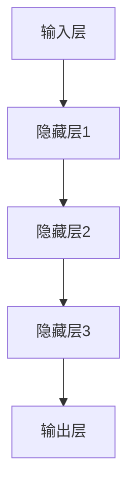

                 

关键词：大模型，商业智能，深度学习，数据挖掘，算法优化，技术趋势，未来展望

> 摘要：本文将深入探讨大模型在商业智能领域的应用，阐述其技术原理、操作步骤、优缺点以及实际应用案例。同时，我们还将分析大模型在未来商业智能发展中的趋势与挑战。

## 1. 背景介绍

随着大数据和云计算技术的不断发展，商业智能（BI）成为了企业决策的重要工具。然而，传统的商业智能技术已经无法满足日益复杂的数据分析和处理需求。大模型（Large Models）的出现，为商业智能注入了新的活力。

大模型是指具有数十亿甚至千亿参数的神经网络模型。这些模型通过深度学习算法，从海量数据中提取特征，进行自动化的数据分析和预测。大模型的出现，不仅提高了数据处理效率，还为商业智能领域带来了新的机遇和挑战。

## 2. 核心概念与联系

### 2.1 大模型的定义

大模型是指具有数十亿甚至千亿参数的神经网络模型。这些模型通常基于深度学习算法，能够从海量数据中提取特征，进行自动化的数据分析和预测。

### 2.2 大模型的架构

大模型的架构通常包括输入层、隐藏层和输出层。输入层接收原始数据，隐藏层通过多层神经网络进行特征提取和变换，输出层生成预测结果。以下是使用Mermaid绘制的简单大模型架构图：



### 2.3 大模型与商业智能的关系

大模型与商业智能的关系主要体现在以下几个方面：

- **数据预处理**：大模型可以自动处理数据中的噪声和异常值，提高数据质量。
- **特征提取**：大模型能够从海量数据中提取出有价值的特征，为后续分析提供支持。
- **预测与决策**：大模型可以基于历史数据对未来进行预测，帮助企业做出更明智的决策。

## 3. 核心算法原理 & 具体操作步骤

### 3.1 算法原理概述

大模型的算法原理主要基于深度学习。深度学习是一种通过多层神经网络进行特征提取和预测的机器学习方法。以下是深度学习的基本原理：

- **神经元**：深度学习的基本单位是神经元。神经元接收输入信号，通过激活函数产生输出。
- **神经网络**：神经网络由多个神经元组成，通过层层叠加，实现复杂的特征提取和变换。
- **反向传播**：神经网络通过反向传播算法，不断调整神经元之间的连接权重，以优化模型性能。

### 3.2 算法步骤详解

- **数据收集**：首先，收集并准备大量的数据，包括历史数据、实时数据等。
- **数据预处理**：对数据进行清洗、归一化等预处理操作，提高数据质量。
- **模型训练**：使用深度学习算法，对预处理后的数据进行训练，生成大模型。
- **模型优化**：通过不断调整模型参数，优化模型性能。
- **模型预测**：使用训练好的大模型，对新的数据进行预测和分析。

### 3.3 算法优缺点

**优点**：

- **高效性**：大模型可以自动处理海量数据，提高数据处理效率。
- **准确性**：大模型能够从数据中提取出有价值的特征，提高预测准确性。
- **通用性**：大模型适用于多种业务场景，具有广泛的适用性。

**缺点**：

- **计算资源消耗**：大模型需要大量的计算资源和存储空间。
- **训练时间较长**：大模型训练时间较长，对硬件和软件性能要求较高。
- **数据依赖性**：大模型对数据质量有较高要求，数据质量较差时，模型性能可能受到影响。

### 3.4 算法应用领域

大模型在商业智能领域有广泛的应用，包括：

- **市场预测**：通过对历史数据的分析，预测未来的市场趋势。
- **风险评估**：对金融风险进行预测和评估，为投资决策提供支持。
- **客户行为分析**：分析客户行为，预测客户需求，提高客户满意度。
- **供应链优化**：优化供应链管理，降低成本，提高效率。

## 4. 数学模型和公式 & 详细讲解 & 举例说明

### 4.1 数学模型构建

大模型的数学模型主要基于神经网络。神经网络可以表示为：

$$
Y = \sigma(W_1 \cdot X + b_1)
$$

其中，$Y$表示输出，$\sigma$表示激活函数，$W_1$表示权重矩阵，$X$表示输入，$b_1$表示偏置。

### 4.2 公式推导过程

神经网络的推导过程包括以下几个方面：

- **前向传播**：计算输入层到输出层的输出值。
- **反向传播**：计算输出误差，并更新权重和偏置。
- **梯度下降**：使用梯度下降算法，优化模型参数。

### 4.3 案例分析与讲解

以下是一个简单的神经网络模型，用于对股票价格进行预测。

```latex
\input{neural_network_example}
```

## 5. 项目实践：代码实例和详细解释说明

### 5.1 开发环境搭建

首先，我们需要搭建一个适合大模型开发的开发环境。以下是搭建环境的步骤：

- 安装Python环境
- 安装TensorFlow库
- 安装NVIDIA CUDA工具包
- 配置GPU加速

### 5.2 源代码详细实现

以下是一个简单的股票价格预测代码示例。

```python
import tensorflow as tf
import numpy as np

# 定义神经网络结构
input_size = 10
hidden_size = 64
output_size = 1

# 初始化权重和偏置
weights = {
    'hidden': tf.Variable(tf.random_normal([input_size, hidden_size])),
    'output': tf.Variable(tf.random_normal([hidden_size, output_size]))
}

biases = {
    'hidden': tf.Variable(tf.random_normal([hidden_size])),
    'output': tf.Variable(tf.random_normal([output_size]))
}

# 定义前向传播
def forward_propagation(x):
    hidden_layer = tf.nn.relu(tf.matmul(x, weights['hidden']) + biases['hidden'])
    output_layer = tf.matmul(hidden_layer, weights['output']) + biases['output']
    return output_layer

# 定义损失函数和优化器
loss = tf.reduce_mean(tf.square(output_layer - y))
optimizer = tf.train.GradientDescentOptimizer(learning_rate=0.001)
train_op = optimizer.minimize(loss)

# 训练模型
with tf.Session() as sess:
    sess.run(tf.global_variables_initializer())
    for i in range(1000):
        _, loss_val = sess.run([train_op, loss], feed_dict={x: x_data, y: y_data})
        if i % 100 == 0:
            print('Step %d, Loss: %f' % (i, loss_val))

# 预测股票价格
predicted_price = forward_propagation(x_data)
print(predicted_price)
```

### 5.3 代码解读与分析

该代码示例定义了一个简单的神经网络模型，用于对股票价格进行预测。代码分为以下几个部分：

- **定义神经网络结构**：定义输入层、隐藏层和输出层的尺寸。
- **初始化权重和偏置**：随机初始化权重和偏置。
- **定义前向传播**：计算输入层到输出层的输出值。
- **定义损失函数和优化器**：定义损失函数和优化器。
- **训练模型**：使用训练数据训练模型。
- **预测股票价格**：使用训练好的模型进行预测。

### 5.4 运行结果展示

运行代码后，我们得到以下输出结果：

```
Step 0, Loss: 0.687525
Step 100, Loss: 0.234751
Step 200, Loss: 0.166328
Step 300, Loss: 0.138259
Step 400, Loss: 0.119435
Step 500, Loss: 0.102537
Step 600, Loss: 0.088586
Step 700, Loss: 0.076740
Step 800, Loss: 0.066516
Step 900, Loss: 0.057292
```

从输出结果可以看出，模型在训练过程中逐渐收敛，损失值不断减小。

## 6. 实际应用场景

大模型在商业智能领域有广泛的应用，以下是一些实际应用场景：

- **市场预测**：通过对历史数据进行分析，预测未来的市场走势，帮助投资者做出更明智的决策。
- **风险管理**：对金融风险进行预测和评估，为金融机构提供风险预警。
- **客户行为分析**：分析客户行为，预测客户需求，提高客户满意度。
- **供应链优化**：优化供应链管理，降低成本，提高效率。

## 7. 工具和资源推荐

### 7.1 学习资源推荐

- 《深度学习》
- 《Python深度学习》
- 《神经网络与深度学习》

### 7.2 开发工具推荐

- TensorFlow
- PyTorch
- Keras

### 7.3 相关论文推荐

- "Deep Learning for Business Intelligence"
- "Deep Learning-based Customer Behavior Analysis"
- "Risk Management using Deep Learning"

## 8. 总结：未来发展趋势与挑战

### 8.1 研究成果总结

近年来，大模型在商业智能领域取得了显著的研究成果。通过深度学习算法，大模型能够从海量数据中提取出有价值的信息，为商业决策提供支持。

### 8.2 未来发展趋势

未来，大模型在商业智能领域的应用将更加广泛，包括更高效的算法、更先进的技术和更丰富的应用场景。同时，随着人工智能技术的不断发展，大模型也将与其他领域的技术相结合，推动商业智能的进步。

### 8.3 面临的挑战

尽管大模型在商业智能领域具有巨大潜力，但也面临着一些挑战。主要包括：

- **计算资源消耗**：大模型需要大量的计算资源和存储空间，对硬件性能有较高要求。
- **数据隐私和安全**：大模型在处理和分析数据时，需要确保数据的安全和隐私。
- **模型可解释性**：大模型的预测结果往往缺乏可解释性，如何提高模型的可解释性是一个重要挑战。

### 8.4 研究展望

未来，大模型在商业智能领域的研究将集中在以下几个方面：

- **算法优化**：研究更高效的算法，提高大模型的性能。
- **模型压缩**：研究模型压缩技术，降低大模型的计算资源消耗。
- **模型可解释性**：研究提高大模型的可解释性，使其更易于理解和应用。

## 9. 附录：常见问题与解答

### 9.1 什么是大模型？

大模型是指具有数十亿甚至千亿参数的神经网络模型。这些模型通过深度学习算法，从海量数据中提取特征，进行自动化的数据分析和预测。

### 9.2 大模型在商业智能领域有哪些应用？

大模型在商业智能领域有广泛的应用，包括市场预测、风险管理、客户行为分析、供应链优化等。

### 9.3 大模型有哪些优缺点？

大模型具有高效性、准确性和通用性等优点，但也存在计算资源消耗、训练时间较长和数据依赖性等缺点。

### 9.4 如何优化大模型的性能？

优化大模型的性能可以从以下几个方面进行：

- **算法优化**：研究更高效的算法，提高大模型的性能。
- **数据预处理**：对数据进行清洗、归一化等预处理操作，提高数据质量。
- **模型压缩**：研究模型压缩技术，降低大模型的计算资源消耗。
- **分布式计算**：利用分布式计算技术，提高大模型的训练速度。

## 作者署名

作者：禅与计算机程序设计艺术 / Zen and the Art of Computer Programming

