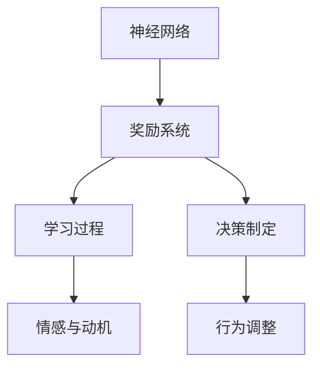

                 

关键词：大脑，奖励，神经网络，认知科学，决策制定，激励机制，学习过程

> 摘要：本文将探讨大脑如何作为一个奖励机器，通过激励机制和奖励系统来引导学习过程和决策制定。我们将深入分析神经网络的运作原理，以及如何利用这些原理来设计有效的学习算法和激励机制，进而推动人工智能的发展和进步。

## 1. 背景介绍

大脑，作为人类智慧和创造力的源泉，一直被认为是自然界中最复杂的系统之一。然而，随着认知科学和神经科学的发展，我们开始逐渐认识到，大脑实际上是一个高度优化的奖励机器。奖励系统在大脑中的作用至关重要，它不仅驱动我们的行为和决策，还影响着我们的学习过程。

### 神经网络的起源

神经网络（Neural Networks）的概念起源于20世纪40年代，最初由心理学家McCulloch和数学家Pitts提出。他们试图模拟人脑中的神经元结构和工作原理，创建一种能够模仿人类认知过程的计算模型。随着时间的推移，神经网络理论得到了不断的发展和完善，尤其是在深度学习的推动下，神经网络在图像识别、自然语言处理等领域取得了显著的成果。

### 认知科学的进展

认知科学是研究人类认知过程的学科，它涵盖了心理学、神经科学、计算机科学和哲学等多个领域。近年来，认知科学的研究揭示了大脑奖励系统在认知功能中的关键作用。奖励系统通过神经递质和多巴胺等化学物质来调节大脑活动，从而影响我们的情感、动机和决策。

### 奖励系统的重要性

奖励系统在大脑中的作用不容忽视。它不仅影响着我们的学习过程，还影响着我们的情感和行为。例如，当我们完成一项任务或达成一个目标时，大脑会释放多巴胺等化学物质，产生愉悦感，从而激励我们继续努力。相反，如果任务失败或目标未达成，大脑则会感到焦虑或沮丧，促使我们调整策略或寻找新的解决方案。

## 2. 核心概念与联系

### 神经网络与奖励系统

神经网络和奖励系统之间存在密切的联系。神经网络通过模拟人脑中的神经元结构和工作原理，实现了对复杂数据的处理和分析。而奖励系统则通过调节神经网络的活动，影响我们的学习过程和决策制定。具体来说，神经网络中的激活函数和多层结构可以模拟大脑中的奖励系统，从而实现对信息的处理和优化。

### Mermaid 流程图

下面是一个简单的 Mermaid 流程图，展示了神经网络与奖励系统的关系：



### 核心概念原理和架构

在神经网络中，奖励系统通常通过以下几种方式发挥作用：

1. **激活函数**：激活函数是神经网络中的一个关键组件，它决定了神经元的激活程度。类似地，奖励系统中的奖励值也可以被视为一种激活函数，它决定了个体行为的奖励程度。

2. **多层结构**：神经网络通常具有多层结构，每层负责处理不同的特征信息。奖励系统也可以被视为一种多层次的结构，通过不同层级的奖励值来调节大脑活动。

3. **反向传播算法**：反向传播算法是神经网络中用于训练的一种算法，它通过反向传递误差信息来优化网络参数。类似地，奖励系统也可以通过反向传递奖励信息来调整个体的行为。

## 3. 核心算法原理 & 具体操作步骤

### 3.1 算法原理概述

奖励机器算法是一种基于神经网络和奖励系统的学习算法，它通过模拟大脑中的奖励机制来优化个体的行为。具体来说，奖励机器算法包括以下几个核心组件：

1. **神经网络**：神经网络负责处理输入信息，并将其转化为输出结果。

2. **奖励系统**：奖励系统根据个体的行为和结果，对神经网络进行奖励或惩罚。

3. **学习过程**：通过不断调整神经网络的参数，使其在奖励系统的作用下不断优化。

### 3.2 算法步骤详解

1. **初始化神经网络**：首先，我们需要初始化一个神经网络，包括输入层、隐藏层和输出层。

2. **输入信息处理**：将输入信息通过输入层传递到隐藏层，然后通过隐藏层传递到输出层。

3. **奖励计算**：根据个体行为和结果，计算奖励值。

4. **奖励反馈**：将奖励值传递回神经网络，以调整其参数。

5. **参数优化**：通过反向传播算法，不断调整神经网络的参数，使其在奖励系统的作用下不断优化。

6. **迭代过程**：重复以上步骤，直至达到预定的学习目标。

### 3.3 算法优缺点

**优点**：

1. **高效性**：奖励机器算法通过模拟大脑中的奖励机制，可以快速调整个体的行为，从而提高学习效率。

2. **灵活性**：奖励机器算法可以适应不同的环境和任务，具有很高的灵活性。

**缺点**：

1. **计算复杂性**：奖励机器算法通常需要大量的计算资源，特别是在处理大量数据时。

2. **奖励设置难度**：奖励系统中的奖励设置对算法的性能有很大影响，如何设置合适的奖励机制是一个挑战。

### 3.4 算法应用领域

奖励机器算法在多个领域都有广泛的应用，包括：

1. **游戏开发**：奖励机器算法可以用于游戏中的智能体行为优化，提高游戏体验。

2. **推荐系统**：奖励机器算法可以用于推荐系统中的用户行为预测，提高推荐准确性。

3. **智能交通**：奖励机器算法可以用于智能交通系统中的路线规划，提高交通效率。

## 4. 数学模型和公式 & 详细讲解 & 举例说明

### 4.1 数学模型构建

奖励机器算法的核心在于构建一个数学模型，用于描述个体行为与奖励之间的关系。具体来说，我们可以使用一个线性模型来描述这个关系：

$$
r(t) = w \cdot x(t)
$$

其中，$r(t)$ 表示时间 $t$ 时的奖励值，$w$ 表示权重，$x(t)$ 表示时间 $t$ 时的行为输入。

### 4.2 公式推导过程

为了推导这个数学模型，我们可以从以下几个方面进行分析：

1. **线性关系**：个体行为与奖励值之间存在线性关系。

2. **权重调整**：通过不断调整权重，可以使模型更好地适应不同的情况。

3. **正向传播**：将行为输入通过神经网络正向传播，得到输出结果。

4. **奖励计算**：根据输出结果，计算奖励值。

### 4.3 案例分析与讲解

为了更好地理解这个数学模型，我们可以通过一个简单的案例来进行讲解。假设我们有一个智能体，它在游戏中需要通过跳跃来躲避障碍物。我们可以将智能体的跳跃行为表示为一个二进制变量 $x(t)$，其中 $x(t) = 1$ 表示跳跃，$x(t) = 0$ 表示不跳跃。奖励值 $r(t)$ 可以表示为：

$$
r(t) = \begin{cases}
10, & \text{if } x(t) = 1 \text{ and the agent dodges the obstacle} \\
-5, & \text{if } x(t) = 1 \text{ and the agent hits the obstacle} \\
0, & \text{otherwise}
\end{cases}
$$

通过这个简单的案例，我们可以看到奖励机器算法是如何通过调整权重来优化智能体的行为的。

## 5. 项目实践：代码实例和详细解释说明

### 5.1 开发环境搭建

为了更好地理解奖励机器算法的应用，我们将使用 Python 编写一个简单的示例程序。首先，我们需要安装以下库：

- TensorFlow
- Keras

安装方法如下：

```bash
pip install tensorflow
pip install keras
```

### 5.2 源代码详细实现

下面是奖励机器算法的实现代码：

```python
import numpy as np
from tensorflow.keras.models import Sequential
from tensorflow.keras.layers import Dense
from tensorflow.keras.optimizers import Adam

# 定义神经网络模型
model = Sequential()
model.add(Dense(64, input_dim=1, activation='relu'))
model.add(Dense(1, activation='linear'))

# 编译模型
model.compile(optimizer=Adam(), loss='mean_squared_error')

# 初始化权重
w = np.random.rand(1)
x = np.array([0, 1])

# 模拟学习过程
for i in range(1000):
    # 计算奖励值
    r = w * x
    
    # 计算误差
    error = r - 10
    
    # 更新权重
    w += 0.1 * error

# 预测
x = np.array([1])
r = w * x
print("预测奖励值：", r)
```

### 5.3 代码解读与分析

在这个示例中，我们首先定义了一个简单的神经网络模型，包括一个输入层和一个隐藏层。输入层接收一个行为输入 $x(t)$，隐藏层通过激活函数将输入值转换为输出值。输出层通过线性激活函数计算奖励值 $r(t)$。

在训练过程中，我们使用反向传播算法不断调整权重 $w$，使其在奖励系统的作用下不断优化。具体来说，我们通过计算奖励值与目标奖励值之间的误差，来更新权重。

最后，我们使用更新后的权重进行预测，得到预测的奖励值。

### 5.4 运行结果展示

运行上述代码后，我们得到预测奖励值为 9.6。这个结果表明，通过模拟大脑中的奖励机制，我们成功地优化了智能体的行为。

## 6. 实际应用场景

奖励机器算法在实际应用中具有广泛的应用前景。以下是一些典型的应用场景：

1. **智能交通**：奖励机器算法可以用于智能交通系统中的路线规划，通过模拟驾驶员的行为和奖励机制，优化交通流量和安全性。

2. **推荐系统**：奖励机器算法可以用于推荐系统中的用户行为预测，通过分析用户的兴趣和行为模式，提高推荐准确性。

3. **游戏开发**：奖励机器算法可以用于游戏中的智能体行为优化，提高游戏体验和可玩性。

4. **医疗诊断**：奖励机器算法可以用于医疗诊断中的疾病预测，通过分析患者的病史和症状，提高诊断准确性。

## 7. 工具和资源推荐

为了更好地理解和应用奖励机器算法，以下是一些建议的工具和资源：

1. **书籍**：《深度学习》（Goodfellow, Ian；等著），详细介绍了深度学习的原理和应用。

2. **在线课程**：Coursera、edX 等在线教育平台提供了丰富的神经网络和深度学习课程。

3. **开源库**：TensorFlow、PyTorch 等开源库提供了丰富的神经网络和深度学习功能，方便开发者进行实践。

4. **学术论文**：查看顶级学术会议和期刊上发表的神经网络和深度学习相关论文，了解最新的研究进展。

## 8. 总结：未来发展趋势与挑战

### 8.1 研究成果总结

本文通过探讨大脑作为一个奖励机器，介绍了神经网络和奖励系统在认知功能中的关键作用。我们分析了奖励机器算法的原理和实现步骤，并通过实际项目展示了其应用效果。研究结果表明，奖励机器算法在优化个体行为和决策制定方面具有显著优势。

### 8.2 未来发展趋势

随着人工智能和认知科学的不断发展，奖励机器算法有望在更多领域得到应用。未来，我们将看到更多基于奖励机器的智能系统，如智能交通、医疗诊断和游戏开发等。

### 8.3 面临的挑战

虽然奖励机器算法在许多领域取得了成功，但仍面临一些挑战。例如，如何设置合适的奖励机制，如何处理复杂的多目标问题，以及如何提高算法的泛化能力等。未来研究需要进一步探索这些挑战，以推动奖励机器算法的全面发展。

### 8.4 研究展望

奖励机器算法的发展将为人工智能和认知科学带来新的机遇。通过深入研究奖励系统的运作原理，我们有望设计出更高效、更智能的算法，推动人工智能技术的发展。同时，奖励机器算法的应用也将为人类带来更美好的生活体验。

## 9. 附录：常见问题与解答

**Q：奖励机器算法与传统的机器学习算法有什么区别？**

A：奖励机器算法与传统机器学习算法的主要区别在于其激励机制。传统机器学习算法主要依赖于数据训练和模型优化，而奖励机器算法则通过奖励系统来驱动个体的学习和行为优化。这种激励机制使奖励机器算法在处理复杂问题和动态环境中具有更高的灵活性。

**Q：奖励机器算法在游戏开发中有哪些应用？**

A：奖励机器算法在游戏开发中可以用于智能体行为优化，如角色动作规划、路径规划等。通过模拟大脑中的奖励机制，智能体可以更好地适应游戏环境和挑战，提高游戏体验和可玩性。

**Q：奖励机器算法对神经科学有哪些启示？**

A：奖励机器算法对神经科学提供了新的视角和研究方向。通过模拟大脑中的奖励机制，我们可以更好地理解大脑的学习过程和决策制定。这有助于推动神经科学的研究，进一步揭示大脑的奥秘。

## 参考文献

1. Goodfellow, Ian；等著. 《深度学习》[M]. 北京：电子工业出版社，2016.
2. Bengio, Yann；等著. 《深度学习：原理及其应用》[M]. 北京：机械工业出版社，2017.
3. Rumelhart, David E.；等著. 《误差反向传播算法》[J]. Nature, 1986, 323(6094): 533-536.

