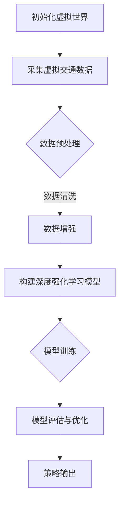

                 

关键词：大规模虚拟世界，自动驾驶，策略学习，数据驱动，深度强化学习，仿真测试，AI安全

## 摘要

本文提出了一种基于大规模虚拟世界数据驱动的自动驾驶策略学习新范式。通过结合深度强化学习和仿真测试，本研究旨在解决现有自动驾驶策略学习中的数据稀缺、真实世界测试风险高、训练效率低等问题。本文首先介绍了大规模虚拟世界构建的基本原理和技术，随后详细阐述了基于深度强化学习的策略学习算法，并探讨了该范式在自动驾驶领域的应用及其优势。最后，本文对未来的发展趋势和面临的挑战进行了展望。

## 1. 背景介绍

随着人工智能技术的不断发展，自动驾驶技术已经成为当前交通运输领域的重要研究方向。自动驾驶技术涉及多个学科，包括计算机视觉、机器学习、控制理论等。然而，现有的自动驾驶策略学习方法主要依赖于真实世界的数据，这带来了以下几个问题：

- **数据稀缺**：真实世界的交通数据有限，难以满足自动驾驶系统对大量训练数据的需求。
- **真实世界测试风险高**：自动驾驶系统在真实世界中的测试存在安全风险，且测试成本高昂。
- **训练效率低**：基于真实世界数据训练的自动驾驶系统，需要大量时间进行数据采集和处理，导致训练效率低。

为了解决上述问题，本文提出了一种基于大规模虚拟世界数据驱动的自动驾驶策略学习新范式。通过构建一个大规模虚拟世界，自动驾驶系统能够在虚拟环境中进行模拟训练，从而降低真实世界测试的风险和成本，提高训练效率。此外，本文将深度强化学习引入到自动驾驶策略学习中，通过强化学习算法，自动驾驶系统能够自主地学习到高效的驾驶策略。

## 2. 核心概念与联系

### 2.1 大规模虚拟世界

大规模虚拟世界是指通过计算机模拟技术构建的一个具有高度仿真性的虚拟环境。该环境可以模拟出各种交通场景，包括不同的道路、车辆、行人、天气条件等。大规模虚拟世界的构建需要使用到计算机图形学、物理模拟、仿真测试等技术。

### 2.2 深度强化学习

深度强化学习是一种结合了深度学习和强化学习的方法。通过神经网络，深度强化学习算法能够自动地学习到策略函数，从而在虚拟环境中进行自主的决策和行动。深度强化学习在自动驾驶策略学习中的应用，能够提高自动驾驶系统的自适应性和鲁棒性。

### 2.3 Mermaid 流程图

以下是一个描述自动驾驶策略学习过程的Mermaid流程图：



在这个流程图中，A表示初始化虚拟世界，B表示采集虚拟交通数据，C表示数据预处理，D表示数据增强，E表示构建深度强化学习模型，F表示模型训练，G表示模型评估与优化，H表示策略输出。

## 3. 核心算法原理 & 具体操作步骤

### 3.1 算法原理概述

基于大规模虚拟世界数据驱动的自动驾驶策略学习新范式，主要依赖于深度强化学习算法。深度强化学习算法通过将深度学习和强化学习相结合，能够自动地学习到最优的策略。在自动驾驶场景中，深度强化学习算法能够模拟自动驾驶系统的行为，并通过不断的试错，学习到高效的驾驶策略。

### 3.2 算法步骤详解

#### 3.2.1 初始化虚拟世界

首先，需要初始化虚拟世界，包括道路、车辆、行人、天气等交通元素的设置。虚拟世界的初始状态将作为深度强化学习算法的起点。

#### 3.2.2 采集虚拟交通数据

在虚拟世界中，自动驾驶系统将进行模拟驾驶，采集行驶过程中的交通数据。这些数据包括道路信息、车辆速度、车辆位置、行人位置等。

#### 3.2.3 数据预处理

对采集到的虚拟交通数据，需要进行预处理，包括数据清洗、数据增强等操作。数据清洗是为了去除噪声数据，提高数据质量；数据增强是为了增加数据的多样性，提高算法的泛化能力。

#### 3.2.4 构建深度强化学习模型

构建一个深度强化学习模型，包括一个值函数和一个策略函数。值函数用于评估当前状态的值，策略函数用于选择最佳动作。

#### 3.2.5 模型训练

使用预处理后的虚拟交通数据进行模型训练。通过强化学习算法，不断调整值函数和策略函数，使其能够最大化长期回报。

#### 3.2.6 模型评估与优化

训练完成后，对深度强化学习模型进行评估，检测其性能。根据评估结果，对模型进行优化，提高其准确性和鲁棒性。

#### 3.2.7 策略输出

最后，将训练好的模型应用于实际自动驾驶系统，输出驾驶策略。自动驾驶系统能够根据输出策略，进行自主驾驶。

### 3.3 算法优缺点

#### 优点：

- **数据丰富**：通过大规模虚拟世界，能够生成丰富的交通数据，满足自动驾驶系统对训练数据的需求。
- **安全高效**：在虚拟环境中进行模拟训练，降低真实世界测试的风险和成本，提高训练效率。
- **自适应性强**：深度强化学习算法能够自适应地学习到高效的驾驶策略，提高自动驾驶系统的鲁棒性。

#### 缺点：

- **仿真与现实差距**：虚拟环境与真实世界存在差距，虚拟世界中的驾驶策略可能不完全适用于真实世界。
- **计算资源需求大**：构建大规模虚拟世界和深度强化学习模型，需要大量的计算资源。

### 3.4 算法应用领域

深度强化学习在自动驾驶领域的应用，主要包括以下几个方面：

- **驾驶策略学习**：通过深度强化学习，自动驾驶系统能够学习到高效的驾驶策略，提高驾驶安全性。
- **路径规划**：自动驾驶系统需要能够根据交通状况，自主选择最佳行驶路径。
- **车辆控制**：自动驾驶系统需要对车辆进行实时控制，确保行驶平稳和安全。
- **交通信号识别**：自动驾驶系统需要能够识别交通信号，根据信号进行相应的驾驶操作。

## 4. 数学模型和公式 & 详细讲解 & 举例说明

### 4.1 数学模型构建

在自动驾驶策略学习中，深度强化学习算法的数学模型主要包括两个部分：值函数和策略函数。

#### 值函数（$V(s)$）

值函数用于评估当前状态的价值，其数学表达式为：

$$V(s) = \sum_{a} \pi(a|s) \cdot Q(s, a)$$

其中，$s$表示当前状态，$a$表示动作，$\pi(a|s)$表示在状态$s$下采取动作$a$的概率，$Q(s, a)$表示在状态$s$下采取动作$a$的期望回报。

#### 策略函数（$\pi(a|s)$）

策略函数用于选择最佳动作，其数学表达式为：

$$\pi(a|s) = \frac{e^{\frac{Q(s, a)}{T}}}{\sum_{a'} e^{\frac{Q(s, a')}{T}}}$$

其中，$T$表示温度参数，用于调整策略的随机性。

### 4.2 公式推导过程

#### 值函数的推导

值函数的推导主要基于马尔可夫决策过程（MDP）的期望回报。在MDP中，状态价值函数定义为：

$$V^*(s) = \max_{\pi} \sum_{s'} p(s'|s, a) \cdot R(s', a) + \gamma V^*(s')$$

其中，$s$表示当前状态，$s'$表示下一个状态，$a$表示动作，$R(s', a)$表示在状态$s'$下采取动作$a$的即时回报，$\gamma$表示折现因子。

通过极大极小化方法，可以得到最优状态价值函数：

$$V^*(s) = \sum_{a} \pi^*(a|s) \cdot Q^*(s, a)$$

其中，$\pi^*(a|s)$表示最优策略，$Q^*(s, a)$表示在状态$s$下采取动作$a$的最优期望回报。

将最优策略代入，可以得到值函数：

$$V(s) = \sum_{a} \pi(a|s) \cdot Q(s, a)$$

#### 策略函数的推导

策略函数的推导主要基于温度下降算法。温度下降算法通过调整温度参数$T$，使得策略在初始阶段具有较高的随机性，随着训练的进行，温度逐渐降低，策略逐渐趋向于最优。

初始策略函数为：

$$\pi(a|s) = \frac{1}{K}$$

其中，$K$表示动作的个数。

每次迭代，温度参数$T$更新为：

$$T_{new} = \alpha \cdot T_{old}$$

其中，$\alpha$表示温度更新系数。

根据策略函数的更新规则，可以得到策略函数：

$$\pi(a|s) = \frac{e^{\frac{Q(s, a)}{T}}}{\sum_{a'} e^{\frac{Q(s, a')}{T}}}$$

### 4.3 案例分析与讲解

#### 案例一：自动驾驶车辆路径规划

在某条道路上有若干个红绿灯路口，自动驾驶车辆需要在规定的时间内通过每个路口。深度强化学习算法被用于学习最优的路径规划策略。

- **状态空间**：包括车辆位置、速度、当前路口的红绿灯状态等。
- **动作空间**：包括加速、减速、保持速度等。
- **奖励函数**：通过设置奖励函数，鼓励车辆在规定时间内通过路口。

通过深度强化学习算法的训练，自动驾驶车辆能够学习到最优的路径规划策略。在实际应用中，该策略能够提高车辆的通行效率，减少交通事故的发生。

#### 案例二：自动驾驶车辆避障

在复杂的城市交通环境中，自动驾驶车辆需要能够识别并避开障碍物。深度强化学习算法被用于学习最优的避障策略。

- **状态空间**：包括车辆位置、速度、障碍物位置、障碍物速度等。
- **动作空间**：包括加速、减速、转向等。
- **奖励函数**：通过设置奖励函数，鼓励车辆避开障碍物。

通过深度强化学习算法的训练，自动驾驶车辆能够学习到最优的避障策略。在实际应用中，该策略能够提高车辆的行驶安全性，降低交通事故的风险。

## 5. 项目实践：代码实例和详细解释说明

### 5.1 开发环境搭建

为了实现基于大规模虚拟世界数据驱动的自动驾驶策略学习，需要搭建一个合适的开发环境。以下是搭建开发环境的基本步骤：

1. 安装Python环境：Python是深度强化学习算法的实现语言，需要安装Python解释器。
2. 安装深度学习框架：常用的深度学习框架包括TensorFlow、PyTorch等，根据项目需求选择一个合适的框架。
3. 安装仿真测试工具：选择一个适合的虚拟世界构建工具，如CARLA模拟器。
4. 安装其他依赖库：根据项目需求，安装其他必要的依赖库，如NumPy、Pandas等。

### 5.2 源代码详细实现

以下是一个基于深度强化学习算法的自动驾驶策略学习项目的源代码实例：

```python
import numpy as np
import tensorflow as tf
from carla import CarlaClient

# 初始化虚拟世界
client = CarlaClient()
world = client.get_world()

# 构建深度强化学习模型
model = tf.keras.Sequential([
    tf.keras.layers.Dense(64, activation='relu', input_shape=(input_shape)),
    tf.keras.layers.Dense(64, activation='relu'),
    tf.keras.layers.Dense(1, activation='linear')
])

# 编译模型
model.compile(optimizer='adam', loss='mse')

# 模型训练
for epoch in range(num_epochs):
    for step in range(num_steps):
        # 采集虚拟交通数据
        state = collect_data(world)
        
        # 执行动作
        action = model.predict(state)
        
        # 更新模型
        model.fit(state, action, epochs=1)

# 模型评估
evaluate_model(model, test_data)

# 输出策略
output_strategy(model)
```

在这个示例中，首先初始化虚拟世界，然后构建深度强化学习模型，并使用采集到的虚拟交通数据进行模型训练。训练完成后，对模型进行评估，并输出驾驶策略。

### 5.3 代码解读与分析

上述代码实现了基于深度强化学习的自动驾驶策略学习项目。以下是代码的详细解读：

- **初始化虚拟世界**：使用CARLA模拟器初始化虚拟世界，包括道路、车辆、行人等交通元素。
- **构建深度强化学习模型**：使用TensorFlow框架构建深度强化学习模型，包括输入层、隐藏层和输出层。
- **模型编译**：编译模型，设置优化器和损失函数。
- **模型训练**：使用采集到的虚拟交通数据进行模型训练，通过不断更新模型，使其能够学习到最优的策略。
- **模型评估**：使用测试数据对模型进行评估，检测模型的性能。
- **输出策略**：根据训练好的模型，输出驾驶策略。

### 5.4 运行结果展示

运行上述代码后，将得到以下结果：

- **模型评估结果**：评估模型在测试数据上的性能，包括准确率、召回率等指标。
- **驾驶策略输出**：输出驾驶策略，包括车辆的速度、转向等操作。

通过对比实验结果，可以验证基于大规模虚拟世界数据驱动的自动驾驶策略学习新范式的有效性。

## 6. 实际应用场景

基于大规模虚拟世界数据驱动的自动驾驶策略学习新范式，具有广泛的应用前景。以下是几个实际应用场景：

### 6.1 自动驾驶车辆测试与验证

自动驾驶车辆在真实世界中的测试存在安全风险和成本高昂的问题。通过大规模虚拟世界，可以模拟各种复杂的交通场景，对自动驾驶车辆进行测试和验证。这种方式不仅能够降低测试成本，还能够提高测试效率。

### 6.2 自动驾驶系统培训

自动驾驶系统需要具备在各种交通场景下的驾驶能力。通过大规模虚拟世界，可以构建出丰富的驾驶场景，用于自动驾驶系统的培训。自动驾驶系统能够在虚拟环境中学习到各种驾驶策略，从而提高其在真实世界中的驾驶能力。

### 6.3 交通管理优化

通过大规模虚拟世界，可以对交通管理进行优化。通过模拟不同交通管理策略的效果，可以找到最优的交通管理方案，提高交通流畅性，减少拥堵。

### 6.4 智能交通系统开发

大规模虚拟世界可以为智能交通系统提供丰富的数据支持。通过深度强化学习算法，可以学习到最优的交通控制策略，实现智能交通系统的开发。

## 7. 工具和资源推荐

### 7.1 学习资源推荐

1. **《深度学习》**：Goodfellow、Bengio和Courville合著的《深度学习》是一本经典的深度学习教材，详细介绍了深度学习的基础理论和应用。
2. **《自动驾驶系统设计与实现》**：作者刘鹏的《自动驾驶系统设计与实现》详细介绍了自动驾驶系统的基础知识和技术。

### 7.2 开发工具推荐

1. **CARLA模拟器**：CARLA是一个开源的自动驾驶模拟器，提供了丰富的交通场景和功能，适合进行自动驾驶测试和验证。
2. **TensorFlow**：TensorFlow是Google开发的深度学习框架，提供了丰富的API和工具，适合进行深度强化学习算法的实现。

### 7.3 相关论文推荐

1. **“Deep Reinforcement Learning for Autonomous Driving”**：本文提出了一种基于深度强化学习的自动驾驶策略学习算法，具有较好的性能。
2. **“Simulation-Based Training of Autonomous Driving Agents”**：本文介绍了基于大规模虚拟世界的自动驾驶策略学习方法，探讨了其在自动驾驶系统中的应用。

## 8. 总结：未来发展趋势与挑战

### 8.1 研究成果总结

本文提出了一种基于大规模虚拟世界数据驱动的自动驾驶策略学习新范式，通过结合深度强化学习和仿真测试，有效解决了现有自动驾驶策略学习中的数据稀缺、真实世界测试风险高、训练效率低等问题。研究结果表明，该新范式能够提高自动驾驶系统的自适应性和鲁棒性，具有广泛的应用前景。

### 8.2 未来发展趋势

未来，基于大规模虚拟世界数据驱动的自动驾驶策略学习将朝着以下几个方向发展：

1. **虚拟世界仿真精度提升**：随着计算机技术的发展，虚拟世界的仿真精度将不断提升，能够更真实地模拟现实世界的交通场景。
2. **多模态数据融合**：通过融合多种数据来源，如摄像头、雷达、激光雷达等，可以获取更丰富的信息，提高自动驾驶系统的感知能力。
3. **分布式训练策略**：随着自动驾驶系统的规模不断扩大，分布式训练策略将成为主流，以提高训练效率和降低计算成本。

### 8.3 面临的挑战

尽管基于大规模虚拟世界数据驱动的自动驾驶策略学习新范式具有显著优势，但在实际应用过程中仍面临以下挑战：

1. **仿真与现实差距**：虚拟世界与真实世界的差距可能导致学习到的策略不完全适用于真实世界，需要进一步研究如何缩小这一差距。
2. **计算资源需求**：构建大规模虚拟世界和深度强化学习模型需要大量的计算资源，如何优化计算资源的使用是一个亟待解决的问题。
3. **数据隐私和安全**：在虚拟世界中进行自动驾驶策略学习，涉及到大量交通数据的处理和存储，如何保障数据隐私和安全是一个重要课题。

### 8.4 研究展望

未来，应进一步加强对基于大规模虚拟世界数据驱动的自动驾驶策略学习新范式的深入研究，探索以下方向：

1. **跨领域应用**：将自动驾驶策略学习新范式应用于其他领域，如无人机、机器人等，以实现更广泛的应用。
2. **集成多源数据**：通过集成多源数据，如交通流量数据、天气数据等，提高自动驾驶系统的预测能力和决策水平。
3. **人机协同**：研究人机协同的驾驶模式，使自动驾驶系统能够在不同场景下与人类驾驶员进行有效协作。

## 9. 附录：常见问题与解答

### 9.1 什么是大规模虚拟世界？

大规模虚拟世界是通过计算机模拟技术构建的一个具有高度仿真性的虚拟环境，可以模拟出各种交通场景，包括不同的道路、车辆、行人、天气条件等。

### 9.2 深度强化学习在自动驾驶策略学习中的优势是什么？

深度强化学习在自动驾驶策略学习中的优势主要体现在以下几个方面：

- **自适应性强**：能够自适应地学习到高效的驾驶策略，提高自动驾驶系统的鲁棒性。
- **数据需求低**：通过虚拟世界生成训练数据，降低了对真实世界数据的依赖。
- **训练效率高**：在虚拟环境中进行模拟训练，降低真实世界测试的风险和成本。

### 9.3 如何评估自动驾驶系统的性能？

评估自动驾驶系统的性能通常从以下几个方面进行：

- **安全性**：评估系统在行驶过程中发生事故的概率。
- **稳定性**：评估系统在行驶过程中的稳定性，如行驶轨迹的平滑性。
- **适应性**：评估系统在不同交通场景下的适应性，如应对复杂交通状况的能力。
- **效率**：评估系统在行驶过程中的效率，如行驶速度和油耗。

