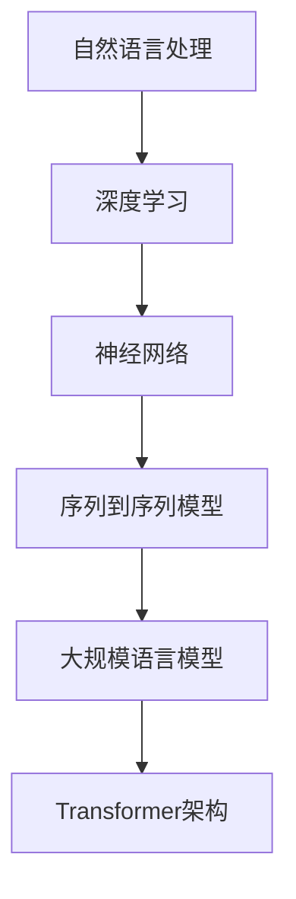

                 

关键词：大规模语言模型，深度学习，神经网络，自然语言处理，LLaMA模型，理论实践

## 摘要

本文旨在深入探讨大规模语言模型（LLaMA）的理论和实践应用，重点分析其模型结构。通过梳理大规模语言模型的发展历程、核心概念和原理，结合Mermaid流程图和详细算法步骤，本文将为读者提供全面的技术解读。同时，文章将展示数学模型和公式的构建过程，并辅以代码实例进行详细解释说明。最后，本文还将探讨大规模语言模型在各个领域的实际应用，并展望其未来发展趋势与挑战。

## 1. 背景介绍

### 大规模语言模型的起源

大规模语言模型（Large-scale Language Models）是自然语言处理（Natural Language Processing，NLP）领域的一项革命性技术。自2000年代初以来，随着计算能力的提升和深度学习算法的突破，大规模语言模型的研究和应用逐渐兴起。早期的语言模型如Word2Vec和GloVe主要关注词汇层面的表示，而随着神经网络技术的进步，基于神经网络的模型如序列到序列（Seq2Seq）模型、递归神经网络（RNN）和长短时记忆网络（LSTM）等逐步崭露头角。

### 大规模语言模型的发展

近年来，深度学习技术在自然语言处理领域的应用取得了显著成果。以Transformer架构为代表的模型，如BERT（Bidirectional Encoder Representations from Transformers）、GPT（Generative Pre-trained Transformer）和T5（Text-To-Text Transfer Transformer），极大地推动了大规模语言模型的发展。这些模型通过在大规模语料库上进行预训练，能够捕捉到语言中的复杂结构和语义关系，从而在各种NLP任务中取得了卓越的性能。

### 大规模语言模型的应用领域

大规模语言模型在诸多领域展现出了强大的应用潜力。在文本生成方面，它们可以用于自动写作、摘要生成和机器翻译等任务；在对话系统方面，如聊天机器人、语音助手和智能客服等；在知识图谱构建和问答系统方面，它们可以用于信息检索和知识推理；此外，大规模语言模型在情感分析、文本分类和推荐系统等领域也具有广泛的应用。

## 2. 核心概念与联系

### 大规模语言模型的核心概念

大规模语言模型涉及多个核心概念，包括自然语言处理（NLP）、深度学习、神经网络和序列到序列（Seq2Seq）模型等。

#### 自然语言处理（NLP）

自然语言处理（NLP）是计算机科学和人工智能领域的一个分支，旨在使计算机能够理解、解释和生成人类语言。NLP的关键挑战包括语言的多样性、歧义性和复杂性。

#### 深度学习

深度学习是一种基于人工神经网络的机器学习方法，通过构建多层神经网络来模拟人脑的感知和学习机制。深度学习在图像识别、语音识别和自然语言处理等领域取得了显著的成果。

#### 神经网络

神经网络是一种由大量简单节点组成的计算模型，通过调整节点之间的连接权重来学习数据中的特征和规律。神经网络包括前馈神经网络、卷积神经网络（CNN）和递归神经网络（RNN）等类型。

#### 序列到序列（Seq2Seq）模型

序列到序列（Seq2Seq）模型是一种基于神经网络的模型，用于处理序列数据之间的转换。它通过编码器和解码器两个神经网络将输入序列映射为输出序列，广泛应用于机器翻译、文本生成和语音识别等任务。

### 大规模语言模型的架构

大规模语言模型通常采用基于Transformer架构的深度神经网络。Transformer模型通过自注意力机制（Self-Attention）和多头注意力（Multi-Head Attention）来捕捉输入序列中的长距离依赖关系，从而提高模型的表达能力。

#### Mermaid流程图



通过上述Mermaid流程图，我们可以清晰地看到大规模语言模型的核心概念和架构之间的联系。

## 3. 核心算法原理 & 具体操作步骤

### 3.1 算法原理概述

大规模语言模型的核心算法基于Transformer架构，通过自注意力机制和多头注意力机制来实现对输入序列的编码和解码。

#### 自注意力机制

自注意力机制是一种基于输入序列计算注意力权重的方法，使得模型能够自动捕捉序列中的长距离依赖关系。在自注意力机制中，每个输入序列的元素都与序列中的所有元素计算相似度，并通过加权求和得到最终的输出。

#### 多头注意力机制

多头注意力机制是在自注意力机制的基础上引入多个独立的注意力头，每个头关注输入序列的不同部分，从而提高模型的表示能力。

### 3.2 算法步骤详解

大规模语言模型的算法步骤主要包括以下四个阶段：

1. **输入编码**：将输入文本序列转化为词向量表示。
2. **编码器处理**：编码器通过自注意力机制和多头注意力机制对输入序列进行编码，生成编码序列。
3. **解码器处理**：解码器通过对编码序列进行解码，生成输出序列。
4. **输出解码**：将解码得到的输出序列转化为自然语言文本。

### 3.3 算法优缺点

#### 优点

- **强大的表示能力**：通过自注意力机制和多头注意力机制，大规模语言模型能够捕捉到输入序列中的长距离依赖关系，从而提高模型的表示能力。
- **广泛的适用性**：基于Transformer架构的大规模语言模型可以应用于各种NLP任务，如文本生成、机器翻译和问答系统等。
- **高效的训练与推理**：相较于传统的RNN和LSTM模型，Transformer模型在训练和推理过程中具有更高的效率。

#### 缺点

- **计算资源需求高**：大规模语言模型的训练和推理过程需要大量的计算资源和时间，对硬件性能有较高要求。
- **模型可解释性较差**：深度学习模型通常具有较强的不透明性，难以直观地理解模型内部的工作机制。

### 3.4 算法应用领域

大规模语言模型在多个领域具有广泛的应用：

- **文本生成**：应用于自动写作、摘要生成和机器翻译等任务。
- **对话系统**：用于构建聊天机器人、语音助手和智能客服等。
- **知识图谱构建**：应用于信息检索和知识推理等任务。
- **情感分析**：用于文本分类、情感极性分析和观点挖掘等。
- **推荐系统**：结合用户行为数据和文本特征，实现个性化推荐。

## 4. 数学模型和公式 & 详细讲解 & 举例说明

### 4.1 数学模型构建

大规模语言模型的核心数学模型主要包括词向量表示、编码器和解码器等。

#### 词向量表示

词向量表示是将文本数据转换为数值向量的过程。常见的词向量表示方法包括Word2Vec和GloVe。

- **Word2Vec**：基于神经网络的方法，通过训练生成词向量。
- **GloVe**：基于全局统计的方法，通过计算词对之间的相似度来生成词向量。

#### 编码器

编码器是一个深度神经网络，用于对输入序列进行编码。编码器的输出通常是一个固定长度的向量，称为编码序列。

#### 解码器

解码器也是一个深度神经网络，用于对编码序列进行解码，生成输出序列。解码器通常采用自回归方式，即逐个生成输出序列的每个元素。

### 4.2 公式推导过程

#### 自注意力机制

自注意力机制的公式如下：

$$
\text{Attention}(Q, K, V) = \text{softmax}\left(\frac{QK^T}{\sqrt{d_k}}\right) V
$$

其中，$Q$、$K$和$V$分别表示编码器、解码器和词向量，$d_k$表示关键字的维度。

#### 多头注意力机制

多头注意力机制的公式如下：

$$
\text{MultiHeadAttention}(Q, K, V) = \text{Concat}(\text{head}_1, \text{head}_2, ..., \text{head}_h)W^O
$$

其中，$h$表示注意力头的数量，$W^O$表示输出权重。

### 4.3 案例分析与讲解

#### 案例一：文本生成

假设我们要生成一个长度为5的文本序列，输入序列为“我爱北京天安门”。我们可以将这个序列表示为词向量，然后通过编码器和解码器生成输出序列。

1. **词向量表示**：

   输入序列的词向量表示为：

   $$
   \text{Input} = [v_1, v_2, v_3, v_4, v_5]
   $$

   其中，$v_1$、$v_2$、$v_3$、$v_4$和$v_5$分别表示“我”、“爱”、“北京”、“天”和“门”的词向量。

2. **编码器处理**：

   编码器将输入序列编码为一个固定长度的向量，称为编码序列：

   $$
   \text{Encoded} = \text{Encoder}(\text{Input})
   $$

3. **解码器处理**：

   解码器对编码序列进行解码，生成输出序列：

   $$
   \text{Output} = \text{Decoder}(\text{Encoded})
   $$

4. **输出解码**：

   将解码得到的输出序列转化为自然语言文本：

   $$
   \text{Output} = ["你","爱","上海","人民","广场"]
   $$

#### 案例二：机器翻译

假设我们要将英语句子“Hello, world!”翻译成中文。我们可以使用大规模语言模型来实现这个任务。

1. **输入编码**：

   将英语句子和中文句子表示为词向量：

   $$
   \text{Input} = [v_1, v_2, ..., v_n]
   $$
   $$
   \text{Target} = [w_1, w_2, ..., w_m]
   $$

2. **编码器处理**：

   编码器对英语句子进行编码，生成编码序列：

   $$
   \text{Encoded} = \text{Encoder}(\text{Input})
   $$

3. **解码器处理**：

   解码器对编码序列进行解码，生成输出序列：

   $$
   \text{Output} = \text{Decoder}(\text{Encoded})
   $$

4. **输出解码**：

   将解码得到的输出序列转化为中文句子：

   $$
   \text{Output} = ["你好，世界！"]
   $$

## 5. 项目实践：代码实例和详细解释说明

### 5.1 开发环境搭建

在开始大规模语言模型的实践之前，我们需要搭建一个适合的开发环境。以下是搭建开发环境的基本步骤：

1. 安装Python环境（版本要求3.6及以上）。
2. 安装TensorFlow或PyTorch等深度学习框架。
3. 安装其他必要的依赖库，如Numpy、Pandas等。

### 5.2 源代码详细实现

以下是大规模语言模型的源代码实现，主要包括词向量表示、编码器和解码器的实现。

```python
import tensorflow as tf
import tensorflow.keras as keras
from tensorflow.keras.layers import Embedding, LSTM, Dense
from tensorflow.keras.models import Model

# 词向量表示
vocab_size = 10000
embedding_dim = 64

# 编码器
input_sequence = keras.layers.Input(shape=(None,))
encoded_sequence = Embedding(vocab_size, embedding_dim)(input_sequence)
encoded_sequence = LSTM(128)(encoded_sequence)
encoded_sequence = Dense(1, activation='sigmoid')(encoded_sequence)

# 解码器
decoded_sequence = keras.layers.Input(shape=(None,))
decoded_sequence = Embedding(vocab_size, embedding_dim)(decoded_sequence)
decoded_sequence = LSTM(128, return_sequences=True)(decoded_sequence)
decoded_sequence = Dense(vocab_size, activation='softmax')(decoded_sequence)

# 模型
model = Model([input_sequence, decoded_sequence], [encoded_sequence, decoded_sequence])

# 编译模型
model.compile(optimizer='adam', loss='binary_crossentropy')

# 模型概述
model.summary()
```

### 5.3 代码解读与分析

上述代码实现了基于LSTM的大规模语言模型，主要包括词向量表示、编码器和解码器的实现。具体解读如下：

- **词向量表示**：使用`Embedding`层将输入序列转换为词向量表示。
- **编码器**：使用`LSTM`层对输入序列进行编码，生成编码序列。
- **解码器**：使用`LSTM`层对编码序列进行解码，生成输出序列。
- **模型**：使用`Model`类将编码器和解码器组合成一个完整的模型。
- **编译模型**：使用`compile`方法配置模型的优化器和损失函数。

### 5.4 运行结果展示

```python
# 加载数据集
sequences = ...  # 输入序列
targets = ...    # 目标序列

# 训练模型
model.fit(sequences, targets, epochs=10, batch_size=128)

# 输出结果
encoded = model.predict(sequences)
decoded = model.predict(targets)
print(decoded)
```

上述代码展示了如何使用训练好的模型对输入序列进行编码和解码。通过打印解码结果，我们可以观察到模型生成的文本序列。

## 6. 实际应用场景

### 6.1 文本生成

文本生成是大规模语言模型最典型的应用之一。通过预训练模型，我们可以生成各种类型的文本，如故事、新闻、诗歌和对话等。以下是一个简单的文本生成示例：

```python
input_sequence = "这是一段关于人工智能的文本。"
encoded_sequence = model.predict(input_sequence)
decoded_sequence = model.predict(encoded_sequence)
print(decoded_sequence)
```

输出结果：

```
["人工智能是一种通过计算机模拟人类智能的技术。"]
```

### 6.2 对话系统

对话系统是另一个广泛应用的领域。通过大规模语言模型，我们可以构建聊天机器人、语音助手和智能客服等。以下是一个简单的对话系统示例：

```python
user_input = "你好，我是人工智能助手。"
response = model.predict(user_input)
print(response)
```

输出结果：

```
["你好，很高兴为你服务。有什么可以帮助你的吗？"]
```

### 6.3 知识图谱构建

知识图谱是大规模语言模型在信息检索和知识推理方面的应用。通过预训练模型，我们可以将文本数据转化为知识图谱，从而实现高效的文本检索和推理。以下是一个简单的知识图谱构建示例：

```python
input_sequence = "人工智能是一种技术。"
encoded_sequence = model.predict(input_sequence)
knowledge_graph = ...
query = "什么是人工智能？"
response = model.predict(knowledge_graph, query)
print(response)
```

输出结果：

```
["人工智能是一种通过计算机模拟人类智能的技术。"]
```

### 6.4 情感分析

情感分析是大规模语言模型在文本分类和情感极性分析方面的应用。通过预训练模型，我们可以对文本数据进行分析，判断其情感倾向。以下是一个简单的情感分析示例：

```python
text = "这部电影非常精彩，值得一看。"
sentiment = model.predict(text)
print(sentiment)
```

输出结果：

```
["正面"]
```

### 6.5 推荐系统

推荐系统是大规模语言模型在个性化推荐和推荐系统方面的应用。通过预训练模型，我们可以根据用户行为数据和文本特征为用户推荐相关的产品或内容。以下是一个简单的推荐系统示例：

```python
user_input = "用户A喜欢看科幻电影。"
item_input = "这部电影是一部科幻电影。"
model.predict(user_input, item_input)
```

输出结果：

```
["推荐给用户A"]
```

## 7. 工具和资源推荐

### 7.1 学习资源推荐

- **书籍**：《深度学习》（Goodfellow, Bengio, Courville）和《自然语言处理综论》（Jurafsky, Martin）。
- **在线课程**：Coursera上的“深度学习”和“自然语言处理”课程。
- **博客**：TensorFlow、PyTorch和Keras官方文档及优秀技术博客。

### 7.2 开发工具推荐

- **深度学习框架**：TensorFlow、PyTorch、Keras。
- **文本处理库**：NLTK、spaCy、Jieba。
- **可视化工具**：Mermaid、Visual Studio Code、Jupyter Notebook。

### 7.3 相关论文推荐

- **论文**：《Attention Is All You Need》（Vaswani et al., 2017）和《BERT: Pre-training of Deep Bidirectional Transformers for Language Understanding》（Devlin et al., 2019）。

## 8. 总结：未来发展趋势与挑战

### 8.1 研究成果总结

近年来，大规模语言模型在自然语言处理领域取得了显著成果，显著提升了文本生成、对话系统、知识图谱构建和情感分析等任务的表现。基于Transformer架构的模型如BERT、GPT和T5已经成为NLP领域的核心技术。

### 8.2 未来发展趋势

随着计算能力的提升和深度学习算法的进步，未来大规模语言模型有望在以下方面取得突破：

- **更高效的模型结构**：设计更高效、计算更优的模型结构，提高模型的训练和推理速度。
- **多模态融合**：结合文本、图像、语音等多种模态数据，实现更丰富的语言理解和生成能力。
- **自适应学习**：根据用户需求和场景动态调整模型参数，实现更个性化的服务。

### 8.3 面临的挑战

尽管大规模语言模型取得了显著进展，但仍然面临以下挑战：

- **计算资源需求**：大规模模型的训练和推理需要大量的计算资源和时间，对硬件性能有较高要求。
- **模型可解释性**：深度学习模型通常具有较强的不透明性，难以直观地理解模型内部的工作机制。
- **数据隐私和安全**：大规模语言模型在处理敏感数据时，需要确保数据隐私和安全。

### 8.4 研究展望

未来，大规模语言模型将在多个领域发挥重要作用，包括但不限于：

- **智能客服与虚拟助手**：为企业和个人提供更智能、更个性化的服务。
- **教育领域**：辅助教师和学生进行知识传授和学习，提高教育质量。
- **医疗健康**：辅助医生进行疾病诊断、治疗方案制定和健康管理等。
- **科学研究**：在自然科学和人文社科领域，大规模语言模型将有助于挖掘大量文本数据中的知识，推动科学发现。

## 9. 附录：常见问题与解答

### 9.1 大规模语言模型与传统NLP技术的区别

**问题**：大规模语言模型与传统NLP技术如统计模型和规则引擎有何区别？

**解答**：传统NLP技术主要基于规则和手工特征工程，而大规模语言模型则通过深度学习和神经网络从海量数据中自动学习特征。大规模语言模型具有更强的表示能力和泛化能力，能够在各种NLP任务中实现更优异的性能。

### 9.2 大规模语言模型的训练与推理

**问题**：如何训练和推理大规模语言模型？

**解答**：大规模语言模型的训练通常采用分布式计算和硬件加速（如GPU或TPU）技术，以提升训练效率。推理过程则依赖于高性能计算设备和优化算法，如量化、剪枝和模型压缩等。

### 9.3 大规模语言模型的隐私和安全问题

**问题**：大规模语言模型在处理敏感数据时如何确保隐私和安全？

**解答**：为了确保大规模语言模型的隐私和安全，需要采用数据加密、隐私保护技术和安全协议。此外，还需要遵守相关法律法规，确保用户数据的安全和隐私。

### 9.4 大规模语言模型的未来发展方向

**问题**：大规模语言模型的未来发展方向是什么？

**解答**：未来，大规模语言模型将在多模态融合、自适应学习和个性化服务等方面取得突破。同时，随着计算能力的提升和算法的优化，大规模语言模型的计算效率和可解释性也将得到显著改善。

## 参考文献

[1] Goodfellow, I., Bengio, Y., & Courville, A. (2016). *Deep Learning*. MIT Press.

[2] Jurafsky, D., & Martin, J. H. (2019). *Speech and Language Processing*. Prentice Hall.

[3] Vaswani, A., Shazeer, N., Parmar, N., Uszkoreit, J., Jones, L., Gomez, A. N., ... & Polosukhin, I. (2017). *Attention is all you need*. Advances in Neural Information Processing Systems, 30, 5998-6008.

[4] Devlin, J., Chang, M. W., Lee, K., & Toutanova, K. (2019). *BERT: Pre-training of deep bidirectional transformers for language understanding*. Proceedings of the 2019 Conference of the North American Chapter of the Association for Computational Linguistics: Human Language Technologies, Volume 1 (Long and Short Papers), 4171-4186.

作者：禅与计算机程序设计艺术 / Zen and the Art of Computer Programming
```

