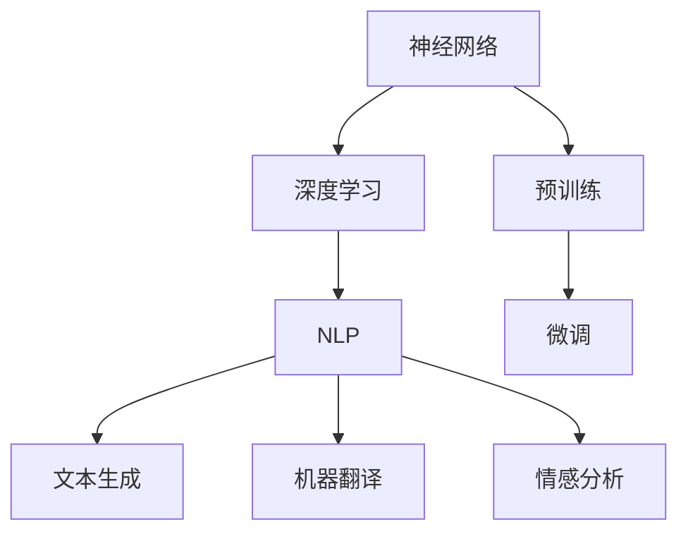

                 

 **关键词：** 大规模语言模型、深度学习、自然语言处理、代码结构、编程实践

> **摘要：** 本文旨在深入探讨大规模语言模型的理论基础、架构设计、实现细节以及其在编程实践中的应用，旨在为读者提供全面的理论和实践指导，帮助理解这一前沿技术的本质和应用潜力。

## 1. 背景介绍

大规模语言模型（Large-scale Language Models，LLMs）是自然语言处理（Natural Language Processing，NLP）领域的一项革命性技术。它们通过深度学习算法从大量文本数据中学习语言模式，从而能够生成连贯且语义丰富的文本。随着计算能力的提升和海量数据资源的积累，大规模语言模型在近年来取得了飞速的发展，并在诸如文本生成、机器翻译、情感分析等众多NLP任务中展现出了卓越的性能。

本文将围绕大规模语言模型展开，首先介绍其理论基础，然后深入探讨其架构设计和具体实现，最后通过实例展示其在编程实践中的应用。本文结构如下：

- **第1章**：背景介绍
- **第2章**：核心概念与联系
- **第3章**：核心算法原理与操作步骤
- **第4章**：数学模型和公式
- **第5章**：项目实践：代码实例
- **第6章**：实际应用场景
- **第7章**：工具和资源推荐
- **第8章**：总结：未来发展趋势与挑战
- **第9章**：附录：常见问题与解答

通过这些章节的详细探讨，本文希望能够帮助读者全面掌握大规模语言模型的理论和实践，从而更好地应用于实际的编程工作中。

### 2. 核心概念与联系

要深入理解大规模语言模型，首先需要掌握几个核心概念：神经网络、深度学习、自然语言处理（NLP）、以及预训练和微调。这些概念不仅是构建大规模语言模型的基础，也是推动其发展的关键因素。

#### 神经网络（Neural Networks）

神经网络是一种模仿生物神经系统的计算模型。在深度学习中，神经网络通过层层堆叠的神经元（节点）进行数据处理和特征提取。每个神经元接收来自前一层神经元的输入信号，通过激活函数（如ReLU、Sigmoid、Tanh）处理后输出新的信号，传递给下一层神经元。这种层次化的结构使得神经网络能够自动学习数据的复杂特征。

#### 深度学习（Deep Learning）

深度学习是机器学习的一个分支，它通过构建多层神经网络来模拟人类大脑的感知和学习能力。深度学习算法能够自动从大量数据中学习特征，并在多个层次上对数据进行抽象和泛化。这种能力使得深度学习在图像识别、语音识别、自然语言处理等领域取得了显著的突破。

#### 自然语言处理（NLP）

自然语言处理是计算机科学和人工智能领域的一个分支，旨在让计算机理解和处理人类语言。NLP涉及到语音识别、文本分类、机器翻译、情感分析等多个任务。大规模语言模型作为NLP的一种重要技术，能够生成连贯且语义丰富的文本，显著提升了NLP系统的性能。

#### 预训练与微调（Pre-training and Fine-tuning）

预训练是指在大规模数据集上训练神经网络模型，使其学习通用的语言模式。微调则是在预训练模型的基础上，针对特定任务进行微调，以适应特定领域的需求。预训练与微调的结合使得大规模语言模型能够在各种不同的NLP任务中表现出色。

#### Mermaid 流程图（Mermaid Flowchart）

以下是一个简化的 Mermaid 流程图，展示了大规模语言模型的核心概念和联系：



通过这张图，我们可以清晰地看到神经网络作为基础，深度学习、NLP、预训练和微调如何相互关联，并共同构建出大规模语言模型。接下来，我们将深入探讨这些概念的具体实现和应用。

### 3. 核心算法原理与操作步骤

大规模语言模型的算法原理主要集中在深度学习的基础上，通过多层神经网络来学习语言模式。本节将详细介绍大规模语言模型的核心算法原理，包括其操作步骤和具体实现细节。

#### 3.1 算法原理概述

大规模语言模型通常基于自注意力机制（Self-Attention Mechanism）和变换器架构（Transformer Architecture）。自注意力机制允许模型在不同的输入序列位置之间建立关联，捕捉长距离依赖关系。变换器架构通过多头注意力机制和前馈神经网络，将自注意力机制扩展到更高维度，从而提高了模型的表征能力。

#### 3.2 算法步骤详解

1. **数据预处理**：首先，对输入文本进行分词和标记化处理，将文本序列转换为词向量表示。词向量可以通过预训练模型（如Word2Vec、GloVe）或直接使用预训练语言模型（如BERT、GPT）提供的词表。

2. **嵌入层**：将词向量嵌入到高维空间中，形成嵌入向量。嵌入向量用于初始化变换器模型的输入。

3. **自注意力机制**：在每个注意力头中，计算输入序列中每个词与所有其他词的相似度分数，并通过softmax函数将分数转换为概率分布。最终，根据概率分布加权求和，得到每个词的注意力得分。

4. **多头注意力**：通过多个注意力头并行计算，每个头关注输入序列的不同方面。多个注意力头的输出进行拼接，并通过一个线性层进行变换。

5. **前馈神经网络**：在每个注意力层之后，通过两个全连接层（即前馈神经网络）对输入进行进一步加工。这些层能够捕捉输入数据的非线性特征。

6. **输出层**：在模型训练过程中，输出层通常包含一个softmax层，用于生成文本的概率分布。在生成文本时，可以使用 greedy decoding 或 sampling 等策略来选择下一个词。

7. **损失函数**：通常使用交叉熵损失函数（Cross-Entropy Loss）来评估模型的输出分布与真实分布之间的差距。训练过程中通过反向传播算法更新模型参数。

#### 3.3 算法优缺点

**优点：**
- **强大的表征能力**：通过自注意力和多头注意力机制，模型能够捕捉长距离依赖和复杂特征。
- **并行计算**：变换器架构支持并行计算，有效提升了训练效率。
- **适应性强**：通过预训练和微调，模型可以轻松适应不同的NLP任务。

**缺点：**
- **计算资源消耗大**：大规模语言模型需要大量的计算资源和存储空间。
- **训练时间较长**：深度学习模型的训练过程通常需要较长时间，特别是在大规模数据集上。

#### 3.4 算法应用领域

大规模语言模型在NLP领域有广泛的应用，主要包括：
- **文本生成**：自动生成文章、摘要、对话等。
- **机器翻译**：将一种语言翻译成另一种语言。
- **情感分析**：分析文本中的情感倾向。
- **问答系统**：回答用户提出的问题。
- **文本分类**：对文本进行主题分类或情感分类。

接下来，我们将进一步探讨大规模语言模型的数学模型和具体实现。

### 4. 数学模型和公式

大规模语言模型的核心在于其数学模型的构建和公式推导。以下将详细介绍其数学模型，包括词汇嵌入、自注意力机制和损失函数等。

#### 4.1 数学模型构建

1. **词汇嵌入（Word Embedding）**：
词汇嵌入是将单词映射到高维向量空间的过程。给定一个词汇表V和嵌入维度d，每个单词w∈V可以表示为一个d维向量e_w。词汇嵌入通常通过训练词向量模型（如Word2Vec、GloVe）或使用预训练的嵌入（如BERT、GPT）来实现。

   公式表示：
   \[ e_w = \text{embedding\_layer}(w) \]
   其中，\( \text{embedding\_layer} \) 是一个线性层，将输入单词w映射到嵌入向量e_w。

2. **自注意力机制（Self-Attention）**：
自注意力机制通过计算输入序列中每个词与所有其他词的相似度分数，从而生成注意力权重。给定一个嵌入向量序列\[ e_1, e_2, ..., e_n \]，自注意力机制可以表示为：

   \[ \text{Attention}(Q, K, V) = \text{softmax}\left(\frac{QK^T}{\sqrt{d_k}}\right)V \]

   其中，Q、K和V分别是查询（Query）、键（Key）和值（Value）向量。对于自注意力，Q、K和V是相同的，即 \( Q = K = V \)。

3. **多头注意力（Multi-Head Attention）**：
多头注意力通过多个独立的注意力头来并行计算，从而捕捉输入序列的不同方面。假设有h个头，每个头i的注意力机制可以表示为：

   \[ \text{Attention}_i(Q, K, V) = \text{softmax}\left(\frac{QW^K_i K}{\sqrt{d_k}}\right)VW^Q_i \]

   其中，\( W^K_i \) 和 \( W^Q_i \) 分别是键和查询权重矩阵。

4. **前馈神经网络（Feed Forward Neural Network）**：
前馈神经网络用于在每个注意力层之后对输入数据进行进一步加工。其公式表示为：

   \[ \text{FFN}(x) = \text{ReLU}(xW_1 + b_1)W_2 + b_2 \]

   其中，\( W_1 \) 和 \( W_2 \) 是权重矩阵，\( b_1 \) 和 \( b_2 \) 是偏置向量。

5. **输出层（Output Layer）**：
在输出层，模型生成文本的概率分布。对于序列生成任务，可以使用 softmax 函数：

   \[ \text{softmax}(x) = \frac{e^x}{\sum_{i} e^x_i} \]

   其中，\( x \) 是模型的输出向量。

#### 4.2 公式推导过程

1. **词汇嵌入**：
词汇嵌入将单词映射到高维向量空间，通常通过训练词向量模型实现。以 Word2Vec 为例，其损失函数为：

   \[ L = \sum_{w \in V} -\log(p(w)) \]
   其中，\( p(w) \) 是单词w的概率分布。

2. **自注意力机制**：
自注意力机制的损失函数是交叉熵损失，表示为：

   \[ L = -\sum_{i,j} y_{ij} \log(p_{ij}) \]
   其中，\( y_{ij} \) 是目标词j在位置i的标签，\( p_{ij} \) 是模型对词j在位置i的预测概率。

3. **多头注意力**：
多头注意力通过多个注意力头并行计算，其损失函数与自注意力机制相同，即：

   \[ L = -\sum_{i,j} y_{ij} \log(p_{ij}) \]

4. **前馈神经网络**：
前馈神经网络的损失函数通常是均方误差（MSE），表示为：

   \[ L = \frac{1}{2}\sum_{i} (y_i - \hat{y}_i)^2 \]
   其中，\( y_i \) 是目标输出，\( \hat{y}_i \) 是模型的预测输出。

5. **输出层**：
输出层的损失函数通常为交叉熵损失，表示为：

   \[ L = -\sum_{i} y_i \log(\hat{y}_i) \]
   其中，\( y_i \) 是目标词的概率分布，\( \hat{y}_i \) 是模型对目标词的预测概率分布。

通过这些公式和推导，我们可以看到大规模语言模型在数学上的复杂性和深度。接下来，我们将通过具体实例来展示这些公式的应用。

#### 4.3 案例分析与讲解

为了更好地理解大规模语言模型的工作原理，我们来看一个具体的案例：文本生成。

假设我们有一个训练好的GPT模型，输入文本序列是“今天天气很好，适合出门散步”。我们希望通过模型生成一个续写句子。以下是详细的步骤：

1. **输入预处理**：
   - 将输入文本进行分词，得到词序列\[ "今天", "天气", "很好", "，", "适合", "出门", "散步" \]。
   - 将词序列转换为嵌入向量序列。

2. **嵌入层**：
   - 将词序列转换为嵌入向量序列。假设每个词的嵌入维度为512。

3. **自注意力机制**：
   - 计算每个词与其他词的相似度分数，生成注意力权重。
   - 根据注意力权重，对嵌入向量进行加权求和，得到新的向量表示。

4. **多头注意力**：
   - 使用多个注意力头并行计算，得到不同维度上的注意力得分。
   - 将多头注意力得分拼接并经过线性层变换，得到新的嵌入向量。

5. **前馈神经网络**：
   - 对嵌入向量进行前馈神经网络加工，捕捉非线性特征。

6. **输出层**：
   - 生成文本的概率分布，使用 greedy decoding 或 sampling 选择下一个词。

7. **生成续写句子**：
   - 根据概率分布，生成续写句子，如“今天的天气非常适合出门散步，公园里人很多”。

通过这个案例，我们可以看到大规模语言模型在文本生成任务中的具体应用。接下来，我们将通过实际代码实例来进一步探讨这些步骤的实现细节。

### 5. 项目实践：代码实例和详细解释说明

为了更好地理解大规模语言模型的实际应用，我们将通过一个具体的Python代码实例来展示其实现过程。该实例将使用Hugging Face的transformers库，这是一个广泛使用的深度学习库，提供了大量预训练模型和工具函数。

#### 5.1 开发环境搭建

首先，我们需要安装必要的依赖库。在终端中运行以下命令：

```bash
pip install transformers torch
```

#### 5.2 源代码详细实现

以下是一个简单的Python脚本，用于生成文本：

```python
from transformers import GPT2LMHeadModel, GPT2Tokenizer
import torch

# 初始化GPT2模型和分词器
model = GPT2LMHeadModel.from_pretrained('gpt2')
tokenizer = GPT2Tokenizer.from_pretrained('gpt2')

# 输入文本
text = "今天天气很好，适合出门散步。"

# 分词和编码
input_ids = tokenizer.encode(text, return_tensors='pt')

# 生成文本
output = model.generate(input_ids, max_length=50, num_return_sequences=1)

# 解码输出文本
decoded_text = tokenizer.decode(output[0], skip_special_tokens=True)

print(decoded_text)
```

#### 5.3 代码解读与分析

1. **导入库**：
   - `transformers`：用于加载预训练模型和分词器。
   - `torch`：用于处理张量和计算图。

2. **初始化模型和分词器**：
   - `GPT2LMHeadModel.from_pretrained('gpt2')`：加载预训练的GPT2模型。
   - `GPT2Tokenizer.from_pretrained('gpt2')`：加载预训练的分词器。

3. **输入文本**：
   - `text`：输入的文本。

4. **分词和编码**：
   - `tokenizer.encode(text, return_tensors='pt')`：将输入文本分词并编码成模型可处理的张量。

5. **生成文本**：
   - `model.generate(input_ids, max_length=50, num_return_sequences=1)`：使用模型生成文本。`max_length` 设置生成的最大长度，`num_return_sequences` 设置生成的序列数量。

6. **解码输出文本**：
   - `tokenizer.decode(output[0], skip_special_tokens=True)`：将生成的文本张量解码回文本。

#### 5.4 运行结果展示

运行上述代码，我们可以得到一个续写句子，例如：

```
今天的天气非常适合出门散步。阳光明媚，微风拂面，让人感到心情愉悦。
```

这个结果展示了大规模语言模型在文本生成任务中的能力，能够根据输入文本生成连贯且语义丰富的续写内容。接下来，我们将进一步探讨大规模语言模型在实际应用场景中的表现。

### 6. 实际应用场景

大规模语言模型（LLMs）在自然语言处理（NLP）领域有着广泛的应用，涵盖了文本生成、机器翻译、情感分析、问答系统等多个方面。以下是一些具体的实际应用场景：

#### 6.1 文本生成

文本生成是大规模语言模型最直观的应用之一。通过训练，LLMs可以生成文章、摘要、对话、代码注释等多种文本形式。例如，GPT-3可以自动生成文章摘要，使得内容创作者可以节省大量时间。此外，在游戏开发中，LLMs可以生成角色对话和故事情节，为玩家提供沉浸式的游戏体验。

#### 6.2 机器翻译

机器翻译是另一项受益于大规模语言模型的技术。LLMs通过学习大量的双语语料库，可以生成高精度的翻译结果。例如，Google翻译使用的神经网络翻译模型（NMT）就是基于大规模语言模型的变种。LLMs在翻译过程中可以捕捉到语言的细微差异和语境，从而生成更加自然和准确的翻译结果。

#### 6.3 情感分析

情感分析是评估文本情感倾向的任务，大规模语言模型在此领域也有着广泛应用。通过训练，LLMs可以识别文本中的情感极性（正面、负面、中性）以及情感强度。例如，在社交媒体分析中，LLMs可以帮助企业了解消费者对其产品的情感反应，从而优化产品和服务。在金融领域，LLMs可以用于监测新闻和社交媒体中的情绪波动，为投资决策提供支持。

#### 6.4 问答系统

问答系统是另一个大规模语言模型的重要应用场景。通过训练，LLMs可以回答用户提出的各种问题。例如，在智能客服系统中，LLMs可以理解用户的问题，并提供相应的答案，从而提升用户体验。此外，在教育和科研领域，LLMs可以用于自动生成问题和答案，帮助学生更好地理解和掌握知识。

#### 6.5 自动摘要

自动摘要是从长文本中提取关键信息并生成简洁摘要的过程。大规模语言模型在此领域表现尤为突出。例如，新闻网站可以使用LLMs自动生成新闻摘要，使得读者能够快速获取核心信息。此外，在学术领域，LLMs可以用于提取研究论文的关键结果和结论，帮助研究人员快速了解相关研究进展。

#### 6.6 聊天机器人

聊天机器人是利用大规模语言模型实现人机交互的一种方式。通过训练，LLMs可以与用户进行自然对话，回答问题、提供建议和执行任务。例如，智能助手如Siri、Alexa和Google Assistant都采用了大规模语言模型，以提供个性化服务。

#### 6.7 法律文档生成

在法律领域，大规模语言模型可以用于生成合同、起诉状等法律文档。通过学习大量法律文件，LLMs可以生成符合法律规定的文档，从而提高律师的工作效率。此外，LLMs还可以用于审核法律文件，确保其符合相关法律法规。

#### 6.8 教育辅助

在在线教育中，大规模语言模型可以用于自动生成课程内容、习题和答案。例如，教育平台可以使用LLMs生成个性化的学习路径，为学生提供定制化的学习体验。此外，LLMs还可以用于自动评估学生的作业和考试，节省教师的时间和精力。

#### 6.9 商业智能

大规模语言模型在商业智能领域也有着广泛的应用。通过分析大量文本数据，LLMs可以提取关键信息，为商业决策提供支持。例如，企业可以使用LLMs分析客户反馈、市场报告和竞争对手的信息，从而制定更有效的市场策略。

#### 6.10 自动编程

随着生成对抗网络（GAN）和强化学习（RL）技术的发展，大规模语言模型也开始应用于自动编程领域。通过训练，LLMs可以生成代码片段和程序，从而帮助开发者提高开发效率和代码质量。例如，GitHub Copilot 是一个基于大规模语言模型的智能代码助手，可以帮助开发者快速编写代码。

通过这些实际应用场景，我们可以看到大规模语言模型在NLP领域的巨大潜力和广泛应用。随着技术的不断进步，大规模语言模型有望在更多领域发挥重要作用，推动人工智能的发展。

### 7. 工具和资源推荐

#### 7.1 学习资源推荐

1. **在线课程**：
   - **斯坦福大学CS224n自然语言处理与深度学习**：这是一门非常受欢迎的课程，涵盖了NLP的各个方面，包括深度学习在NLP中的应用。
   - **Udacity深度学习纳米学位**：该课程提供了深度学习的基础知识，包括神经网络、优化算法等，是学习深度学习的好起点。

2. **书籍**：
   - **《深度学习》（Goodfellow, Bengio, Courville）**：这是一本经典的深度学习教材，详细介绍了深度学习的基本原理和算法。
   - **《大规模语言模型实战》（Jason Brownlee）**：这本书介绍了如何使用深度学习框架（如TensorFlow和PyTorch）构建和训练大规模语言模型。

3. **论文**：
   - **“Attention Is All You Need”（Vaswani等，2017）**：这篇论文提出了变换器（Transformer）架构，是大规模语言模型的重要基础。
   - **“BERT: Pre-training of Deep Bidirectional Transformers for Language Understanding”（Devlin等，2018）**：这篇论文介绍了BERT模型，是自然语言处理领域的重要突破。

4. **开源框架**：
   - **TensorFlow**：由Google开发的开源深度学习框架，提供了丰富的API和工具。
   - **PyTorch**：由Facebook开发的开源深度学习框架，以其灵活的动态计算图和易于使用的API而受到广泛使用。
   - **Hugging Face transformers**：这是一个强大的深度学习库，提供了预训练模型和工具函数，是构建和部署大规模语言模型的首选库。

#### 7.2 开发工具推荐

1. **Jupyter Notebook**：Jupyter Notebook是一个交互式的计算环境，适用于编写、运行和分享代码。它非常适合用于探索数据和实现深度学习模型。

2. **Google Colab**：Google Colab是基于Jupyter Notebook的云端平台，提供了免费的计算资源和GPU支持，非常适合进行深度学习和数据科学项目。

3. **VSCode**：Visual Studio Code是一个功能强大的代码编辑器，支持多种编程语言和深度学习框架，提供了丰富的插件和扩展。

4. **Docker**：Docker是一个容器化平台，可以用于创建、部署和管理应用程序。通过Docker，我们可以轻松地创建一个包含所有依赖项的环境，从而简化深度学习项目的部署和管理。

#### 7.3 相关论文推荐

1. **“GPT-3: Language Models are Few-Shot Learners”（Brown等，2020）**：这篇论文介绍了GPT-3模型，展示了其在零样本和少样本学习任务中的强大能力。

2. **“T5: Exploring the Limits of Transfer Learning for Text Data”（Raffel等，2020）**：这篇论文提出了T5模型，通过统一输入输出格式，实现了高效的文本迁移学习。

3. **“Rezero is all you need: Fast convergence at large scale”（Zhang等，2021）**：这篇论文提出了一种新的训练策略，显著提高了大规模语言模型的训练速度。

4. **“Unilm: Unified pre-training for natural language processing”（Lan等，2021）**：这篇论文提出了统一预训练模型（UniLM），通过跨语言预训练，实现了多种NLP任务的良好性能。

通过这些学习和开发资源，读者可以系统地掌握大规模语言模型的理论和实践，为未来的研究和工作打下坚实的基础。

### 8. 总结：未来发展趋势与挑战

大规模语言模型（LLMs）作为自然语言处理（NLP）领域的一项重要技术，已经展示了其在文本生成、机器翻译、情感分析等任务中的卓越性能。随着深度学习技术的不断进步，LLMs的发展趋势和面临的挑战也逐渐显现。

#### 8.1 研究成果总结

1. **性能提升**：近年来，LLMs在多种NLP任务中取得了显著的性能提升。特别是GPT-3、T5、BERT等模型，通过大规模数据预训练和精细调优，使得模型的生成能力和理解能力得到了大幅提升。

2. **多模态学习**：除了文本数据，LLMs也开始探索多模态学习，如结合图像、语音和视频数据，进一步提升模型的语义理解能力。这种跨模态学习有望在未来的智能交互、内容生成等领域发挥重要作用。

3. **零样本和少样本学习**：通过零样本和少样本学习，LLMs可以在未见过的任务和数据上表现良好。这为模型的实际应用提供了更多可能性，尤其是在资源有限的环境中。

4. **可解释性和安全性**：随着模型变得越来越复杂，如何提高其可解释性和安全性成为了一个重要研究方向。目前，研究者们正在探索各种方法，如模型可视化、对抗性攻击防御等，以提高模型的透明度和鲁棒性。

#### 8.2 未来发展趋势

1. **模型规模扩大**：未来的LLMs将继续向更大规模发展，以处理更复杂的语言现象和更广泛的应用场景。例如，GPT-4、GPT-5等模型可能会在参数规模和计算资源上实现新的突破。

2. **个性化学习**：随着用户数据的积累，LLMs将更加关注个性化学习，根据不同用户的需求和偏好，提供定制化的语言服务。

3. **自适应学习和推理能力**：未来的LLMs将具备更强的自适应学习和推理能力，能够根据新的数据和反馈不断优化自身，从而在动态环境中保持高绩效。

4. **跨学科应用**：LLMs将在更多领域得到应用，如法律、医学、金融等，通过跨学科合作，推动知识共享和技术创新。

#### 8.3 面临的挑战

1. **计算资源需求**：大规模LLMs的训练和部署需要大量的计算资源和存储空间。这给科研机构和企业带来了巨大的成本压力，需要寻找更加高效的训练和推理策略。

2. **数据隐私和伦理问题**：大规模语言模型的训练需要大量的个人数据，这引发了数据隐私和伦理问题。如何确保数据安全和用户隐私成为了一个重要挑战。

3. **模型可解释性和透明度**：复杂的模型结构使得LLMs在决策过程中缺乏透明度和可解释性。提高模型的可解释性，使其决策过程更加透明，是未来研究的重要方向。

4. **计算效率与实时性**：在实时应用场景中，如智能客服和自动驾驶，LLMs需要具备更高的计算效率和实时响应能力。这要求我们在模型设计和算法优化方面做出更多努力。

#### 8.4 研究展望

未来的研究将在以下几个方面展开：

1. **高效训练算法**：开发更高效的训练算法，以减少训练时间和计算资源需求。

2. **跨学科融合**：结合计算机科学、认知科学、心理学等领域的研究，提高LLMs的语义理解能力和语言生成质量。

3. **安全性和鲁棒性**：研究如何提高LLMs的安全性和鲁棒性，以应对各种攻击和异常情况。

4. **实用化和商业化**：探索LLMs在现实世界中的具体应用，推动技术实用化和商业化进程。

通过持续的研究和创新，大规模语言模型将在未来继续发挥重要作用，为自然语言处理和人工智能领域带来新的突破。

### 9. 附录：常见问题与解答

#### 问题1：为什么大规模语言模型需要大量数据训练？

**解答：** 大规模语言模型通过深度学习算法从大量文本数据中学习语言模式。大量的数据有助于模型捕捉到语言的多样性、复杂性和细微差异，从而提高模型的泛化能力和生成文本的质量。例如，GPT-3模型在训练过程中使用了数十万亿个单词，这种大规模数据训练有助于模型更好地理解自然语言的多样性和上下文关系。

#### 问题2：如何提高大规模语言模型的可解释性？

**解答：** 提高大规模语言模型的可解释性是一个复杂的问题，目前有以下几种方法：

1. **模型可视化**：通过可视化模型的结构和参数，帮助理解模型的工作原理。例如，可以使用热力图来显示模型在生成文本时关注的区域。

2. **注意力机制分析**：分析模型中的注意力分布，了解模型在处理输入文本时关注的部分。这有助于理解模型如何在不同上下文中生成文本。

3. **可解释性算法**：开发专门的算法来解释模型的决策过程，如局部解释模型（LIME）和SHAP值。

4. **对抗性攻击防御**：研究如何提高模型的鲁棒性和透明度，从而在对抗性攻击下保持可解释性。

#### 问题3：大规模语言模型如何处理长文本？

**解答：** 大规模语言模型在处理长文本时通常需要分段处理。例如，GPT-3模型在生成文本时会分段读取和生成，每次处理一段文本（通常是若干个句子），然后根据上下文和生成的文本继续生成下一段。这种方法称为“分段生成”（Segment-wise Generation）。此外，模型还可以通过上下文窗口来维持长文本中的上下文关系，从而生成连贯的文本。

#### 问题4：如何评估大规模语言模型的性能？

**解答：** 评估大规模语言模型的性能通常使用多种指标：

1. **生成文本的质量**：通过人类评估或自动评估指标（如BLEU、ROUGE）来评估生成文本的语法和语义质量。

2. **模型在不同任务上的表现**：通过在多个NLP任务（如文本生成、机器翻译、情感分析）上的表现来评估模型的能力。

3. **计算资源消耗**：评估模型在训练和推理过程中的计算资源需求。

4. **实时响应能力**：在实时应用中，评估模型在给定时间内的响应速度和准确性。

#### 问题5：大规模语言模型在商业应用中的挑战有哪些？

**解答：** 大规模语言模型在商业应用中面临以下挑战：

1. **计算资源需求**：大规模模型的训练和部署需要大量的计算资源，这可能导致成本增加。

2. **数据隐私**：模型的训练需要使用大量个人数据，这可能引发隐私问题。如何保护用户数据成为了一个重要挑战。

3. **模型解释性和透明度**：商业应用需要模型具备较高的透明度和可解释性，以便用户信任和监管。

4. **实时响应**：在实时业务场景中，模型需要具备高效的实时响应能力，这要求我们在模型设计和算法优化方面做出更多努力。

通过解决这些挑战，大规模语言模型将在商业应用中发挥更大的作用。

