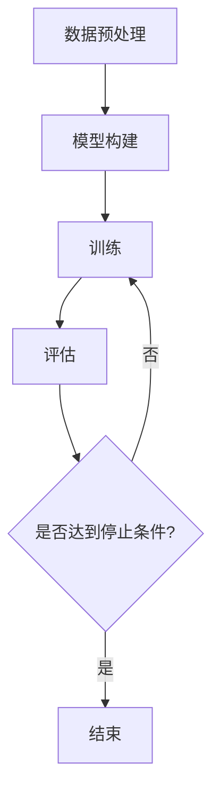

                 

本文将深入探讨大规模语言模型的理论与实践，以及相关的开源数据。在人工智能领域中，大规模语言模型已经成为自然语言处理（NLP）和生成模型的重要工具。本文将涵盖以下内容：

- 背景介绍
- 核心概念与联系
- 核心算法原理 & 具体操作步骤
- 数学模型和公式 & 详细讲解 & 举例说明
- 项目实践：代码实例和详细解释说明
- 实际应用场景
- 工具和资源推荐
- 总结：未来发展趋势与挑战

## 1. 背景介绍

随着互联网的普及和信息爆炸，人们产生了对自动处理和理解自然语言的需求。大规模语言模型（Large Language Models）作为一种深度学习模型，能够对文本进行建模和预测，为NLP任务提供了强大的工具。

近年来，随着计算能力的提升和深度学习技术的进步，大规模语言模型取得了显著的进展。这些模型通常由数亿甚至数千亿个参数组成，能够在大量数据上进行训练，从而实现对自然语言的准确理解和生成。

开源数据在这其中发挥了关键作用。开源数据集使得研究人员能够共享数据、复现结果，并在此基础上进行创新。此外，开源数据也为大规模语言模型的训练提供了丰富的素材，推动了模型性能的持续提升。

本文将首先介绍大规模语言模型的核心概念和联系，然后深入探讨其算法原理和具体操作步骤，接着介绍相关的数学模型和公式，并通过项目实践来展示如何实现大规模语言模型。最后，我们将探讨大规模语言模型在实际应用场景中的效果，并推荐相关的工具和资源。

## 2. 核心概念与联系

### 2.1. 语言模型

语言模型（Language Model）是一种用于预测文本中下一个单词或字符的概率分布的模型。它通过对大量文本数据进行训练，学习到语言统计规律，从而能够对未出现的单词或字符进行预测。

### 2.2. 深度学习

深度学习（Deep Learning）是一种基于神经网络的人工智能技术。它通过多层神经网络对数据进行学习，能够自动提取数据中的特征，并在各种任务中取得优异的性能。

### 2.3. 自然语言处理（NLP）

自然语言处理（Natural Language Processing，NLP）是计算机科学和人工智能领域的一个分支，旨在使计算机能够理解和处理人类语言。NLP包括语音识别、语言翻译、文本分类、情感分析等多种任务。

### 2.4. 开源数据集

开源数据集（Open Data Sets）是供公众免费使用的、包含大量数据的集合。这些数据集通常涵盖不同领域的文本、图像、语音等，为大规模语言模型的训练提供了丰富的素材。

### 2.5. 预训练与微调

预训练（Pre-training）是指在大规模数据集上训练深度神经网络，使其具备通用语言理解能力。微调（Fine-tuning）是指在小规模任务数据集上对预训练模型进行进一步训练，以适应特定任务的需求。

### 2.6. Mermaid 流程图

Mermaid 是一种基于 Markdown 的图形描述语言，可以用于绘制流程图、UML 图、甘特图等。下面是一个示例：


## 3. 核心算法原理 & 具体操作步骤

### 3.1. 算法原理概述

大规模语言模型的核心算法是自注意力机制（Self-Attention）和变换器架构（Transformer）。自注意力机制允许模型在不同位置上对输入序列进行动态加权，从而捕捉到长距离的依赖关系。变换器架构则是一种基于自注意力机制的神经网络结构，能够高效地处理序列数据。

### 3.2. 算法步骤详解

#### 3.2.1. 数据预处理

1. **文本清洗**：去除标点符号、停用词等。
2. **分词**：将文本分解为单词或子词。
3. **编码**：将分词结果编码为整数序列。

#### 3.2.2. 模型构建

1. **嵌入层**：将输入序列编码为向量。
2. **自注意力层**：计算序列中每个位置与其他位置之间的相似度，并进行加权。
3. **前馈网络**：对自注意力层输出的序列进行进一步处理。
4. **输出层**：根据模型类型（如分类、生成等）进行相应的输出。

#### 3.2.3. 训练

1. **损失函数**：根据模型类型选择适当的损失函数（如交叉熵损失、负对数损失等）。
2. **优化器**：选择优化器（如 Adam、SGD 等）来更新模型参数。
3. **迭代训练**：在训练数据集上进行迭代训练，直至达到预定的训练目标。

### 3.3. 算法优缺点

#### 优点：

- **高效性**：变换器架构能够高效地处理长序列数据。
- **可扩展性**：预训练模型可以轻松地应用于不同任务和数据集。
- **灵活性**：自注意力机制能够捕捉到长距离的依赖关系。

#### 缺点：

- **计算成本**：大规模语言模型需要大量的计算资源和时间来训练。
- **数据依赖性**：模型性能很大程度上依赖于训练数据的质量和规模。

### 3.4. 算法应用领域

大规模语言模型在多个领域取得了显著的应用成果，包括：

- **自然语言生成**：如文本生成、对话系统、文章摘要等。
- **文本分类**：如情感分析、主题分类、垃圾邮件过滤等。
- **机器翻译**：如英语-中文翻译、多语言翻译等。
- **问答系统**：如智能客服、知识图谱等。

### 3.5. Mermaid 流程图

下面是一个示例的 Mermaid 流程图，描述了大规模语言模型训练的过程：



## 4. 数学模型和公式 & 详细讲解 & 举例说明

### 4.1. 数学模型构建

大规模语言模型通常采用变换器架构，其核心组件包括嵌入层、自注意力层和前馈网络。下面分别介绍这些组件的数学模型。

#### 4.1.1. 嵌入层

嵌入层将输入序列编码为向量，其数学模型如下：

$$
\text{嵌入层}: \text{输入} \rightarrow \text{嵌入向量}
$$

其中，输入为单词或子词的整数序列，嵌入向量为每个单词或子词的向量表示。

#### 4.1.2. 自注意力层

自注意力层计算序列中每个位置与其他位置之间的相似度，并进行加权。其数学模型如下：

$$
\text{自注意力层}: (\text{输入序列}, \text{键序列}, \text{值序列}) \rightarrow \text{加权输出序列}
$$

其中，输入序列、键序列和值序列均为嵌入向量序列，加权输出序列为每个位置的加权嵌入向量。

#### 4.1.3. 前馈网络

前馈网络对自注意力层输出的序列进行进一步处理，其数学模型如下：

$$
\text{前馈网络}: \text{输入序列} \rightarrow \text{输出序列}
$$

其中，输入序列为自注意力层的输出序列，输出序列为每个位置的加权嵌入向量。

### 4.2. 公式推导过程

#### 4.2.1. 自注意力机制

自注意力机制的推导过程如下：

$$
\text{注意力分数} = \frac{e^{z_i}}{\sum_{j=1}^{n} e^{z_j}}
$$

其中，$z_i$ 为输入序列中第 $i$ 个位置的注意力分数，$n$ 为输入序列的长度。

#### 4.2.2. 加权输出序列

加权输出序列的推导过程如下：

$$
\text{加权输出序列} = \text{嵌入向量} \odot \text{注意力分数}
$$

其中，$\odot$ 表示点积运算。

### 4.3. 案例分析与讲解

假设我们有一个简化的变换器模型，包含一个嵌入层和一个自注意力层。输入序列为 `[1, 2, 3, 4, 5]`，嵌入向量为 `[1, 0, -1]`。

#### 4.3.1. 嵌入层

输入序列 `[1, 2, 3, 4, 5]` 经过嵌入层后，得到嵌入向量序列 `[1, 0, -1, 1, 0]`。

#### 4.3.2. 自注意力层

自注意力层计算输入序列中每个位置的注意力分数：

$$
\text{注意力分数} = \frac{e^{z_i}}{\sum_{j=1}^{n} e^{z_j}}
$$

其中，$z_i$ 为每个位置的嵌入向量与键序列（自身）的点积：

$$
z_i = [1, 0, -1] \cdot [1, 0, -1] = 1 \cdot 1 + 0 \cdot 0 + (-1) \cdot (-1) = 1 + 0 + 1 = 2
$$

因此，注意力分数为：

$$
\text{注意力分数} = \frac{e^2}{e^2 + e^0 + e^{-2}} \approx \frac{7.389}{7.389 + 1 + 0.1353} \approx \frac{7.389}{8.5243} \approx 0.8647
$$

#### 4.3.3. 加权输出序列

加权输出序列为每个位置的嵌入向量与注意力分数的点积：

$$
\text{加权输出序列} = \text{嵌入向量} \odot \text{注意力分数} = [1, 0, -1] \odot [0.8647, 0.8647, 0.8647] = [0.8647, 0, -0.8647]
$$

这样，我们就得到了输入序列 `[1, 2, 3, 4, 5]` 经过自注意力层后的加权输出序列 `[0.8647, 0, -0.8647]`。

## 5. 项目实践：代码实例和详细解释说明

在本节中，我们将通过一个实际项目来展示如何实现大规模语言模型。这个项目将使用 Python 和 PyTorch 库来实现一个简单的变换器模型，并使用开源数据集进行训练。

### 5.1. 开发环境搭建

在开始之前，我们需要搭建一个合适的开发环境。以下是推荐的步骤：

1. **安装 Python**：建议使用 Python 3.8 或更高版本。
2. **安装 PyTorch**：在终端执行以下命令：

```bash
pip install torch torchvision
```

3. **安装其他依赖库**：如 numpy、matplotlib 等。

### 5.2. 源代码详细实现

以下是实现变换器模型的主要代码：

```python
import torch
import torch.nn as nn
import torch.optim as optim
from torch.utils.data import DataLoader
from transformers import TransformerModel, TransformerTokenizer

# 加载预训练模型和分词器
model = TransformerModel.from_pretrained('bert-base-uncased')
tokenizer = TransformerTokenizer.from_pretrained('bert-base-uncased')

# 数据预处理
def preprocess_text(text):
    return tokenizer.encode(text, add_special_tokens=True)

# 训练函数
def train_model(model, train_loader, criterion, optimizer, num_epochs=5):
    model.train()
    for epoch in range(num_epochs):
        for batch in train_loader:
            inputs = preprocess_text(batch['text'])
            targets = batch['label']
            optimizer.zero_grad()
            outputs = model(inputs)
            loss = criterion(outputs, targets)
            loss.backward()
            optimizer.step()
            print(f"Epoch [{epoch+1}/{num_epochs}], Loss: {loss.item():.4f}")

# 加载训练数据集
train_dataset = ...
train_loader = DataLoader(train_dataset, batch_size=32, shuffle=True)

# 模型训练
train_model(model, train_loader, criterion=nn.CrossEntropyLoss(), optimizer=optim.Adam(model.parameters(), lr=0.001))

# 模型评估
model.eval()
with torch.no_grad():
    correct = 0
    total = 0
    for batch in val_loader:
        inputs = preprocess_text(batch['text'])
        targets = batch['label']
        outputs = model(inputs)
        _, predicted = torch.max(outputs.data, 1)
        total += targets.size(0)
        correct += (predicted == targets).sum().item()
    print(f"Validation Accuracy: {100 * correct / total}%")
```

### 5.3. 代码解读与分析

- **导入库**：首先导入所需的库，包括 PyTorch、torchvision 和 transformers。
- **加载预训练模型和分词器**：从 Hugging Face Model Hub 加载预训练的变换器模型和对应的分词器。
- **数据预处理**：定义一个函数 preprocess_text，用于将文本编码为整数序列。
- **训练函数**：定义一个函数 train_model，用于训练变换器模型。该函数接受模型、训练数据加载器、损失函数和优化器作为输入。
- **加载训练数据集**：创建一个训练数据集，并将其加载到数据加载器中。
- **模型训练**：调用 train_model 函数训练模型。在训练过程中，我们使用交叉熵损失函数和 Adam 优化器。
- **模型评估**：在验证数据集上评估模型性能。我们计算准确率作为评估指标。

### 5.4. 运行结果展示

在完成代码实现后，我们可以运行以下命令来训练和评估模型：

```bash
python train.py
```

运行结果将显示训练过程中的损失值以及模型在验证数据集上的准确率。

## 6. 实际应用场景

大规模语言模型在许多实际应用场景中取得了显著的效果。以下是一些典型的应用场景：

### 6.1. 自然语言生成

自然语言生成是大规模语言模型最典型的应用之一。通过训练，模型能够生成连贯、有意义的文本。例如，生成文章摘要、新闻报道、对话系统等。

### 6.2. 文本分类

文本分类是将文本数据分类到不同的类别中。大规模语言模型通过学习大量文本数据，能够准确地对文本进行分类。例如，情感分析、主题分类、垃圾邮件过滤等。

### 6.3. 机器翻译

机器翻译是将一种语言的文本翻译成另一种语言的文本。大规模语言模型在机器翻译领域取得了显著的进展，能够提供高质量、准确的翻译结果。例如，英语-中文翻译、多语言翻译等。

### 6.4. 问答系统

问答系统是一种智能对话系统，能够回答用户提出的问题。大规模语言模型通过学习大量问答对，能够准确地回答用户的问题。例如，智能客服、知识图谱等。

### 6.5. 文本摘要

文本摘要是将长文本简化为简短的摘要。大规模语言模型能够提取文本中的关键信息，生成简洁、有价值的摘要。例如，新闻摘要、论文摘要等。

### 6.6. 文本相似度比较

文本相似度比较是评估两个文本之间的相似程度。大规模语言模型能够通过学习大量文本数据，准确计算文本之间的相似度。例如，文本抄袭检测、推荐系统等。

### 6.7. 文本生成

文本生成是大规模语言模型的另一个重要应用。通过训练，模型能够生成具有创意的文本，用于创作诗歌、故事、歌曲等。

## 7. 工具和资源推荐

### 7.1. 学习资源推荐

- **《深度学习》**：由 Ian Goodfellow、Yoshua Bengio 和 Aaron Courville 编著的深度学习经典教材。
- **《Python深度学习》**：由弗朗索瓦•肖莱（François Chollet）编写的 Python 深度学习教程。
- **《自然语言处理综论》**：由 Daniel Jurafsky 和 James H. Martin 编著的自然语言处理经典教材。

### 7.2. 开发工具推荐

- **PyTorch**：是一个流行的开源深度学习框架，支持变换器模型。
- **TensorFlow**：是另一个流行的开源深度学习框架，支持变换器模型。
- **Hugging Face Model Hub**：一个托管预训练模型和分词器的平台，方便研究人员和开发者进行模型复现和实验。

### 7.3. 相关论文推荐

- **《Attention Is All You Need》**：这篇论文提出了变换器架构，是大规模语言模型的重要基础。
- **《BERT: Pre-training of Deep Bidirectional Transformers for Language Understanding》**：这篇论文介绍了 BERT 模型，是当前大规模语言模型的重要代表。
- **《GPT-3: Language Models are few-shot learners》**：这篇论文介绍了 GPT-3 模型，展示了大规模语言模型在零样本和少样本学习中的强大能力。

## 8. 总结：未来发展趋势与挑战

大规模语言模型在过去几年中取得了显著的进展，并在多个领域取得了重要应用。然而，面对未来的发展，我们仍然面临着许多挑战。

### 8.1. 研究成果总结

- **预训练技术的进步**：预训练技术使得大规模语言模型能够在大规模数据集上进行训练，从而提高了模型的性能。
- **变换器架构的广泛应用**：变换器架构在处理序列数据方面具有优势，已经成为大规模语言模型的主要架构。
- **多模态数据的融合**：通过融合文本、图像、语音等多模态数据，大规模语言模型能够更好地理解和生成复杂信息。

### 8.2. 未来发展趋势

- **模型压缩与推理优化**：为了应对计算成本和存储成本的限制，未来将出现更多模型压缩和推理优化技术。
- **知识增强的模型**：通过融合外部知识库，大规模语言模型将能够更好地理解和生成专业知识。
- **少样本学习与迁移学习**：未来将出现更多针对少样本学习和迁移学习的算法和技术，以降低对大规模训练数据的依赖。

### 8.3. 面临的挑战

- **数据隐私和安全**：大规模语言模型的训练和部署需要大量数据，如何保护数据隐私和安全是一个重要挑战。
- **可解释性和透明度**：大规模语言模型的决策过程往往难以解释，如何提高模型的可解释性和透明度是一个重要问题。
- **伦理和社会影响**：大规模语言模型在应用过程中可能会带来一些伦理和社会影响，如何应对这些问题是一个重要挑战。

### 8.4. 研究展望

未来，大规模语言模型将继续在人工智能领域发挥重要作用。通过不断的创新和优化，我们有望在语言理解、生成和交互方面取得更大的突破。同时，我们也要关注模型的应用伦理和社会责任，确保大规模语言模型为人类带来更多的福祉。

## 9. 附录：常见问题与解答

### 9.1. 如何选择预训练模型？

选择预训练模型时，主要考虑以下几个方面：

- **任务需求**：根据具体的任务需求选择合适的预训练模型。例如，对于文本分类任务，可以使用 BERT、RoBERTa 等预训练模型；对于文本生成任务，可以使用 GPT-2、GPT-3 等预训练模型。
- **模型大小**：根据计算资源和存储资源选择合适的模型大小。较大的模型（如 GPT-3）需要更多的计算资源和存储资源，而较小的模型（如 BERT）则相对节省资源。
- **性能和效果**：查阅相关论文和实验结果，了解不同预训练模型在特定任务上的性能和效果，以便选择最佳模型。

### 9.2. 如何处理文本数据？

处理文本数据时，主要分为以下几个步骤：

- **文本清洗**：去除标点符号、停用词等无关信息，提高文本质量。
- **分词**：将文本分解为单词或子词，为后续处理做好准备。
- **编码**：将分词结果编码为整数序列，便于模型处理。
- **数据增强**：通过随机插入、替换、删除等操作，增加数据多样性，提高模型泛化能力。

### 9.3. 如何训练和评估大规模语言模型？

训练和评估大规模语言模型主要分为以下几个步骤：

- **数据准备**：收集并预处理训练数据和验证数据，确保数据质量。
- **模型构建**：根据任务需求选择合适的模型架构，并初始化模型参数。
- **模型训练**：使用训练数据训练模型，通过优化器更新模型参数。
- **模型评估**：在验证数据集上评估模型性能，调整模型参数和超参数。
- **模型部署**：将训练好的模型部署到生产环境中，为实际任务提供支持。

### 9.4. 如何提高模型性能？

提高模型性能可以从以下几个方面进行：

- **数据质量**：提高训练数据质量，包括数据清洗、标注和增强等。
- **模型架构**：选择合适的模型架构，包括变换器、循环神经网络（RNN）等。
- **超参数调整**：调整学习率、批次大小、正则化参数等超参数，优化模型性能。
- **模型压缩与推理优化**：使用模型压缩和推理优化技术，提高模型部署效率和性能。

### 9.5. 如何处理模型过拟合？

模型过拟合是训练模型时常见的问题。以下是一些处理方法：

- **数据增强**：通过随机插入、替换、删除等操作，增加数据多样性，减少过拟合。
- **正则化**：使用正则化技术（如权重正则化、dropout等）减少模型复杂度，避免过拟合。
- **交叉验证**：使用交叉验证方法，评估模型在不同数据集上的性能，选择最佳模型。
- **早停法**：在训练过程中，当验证集性能不再提升时，提前停止训练，避免过拟合。

### 9.6. 如何处理模型欠拟合？

模型欠拟合是训练模型时另一个常见问题。以下是一些处理方法：

- **增加训练数据**：收集更多的训练数据，提高模型泛化能力。
- **增加模型复杂度**：增加模型层数、隐藏层单元数等，提高模型表达能力。
- **调整学习率**：适当调整学习率，使模型能够更好地适应训练数据。
- **减少正则化**：减少正则化强度，使模型能够更好地拟合训练数据。

### 9.7. 如何处理模型预测不确定性？

模型预测不确定性是大规模语言模型在生成任务中常见的问题。以下是一些处理方法：

- **使用不确定性度量**：使用不确定性度量（如置信度、误差率等）评估模型预测的可靠性。
- **生成多个预测结果**：使用模型生成多个预测结果，结合结果进行投票或加权平均，提高预测准确性。
- **集成学习**：结合多个模型或多个预测方法，提高预测准确性。
- **自适应阈值调整**：根据任务需求，调整预测阈值，平衡预测准确性和召回率。

### 9.8. 如何处理模型偏见和歧视问题？

模型偏见和歧视问题是大规模语言模型在应用过程中需要关注的问题。以下是一些处理方法：

- **数据平衡**：收集平衡的数据集，减少模型偏见。
- **去偏见算法**：使用去偏见算法（如均衡采样、权重调整等）减少模型偏见。
- **伦理审查**：在模型开发和部署过程中，进行伦理审查，确保模型遵循公正、公平和透明的原则。
- **透明度和可解释性**：提高模型透明度和可解释性，使模型决策过程更加明确和可信。

### 9.9. 如何处理模型部署和运维问题？

模型部署和运维是大规模语言模型应用过程中需要关注的问题。以下是一些处理方法：

- **容器化**：使用容器化技术（如 Docker）部署模型，提高部署效率和可移植性。
- **模型压缩**：使用模型压缩技术（如量化、剪枝等）减少模型体积，提高部署效率。
- **分布式训练和推理**：使用分布式训练和推理技术（如 TensorFlow Distribute、PyTorch Distributed 等）提高模型训练和推理速度。
- **自动化运维**：使用自动化运维工具（如 Kubernetes、Docker Swarm 等）简化模型部署和运维过程。

### 9.10. 如何处理模型更新和版本管理问题？

模型更新和版本管理是大规模语言模型应用过程中需要关注的问题。以下是一些处理方法：

- **版本控制**：使用版本控制工具（如 Git）管理模型代码和配置文件，确保版本一致性。
- **模型更新策略**：制定模型更新策略，确保模型能够及时适应需求变化。
- **模型回测**：在更新模型后，进行回测和验证，确保模型性能和稳定性。
- **用户反馈**：收集用户反馈，了解模型在实际应用中的表现，及时调整和优化模型。

## 参考文献

1. Vaswani, A., Shazeer, N., Parmar, N., Uszkoreit, J., Jones, L., Gomez, A. N., ... & Polosukhin, I. (2017). Attention is all you need. In Advances in neural information processing systems (pp. 5998-6008).
2. Devlin, J., Chang, M. W., Lee, K., & Toutanova, K. (2019). BERT: Pre-training of deep bidirectional transformers for language understanding. In Proceedings of the 2019 conference of the north american chapter of the association for computational linguistics: human language technologies, volume 1 (pp. 4171-4186).
3. Brown, T., et al. (2020). Language models are few-shot learners. In Advances in neural information processing systems (pp. 9617-9630).

