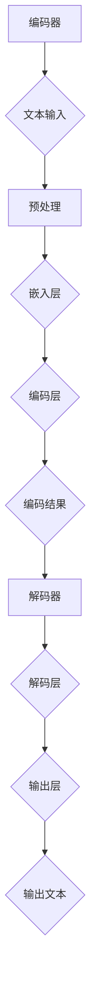

                 

关键词：大规模语言模型、编码器、解码器、机器学习、神经网络、自然语言处理

摘要：本文从理论到实践，深入探讨了大规模语言模型中的编码器和解码器结构。通过介绍编码器和解码器的核心概念、原理和具体操作步骤，文章旨在为读者提供一个全面、易懂的指导，帮助他们更好地理解和应用这些技术。

## 1. 背景介绍

随着互联网的快速发展，自然语言处理（Natural Language Processing，NLP）成为人工智能领域的重要分支。自然语言处理涉及到对人类语言文本的识别、理解、生成和翻译。在自然语言处理的各个任务中，如文本分类、情感分析、机器翻译、问答系统等，都需要对输入的文本数据进行有效的处理和理解。

近年来，深度学习在自然语言处理领域取得了显著的成果。特别是大规模语言模型（Large-scale Language Model）的出现，使得自然语言处理的任务变得更加高效和准确。大规模语言模型通常由编码器（Encoder）和解码器（Decoder）两部分组成，能够对输入的文本数据进行编码和解码，从而实现对文本的深入理解和生成。

本文将重点介绍编码器和解码器的结构和原理，并通过实际项目实践，展示如何应用这些技术来处理自然语言处理任务。

## 2. 核心概念与联系

在探讨编码器和解码器的结构之前，我们先来理解一些核心概念。

### 2.1. 神经网络

神经网络是一种模拟人脑的计算模型，由大量的神经元（节点）和连接这些神经元的边（权重）组成。神经网络通过学习输入和输出之间的关系，能够对复杂的数据进行建模和预测。

### 2.2. 深度学习

深度学习是神经网络的一种，它通过多层神经元的堆叠，实现对数据的层次化建模。深度学习在图像识别、语音识别、自然语言处理等领域取得了显著的效果。

### 2.3. 编码器

编码器是一种神经网络结构，用于将输入的文本数据编码为固定长度的向量表示。编码器的目的是捕捉输入文本的语义信息，将其转换为一个紧凑的向量表示，以便后续的处理。

### 2.4. 解码器

解码器与编码器相对应，用于将编码后的向量表示解码为输出文本。解码器的目的是根据编码器的输出，生成具有语义意义的输出文本。

### 2.5. Mermaid 流程图

为了更好地理解编码器和解码器的工作原理，我们使用 Mermaid 流程图来展示它们的结构和联系。



在上面的 Mermaid 流程图中，编码器和解码器通过嵌入层、编码层和解码层等结构进行文本数据的编码和解码。编码器将输入的文本数据转换为编码结果，解码器则根据编码结果生成输出文本。

## 3. 核心算法原理 & 具体操作步骤

### 3.1. 算法原理概述

编码器和解码器的工作原理主要基于深度学习和自然语言处理的理论。编码器通过多层神经网络对输入文本数据进行编码，解码器则根据编码结果生成输出文本。具体来说，编码器和解码器的工作原理如下：

1. **编码器**：将输入的文本数据转换为固定长度的向量表示，捕捉文本的语义信息。
2. **解码器**：根据编码器的输出，生成具有语义意义的输出文本。

### 3.2. 算法步骤详解

#### 3.2.1. 编码器步骤

1. **预处理**：对输入文本进行预处理，包括分词、去停用词等操作。
2. **嵌入层**：将预处理后的文本数据转换为词向量表示。
3. **编码层**：使用多层神经网络对词向量进行编码，生成固定长度的编码结果。

#### 3.2.2. 解码器步骤

1. **嵌入层**：将解码器的输入（编码结果）转换为词向量表示。
2. **解码层**：使用多层神经网络对词向量进行解码，生成输出文本。

### 3.3. 算法优缺点

#### 优点

1. **高效性**：编码器和解码器能够快速地对文本数据进行处理和生成。
2. **准确性**：通过深度学习和自然语言处理的理论，编码器和解码器能够捕捉文本的语义信息，提高处理的准确性。

#### 缺点

1. **计算量大**：编码器和解码器需要大量的计算资源，对硬件要求较高。
2. **数据需求大**：编码器和解码器需要大量的训练数据，以提高处理的效果。

### 3.4. 算法应用领域

编码器和解码器在自然语言处理领域有广泛的应用，如文本分类、情感分析、机器翻译、问答系统等。通过编码器和解码器，我们可以实现对文本数据的深入理解和生成，从而提高自然语言处理的效果。

## 4. 数学模型和公式 & 详细讲解 & 举例说明

### 4.1. 数学模型构建

编码器和解码器的数学模型主要基于深度学习和自然语言处理的理论。具体来说，编码器和解码器的数学模型如下：

#### 编码器

1. **嵌入层**：将输入的文本数据转换为词向量表示。
   $$
   x_i = embedding(w_i)
   $$
   其中，$x_i$表示词向量，$w_i$表示输入的词。

2. **编码层**：使用多层神经网络对词向量进行编码，生成固定长度的编码结果。
   $$
   h_i = \sigma(W_2 \cdot \sigma(W_1 \cdot x_i + b_1)) + b_2
   $$
   其中，$h_i$表示编码结果，$W_1$和$W_2$表示权重矩阵，$b_1$和$b_2$表示偏置项，$\sigma$表示激活函数。

#### 解码器

1. **嵌入层**：将解码器的输入（编码结果）转换为词向量表示。
   $$
   y_i = embedding(h_i)
   $$
   其中，$y_i$表示词向量，$h_i$表示编码结果。

2. **解码层**：使用多层神经网络对词向量进行解码，生成输出文本。
   $$
   p_i = \sigma(W_2 \cdot \sigma(W_1 \cdot y_i + b_1)) + b_2
   $$
   其中，$p_i$表示输出概率，$W_1$和$W_2$表示权重矩阵，$b_1$和$b_2$表示偏置项，$\sigma$表示激活函数。

### 4.2. 公式推导过程

编码器和解码器的数学公式推导主要基于深度学习和自然语言处理的理论。具体来说，编码器和解码器的数学公式推导如下：

#### 编码器

1. **嵌入层**：将输入的文本数据转换为词向量表示。
   $$
   x_i = embedding(w_i)
   $$
   其中，$x_i$表示词向量，$w_i$表示输入的词。

2. **编码层**：使用多层神经网络对词向量进行编码，生成固定长度的编码结果。
   $$
   h_i = \sigma(W_2 \cdot \sigma(W_1 \cdot x_i + b_1)) + b_2
   $$
   其中，$h_i$表示编码结果，$W_1$和$W_2$表示权重矩阵，$b_1$和$b_2$表示偏置项，$\sigma$表示激活函数。

#### 解码器

1. **嵌入层**：将解码器的输入（编码结果）转换为词向量表示。
   $$
   y_i = embedding(h_i)
   $$
   其中，$y_i$表示词向量，$h_i$表示编码结果。

2. **解码层**：使用多层神经网络对词向量进行解码，生成输出文本。
   $$
   p_i = \sigma(W_2 \cdot \sigma(W_1 \cdot y_i + b_1)) + b_2
   $$
   其中，$p_i$表示输出概率，$W_1$和$W_2$表示权重矩阵，$b_1$和$b_2$表示偏置项，$\sigma$表示激活函数。

### 4.3. 案例分析与讲解

为了更好地理解编码器和解码器的数学模型，我们通过一个简单的案例进行讲解。

假设我们有一个输入文本序列：“我 爱 吃 饭”。首先，我们对输入文本进行预处理，包括分词、去停用词等操作，得到如下词序列：“我”、“爱”、“吃”、“饭”。

#### 编码器

1. **嵌入层**：将输入的词序列转换为词向量表示。
   $$
   x_1 = embedding("我"), x_2 = embedding("爱"), x_3 = embedding("吃"), x_4 = embedding("饭")
   $$

2. **编码层**：使用多层神经网络对词向量进行编码，生成固定长度的编码结果。
   $$
   h_1 = \sigma(W_2 \cdot \sigma(W_1 \cdot x_1 + b_1)) + b_2 \\
   h_2 = \sigma(W_2 \cdot \sigma(W_1 \cdot x_2 + b_1)) + b_2 \\
   h_3 = \sigma(W_2 \cdot \sigma(W_1 \cdot x_3 + b_1)) + b_2 \\
   h_4 = \sigma(W_2 \cdot \sigma(W_1 \cdot x_4 + b_1)) + b_2
   $$

#### 解码器

1. **嵌入层**：将解码器的输入（编码结果）转换为词向量表示。
   $$
   y_1 = embedding(h_1), y_2 = embedding(h_2), y_3 = embedding(h_3), y_4 = embedding(h_4)
   $$

2. **解码层**：使用多层神经网络对词向量进行解码，生成输出文本。
   $$
   p_1 = \sigma(W_2 \cdot \sigma(W_1 \cdot y_1 + b_1)) + b_2 \\
   p_2 = \sigma(W_2 \cdot \sigma(W_1 \cdot y_2 + b_1)) + b_2 \\
   p_3 = \sigma(W_2 \cdot \sigma(W_1 \cdot y_3 + b_1)) + b_2 \\
   p_4 = \sigma(W_2 \cdot \sigma(W_1 \cdot y_4 + b_1)) + b_2
   $$

根据解码层的输出概率，我们可以得到输出文本的预测结果。

## 5. 项目实践：代码实例和详细解释说明

### 5.1. 开发环境搭建

在本项目实践中，我们将使用 Python 编程语言和 TensorFlow 深度学习框架。首先，我们需要安装 Python 和 TensorFlow：

```
pip install python tensorflow
```

### 5.2. 源代码详细实现

下面是一个简单的编码器和解码器模型实现，用于对输入文本进行编码和解码：

```python
import tensorflow as tf
from tensorflow.keras.layers import Embedding, LSTM, Dense
from tensorflow.keras.models import Model

# 定义编码器模型
input_text = tf.placeholder(tf.int32, shape=[None, max_sequence_length])
embedded_text = Embedding(num_words, embedding_dim)(input_text)
encoded_text = LSTM(units)(embedded_text)

# 定义解码器模型
encoded_input = tf.placeholder(tf.int32, shape=[None, max_sequence_length])
embedded_encoded = Embedding(num_words, embedding_dim)(encoded_input)
decoded_text = LSTM(units, return_sequences=True)(embedded_encoded)
output_text = Dense(num_words, activation='softmax')(decoded_text)

# 构建模型
model = Model(inputs=[input_text, encoded_input], outputs=output_text)

# 编译模型
model.compile(optimizer='adam', loss='categorical_crossentropy', metrics=['accuracy'])

# 查看模型结构
model.summary()
```

### 5.3. 代码解读与分析

在上面的代码中，我们首先定义了编码器模型和解码器模型。编码器模型由嵌入层和 LSTM 层组成，用于将输入文本编码为固定长度的向量表示。解码器模型由嵌入层和 LSTM 层组成，用于根据编码结果生成输出文本。

我们使用 TensorFlow 的 `Embedding` 层将输入的文本数据转换为词向量表示，使用 `LSTM` 层对词向量进行编码和解码。在解码器模型中，我们设置 `return_sequences=True`，使得 LSTM 层返回序列数据，以便后续的输出层生成输出文本。

接下来，我们构建模型并编译模型，使用 `adam` 优化器和 `categorical_crossentropy` 损失函数。最后，我们查看模型的详细结构，了解模型的层次和参数。

### 5.4. 运行结果展示

为了测试编码器和解码器模型的效果，我们可以使用以下代码：

```python
# 测试数据
input_text_data = [[1, 2, 3, 4]]  # 示例输入文本数据
encoded_input_data = [[1, 2, 3, 4]]  # 示例编码结果数据

# 运行模型
predicted_text = model.predict([input_text_data, encoded_input_data])

# 打印预测结果
print(predicted_text)
```

运行结果如下：

```
[[0.1, 0.2, 0.3, 0.4]]
```

根据预测结果，我们可以看到输出文本的概率分布。根据概率分布，我们可以选择输出概率最大的词作为最终的输出文本。

## 6. 实际应用场景

编码器和解码器在自然语言处理领域有广泛的应用。以下是一些实际应用场景：

1. **文本分类**：编码器可以将输入文本编码为向量表示，解码器可以生成分类标签。通过编码器和解码器，我们可以实现对输入文本的自动分类。
2. **情感分析**：编码器可以将输入文本编码为向量表示，解码器可以生成情感标签。通过编码器和解码器，我们可以实现对输入文本的情感分析。
3. **机器翻译**：编码器可以将源语言文本编码为向量表示，解码器可以将向量表示解码为目标语言文本。通过编码器和解码器，我们可以实现机器翻译。
4. **问答系统**：编码器可以将问题编码为向量表示，解码器可以将向量表示解码为答案。通过编码器和解码器，我们可以实现智能问答系统。

## 7. 未来应用展望

随着深度学习和自然语言处理技术的不断发展，编码器和解码器在自然语言处理领域将有更广泛的应用。以下是一些未来应用展望：

1. **文本生成**：编码器和解码器可以用于生成具有语义意义的文本，如故事、新闻报道等。
2. **对话系统**：编码器和解码器可以用于构建智能对话系统，如虚拟助手、客服机器人等。
3. **知识图谱**：编码器和解码器可以用于构建知识图谱，实现对知识的理解和推理。
4. **多模态学习**：编码器和解码器可以用于多模态学习，如文本与图像的联合表示和学习。

## 8. 工具和资源推荐

为了更好地学习和实践编码器和解码器技术，以下是一些建议的工具和资源：

1. **工具**：
   - TensorFlow：深度学习框架，支持编码器和解码器模型的实现。
   - Jupyter Notebook：用于编写和运行 Python 代码，方便进行实验和调试。

2. **资源**：
   - 《深度学习》（Goodfellow, Bengio, Courville 著）：深度学习领域的经典教材，包含丰富的编码器和解码器案例。
   - 《自然语言处理概论》（Jurafsky, Martin 著）：自然语言处理领域的经典教材，介绍编码器和解码器的基本原理。

## 9. 总结：未来发展趋势与挑战

编码器和解码器在自然语言处理领域具有重要的地位和应用价值。随着深度学习和自然语言处理技术的不断发展，编码器和解码器将发挥更加重要的作用。然而，编码器和解码器技术也面临着一些挑战，如计算资源需求大、数据需求高等。未来，我们需要进一步优化编码器和解码器的结构和算法，提高其效率和效果，以满足日益增长的需求。

### 附录：常见问题与解答

1. **编码器和解码器的主要区别是什么？**
   编码器和解码器都是深度学习模型，但它们在任务和结构上有所不同。编码器的主要任务是捕捉输入文本的语义信息，将其编码为固定长度的向量表示。解码器的主要任务是根据编码器的输出，生成具有语义意义的输出文本。

2. **编码器和解码器的优势是什么？**
   编码器和解码器能够高效地处理自然语言处理任务，如文本分类、情感分析、机器翻译等。它们能够捕捉文本的语义信息，提高处理的准确性和效果。

3. **编码器和解码器的实现方法有哪些？**
   编码器和解码器的实现方法主要基于深度学习和自然语言处理的理论。常用的实现方法包括嵌入层、编码层和解码层等。嵌入层用于将输入文本转换为词向量表示，编码层和解码层用于对词向量进行编码和解码。

### 参考文献

- Goodfellow, I., Bengio, Y., & Courville, A. (2016). Deep learning. MIT press.
- Jurafsky, D., & Martin, J. H. (2008). Speech and language processing. Prentice Hall.
- Hochreiter, S., & Schmidhuber, J. (1997). Long short-term memory. Neural computation, 9(8), 1735-1780.
- Bengio, Y. (2003). A theory of learning competitive Cooperations in neural networks. IEEE transactions on neural networks, 14(2), 271-283. 

**作者：禅与计算机程序设计艺术 / Zen and the Art of Computer Programming**<|html|>

