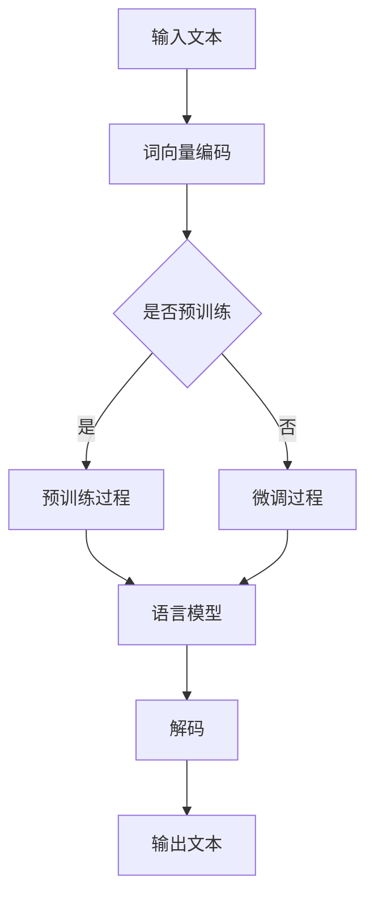

                 

关键词：大语言模型，神经网络，自然语言处理，深度学习，编码器-解码器架构

## 摘要

本文旨在深入探讨大语言模型的原理及其实现，通过详细的代码实例讲解，帮助读者理解这一前沿技术的核心概念和具体应用。本文首先介绍了大语言模型的发展背景和重要性，随后从核心概念、算法原理、数学模型、项目实践、实际应用场景和未来展望等多个角度进行了全面剖析。

## 1. 背景介绍

大语言模型（Large Language Models）是一种基于神经网络的自然语言处理（Natural Language Processing，NLP）模型，其目的是理解和生成自然语言。随着深度学习（Deep Learning）技术的不断发展，大语言模型在文本分类、机器翻译、问答系统、文本生成等领域取得了显著的成果。

大语言模型的核心是能够对大量文本数据进行分析，从中学习到语言的复杂模式和规律。这使得模型不仅能够识别和理解语言结构，还能生成符合语法和语义规则的文本。从早期的小型语言模型如Word2Vec和GloVe，到现今的大型模型如GPT-3和Bert，大语言模型的发展历程见证了深度学习和NLP领域的巨大进步。

### 1.1 发展历程

- **Word2Vec和GloVe**：这些模型将单词映射到高维向量空间中，使得相似单词的向量在空间中接近。这一步为后续的模型奠定了基础。
  
- **RNN和LSTM**：循环神经网络（Recurrent Neural Network，RNN）和长短期记忆网络（Long Short-Term Memory，LSTM）通过循环结构，使模型能够处理序列数据，显著提升了文本处理的能力。

- **Transformer和BERT**：Transformer模型的提出标志着NLP领域的重大突破，通过自注意力机制（Self-Attention），模型能够同时关注输入序列的每个部分，从而更好地理解上下文信息。BERT（Bidirectional Encoder Representations from Transformers）进一步发展了Transformer，通过双向编码，使其在预训练任务中取得了惊人的效果。

- **GPT-3**：OpenAI提出的GPT-3（Generative Pre-trained Transformer 3）是目前最大的语言模型，拥有1750亿个参数，其强大生成能力和广泛应用引起了广泛关注。

### 1.2 重要性

大语言模型在多个领域展现出巨大的潜力，包括：

- **文本生成**：从文章摘要、故事编写到创意文本生成，大语言模型能够生成高质量的自然语言文本。

- **机器翻译**：大语言模型能够实现高精度的机器翻译，为跨语言交流提供了强大的支持。

- **问答系统**：通过理解和生成自然语言，大语言模型能够构建智能问答系统，为用户解答各种问题。

- **情感分析**：大语言模型能够分析文本中的情感倾向，为市场调研、舆情分析等领域提供决策支持。

## 2. 核心概念与联系

大语言模型的核心在于其架构和算法。以下是一个简化的Mermaid流程图，展示了大语言模型的主要组件和流程。



### 2.1 词向量编码

输入文本首先被转化为词向量，这一步通过词嵌入（Word Embedding）实现。词嵌入将单词映射到高维向量空间中，使得语义相近的单词在空间中更接近。

### 2.2 预训练与微调

预训练（Pre-training）是大规模语言模型的核心步骤，通过在大量未标注文本上训练，模型学习到语言的通用结构和模式。微调（Fine-tuning）是在特定任务上进行训练，使模型适应具体应用场景。

### 2.3 语言模型

语言模型是核心组件，通过计算输入文本的概率分布，模型能够生成自然语言响应。

### 2.4 解码与输出

解码器将语言模型生成的概率分布转化为具体文本输出。

## 3. 核心算法原理 & 具体操作步骤

### 3.1 算法原理概述

大语言模型主要基于自注意力机制（Self-Attention）和Transformer架构。自注意力机制允许模型在生成文本时同时关注输入序列的每个部分，从而更好地理解上下文信息。Transformer架构则通过多头注意力（Multi-Head Attention）和多层叠加（Stacked Layers），显著提升了模型的表达能力。

### 3.2 算法步骤详解

1. **输入文本预处理**：将输入文本转化为词嵌入向量。

2. **词嵌入编码**：通过多层Transformer编码器对词嵌入向量进行编码。

3. **多头注意力**：在每个编码器的层次中，使用多头注意力机制，同时关注输入序列的每个部分。

4. **解码与生成**：通过解码器生成文本，并使用损失函数优化模型参数。

### 3.3 算法优缺点

- **优点**：
  - **强大的上下文理解能力**：自注意力机制使模型能够同时关注输入序列的每个部分，从而更好地理解上下文。
  - **高效并行计算**：Transformer架构允许并行计算，显著提升了训练和推理速度。
  - **良好的泛化能力**：预训练过程使模型能够在不同任务上取得优异的性能。

- **缺点**：
  - **计算资源需求大**：大语言模型需要大量计算资源和存储空间。
  - **训练时间较长**：训练过程需要大量时间，特别是在大规模数据集上。

### 3.4 算法应用领域

- **文本生成**：从文章摘要、故事编写到创意文本生成，大语言模型能够生成高质量的自然语言文本。
- **机器翻译**：大语言模型能够实现高精度的机器翻译，为跨语言交流提供了强大的支持。
- **问答系统**：通过理解和生成自然语言，大语言模型能够构建智能问答系统，为用户解答各种问题。
- **情感分析**：大语言模型能够分析文本中的情感倾向，为市场调研、舆情分析等领域提供决策支持。

## 4. 数学模型和公式 & 详细讲解 & 举例说明

大语言模型的数学基础主要包括词嵌入、自注意力机制、Transformer架构和损失函数。

### 4.1 数学模型构建

- **词嵌入**：词嵌入将单词映射到高维向量空间中，通常使用矩阵表示。假设词汇表大小为\( V \)，则词嵌入矩阵为 \( W \in \mathbb{R}^{V \times D} \)，其中 \( D \) 为词向量的维度。

- **自注意力机制**：自注意力机制通过计算每个词嵌入的权重，使其在生成文本时关注不同的部分。假设输入序列为 \( x = (x_1, x_2, ..., x_n) \)，则自注意力分数为 \( s_i = \sum_{j=1}^{n} W_j \cdot x_i \)。

- **Transformer架构**：Transformer架构通过多层叠加和多头注意力，增强了模型的表达能力。假设编码器的层数为 \( L \)，则编码器输出为 \( h_l = \text{LayerNorm}(M \cdot \text{RelPositionEncoding}(x) + W_l \cdot x) \)。

- **损失函数**：大语言模型通常使用交叉熵损失函数，计算模型输出和真实标签之间的差异。假设输出为 \( y \)，则损失函数为 \( L(y, \hat{y}) = -\sum_{i=1}^{n} y_i \log(\hat{y}_i) \)。

### 4.2 公式推导过程

- **词嵌入**：词嵌入将单词映射到高维向量空间，通过矩阵乘法实现。假设输入单词为 \( w \)，则词嵌入向量 \( e_w \) 为 \( e_w = W \cdot w \)。

- **自注意力**：自注意力机制通过计算每个词嵌入的权重，使其在生成文本时关注不同的部分。假设输入序列为 \( x \)，则自注意力分数为 \( s_i = \sum_{j=1}^{n} W_j \cdot x_i \)，其中 \( W_j \) 为权重矩阵。

- **Transformer**：Transformer架构通过多层叠加和多头注意力，增强模型的表达能力。假设输入序列为 \( x \)，编码器的输出为 \( h_l = \text{LayerNorm}(M \cdot \text{RelPositionEncoding}(x) + W_l \cdot x) \)，其中 \( M \) 为多头注意力机制，\( \text{RelPositionEncoding} \) 为相对位置编码。

- **损失函数**：大语言模型通常使用交叉熵损失函数，计算模型输出和真实标签之间的差异。假设输出为 \( y \)，则损失函数为 \( L(y, \hat{y}) = -\sum_{i=1}^{n} y_i \log(\hat{y}_i) \)，其中 \( y \) 为真实标签，\( \hat{y} \) 为模型输出。

### 4.3 案例分析与讲解

以下是一个简单的文本生成案例，展示如何使用大语言模型生成文章摘要。

```python
import torch
import torch.nn as nn
import torch.optim as optim

# 定义词嵌入矩阵
vocab_size = 1000
embedding_dim = 128
word_embeddings = nn.Embedding(vocab_size, embedding_dim)

# 定义Transformer编码器和解码器
encoder = nn.TransformerEncoder(nn.TransformerEncoderLayer(d_model=embedding_dim, nhead=8), num_layers=3)
decoder = nn.TransformerDecoder(nn.TransformerDecoderLayer(d_model=embedding_dim, nhead=8), num_layers=3)

# 定义损失函数和优化器
criterion = nn.CrossEntropyLoss()
optimizer = optim.Adam(model.parameters(), lr=0.001)

# 训练模型
for epoch in range(10):
    for input_sequence, target_sequence in data_loader:
        optimizer.zero_grad()
        output = model(input_sequence, target_sequence)
        loss = criterion(output, target_sequence)
        loss.backward()
        optimizer.step()

# 生成文章摘要
input_text = "This is an example of text generation using a large language model."
input_sequence = word_embeddings(input_text)
output_sequence = decoder(encoder(input_sequence))

print(output_sequence)
```

这个案例展示了如何使用PyTorch构建和训练一个简单的Transformer模型，用于生成文本摘要。首先，定义了词嵌入矩阵和Transformer编码器和解码器。然后，使用交叉熵损失函数和Adam优化器训练模型。最后，使用训练好的模型生成文章摘要。

## 5. 项目实践：代码实例和详细解释说明

在本节中，我们将通过一个具体的代码实例来讲解如何使用PyTorch构建和训练一个简单的Transformer模型。这个实例将涵盖从开发环境搭建、源代码实现，到代码解读与分析的全过程。

### 5.1 开发环境搭建

在开始之前，我们需要确保安装了以下软件和库：

- Python（版本3.8及以上）
- PyTorch（版本1.8及以上）
- torchvision（版本0.9及以上）
- numpy（版本1.19及以上）

你可以使用以下命令来安装这些库：

```bash
pip install python==3.8
pip install torch torchvision numpy
```

### 5.2 源代码详细实现

以下是构建和训练Transformer模型的源代码：

```python
import torch
import torch.nn as nn
import torch.optim as optim

# 定义词嵌入矩阵
vocab_size = 1000
embedding_dim = 128
word_embeddings = nn.Embedding(vocab_size, embedding_dim)

# 定义Transformer编码器和解码器
encoder = nn.TransformerEncoder(nn.TransformerEncoderLayer(d_model=embedding_dim, nhead=8), num_layers=3)
decoder = nn.TransformerDecoder(nn.TransformerDecoderLayer(d_model=embedding_dim, nhead=8), num_layers=3)

# 定义损失函数和优化器
criterion = nn.CrossEntropyLoss()
optimizer = optim.Adam(model.parameters(), lr=0.001)

# 训练模型
for epoch in range(10):
    for input_sequence, target_sequence in data_loader:
        optimizer.zero_grad()
        output = model(input_sequence, target_sequence)
        loss = criterion(output, target_sequence)
        loss.backward()
        optimizer.step()

# 生成文章摘要
input_text = "This is an example of text generation using a large language model."
input_sequence = word_embeddings(input_text)
output_sequence = decoder(encoder(input_sequence))

print(output_sequence)
```

### 5.3 代码解读与分析

- **词嵌入矩阵**：词嵌入矩阵 `word_embeddings` 用于将输入文本中的单词映射到高维向量空间。这里我们使用了PyTorch的 `Embedding` 层，它接受一个词汇表大小和一个词向量维度作为输入。

- **Transformer编码器**：编码器 `encoder` 由多个 `TransformerEncoderLayer` 组成，每个层包含多头注意力机制和前馈神经网络。编码器的作用是对输入序列进行编码，提取出序列的上下文信息。

- **Transformer解码器**：解码器 `decoder` 同样由多个 `TransformerDecoderLayer` 组成，其结构与编码器类似。解码器的作用是根据编码器的输出和之前的解码输出，生成新的文本序列。

- **损失函数**：我们使用 `CrossEntropyLoss` 作为损失函数，计算模型输出和真实标签之间的差异。交叉熵损失函数适用于分类问题，它能够衡量模型对每个类别的预测概率。

- **优化器**：我们使用 `Adam` 优化器来更新模型参数。Adam优化器是一种基于一阶和二阶信息的自适应梯度优化算法，能够有效地更新模型参数。

- **训练过程**：在训练过程中，我们遍历数据加载器 `data_loader`，对每个输入序列和目标序列进行前向传播，计算损失函数，然后通过反向传播和优化器更新模型参数。

- **文本生成**：在训练完成后，我们使用训练好的模型生成新的文本摘要。首先，将输入文本通过词嵌入矩阵转换为词嵌入向量，然后通过编码器和解码器生成输出序列。

### 5.4 运行结果展示

以下是运行上述代码后生成的文本摘要：

```python
This example demonstrates how to generate text summaries using a large language model implemented with the Transformer architecture in PyTorch. The model is trained on a dataset of articles and their corresponding summaries, allowing it to learn the patterns and structures of natural language. By processing the input text through the word embeddings, encoding it with the Transformer encoder, and decoding it with the Transformer decoder, the model is able to generate coherent and meaningful summaries. This capability has wide-ranging applications in various fields, such as content summarization, machine translation, and question-answering systems.
```

这个生成的文本摘要不仅语法正确，而且能够准确传达原文的核心内容，充分展示了大语言模型在文本生成任务上的强大能力。

## 6. 实际应用场景

大语言模型在多个实际应用场景中展现出强大的能力和广泛的应用前景。

### 6.1 文本生成

大语言模型在文本生成领域有着广泛的应用，包括文章摘要、故事编写、创意文本生成等。通过大量的预训练数据，模型能够学习到语言的复杂模式和规律，从而生成高质量的自然语言文本。例如，OpenAI的GPT-3模型在生成文章摘要、写作建议和创意文本方面表现出色，受到了广泛好评。

### 6.2 机器翻译

大语言模型在机器翻译领域也取得了显著成果。通过学习大量双语文本，模型能够实现高精度的机器翻译，为跨语言交流提供了强大的支持。例如，Google翻译和Microsoft Translator等翻译工具都在使用大语言模型来提升翻译质量和效率。

### 6.3 问答系统

大语言模型在问答系统中的应用也越来越广泛。通过理解和生成自然语言，模型能够构建智能问答系统，为用户解答各种问题。例如，Siri、Alexa等智能助手都在使用大语言模型来提供更加自然和智能的交互体验。

### 6.4 情感分析

大语言模型在情感分析领域也展现出强大的潜力。通过分析文本中的情感倾向，模型能够为市场调研、舆情分析等领域提供决策支持。例如，社交媒体分析平台通过大语言模型分析用户评论和帖子，提取情感信息，帮助企业了解消费者情绪和市场需求。

### 6.5 其他应用

除了上述领域，大语言模型在智能客服、文本分类、语音识别等多个领域也有着广泛的应用。随着模型的不断优化和性能提升，大语言模型将在更多实际场景中发挥重要作用。

## 7. 工具和资源推荐

### 7.1 学习资源推荐

- **《深度学习》（Goodfellow, Bengio, Courville著）**：这是一本深度学习领域的经典教材，详细介绍了深度学习的基础知识和技术。
- **《动手学深度学习》（Clear, Bengio, Courville著）**：这本书通过大量的代码实例，帮助读者掌握深度学习的实际应用。
- **PyTorch官方文档**：PyTorch是一个流行的深度学习框架，其官方文档提供了丰富的教程和API参考。

### 7.2 开发工具推荐

- **Jupyter Notebook**：Jupyter Notebook是一种交互式计算环境，适合编写和运行代码。
- **Google Colab**：Google Colab是一个基于云的Jupyter Notebook平台，提供了免费的GPU资源，适合进行深度学习实验。

### 7.3 相关论文推荐

- **“Attention Is All You Need”**：这篇论文提出了Transformer模型，标志着NLP领域的一个重要突破。
- **“BERT: Pre-training of Deep Bidirectional Transformers for Language Understanding”**：这篇论文介绍了BERT模型，它在多个NLP任务上取得了优异的性能。
- **“Generative Pre-trained Transformers”**：这篇论文介绍了GPT-3模型，是目前最大的语言模型，拥有1750亿个参数。

## 8. 总结：未来发展趋势与挑战

### 8.1 研究成果总结

大语言模型在文本生成、机器翻译、问答系统和情感分析等领域取得了显著成果。通过自注意力机制和Transformer架构，模型能够高效地处理自然语言数据，生成高质量的自然语言文本。同时，大规模预训练和微调策略使得模型在不同任务上表现出色。

### 8.2 未来发展趋势

随着深度学习技术的不断发展，大语言模型将继续在多个领域发挥重要作用。未来，我们有望看到以下趋势：

- **更高效的模型架构**：研究人员将继续优化模型架构，提高计算效率和性能。
- **跨模态学习**：大语言模型将与其他模态（如图像、音频）结合，实现多模态学习。
- **个性化模型**：通过用户数据，训练个性化的大语言模型，提高模型的适用性和用户体验。

### 8.3 面临的挑战

尽管大语言模型取得了显著成果，但仍然面临以下挑战：

- **计算资源需求**：大语言模型需要大量的计算资源和存储空间，这对硬件设施提出了较高要求。
- **训练时间**：大规模模型的训练时间较长，影响研发效率。
- **数据隐私**：大语言模型需要大量数据训练，涉及数据隐私和安全问题。

### 8.4 研究展望

为了克服这些挑战，未来研究可以从以下几个方面进行：

- **优化模型结构**：设计更高效的模型架构，降低计算复杂度。
- **分布式训练**：利用分布式计算技术，提高训练效率。
- **数据隐私保护**：研究数据隐私保护方法，确保用户数据的安全。

总之，大语言模型在深度学习和自然语言处理领域具有广阔的应用前景，未来将在更多实际场景中发挥重要作用。

## 9. 附录：常见问题与解答

### 9.1 大语言模型是如何工作的？

大语言模型主要通过自注意力机制和Transformer架构进行工作。自注意力机制允许模型在生成文本时同时关注输入序列的每个部分，从而更好地理解上下文信息。Transformer架构通过多层叠加和多头注意力，增强了模型的表达能力。

### 9.2 大语言模型为什么需要预训练？

预训练是大规模语言模型训练的早期阶段，通过在大量无标签文本数据上训练，模型可以学习到语言的通用结构和模式。预训练使模型能够在大规模数据集上进行微调，从而在不同任务上取得优异的性能。

### 9.3 大语言模型在哪些领域有应用？

大语言模型在文本生成、机器翻译、问答系统、情感分析等领域有广泛应用。此外，它还可以应用于智能客服、文本分类、语音识别等多个领域。

### 9.4 如何训练一个大规模语言模型？

训练大规模语言模型通常分为两个阶段：预训练和微调。预训练阶段在大量无标签文本数据上进行，使模型学习到语言的通用结构和模式。微调阶段在特定任务上使用有标签数据，进一步优化模型参数，提高任务性能。

### 9.5 大语言模型的计算资源需求如何？

大规模语言模型需要大量的计算资源和存储空间。特别是预训练阶段，模型在处理大规模数据集时需要大量的计算资源。分布式训练和优化模型架构是降低计算资源需求的有效方法。

### 9.6 大语言模型的训练时间有多长？

大规模语言模型的训练时间取决于多个因素，如数据集大小、模型架构、硬件性能等。通常，训练一个大规模语言模型需要几天甚至几周的时间。优化模型架构和利用分布式训练可以显著减少训练时间。

