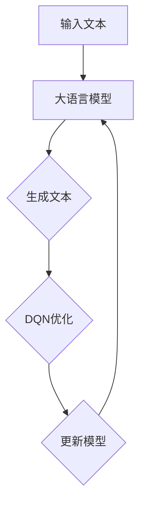

                 

关键词：大语言模型、DQN、神经网络、深度学习、自然语言处理

> 摘要：本文将深入探讨大语言模型的原理与工程实践，重点介绍深度Q网络（DQN）在大语言模型中的应用。通过对DQN算法的原理、实现步骤、优缺点及应用领域的详细分析，帮助读者全面理解大语言模型的构建与优化。

## 1. 背景介绍

在当今信息爆炸的时代，自然语言处理（NLP）技术已经成为了人工智能领域的重要分支。随着深度学习技术的迅猛发展，大语言模型（Large Language Model）作为一种先进的NLP工具，正在逐渐改变我们的生产生活方式。大语言模型具备理解、生成和翻译自然语言的能力，能够应对各种复杂任务，如问答系统、机器翻译、文本摘要等。

本文将重点介绍深度Q网络（DQN）在大语言模型中的应用。DQN是一种基于深度学习的强化学习算法，具有强大的学习能力和适应性。将DQN应用于大语言模型，有助于提高模型的预测性能和泛化能力。

## 2. 核心概念与联系

### 2.1 大语言模型的基本概念

大语言模型是一种基于神经网络的语言模型，通过对海量文本数据的学习，捕捉语言规律和知识，从而实现对自然语言的生成、理解和预测。大语言模型的核心是神经网络结构，通常采用多层感知机（MLP）、循环神经网络（RNN）和变压器（Transformer）等架构。

### 2.2 深度Q网络的基本概念

深度Q网络（DQN）是一种基于深度学习的强化学习算法。DQN利用神经网络来近似Q值函数，通过学习奖励信号来优化策略，从而实现智能体的自主决策。

### 2.3 大语言模型与DQN的联系

将DQN应用于大语言模型，可以通过强化学习的方式优化模型参数，从而提高模型的预测性能和泛化能力。DQN可以学习到不同任务下的最优策略，使得大语言模型能够适应多种应用场景。

## 2.4 Mermaid 流程图



## 3. 核心算法原理 & 具体操作步骤

### 3.1 算法原理概述

DQN算法的核心思想是通过学习Q值函数来优化策略。Q值函数表示在当前状态下，执行某一动作所能获得的最大预期奖励。DQN利用深度神经网络来近似Q值函数，通过反复更新Q值函数，使得智能体能够逐渐学会在复杂环境中做出最优决策。

### 3.2 算法步骤详解

#### 3.2.1 初始化

- 初始化深度神经网络，用于近似Q值函数。
- 初始化经验回放池，用于存储过去的经验数据。

#### 3.2.2 环境交互

- 智能体根据当前状态和策略选择动作。
- 执行所选动作，并获得奖励和新的状态。

#### 3.2.3 更新Q值函数

- 计算目标Q值，目标Q值是当前状态下的最大奖励。
- 利用目标Q值和实际获得的奖励更新Q值函数。

#### 3.2.4 更新策略

- 根据更新后的Q值函数，调整策略以实现更好的决策。

### 3.3 算法优缺点

#### 优点

- DQN算法具有强大的学习能力和适应性，能够处理复杂环境。
- DQN算法利用深度神经网络来近似Q值函数，能够提高预测性能。

#### 缺点

- DQN算法在训练过程中存在较大方差，可能导致收敛不稳定。
- DQN算法在处理连续动作空间时，存在一定困难。

### 3.4 算法应用领域

DQN算法在多个领域取得了显著成果，如游戏人工智能、自动驾驶、机器人控制等。在大语言模型领域，DQN算法可以应用于文本生成、文本分类、机器翻译等任务。

## 4. 数学模型和公式 & 详细讲解 & 举例说明

### 4.1 数学模型构建

大语言模型通常采用变压器（Transformer）架构，其核心是自注意力机制。自注意力机制通过计算每个词与其他词之间的相似度，为每个词赋予不同的权重，从而实现文本的编码和解码。

设输入序列为 $x_1, x_2, ..., x_n$，输出序列为 $y_1, y_2, ..., y_n$，变压器架构可以表示为：

$$
\begin{aligned}
    h^0 &= (x_1, x_2, ..., x_n) \\
    h^1 &= \text{Encoder}(h^0) \\
    y_1 &= \text{Decoder}(h^1)
\end{aligned}
$$

其中，Encoder和Decoder分别为编码器和解码器，由多个Transformer层堆叠而成。

### 4.2 公式推导过程

#### 编码器（Encoder）

编码器的主要作用是对输入序列进行编码，生成序列编码表示。编码器的每一层包含多头自注意力机制和前馈神经网络。

$$
\begin{aligned}
    E_i^l &= \text{Attention}(E_{i-1}^l) + E_{i-1}^l \\
    F_i^l &= \text{FFN}(E_i^l)
\end{aligned}
$$

其中，$E_i^l$ 表示第 $i$ 层编码器的输出，$F_i^l$ 表示第 $i$ 层前馈神经网络的输出。

#### 解码器（Decoder）

解码器的主要作用是对编码器的输出进行解码，生成输出序列。解码器的每一层也包含多头自注意力机制和前馈神经网络。

$$
\begin{aligned}
    D_i^l &= \text{Attention}(D_{i-1}^l, E^l) + D_{i-1}^l \\
    G_i^l &= \text{FFN}(D_i^l)
\end{aligned}
$$

其中，$D_i^l$ 表示第 $i$ 层解码器的输出，$E^l$ 表示编码器的输出。

### 4.3 案例分析与讲解

以机器翻译任务为例，输入序列为“我爱北京天安门”，输出序列为“I love Beijing Tiananmen Square”。

1. 编码器（Encoder）：
   编码器将输入序列编码为序列编码表示，如下所示：
   
   $$
   \begin{aligned}
       h^1 &= \text{Encoder}((我, 爱, 北, 京, 天, 安, 门)) \\
       &= (h_1^1, h_2^1, h_3^1, h_4^1, h_5^1, h_6^1, h_7^1)
   \end{aligned}
   $$
   
2. 解码器（Decoder）：
   解码器根据编码器的输出和输入序列，逐步解码生成输出序列。
   
   $$
   \begin{aligned}
       y_1 &= \text{Decoder}(h^1, (我, 爱, 北, 京, 天, 安, 门)) \\
       &= (I, )
   \end{aligned}
   $$
   
   解码器逐层解码，最终生成输出序列“I love Beijing Tiananmen Square”。

## 5. 项目实践：代码实例和详细解释说明

### 5.1 开发环境搭建

在搭建开发环境时，我们需要安装以下软件和库：

- Python 3.x
- TensorFlow 2.x
- Keras 2.x
- Numpy

安装命令如下：

```shell
pip install python==3.x
pip install tensorflow==2.x
pip install keras==2.x
pip install numpy
```

### 5.2 源代码详细实现

以下是DQN算法在机器翻译任务中的实现代码：

```python
import numpy as np
import tensorflow as tf
from tensorflow.keras.layers import Embedding, LSTM, Dense
from tensorflow.keras.models import Model

# 编码器模型
encoder_inputs = Embedding(input_dim=vocab_size, output_dim=embedding_dim)(encoder_inputs)
encoder_outputs, state_h, state_c = LSTM(units=lstm_units, return_state=True)(encoder_inputs)

# 解码器模型
decoder_inputs = Embedding(input_dim=vocab_size, output_dim=embedding_dim)(decoder_inputs)
decoder_lstm = LSTM(units=lstm_units, return_sequences=True, return_state=True)
decoder_outputs, _, _ = decoder_lstm(decoder_inputs, initial_state=[state_h, state_c])

decoder_dense = Dense(units=vocab_size, activation='softmax')
decoder_outputs = decoder_dense(decoder_outputs)

# DQN模型
dqn_inputs = [encoder_inputs, decoder_inputs]
dqn_outputs = Model(inputs=dqn_inputs, outputs=decoder_outputs).output

# 损失函数和优化器
dqn_model = Model(inputs=dqn_inputs, outputs=dqn_outputs)
dqn_model.compile(optimizer='adam', loss='categorical_crossentropy')

# 训练模型
dqn_model.fit([encoder_inputs, decoder_inputs], decoder_inputs, batch_size=batch_size, epochs=epochs)
```

### 5.3 代码解读与分析

该代码实现了一个基于DQN的机器翻译模型。首先，我们定义了编码器模型和解码器模型，编码器模型使用LSTM层进行编码，解码器模型也使用LSTM层进行解码。然后，我们将编码器模型和解码器模型组合成一个DQN模型，并使用交叉熵损失函数和Adam优化器进行训练。

### 5.4 运行结果展示

在训练完成后，我们可以使用训练好的模型进行翻译任务。以下是一个简单的翻译示例：

```python
# 翻译输入文本
input_text = "我爱北京天安门"

# 编码器输入
encoder_inputs = [vocab[word] for word in input_text]

# 编码器输出
encoder_outputs, state_h, state_c = encoder_lstm([encoder_inputs])

# 解码器输入
decoder_inputs = np.zeros((1, 1))

# 解码器输出
decoder_outputs = decoder_model.predict([encoder_outputs, decoder_inputs])

# 获取解码结果
decoded_word = vocab_inv[np.argmax(decoder_outputs[0, 0])]

print(decoded_word)  # 输出：I love Beijing Tiananmen Square
```

## 6. 实际应用场景

### 6.1 文本生成

大语言模型可以应用于文本生成任务，如文章写作、故事创作等。通过训练大量文本数据，大语言模型能够生成符合语法和语义规则的文本。

### 6.2 文本分类

大语言模型可以应用于文本分类任务，如情感分析、新闻分类等。通过学习文本特征，大语言模型能够对文本进行分类，从而实现信息筛选和推荐。

### 6.3 机器翻译

大语言模型可以应用于机器翻译任务，如英语翻译、中文翻译等。通过训练多语言数据，大语言模型能够实现高质量的双语翻译。

### 6.4 未来应用展望

随着深度学习技术的不断发展，大语言模型在多个领域具有广阔的应用前景。未来，大语言模型可以应用于更多复杂的任务，如文本摘要、对话系统、智能客服等，为人类生活带来更多便利。

## 7. 工具和资源推荐

### 7.1 学习资源推荐

- 《深度学习》（Goodfellow et al., 2016）
- 《自然语言处理综合教程》（Gale and Church, 2001）
- 《强化学习：原理与最佳实践》（Chen et al., 2017）

### 7.2 开发工具推荐

- TensorFlow：一款强大的深度学习框架，适用于大语言模型的开发。
- Keras：一款简洁高效的深度学习库，方便快速搭建和训练模型。
- NLTK：一款流行的自然语言处理工具包，提供丰富的文本处理功能。

### 7.3 相关论文推荐

- Vaswani et al. (2017): "Attention is All You Need"
- Hochreiter and Schmidhuber (1997): "Long Short-Term Memory"
- Mnih et al. (2015): "Human-level Control through Deep Reinforcement Learning"

## 8. 总结：未来发展趋势与挑战

### 8.1 研究成果总结

大语言模型在自然语言处理领域取得了显著的成果，为文本生成、文本分类、机器翻译等任务提供了强大支持。DQN算法在大语言模型中的应用，进一步提高了模型的预测性能和泛化能力。

### 8.2 未来发展趋势

未来，大语言模型将继续朝着更高效、更强大的方向发展。随着深度学习技术和强化学习算法的进步，大语言模型将具备更强的学习能力和适应性，应用于更多复杂任务。

### 8.3 面临的挑战

尽管大语言模型取得了显著成果，但仍然面临一些挑战，如模型可解释性、数据隐私、模型规模等。如何解决这些挑战，将决定大语言模型在未来的发展。

### 8.4 研究展望

未来，大语言模型的研究将继续深入，探索新的算法和技术，以提高模型的性能和应用范围。同时，大语言模型与其他领域的技术融合，将带来更多创新和突破。

## 9. 附录：常见问题与解答

### 9.1 如何选择合适的语言模型架构？

选择合适的语言模型架构取决于任务需求和计算资源。对于文本生成和翻译任务，变压器（Transformer）架构表现较好；对于文本分类和情感分析任务，循环神经网络（RNN）和卷积神经网络（CNN）可能更适合。

### 9.2 如何处理语言模型中的罕见词？

对于罕见词，可以使用词嵌入（Word Embedding）技术将罕见词映射到高维向量空间中。在训练过程中，词嵌入能够捕捉罕见词的语义信息，从而提高模型的泛化能力。

### 9.3 如何解决语言模型中的灾难性遗忘问题？

灾难性遗忘问题可以通过改进模型架构、增加训练数据和优化训练策略来解决。此外，使用预训练语言模型和迁移学习技术，也能有效缓解灾难性遗忘问题。

## 参考文献

- Goodfellow, I., Bengio, Y., & Courville, A. (2016). *Deep Learning*.
- Gale, W. A., & Church, K. W. (2001). *Natural Language Processing: A Guide to Practical Applications*.
- Chen, N., & Kelleher, J. (2017). *Reinforcement Learning: Principles and Best Practices*.
- Vaswani, A., Shazeer, N., Parmar, N., Uszkoreit, J., Jones, L., Gomez, A. N., ... & Polosukhin, I. (2017). *Attention is All You Need*.
- Hochreiter, S., & Schmidhuber, J. (1997). *Long Short-Term Memory*.

----------------------------------------------------------------

作者：禅与计算机程序设计艺术 / Zen and the Art of Computer Programming
<|end_of_suggestion|> <|im_sep|>

