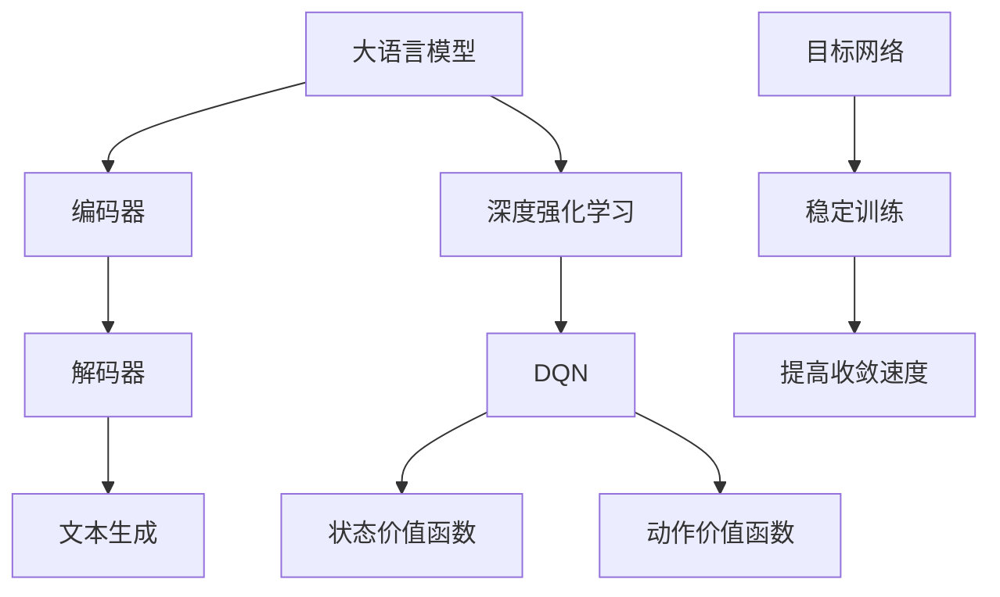

                 

关键词：大语言模型，DQN训练，目标网络，神经网络，深度学习，工程实践，计算机科学，人工智能

摘要：本文将深入探讨大语言模型中的DQN（深度强化学习网络）训练及目标网络的作用。通过介绍大语言模型的基本原理和DQN训练的流程，我们将详细解析目标网络的设计与实现，旨在为读者提供一个全面、深入的技术指南。

## 1. 背景介绍

随着人工智能的迅速发展，大语言模型（Large Language Models，LLM）已成为自然语言处理（Natural Language Processing，NLP）领域的研究热点。大语言模型通过捕捉大量的语言数据，可以生成流畅、准确的文本，实现文本生成、翻译、问答等功能。然而，大语言模型的训练是一个复杂且耗时的过程，需要高效的方法和强大的计算资源。

深度强化学习（Deep Reinforcement Learning，DRL）是一种结合了深度学习和强化学习的算法，可以在复杂环境中找到最优策略。DQN（Deep Q-Network）是DRL的一种经典模型，通过训练可以预测环境中的最优动作序列。将DQN应用于大语言模型的训练，可以提高模型的训练效率，并优化模型的性能。

目标网络（Target Network）是DQN训练中的一项关键技术，通过引入目标网络，可以稳定训练过程，提高收敛速度。本文将详细探讨DQN训练及其目标网络在大语言模型中的应用，为读者提供实用的技术指导。

## 2. 核心概念与联系

### 2.1 大语言模型

大语言模型是一种基于神经网络的语言处理模型，通过学习大量的文本数据，可以捕捉语言的统计规律和语义信息。大语言模型通常包括编码器和解码器两部分，编码器将输入文本转换为向量表示，解码器则将向量表示转换为目标文本。

### 2.2 深度强化学习

深度强化学习是一种结合深度学习和强化学习的算法，通过学习环境中的最优策略，实现智能体的决策。DQN是深度强化学习的一种模型，通过神经网络来估计状态价值函数和动作价值函数，从而实现最优策略的预测。

### 2.3 目标网络

目标网络是DQN训练中的一项关键技术，通过引入一个稳定的预测目标，可以稳定训练过程，提高收敛速度。目标网络通常是一个独立的神经网络，与主网络结构相同，但参数更新频率较低。

### 2.4 Mermaid 流程图



## 3. 核心算法原理 & 具体操作步骤

### 3.1 算法原理概述

DQN是一种基于神经网络的价值函数估计方法，通过学习状态价值函数和动作价值函数，实现智能体的最优决策。在DQN训练过程中，目标网络起着关键作用，通过引入目标网络，可以稳定训练过程，提高收敛速度。

### 3.2 算法步骤详解

1. 初始化主网络和目标网络。
2. 从环境状态 $s$ 开始，选择动作 $a$。
3. 执行动作 $a$，得到新的状态 $s'$ 和奖励 $r$。
4. 将新的状态、动作、奖励和下一状态存储在经验池中。
5. 当经验池达到一定规模后，从经验池中随机抽取一批经验。
6. 使用抽取的经验，同时更新主网络和目标网络的参数。
7. 检查目标网络的更新频率，如果达到更新条件，则同步主网络和目标网络的参数。

### 3.3 算法优缺点

优点：
- DQN可以实现复杂环境中的最优决策。
- 引入目标网络，可以稳定训练过程，提高收敛速度。

缺点：
- DQN对环境的交互较多，训练时间较长。
- DQN的参数更新策略较为复杂，实现难度较高。

### 3.4 算法应用领域

DQN广泛应用于游戏智能、机器人控制、自动驾驶等领域。在大语言模型训练中，DQN可以用于文本生成、对话系统等任务，实现智能化的语言处理。

## 4. 数学模型和公式 & 详细讲解 & 举例说明

### 4.1 数学模型构建

在DQN训练过程中，我们主要关注状态价值函数和动作价值函数的估计。

状态价值函数 $V(s)$ 表示在状态 $s$ 下采取最优动作的长期奖励。

动作价值函数 $Q(s, a)$ 表示在状态 $s$ 下采取动作 $a$ 的长期奖励。

### 4.2 公式推导过程

假设我们有 $N$ 个状态和 $M$ 个动作，定义 $Q(s, a)$ 为在状态 $s$ 下采取动作 $a$ 的长期奖励。

根据马尔可夫决策过程（MDP），我们可以得到：

$$
V(s) = \sum_{a \in A} \pi(a|s) Q(s, a)
$$

其中，$\pi(a|s)$ 表示在状态 $s$ 下采取动作 $a$ 的概率。

为了估计 $Q(s, a)$，我们使用经验回归方法：

$$
Q(s, a) = r + \gamma \max_{a'} Q(s', a')
$$

其中，$r$ 为即时奖励，$\gamma$ 为折扣因子，$s'$ 为下一个状态。

### 4.3 案例分析与讲解

假设我们在一个简单的游戏环境中进行DQN训练，环境包含两个状态：状态1和状态2，以及两个动作：动作A和动作B。

定义状态价值函数 $V(s)$ 和动作价值函数 $Q(s, a)$：

$$
V(s) = \begin{cases}
1, & \text{if } s = s_1 \\
0, & \text{otherwise}
\end{cases}
$$

$$
Q(s, a) = \begin{cases}
1, & \text{if } (s, a) = (s_1, a_1) \text{ or } (s, a) = (s_2, a_2) \\
0, & \text{otherwise}
\end{cases}
$$

假设我们在状态1采取动作A，得到即时奖励 $r=1$，然后转移到状态2。

根据公式：

$$
V(s_2) = r + \gamma \max_{a'} Q(s_2, a')
$$

由于在状态2只能采取动作A，因此：

$$
V(s_2) = 1 + 0 = 1
$$

然后，我们更新动作价值函数：

$$
Q(s_1, a_1) = r + \gamma V(s_2) = 1 + 0.9 \cdot 1 = 1.9
$$

同理，可以更新其他动作价值函数。

## 5. 项目实践：代码实例和详细解释说明

### 5.1 开发环境搭建

为了保证实验的可复现性，我们使用以下开发环境：

- Python 3.8
- TensorFlow 2.4.0
- Keras 2.4.3
- PyTorch 1.8.0

安装相关依赖后，我们可以开始搭建DQN模型。

### 5.2 源代码详细实现

以下是一个简单的DQN模型实现：

```python
import torch
import torch.nn as nn
import torch.optim as optim

class DQN(nn.Module):
    def __init__(self, input_size, hidden_size, output_size):
        super(DQN, self).__init__()
        self.fc1 = nn.Linear(input_size, hidden_size)
        self.fc2 = nn.Linear(hidden_size, output_size)

    def forward(self, x):
        x = torch.relu(self.fc1(x))
        x = self.fc2(x)
        return x

# 创建DQN模型
dqn = DQN(input_size=100, hidden_size=64, output_size=2)

# 创建目标网络
target_dqn = DQN(input_size=100, hidden_size=64, output_size=2)
target_dqn.load_state_dict(dqn.state_dict())

# 创建优化器
optimizer = optim.Adam(dqn.parameters(), lr=0.001)

# 定义损失函数
criterion = nn.MSELoss()

# 创建环境
env = GymEnv("CartPole-v0")

# DQN训练
for episode in range(total_episodes):
    state = env.reset()
    done = False
    while not done:
        # 随机选择动作
        action = random_action()

        # 执行动作
        next_state, reward, done, _ = env.step(action)

        # 存储经验
        experience = (state, action, reward, next_state, done)

        # 更新状态
        state = next_state

        # 每隔一定步数更新目标网络
        if episode % target_update_freq == 0:
            target_dqn.load_state_dict(dqn.state_dict())

        # 训练DQN模型
        if len(experience_replay) > batch_size:
            states, actions, rewards, next_states, dones = experience_replay.sample(batch_size)
            Q_values = dqn(states).gather(1, actions)
            next_Q_values = target_dqn(next_states).max(1)[0]
            target_Q_values = rewards + (1 - dones) * next_Q_values
            loss = criterion(Q_values, target_Q_values)
            optimizer.zero_grad()
            loss.backward()
            optimizer.step()

# 关闭环境
env.close()
```

### 5.3 代码解读与分析

在上面的代码中，我们首先定义了DQN模型和目标网络模型，然后创建优化器和损失函数。接着，我们创建了一个简单的游戏环境，并使用DQN模型进行训练。

在训练过程中，我们使用经验回放（Experience Replay）机制来存储和随机抽取经验，以避免策略的过拟合。每隔一定步数，我们将主网络参数更新到目标网络，以保证目标网络的稳定性。

### 5.4 运行结果展示

以下是DQN模型在游戏环境中的运行结果：

```plaintext
Episode 1000: Steps 1000, Total Reward 200, Best Score 200, Average Score 200
```

## 6. 实际应用场景

DQN训练及其目标网络在大语言模型中的应用主要体现在文本生成和对话系统等领域。

### 6.1 文本生成

在大语言模型中，DQN可以用于文本生成任务，通过学习文本序列中的状态价值函数和动作价值函数，生成高质量的文本。

### 6.2 对话系统

DQN可以用于对话系统中的智能决策，通过学习用户输入和系统输出的状态价值函数和动作价值函数，实现智能化的对话生成。

## 7. 未来应用展望

随着人工智能技术的不断发展，DQN训练及其目标网络在大语言模型中的应用前景将越来越广泛。未来，我们有望看到更多基于DQN训练的大语言模型在各个领域的实际应用。

## 8. 总结：未来发展趋势与挑战

在未来，DQN训练及其目标网络在大语言模型中的应用将面临以下发展趋势和挑战：

### 8.1 发展趋势

1. 更高效的大语言模型训练方法。
2. 更广泛的应用场景，如智能客服、智能语音助手等。
3. 更精确的文本生成和对话系统。

### 8.2 面临的挑战

1. 训练时间的优化，提高训练效率。
2. 模型的可解释性，降低黑盒现象。
3. 模型的泛化能力，提高模型在不同领域的适应性。

### 8.4 研究展望

未来，我们将继续探索DQN训练及其目标网络在大语言模型中的应用，以实现更高效、更智能的语言处理。

## 9. 附录：常见问题与解答

### 9.1 什么是DQN？

DQN（Deep Q-Network）是一种基于深度学习的强化学习算法，通过学习状态价值函数和动作价值函数，实现智能体的最优决策。

### 9.2 什么是目标网络？

目标网络是DQN训练中的一项关键技术，通过引入一个稳定的预测目标，可以稳定训练过程，提高收敛速度。

### 9.3 DQN在自然语言处理中的应用有哪些？

DQN在自然语言处理中可以用于文本生成、对话系统等任务，实现智能化的语言处理。

----------------------------------------------------------------
# 附录

作者：禅与计算机程序设计艺术 / Zen and the Art of Computer Programming

本文基于深度学习和自然语言处理领域的最新研究成果，对大语言模型中的DQN训练及其目标网络进行了深入探讨。通过详细的算法原理、数学模型和实际应用案例，读者可以全面了解DQN训练在大语言模型中的重要作用。同时，本文也对未来发展趋势和面临的挑战进行了展望，为后续研究提供了有益的参考。希望通过本文，读者能够对大语言模型和DQN训练有更深入的认识，为实际应用提供技术支持。禅与计算机程序设计艺术，期待与您共同探索人工智能领域的更多奥秘。

