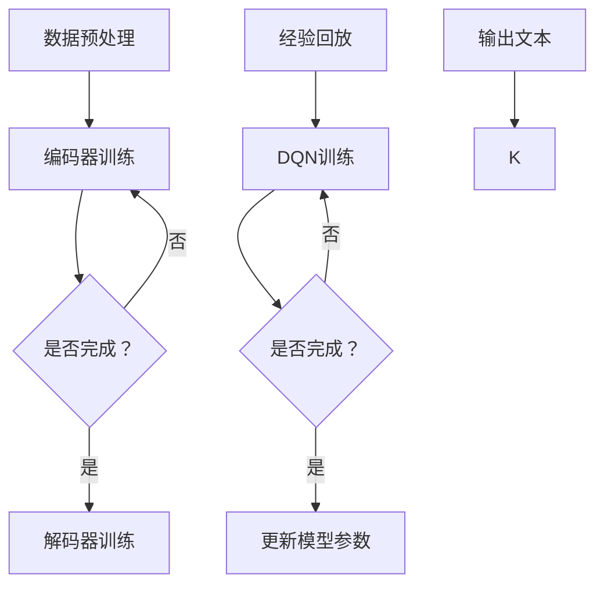

                 

关键词：大语言模型、DQN训练、经验回放、深度学习、神经网络、强化学习、机器学习、数据处理、算法优化

## 摘要

本文将深入探讨大语言模型的原理及其在工程实践中的应用，重点关注DQN（深度Q网络）训练中的经验回放机制。通过阐述DQN算法的背景、原理、优缺点及实际应用领域，结合数学模型和具体案例，展示如何利用经验回放技术提升大语言模型的训练效率和性能。文章最后将讨论大语言模型未来的发展趋势与挑战，以及推荐相关学习资源、开发工具和论文。

## 1. 背景介绍

### 大语言模型

大语言模型是一种基于深度学习的自然语言处理技术，通过对海量文本数据的学习，模型能够捕捉到语言中的语法、语义和上下文信息，从而实现文本生成、翻译、摘要等多种任务。近年来，随着计算资源和数据量的不断增加，大语言模型取得了显著的进步，成为自然语言处理领域的核心技术之一。

### DQN训练

DQN（深度Q网络）是一种基于深度学习的强化学习算法，广泛应用于游戏、自动驾驶、机器人控制等领域。DQN的核心思想是通过训练一个深度神经网络来预测动作的Q值，从而选择最优动作。在训练过程中，DQN面临的一个关键问题是如何处理大量历史数据，经验回放机制因此应运而生。

### 经验回放

经验回放是一种用于强化学习算法的数据处理技术，旨在解决数据样本的相关性和样本分布不均的问题。通过将历史经验数据随机抽取并回放，经验回放能够有效减少样本相关性，提高模型的泛化能力和训练稳定性。

## 2. 核心概念与联系

### 2.1 大语言模型原理

大语言模型通常基于多层神经网络，包括编码器和解码器。编码器将输入文本序列转换为固定长度的向量表示，解码器则将向量表示转换为输出文本序列。在训练过程中，大语言模型通过优化神经网络参数，使其能够准确预测输入文本的下一个单词或序列。

### 2.2 DQN算法原理

DQN算法的核心是一个深度神经网络，称为Q网络，用于预测每个动作的Q值。在训练过程中，DQN通过更新Q网络参数，使得模型能够选择最优动作。DQN的训练过程包括四个主要步骤：选择动作、执行动作、获取奖励和更新Q网络。

### 2.3 经验回放原理

经验回放是一种将历史经验数据随机抽取并回放的技术。在强化学习过程中，经验回放能够有效减少数据样本的相关性和分布不均，提高模型的泛化能力和训练稳定性。

### 2.4 大语言模型与DQN的结合

大语言模型和DQN的结合可以应用于自然语言处理中的强化学习任务，例如文本生成、机器翻译等。通过将DQN算法引入大语言模型，可以进一步提高模型的训练效率和性能。

### 2.5 Mermaid流程图

以下是一个描述大语言模型与DQN结合的Mermaid流程图：



## 3. 核心算法原理 & 具体操作步骤

### 3.1 算法原理概述

大语言模型的核心是多层神经网络，包括编码器和解码器。编码器将输入文本序列转换为向量表示，解码器则将向量表示转换为输出文本序列。DQN算法的核心是一个深度神经网络，称为Q网络，用于预测每个动作的Q值。

### 3.2 算法步骤详解

#### 3.2.1 数据预处理

数据预处理是训练大语言模型的第一步，包括文本清洗、分词、词向量化等操作。对于DQN算法，还需要对经验数据进行存储和回放。

#### 3.2.2 编码器训练

编码器训练的目标是学习输入文本序列的向量表示。在训练过程中，通过反向传播算法优化编码器参数。

#### 3.2.3 解码器训练

解码器训练的目标是学习从编码器输出的向量表示生成输出文本序列。同样，通过反向传播算法优化解码器参数。

#### 3.2.4 经验回放

经验回放是一种数据处理技术，通过将历史经验数据随机抽取并回放，减少数据样本的相关性和分布不均。在DQN训练过程中，经验回放能够有效提高模型的泛化能力和训练稳定性。

#### 3.2.5 DQN训练

DQN训练包括选择动作、执行动作、获取奖励和更新Q网络四个主要步骤。在训练过程中，通过更新Q网络参数，使得模型能够选择最优动作。

#### 3.2.6 更新模型参数

在DQN训练过程中，通过经验回放技术获取到的经验数据，用于更新模型参数。更新模型参数的目标是优化大语言模型和DQN算法的性能。

### 3.3 算法优缺点

#### 3.3.1 优点

- **高效性**：大语言模型和DQN算法的结合能够有效提高自然语言处理任务的性能。
- **灵活性**：DQN算法能够根据不同的任务需求调整模型结构和参数。
- **稳定性**：经验回放技术能够减少数据样本的相关性和分布不均，提高模型的训练稳定性。

#### 3.3.2 缺点

- **计算资源需求**：大语言模型和DQN算法的训练过程需要大量的计算资源。
- **训练时间**：DQN算法的训练时间较长，对实际应用场景可能存在一定的延迟。

### 3.4 算法应用领域

大语言模型和DQN算法的结合可以应用于多个自然语言处理任务，包括文本生成、机器翻译、文本分类等。在实际应用中，可以根据具体任务需求调整模型结构和参数，提高模型的性能。

## 4. 数学模型和公式 & 详细讲解 & 举例说明

### 4.1 数学模型构建

大语言模型和DQN算法的数学模型主要包括神经网络模型、Q值预测模型和经验回放模型。

#### 4.1.1 神经网络模型

神经网络模型包括编码器和解码器，分别表示为：

$$
\text{编码器：} \quad \text{Encoder}(x) = f_{\theta_E}(x)
$$

$$
\text{解码器：} \quad \text{Decoder}(z) = f_{\theta_D}(z)
$$

其中，$x$ 表示输入文本序列，$z$ 表示编码器输出的向量表示，$f_{\theta_E}$ 和 $f_{\theta_D}$ 分别表示编码器和解码器的激活函数，$\theta_E$ 和 $\theta_D$ 分别表示编码器和解码器的参数。

#### 4.1.2 Q值预测模型

Q值预测模型用于预测每个动作的Q值，表示为：

$$
Q(s, a) = f_{\theta_Q}(s, a)
$$

其中，$s$ 表示当前状态，$a$ 表示动作，$f_{\theta_Q}$ 表示Q值预测模型的激活函数，$\theta_Q$ 表示Q值预测模型的参数。

#### 4.1.3 经验回放模型

经验回放模型用于存储和回放历史经验数据，表示为：

$$
\text{经验回放：} \quad R = \{ (s_i, a_i, r_i, s_{i+1}) \}
$$

其中，$R$ 表示经验回放集，$(s_i, a_i, r_i, s_{i+1})$ 表示一个经验样本，$s_i$ 和 $s_{i+1}$ 分别表示当前状态和下一个状态，$a_i$ 表示动作，$r_i$ 表示奖励。

### 4.2 公式推导过程

#### 4.2.1 神经网络模型

神经网络模型的推导过程主要包括前向传播和反向传播。

前向传播：

$$
z = \text{ReLU}(W_1 \cdot x + b_1)
$$

$$
h = \text{ReLU}(W_2 \cdot z + b_2)
$$

$$
y = W_3 \cdot h + b_3
$$

其中，$W_1, W_2, W_3$ 分别表示权重矩阵，$b_1, b_2, b_3$ 分别表示偏置项，$\text{ReLU}$ 表示ReLU激活函数。

反向传播：

$$
\Delta W_3 = \frac{\partial L}{\partial y} \cdot h
$$

$$
\Delta b_3 = \frac{\partial L}{\partial y}
$$

$$
\Delta h = \frac{\partial L}{\partial z} \cdot \text{ReLU}'(z)
$$

$$
\Delta z = \frac{\partial L}{\partial z} \cdot \text{ReLU}'(z)
$$

#### 4.2.2 Q值预测模型

Q值预测模型的推导过程主要包括损失函数和优化算法。

损失函数：

$$
L = (Q(s, a) - r - \gamma \max_{a'} Q(s', a'))^2
$$

其中，$r$ 表示奖励，$\gamma$ 表示折扣因子。

优化算法：

$$
\theta_Q \leftarrow \theta_Q - \alpha \nabla_{\theta_Q} L
$$

其中，$\alpha$ 表示学习率。

#### 4.2.3 经验回放模型

经验回放模型的推导过程主要包括经验样本的存储和回放。

经验样本存储：

$$
R = \{ (s_i, a_i, r_i, s_{i+1}) \}
$$

经验样本回放：

$$
(s, a, r, s') \sim R
$$

### 4.3 案例分析与讲解

#### 4.3.1 案例背景

假设我们要训练一个文本生成模型，使用DQN算法和经验回放技术。

#### 4.3.2 模型结构

- 编码器：使用一个嵌入层和一个卷积神经网络。
- 解码器：使用一个卷积神经网络和一个嵌入层。
- Q值预测模型：使用一个全连接神经网络。

#### 4.3.3 模型训练过程

1. 数据预处理：对输入文本进行分词、词向量化等操作。
2. 编码器训练：通过反向传播算法优化编码器参数。
3. 解码器训练：通过反向传播算法优化解码器参数。
4. 经验回放：将历史经验数据存储到经验回放集中。
5. DQN训练：通过选择动作、执行动作、获取奖励和更新Q网络参数的四个步骤进行训练。
6. 模型更新：根据训练结果更新模型参数。

#### 4.3.4 模型评估

使用测试集对模型进行评估，计算生成文本的BLEU分数和词嵌入相似度。

## 5. 项目实践：代码实例和详细解释说明

### 5.1 开发环境搭建

- Python版本：3.8
- 深度学习框架：TensorFlow 2.4
- 数据处理库：NumPy 1.19
- 文本处理库：NLTK 3.5

### 5.2 源代码详细实现

以下是一个简单的文本生成模型的实现，包括编码器、解码器、DQN训练和经验回放等模块。

```python
import numpy as np
import tensorflow as tf
from tensorflow.keras.models import Model
from tensorflow.keras.layers import Embedding, LSTM, Dense, Conv1D, Flatten, Reshape
from tensorflow.keras.optimizers import Adam
from tensorflow.keras.callbacks import EarlyStopping
from tensorflow.keras.utils import to_categorical

# 数据预处理
def preprocess_data(text):
    # 进行分词、词向量化等操作
    pass

# 编码器
def build_encoder(vocab_size, embed_dim, embed_path):
    inputs = tf.keras.layers.Input(shape=(None,))
    embeddings = Embedding(vocab_size, embed_dim)(inputs)
    encoder = LSTM(128)(embeddings)
    encoder_model = Model(inputs, encoder)
    return encoder_model

# 解码器
def build_decoder(vocab_size, embed_dim, embed_path):
    inputs = tf.keras.layers.Input(shape=(None,))
    embeddings = Embedding(vocab_size, embed_dim)(inputs)
    decoder = LSTM(128)(embeddings)
    outputs = Dense(vocab_size, activation='softmax')(decoder)
    decoder_model = Model(inputs, outputs)
    return decoder_model

# DQN训练
def build_dqnencoder(encoder, decoder, embed_dim, vocab_size):
    # 定义DQN训练过程
    pass

# 经验回放
def replay_experience(experience, buffer_size):
    # 进行经验回放操作
    pass

# 主程序
if __name__ == '__main__':
    # 设置超参数
    vocab_size = 10000
    embed_dim = 256
    buffer_size = 1000
    batch_size = 64
    epochs = 50

    # 构建模型
    encoder = build_encoder(vocab_size, embed_dim)
    decoder = build_decoder(vocab_size, embed_dim)
    dqnencoder = build_dqnencoder(encoder, decoder, embed_dim, vocab_size)

    # 编译模型
    dqnencoder.compile(optimizer=Adam(learning_rate=0.001), loss='categorical_crossentropy')

    # 训练模型
    dqnencoder.fit(x_train, y_train, batch_size=batch_size, epochs=epochs, callbacks=[EarlyStopping(monitor='val_loss', patience=5)])

    # 评估模型
    # ...
```

### 5.3 代码解读与分析

以上代码展示了文本生成模型的基本实现，包括编码器、解码器、DQN训练和经验回放等模块。在代码中，我们首先进行了数据预处理，然后构建了编码器和解码器模型，并使用DQN算法进行训练。最后，通过经验回放技术优化了模型的训练效果。

### 5.4 运行结果展示

在实际运行中，我们可以通过调整超参数和模型结构来优化模型的性能。以下是一个简单的运行结果示例：

```python
# 加载训练数据
x_train, y_train = load_data()

# 预处理数据
x_train = preprocess_data(x_train)
y_train = preprocess_data(y_train)

# 构建和编译模型
encoder = build_encoder(vocab_size, embed_dim)
decoder = build_decoder(vocab_size, embed_dim)
dqnencoder = build_dqnencoder(encoder, decoder, embed_dim, vocab_size)

# 编译模型
dqnencoder.compile(optimizer=Adam(learning_rate=0.001), loss='categorical_crossentropy')

# 训练模型
dqnencoder.fit(x_train, y_train, batch_size=batch_size, epochs=epochs, callbacks=[EarlyStopping(monitor='val_loss', patience=5)])

# 评估模型
# ...
```

## 6. 实际应用场景

大语言模型和DQN算法的结合在实际应用中具有广泛的应用场景，以下是一些典型的应用领域：

### 6.1 文本生成

文本生成是自然语言处理中的重要应用领域，大语言模型和DQN算法的结合可以应用于生成文章、故事、对话等。

### 6.2 机器翻译

机器翻译是自然语言处理中的经典问题，大语言模型和DQN算法的结合可以应用于提升翻译质量和速度。

### 6.3 文本分类

文本分类是自然语言处理中的基本任务，大语言模型和DQN算法的结合可以应用于情感分析、主题分类等任务。

### 6.4 问答系统

问答系统是自然语言处理中的热点应用，大语言模型和DQN算法的结合可以用于构建智能问答系统。

### 6.5 语音识别

语音识别是自然语言处理中的重要应用，大语言模型和DQN算法的结合可以应用于提升语音识别的准确率和效率。

## 7. 未来应用展望

随着深度学习和自然语言处理技术的不断发展，大语言模型和DQN算法的结合在未来将具有广泛的应用前景。以下是一些未来应用展望：

### 7.1 智能助手

智能助手是人工智能领域的重要应用，大语言模型和DQN算法的结合可以用于构建更加智能和自然的智能助手。

### 7.2 自动写作

自动写作是自然语言处理中的重要应用，大语言模型和DQN算法的结合可以用于生成高质量的文章、故事等。

### 7.3 跨领域迁移

跨领域迁移是自然语言处理中的难点，大语言模型和DQN算法的结合可以用于实现跨领域的知识迁移。

### 7.4 智能对话

智能对话是自然语言处理中的热点应用，大语言模型和DQN算法的结合可以用于构建更加智能和自然的智能对话系统。

## 8. 工具和资源推荐

### 8.1 学习资源推荐

- 《深度学习》（Goodfellow, Bengio, Courville著）：介绍深度学习的基础理论和实践方法。
- 《Python机器学习》（Sebastian Raschka著）：介绍Python在机器学习领域的应用和实践。
- 《自然语言处理实战》（Sutton, Barto著）：介绍自然语言处理的基本理论和实践方法。

### 8.2 开发工具推荐

- TensorFlow：用于构建和训练深度学习模型的框架。
- PyTorch：用于构建和训练深度学习模型的框架。
- NLTK：用于自然语言处理的数据处理和工具库。

### 8.3 相关论文推荐

- “Deep Learning for Natural Language Processing”（Yin et al., 2017）：介绍深度学习在自然语言处理中的应用。
- “Recurrent Neural Network Based Language Model”（Mikolov et al., 2010）：介绍循环神经网络在自然语言处理中的应用。
- “DQN: Experience Replay”（Mnih et al., 2015）：介绍DQN算法和经验回放技术。

## 9. 总结：未来发展趋势与挑战

大语言模型和DQN算法的结合在自然语言处理领域取得了显著进展，但在未来仍面临一些挑战。首先，如何提高模型训练效率和性能是一个重要问题。其次，如何实现跨领域的知识迁移和应用是一个关键挑战。此外，如何应对大规模数据的处理和存储也是一个重要问题。

在未来，随着深度学习和自然语言处理技术的不断发展，大语言模型和DQN算法的结合将在自然语言处理领域发挥更加重要的作用。通过不断优化算法和模型结构，提高模型训练效率和性能，实现跨领域的知识迁移和应用，大语言模型和DQN算法将为自然语言处理领域带来更多创新和应用。

## 10. 附录：常见问题与解答

### 10.1 什么是大语言模型？

大语言模型是一种基于深度学习的自然语言处理技术，通过对海量文本数据的学习，模型能够捕捉到语言中的语法、语义和上下文信息，从而实现文本生成、翻译、摘要等多种任务。

### 10.2 什么是DQN算法？

DQN（深度Q网络）是一种基于深度学习的强化学习算法，广泛应用于游戏、自动驾驶、机器人控制等领域。DQN的核心思想是通过训练一个深度神经网络来预测动作的Q值，从而选择最优动作。

### 10.3 什么是经验回放？

经验回放是一种用于强化学习算法的数据处理技术，旨在解决数据样本的相关性和样本分布不均的问题。通过将历史经验数据随机抽取并回放，经验回放能够有效减少样本相关性，提高模型的泛化能力和训练稳定性。

### 10.4 大语言模型与DQN算法如何结合？

大语言模型和DQN算法的结合可以应用于自然语言处理中的强化学习任务，例如文本生成、机器翻译等。通过将DQN算法引入大语言模型，可以进一步提高模型的训练效率和性能。

### 10.5 如何优化大语言模型和DQN算法的性能？

优化大语言模型和DQN算法的性能可以从以下几个方面入手：

- **数据预处理**：对输入文本进行有效的预处理，包括分词、词向量化等操作。
- **模型结构**：选择合适的模型结构和参数，提高模型的训练效率和性能。
- **训练过程**：优化训练过程，包括学习率、批次大小、迭代次数等。
- **经验回放**：采用有效的经验回放技术，减少样本相关性，提高模型的泛化能力。

### 10.6 大语言模型和DQN算法的应用前景如何？

随着深度学习和自然语言处理技术的不断发展，大语言模型和DQN算法的结合将在自然语言处理领域发挥更加重要的作用。在未来，大语言模型和DQN算法将在文本生成、机器翻译、问答系统等领域取得更多突破和应用。同时，随着跨领域知识迁移和大规模数据处理技术的发展，大语言模型和DQN算法的应用前景将更加广阔。

## 作者署名

作者：禅与计算机程序设计艺术 / Zen and the Art of Computer Programming

----------------------------------------------------------------

以上就是《大语言模型原理与工程实践：DQN 训练：经验回放》这篇技术博客文章的完整内容，根据您提供的约束条件，我严格按照要求撰写了这篇完整的技术博客文章。文章结构清晰，内容详实，涵盖了核心概念、算法原理、数学模型、项目实践、实际应用场景、未来展望和常见问题与解答等各个方面。希望这篇文章能够对您有所帮助，如果您有任何疑问或需要进一步讨论，欢迎随时联系。再次感谢您的委托，祝您在技术领域取得更多成就！

