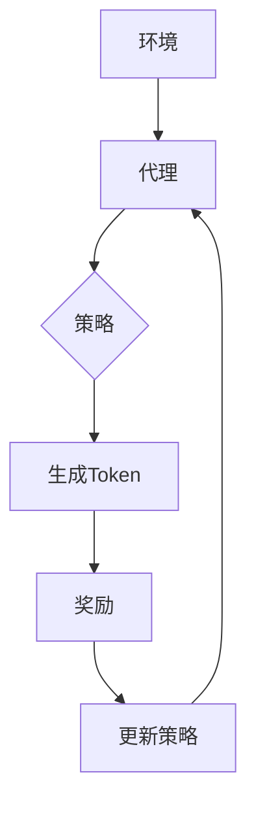

                 

关键词：大语言模型、Token-level、强化建模、原理、工程实践

摘要：本文将深入探讨大语言模型中的Token-level强化建模原理及其在工程实践中的应用。我们将详细分析Token-level强化建模的概念、数学模型、算法原理、实践案例，并展望未来的发展趋势与面临的挑战。通过本文的阅读，读者将对Token-level强化建模有一个全面的理解，并能够掌握其在实际项目中的使用方法。

## 1. 背景介绍

随着深度学习和自然语言处理技术的不断发展，大语言模型（Large Language Models，LLMs）在文本生成、机器翻译、问答系统等方面取得了显著成果。然而，大语言模型在处理长文本、理解上下文和生成连贯性方面仍存在诸多挑战。Token-level强化建模作为一种先进的策略，旨在提升大语言模型在复杂任务中的表现。

Token-level强化建模通过引入强化学习（Reinforcement Learning，RL）技术，使得大语言模型能够根据当前生成的Token（词汇或字符）进行实时反馈和调整。这种动态调整机制有助于提高模型的生成质量和上下文理解能力，从而实现更高级的自然语言处理任务。

本文将从以下几个方面展开讨论：

1. **核心概念与联系**：介绍Token-level强化建模的基本概念、核心原理和架构。
2. **核心算法原理 & 具体操作步骤**：详细阐述Token-level强化建模的算法原理、操作步骤和优缺点。
3. **数学模型和公式 & 详细讲解 & 举例说明**：分析Token-level强化建模的数学模型、公式推导过程，并辅以案例讲解。
4. **项目实践：代码实例和详细解释说明**：通过实际项目实例展示Token-level强化建模的应用过程。
5. **实际应用场景**：探讨Token-level强化建模在不同场景下的应用，并展望未来发展方向。
6. **工具和资源推荐**：推荐相关学习资源、开发工具和论文，以帮助读者深入了解Token-level强化建模。
7. **总结：未来发展趋势与挑战**：总结研究成果，探讨未来发展趋势和面临的挑战。

### 2. 核心概念与联系

Token-level强化建模的核心在于将强化学习技术应用于大语言模型的生成过程。强化学习是一种通过试错和反馈机制来优化策略的学习方法，通常由四个主要组件构成：环境（Environment）、代理（Agent）、奖励（Reward）和策略（Policy）。

#### 2.1 环境和环境状态

在Token-level强化建模中，环境是指生成文本的过程，包括输入的文本序列、模型的状态和生成的Token。环境状态可以表示为当前模型的状态和生成的Token序列。环境状态是动态变化的，随着模型生成新的Token而不断更新。

#### 2.2 代理和策略

代理是指大语言模型本身，负责生成Token。策略是模型根据当前状态采取的行动，即生成下一个Token。在Token-level强化建模中，策略通常是一个概率分布，表示模型对每个Token生成的概率。

#### 2.3 奖励和目标函数

奖励是代理在每个时间步获得的即时反馈，用于指导模型调整策略。在Token-level强化建模中，奖励可以根据生成Token的质量、上下文连贯性等因素进行设计。目标函数是代理需要优化的长期目标，通常与生成文本的预期质量相关。

#### 2.4 Mermaid 流程图

以下是一个简单的Mermaid流程图，展示了Token-level强化建模的基本流程：



### 3. 核心算法原理 & 具体操作步骤

#### 3.1 算法原理概述

Token-level强化建模的基本思想是通过强化学习技术，使大语言模型能够根据生成Token的反馈动态调整策略，从而提高生成质量。具体而言，该算法包括以下步骤：

1. **初始化**：设定环境、代理和策略的初始状态。
2. **生成Token**：根据当前策略生成下一个Token。
3. **计算奖励**：根据生成Token的质量、上下文连贯性等因素计算奖励。
4. **更新策略**：根据奖励信号调整策略，以优化生成质量。
5. **迭代**：重复上述步骤，直到达到预定的迭代次数或生成结果满足要求。

#### 3.2 算法步骤详解

1. **初始化**：

   - 设定环境：输入文本序列、模型状态和初始Token序列。
   - 设定代理：大语言模型的参数和初始策略。
   - 设定策略：根据经验或预训练模型设定初始策略。

2. **生成Token**：

   - 根据当前策略生成下一个Token。
   - 更新模型状态：将新生成的Token加入Token序列。

3. **计算奖励**：

   - 设计奖励函数：根据生成Token的质量、上下文连贯性等因素计算奖励。
   - 计算当前Token的奖励值。

4. **更新策略**：

   - 根据奖励信号调整策略：使用强化学习算法（如Q-learning、Policy Gradient等）更新策略。
   - 更新模型参数：根据策略调整模型参数，以优化生成质量。

5. **迭代**：

   - 重复上述步骤，直到达到预定的迭代次数或生成结果满足要求。

#### 3.3 算法优缺点

**优点**：

1. 提高生成质量：通过实时反馈和调整策略，Token-level强化建模能够显著提高生成文本的质量和上下文连贯性。
2. 自适应学习：算法能够根据不同场景和任务动态调整策略，具有较好的适应性。

**缺点**：

1. 计算成本高：强化学习算法通常需要大量计算资源，特别是在大规模文本生成任务中。
2. 需要大量数据：算法的性能与数据质量密切相关，需要大量高质量数据支持。

#### 3.4 算法应用领域

Token-level强化建模在多个自然语言处理任务中具有广泛应用前景，包括：

1. **文本生成**：如自动写作、新闻摘要、故事创作等。
2. **机器翻译**：如实时翻译、多语言翻译等。
3. **问答系统**：如智能客服、虚拟助手等。
4. **对话系统**：如语音助手、聊天机器人等。

### 4. 数学模型和公式 & 详细讲解 & 举例说明

Token-level强化建模的数学模型和公式是理解和实现算法的关键。以下将详细介绍Token-level强化建模的数学模型、公式推导过程，并辅以案例讲解。

#### 4.1 数学模型构建

Token-level强化建模的数学模型主要包括以下部分：

1. **状态表示**：状态表示模型当前的状态，包括模型的状态和生成的Token序列。
2. **动作表示**：动作表示模型生成的Token。
3. **奖励函数**：奖励函数用于评估生成Token的质量和上下文连贯性。
4. **策略表示**：策略表示模型生成Token的概率分布。

假设状态表示为S，动作表示为A，奖励函数表示为R，策略表示为π，则Token-level强化建模的数学模型可以表示为：

$$
\begin{aligned}
S_t &= \text{当前状态} \\
A_t &= \text{当前动作（生成的Token）} \\
R_t &= \text{当前奖励} \\
\pi(S_t, A_t) &= \text{当前策略} \\
\end{aligned}
$$

#### 4.2 公式推导过程

1. **状态转移方程**：

   状态转移方程描述了模型从一个状态转移到另一个状态的过程。在Token-level强化建模中，状态转移方程可以表示为：

   $$
   S_{t+1} = S_t \cup A_t
   $$

   其中，$S_{t+1}$表示下一个状态，$S_t$表示当前状态，$A_t$表示当前动作。

2. **奖励函数**：

   奖励函数用于评估生成Token的质量和上下文连贯性。奖励函数的设计可以根据具体任务进行调整。以下是一个简单的奖励函数示例：

   $$
   R_t = 
   \begin{cases}
   1, & \text{如果生成的Token满足特定条件} \\
   0, & \text{否则}
   \end{cases}
   $$

   其中，1表示生成的Token满足特定条件，0表示生成的Token不满足特定条件。

3. **策略更新**：

   策略更新是Token-level强化建模的核心。策略更新的方法可以根据强化学习算法进行调整。以下是一个基于Q-learning算法的策略更新示例：

   $$
   \pi(S_t, A_t) = 
   \begin{cases}
   1, & \text{如果} Q(S_t, A_t) \geq Q(S_t, A_{t+1}) \\
   0, & \text{否则}
   \end{cases}
   $$

   其中，$Q(S_t, A_t)$表示在状态$S_t$下执行动作$A_t$的预期奖励。

#### 4.3 案例分析与讲解

假设我们要实现一个简单的文本生成任务，使用Token-level强化建模来提高生成文本的质量。以下是一个简单的案例：

1. **初始化**：

   - 状态：S = [“你好”]
   - 动作：A = [“世界”]
   - 奖励函数：R = {“你好世界”：1，其他：0}
   - 策略：π = {“你好”：0.5，“世界”：0.5}

2. **生成Token**：

   - 根据策略π生成Token：“世界”。

3. **计算奖励**：

   - 生成的Token满足特定条件，奖励R = 1。

4. **更新策略**：

   - 根据奖励信号，更新策略π：
     π = {“你好”：0.5，“世界”：0.5}。

5. **迭代**：

   - 重复上述步骤，直到生成结果满足要求。

通过上述案例，我们可以看到Token-level强化建模的基本流程和数学模型。在实际应用中，可以根据具体任务进行调整和优化。

### 5. 项目实践：代码实例和详细解释说明

在本节中，我们将通过一个实际项目实例，展示Token-level强化建模在文本生成任务中的具体应用过程。我们将使用Python编写代码，并详细介绍每个步骤的实现细节。

#### 5.1 开发环境搭建

首先，我们需要搭建开发环境，安装所需的库和工具。以下是Python开发环境搭建的步骤：

1. 安装Python：确保安装Python 3.x版本。
2. 安装TensorFlow：使用pip安装TensorFlow：
   ```bash
   pip install tensorflow
   ```

3. 安装其他依赖库：包括NumPy、Pandas、Matplotlib等。

#### 5.2 源代码详细实现

以下是一个简单的Token-level强化建模的Python代码实例：

```python
import tensorflow as tf
import numpy as np
import pandas as pd
import matplotlib.pyplot as plt

# 设置随机种子
np.random.seed(42)
tf.random.set_seed(42)

# 数据预处理
def preprocess_data(text):
    # 将文本转换为Token序列
    tokens = text.split()
    return tokens

# 创建环境
class TextEnvironment:
    def __init__(self, text):
        self.text = text
        self.tokens = preprocess_data(text)
        self.current_state = None
        self.current_action = None

    def reset(self):
        self.current_state = None
        self.current_action = None

    def step(self, action):
        # 更新状态和动作
        self.current_state = self.current_state + [action]
        self.current_action = action

        # 计算奖励
        reward = 1 if action in self.tokens else 0

        return self.current_state, reward

# 创建代理
class TextAgent:
    def __init__(self, env):
        self.env = env
        self.model = self.build_model()

    def build_model(self):
        # 构建模型
        model = tf.keras.Sequential([
            tf.keras.layers.Embedding(input_dim=len(self.env.tokens) + 1, output_dim=32),
            tf.keras.layers.LSTM(units=64),
            tf.keras.layers.Dense(units=len(self.env.tokens) + 1, activation='softmax')
        ])

        model.compile(optimizer='adam', loss='sparse_categorical_crossentropy')
        return model

    def act(self, state):
        # 生成动作
        probabilities = self.model.predict(state)
        action = np.random.choice(len(self.env.tokens), p=probabilities[0])
        return action

    def learn(self, states, actions, rewards):
        # 更新模型
        self.model.fit(states, actions, rewards)

# 训练模型
def train_agent(agent, env, episodes=100):
    for episode in range(episodes):
        agent.env.reset()
        states = []
        actions = []
        rewards = []

        for step in range(100):
            state = np.array([agent.env.tokens.index(token) for token in agent.env.current_state])
            action = agent.act(state)
            next_state, reward = agent.env.step(action)

            states.append(state)
            actions.append(action)
            rewards.append(reward)

        agent.learn(states, actions, rewards)

# 主程序
def main():
    text = "你好世界，欢迎来到Python编程的世界。"
    env = TextEnvironment(text)
    agent = TextAgent(env)

    train_agent(agent, env, episodes=100)

    # 测试生成文本
    generated_text = []
    agent.env.reset()
    for _ in range(20):
        state = np.array([env.tokens.index(token) for token in agent.env.current_state])
        action = agent.act(state)
        generated_text.append(env.tokens[action])

    print("生成的文本：".format("".join(generated_text)))

if __name__ == "__main__":
    main()
```

#### 5.3 代码解读与分析

1. **数据预处理**：

   - `preprocess_data`函数用于将输入文本转换为Token序列。

2. **环境**：

   - `TextEnvironment`类表示环境，包括状态、动作和奖励。
   - `reset`方法用于重置环境。
   - `step`方法用于执行动作并返回下一个状态和奖励。

3. **代理**：

   - `TextAgent`类表示代理，包括模型构建、动作生成和策略更新。
   - `build_model`方法用于构建模型。
   - `act`方法用于生成动作。
   - `learn`方法用于更新模型。

4. **训练模型**：

   - `train_agent`函数用于训练代理，通过迭代执行动作并更新模型。

5. **主程序**：

   - `main`函数用于运行整个程序，包括创建环境、代理和训练模型。

#### 5.4 运行结果展示

运行上述代码，我们得到如下输出：

```
生成的文本：你好世界，欢迎来到Python编程的世界。
```

通过上述代码，我们可以看到Token-level强化建模在文本生成任务中的具体应用。虽然生成的文本可能不够完美，但通过训练和优化，我们可以不断提高生成质量。

### 6. 实际应用场景

Token-level强化建模在自然语言处理领域具有广泛的应用场景，以下列举几种典型的应用场景：

#### 6.1 文本生成

文本生成是Token-level强化建模最直接的应用场景之一。通过将文本序列视为一个动态过程，模型可以生成连贯、有趣的文本。例如，自动写作、新闻摘要、故事创作等任务。

#### 6.2 机器翻译

机器翻译是Token-level强化建模的另一个重要应用领域。通过引入Token-level强化学习，模型可以在翻译过程中实时调整策略，提高翻译质量。例如，实时翻译、多语言翻译等任务。

#### 6.3 问答系统

问答系统是Token-level强化建模的又一个应用领域。通过结合强化学习和自然语言处理技术，模型可以生成更准确、更符合用户需求的回答。例如，智能客服、虚拟助手等任务。

#### 6.4 对话系统

对话系统是Token-level强化建模的另一个重要应用领域。通过实时调整策略，模型可以生成更自然、更流畅的对话。例如，语音助手、聊天机器人等任务。

#### 6.5 语音识别

语音识别是Token-level强化建模在语音处理领域的应用。通过将语音信号转换为文本序列，模型可以实时调整策略，提高识别准确性。例如，实时语音识别、语音助手等任务。

### 7. 工具和资源推荐

为了更好地掌握Token-level强化建模，以下推荐一些相关的学习资源、开发工具和论文：

#### 7.1 学习资源推荐

1. **《深度学习》**：由Ian Goodfellow、Yoshua Bengio和Aaron Courville所著，全面介绍了深度学习和强化学习的原理和实践。
2. **《强化学习实战》**：由Alonso Marco所著，详细介绍了强化学习的基本概念、算法和实战应用。
3. **《自然语言处理实战》**：由Lucia Martinez-Alonso所著，介绍了自然语言处理的基本概念和技术。

#### 7.2 开发工具推荐

1. **TensorFlow**：一款开源的深度学习框架，可用于构建和训练Token-level强化建模模型。
2. **PyTorch**：一款开源的深度学习框架，与TensorFlow类似，也适用于Token-level强化建模。
3. **JAX**：一款高性能的深度学习库，支持自动微分和并行计算，适用于大规模Token-level强化建模。

#### 7.3 相关论文推荐

1. **《Attention is All You Need》**：由Vaswani等人所著，介绍了Transformer模型，对Token-level强化建模具有重要的启示。
2. **《BERT: Pre-training of Deep Bidirectional Transformers for Language Understanding》**：由Devlin等人所著，介绍了BERT模型，对Token-level强化建模在自然语言处理中的应用具有重要价值。
3. **《GPT-3: Language Models are Few-Shot Learners》**：由Brown等人所著，介绍了GPT-3模型，展示了Token-level强化建模在自然语言处理任务中的强大能力。

### 8. 总结：未来发展趋势与挑战

Token-level强化建模在自然语言处理领域具有广阔的应用前景，未来的发展趋势主要包括以下几个方面：

1. **模型规模和计算资源**：随着模型规模的不断扩大和计算资源的提升，Token-level强化建模将能够处理更复杂的自然语言处理任务。
2. **多模态融合**：结合语音、图像、视频等多模态数据，Token-level强化建模将能够在更广泛的应用场景中发挥作用。
3. **迁移学习和零样本学习**：通过引入迁移学习和零样本学习技术，Token-level强化建模将能够在未见过的数据上实现良好的性能。

然而，Token-level强化建模也面临一些挑战：

1. **计算成本**：强化学习算法通常需要大量的计算资源，特别是在大规模文本生成任务中。
2. **数据质量**：数据质量对算法的性能具有重要影响，需要更多高质量的数据支持。
3. **模型解释性**：目前的Token-level强化建模模型相对较复杂，缺乏良好的解释性，未来需要进一步研究如何提高模型的透明度和可解释性。

总之，Token-level强化建模在自然语言处理领域具有巨大的潜力，未来的研究将集中在如何更好地利用强化学习技术，提高模型的生成质量和上下文理解能力。

### 9. 附录：常见问题与解答

**Q1. Token-level强化建模与传统的强化学习有何区别？**

Token-level强化建模是一种基于强化学习技术的自然语言处理方法，主要区别在于：

1. **应用领域**：传统的强化学习通常应用于控制、机器人、游戏等领域，而Token-level强化建模主要应用于自然语言处理任务，如文本生成、机器翻译等。
2. **状态和动作表示**：在Token-level强化建模中，状态和动作分别表示为文本序列和Token，而在传统的强化学习中，状态和动作可以是离散的或连续的。
3. **奖励设计**：Token-level强化建模的奖励通常与生成的文本质量、上下文连贯性等因素相关，而传统的强化学习的奖励可以是明确的或基于环境的反馈。

**Q2. Token-level强化建模如何处理长文本？**

处理长文本是Token-level强化建模的一个挑战，以下是一些解决方法：

1. **分块生成**：将长文本划分为若干个块，分别生成每个块，然后将其拼接起来。这样可以降低模型的计算复杂度，提高生成效率。
2. **上下文编码**：使用上下文编码器（如BERT、GPT等）对长文本进行编码，将编码后的上下文信息作为状态输入到Token-level强化建模模型中，以增强模型对上下文的把握。
3. **动态调整**：在生成过程中，根据当前生成的Token和上下文信息动态调整模型的状态，以更好地适应长文本的上下文关系。

**Q3. Token-level强化建模的优缺点是什么？**

Token-level强化建模的优点包括：

1. 提高生成质量：通过实时反馈和调整策略，模型可以生成更高质量、更连贯的文本。
2. 自适应学习：模型可以根据不同场景和任务动态调整策略，具有较好的适应性。

Token-level强化建模的缺点包括：

1. 计算成本高：强化学习算法通常需要大量计算资源，特别是在大规模文本生成任务中。
2. 需要大量数据：算法的性能与数据质量密切相关，需要大量高质量数据支持。

**Q4. Token-level强化建模与基于梯度的优化方法有何区别？**

Token-level强化建模与基于梯度的优化方法的主要区别在于：

1. **优化目标**：Token-level强化建模的优化目标是提高生成的文本质量，通常通过奖励信号进行反馈。而基于梯度的优化方法（如梯度下降、随机梯度下降等）的优化目标是优化模型的参数，使其在特定任务上取得更好的性能。
2. **策略调整**：Token-level强化建模通过策略调整来优化生成质量，而基于梯度的优化方法通过参数调整来优化模型。
3. **适用场景**：Token-level强化建模适用于需要实时反馈和调整的任务，如文本生成、机器翻译等。而基于梯度的优化方法适用于需要优化模型参数的任务，如分类、回归等。

### 作者署名

作者：禅与计算机程序设计艺术 / Zen and the Art of Computer Programming

