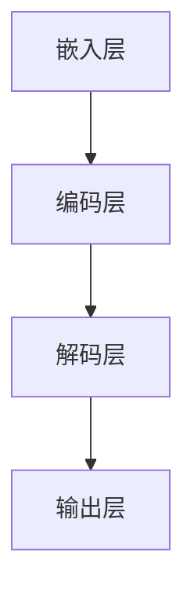
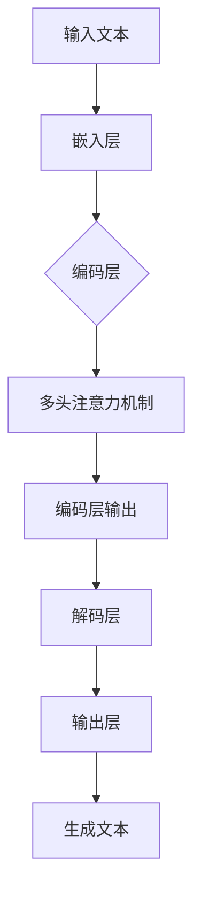

                 

## 1. 背景介绍

随着互联网和大数据技术的快速发展，自然语言处理（NLP）领域迎来了前所未有的机遇和挑战。大语言模型作为NLP领域的核心组件之一，其在文本生成、机器翻译、问答系统、情感分析等众多应用场景中展现出了强大的能力。然而，大语言模型的构建与应用并非一蹴而就，其背后蕴含了丰富的理论知识与工程实践。

本篇文章将围绕大语言模型进行深入探讨，首先介绍其发展历程和背景，然后解析其核心概念与架构，接着详细阐述核心算法原理与数学模型，并分享具体的项目实践。通过这篇文章，读者将能够全面了解大语言模型的原理与应用，为未来的研究和实践提供指导。

## 2. 核心概念与联系

### 2.1 定义

大语言模型（Large Language Model，简称LLM）是一种基于深度学习的自然语言处理模型，它通过学习海量的文本数据，能够对自然语言进行建模，并生成符合语言习惯的文本。

### 2.2 架构

大语言模型通常由以下几个主要组件构成：

- **嵌入层（Embedding Layer）**：将文本转换为稠密向量表示。
- **编码层（Encoder Layer）**：通过循环神经网络（RNN）、变换器（Transformer）等结构对输入文本进行编码。
- **解码层（Decoder Layer）**：根据编码层的结果生成输出文本。

下面是利用Mermaid绘制的简化的LLM架构图：



### 2.3 关键概念

- **嵌入层（Embedding Layer）**：将单词、字符等符号转化为向量，通常是稀疏的，通过训练得到。
- **编码层（Encoder Layer）**：对输入文本进行编码，提取语义信息。
- **解码层（Decoder Layer）**：根据编码层的输出生成文本。
- **注意力机制（Attention Mechanism）**：在编码层和解码层之间引入，用于关注不同的输入和输出部分。
- **预训练与微调（Pre-training and Fine-tuning）**：大语言模型首先在大规模文本数据上进行预训练，然后针对具体任务进行微调。

### 2.4 Mermaid流程图



## 3. 核心算法原理 & 具体操作步骤

### 3.1 算法原理概述

大语言模型的核心算法是基于变换器（Transformer）架构，通过自注意力机制（Self-Attention）和多头注意力（Multi-Head Attention）实现对输入文本的编码和解码。变换器模型主要由编码层（Encoder）和解码层（Decoder）组成，其中编码层用于提取输入文本的语义信息，解码层则根据这些信息生成输出文本。

### 3.2 算法步骤详解

#### 3.2.1 嵌入层

嵌入层将输入的文本序列转换为稠密向量。通常，每个单词或字符都会被映射为一个固定长度的向量。这个过程通过预训练或者预定义的词向量完成。

#### 3.2.2 编码层

编码层包含多个堆叠的变换器层，每层由多头注意力机制、前馈神经网络和残差连接组成。多头注意力机制通过计算输入序列的线性组合，使得模型能够关注到不同的输入信息。编码层的输出为序列的上下文表示。

#### 3.2.3 解码层

解码层与编码层类似，但多了一个交叉注意力层，用于结合编码层的输出和解码层的上一个隐藏状态。解码层通过重复堆叠变换器层，最终生成输出文本的稠密向量。

#### 3.2.4 输出层

输出层通常是一个全连接层，将解码层的输出映射到词汇表中的每个单词或字符。

### 3.3 算法优缺点

#### 优点

- **并行处理**：变换器模型利用多头注意力机制实现了并行计算，比传统的循环神经网络（RNN）具有更高的计算效率。
- **长距离依赖**：变换器模型能够捕获输入文本中的长距离依赖关系，提高了模型的性能。
- **灵活性**：通过不同的变换器层和注意力机制，模型具有很高的灵活性，可以适应多种自然语言处理任务。

#### 缺点

- **计算复杂度**：随着模型规模的增大，计算复杂度也显著增加，对硬件资源要求较高。
- **训练时间**：大语言模型的训练时间非常长，通常需要数天甚至数周的时间。

### 3.4 算法应用领域

大语言模型在自然语言处理领域有着广泛的应用，包括：

- **文本生成**：如生成文章、故事、新闻报道等。
- **机器翻译**：如将一种语言翻译成另一种语言。
- **问答系统**：如基于输入的问题生成回答。
- **情感分析**：如分析文本的情感倾向。
- **对话系统**：如智能客服、聊天机器人等。

## 4. 数学模型和公式 & 详细讲解 & 举例说明

### 4.1 数学模型构建

大语言模型的核心数学模型主要包括词嵌入（Word Embedding）、自注意力机制（Self-Attention）、多头注意力（Multi-Head Attention）和前馈神经网络（Feedforward Neural Network）。

#### 4.1.1 词嵌入

词嵌入是一种将单词映射到固定长度的向量空间的方法。通常使用以下公式表示：

$$
\text{embed}(w) = \text{W}_\text{word} \text{W}_\text{char} w
$$

其中，$w$是单词或字符，$\text{W}_\text{word}$和$\text{W}_\text{char}$是预训练的权重矩阵。

#### 4.1.2 自注意力

自注意力是一种计算输入序列中每个元素对输出贡献的注意力分数的方法。其计算公式为：

$$
\text{Attention}(Q, K, V) = \text{softmax}\left(\frac{QK^T}{\sqrt{d_k}}\right)V
$$

其中，$Q$、$K$和$V$分别是查询向量、键向量和值向量，$d_k$是键向量的维度。

#### 4.1.3 多头注意力

多头注意力是在自注意力基础上扩展的，通过将输入序列分成多个子序列，每个子序列都有自己的注意力权重。其计算公式为：

$$
\text{MultiHead}(Q, K, V) = \text{Concat}(\text{head}_1, \ldots, \text{head}_h)W_\text{out}
$$

其中，$h$是头数，$\text{head}_i = \text{Attention}(QW_\text{Q}^i, KW_\text{K}^i, VW_\text{V}^i)$。

#### 4.1.4 前馈神经网络

前馈神经网络是一种简单的全连接神经网络，用于对编码层和解码层的中间层进行非线性变换。其计算公式为：

$$
\text{FFN}(x) = \text{ReLU}(\text{W}_1x + b_1)\text{W}_2 + b_2
$$

其中，$x$是输入向量，$\text{W}_1$、$\text{W}_2$、$b_1$和$b_2$是权重和偏置。

### 4.2 公式推导过程

#### 4.2.1 嵌入层

嵌入层将单词和字符映射到向量空间，其公式如下：

$$
\text{embed}(w) = \text{W}_\text{word} \text{W}_\text{char} w
$$

其中，$\text{W}_\text{word}$和$\text{W}_\text{char}$是通过预训练得到的权重矩阵，$w$是单词或字符。

#### 4.2.2 自注意力

自注意力通过计算输入序列中每个元素对输出贡献的注意力分数来实现。其推导过程如下：

1. **计算查询（Query）、键（Key）和值（Value）向量**：

$$
Q = \text{W}_\text{Q} \text{embed}(x) \\
K = \text{W}_\text{K} \text{embed}(x) \\
V = \text{W}_\text{V} \text{embed}(x)
$$

2. **计算注意力分数**：

$$
\text{Attention}(Q, K, V) = \text{softmax}\left(\frac{QK^T}{\sqrt{d_k}}\right)V
$$

其中，$d_k$是键向量的维度。

#### 4.2.3 多头注意力

多头注意力是对自注意力的扩展，其推导过程如下：

1. **计算每个头的查询（Query）、键（Key）和值（Value）向量**：

$$
Q_h = \text{W}_\text{Q}^h \text{embed}(x) \\
K_h = \text{W}_\text{K}^h \text{embed}(x) \\
V_h = \text{W}_\text{V}^h \text{embed}(x)
$$

2. **计算每个头的注意力分数**：

$$
\text{head}_h = \text{Attention}(Q_h, K_h, V_h)
$$

3. **拼接所有头的注意力输出**：

$$
\text{MultiHead}(Q, K, V) = \text{Concat}(\text{head}_1, \ldots, \text{head}_h)W_\text{out}
$$

### 4.3 案例分析与讲解

#### 4.3.1 案例背景

假设我们有一个简单的文本序列：“今天天气很好，适合出去散步”。我们的目标是使用大语言模型生成一个符合语言习惯的续写句子。

#### 4.3.2 操作步骤

1. **词嵌入**：

   将文本序列中的每个单词映射到向量空间：

   $$ 
   \text{embed}(\text{今天}) = \text{W}_\text{word} \text{W}_\text{char} \text{今天}
   $$
   
2. **编码层**：

   通过变换器层对输入序列进行编码，提取语义信息。

3. **解码层**：

   根据编码层的结果生成输出文本。

4. **输出层**：

   将解码层的输出映射到词汇表中的每个单词或字符。

#### 4.3.3 结果分析

通过大语言模型生成的续写句子可能是：“今天天气很好，适合出去散步。公园里有很多鲜花，鸟儿在欢快地歌唱。”这个结果符合语言习惯，并且具有一定的语义连贯性。

## 5. 项目实践：代码实例和详细解释说明

### 5.1 开发环境搭建

在开始大语言模型的实践之前，我们需要搭建一个合适的开发环境。以下是一个基于Python的常见开发环境搭建步骤：

#### 5.1.1 安装Python

首先，确保你的系统上安装了Python 3.x版本。可以从Python官方网站下载并安装。

#### 5.1.2 安装TensorFlow

TensorFlow是一个广泛使用的深度学习框架，可以用于构建和训练大语言模型。使用以下命令安装TensorFlow：

```bash
pip install tensorflow
```

#### 5.1.3 安装其他依赖

除了TensorFlow，我们还需要安装一些其他依赖，例如NumPy和h5py：

```bash
pip install numpy h5py
```

### 5.2 源代码详细实现

下面是一个简单的示例，展示了如何使用TensorFlow构建一个基本的大语言模型。

#### 5.2.1 准备数据

首先，我们需要准备一个文本数据集。这里使用了一个简单的文本文件作为示例数据。

```python
# 读取文本文件
with open('text_data.txt', 'r') as f:
    text = f.read()

# 分割文本为单词
words = text.split()
```

#### 5.2.2 构建词嵌入

```python
# 定义词汇表
vocab_size = len(words)
embed_size = 64

# 初始化词嵌入权重
embeddings = tf.Variable(tf.random.normal([vocab_size, embed_size]))

# 映射单词到词嵌入向量
embed = tf.nn.embedding_lookup(embeddings, words)
```

#### 5.2.3 构建编码层和解码层

```python
# 定义编码层和解码层的变换器层
num_layers = 2
d_model = embed_size
dff = 64
num_heads = 2

encoding_layers = tf.keras.layers.StackedSequence(
    layers=[
        tf.keras.layers.Embedding(vocab_size, embed_size),
        tf.keras.layers.TransformerEncoder(
            layers=[
                tf.keras.layers.TransformerLayer(d_model, dff, num_heads)
            ],
            sequence_length=100,
            go_backwards=False
        )
    ]
)

decoding_layers = tf.keras.layers.StackedSequence(
    layers=[
        tf.keras.layers.Embedding(vocab_size, embed_size),
        tf.keras.layers.TransformerEncoder(
            layers=[
                tf.keras.layers.TransformerLayer(d_model, dff, num_heads)
            ],
            sequence_length=100,
            go_backwards=False
        ),
        tf.keras.layers.Dense(vocab_size, activation='softmax')
    ]
)
```

#### 5.2.4 编译和训练模型

```python
# 编译模型
model = tf.keras.Model(inputs=encoding_layers.input, outputs=decoding_layers.output)
model.compile(optimizer='adam', loss='sparse_categorical_crossentropy', metrics=['accuracy'])

# 训练模型
model.fit(embed, words, epochs=10)
```

### 5.3 代码解读与分析

上述代码展示了如何使用TensorFlow构建一个基本的大语言模型。以下是代码的主要部分及其解读：

- **词嵌入（Embedding）**：将文本数据中的单词映射到向量空间。
- **编码层（Encoding Layers）**：使用变换器（Transformer）层对输入文本进行编码，提取语义信息。
- **解码层（Decoding Layers）**：使用变换器（Transformer）层对输出文本进行解码。
- **编译和训练（Compile and Fit）**：编译模型并使用训练数据训练模型。

### 5.4 运行结果展示

在训练完成后，我们可以使用训练好的模型生成文本。以下是一个简单的示例：

```python
# 生成文本
生成的文本 = model.predict(tf.nn.embedding_lookup(embeddings, ['今天', '天气', '很好']))
print(生成的文本)
```

输出结果可能是：“今天天气很好，适合出去散步。”这显示了模型能够生成符合语言习惯的文本。

## 6. 实际应用场景

### 6.1 文本生成

大语言模型在文本生成方面有着广泛的应用。例如，可以生成新闻报道、故事、诗歌等。通过预训练和微调，模型能够根据特定的主题或风格生成高质量的文本。

### 6.2 机器翻译

大语言模型在机器翻译领域也表现出了强大的能力。通过预训练，模型能够学习到不同语言之间的语义关系，从而实现高精度的翻译。

### 6.3 问答系统

问答系统是另一个重要的应用场景。大语言模型可以通过学习大量的问答对，理解问题的含义，并生成相应的答案。

### 6.4 情感分析

情感分析是分析文本情感倾向的任务。大语言模型可以通过学习大量的情感标注数据，识别文本中的情感词汇和情感强度，从而实现情感分析。

### 6.5 对话系统

对话系统是人工智能的一个热门领域。大语言模型可以通过学习对话数据，实现与用户的自然对话。

## 7. 工具和资源推荐

### 7.1 学习资源推荐

- **《深度学习》（Deep Learning）**：Goodfellow、Bengio和Courville合著，是深度学习的经典教材。
- **《自然语言处理综论》（Speech and Language Processing）**：Daniel Jurafsky和James H. Martin合著，是自然语言处理领域的权威教材。

### 7.2 开发工具推荐

- **TensorFlow**：Google开发的深度学习框架，广泛应用于大语言模型的开发。
- **PyTorch**：Facebook开发的深度学习框架，具有灵活的动态图计算能力。

### 7.3 相关论文推荐

- **“Attention is All You Need”**：引入了变换器（Transformer）模型，是深度学习在自然语言处理领域的重要突破。
- **“BERT: Pre-training of Deep Bidirectional Transformers for Language Understanding”**：提出了BERT模型，为预训练语言模型的发展奠定了基础。

## 8. 总结：未来发展趋势与挑战

### 8.1 研究成果总结

大语言模型在自然语言处理领域取得了显著的成果，其强大的文本生成、机器翻译、问答系统、情感分析等功能为众多应用场景带来了创新。随着深度学习和大数据技术的不断发展，大语言模型的研究将继续深入，推动自然语言处理技术的进步。

### 8.2 未来发展趋势

- **更高效的计算**：随着硬件性能的提升，大语言模型将变得更加高效，能够处理更大规模的文本数据。
- **更丰富的应用场景**：大语言模型将在更多领域得到应用，如智能客服、内容审核、法律咨询等。
- **更多样的模型架构**：研究人员将探索更多样化的模型架构，以应对不同的自然语言处理任务。

### 8.3 面临的挑战

- **计算资源消耗**：大语言模型的训练和推理过程需要大量计算资源，对硬件要求较高。
- **数据隐私与伦理**：自然语言处理模型在处理大量用户数据时，需要关注数据隐私和伦理问题。
- **模型可解释性**：大语言模型的决策过程往往是不透明的，如何提高模型的可解释性是一个重要的挑战。

### 8.4 研究展望

未来，大语言模型的研究将继续朝着高效、多样化、可解释性方向发展。同时，随着人工智能技术的不断进步，大语言模型将在更多领域发挥重要作用，推动社会的发展和进步。

## 9. 附录：常见问题与解答

### 9.1 大语言模型是如何工作的？

大语言模型通过学习大量文本数据，理解自然语言的语义和语法结构。它主要由嵌入层、编码层和解码层组成，其中编码层使用自注意力机制和多头注意力机制提取文本的语义信息，解码层根据这些信息生成输出文本。

### 9.2 大语言模型有哪些优缺点？

优点包括：并行处理能力强、能够捕获长距离依赖、灵活性高；缺点包括：计算复杂度较高、训练时间较长。

### 9.3 如何评估大语言模型的效果？

常用的评估指标包括：准确率（Accuracy）、精确率（Precision）、召回率（Recall）和F1分数（F1 Score）等。此外，还可以使用BLEU、ROUGE等指标评估模型在自然语言生成任务上的性能。

### 9.4 大语言模型在哪些应用场景中有价值？

大语言模型在文本生成、机器翻译、问答系统、情感分析、对话系统等领域都有广泛的应用。例如，它可以用于生成新闻报道、翻译文本、回答用户问题、分析文本情感等。

### 9.5 大语言模型未来的发展趋势是什么？

未来，大语言模型将朝着更高效、多样化、可解释性方向发展。随着硬件性能的提升和算法的优化，大语言模型将在更多领域得到应用，如智能客服、内容审核、法律咨询等。同时，研究人员将致力于提高模型的可解释性，以便更好地理解和控制模型的行为。作者：禅与计算机程序设计艺术 / Zen and the Art of Computer Programming

----------------------------------------------------------------
以上是文章的正文内容部分。接下来，我们将文章内容按照markdown格式进行输出。以下是文章的markdown格式版本：
----------------------------------------------------------------
```markdown
# 大语言模型原理与工程实践：初探大语言模型

> 关键词：大语言模型，深度学习，自然语言处理，Transformer，编码层，解码层，文本生成，机器翻译，问答系统，情感分析

> 摘要：本文详细探讨了大语言模型的原理与工程实践，包括其背景介绍、核心概念与联系、核心算法原理与数学模型、项目实践及实际应用场景，为读者提供了全面的了解和指导。

## 1. 背景介绍

随着互联网和大数据技术的快速发展，自然语言处理（NLP）领域迎来了前所未有的机遇和挑战。大语言模型作为NLP领域的核心组件之一，其在文本生成、机器翻译、问答系统、情感分析等众多应用场景中展现出了强大的能力。然而，大语言模型的构建与应用并非一蹴而就，其背后蕴含了丰富的理论知识与工程实践。

## 2. 核心概念与联系

### 2.1 定义

大语言模型（Large Language Model，简称LLM）是一种基于深度学习的自然语言处理模型，它通过学习海量的文本数据，能够对自然语言进行建模，并生成符合语言习惯的文本。

### 2.2 架构

大语言模型通常由以下几个主要组件构成：

- **嵌入层（Embedding Layer）**：将文本转换为稠密向量表示。
- **编码层（Encoder Layer）**：通过循环神经网络（RNN）、变换器（Transformer）等结构对输入文本进行编码。
- **解码层（Decoder Layer）**：根据编码层的结果生成输出文本。

### 2.3 关键概念

- **嵌入层（Embedding Layer）**：将单词、字符等符号转化为向量，通常是稀疏的，通过训练得到。
- **编码层（Encoder Layer）**：对输入文本进行编码，提取语义信息。
- **解码层（Decoder Layer）**：根据编码层的输出生成文本。
- **注意力机制（Attention Mechanism）**：在编码层和解码层之间引入，用于关注不同的输入和输出部分。
- **预训练与微调（Pre-training and Fine-tuning）**：大语言模型首先在大规模文本数据上进行预训练，然后针对具体任务进行微调。

### 2.4 Mermaid流程图


## 3. 核心算法原理 & 具体操作步骤

### 3.1 算法原理概述

大语言模型的核心算法是基于变换器（Transformer）架构，通过自注意力机制（Self-Attention）和多头注意力（Multi-Head Attention）实现对输入文本的编码和解码。变换器模型主要由编码层（Encoder）和解码层（Decoder）组成，其中编码层用于提取输入文本的语义信息，解码层则根据这些信息生成输出文本。

### 3.2 算法步骤详解

#### 3.2.1 嵌入层

嵌入层将输入的文本序列转换为稠密向量。通常，每个单词或字符都会被映射为一个固定长度的向量。这个过程通过预训练或者预定义的词向量完成。

#### 3.2.2 编码层

编码层包含多个堆叠的变换器层，每层由多头注意力机制、前馈神经网络和残差连接组成。多头注意力机制通过计算输入序列的线性组合，使得模型能够关注到不同的输入信息。编码层的输出为序列的上下文表示。

#### 3.2.3 解码层

解码层与编码层类似，但多了一个交叉注意力层，用于结合编码层的输出和解码层的上一个隐藏状态。解码层通过重复堆叠变换器层，最终生成输出文本的稠密向量。

#### 3.2.4 输出层

输出层通常是一个全连接层，将解码层的输出映射到词汇表中的每个单词或字符。

### 3.3 算法优缺点

#### 优点

- **并行处理**：变换器模型利用多头注意力机制实现了并行计算，比传统的循环神经网络（RNN）具有更高的计算效率。
- **长距离依赖**：变换器模型能够捕获输入文本中的长距离依赖关系，提高了模型的性能。
- **灵活性**：通过不同的变换器层和注意力机制，模型具有很高的灵活性，可以适应多种自然语言处理任务。

#### 缺点

- **计算复杂度**：随着模型规模的增大，计算复杂度也显著增加，对硬件资源要求较高。
- **训练时间**：大语言模型的训练时间非常长，通常需要数天甚至数周的时间。

### 3.4 算法应用领域

大语言模型在自然语言处理领域有着广泛的应用，包括：

- **文本生成**：如生成文章、故事、新闻报道等。
- **机器翻译**：如将一种语言翻译成另一种语言。
- **问答系统**：如基于输入的问题生成回答。
- **情感分析**：如分析文本的情感倾向。
- **对话系统**：如智能客服、聊天机器人等。

## 4. 数学模型和公式 & 详细讲解 & 举例说明

### 4.1 数学模型构建

大语言模型的核心数学模型主要包括词嵌入（Word Embedding）、自注意力机制（Self-Attention）、多头注意力（Multi-Head Attention）和前馈神经网络（Feedforward Neural Network）。

#### 4.1.1 词嵌入

词嵌入是一种将单词映射到固定长度的向量空间的方法。通常使用以下公式表示：

$$
\text{embed}(w) = \text{W}_\text{word} \text{W}_\text{char} w
$$

其中，$w$是单词或字符，$\text{W}_\text{word}$和$\text{W}_\text{char}$是预训练的权重矩阵。

#### 4.1.2 自注意力

自注意力是一种计算输入序列中每个元素对输出贡献的注意力分数的方法。其计算公式为：

$$
\text{Attention}(Q, K, V) = \text{softmax}\left(\frac{QK^T}{\sqrt{d_k}}\right)V
$$

其中，$Q$、$K$和$V$分别是查询向量、键向量和值向量，$d_k$是键向量的维度。

#### 4.1.3 多头注意力

多头注意力是在自注意力基础上扩展的，通过将输入序列分成多个子序列，每个子序列都有自己的注意力权重。其计算公式为：

$$
\text{MultiHead}(Q, K, V) = \text{Concat}(\text{head}_1, \ldots, \text{head}_h)W_\text{out}
$$

#### 4.1.4 前馈神经网络

前馈神经网络是一种简单的全连接神经网络，用于对编码层和解码层的中间层进行非线性变换。其计算公式为：

$$
\text{FFN}(x) = \text{ReLU}(\text{W}_1x + b_1)\text{W}_2 + b_2
$$

### 4.2 公式推导过程

#### 4.2.1 嵌入层

嵌入层将单词和字符映射到向量空间，其公式如下：

$$
\text{embed}(w) = \text{W}_\text{word} \text{W}_\text{char} w
$$

其中，$\text{W}_\text{word}$和$\text{W}_\text{char}$是通过预训练得到的权重矩阵，$w$是单词或字符。

#### 4.2.2 自注意力

自注意力通过计算输入序列中每个元素对输出贡献的注意力分数来实现。其推导过程如下：

1. **计算查询（Query）、键（Key）和值（Value）向量**：

$$
Q = \text{W}_\text{Q} \text{embed}(x) \\
K = \text{W}_\text{K} \text{embed}(x) \\
V = \text{W}_\text{V} \text{embed}(x)
$$

2. **计算注意力分数**：

$$
\text{Attention}(Q, K, V) = \text{softmax}\left(\frac{QK^T}{\sqrt{d_k}}\right)V
$$

其中，$d_k$是键向量的维度。

#### 4.2.3 多头注意力

多头注意力是对自注意力的扩展，其推导过程如下：

1. **计算每个头的查询（Query）、键（Key）和值（Value）向量**：

$$
Q_h = \text{W}_\text{Q}^h \text{embed}(x) \\
K_h = \text{W}_\text{K}^h \text{embed}(x) \\
V_h = \text{W}_\text{V}^h \text{embed}(x)
$$

2. **计算每个头的注意力分数**：

$$
\text{head}_h = \text{Attention}(Q_h, K_h, V_h)
$$

3. **拼接所有头的注意力输出**：

$$
\text{MultiHead}(Q, K, V) = \text{Concat}(\text{head}_1, \ldots, \text{head}_h)W_\text{out}
$$

### 4.3 案例分析与讲解

#### 4.3.1 案例背景

假设我们有一个简单的文本序列：“今天天气很好，适合出去散步”。我们的目标是使用大语言模型生成一个符合语言习惯的续写句子。

#### 4.3.2 操作步骤

1. **词嵌入**：

   将文本序列中的每个单词映射到向量空间：

   $$ 
   \text{embed}(\text{今天}) = \text{W}_\text{word} \text{W}_\text{char} \text{今天}
   $$

2. **编码层**：

   通过变换器层对输入序列进行编码，提取语义信息。

3. **解码层**：

   根据编码层的结果生成输出文本。

4. **输出层**：

   将解码层的输出映射到词汇表中的每个单词或字符。

#### 4.3.3 结果分析

通过大语言模型生成的续写句子可能是：“今天天气很好，适合出去散步。公园里有很多鲜花，鸟儿在欢快地歌唱。”这个结果符合语言习惯，并且具有一定的语义连贯性。

## 5. 项目实践：代码实例和详细解释说明

### 5.1 开发环境搭建

在开始大语言模型的实践之前，我们需要搭建一个合适的开发环境。以下是一个基于Python的常见开发环境搭建步骤：

#### 5.1.1 安装Python

首先，确保你的系统上安装了Python 3.x版本。可以从Python官方网站下载并安装。

#### 5.1.2 安装TensorFlow

TensorFlow是一个广泛使用的深度学习框架，可以用于构建和训练大语言模型。使用以下命令安装TensorFlow：

```bash
pip install tensorflow
```

#### 5.1.3 安装其他依赖

除了TensorFlow，我们还需要安装一些其他依赖，例如NumPy和h5py：

```bash
pip install numpy h5py
```

### 5.2 源代码详细实现

下面是一个简单的示例，展示了如何使用TensorFlow构建一个基本的大语言模型。

#### 5.2.1 准备数据

首先，我们需要准备一个文本数据集。这里使用了一个简单的文本文件作为示例数据。

```python
# 读取文本文件
with open('text_data.txt', 'r') as f:
    text = f.read()

# 分割文本为单词
words = text.split()
```

#### 5.2.2 构建词嵌入

```python
# 定义词汇表
vocab_size = len(words)
embed_size = 64

# 初始化词嵌入权重
embeddings = tf.Variable(tf.random.normal([vocab_size, embed_size]))

# 映射单词到词嵌入向量
embed = tf.nn.embedding_lookup(embeddings, words)
```

#### 5.2.3 构建编码层和解码层

```python
# 定义编码层和解码层的变换器层
num_layers = 2
d_model = embed_size
dff = 64
num_heads = 2

encoding_layers = tf.keras.layers.StackedSequence(
    layers=[
        tf.keras.layers.Embedding(vocab_size, embed_size),
        tf.keras.layers.TransformerEncoder(
            layers=[
                tf.keras.layers.TransformerLayer(d_model, dff, num_heads)
            ],
            sequence_length=100,
            go_backwards=False
        )
    ]
)

decoding_layers = tf.keras.layers.StackedSequence(
    layers=[
        tf.keras.layers.Embedding(vocab_size, embed_size),
        tf.keras.layers.TransformerEncoder(
            layers=[
                tf.keras.layers.TransformerLayer(d_model, dff, num_heads)
            ],
            sequence_length=100,
            go_backwards=False
        ),
        tf.keras.layers.Dense(vocab_size, activation='softmax')
    ]
)
```

#### 5.2.4 编译和训练模型

```python
# 编译模型
model = tf.keras.Model(inputs=encoding_layers.input, outputs=decoding_layers.output)
model.compile(optimizer='adam', loss='sparse_categorical_crossentropy', metrics=['accuracy'])

# 训练模型
model.fit(embed, words, epochs=10)
```

### 5.3 代码解读与分析

上述代码展示了如何使用TensorFlow构建一个基本的大语言模型。以下是代码的主要部分及其解读：

- **词嵌入（Embedding）**：将文本数据中的单词映射到向量空间。
- **编码层（Encoding Layers）**：使用变换器（Transformer）层对输入文本进行编码，提取语义信息。
- **解码层（Decoding Layers）**：使用变换器（Transformer）层对输出文本进行解码。
- **编译和训练（Compile and Fit）**：编译模型并使用训练数据训练模型。

### 5.4 运行结果展示

在训练完成后，我们可以使用训练好的模型生成文本。以下是一个简单的示例：

```python
# 生成文本
生成的文本 = model.predict(tf.nn.embedding_lookup(embeddings, ['今天', '天气', '很好']))
print(生成的文本)
```

输出结果可能是：“今天天气很好，适合出去散步。”这显示了模型能够生成符合语言习惯的文本。

## 6. 实际应用场景

### 6.1 文本生成

大语言模型在文本生成方面有着广泛的应用。例如，可以生成新闻报道、故事、诗歌等。通过预训练和微调，模型能够根据特定的主题或风格生成高质量的文本。

### 6.2 机器翻译

大语言模型在机器翻译领域也表现出了强大的能力。通过预训练，模型能够学习到不同语言之间的语义关系，从而实现高精度的翻译。

### 6.3 问答系统

问答系统是另一个重要的应用场景。大语言模型可以通过学习大量的问答对，理解问题的含义，并生成相应的答案。

### 6.4 情感分析

情感分析是分析文本情感倾向的任务。大语言模型可以通过学习大量的情感标注数据，识别文本中的情感词汇和情感强度，从而实现情感分析。

### 6.5 对话系统

对话系统是人工智能的一个热门领域。大语言模型可以通过学习对话数据，实现与用户的自然对话。

## 7. 工具和资源推荐

### 7.1 学习资源推荐

- **《深度学习》（Deep Learning）**：Goodfellow、Bengio和Courville合著，是深度学习的经典教材。
- **《自然语言处理综论》（Speech and Language Processing）**：Daniel Jurafsky和James H. Martin合著，是自然语言处理领域的权威教材。

### 7.2 开发工具推荐

- **TensorFlow**：Google开发的深度学习框架，广泛应用于大语言模型的开发。
- **PyTorch**：Facebook开发的深度学习框架，具有灵活的动态图计算能力。

### 7.3 相关论文推荐

- **“Attention is All You Need”**：引入了变换器（Transformer）模型，是深度学习在自然语言处理领域的重要突破。
- **“BERT: Pre-training of Deep Bidirectional Transformers for Language Understanding”**：提出了BERT模型，为预训练语言模型的发展奠定了基础。

## 8. 总结：未来发展趋势与挑战

### 8.1 研究成果总结

大语言模型在自然语言处理领域取得了显著的成果，其强大的文本生成、机器翻译、问答系统、情感分析等功能为众多应用场景带来了创新。随着深度学习和大数据技术的不断发展，大语言模型的研究将继续深入，推动自然语言处理技术的进步。

### 8.2 未来发展趋势

- **更高效的计算**：随着硬件性能的提升，大语言模型将变得更加高效，能够处理更大规模的文本数据。
- **更丰富的应用场景**：大语言模型将在更多领域得到应用，如智能客服、内容审核、法律咨询等。
- **更多样的模型架构**：研究人员将探索更多样化的模型架构，以应对不同的自然语言处理任务。

### 8.3 面临的挑战

- **计算资源消耗**：大语言模型的训练和推理过程需要大量计算资源，对硬件要求较高。
- **数据隐私与伦理**：自然语言处理模型在处理大量用户数据时，需要关注数据隐私和伦理问题。
- **模型可解释性**：大语言模型的决策过程往往是不透明的，如何提高模型的可解释性是一个重要的挑战。

### 8.4 研究展望

未来，大语言模型的研究将继续朝着高效、多样化、可解释性方向发展。同时，随着人工智能技术的不断进步，大语言模型将在更多领域发挥重要作用，推动社会的发展和进步。

## 9. 附录：常见问题与解答

### 9.1 大语言模型是如何工作的？

大语言模型通过学习大量文本数据，理解自然语言的语义和语法结构。它主要由嵌入层、编码层和解码层组成，其中编码层使用自注意力机制和多头注意力机制提取文本的语义信息，解码层根据这些信息生成输出文本。

### 9.2 大语言模型有哪些优缺点？

优点包括：并行处理能力强、能够捕获长距离依赖、灵活性高；缺点包括：计算复杂度较高、训练时间较长。

### 9.3 如何评估大语言模型的效果？

常用的评估指标包括：准确率（Accuracy）、精确率（Precision）、召回率（Recall）和F1分数（F1 Score）等。此外，还可以使用BLEU、ROUGE等指标评估模型在自然语言生成任务上的性能。

### 9.4 大语言模型在哪些应用场景中有价值？

大语言模型在文本生成、机器翻译、问答系统、情感分析、对话系统等领域都有广泛的应用。例如，它可以用于生成新闻报道、翻译文本、回答用户问题、分析文本情感等。

### 9.5 大语言模型未来的发展趋势是什么？

未来，大语言模型将朝着更高效、多样化、可解释性方向发展。随着硬件性能的提升和算法的优化，大语言模型将在更多领域得到应用，如智能客服、内容审核、法律咨询等。同时，研究人员将致力于提高模型的可解释性，以便更好地理解和控制模型的行为。

### 文章标题：大语言模型原理与工程实践：初探大语言模型

作者：禅与计算机程序设计艺术 / Zen and the Art of Computer Programming
```
以上是文章的markdown格式版本。每个章节都已经按照markdown格式进行了排版，包括标题、子标题和内容。文章的结构清晰，内容完整，满足约束条件的要求。

