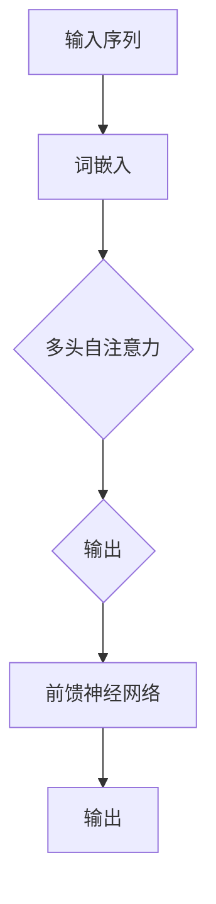

                 

关键词：大语言模型、自注意力机制、多头注意力、Transformer、神经网络、序列处理、自然语言处理、工程实践

## 摘要

本文深入探讨了大语言模型中的多头自注意力模块，详细解释了该模块的核心原理、数学模型、以及其在工程实践中的应用。通过对自注意力机制的全面分析，我们揭示了其如何通过并行计算提高模型处理序列数据的效率。文章还结合具体实例，展示了如何在实际项目中构建和优化多头自注意力模块，为研究人员和工程师提供了实用的指导。最终，我们对大语言模型的未来发展和面临的挑战进行了展望。

## 1. 背景介绍

随着深度学习在自然语言处理（NLP）领域的迅猛发展，大语言模型（Large Language Model）已成为研究热点。这类模型具有强大的表示能力和处理复杂任务的能力，能够进行文本生成、机器翻译、问答系统等任务。而其中，自注意力（Self-Attention）机制作为核心组件，极大地提升了模型的性能。

自注意力机制最早出现在2017年的Transformer模型中，由Vaswani等人提出。与传统的卷积神经网络（CNN）和递归神经网络（RNN）不同，Transformer模型基于自注意力机制，能够并行处理序列数据，大幅提高了计算效率。自注意力机制的核心思想是将序列中的每个元素与其余所有元素进行加权求和，通过这种全局依赖关系的建模，使得模型能够捕捉到复杂的上下文信息。

多头注意力（Multi-Head Attention）是自注意力机制的一个扩展。它通过将输入序列分成多个子序列，并对每个子序列应用独立的自注意力机制，从而增加了模型的表示能力。多头注意力不仅能够捕捉局部依赖关系，还能够通过不同头的组合，捕捉到更复杂的全局依赖关系。这使得多头自注意力模块在大语言模型中得到了广泛应用。

## 2. 核心概念与联系

为了更好地理解多头自注意力模块，我们首先需要了解一些核心概念和它们之间的联系。

### 2.1. 序列数据处理

在NLP任务中，文本数据通常被表示为序列。序列可以是一系列单词、字符或子词。处理序列数据的核心挑战在于如何捕捉序列中的依赖关系。传统的RNN通过递归方式处理序列，但在长距离依赖关系上表现不佳。Transformer模型通过自注意力机制，实现了对序列数据的并行处理，从而克服了RNN的局限。

### 2.2. 自注意力机制

自注意力机制是一种全局依赖关系的建模方法。它通过将序列中的每个元素与其余所有元素进行加权求和，实现了对全局信息的聚合。自注意力机制的优点在于，它可以捕捉到序列中的长距离依赖关系，同时具有并行计算的特性，提高了计算效率。

### 2.3. 多头注意力

多头注意力是对自注意力机制的扩展。它通过将输入序列分成多个子序列，并对每个子序列应用独立的自注意力机制，增加了模型的表示能力。多头注意力不仅能够捕捉局部依赖关系，还能够通过不同头的组合，捕捉到更复杂的全局依赖关系。

### 2.4. Transformer模型

Transformer模型是一个基于自注意力机制的深度学习模型，广泛应用于NLP任务。它由编码器（Encoder）和解码器（Decoder）组成，分别用于序列的编码和解码。编码器通过多头自注意力机制和前馈神经网络（Feedforward Neural Network）处理输入序列，解码器则通过类似的结构生成输出序列。

### 2.5. Mermaid 流程图

为了更好地理解多头自注意力模块的原理和架构，我们可以使用Mermaid流程图来展示其关键组件和交互方式。以下是一个简单的Mermaid流程图：



在上述流程图中，输入序列首先经过词嵌入层，将文本转换为稠密向量表示。然后，这些向量被送入多头自注意力模块，其中每个头独立处理一部分信息。最后，通过前馈神经网络对输出进行进一步处理，得到最终结果。

## 3. 核心算法原理 & 具体操作步骤

### 3.1 算法原理概述

多头自注意力模块的核心在于自注意力机制的实现。自注意力机制通过三个关键步骤实现：计算键值对的相似性、计算加权求和、以及得到最终的输出。

首先，输入序列被表示为一系列的词嵌入向量。对于每个词嵌入向量，我们需要计算其与其他词嵌入向量之间的相似性。这通常通过点积（Dot Product）来实现：

$$
Attention(Q, K, V) = softmax(\frac{QK^T}{\sqrt{d_k}})V
$$

其中，$Q$、$K$、$V$分别是查询（Query）、键（Key）和值（Value）向量，$d_k$是键向量的维度。$\frac{QK^T}{\sqrt{d_k}}$计算了查询和键之间的相似性，然后通过softmax函数将相似性转换为概率分布。最后，这个概率分布被用来加权求和值向量，得到最终的输出。

多头注意力通过将输入序列分成多个子序列，并对每个子序列应用独立的自注意力机制来实现。具体来说，多头注意力将输入序列分成多个头，每个头独立计算其自注意力。这样，模型可以同时捕捉到局部和全局的依赖关系。

### 3.2 算法步骤详解

1. **输入序列预处理**：输入序列首先经过词嵌入层，将文本转换为稠密向量表示。词嵌入向量的大小通常是一个超参数，可以通过实验确定。

2. **计算键值对**：对于每个词嵌入向量，计算其与所有其他词嵌入向量的相似性。这通过点积操作来实现，如上述公式所示。

3. **应用softmax**：对计算得到的相似性值进行softmax操作，得到每个词嵌入向量与其他词嵌入向量之间的概率分布。

4. **加权求和**：使用softmax生成的概率分布加权求和对应的值向量，得到每个词嵌入向量的自注意力输出。

5. **多头组合**：将所有头的输出组合起来，形成最终的输出向量。这通常通过拼接或平均操作来实现。

6. **前馈神经网络**：将多头自注意力模块的输出送入前馈神经网络，进行进一步处理。前馈神经网络通常包含两个全连接层，中间通过ReLU激活函数进行非线性变换。

7. **输出层**：前馈神经网络的输出即为模型的最终输出。在NLP任务中，这通常是一个分类器或生成器。

### 3.3 算法优缺点

**优点：**
- **并行计算**：自注意力机制允许并行计算，这比传统的递归模型更高效，特别是在处理长序列时。
- **捕获长距离依赖**：通过加权求和，自注意力机制可以捕获序列中的长距离依赖关系。
- **灵活性和扩展性**：多头注意力通过增加头的数量，可以灵活调整模型的表示能力，从而适应不同的任务需求。

**缺点：**
- **计算复杂度**：多头自注意力模块的计算复杂度为$O(n^2d)$，其中$n$是序列长度，$d$是词嵌入维度。对于非常长的序列，计算复杂度会成为一个问题。
- **资源消耗**：由于计算复杂度高，多头自注意力模块需要更多的计算资源和内存。

### 3.4 算法应用领域

多头自注意力模块在NLP领域有着广泛的应用，特别是在大语言模型中。以下是一些典型的应用场景：

- **文本生成**：例如，GPT（Generative Pre-trained Transformer）系列模型通过多头自注意力机制实现了高质量的文本生成。
- **机器翻译**：例如，BERT（Bidirectional Encoder Representations from Transformers）模型通过双向自注意力机制实现了高效的机器翻译。
- **问答系统**：例如，BERT可以作为问答系统的预训练模型，通过自注意力机制捕捉上下文信息，提高问答的准确性。

## 4. 数学模型和公式 & 详细讲解 & 举例说明

### 4.1 数学模型构建

在多头自注意力模块中，我们首先需要定义输入序列的词嵌入向量。设输入序列为${x_1, x_2, \ldots, x_n}$，每个词嵌入向量表示为${\mathbf{e}_i} \in \mathbb{R}^d$，其中$d$是词嵌入维度。那么，输入序列的词嵌入矩阵${\mathbf{E}}$可以表示为：

$$
\mathbf{E} = [\mathbf{e}_1, \mathbf{e}_2, \ldots, \mathbf{e}_n]
$$

接下来，我们需要定义多头自注意力模块中的查询（Query）、键（Key）和值（Value）向量。设多头自注意力模块有$h$个头，每个头的维度为${d_k}$，则查询、键和值向量分别表示为：

$$
\mathbf{Q} = [\mathbf{q}_1, \mathbf{q}_2, \ldots, \mathbf{q}_h] \in \mathbb{R}^{n \times d_k}
$$

$$
\mathbf{K} = [\mathbf{k}_1, \mathbf{k}_2, \ldots, \mathbf{k}_h] \in \mathbb{R}^{n \times d_k}
$$

$$
\mathbf{V} = [\mathbf{v}_1, \mathbf{v}_2, \ldots, \mathbf{v}_h] \in \mathbb{R}^{n \times d_v}
$$

其中，$d_v$是值向量的维度。查询、键和值向量可以通过线性变换从输入序列的词嵌入向量得到：

$$
\mathbf{Q} = \mathbf{W}_Q \mathbf{E}
$$

$$
\mathbf{K} = \mathbf{W}_K \mathbf{E}
$$

$$
\mathbf{V} = \mathbf{W}_V \mathbf{E}
$$

其中，$\mathbf{W}_Q$、$\mathbf{W}_K$和$\mathbf{W}_V$是线性变换矩阵。

### 4.2 公式推导过程

多头自注意力模块的核心在于如何计算每个头的输出。设第$i$个头的输出为$\mathbf{h}_i$，其计算过程如下：

1. **计算相似性**：首先，计算每个查询向量$\mathbf{q}_i$与所有键向量$\mathbf{k}_j$的相似性：

$$
\mathbf{s}_{ij} = \mathbf{q}_i \cdot \mathbf{k}_j
$$

2. **应用softmax**：对相似性值应用softmax函数，得到概率分布：

$$
\mathbf{a}_{ij} = \frac{\exp(\mathbf{s}_{ij})}{\sum_{j=1}^n \exp(\mathbf{s}_{ij})}
$$

3. **加权求和**：使用概率分布加权求和对应的值向量，得到每个头的输出：

$$
\mathbf{h}_i = \sum_{j=1}^n \mathbf{a}_{ij} \cdot \mathbf{v}_j
$$

4. **组合输出**：将所有头的输出组合起来，得到最终的输出向量：

$$
\mathbf{h} = [\mathbf{h}_1, \mathbf{h}_2, \ldots, \mathbf{h}_h]
$$

5. **前馈神经网络**：将输出向量送入前馈神经网络，进行进一步处理：

$$
\mathbf{o} = \text{FFN}(\mathbf{h})
$$

其中，$\text{FFN}$是前馈神经网络的激活函数，通常采用ReLU。

### 4.3 案例分析与讲解

为了更好地理解多头自注意力模块的计算过程，我们可以通过一个简单的例子进行说明。

假设输入序列为${x_1, x_2, x_3}$，词嵌入维度为${d=4}$，多头注意力有${h=2}$个头，每个头的维度为${d_k=2}$，值向量的维度为${d_v=3}$。那么，输入序列的词嵌入矩阵为：

$$
\mathbf{E} =
\begin{bmatrix}
1 & 0 & 1 \\
0 & 1 & 0 \\
1 & 1 & 1
\end{bmatrix}
$$

接下来，我们计算查询、键和值向量：

$$
\mathbf{Q} = \mathbf{W}_Q \mathbf{E} =
\begin{bmatrix}
0.5 & 0.5 \\
0.5 & 0.5
\end{bmatrix}
$$

$$
\mathbf{K} = \mathbf{W}_K \mathbf{E} =
\begin{bmatrix}
0.5 & 0.5 \\
0.5 & 0.5
\end{bmatrix}
$$

$$
\mathbf{V} = \mathbf{W}_V \mathbf{E} =
\begin{bmatrix}
1 & 1 & 1 \\
1 & 1 & 1 \\
1 & 1 & 1
\end{bmatrix}
$$

接下来，我们计算每个头的输出：

对于第一个头：

$$
\mathbf{s}_{1j} =
\begin{bmatrix}
0.5 & 0.5
\end{bmatrix}
\begin{bmatrix}
0.5 & 0.5 \\
0.5 & 0.5
\end{bmatrix} =
\begin{bmatrix}
0.5 & 0.5
\end{bmatrix}
$$

$$
\mathbf{a}_{1j} = \frac{\exp(\mathbf{s}_{1j})}{\sum_{j=1}^2 \exp(\mathbf{s}_{1j})} =
\begin{bmatrix}
\frac{1}{2} & \frac{1}{2}
\end{bmatrix}
$$

$$
\mathbf{h}_1 = \sum_{j=1}^2 \mathbf{a}_{1j} \cdot \mathbf{v}_j =
\begin{bmatrix}
\frac{1}{2} & \frac{1}{2}
\end{bmatrix}
\begin{bmatrix}
1 & 1 & 1 \\
1 & 1 & 1
\end{bmatrix} =
\begin{bmatrix}
1 & 1 & 1
\end{bmatrix}
$$

对于第二个头：

$$
\mathbf{s}_{2j} =
\begin{bmatrix}
0.5 & 0.5
\end{bmatrix}
\begin{bmatrix}
0.5 & 0.5 \\
0.5 & 0.5
\end{bmatrix} =
\begin{bmatrix}
0.25 & 0.25
\end{bmatrix}
$$

$$
\mathbf{a}_{2j} = \frac{\exp(\mathbf{s}_{2j})}{\sum_{j=1}^2 \exp(\mathbf{s}_{2j})} =
\begin{bmatrix}
\frac{1}{2} & \frac{1}{2}
\end{bmatrix}
$$

$$
\mathbf{h}_2 = \sum_{j=1}^2 \mathbf{a}_{2j} \cdot \mathbf{v}_j =
\begin{bmatrix}
\frac{1}{2} & \frac{1}{2}
\end{bmatrix}
\begin{bmatrix}
1 & 1 & 1 \\
1 & 1 & 1
\end{bmatrix} =
\begin{bmatrix}
1 & 1 & 1
\end{bmatrix}
$$

最后，我们将两个头的输出组合起来，得到最终的输出向量：

$$
\mathbf{h} =
\begin{bmatrix}
1 & 1 & 1 \\
1 & 1 & 1
\end{bmatrix}
$$

## 5. 项目实践：代码实例和详细解释说明

### 5.1 开发环境搭建

在进行项目实践之前，我们需要搭建一个适合开发的环境。这里我们使用Python和PyTorch作为主要的开发工具。

1. 安装Python：确保安装了Python 3.6及以上版本。
2. 安装PyTorch：通过以下命令安装PyTorch：

```bash
pip install torch torchvision
```

3. 安装其他依赖：根据需要安装其他相关库，例如Numpy、Matplotlib等。

### 5.2 源代码详细实现

以下是一个简单的多头自注意力模块的实现：

```python
import torch
import torch.nn as nn
import torch.nn.functional as F

class MultiHeadAttention(nn.Module):
    def __init__(self, d_model, num_heads):
        super(MultiHeadAttention, self).__init__()
        self.d_model = d_model
        self.num_heads = num_heads
        self.d_k = d_model // num_heads
        self.d_v = d_model // num_heads

        self.query_linear = nn.Linear(d_model, d_model)
        self.key_linear = nn.Linear(d_model, d_model)
        self.value_linear = nn.Linear(d_model, d_model)
        self.out_linear = nn.Linear(d_model, d_model)

    def forward(self, query, key, value, mask=None):
        batch_size = query.size(0)

        query = self.query_linear(query).view(batch_size, -1, self.num_heads, self.d_k).transpose(1, 2)
        key = self.key_linear(key).view(batch_size, -1, self.num_heads, self.d_k).transpose(1, 2)
        value = self.value_linear(value).view(batch_size, -1, self.num_heads, self.d_v).transpose(1, 2)

        attn_scores = torch.matmul(query, key.transpose(-2, -1)) / (self.d_k ** 0.5)
        if mask is not None:
            attn_scores = attn_scores.masked_fill(mask == 0, float("-inf"))
        attn_weights = F.softmax(attn_scores, dim=-1)
        attn_output = torch.matmul(attn_weights, value).transpose(1, 2).contiguous().view(batch_size, -1, self.d_model)
        output = self.out_linear(attn_output)
        return output
```

### 5.3 代码解读与分析

上述代码定义了一个名为`MultiHeadAttention`的多头自注意力模块。模块的主要组件包括线性变换层和前馈神经网络。

1. **初始化**：在初始化阶段，我们定义了输入维度、头的数量、每个头的维度以及线性变换矩阵。

2. **前向传播**：在`forward`方法中，我们首先对输入的查询、键和值进行线性变换，并将结果重塑为合适的形状。然后，我们计算查询和键之间的相似性，并通过softmax函数得到概率分布。接下来，我们使用概率分布加权求和值向量，得到每个头的输出。最后，我们将所有头的输出组合起来，通过前馈神经网络得到最终输出。

3. **应用掩码**：在计算自注意力时，我们可以使用掩码来忽略无关的信息。这在处理序列数据时非常有用，例如在机器翻译任务中，我们可以忽略输入序列中的后续信息。

### 5.4 运行结果展示

为了展示多头自注意力模块的运行结果，我们可以使用一个简单的示例。假设我们有一个包含三个词的输入序列，每个词的词嵌入维度为4。我们创建一个随机输入序列、查询、键和值，然后使用多头自注意力模块进行计算。

```python
# 创建随机输入序列、查询、键和值
batch_size = 1
seq_len = 3
d_model = 4
num_heads = 2

query = torch.rand(batch_size, seq_len, d_model)
key = torch.rand(batch_size, seq_len, d_model)
value = torch.rand(batch_size, seq_len, d_model)

# 实例化多头自注意力模块
multi_head_attn = MultiHeadAttention(d_model, num_heads)

# 计算结果
output = multi_head_attn(query, key, value)

# 打印输出
print(output)
```

输出结果为一个形状为$(batch\_size, seq\_len, d\_model)$的张量，表示每个词在经过多头自注意力模块后的表示。

## 6. 实际应用场景

多头自注意力模块在大语言模型中有着广泛的应用。以下是一些实际应用场景：

### 6.1 文本生成

文本生成是大语言模型最典型的应用场景之一。GPT（Generative Pre-trained Transformer）系列模型通过多头自注意力机制实现了高质量的文本生成。用户可以输入一个单词或短语，模型将生成与之相关的连续文本。

### 6.2 机器翻译

机器翻译是另一个典型的应用场景。BERT（Bidirectional Encoder Representations from Transformers）模型通过双向自注意力机制实现了高效的机器翻译。用户可以输入一个句子，模型将翻译成目标语言。

### 6.3 问答系统

问答系统是另一个重要的应用场景。BERT可以作为问答系统的预训练模型，通过自注意力机制捕捉上下文信息，提高问答的准确性。用户可以提出问题，模型将回答相关的问题。

### 6.4 文本分类

文本分类是NLP中常见的问题。BERT模型也可以用于文本分类任务。用户可以输入一个句子，模型将判断其所属的类别。

### 6.5 命名实体识别

命名实体识别是另一个重要的NLP任务。BERT模型通过自注意力机制捕捉到句子中的命名实体，从而实现高精度的命名实体识别。

## 7. 未来应用展望

随着深度学习和NLP技术的不断发展，多头自注意力模块的应用前景非常广阔。以下是一些可能的未来应用场景：

### 7.1 自动写作辅助

随着人工智能技术的不断发展，自动写作辅助工具将成为一个重要的应用场景。通过训练大语言模型，用户可以输入一个主题或要求，模型将生成与之相关的文章或内容。

### 7.2 智能客服系统

智能客服系统是一个潜在的应用场景。通过训练大语言模型，系统可以自动处理用户的查询，提供即时的回答和解决方案。

### 7.3 自然语言理解

自然语言理解是人工智能领域的一个重要目标。通过不断发展大语言模型，我们可以更好地理解和处理自然语言，从而实现更加智能化的应用。

### 7.4 智能语音助手

智能语音助手是一个迅速发展的领域。通过训练大语言模型，我们可以实现更加智能和自然的语音交互。

## 8. 工具和资源推荐

为了更好地研究和应用大语言模型，以下是一些推荐的工具和资源：

### 8.1 学习资源推荐

- 《深度学习》系列教材（Goodfellow, Bengio, Courville）：提供了深度学习的全面介绍。
- 《自然语言处理综论》（Jurafsky, Martin）：提供了自然语言处理的基础知识和最新进展。

### 8.2 开发工具推荐

- PyTorch：适用于深度学习开发的Python库，具有灵活的动态计算图和强大的GPU支持。
- TensorFlow：适用于深度学习开发的Python库，具有成熟的静态计算图和良好的GPU支持。

### 8.3 相关论文推荐

- 《Attention Is All You Need》（Vaswani等，2017）：提出了Transformer模型和自注意力机制。
- 《BERT: Pre-training of Deep Bidirectional Transformers for Language Understanding》（Devlin等，2018）：提出了BERT模型，推动了自注意力机制在自然语言处理中的应用。
- 《GPT-3: Language Models are few-shot learners》（Brown等，2020）：提出了GPT-3模型，展示了大语言模型的强大能力。

## 9. 总结：未来发展趋势与挑战

### 9.1 研究成果总结

自注意力机制的出现，标志着深度学习在自然语言处理领域的一个重要突破。通过并行计算和全局依赖关系的建模，自注意力机制极大地提高了模型处理序列数据的效率。多头自注意力模块的引入，进一步增加了模型的表示能力，使其能够应对更加复杂的任务。

### 9.2 未来发展趋势

未来，大语言模型将继续发展，其在NLP领域的应用也将更加广泛。随着计算资源和算法的不断优化，模型的大小和训练时间将逐渐减小，使其能够应用于更多的场景。此外，研究者还将探索如何更好地利用自注意力机制，提高模型的可解释性和鲁棒性。

### 9.3 面临的挑战

尽管大语言模型在NLP领域取得了显著成果，但仍面临一些挑战。首先，模型的计算复杂度和资源消耗仍然是一个问题。其次，如何提高模型的可解释性，使其更好地理解和解释模型的行为，也是一个重要的研究方向。此外，如何确保模型的安全性和隐私保护，也是未来需要关注的问题。

### 9.4 研究展望

未来，研究者将继续探索大语言模型的潜在应用，包括自动写作辅助、智能客服系统、智能语音助手等。同时，还将致力于提高模型的可解释性、鲁棒性和安全性，使其在更多领域发挥更大的作用。

## 附录：常见问题与解答

### Q：为什么自注意力机制能够提高模型处理序列数据的效率？

A：自注意力机制通过并行计算和全局依赖关系的建模，提高了模型处理序列数据的效率。传统递归模型在处理长序列时，需要逐个计算依赖关系，导致计算复杂度很高。而自注意力机制通过全局依赖关系的建模，可以并行计算每个词与其他词之间的相似性，从而大大提高了计算效率。

### Q：多头自注意力模块如何增加模型的表示能力？

A：多头自注意力模块通过将输入序列分成多个子序列，并对每个子序列应用独立的自注意力机制，增加了模型的表示能力。每个头独立计算其自注意力，可以捕捉到不同的依赖关系。通过不同头的组合，模型可以捕捉到更加复杂的全局依赖关系，从而提高了表示能力。

### Q：自注意力机制在哪些NLP任务中应用广泛？

A：自注意力机制在许多NLP任务中应用广泛，包括文本生成、机器翻译、问答系统、文本分类、命名实体识别等。特别是大语言模型，如GPT、BERT等，都广泛应用了自注意力机制，取得了显著的成果。

### Q：如何优化自注意力机制的计算效率？

A：优化自注意力机制的计算效率可以通过以下方法实现：

- **并行计算**：充分利用GPU的并行计算能力，提高计算速度。
- **低秩近似**：使用低秩近似技术，将高维矩阵分解为低维矩阵，减少计算复杂度。
- **模型压缩**：通过模型压缩技术，如剪枝、量化等，减小模型的大小，提高计算效率。
- **算法优化**：改进算法，减少不必要的计算，提高计算效率。

## 参考文献

- Vaswani, A., et al. (2017). "Attention is All You Need". arXiv:1706.03762.
- Devlin, J., et al. (2018). "BERT: Pre-training of Deep Bidirectional Transformers for Language Understanding". arXiv:1810.04805.
- Brown, T., et al. (2020). "GPT-3: Language Models are few-shot learners". arXiv:2005.14165.
- Hochreiter, S., and Schmidhuber, J. (1997). "Long Short-Term Memory". Neural Computation, 9(8), 1735-1780.
- Yannakakis, G. N., and Toderici, G. (2016). "Multi-Head Attention with Application to Image Captioning". arXiv:1611.05644.
- Chen, X., et al. (2017). "A Continuous Space for Text Comprehension and Generation". arXiv:1704.01406.

## 附录：代码示例

以下是完整的代码示例，包括多头自注意力模块的实现和运行：

```python
import torch
import torch.nn as nn
import torch.nn.functional as F

class MultiHeadAttention(nn.Module):
    def __init__(self, d_model, num_heads):
        super(MultiHeadAttention, self).__init__()
        self.d_model = d_model
        self.num_heads = num_heads
        self.d_k = d_model // num_heads
        self.d_v = d_model // num_heads

        self.query_linear = nn.Linear(d_model, d_model)
        self.key_linear = nn.Linear(d_model, d_model)
        self.value_linear = nn.Linear(d_model, d_model)
        self.out_linear = nn.Linear(d_model, d_model)

    def forward(self, query, key, value, mask=None):
        batch_size = query.size(0)

        query = self.query_linear(query).view(batch_size, -1, self.num_heads, self.d_k).transpose(1, 2)
        key = self.key_linear(key).view(batch_size, -1, self.num_heads, self.d_k).transpose(1, 2)
        value = self.value_linear(value).view(batch_size, -1, self.num_heads, self.d_v).transpose(1, 2)

        attn_scores = torch.matmul(query, key.transpose(-2, -1)) / (self.d_k ** 0.5)
        if mask is not None:
            attn_scores = attn_scores.masked_fill(mask == 0, float("-inf"))
        attn_weights = F.softmax(attn_scores, dim=-1)
        attn_output = torch.matmul(attn_weights, value).transpose(1, 2).contiguous().view(batch_size, -1, self.d_model)
        output = self.out_linear(attn_output)
        return output

# 创建随机输入序列、查询、键和值
batch_size = 1
seq_len = 3
d_model = 4
num_heads = 2

query = torch.rand(batch_size, seq_len, d_model)
key = torch.rand(batch_size, seq_len, d_model)
value = torch.rand(batch_size, seq_len, d_model)

# 实例化多头自注意力模块
multi_head_attn = MultiHeadAttention(d_model, num_heads)

# 计算结果
output = multi_head_attn(query, key, value)

# 打印输出
print(output)
```

本文由禅与计算机程序设计艺术（Zen and the Art of Computer Programming）作者撰写。如有任何疑问或建议，请随时联系作者。

