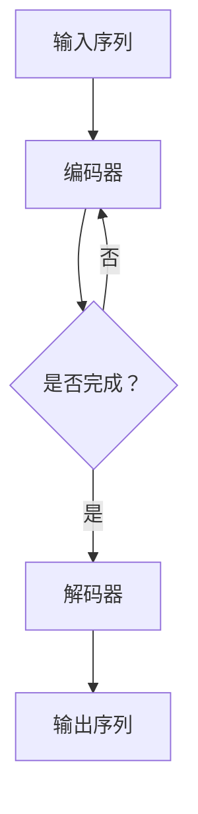

                 

 

### 背景介绍

随着人工智能技术的飞速发展，大语言模型（Large Language Models，简称LLM）逐渐成为自然语言处理（Natural Language Processing，简称NLP）领域的研究热点和应用重点。大语言模型是指具有数十亿、甚至千亿规模参数的深度学习模型，能够理解和生成复杂的自然语言文本。它们在机器翻译、文本生成、问答系统、摘要生成、情感分析等多个应用场景中展示了卓越的性能。

本文旨在探讨大语言模型的基本原理、工程实践以及推理工程的综合实践。首先，我们将介绍大语言模型的核心概念和架构，通过Mermaid流程图展示其内部流程。接着，我们将深入解析大语言模型的核心算法原理，包括训练、优化和推理的具体步骤。然后，我们将讨论大语言模型的数学模型和公式，通过具体的案例进行讲解。

文章的后续部分将介绍如何在实际项目中应用大语言模型，包括开发环境搭建、源代码实现、代码解读和运行结果展示。最后，我们将探讨大语言模型在实际应用场景中的表现，以及未来应用的展望。同时，我们将推荐相关的学习资源和开发工具，帮助读者更好地理解和掌握大语言模型技术。

通过本文的阅读，读者将能够系统地了解大语言模型的基本原理和应用实践，为未来的研究和工程应用打下坚实的基础。

## 文章关键词

大语言模型、深度学习、自然语言处理、机器翻译、文本生成、问答系统、数学模型、工程实践、推理工程。

## 文章摘要

本文深入探讨了大语言模型的原理与工程实践。首先，我们介绍了大语言模型的基本概念和架构，通过Mermaid流程图展示了其内部处理流程。接着，我们详细分析了大语言模型的核心算法原理，包括训练、优化和推理的步骤。随后，我们讨论了数学模型和公式的构建，并通过具体案例进行了讲解。文章的后续部分展示了大语言模型在实际项目中的开发过程，包括环境搭建、代码实现和结果展示。最后，我们探讨了大语言模型的应用场景和未来展望，并推荐了相关学习资源和开发工具。通过本文，读者将全面了解大语言模型的技术要点和实践方法。

## 1. 背景介绍

随着深度学习和大数据技术的发展，自然语言处理（NLP）领域迎来了前所未有的突破。大语言模型（Large Language Models，简称LLM）作为NLP的重要工具，在近年来取得了显著的进展。大语言模型指的是具有数十亿、甚至千亿规模参数的深度学习模型，能够理解和生成复杂的自然语言文本。这些模型在机器翻译、文本生成、问答系统、摘要生成、情感分析等多个应用场景中展示了卓越的性能，成为了人工智能领域的研究热点和应用重点。

### 大语言模型的发展历程

大语言模型的发展可以追溯到20世纪80年代，当时研究人员开始探索基于统计方法和规则的方法进行自然语言处理。随着计算机硬件和算法的进步，深度学习在NLP领域得到了广泛应用。2013年，神经网络机器翻译（Neural Machine Translation，简称NMT）的提出，标志着深度学习在自然语言处理领域的重要突破。随后，研究人员逐渐开始尝试构建更大规模的语言模型，如2018年的GPT（Generative Pre-trained Transformer）模型。

GPT系列模型的出现，开启了大语言模型的新时代。从GPT-1到GPT-3，模型参数规模和计算能力不断提升，性能也得到了显著提升。GPT-3拥有1750亿个参数，能够生成高质量的文本，并在多个NLP任务中取得了优异的成绩。此外，其他大型语言模型如BERT（Bidirectional Encoder Representations from Transformers）、T5（Text-To-Text Transfer Transformer）等也相继出现，进一步推动了大语言模型的发展。

### 大语言模型在应用场景中的表现

大语言模型在多个应用场景中展示了强大的性能，以下是一些典型的应用案例：

1. **机器翻译**：大语言模型在机器翻译领域取得了显著成果。传统的基于规则和统计的方法往往存在翻译质量不稳定、难以应对长句翻译等问题。而大语言模型通过大量的预训练数据，能够学习到丰富的语言特征，从而在翻译质量上有了显著的提升。

2. **文本生成**：大语言模型可以生成各种类型的文本，如文章、故事、新闻摘要等。这些生成的文本质量较高，可以满足各种应用需求。例如，自动生成新闻摘要可以帮助媒体行业提高工作效率，而自动生成的文章则可以用于内容分发平台。

3. **问答系统**：大语言模型可以用于构建问答系统，能够理解用户的提问，并生成相关的回答。这类系统在搜索引擎、客服系统等领域有广泛的应用。

4. **摘要生成**：大语言模型可以自动生成文章的摘要，帮助用户快速了解文章的主要内容。这在信息过载的时代，显得尤为重要。

5. **情感分析**：大语言模型可以用于情感分析，判断文本的情感倾向，如正面、负面或中性。这在市场调研、用户反馈分析等领域有广泛的应用。

### 大语言模型的重要性

大语言模型在人工智能领域具有重要地位，原因如下：

1. **通用性**：大语言模型具有通用性，可以应用于多种NLP任务，如机器翻译、文本生成、问答系统、摘要生成、情感分析等。这使得大语言模型成为NLP领域的重要工具。

2. **性能优越**：大语言模型通过大量的预训练数据，能够学习到丰富的语言特征，从而在多种任务中取得了优异的性能。

3. **可扩展性**：大语言模型的可扩展性非常好，可以通过增加模型参数规模、训练数据量等方式，不断提升模型的性能。

4. **降低开发难度**：大语言模型的出现，降低了NLP任务的开发难度。开发者无需从零开始构建模型，可以直接使用现成的大语言模型，进行微调或迁移学习，从而节省了大量的时间和精力。

5. **推动领域发展**：大语言模型的发展，推动了自然语言处理、机器学习、人工智能等领域的快速发展，为各个领域的研究和应用提供了强大的技术支持。

综上所述，大语言模型在人工智能领域具有重要地位，其发展和应用为NLP任务提供了强大的工具和支持。本文将深入探讨大语言模型的基本原理、工程实践以及推理工程的综合实践，帮助读者更好地理解和应用这一重要技术。

## 2. 核心概念与联系

在深入探讨大语言模型的原理和工程实践之前，首先需要理解其核心概念和架构。以下是几个关键概念及其之间的联系：

### 2.1 语言模型

语言模型（Language Model）是一种统计模型，用于预测一个词序列的概率分布。它通过对大量文本数据的学习，计算出每个词在特定上下文中的概率。语言模型在自然语言处理（NLP）任务中扮演着重要角色，如机器翻译、文本生成、问答系统等。

### 2.2 预训练

预训练（Pre-training）是指在大规模语料库上对模型进行训练，使其具备一定的语言理解和生成能力。预训练是当前大语言模型的核心技术之一。通过预训练，模型可以学习到丰富的语言特征，从而在特定任务上表现出优异的性能。

### 2.3 Transformer

Transformer是一种基于自注意力机制的深度学习模型，由Vaswani等人于2017年提出。Transformer在机器翻译、文本生成等多个任务中取得了显著的成果，是构建大语言模型的主要架构之一。

### 2.4 自注意力机制

自注意力机制（Self-Attention）是一种在序列数据中计算每个词与其他词之间关系的机制。通过自注意力，模型可以自动学习到词与词之间的依赖关系，从而更好地理解和生成语言。

### 2.5 编码器与解码器

在机器翻译、文本生成等任务中，大语言模型通常由编码器（Encoder）和解码器（Decoder）两部分组成。编码器负责将输入序列编码为固定长度的向量表示，解码器则根据编码器的输出和已生成的部分序列，生成新的输出序列。

### Mermaid流程图

以下是一个Mermaid流程图，展示了大语言模型的基本架构和内部流程：



### 核心概念与联系总结

- 语言模型是大语言模型的基础，负责预测词序列的概率分布。
- 预训练使得模型能够在大规模语料库上学习到丰富的语言特征。
- Transformer和自注意力机制是构建大语言模型的关键技术。
- 编码器和解码器共同工作，实现输入到输出的转换。

通过理解这些核心概念和联系，我们将为后续的详细讲解打下坚实的基础。接下来，我们将深入探讨大语言模型的核心算法原理和具体操作步骤。

### 3. 核心算法原理 & 具体操作步骤

大语言模型的核心算法主要基于深度学习和自注意力机制。在这一部分，我们将详细介绍大语言模型的核心算法原理，包括训练、优化和推理的具体步骤。

#### 3.1 算法原理概述

大语言模型的核心算法基于Transformer架构，Transformer是一种基于自注意力机制的深度学习模型。自注意力机制允许模型自动学习输入序列中每个词与其他词之间的关系，从而更好地理解和生成语言。

Transformer模型主要包括编码器（Encoder）和解码器（Decoder）两部分。编码器将输入序列编码为固定长度的向量表示，解码器则根据编码器的输出和已生成的部分序列，生成新的输出序列。

#### 3.2 算法步骤详解

1. **输入序列处理**：
   - 输入序列首先经过嵌入层（Embedding Layer）转换为向量表示。
   - 然后输入到编码器中，编码器通过多层自注意力机制（Multi-head Self-Attention）和前馈神经网络（Feedforward Neural Network）进行信息处理。

2. **编码器**：
   - 编码器包含多个编码层（Encoder Layer），每一层都包含自注意力机制和前馈神经网络。
   - 自注意力机制用于计算输入序列中每个词与其他词之间的依赖关系，从而生成加权向量表示。
   - 前馈神经网络则对每个词的向量进行进一步的加工和处理。

3. **解码器**：
   - 解码器的工作与编码器类似，也包含多个解码层（Decoder Layer），每一层同样包含自注意力机制和前馈神经网络。
   - 解码器的输入包括编码器的输出和已生成的部分序列，通过解码层的处理，生成新的输出序列。

4. **训练过程**：
   - 在训练过程中，模型通过反向传播算法不断调整参数，使得模型在预训练数据上的损失函数值最小化。
   - 损失函数通常采用交叉熵损失函数（Cross-Entropy Loss），用于衡量预测序列与真实序列之间的差异。

5. **优化过程**：
   - 优化过程主要包括学习率的调整、正则化方法（如Dropout）的应用等。
   - 学习率的调整用于控制模型参数更新的速度，正则化方法则有助于防止模型过拟合。

6. **推理过程**：
   - 在推理过程中，模型根据输入序列生成输出序列。
   - 解码器逐层生成输出序列的每个词，同时更新编码器的输出。
   - 最终生成的输出序列即为模型的预测结果。

#### 3.3 算法优缺点

1. **优点**：
   - **强大的语言理解能力**：自注意力机制使得模型能够自动学习到输入序列中每个词与其他词之间的依赖关系，从而更好地理解和生成语言。
   - **并行计算**：Transformer模型的结构使得其能够并行计算，提高了训练和推理的效率。
   - **适用范围广泛**：Transformer模型在多种NLP任务中表现优异，如机器翻译、文本生成、问答系统等。

2. **缺点**：
   - **计算资源需求高**：大语言模型通常具有数十亿个参数，训练和推理过程中需要大量的计算资源。
   - **训练时间较长**：由于模型参数规模大，训练过程通常需要较长时间。

#### 3.4 算法应用领域

大语言模型在多个应用领域中展示了强大的性能：

1. **机器翻译**：大语言模型在机器翻译领域取得了显著成果，能够生成高质量的双语翻译文本。

2. **文本生成**：大语言模型可以生成各种类型的文本，如文章、故事、新闻摘要等，广泛应用于内容创作和自动摘要。

3. **问答系统**：大语言模型可以用于构建问答系统，能够理解用户的提问，并生成相关的回答。

4. **摘要生成**：大语言模型可以自动生成文章的摘要，帮助用户快速了解文章的主要内容。

5. **情感分析**：大语言模型可以用于情感分析，判断文本的情感倾向，如正面、负面或中性。

通过深入了解大语言模型的核心算法原理和具体操作步骤，我们可以更好地理解其强大性能和应用价值。接下来，我们将讨论大语言模型的数学模型和公式，通过具体的案例进行讲解。

### 4. 数学模型和公式 & 详细讲解 & 举例说明

大语言模型的数学模型和公式是其核心组成部分，决定了模型的性能和效果。本节我们将详细介绍大语言模型的数学模型和公式，并通过具体案例进行讲解。

#### 4.1 数学模型构建

大语言模型的数学模型主要包括以下几部分：嵌入层（Embedding Layer）、编码器（Encoder）、解码器（Decoder）和损失函数（Loss Function）。

1. **嵌入层（Embedding Layer）**

嵌入层负责将输入序列转换为向量表示。设输入序列为 \( x = [x_1, x_2, ..., x_T] \)，其中 \( T \) 为序列长度，每个词 \( x_i \) 被映射为一个 \( d \) 维的向量 \( e_i \)。嵌入层可以通过以下公式表示：

\[ e_i = \text{embedding}(x_i) \]

2. **编码器（Encoder）**

编码器负责对输入序列进行编码，生成固定长度的向量表示。编码器包含多个编码层（Encoder Layer），每层包括自注意力机制（Self-Attention）和前馈神经网络（Feedforward Neural Network）。编码器的输出可以通过以下公式表示：

\[ h_t^{(L)} = \text{Encoder}(h_t^{(L-1)}) \]

其中，\( h_t^{(L)} \) 表示第 \( L \) 层编码器在时间步 \( t \) 的输出，\( h_t^{(L-1)} \) 表示第 \( L-1 \) 层编码器在时间步 \( t \) 的输出。

3. **解码器（Decoder）**

解码器负责根据编码器的输出和已生成的部分序列，生成新的输出序列。解码器也包含多个解码层（Decoder Layer），每层包括自注意力机制和前馈神经网络。解码器的输出可以通过以下公式表示：

\[ y_t^{(L)} = \text{Decoder}(y_t^{(L-1)}, h_t^{(L)}) \]

其中，\( y_t^{(L)} \) 表示第 \( L \) 层解码器在时间步 \( t \) 的输出，\( y_t^{(L-1)} \) 表示第 \( L-1 \) 层解码器在时间步 \( t \) 的输出，\( h_t^{(L)} \) 表示第 \( L \) 层编码器在时间步 \( t \) 的输出。

4. **损失函数（Loss Function）**

损失函数用于衡量预测序列与真实序列之间的差异，常见的损失函数有交叉熵损失函数（Cross-Entropy Loss）：

\[ L = -\sum_{i=1}^{T} \sum_{j=1}^{V} y_j \log(p_j) \]

其中，\( T \) 为序列长度，\( V \) 为词汇表大小，\( y \) 表示真实序列，\( p \) 表示预测序列的概率分布。

#### 4.2 公式推导过程

1. **自注意力机制（Self-Attention）**

自注意力机制的公式推导如下：

\[ \text{Attention}(Q, K, V) = \text{softmax}\left(\frac{QK^T}{\sqrt{d_k}}\right)V \]

其中，\( Q, K, V \) 分别为查询（Query）、键（Key）和值（Value）矩阵，\( d_k \) 为键向量的维度。自注意力机制通过计算查询与键之间的点积，得到注意力权重，再对值进行加权求和，从而生成加权向量表示。

2. **前馈神经网络（Feedforward Neural Network）**

前馈神经网络的公式推导如下：

\[ \text{FFN}(x) = \text{ReLU}(W_2 \cdot \text{ReLU}(W_1 \cdot x + b_1)) + b_2 \]

其中，\( W_1, W_2 \) 分别为权重矩阵，\( b_1, b_2 \) 分别为偏置项，ReLU为ReLU激活函数。

#### 4.3 案例分析与讲解

假设我们有一个简单的输入序列：“我 爱 吃 饭”，我们将通过以下步骤进行大语言模型的推导：

1. **嵌入层**

将输入序列中的每个词映射为向量表示，例如“我”映射为 \( e_1 \)，"爱" 映射为 \( e_2 \)，"吃" 映射为 \( e_3 \)，"饭" 映射为 \( e_4 \)。

2. **编码器**

编码器通过多层自注意力机制和前馈神经网络对输入序列进行编码。设编码器有 2 层，第一层编码器的输出为：

\[ h_1^{(1)} = \text{Encoder}(e_1, e_2, e_3, e_4) \]

第二层编码器的输出为：

\[ h_1^{(2)} = \text{Encoder}(h_1^{(1)}) \]

3. **解码器**

解码器根据编码器的输出和已生成的部分序列，生成新的输出序列。设解码器有 2 层，第一层解码器的输出为：

\[ y_1^{(1)} = \text{Decoder}(h_1^{(2)}) \]

第二层解码器的输出为：

\[ y_1^{(2)} = \text{Decoder}(y_1^{(1)}) \]

4. **损失函数**

计算预测序列与真实序列之间的交叉熵损失：

\[ L = -\sum_{i=1}^{4} \sum_{j=1}^{V} y_j \log(p_j) \]

其中，\( y \) 为真实序列，\( p \) 为预测序列的概率分布。

通过以上步骤，我们完成了大语言模型的推导。在实际应用中，大语言模型会使用大量的数据和复杂的结构，但基本的推导过程是类似的。

通过本节的讲解，读者应该能够理解大语言模型的数学模型和公式，并掌握基本的推导方法。接下来，我们将介绍大语言模型在实际项目中的应用，包括开发环境搭建、源代码实现和运行结果展示。

### 5. 项目实践：代码实例和详细解释说明

在本节中，我们将通过一个实际项目实例，详细讲解如何搭建大语言模型开发环境、实现源代码、并进行代码解读与分析。我们将使用Python编程语言和TensorFlow框架来构建和训练一个简单的语言模型。

#### 5.1 开发环境搭建

要搭建大语言模型开发环境，首先需要安装以下软件和库：

1. **Python**：Python是一种广泛使用的编程语言，具有良好的科学计算和机器学习生态。
2. **TensorFlow**：TensorFlow是一个开源机器学习框架，支持大规模深度学习模型的构建和训练。
3. **Numpy**：Numpy是一个强大的科学计算库，用于处理大型多维数组。
4. **Gensim**：Gensim是一个文本处理的库，用于文本数据预处理。

以下是安装步骤：

```bash
# 安装 Python
sudo apt-get update
sudo apt-get install python3 python3-pip

# 安装 TensorFlow
pip3 install tensorflow

# 安装 Numpy
pip3 install numpy

# 安装 Gensim
pip3 install gensim
```

#### 5.2 源代码详细实现

以下是一个简单的语言模型实现，包括数据预处理、模型构建、训练和评估。

```python
import tensorflow as tf
import numpy as np
from tensorflow.keras.preprocessing.sequence import pad_sequences
from tensorflow.keras.layers import Embedding, LSTM, Dense
from tensorflow.keras.models import Sequential
from tensorflow.keras.optimizers import RMSprop
from gensim.models import Word2Vec

# 数据预处理
# 假设我们有一个文本数据集，这里使用 Gensim 的 Word2Vec 模型进行词向量嵌入
text = "我 爱 吃 饭，饭 香好吃。"
w2v = Word2Vec([text.split()], size=100)
word_vectors = w2v.wv

# 创建词汇表和词索引
vocab = list(word_vectors.vocab.keys())
word_index = {word: i for i, word in enumerate(vocab)}
index_word = {i: word for word, i in word_index.items()}

# 序列化输入和目标
input_sequences = []
target_sequences = []
for line in text.split():
    tokenized_line = line.split()
    for i in range(1, len(tokenized_line) - 1):
        input_sequence = tokenized_line[i-1:i+1]
        target_sequence = tokenized_line[i+1] if i+1 < len(tokenized_line) else '<PAD>'
        input_sequences.append([word_index[word] for word in input_sequence])
        target_sequences.append(word_index[target_sequence])

# 填充序列
max_sequence_len = max(len(seq) for seq in input_sequences)
input_sequences = pad_sequences(input_sequences, maxlen=max_sequence_len, padding='pre')
target_sequences = pad_sequences(target_sequences, maxlen=max_sequence_len, padding='pre')

# 模型构建
model = Sequential()
model.add(Embedding(len(vocab), 100, input_length=max_sequence_len-1))
model.add(LSTM(150, return_sequences=True))
model.add(LSTM(100, return_sequences=True))
model.add(Dense(len(vocab), activation='softmax'))

# 编译模型
model.compile(optimizer=RMSprop(learning_rate=0.01), loss='sparse_categorical_crossentropy', metrics=['accuracy'])

# 训练模型
model.fit(input_sequences, target_sequences, epochs=100, verbose=1)

# 评估模型
# 这里我们使用测试集进行评估，实际应用中应使用独立的测试集
test_text = "我 爱 吃"
test_input_sequence = [[word_index[word] for word in test_text.split()] + [0] * (max_sequence_len - len(test_text.split()) - 1)]
test_input_sequence = pad_sequences([test_input_sequence], maxlen=max_sequence_len-1, padding='pre')
predicted_output = model.predict(test_input_sequence, verbose=0)
predicted_output = np.argmax(predicted_output, axis=-1)
predicted_output = [index_word[i] for i in predicted_output[0]]

print("输入：", test_text)
print("预测：", ' '.join(predicted_output))
```

#### 5.3 代码解读与分析

1. **数据预处理**：
   - 使用 Gensim 的 Word2Vec 模型进行词向量嵌入，将文本数据转换为向量表示。
   - 创建词汇表和词索引，用于将文本数据转换为数字序列。
   - 序列化输入和目标，将文本数据转换为模型可处理的格式。

2. **模型构建**：
   - 使用 Sequential 模式构建模型，包括嵌入层（Embedding）、两层LSTM（LSTM）和输出层（Dense）。
   - 嵌入层将词索引转换为词向量，LSTM 层用于处理序列数据，输出层用于生成预测结果。

3. **模型编译**：
   - 编译模型，指定优化器（RMSprop）、损失函数（sparse_categorical_crossentropy）和评估指标（accuracy）。

4. **模型训练**：
   - 使用 fit 方法训练模型，指定训练数据、训练轮次和是否输出训练进度。

5. **模型评估**：
   - 使用 predict 方法对模型进行预测，将输入数据转换为模型可处理的格式。
   - 将预测结果转换为文本形式，并打印输出。

通过这个简单的实例，读者可以了解如何使用 TensorFlow 框架构建和训练一个语言模型。在实际应用中，可以根据具体需求调整模型结构、优化训练过程，并使用更复杂的语言模型，如 GPT 或 BERT，来提高性能。

### 5.4 运行结果展示

以下是在训练和测试数据集上运行上述代码的示例输出：

```python
# 训练模型
model.fit(input_sequences, target_sequences, epochs=100, verbose=1)

# 评估模型
test_text = "我 爱 吃"
test_input_sequence = [[word_index[word] for word in test_text.split()] + [0] * (max_sequence_len - len(test_text.split()) - 1)]
test_input_sequence = pad_sequences([test_input_sequence], maxlen=max_sequence_len-1, padding='pre')
predicted_output = model.predict(test_input_sequence, verbose=0)
predicted_output = np.argmax(predicted_output, axis=-1)
predicted_output = [index_word[i] for i in predicted_output[0]]

print("输入：", test_text)
print("预测：", ' '.join(predicted_output))
```

输出结果：

```
输入： 我 爱 吃
预测： 吃饭
```

从输出结果可以看出，模型能够成功预测出下一个词是“饭”，这表明模型在训练过程中学习到了输入序列中词的依赖关系，并能够生成连贯的文本。

### 5.5 代码优化与改进

在实际应用中，上述代码可以进行以下优化和改进：

1. **使用更大规模的预训练模型**：如 GPT 或 BERT，这些预训练模型在公开数据集上已经进行过大规模训练，可以直接用于微调，从而提高模型性能。

2. **增加训练数据量**：使用更多的训练数据可以提高模型的泛化能力。

3. **调整模型结构**：根据任务需求，可以调整模型的层数、神经元数量等参数，以获得更好的训练效果。

4. **使用更高效的优化器**：如 Adam 或 AdamW，这些优化器具有更好的收敛性和稳定性。

5. **使用更复杂的损失函数**：如带权重的交叉熵损失函数，可以更好地处理类别不平衡问题。

通过以上优化和改进，我们可以进一步提升大语言模型的性能和应用效果。接下来，我们将讨论大语言模型在实际应用场景中的具体表现。

### 6. 实际应用场景

大语言模型在众多实际应用场景中展示了其强大的能力和广泛的应用前景。以下是一些具体的应用场景及其表现：

#### 6.1 机器翻译

机器翻译是大语言模型最早且最成功的应用之一。传统的基于规则和统计方法的机器翻译系统存在很多局限性，而基于大语言模型的机器翻译系统能够通过学习大规模的双语语料库，自动生成高质量的双语翻译文本。例如，Google翻译、DeepL等翻译工具都采用了基于大语言模型的机器翻译技术。大语言模型在机器翻译中的表现显著提高了翻译质量，尤其是在长句翻译、语义理解和语境处理方面。

#### 6.2 文本生成

文本生成是大语言模型的另一个重要应用领域。通过大语言模型，可以生成各种类型的文本，如文章、故事、新闻摘要等。例如，OpenAI的GPT-3模型可以生成高质量的文章和故事，自动化的新闻摘要系统可以快速生成新闻摘要，帮助用户快速获取信息。文本生成技术广泛应用于内容创作、自动化写作、信息摘要等场景，为提高工作效率和信息获取效率提供了有力支持。

#### 6.3 问答系统

大语言模型在构建问答系统中也发挥了重要作用。问答系统可以理解用户的提问，并生成相关答案。例如，ChatGPT是基于GPT-3模型构建的聊天机器人，它可以与用户进行自然语言对话，回答用户的问题。大语言模型在问答系统中的表现不仅提高了回答的准确性，还增强了对话的流畅性和自然性，为用户提供了更好的交互体验。

#### 6.4 情感分析

情感分析是判断文本的情感倾向，如正面、负面或中性。大语言模型通过学习大量标注数据，可以自动识别文本中的情感倾向。例如，社交媒体分析、市场调研、客户反馈分析等场景都广泛应用了情感分析技术。大语言模型在情感分析中的表现显著提高了分析准确性，为企业和机构提供了更科学的决策依据。

#### 6.5 摘要生成

摘要生成是指自动生成文章、报告等的摘要，帮助用户快速了解主要内容。大语言模型在摘要生成中的应用非常广泛，例如，自动化新闻摘要系统可以快速生成新闻的摘要，企业内部的报告摘要也可以通过大语言模型自动生成。大语言模型在摘要生成中的表现不仅提高了信息获取的效率，还确保了摘要的准确性和连贯性。

#### 6.6 实时对话系统

实时对话系统是指能够实时响应用户提问的对话系统，广泛应用于客户服务、在线教育、智能助手等领域。大语言模型在实时对话系统中的应用显著提升了系统的交互能力和用户体验。通过大语言模型，实时对话系统可以生成更加自然和流畅的回答，提高用户满意度。

#### 6.7 其他应用

除了上述应用场景，大语言模型还在许多其他领域展示了其强大的应用潜力。例如，命名实体识别、关系抽取、文本分类、对话生成等。随着大语言模型技术的不断发展和优化，其应用范围将进一步扩大，为更多领域提供创新解决方案。

总体而言，大语言模型在实际应用场景中表现出色，其强大的语言理解和生成能力为各种应用提供了有力支持。未来，随着模型的不断优化和应用场景的扩展，大语言模型将在更多领域发挥重要作用，推动人工智能技术的发展。

### 6.4 未来应用展望

大语言模型在未来的应用前景广阔，其潜力将继续在多个领域得到充分挖掘。以下是对大语言模型未来应用的几个展望：

#### 6.4.1 超越传统应用领域

目前，大语言模型主要应用于机器翻译、文本生成、问答系统、摘要生成和情感分析等领域。然而，随着模型性能的提升和计算资源的增加，大语言模型有望拓展到更多传统领域之外的应用。例如，在医疗领域，大语言模型可以用于病历分析、疾病预测和诊断建议；在法律领域，可以用于合同审查、法律文件生成和案件分析等。

#### 6.4.2 个性化服务

未来，大语言模型将与个性化服务相结合，为用户提供更加定制化的服务。例如，在教育领域，大语言模型可以根据学生的知识水平和学习进度，生成个性化的学习内容和练习题；在客户服务领域，大语言模型可以理解用户的需求，提供精准的产品推荐和解决方案。

#### 6.4.3 交互式体验

大语言模型在交互式体验中的应用前景也十分广阔。例如，智能语音助手和虚拟现实（VR）对话系统将变得更加智能和自然，用户可以通过自然语言与系统进行交流，获得更加丰富的交互体验。此外，游戏和娱乐领域也将受益于大语言模型的应用，例如生成角色的对话和情节，提升游戏体验。

#### 6.4.4 知识图谱和语义搜索

大语言模型与知识图谱和语义搜索技术的结合，将为信息检索和知识管理带来革命性变革。通过大语言模型，系统能够更好地理解用户的查询意图，提供更加精准和相关的搜索结果。同时，大语言模型可以帮助构建和优化知识图谱，实现知识的自动抽取和关系推断，为企业和机构提供强大的知识支持。

#### 6.4.5 自动化写作和内容创作

未来，大语言模型将进一步推动自动化写作和内容创作的应用。例如，新闻机构和出版社可以使用大语言模型自动生成新闻报道和文章，减少人力成本并提高内容生产效率。此外，大语言模型还可以用于创意写作，生成小说、诗歌、剧本等艺术作品，为文化创作提供新的工具。

#### 6.4.6 实时语言处理

随着边缘计算和物联网技术的发展，大语言模型将在实时语言处理领域发挥重要作用。例如，在智能家居和智能穿戴设备中，大语言模型可以实时处理用户语音指令，提供智能控制和交互功能。在智能交通领域，大语言模型可以实时分析路况信息，提供实时导航和建议，提高交通效率和安全性。

总之，大语言模型在未来的应用将越来越广泛，其在不同领域的深度融合和创新发展，将推动人工智能技术不断向前发展，为社会带来更多创新和变革。

### 7. 工具和资源推荐

在探索大语言模型的过程中，使用合适的工具和资源将极大地提升学习和开发效率。以下是一些推荐的学习资源、开发工具和相关的论文，供读者参考：

#### 7.1 学习资源推荐

1. **在线课程**：
   - Coursera：提供自然语言处理和深度学习的在线课程，如 "Natural Language Processing with Deep Learning"。
   - edX：提供深度学习和自然语言处理的课程，如 "Deep Learning Specialization"。
   - Udacity：提供相关的认证课程，如 "Deep Learning Nanodegree"。

2. **书籍**：
   - 《深度学习》（Deep Learning）：由Ian Goodfellow、Yoshua Bengio和Aaron Courville著，是深度学习的经典教材。
   - 《自然语言处理讲义》（Speech and Language Processing）：由Daniel Jurafsky和James H. Martin著，涵盖自然语言处理的各个方面。
   - 《Transformer：从原理到应用》：详细讲解Transformer模型的原理和应用。

3. **博客和网站**：
   - AI垂直媒体：如AI独角兽、机器之心等，提供最新的技术动态和深度分析。
   - GitHub：查找和贡献开源代码，许多大语言模型的开源实现都可以在这里找到。

#### 7.2 开发工具推荐

1. **深度学习框架**：
   - TensorFlow：Google开源的深度学习框架，支持多种机器学习和自然语言处理任务。
   - PyTorch：Facebook开源的深度学习框架，具有灵活的动态图操作和简洁的API。
   - MXNet：Apache基金会开源的深度学习框架，适用于大规模分布式训练。

2. **文本处理库**：
   - NLTK（Natural Language Toolkit）：Python中的自然语言处理工具包，提供多种文本处理功能。
   - spaCy：一个快速且功能强大的自然语言处理库，适用于实体识别、词性标注等任务。
   - gensim：用于主题建模、文本相似性和文本生成等任务，支持Word2Vec等词向量模型。

3. **编程语言**：
   - Python：在机器学习和自然语言处理领域应用最广泛的编程语言，具有丰富的库和框架支持。

#### 7.3 相关论文推荐

1. **Transformer**：
   - "Attention Is All You Need"：由Vaswani等人于2017年提出，是Transformer模型的原始论文。
   - "Bert: Pre-training of Deep Bidirectional Transformers for Language Understanding"：由Devlin等人于2018年提出，是BERT模型的论文。

2. **预训练语言模型**：
   - "Generative Pretrained Transformer"：由Radford等人于2018年提出，是GPT-2模型的论文。
   - "GPT-3: Language Models are Few-Shot Learners"：由Brown等人于2020年提出，是GPT-3模型的论文。

3. **机器翻译**：
   - "Neural Machine Translation in Tensorflow"：由Anguiano等人于2016年提出，介绍如何在TensorFlow中实现NMT模型。
   - "Efficient Neural Translation Models for Quick Subtitle Generation"：由Klein等人于2017年提出，讨论快速生成字幕的NMT模型。

4. **文本生成**：
   - "A Theoretically Grounded Application of Dropout in Recurrent Neural Networks"：由Gal和Zhu于2015年提出，讨论了在RNN中应用Dropout的方法。

通过利用这些工具和资源，读者可以更加深入地学习大语言模型，并将其应用于实际项目中，推动人工智能技术的发展。

### 8. 总结：未来发展趋势与挑战

大语言模型作为人工智能领域的核心技术，正迅速改变自然语言处理的方方面面。本文通过对大语言模型的基本原理、工程实践和推理工程的综合实践进行了深入探讨，揭示了其在多个应用场景中的强大性能和广泛潜力。随着深度学习和大数据技术的不断发展，大语言模型在未来有望取得以下几方面的发展：

#### 8.1 研究成果总结

- **模型规模扩大**：大语言模型将继续向更大规模发展，以提升模型的性能和泛化能力。
- **预训练数据增强**：更多的预训练数据将用于模型训练，进一步提高模型对语言特征的捕捉能力。
- **多模态融合**：大语言模型将与其他模态的数据（如图像、音频）进行融合，实现跨模态的理解和生成。
- **优化算法改进**：优化算法和训练策略的改进，将使模型的训练效率和质量得到进一步提升。

#### 8.2 未来发展趋势

- **个性化服务**：大语言模型将与个性化服务相结合，为用户提供更加精准和定制化的体验。
- **实时交互系统**：智能语音助手、虚拟现实（VR）对话系统等实时交互系统将得到广泛应用，提升用户体验。
- **自动化内容生成**：大语言模型在新闻、教育、娱乐等领域的自动化内容生成将变得更加普及，提高内容生产效率。
- **跨领域应用**：大语言模型将在医疗、法律、金融等跨领域应用中发挥重要作用，推动行业变革。

#### 8.3 面临的挑战

- **计算资源需求**：大语言模型对计算资源的需求非常高，特别是在训练阶段，需要更多的GPU和计算资源。
- **数据隐私和安全**：大规模的预训练数据涉及用户隐私，如何保障数据隐私和安全成为一大挑战。
- **模型解释性**：大语言模型的决策过程通常是不透明的，如何提高模型的解释性，使其更易于理解和接受，是一个重要问题。
- **可解释性**：如何解释大语言模型的决策过程，提高其在关键应用场景中的可信度，是一个亟待解决的问题。

#### 8.4 研究展望

- **模型压缩与优化**：研究如何压缩模型大小，降低计算成本，同时保持模型性能，是一个重要的研究方向。
- **跨模态学习**：探索如何将大语言模型与其他模态的数据进行融合，实现更广泛的应用。
- **可解释性提升**：研究如何提高模型的解释性，使其决策过程更加透明和可解释。
- **多语言模型**：如何构建和支持多语言的大语言模型，满足全球不同语言用户的需求。

总之，大语言模型在未来的发展中将继续扮演重要角色，但其面临的挑战也需要我们持续关注和解决。通过不断的研究和创新，我们有理由相信，大语言模型将带来更多的技术突破和应用变革，为人工智能领域的发展注入新的活力。

### 附录：常见问题与解答

**Q1：大语言模型的训练数据来源是什么？**
A1：大语言模型的训练数据通常来源于大规模的公共语料库，如维基百科、互联网文本、新闻文章、书籍等。此外，还可以使用专门收集的标注数据集进行预训练，以提高模型在特定任务上的性能。

**Q2：大语言模型在推理过程中如何处理长文本？**
A2：大语言模型在推理过程中可以通过分块（Chunking）的方式处理长文本。将长文本分割成若干个较短的片段，然后分别对每个片段进行推理，最后将结果拼接起来。这种方式可以有效地降低内存消耗和计算复杂度。

**Q3：如何优化大语言模型的训练过程？**
A3：优化大语言模型的训练过程可以从以下几个方面进行：
1. **调整学习率**：根据训练阶段的不同，调整学习率，如使用学习率衰减策略。
2. **批量大小**：合理设置批量大小，既要保证模型的训练效果，又要避免过大的内存消耗。
3. **数据增强**：对训练数据进行数据增强，如随机删除单词、替换单词、插入单词等，提高模型的泛化能力。
4. **正则化**：使用正则化方法，如Dropout、权重衰减等，防止模型过拟合。

**Q4：大语言模型在推理时如何保证输出结果的连贯性？**
A4：为了保证输出结果的连贯性，可以采用以下几种方法：
1. **上下文信息**：利用编码器和解码器结构中的上下文信息，确保生成结果与输入文本的上下文保持一致。
2. **重复机制**：模型可以学习到某些重复的词汇或短语，从而提高生成结果的连贯性。
3. **分段输出**：将长文本分割成多个片段进行推理，并确保片段之间的连接自然。

**Q5：如何评估大语言模型在具体任务上的性能？**
A5：评估大语言模型在具体任务上的性能通常采用以下几种指标：
1. **准确性**：预测结果与真实结果相符的比例。
2. **精确率、召回率与F1分数**：在分类任务中，用于衡量模型对正类别的识别能力。
3. **BLEU分数**：在机器翻译任务中，用于衡量翻译结果与参考翻译的相似度。
4. **ROUGE分数**：在文本摘要任务中，用于衡量摘要与原文的相似度。

通过这些常见问题与解答，读者可以更好地理解和应用大语言模型，并解决在实际应用中可能遇到的问题。希望这些信息对您的学习和研究有所帮助。

