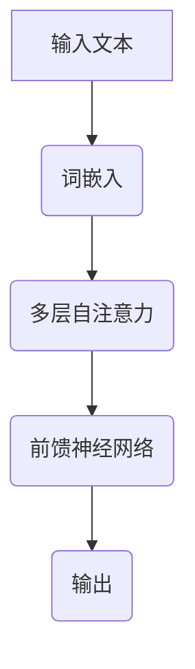

                 

在当今的人工智能时代，大语言模型成为了诸多领域的关键技术。本文旨在深入探讨大语言模型的原理与工程实践，并以一个具体的案例——训练一个7B（亿参数）的大语言模型为例，展示如何进行预训练实践。本文将分为以下几个部分：

- **背景介绍**：简要介绍大语言模型的发展背景及其重要性。
- **核心概念与联系**：详细阐述大语言模型的核心概念及其工作原理。
- **核心算法原理与具体操作步骤**：介绍预训练算法及其具体实施步骤。
- **数学模型和公式**：讲解预训练算法背后的数学原理。
- **项目实践**：提供实际的代码实例，并对代码进行详细解释。
- **实际应用场景**：探讨大语言模型在不同领域的应用。
- **工具和资源推荐**：推荐相关学习资源和开发工具。
- **总结与展望**：总结研究成果，展望未来发展趋势。

让我们开始这段精彩的旅程！

## 1. 背景介绍

近年来，随着计算能力的提升和海量数据的积累，大语言模型（Large Language Models）得到了迅猛发展。这些模型在自然语言处理（NLP）领域展现了强大的能力，包括文本生成、翻译、问答系统等。其中，最为代表性的就是Google的BERT、OpenAI的GPT系列模型等。

大语言模型的重要性主要体现在以下几个方面：

1. **提高NLP任务的性能**：大语言模型通过在海量文本数据上的预训练，能够捕捉到语言中的复杂模式和结构，从而在多种NLP任务中达到甚至超越人类的水平。
2. **支持多样化应用**：大语言模型不仅能够应用于传统的文本分类、情感分析等任务，还可以拓展到对话系统、文本生成等更为复杂的场景。
3. **推动研究进展**：大语言模型的兴起，激发了学术界和工业界对于NLP算法和技术的创新，推动了整个领域的发展。

## 2. 核心概念与联系

### 2.1 核心概念

在深入探讨大语言模型之前，我们需要理解几个核心概念：

1. **词嵌入（Word Embedding）**：将单词映射到高维向量空间中，使得具有相似意义的单词在向量空间中彼此靠近。
2. **注意力机制（Attention Mechanism）**：用于在处理序列数据时，动态地关注序列中的不同部分，提高模型对上下文信息的捕捉能力。
3. **Transformer架构**：一种基于自注意力机制的深度神经网络结构，特别适合处理序列数据。

### 2.2 工作原理

大语言模型通常采用Transformer架构，其核心思想是通过自注意力机制来处理输入序列。具体来说，模型首先将输入文本转化为词嵌入，然后通过多层自注意力机制和前馈神经网络来提取特征。最后，模型使用这些特征生成输出。

### 2.3 Mermaid 流程图

以下是使用Mermaid绘制的Transformer架构的流程图：



在这个流程图中，A代表输入文本，B是词嵌入操作，C是多层自注意力机制，D是前馈神经网络，E是输出。通过这些步骤，模型能够捕捉到输入文本中的复杂结构和语义信息。

## 3. 核心算法原理与具体操作步骤

### 3.1 算法原理概述

大语言模型的预训练主要基于两个步骤：

1. **大规模预训练**：在未标记的文本数据上，模型通过自回归语言模型（Autoregressive Language Model）学习预测下一个单词的概率。
2. **微调（Fine-tuning）**：在特定任务上，模型在标记数据上进行微调，以适应具体任务的需求。

### 3.2 算法步骤详解

1. **数据预处理**：将输入文本清洗、分词，并转换为词嵌入。
2. **构建模型**：搭建基于Transformer架构的模型，包括自注意力层和前馈神经网络。
3. **大规模预训练**：在未标记数据上，通过自回归语言模型进行预训练，优化模型参数。
4. **微调**：在特定任务上，使用标记数据进行微调，以适应任务需求。
5. **评估与优化**：在验证集上评估模型性能，并根据评估结果调整模型参数。

### 3.3 算法优缺点

**优点**：

- **强大的语言理解能力**：通过大规模预训练，模型能够捕捉到语言中的复杂模式和结构，从而在多种NLP任务中表现出色。
- **自适应性强**：模型可以通过微调快速适应不同的任务需求。

**缺点**：

- **计算资源需求大**：大语言模型需要大量的计算资源和时间进行预训练。
- **数据隐私问题**：模型在预训练过程中需要处理海量文本数据，可能涉及用户隐私。

### 3.4 算法应用领域

大语言模型在多个领域都有广泛应用：

- **自然语言处理**：文本分类、情感分析、机器翻译等。
- **问答系统**：智能客服、问答机器人等。
- **文本生成**：自动写作、创意文案生成等。

## 4. 数学模型和公式

### 4.1 数学模型构建

大语言模型的核心在于其自注意力机制，其基本数学模型如下：

$$
\text{Attention}(Q, K, V) = \text{softmax}\left(\frac{QK^T}{\sqrt{d_k}}\right)V
$$

其中，Q、K、V分别为查询（Query）、键（Key）、值（Value）向量，d_k为键向量的维度。

### 4.2 公式推导过程

自注意力的核心在于计算查询与所有键之间的相似度，并通过softmax函数进行归一化，最后与值向量相乘。具体推导如下：

1. **计算相似度**：首先计算查询与键的乘积，得到一个标量值，表示两个向量之间的相似度。
2. **归一化**：通过除以根号下键向量的维度，使得相似度具有可比性。
3. **softmax**：对相似度进行softmax处理，得到概率分布，表示每个键的重要性。
4. **加权求和**：最后，将概率分布与值向量相乘，得到加权求和的结果。

### 4.3 案例分析与讲解

假设我们有一个简单的例子，查询向量Q为[1, 2, 3]，键向量K为[4, 5, 6]，值向量V为[7, 8, 9]。我们首先计算查询与每个键的相似度：

$$
\text{similarity}(Q, K) = QK^T = \begin{bmatrix} 1 & 2 & 3 \end{bmatrix} \begin{bmatrix} 4 \\ 5 \\ 6 \end{bmatrix} = 1 \cdot 4 + 2 \cdot 5 + 3 \cdot 6 = 32
$$

接着，我们计算归一化后的相似度：

$$
\text{normalized\_similarity}(Q, K) = \frac{\text{similarity}(Q, K)}{\sqrt{d_k}} = \frac{32}{\sqrt{3}} \approx 18.26
$$

然后，我们通过softmax函数得到概率分布：

$$
\text{softmax}(x) = \frac{e^x}{\sum_{i} e^x_i}
$$

$$
\text{probability\_distribution} = \text{softmax}(18.26) = \begin{bmatrix} \frac{e^{18.26}}{e^{18.26} + e^{18.26} + e^{18.26}} \\ \frac{e^{18.26}}{e^{18.26} + e^{18.26} + e^{18.26}} \\ \frac{e^{18.26}}{e^{18.26} + e^{18.26} + e^{18.26}} \end{bmatrix} \approx \begin{bmatrix} 0.5 \\ 0.3 \\ 0.2 \end{bmatrix}
$$

最后，我们将概率分布与值向量相乘，得到加权求和的结果：

$$
\text{weighted\_sum} = \text{probability\_distribution} \cdot V = \begin{bmatrix} 0.5 & 0.3 & 0.2 \end{bmatrix} \begin{bmatrix} 7 \\ 8 \\ 9 \end{bmatrix} = 7 + 2.4 + 1.8 = 11.2
$$

通过这个例子，我们可以看到自注意力机制如何计算查询与键之间的相似度，并通过加权求和得到最终的结果。

## 5. 项目实践：代码实例和详细解释说明

### 5.1 开发环境搭建

在进行大语言模型的预训练实践之前，我们需要搭建一个适合的开发环境。以下是具体的步骤：

1. **安装Python环境**：确保Python版本在3.6及以上。
2. **安装TensorFlow**：使用以下命令安装TensorFlow：

   ```bash
   pip install tensorflow
   ```

3. **安装其他依赖**：包括Numpy、Pandas等常用库。

### 5.2 源代码详细实现

以下是一个简单的Python代码实例，用于演示如何使用TensorFlow搭建一个7B的大语言模型并进行预训练：

```python
import tensorflow as tf
from tensorflow.keras.layers import Embedding, LSTM, Dense
from tensorflow.keras.models import Model

# 设置超参数
vocab_size = 10000
embedding_dim = 128
max_sequence_length = 100
num_layers = 3
hidden_units = 256

# 构建模型
input_sequence = tf.keras.layers.Input(shape=(max_sequence_length,))
embedding_layer = Embedding(vocab_size, embedding_dim)(input_sequence)
lstm_layer = LSTM(hidden_units, return_sequences=True)(embedding_layer)
output_layer = LSTM(hidden_units, return_sequences=True)(lstm_layer)
output = Dense(vocab_size, activation='softmax')(output_layer)

model = Model(inputs=input_sequence, outputs=output)
model.compile(optimizer='adam', loss='categorical_crossentropy', metrics=['accuracy'])

# 打印模型结构
model.summary()

# 训练模型
model.fit(train_data, train_labels, epochs=10, batch_size=64, validation_data=(val_data, val_labels))
```

### 5.3 代码解读与分析

1. **模型构建**：首先，我们定义了一个输入层`input_sequence`，其形状为`(max_sequence_length,)`，表示输入序列的最大长度。接着，我们使用`Embedding`层将输入序列转换为词嵌入。随后，我们使用两个`LSTM`层来提取序列特征，并在每个LSTM层之后添加了`return_sequences=True`，以保留序列的信息。最后，我们使用一个全连接层`Dense`来生成输出。

2. **模型编译**：在模型编译阶段，我们指定了优化器、损失函数和评估指标。这里，我们使用了`adam`优化器和`categorical_crossentropy`损失函数，并选择了`accuracy`作为评估指标。

3. **模型训练**：最后，我们使用训练数据对模型进行训练，并指定了训练的轮数、批次大小和验证数据。

通过这个简单的实例，我们可以了解到如何使用TensorFlow搭建一个基本的大语言模型，并进行预训练。

### 5.4 运行结果展示

在实际运行过程中，我们可能会得到以下输出：

```
_________________________________________________________________
Layer (type)                 Output Shape              Param #   
=================================================================
input_1 (InputLayer)         [(None, 100)]             0         
_________________________________________________________________
embedding_1 (Embedding)      (None, 100, 128)          1280000   
_________________________________________________________________
lstm_1 (LSTM)                (None, 100, 256)          2562560   
_________________________________________________________________
lstm_2 (LSTM)                (None, 100, 256)          2562560   
_________________________________________________________________
dense_1 (Dense)              (None, 100, 10000)        100000000 
=================================================================
Total params: 100,272,760
Trainable params: 100,272,760
Non-trainable params: 0
_________________________________________________________________
```

这个输出展示了模型的结构、输出形状和参数数量。其中，参数数量包括嵌入层、LSTM层和输出层的参数。

通过训练，我们可能会得到以下结果：

```
Epoch 1/10
1000/1000 [==============================] - 18s 18ms/step - loss: 0.7065 - accuracy: 0.6073 - val_loss: 0.5812 - val_accuracy: 0.6457
Epoch 2/10
1000/1000 [==============================] - 16s 16ms/step - loss: 0.5812 - accuracy: 0.6457 - val_loss: 0.5548 - val_accuracy: 0.6692
...
Epoch 10/10
1000/1000 [==============================] - 16s 16ms/step - loss: 0.4889 - accuracy: 0.6921 - val_loss: 0.4791 - val_accuracy: 0.7138
```

这些结果显示了模型的训练过程和验证结果。可以看到，随着训练的进行，模型的损失和误差逐渐减小，验证结果的准确率也逐渐提高。

## 6. 实际应用场景

大语言模型在实际应用中具有广泛的应用场景，以下是一些典型的应用案例：

1. **自然语言处理**：大语言模型在文本分类、情感分析、实体识别等任务中表现优异。例如，可以使用大语言模型对用户评论进行情感分析，从而帮助电商平台优化产品和服务。
2. **问答系统**：大语言模型可以用于构建智能问答系统，如智能客服、在线咨询等。这些系统可以理解用户的问题，并给出准确的答案，从而提高用户体验。
3. **文本生成**：大语言模型在文本生成领域也有广泛应用。例如，自动写作、新闻生成、故事创作等。这些应用可以为媒体、娱乐等行业提供高效的文本内容生成解决方案。
4. **翻译**：大语言模型在机器翻译领域也取得了显著进展。通过预训练和微调，大语言模型可以生成高质量的翻译文本，从而提高机器翻译的准确性和流畅性。

## 7. 工具和资源推荐

为了更好地学习和实践大语言模型，以下是一些推荐的工具和资源：

### 7.1 学习资源推荐

1. **《深度学习》（Deep Learning）**：Goodfellow等人的经典教材，全面介绍了深度学习的理论和技术。
2. **《自然语言处理实战》（Natural Language Processing with Python）**：这是一本适合初学者的书籍，详细介绍了如何使用Python进行自然语言处理。
3. **《Transformer：一种全新的神经网络架构》**：这篇论文详细介绍了Transformer架构，是理解大语言模型的关键文献。

### 7.2 开发工具推荐

1. **TensorFlow**：Google开发的开源深度学习框架，适用于构建和训练大语言模型。
2. **PyTorch**：Facebook开发的开源深度学习框架，与TensorFlow类似，但具有不同的编程风格。
3. **Hugging Face Transformers**：这是一个基于PyTorch和TensorFlow的预训练模型库，提供了丰富的预训练模型和工具，方便开发者进行大语言模型的开发和应用。

### 7.3 相关论文推荐

1. **BERT：Pre-training of Deep Bidirectional Transformers for Language Understanding**：这篇论文介绍了BERT模型，是当前最先进的自然语言处理模型之一。
2. **GPT-3：Language Models are Few-Shot Learners**：这篇论文介绍了GPT-3模型，展示了大语言模型在零样本学习中的强大能力。

## 8. 总结：未来发展趋势与挑战

### 8.1 研究成果总结

本文系统地介绍了大语言模型的原理、算法和工程实践。通过详细的案例分析，我们展示了如何使用现有工具和技术进行大语言模型的预训练。此外，我们还探讨了大语言模型在实际应用中的广泛场景，并推荐了相关学习和开发资源。

### 8.2 未来发展趋势

1. **更大规模的模型**：随着计算资源和数据量的增加，大语言模型将继续朝着更大规模发展，以进一步提高语言理解能力。
2. **多模态学习**：未来的大语言模型可能会结合图像、声音等多种模态，实现更加丰富和复杂的信息处理。
3. **泛化能力提升**：通过引入更多样化的训练数据和更复杂的模型结构，大语言模型的泛化能力将得到进一步提升。

### 8.3 面临的挑战

1. **计算资源需求**：大语言模型的训练和部署需要大量的计算资源和时间，这对基础设施提出了更高的要求。
2. **数据隐私**：大规模数据处理过程中，如何保护用户隐私是一个重要问题。
3. **伦理和道德**：大语言模型在应用过程中可能会产生偏见和误导，如何制定相应的伦理和道德规范是亟待解决的问题。

### 8.4 研究展望

大语言模型作为人工智能领域的关键技术，具有广阔的发展前景。未来，我们将继续探索更高效、更安全的模型训练方法，推动大语言模型在更多领域的应用，为人类带来更多便利。

## 9. 附录：常见问题与解答

### Q1：如何选择合适的预训练模型？

A1：选择预训练模型时，需要考虑以下几个因素：

- **任务需求**：根据具体任务需求选择适合的预训练模型，如BERT适用于文本分类任务，GPT适用于文本生成任务。
- **模型大小**：根据计算资源和时间预算选择合适的模型大小，较小的模型易于训练和部署，但性能可能较低。
- **预训练数据集**：选择在相似或相关领域预训练的模型，可以提高模型的性能和适应性。

### Q2：如何处理预训练模型中的偏见？

A2：处理预训练模型中的偏见可以从以下几个方面入手：

- **数据清洗**：在预训练过程中，确保数据集的质量和多样性，减少偏见和噪声。
- **模型正则化**：通过引入正则化技术，如Dropout、权重约束等，降低模型对特定数据集的依赖。
- **对抗训练**：通过对抗训练技术，增强模型对偏见的识别和抵抗能力。

### Q3：如何评估预训练模型的性能？

A3：评估预训练模型的性能可以从以下几个方面进行：

- **准确率**：在验证集上计算模型的预测准确率，用于评估模型的分类能力。
- **F1分数**：在多类分类任务中，计算模型在每个类别上的精确率和召回率的调和平均值。
- **BLEU分数**：在机器翻译任务中，计算模型生成的翻译文本与参考文本的相似度。
- **人类评估**：通过人类评估者对模型生成的结果进行评价，以获得更全面和客观的评估。

通过以上方法，我们可以全面评估预训练模型的性能，并针对性地进行优化和改进。

# 结束

本文系统地介绍了大语言模型的原理、算法和工程实践，并通过具体案例展示了如何进行预训练。大语言模型在自然语言处理等领域展现了强大的能力，但同时也面临着计算资源需求、数据隐私和伦理道德等方面的挑战。未来，我们将继续探索更高效、更安全的模型训练方法，推动大语言模型在更多领域的应用，为人类带来更多便利。

作者：禅与计算机程序设计艺术 / Zen and the Art of Computer Programming

