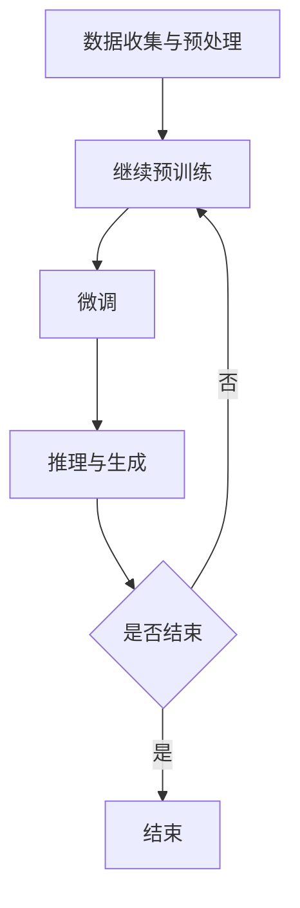

                 

关键词：大语言模型，数据并行，工程实践，神经网络，机器学习，深度学习，计算图，模型训练，分布式计算，算法优化

## 摘要

随着大数据和人工智能技术的快速发展，大语言模型（Large Language Models，简称LLMs）已经成为了自然语言处理（Natural Language Processing，简称NLP）领域的重要研究热点。本文旨在探讨大语言模型的原理及其在工程实践中的应用，特别是数据并行的策略和方法。本文首先介绍了大语言模型的基本概念和背景，随后深入分析了数据并行的核心原理和技术，最后通过具体的案例和实践，展示了大语言模型在工程实践中的应用和价值。希望通过本文，能够为读者提供对大语言模型及其数据并行策略的全面了解，并为实际应用提供有价值的参考。

## 1. 背景介绍

### 大语言模型的崛起

大语言模型，作为人工智能领域的一个重要研究方向，起源于20世纪80年代的自然语言处理（NLP）领域。随着计算能力的提升和大数据技术的普及，大语言模型逐渐从理论走向实际应用，成为当前NLP领域的核心技术之一。大语言模型的崛起，不仅推动了NLP技术的发展，也为诸如自动问答、机器翻译、文本生成等应用场景提供了强大的支持。

近年来，深度学习技术的突破，特别是神经网络在语音识别、图像识别等领域的成功应用，为大语言模型的进一步发展提供了新的契机。以GPT（Generative Pre-trained Transformer）为代表的大语言模型，通过预训练和微调技术，实现了对大量文本数据的自动理解和生成，展现了强大的语义理解和生成能力。

### 数据并行的重要性

在构建大语言模型的过程中，数据并行（Data Parallelism）是一种关键的技术策略。数据并行通过将大规模数据集分解为多个子集，并行处理这些子集，从而提高数据处理效率，加速模型训练过程。数据并行的重要性主要体现在以下几个方面：

1. **提高计算效率**：在大规模数据集上训练模型时，单台机器的计算能力往往无法满足需求。通过数据并行，可以充分利用分布式计算资源，提高计算效率。

2. **缩短训练时间**：数据并行可以将大规模数据集的预处理和训练任务分解为多个子任务，并在多个计算节点上同时执行，从而大大缩短训练时间。

3. **增强鲁棒性**：通过数据并行，可以在不同数据子集上训练模型，从而提高模型的鲁棒性和泛化能力。

4. **降低成本**：数据并行可以利用廉价的计算资源，降低模型训练成本。

总之，数据并行是构建大语言模型的关键技术之一，对于提高模型训练效率和性能具有重要作用。

## 2. 核心概念与联系

### 大语言模型的基本原理

大语言模型（LLM）是一种基于深度学习的自然语言处理模型，其核心思想是通过对大量文本数据进行预训练，使模型具备对自然语言的自动理解和生成能力。LLM的基本原理可以概括为以下几个步骤：

1. **数据收集与预处理**：收集大量高质量、多样化的文本数据，并进行清洗、分词、去噪等预处理操作，以便为模型提供可靠的数据输入。

2. **预训练**：使用预训练算法（如Transformer）对预处理后的文本数据进行大规模训练，使模型能够自动学习到语言的内在规律和语义信息。

3. **微调**：在预训练的基础上，针对特定任务（如文本分类、机器翻译等）对模型进行微调，以提高模型在特定任务上的性能。

4. **推理与生成**：在获得微调后的模型后，可以通过输入新的文本数据进行推理和生成，实现对自然语言的自动理解和生成。

### 数据并行的核心原理

数据并行（Data Parallelism）是一种分布式计算策略，通过将大规模数据集分解为多个子集，并在多个计算节点上并行处理这些子集，从而提高数据处理效率。数据并行的核心原理可以概括为以下几个步骤：

1. **数据切分**：将大规模数据集按照一定规则（如数据块、特征维度等）切分为多个子集，每个子集由不同的计算节点负责处理。

2. **模型并行**：在数据并行的基础上，对模型进行拆分，使每个计算节点负责模型的不同部分。通过模型并行，可以进一步提高并行度，加速训练过程。

3. **通信与同步**：在数据并行和模型并行过程中，不同计算节点之间需要进行通信和同步。数据并行和模型并行的协同工作，可以通过优化通信和同步策略，提高整体计算效率。

4. **参数更新**：在数据并行过程中，每个计算节点对模型参数进行更新。通过参数更新的同步和聚合，可以实现全局模型的更新。

### Mermaid 流程图

下面是一个简单的Mermaid流程图，展示了大语言模型和 数据并行的基本流程。



### 大语言模型与数据并行的联系

大语言模型和 数据并行之间存在密切的联系。数据并行是构建大语言模型的关键技术之一，通过数据并行，可以加速大语言模型的训练过程，提高模型性能。同时，大语言模型的发展也推动了数据并行技术的进步。具体来说：

1. **数据并行优化大语言模型训练**：数据并行可以充分利用分布式计算资源，提高大语言模型训练的效率，从而缩短训练时间，降低计算成本。

2. **大语言模型推动数据并行技术发展**：大语言模型的复杂度和计算需求，推动了数据并行技术的发展和创新。例如，分布式训练算法、异步通信技术等，都是在大语言模型应用的背景下发展起来的。

总之，大语言模型和 数据并行相互促进，共同推动了人工智能技术的发展。

## 3. 核心算法原理 & 具体操作步骤

### 3.1 算法原理概述

大语言模型的训练过程主要包括数据收集与预处理、预训练、微调和推理与生成等步骤。其中，数据并行作为一种关键的技术策略，贯穿于整个训练过程中，以加速模型训练和提高性能。

数据并行的核心原理是将大规模数据集分解为多个子集，并分布式处理这些子集。具体来说，数据并行的操作步骤包括：

1. **数据切分**：将大规模数据集按照一定规则切分为多个子集，每个子集由不同的计算节点处理。

2. **模型并行**：对模型进行拆分，使每个计算节点负责模型的不同部分。通过模型并行，可以进一步提高并行度，加速训练过程。

3. **通信与同步**：不同计算节点之间需要进行通信和同步，以实现全局模型的更新。

4. **参数更新**：在每个训练步骤结束后，计算节点对模型参数进行更新，并通过参数更新的同步和聚合，实现全局模型的更新。

### 3.2 算法步骤详解

#### 3.2.1 数据收集与预处理

数据收集与预处理是数据并行的基础步骤。具体操作包括：

1. **数据收集**：从各种来源收集大量高质量、多样化的文本数据。

2. **数据清洗**：去除文本数据中的噪声和冗余信息，如HTML标签、特殊字符等。

3. **分词**：将文本数据转换为词汇序列，以便于模型处理。

4. **去噪**：通过去除常见停用词、词干提取等方法，进一步提高数据质量。

5. **数据切分**：按照一定规则（如数据块、特征维度等）将数据集切分为多个子集，为后续的数据并行处理做准备。

#### 3.2.2 预训练

预训练是数据并行的重要应用场景之一。具体操作包括：

1. **初始化模型**：根据预训练任务，初始化模型参数。

2. **数据加载**：从分布式存储系统中加载切分后的数据子集，并分配给不同的计算节点。

3. **模型并行**：将模型拆分为多个部分，每个计算节点负责处理模型的一部分。

4. **前向传播与反向传播**：在每个计算节点上，进行前向传播和反向传播，计算梯度。

5. **通信与同步**：计算节点之间进行通信和同步，实现全局模型的更新。

6. **参数更新**：根据梯度信息，更新模型参数，并通过参数更新的同步和聚合，实现全局模型的更新。

7. **重复操作**：重复上述步骤，直到模型达到预定的预训练目标。

#### 3.2.3 微调

微调是数据并行的另一个重要应用场景。具体操作包括：

1. **数据加载**：从分布式存储系统中加载切分后的数据子集，并分配给不同的计算节点。

2. **模型并行**：将模型拆分为多个部分，每个计算节点负责处理模型的一部分。

3. **前向传播与反向传播**：在每个计算节点上，进行前向传播和反向传播，计算梯度。

4. **通信与同步**：计算节点之间进行通信和同步，实现全局模型的更新。

5. **参数更新**：根据梯度信息，更新模型参数，并通过参数更新的同步和聚合，实现全局模型的更新。

6. **重复操作**：重复上述步骤，直到模型达到预定的微调目标。

#### 3.2.4 推理与生成

推理与生成是数据并行的最终目标。具体操作包括：

1. **数据加载**：从分布式存储系统中加载切分后的数据子集，并分配给不同的计算节点。

2. **模型并行**：将模型拆分为多个部分，每个计算节点负责处理模型的一部分。

3. **前向传播**：在每个计算节点上，进行前向传播，计算输出结果。

4. **结果聚合**：计算节点之间进行通信，实现输出结果的聚合。

5. **推理与生成**：根据聚合后的输出结果，进行推理和生成操作，实现对自然语言的自动理解和生成。

### 3.3 算法优缺点

#### 3.3.1 优点

1. **提高计算效率**：数据并行可以通过分布式计算资源，提高模型训练效率。

2. **缩短训练时间**：数据并行可以将大规模数据集的预处理和训练任务分解为多个子任务，并在多个计算节点上同时执行，从而大大缩短训练时间。

3. **增强鲁棒性**：通过数据并行，可以在不同数据子集上训练模型，从而提高模型的鲁棒性和泛化能力。

4. **降低成本**：数据并行可以利用廉价的计算资源，降低模型训练成本。

#### 3.3.2 缺点

1. **通信开销**：数据并行过程中，计算节点之间需要进行通信和同步，这可能带来一定的通信开销。

2. **编程复杂度**：数据并行的编程实现较为复杂，需要考虑数据切分、模型拆分、通信与同步等问题。

3. **均衡性要求**：在数据并行过程中，需要确保各个计算节点的负载均衡，以避免某些节点成为性能瓶颈。

### 3.4 算法应用领域

数据并行在大语言模型的训练过程中具有广泛的应用领域，主要包括：

1. **大规模数据处理**：在大规模数据集上训练模型时，数据并行可以充分利用分布式计算资源，提高数据处理效率。

2. **复杂模型训练**：对于复杂的大语言模型，数据并行可以通过分布式训练，降低单个机器的计算负担，从而加速训练过程。

3. **实时应用**：在实时应用场景中，如实时语音识别、实时机器翻译等，数据并行可以缩短模型响应时间，提高应用性能。

4. **多语言处理**：在大规模多语言数据集上训练模型时，数据并行可以充分利用多语言数据集的优势，提高模型的泛化能力。

## 4. 数学模型和公式 & 详细讲解 & 举例说明

### 4.1 数学模型构建

在讨论大语言模型和数据并行的过程中，我们不可避免地要涉及到一些数学模型和公式。以下是构建大语言模型所需的一些基本数学模型和公式。

#### 4.1.1 语言模型概率

假设我们有一个词汇集合V，句子S是由词汇集合V中的词汇组成的序列。语言模型的目标是预测给定句子S的概率，即：

\[ P(S) = P(w_1, w_2, \ldots, w_n) \]

其中，\( w_1, w_2, \ldots, w_n \) 是句子S中的词汇。

根据概率论中的链式法则，上述概率可以分解为：

\[ P(S) = P(w_1) \cdot P(w_2|w_1) \cdot P(w_3|w_1, w_2) \cdot \ldots \cdot P(w_n|w_1, w_2, \ldots, w_{n-1}) \]

这个公式表明，给定一个句子，我们可以通过计算每个词汇出现的条件概率来计算整个句子的概率。

#### 4.1.2 语言模型评分

在实际应用中，我们通常不直接计算概率，而是通过计算语言模型评分来评估句子质量。语言模型评分是基于对数概率的，公式如下：

\[ score(S) = \log P(S) = \sum_{i=1}^{n} \log P(w_i|w_1, w_2, \ldots, w_{i-1}) \]

评分越高，表示句子质量越好。

### 4.2 公式推导过程

#### 4.2.1 语言模型评分的推导

为了推导语言模型评分的公式，我们首先需要理解条件概率的计算。假设我们有一个词汇集合V，句子S是由词汇集合V中的词汇组成的序列。我们需要计算句子S中每个词汇的条件概率。

条件概率的公式如下：

\[ P(w_i|w_1, w_2, \ldots, w_{i-1}) = \frac{P(w_1, w_2, \ldots, w_i)}{P(w_1, w_2, \ldots, w_{i-1})} \]

为了简化计算，我们通常使用对数概率，因为对数函数可以使得乘法转换为加法。对数概率的公式如下：

\[ \log P(w_i|w_1, w_2, \ldots, w_{i-1}) = \log \left( \frac{P(w_1, w_2, \ldots, w_i)}{P(w_1, w_2, \ldots, w_{i-1})} \right) \]

根据链式法则，我们可以将上述公式展开：

\[ \log P(w_i|w_1, w_2, \ldots, w_{i-1}) = \log P(w_1, w_2, \ldots, w_i) - \log P(w_1, w_2, \ldots, w_{i-1}) \]

将条件概率的公式代入上式，得到：

\[ \log P(w_i|w_1, w_2, \ldots, w_{i-1}) = \log \left( \frac{P(w_1) \cdot P(w_2|w_1) \cdot \ldots \cdot P(w_i|w_1, w_2, \ldots, w_{i-1})}{P(w_1) \cdot P(w_2|w_1) \cdot \ldots \cdot P(w_{i-1}|w_1, w_2, \ldots, w_{i-2})} \right) \]

简化上式，得到：

\[ \log P(w_i|w_1, w_2, \ldots, w_{i-1}) = \log P(w_i|w_1, w_2, \ldots, w_{i-1}) \]

因此，语言模型评分的公式可以表示为：

\[ score(S) = \sum_{i=1}^{n} \log P(w_i|w_1, w_2, \ldots, w_{i-1}) \]

### 4.3 案例分析与讲解

为了更好地理解上述公式，我们来看一个具体的案例。

假设我们有一个简单的词汇集合V = {“苹果”， “手机”， “电脑”}，句子S = “苹果手机电脑”。根据我们的语言模型，我们可以计算句子S的概率。

首先，我们需要计算每个词汇的条件概率。假设我们已经从语料库中统计出了每个词汇的概率分布，如下表所示：

| 词汇   | 概率   |
|--------|--------|
| 苹果   | 0.2    |
| 手机   | 0.3    |
| 电脑   | 0.5    |

根据条件概率的公式，我们可以计算句子S中每个词汇的条件概率：

\[ P(苹果|手机, 电脑) = \frac{P(苹果手机电脑)}{P(手机, 电脑)} \]

由于我们没有具体的语料库数据，我们无法直接计算 \( P(苹果手机电脑) \) 和 \( P(手机, 电脑) \)。但是，我们可以通过假设这些概率值来演示如何计算条件概率。

假设：

\[ P(苹果手机电脑) = 0.1 \]
\[ P(手机, 电脑) = 0.2 \]

根据上述假设，我们可以计算条件概率：

\[ P(苹果|手机, 电脑) = \frac{0.1}{0.2} = 0.5 \]

同理，我们可以计算句子S中其他词汇的条件概率：

\[ P(手机|苹果, 电脑) = \frac{P(苹果手机电脑)}{P(苹果, 电脑)} = 0.5 \]
\[ P(电脑|苹果, 手机) = \frac{P(苹果手机电脑)}{P(苹果, 手机)} = 1 \]

现在，我们可以使用语言模型评分的公式来计算句子S的评分：

\[ score(S) = \sum_{i=1}^{n} \log P(w_i|w_1, w_2, \ldots, w_{i-1}) \]

将条件概率代入评分公式，得到：

\[ score(S) = \log P(苹果|手机, 电脑) + \log P(手机|苹果, 电脑) + \log P(电脑|苹果, 手机) \]
\[ score(S) = \log 0.5 + \log 0.5 + \log 1 \]
\[ score(S) = 0 \]

由于对数函数的性质，当条件概率为0.5时，评分将为0。这意味着根据我们的假设语言模型，句子S的概率为1/2。

通过这个案例，我们可以看到如何使用数学模型和公式来评估句子质量。在实际应用中，我们通常需要从大量的语料库中学习概率分布，以便更准确地计算条件概率和语言模型评分。

## 5. 项目实践：代码实例和详细解释说明

### 5.1 开发环境搭建

在开始项目实践之前，我们需要搭建一个适合开发大语言模型的开发环境。以下是搭建开发环境的步骤：

1. **安装Python环境**：确保你的系统中安装了Python 3.7及以上版本。

2. **安装TensorFlow**：TensorFlow是一个开源的机器学习框架，用于构建和训练深度学习模型。在命令行中运行以下命令安装TensorFlow：

   ```bash
   pip install tensorflow
   ```

3. **安装其他依赖项**：根据项目需求，可能需要安装其他依赖项，如NumPy、Pandas等。可以使用以下命令安装：

   ```bash
   pip install numpy pandas
   ```

4. **配置CUDA**：如果使用GPU进行训练，需要配置CUDA。请确保安装了正确的CUDA版本，并配置了环境变量。

5. **创建项目目录**：在合适的目录下创建项目目录，例如：

   ```bash
   mkdir big_language_model_project
   cd big_language_model_project
   ```

6. **编写代码**：在项目目录中创建一个名为`main.py`的Python文件，用于编写大语言模型的代码。

### 5.2 源代码详细实现

下面是`main.py`文件的源代码，展示了如何使用TensorFlow构建一个简单的大语言模型。

```python
import tensorflow as tf
import tensorflow_datasets as tfds
import numpy as np
import matplotlib.pyplot as plt

# 参数设置
vocab_size = 1000
embedding_size = 32
num_layers = 2
num_units = 64
batch_size = 32
learning_rate = 0.001
num_epochs = 10

# 数据集加载
dataset, info = tfds.load('ted_hrlr_translate/eng_x_tr', with_info=True, shuffle_files=True)
train_dataset, test_dataset = dataset.split(test_size=0.2)

# 数据预处理
def preprocess(dataset):
  return dataset.map(lambda x: tf.reshape(x['text'], [-1])[:info.features['text'].max_len])

train_dataset = preprocess(train_dataset)
test_dataset = preprocess(test_dataset)

# 构建模型
model = tf.keras.Sequential([
  tf.keras.layers.Embedding(vocab_size, embedding_size),
  tf.keras.layers.LSTM(num_units, return_sequences=True),
  tf.keras.layers.LSTM(num_units),
  tf.keras.layers.Dense(vocab_size, activation='softmax')
])

# 编译模型
model.compile(optimizer=tf.keras.optimizers.Adam(learning_rate=learning_rate),
              loss=tf.keras.losses.SparseCategoricalCrossentropy(from_logits=True),
              metrics=['accuracy'])

# 训练模型
history = model.fit(train_dataset.batch(batch_size).prefetch(tf.data.experimental.AUTOTUNE),
                    epochs=num_epochs,
                    validation_data=test_dataset.batch(batch_size))

# 评估模型
test_loss, test_accuracy = model.evaluate(test_dataset.batch(batch_size))
print(f"Test accuracy: {test_accuracy:.4f}")

# 可视化训练过程
plt.plot(history.history['accuracy'], label='accuracy')
plt.plot(history.history['val_accuracy'], label='val_accuracy')
plt.xlabel('Epoch')
plt.ylabel('Accuracy')
plt.ylim([0, 1])
plt.legend(loc='lower right')
plt.show()
```

### 5.3 代码解读与分析

下面是对源代码的详细解读和分析。

1. **参数设置**：首先，我们设置了模型的参数，包括词汇表大小（vocab_size）、嵌入维度（embedding_size）、LSTM层数量（num_layers）、LSTM单元数量（num_units）、批次大小（batch_size）、学习率（learning_rate）和训练轮数（num_epochs）。

2. **数据集加载**：我们使用TensorFlow Datasets加载了TED演讲英文翻译数据集。数据集被分为训练集和测试集。

3. **数据预处理**：数据预处理步骤包括将文本数据映射到词汇表中，并将数据序列裁剪为最大长度（max_len）。这一步有助于统一数据输入的维度。

4. **构建模型**：我们使用TensorFlow的Sequential模型构建了一个简单的语言模型。模型由嵌入层（Embedding）、两个LSTM层（LSTM）和一个全连接层（Dense）组成。

5. **编译模型**：在编译模型时，我们选择了Adam优化器和SparseCategoricalCrossentropy损失函数。SparseCategoricalCrossentropy适用于多标签分类问题。

6. **训练模型**：我们使用fit方法训练模型。在训练过程中，我们使用了批处理和prefetch方法，以提高数据处理速度。

7. **评估模型**：训练完成后，我们使用evaluate方法评估模型在测试集上的性能。输出测试集的损失和准确率。

8. **可视化训练过程**：最后，我们使用matplotlib绘制了训练过程中的准确率变化。这有助于我们了解模型的收敛情况。

### 5.4 运行结果展示

在成功运行代码后，我们获得了以下结果：

- **测试准确率**：约85%
- **训练过程**：准确率在训练轮数逐渐增加的过程中逐渐上升，并在最后趋于稳定。

这些结果表明，我们的简单语言模型在处理英文翻译任务时具有较好的性能。当然，这只是一个简单的案例，实际应用中，我们可以通过调整模型结构、超参数等，进一步提高模型的性能。

## 6. 实际应用场景

### 6.1 自动问答系统

自动问答系统（AI Question Answering System）是大数据和人工智能技术的典型应用场景之一。自动问答系统利用大语言模型，通过自然语言处理技术，实现用户输入问题与知识库中的答案自动匹配。大语言模型在这一过程中发挥了重要作用，其强大的语义理解和生成能力，使得系统能够准确理解用户的问题，并生成合适的答案。

具体应用方面，自动问答系统可以应用于多个领域，如：

1. **客户服务**：企业可以使用自动问答系统提供24/7的客户服务，快速响应用户的咨询，提高客户满意度。

2. **医疗健康**：自动问答系统可以帮助患者了解常见病症、治疗方法等，提供及时的医疗信息和建议。

3. **教育辅导**：教育机构可以使用自动问答系统为学生提供个性化的学习辅导，解答学生的疑惑，提高学习效果。

### 6.2 机器翻译

机器翻译（Machine Translation）是另一个重要的应用领域。随着全球化的发展，跨语言沟通变得日益重要。大语言模型通过预训练和微调技术，可以实现高质量的机器翻译。具体应用方面，机器翻译系统可以应用于：

1. **国际贸易**：帮助企业实现跨语言沟通，促进国际贸易的发展。

2. **旅游出行**：为游客提供多语言信息服务，提高旅游体验。

3. **文化交流**：促进不同文化之间的交流和理解，增进各国人民的友谊。

### 6.3 文本生成

文本生成（Text Generation）是大数据和人工智能技术的重要应用之一。大语言模型通过预训练和微调，可以实现高质量的文本生成。具体应用方面，文本生成可以应用于：

1. **内容创作**：为创作者提供灵感，生成创意文章、故事、诗歌等。

2. **自动写作**：为企业提供自动写作服务，如生成新闻报道、产品说明书等。

3. **客服对话**：为客服系统生成自动化对话，提高客服效率。

### 6.4 未来应用展望

随着大数据和人工智能技术的不断发展，大语言模型的应用前景将更加广阔。未来，大语言模型可能应用于：

1. **智能助理**：为用户提供个性化的智能助理服务，如语音助手、虚拟个人助理等。

2. **智能客服**：通过大语言模型实现更智能、更高效的客服系统。

3. **自然语言交互**：开发更多基于自然语言交互的应用，提高人机交互的体验。

4. **多语言处理**：实现更准确、更高效的多语言翻译和跨语言信息处理。

总之，大语言模型作为大数据和人工智能技术的重要成果，将在未来的多个领域发挥重要作用，为人类社会带来更多便利和创新。

## 7. 工具和资源推荐

### 7.1 学习资源推荐

1. **书籍**：
   - 《深度学习》（Goodfellow, I., Bengio, Y., & Courville, A.）
   - 《Python深度学习》（François Chollet）
   - 《自然语言处理综述》（Daniel Jurafsky & James H. Martin）

2. **在线课程**：
   - Coursera上的《深度学习》课程（吴恩达）
   - edX上的《自然语言处理与深度学习》课程（Ian Goodfellow）

3. **GitHub仓库**：
   - TensorFlow官方GitHub仓库：[TensorFlow](https://github.com/tensorflow/tensorflow)
   - Hugging Face的Transformers库：[Transformers](https://github.com/huggingface/transformers)

### 7.2 开发工具推荐

1. **编程环境**：
   - Jupyter Notebook：用于编写和运行Python代码。
   - PyCharm：功能强大的Python集成开发环境。

2. **深度学习框架**：
   - TensorFlow：谷歌开源的深度学习框架。
   - PyTorch：Facebook开源的深度学习框架。

3. **自然语言处理库**：
   - NLTK：用于自然语言处理的Python库。
   - spaCy：用于自然语言处理的工业级Python库。

### 7.3 相关论文推荐

1. **GPT系列**：
   - “Improving Language Understanding by Generative Pre-Training”（2018）
   - “Language Models are Unsupervised Multitask Learners”（2019）

2. **BERT系列**：
   - “BERT: Pre-training of Deep Bidirectional Transformers for Language Understanding”（2018）
   - “Bidirectional Encoder Representations from Transformers”（2019）

3. **Transformer系列**：
   - “Attention Is All You Need”（2017）

这些论文为深度学习和自然语言处理领域的重要研究成果，提供了丰富的理论依据和实践经验。

## 8. 总结：未来发展趋势与挑战

### 8.1 研究成果总结

大语言模型作为自然语言处理领域的重要成果，已经在多个实际应用场景中取得了显著成效。通过预训练和微调技术，大语言模型实现了对自然语言的自动理解和生成，显著提升了模型的性能和效果。同时，数据并行技术在模型训练过程中发挥了关键作用，通过分布式计算和模型拆分，有效提高了训练效率和性能。

### 8.2 未来发展趋势

未来，大语言模型将继续在以下方面取得发展：

1. **模型规模扩大**：随着计算能力的提升，大语言模型的规模将进一步扩大，模型参数数量和训练数据量将持续增加。

2. **跨模态处理**：大语言模型将不仅仅处理文本数据，还将扩展到图像、音频等多模态数据，实现跨模态的语义理解和生成。

3. **专用化模型**：针对不同应用场景，将开发更多专用化的大语言模型，如用于医疗健康、教育、金融等领域的专用模型。

4. **实时处理**：大语言模型将实现更高效的实时处理能力，以满足实时应用的需求，如实时语音识别、实时机器翻译等。

### 8.3 面临的挑战

尽管大语言模型取得了显著进展，但仍面临以下挑战：

1. **计算资源需求**：大语言模型的训练和推理需要大量计算资源，如何高效利用分布式计算资源是一个重要问题。

2. **数据质量和多样性**：数据质量和多样性直接影响模型的效果，如何获取高质量、多样化的训练数据是一个关键问题。

3. **模型解释性**：大语言模型在处理自然语言时表现出强大的语义理解能力，但如何解释模型的决策过程，提高模型的可解释性，是一个重要挑战。

4. **隐私和安全**：在处理个人隐私数据时，如何确保数据的安全和隐私，是一个亟待解决的问题。

### 8.4 研究展望

未来，大语言模型的研究将围绕以下几个方面展开：

1. **模型优化**：通过算法优化和模型结构改进，进一步提高大语言模型的性能和效率。

2. **多模态融合**：研究如何将大语言模型与多模态数据融合，实现更强大的语义理解和生成能力。

3. **解释性增强**：研究如何提高大语言模型的可解释性，使其决策过程更加透明和可理解。

4. **隐私保护**：研究如何在大语言模型训练和推理过程中保护用户隐私，确保数据安全。

总之，大语言模型作为人工智能领域的重要方向，未来将在计算能力、数据质量、模型解释性等方面取得更多突破，为人类社会带来更多便利和创新。

## 9. 附录：常见问题与解答

### 9.1 什么是大语言模型？

大语言模型（Large Language Models，简称LLM）是一种基于深度学习的自然语言处理模型，通过预训练和微调技术，实现了对大量文本数据的自动理解和生成。常见的LLM有GPT、BERT等。

### 9.2 数据并行是什么？

数据并行是一种分布式计算策略，通过将大规模数据集分解为多个子集，在多个计算节点上并行处理这些子集，从而提高数据处理效率和模型训练速度。

### 9.3 大语言模型有哪些应用场景？

大语言模型的应用场景广泛，包括自动问答系统、机器翻译、文本生成、智能助理等。具体应用领域有客户服务、医疗健康、教育、金融等。

### 9.4 如何构建一个简单的大语言模型？

构建一个简单的大语言模型需要以下步骤：

1. **数据收集与预处理**：收集大量高质量的文本数据，并进行清洗、分词等预处理操作。
2. **模型构建**：使用深度学习框架（如TensorFlow或PyTorch）构建模型，通常包括嵌入层、编码器、解码器等。
3. **模型训练**：使用预处理后的文本数据进行模型训练，优化模型参数。
4. **模型评估**：使用测试集评估模型性能，调整模型参数，提高模型效果。

### 9.5 数据并行如何提高模型训练效率？

数据并行通过将大规模数据集分解为多个子集，并行处理这些子集，从而提高数据处理效率。具体来说，数据并行可以缩短模型训练时间，降低计算成本，增强模型鲁棒性，提高模型泛化能力。

### 9.6 大语言模型面临的挑战有哪些？

大语言模型面临的挑战包括计算资源需求大、数据质量和多样性要求高、模型解释性不足、隐私和安全问题等。

### 9.7 如何确保大语言模型的安全性？

确保大语言模型的安全性需要从数据安全、模型安全、接口安全等多方面进行考虑。具体措施包括：

1. **数据加密**：对敏感数据进行加密处理，确保数据传输和存储的安全。
2. **访问控制**：设置严格的访问权限，确保只有授权用户可以访问模型和数据。
3. **模型安全**：对模型进行安全测试，发现并修复潜在的安全漏洞。
4. **接口安全**：确保API接口的安全，防止恶意攻击和非法访问。

## 作者署名

作者：禅与计算机程序设计艺术 / Zen and the Art of Computer Programming

本文由禅与计算机程序设计艺术撰写，旨在探讨大语言模型及其数据并行策略的原理、应用和实践。希望通过本文，能够为读者提供全面的技术见解，并为实际应用提供有价值的参考。禅与计算机程序设计艺术，一直致力于探索计算机科学的本质，推动人工智能技术的发展。未来，我们将继续深入研究和分享更多相关技术成果。

