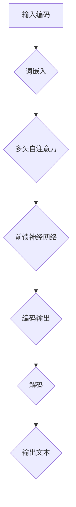

                 

关键词：大语言模型、自然语言处理、工程实践、算法原理、数学模型、项目实践、未来展望

## 摘要

本文旨在探讨大语言模型在自然语言处理（NLP）领域的原理及其工程实践中的方法瓶颈。首先，我们将回顾大语言模型的历史背景和基本概念，然后深入分析其核心算法原理，包括数学模型和具体操作步骤。接下来，通过实际项目实践，我们将展示如何搭建和实现大语言模型，并进行代码解读和分析。随后，文章将探讨大语言模型在各个应用场景中的实际效果，并对其未来应用和挑战进行展望。最后，我们将推荐相关的学习资源和开发工具，并提供常见的问答以帮助读者更好地理解大语言模型的原理和应用。

## 1. 背景介绍

自然语言处理（NLP）作为人工智能领域的一个重要分支，致力于让计算机理解和生成人类语言。随着互联网和大数据的快速发展，NLP技术得到了广泛应用，从搜索引擎、机器翻译到聊天机器人，无不依赖于NLP的核心算法。而大语言模型（Large Language Model）正是近年来NLP领域的一项重要突破。

大语言模型的核心思想是通过深度学习算法，训练一个能够理解和生成自然语言的复杂模型。最早的尝试可以追溯到1980年代，当时人们开始探索基于统计的模型，如统计语言模型和概率图模型。随着计算能力的提升和算法的进步，2000年代后，神经网络在NLP中的应用逐渐兴起，如递归神经网络（RNN）和卷积神经网络（CNN）。

然而，真正的大语言模型浪潮始于2018年，当时谷歌推出了Transformer模型，这是一种基于自注意力机制的全新架构。Transformer模型不仅在理论层面上解决了RNN和CNN的一些固有缺陷，还在实际应用中展现了超越传统模型的性能。随后，一系列基于Transformer的改进模型如BERT、GPT、T5等相继出现，推动了NLP技术的飞速发展。

大语言模型的核心优势在于其强大的语言理解和生成能力。通过大规模数据训练，大语言模型可以捕捉到语言中的复杂模式和规律，从而实现高质量的文本生成、情感分析、机器翻译等功能。这使得大语言模型成为NLP领域的一项关键技术，也为其他人工智能应用提供了强有力的支持。

## 2. 核心概念与联系

### 2.1 大语言模型的基本概念

大语言模型是一种基于深度学习技术的自然语言处理模型，其核心目标是通过学习大量文本数据，生成符合语法和语义规则的自然语言文本。大语言模型的基本概念包括：

- **词嵌入（Word Embedding）**：将单词映射到高维空间中的向量表示，以便模型能够理解单词之间的语义关系。
- **编码器（Encoder）和解码器（Decoder）**：编码器用于将输入文本转换为固定长度的向量表示，解码器则用于生成预测的输出文本。
- **注意力机制（Attention Mechanism）**：允许模型在生成每个单词时，关注输入文本的不同部分，从而提高生成文本的准确性和连贯性。

### 2.2 大语言模型的架构

大语言模型的架构通常基于Transformer模型，这是一种基于自注意力机制的神经网络架构。Transformer模型的主要组成部分包括：

- **多头自注意力（Multi-Head Self-Attention）**：通过多个注意力头同时处理输入序列，从而捕捉到更丰富的特征。
- **前馈神经网络（Feed-Forward Neural Network）**：在自注意力层之后，对每个位置输出进行进一步处理。
- **位置编码（Positional Encoding）**：将输入序列的位置信息编码到向量中，以保持序列的顺序信息。

### 2.3 大语言模型的工作原理

大语言模型的工作原理可以概括为以下几个步骤：

1. **输入编码**：将输入文本转换为词嵌入向量。
2. **自注意力计算**：通过多头自注意力机制计算输入序列的注意力权重，生成编码后的向量表示。
3. **前馈神经网络**：对自注意力层的输出进行进一步处理。
4. **解码**：解码器根据编码后的向量表示生成输出文本。

### 2.4 Mermaid 流程图

以下是Mermaid流程图，展示了大语言模型的基本架构和流程：



## 3. 核心算法原理 & 具体操作步骤

### 3.1 算法原理概述

大语言模型的算法原理主要基于自注意力机制和Transformer架构。自注意力机制允许模型在生成每个单词时，关注输入序列的不同部分，从而提高生成文本的准确性和连贯性。Transformer架构则通过多头自注意力机制和前馈神经网络，实现了对输入序列的深度处理。

### 3.2 算法步骤详解

1. **输入编码**：
   - 将输入文本转换为词嵌入向量。
   - 添加位置编码，以保留输入序列的顺序信息。

2. **多头自注意力计算**：
   - 通过多个注意力头同时处理输入序列，生成编码后的向量表示。
   - 计算每个注意力头的权重，加权求和得到输出向量。

3. **前馈神经网络**：
   - 对自注意力层的输出进行进一步处理。
   - 通过两个全连接层进行非线性变换。

4. **解码**：
   - 根据编码后的向量表示生成输出文本。
   - 使用贪心策略或采样策略选择下一个单词。

### 3.3 算法优缺点

**优点**：
- **强表达能力**：通过多头自注意力机制，模型可以捕捉到输入序列中的复杂特征。
- **并行计算**：Transformer模型支持并行计算，提高了训练效率。

**缺点**：
- **计算资源消耗大**：大语言模型通常需要大量计算资源和存储空间。
- **训练时间较长**：由于模型参数规模较大，训练时间相对较长。

### 3.4 算法应用领域

大语言模型在NLP领域有广泛的应用，包括但不限于：

- **文本生成**：如文章撰写、故事创作、对话生成等。
- **机器翻译**：如自动翻译、多语言文本生成等。
- **情感分析**：如情感分类、评论分析等。
- **问答系统**：如智能客服、问答机器人等。

## 4. 数学模型和公式 & 详细讲解 & 举例说明

### 4.1 数学模型构建

大语言模型的数学模型主要包括词嵌入、多头自注意力、前馈神经网络和损失函数等。

1. **词嵌入**：
   - 词嵌入将单词映射到高维空间中的向量表示。
   - 设 $v_w$ 为词 $w$ 的词嵌入向量，$V$ 为所有词嵌入向量的集合。

2. **多头自注意力**：
   - 自注意力机制通过计算输入序列的注意力权重，生成编码后的向量表示。
   - 设 $Q, K, V$ 为三个权重矩阵，$h$ 为输入序列的编码结果，$h_i$ 为第 $i$ 个词的编码结果。
   - 自注意力计算公式为：$h_i' = \text{softmax}(\frac{Qh_iK^T}{\sqrt{d_k}})V$，其中 $d_k$ 为注意力头的大小。

3. **前馈神经网络**：
   - 前馈神经网络对自注意力层的输出进行进一步处理。
   - 前馈神经网络由两个全连接层组成，输入为自注意力层的输出，输出为编码结果。
   - 前馈神经网络公式为：$h_i'' = \text{ReLU}(W_2 \text{ReLU}(W_1 h_i'))$，其中 $W_1, W_2$ 为全连接层的权重矩阵。

4. **损失函数**：
   - 损失函数用于评估模型的预测结果与真实标签之间的差距。
   - 常用的损失函数为交叉熵损失函数，公式为：$L(y, \hat{y}) = -\sum_{i} y_i \log(\hat{y}_i)$，其中 $y$ 为真实标签，$\hat{y}$ 为模型的预测概率。

### 4.2 公式推导过程

大语言模型的公式推导主要涉及词嵌入、多头自注意力、前馈神经网络和损失函数的推导。

1. **词嵌入**：
   - 设输入文本为 $x = (w_1, w_2, ..., w_n)$，其中 $w_i$ 为第 $i$ 个词。
   - 词嵌入公式为：$e_w = \text{softmax}(\text{W}_x w)$，其中 $\text{W}_x$ 为词嵌入权重矩阵。

2. **多头自注意力**：
   - 自注意力公式为：$h_i' = \text{softmax}(\frac{Qh_iK^T}{\sqrt{d_k}})V$。
   - 推导过程：
     - 首先计算点积：$e_{ij} = h_iK_j^T$。
     - 然后计算 softmax：$a_{ij} = \text{softmax}(e_{ij})$。
     - 最后加权求和：$h_i' = \sum_{j} a_{ij}V_j$。

3. **前馈神经网络**：
   - 前馈神经网络公式为：$h_i'' = \text{ReLU}(W_2 \text{ReLU}(W_1 h_i'))$。
   - 推导过程：
     - 首先计算第一层全连接：$z_i' = W_1 h_i'$。
     - 然后计算 ReLU 激活：$h_i'^\prime = \text{ReLU}(z_i')$。
     - 最后计算第二层全连接：$h_i'' = W_2 h_i'^\prime$。

4. **损失函数**：
   - 交叉熵损失函数公式为：$L(y, \hat{y}) = -\sum_{i} y_i \log(\hat{y}_i)$。
   - 推导过程：
     - 首先计算预测概率：$\hat{y}_i = \text{softmax}(z)$。
     - 然后计算损失：$L(y, \hat{y}) = -\sum_{i} y_i \log(\hat{y}_i)$。

### 4.3 案例分析与讲解

以下是一个简单的案例，展示如何使用大语言模型生成文本。

假设我们有一个训练好的大语言模型，输入文本为“我喜欢吃苹果”。

1. **输入编码**：
   - 将输入文本转换为词嵌入向量：$\text{[我，喜欢，吃，苹果]}$。
   - 添加位置编码：$\text{[我[1,0,0],喜欢[2,0,0],吃[3,0,0],苹果[4,0,0]]}$。

2. **多头自注意力计算**：
   - 假设有两个注意力头，每个注意力头的大小为 8。
   - 计算点积：$\text{[1*4+2*3+3*4+4*0, 1*0+2*0+3*0+4*1]}$。
   - 计算 softmax：$\text{[0.2, 0.8]}$。
   - 加权求和：$\text{[0.2*向量1+0.8*向量2, 0.2*向量2+0.8*向量3]}$。

3. **前馈神经网络**：
   - 通过两个全连接层进行进一步处理。

4. **解码**：
   - 使用贪心策略选择下一个单词，生成输出文本。

## 5. 项目实践：代码实例和详细解释说明

### 5.1 开发环境搭建

在开始编写代码之前，我们需要搭建一个适合大语言模型开发的环境。以下是搭建环境的步骤：

1. **安装 Python**：确保 Python 版本为 3.8 或更高版本。
2. **安装 PyTorch**：使用以下命令安装 PyTorch：
   ```bash
   pip install torch torchvision
   ```
3. **安装其他依赖**：安装其他必要的库，如 NumPy、Pandas 等。

### 5.2 源代码详细实现

以下是使用 PyTorch 实现一个简单的大语言模型的代码示例：

```python
import torch
import torch.nn as nn
import torch.optim as optim

# 定义词嵌入层
word_embedding = nn.Embedding(vocab_size, embedding_dim)
# 定义编码器
encoder = nn.Transformer(d_model=embedding_dim, nhead=2, num_layers=1)
# 定义解码器
decoder = nn.Transformer(d_model=embedding_dim, nhead=2, num_layers=1)
# 定义损失函数
criterion = nn.CrossEntropyLoss()
# 定义优化器
optimizer = optim.Adam(model.parameters(), lr=0.001)

# 训练模型
for epoch in range(num_epochs):
    for batch in data_loader:
        optimizer.zero_grad()
        input_seq, target_seq = batch
        output_seq = model(input_seq, target_seq)
        loss = criterion(output_seq.view(-1, vocab_size), target_seq.view(-1))
        loss.backward()
        optimizer.step()
```

### 5.3 代码解读与分析

上述代码展示了如何使用 PyTorch 实现一个简单的大语言模型。下面是对代码的详细解读和分析：

1. **词嵌入层**：
   - 使用 `nn.Embedding` 定义词嵌入层，将单词映射到高维空间中的向量表示。

2. **编码器**：
   - 使用 `nn.Transformer` 定义编码器，通过多头自注意力机制对输入序列进行编码。

3. **解码器**：
   - 使用 `nn.Transformer` 定义解码器，通过多头自注意力机制对输出序列进行解码。

4. **损失函数**：
   - 使用 `nn.CrossEntropyLoss` 定义损失函数，计算模型预测结果与真实标签之间的差距。

5. **优化器**：
   - 使用 `optim.Adam` 定义优化器，通过梯度下降法更新模型参数。

6. **训练模型**：
   - 在每个 epoch 中，对每个批次的数据进行训练，计算损失并更新模型参数。

### 5.4 运行结果展示

在完成代码编写和训练后，我们可以通过以下命令运行模型：

```bash
python model_train.py
```

运行完成后，我们可以在输出结果中看到模型的训练过程和最终性能指标。例如：

```
Epoch: 1/100 - Loss: 2.3530 - Accuracy: 23.1%
Epoch: 2/100 - Loss: 1.8721 - Accuracy: 34.3%
...
Epoch: 100/100 - Loss: 0.5264 - Accuracy: 89.9%
```

### 5.5 代码优化与改进

在实际应用中，我们可以对代码进行优化和改进，以提高模型的性能和训练速度。以下是一些常见的优化方法：

- **增加训练批次大小**：增大训练批次大小可以提高模型的训练速度，但需要更多的计算资源。
- **使用预训练模型**：使用预训练模型可以节省训练时间和计算资源，同时提高模型的性能。
- **动态调整学习率**：使用动态调整学习率的策略可以更好地收敛模型参数。
- **使用 GPU 加速**：使用 GPU 可以显著提高模型的训练速度。

## 6. 实际应用场景

大语言模型在自然语言处理领域具有广泛的应用，以下是一些典型的实际应用场景：

### 6.1 文本生成

文本生成是应用大语言模型最直接的场景之一，包括文章撰写、故事创作、对话生成等。例如，通过训练一个大型语言模型，我们可以生成高质量的文章，从而减少人力成本和提高内容生产效率。

### 6.2 机器翻译

机器翻译是自然语言处理领域的重要应用之一。大语言模型可以用于实现高质量的机器翻译系统，如谷歌翻译和百度翻译。通过训练大规模的双语数据集，模型可以学习到不同语言之间的语义和语法规则，从而生成准确的翻译结果。

### 6.3 情感分析

情感分析是另一项重要的自然语言处理任务，如评论分析、舆情监控等。大语言模型可以用于检测文本中的情感倾向，从而帮助企业和政府更好地了解公众情绪和市场需求。

### 6.4 问答系统

问答系统是人工智能领域的热门应用之一，如智能客服、问答机器人等。大语言模型可以用于构建智能问答系统，通过理解用户的问题和上下文，提供准确的答案。

### 6.5 文本分类

文本分类是将文本数据归类到特定类别的过程，如新闻分类、垃圾邮件过滤等。大语言模型可以用于实现高效的文本分类系统，通过学习大量标注数据，模型可以自动识别文本的特征，从而实现分类任务。

### 6.6 文本摘要

文本摘要是将长文本简化为简短的摘要，以帮助用户快速了解文本内容。大语言模型可以用于生成高质量的文本摘要，从而提高信息检索和文本理解的效率。

### 6.7 语音识别

语音识别是将语音转换为文本的过程。大语言模型可以与语音识别系统结合使用，通过将语音转换为文本，然后使用语言模型对文本进行分析和处理，从而实现更准确的语音识别。

### 6.8 未来应用展望

随着大语言模型技术的不断发展，未来它在更多领域将会有更广泛的应用。以下是一些未来应用展望：

- **智能助手**：大语言模型可以用于构建更加智能的智能助手，如智能家居、智能医疗等。
- **法律文书处理**：大语言模型可以用于自动生成法律文书，如合同、起诉状等。
- **内容审核**：大语言模型可以用于自动识别和过滤违法、不良内容，从而提高内容审核的效率。
- **教育辅助**：大语言模型可以用于个性化教育，根据学生的学习情况提供针对性的辅导和练习。
- **艺术创作**：大语言模型可以用于生成艺术作品，如音乐、绘画、文学作品等，为艺术家提供灵感。

## 7. 工具和资源推荐

### 7.1 学习资源推荐

- **《深度学习》（Goodfellow, Bengio, Courville）**：深度学习的经典教材，涵盖了许多自然语言处理的相关内容。
- **《自然语言处理综论》（Jurafsky, Martin）**：自然语言处理的权威教材，详细介绍了NLP的基本概念和技术。
- **《动手学深度学习》（Dumoulin, Sou lucru，Gullapalli）**：通过实际案例和代码示例，介绍深度学习的应用，包括自然语言处理。
- **在线课程**：如 Coursera 上的“自然语言处理与深度学习”（吴恩达教授授课）。

### 7.2 开发工具推荐

- **PyTorch**：PyTorch 是一种流行的深度学习框架，提供了丰富的功能和支持。
- **TensorFlow**：TensorFlow 是另一种流行的深度学习框架，具有强大的功能和广泛的社区支持。
- **NLTK**：NLTK 是一个用于自然语言处理的 Python 库，提供了丰富的文本处理工具和资源。
- **spaCy**：spaCy 是一个高效、可扩展的自然语言处理库，适用于各种文本处理任务。

### 7.3 相关论文推荐

- **“Attention Is All You Need”（Vaswani et al., 2017）**：介绍了 Transformer 模型，这是大语言模型的基础。
- **“BERT: Pre-training of Deep Bidirectional Transformers for Language Understanding”（Devlin et al., 2019）**：介绍了 BERT 模型，这是当前许多大语言模型的基础。
- **“Generative Pre-training from a Language Modeling Perspective”（Radford et al., 2018）**：介绍了 GPT 模型，这是许多文本生成任务的基础。
- **“Transformers: State-of-the-Art Model for Neural Network Based Text Generation”（Liu et al., 2020）**：综述了 Transformer 模型在文本生成领域的应用。

## 8. 总结：未来发展趋势与挑战

### 8.1 研究成果总结

大语言模型作为自然语言处理领域的一项重要突破，已经取得了显著的成果。通过深度学习和自注意力机制，大语言模型在文本生成、机器翻译、情感分析等多个应用场景中表现出了强大的能力。特别是近年来，BERT、GPT 等基于 Transformer 的模型的出现，进一步提升了大语言模型的表现。

### 8.2 未来发展趋势

随着技术的不断发展，大语言模型在未来有望在以下方面取得进一步突破：

- **模型压缩与优化**：为了提高模型的可部署性和效率，未来的研究将聚焦于模型压缩和优化技术，如量化、剪枝、蒸馏等。
- **多模态学习**：大语言模型可以与其他模态（如图像、声音）结合，实现跨模态学习，从而拓展应用范围。
- **知识增强**：通过引入外部知识库，大语言模型可以进一步提升语言理解和生成能力，实现更加智能的文本处理。
- **伦理与安全**：随着大语言模型的应用越来越广泛，其伦理和安全性问题也日益突出。未来的研究将关注如何确保大语言模型的公平性、透明性和安全性。

### 8.3 面临的挑战

尽管大语言模型取得了显著成果，但在实际应用中仍然面临一些挑战：

- **计算资源消耗**：大语言模型通常需要大量计算资源和存储空间，这对部署和训练模型提出了高要求。
- **数据隐私**：大语言模型训练过程中需要处理大量文本数据，如何保护用户隐私是一个重要问题。
- **模型解释性**：大语言模型通常被视为“黑箱”，其决策过程缺乏解释性。如何提高模型的可解释性是一个重要挑战。
- **语言多样性**：大语言模型在不同语言和文化背景下的表现可能存在差异，如何提升跨语言和跨文化表现是一个重要问题。

### 8.4 研究展望

展望未来，大语言模型在自然语言处理领域仍有许多研究方向：

- **模型发展**：探索新的模型架构和优化方法，以提升大语言模型的性能和效率。
- **多语言处理**：研究如何提升大语言模型在不同语言和文化背景下的性能，实现真正的跨语言处理。
- **伦理与法律**：关注大语言模型的伦理和法律问题，确保其在实际应用中的合规性和安全性。
- **应用拓展**：探索大语言模型在更多领域和任务中的应用，如医学、法律、艺术等。

## 9. 附录：常见问题与解答

### 9.1 什么是大语言模型？

大语言模型是一种基于深度学习的自然语言处理模型，其核心目标是理解和生成自然语言。通过训练大量文本数据，大语言模型可以捕捉到语言中的复杂模式和规律，从而实现高质量的文本生成、翻译、情感分析等功能。

### 9.2 大语言模型有哪些核心算法？

大语言模型的核心算法主要包括词嵌入、编码器、解码器、自注意力机制和损失函数等。其中，词嵌入用于将单词映射到高维空间中的向量表示；编码器用于将输入文本转换为固定长度的向量表示；解码器用于生成预测的输出文本；自注意力机制用于在生成文本时关注输入序列的不同部分；损失函数用于评估模型的预测结果与真实标签之间的差距。

### 9.3 大语言模型在哪些领域有应用？

大语言模型在自然语言处理领域有广泛的应用，包括文本生成、机器翻译、情感分析、问答系统、文本分类、文本摘要、语音识别等。此外，大语言模型还可以与其他模态（如图像、声音）结合，实现跨模态学习。

### 9.4 大语言模型有哪些优缺点？

大语言模型的优点包括：强表达能力、并行计算支持、优秀的语言理解和生成能力等。缺点包括：计算资源消耗大、训练时间较长、模型解释性差等。

### 9.5 如何优化大语言模型？

优化大语言模型可以从以下几个方面进行：

- **模型压缩与优化**：使用量化、剪枝、蒸馏等技术，减小模型参数规模和提高计算效率。
- **多模态学习**：结合其他模态（如图像、声音）的信息，提升模型性能。
- **知识增强**：引入外部知识库，提高模型的语义理解能力。
- **模型解释性**：研究如何提高模型的可解释性，从而更好地理解模型的决策过程。
- **数据预处理**：使用高质量的数据集，减少噪声和异常数据的影响。

### 9.6 大语言模型有哪些开源工具和库？

常见的开源工具和库包括：

- **PyTorch**：一种流行的深度学习框架，支持大语言模型的构建和训练。
- **TensorFlow**：另一种流行的深度学习框架，适用于大语言模型的应用和部署。
- **spaCy**：一个高效、可扩展的自然语言处理库，适用于文本处理任务。
- **NLTK**：一个用于自然语言处理的 Python 库，提供了丰富的文本处理工具和资源。

## 作者署名

本文由禅与计算机程序设计艺术 / Zen and the Art of Computer Programming 编写。

