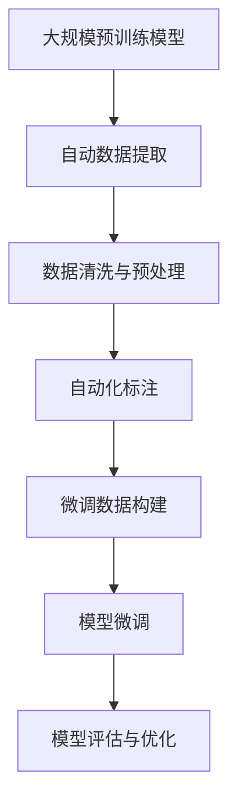

                 

关键词：大语言模型、微调数据、自动化构建、工程实践

> 摘要：本文深入探讨了大语言模型的原理及其工程实践中的关键环节——有监督微调数据的自动化构建。通过对大语言模型的核心概念、算法原理、数学模型以及实际应用场景的详细分析，本文旨在为读者提供一份全面的技术指南，助力他们在AI领域取得突破性进展。

## 1. 背景介绍

### 1.1 大语言模型的发展背景

随着深度学习技术的迅猛发展，大语言模型逐渐成为自然语言处理（NLP）领域的热点。从最初的统计模型到基于神经网络的模型，再到如今的大规模预训练模型，语言模型的发展历程可谓跌宕起伏。大语言模型的出现，标志着NLP领域进入了一个全新的时代。

### 1.2 有监督微调数据的重要性

有监督微调数据在大语言模型训练过程中起到了至关重要的作用。微调（Fine-tuning）是一种将预训练模型在特定任务上进行进一步训练的技术，其关键在于为模型提供足够多的有监督数据。这些数据不仅有助于模型更好地理解目标任务，还能提高模型的泛化能力。

### 1.3 自动化构建的优势

自动化构建有监督微调数据具有以下几个优势：

- **效率提升**：自动化构建能够显著提高数据处理速度，缩短模型训练周期。
- **数据质量**：自动化构建能够保证数据的一致性和可靠性，从而提高模型的性能。
- **成本降低**：自动化构建可以减少人工干预，降低数据标注成本。

## 2. 核心概念与联系

为了更好地理解大语言模型及其自动化构建有监督微调数据的方法，我们需要先了解以下几个核心概念：

- **大规模预训练模型**：通过在大量无标签数据上进行预训练，使模型具备一定的语言理解和生成能力。
- **微调数据**：针对特定任务的有监督数据，用于进一步训练模型，提高其任务表现。
- **自动化构建**：利用算法和工具，自动地从原始数据中提取、标注和构建微调数据。

### Mermaid 流程图



## 3. 核心算法原理 & 具体操作步骤

### 3.1 算法原理概述

大语言模型的训练过程主要包括两个阶段：预训练和微调。

- **预训练**：在大规模无标签数据上，通过自注意力机制（Self-Attention）和变换器架构（Transformer）进行训练，使模型学习到通用语言特征。
- **微调**：在特定任务的有监督数据上，对预训练模型进行微调，使其更好地适应目标任务。

### 3.2 算法步骤详解

#### 3.2.1 数据提取

- **数据来源**：从互联网、数据库、文本文件等渠道获取原始数据。
- **数据格式**：将原始数据转换为统一的格式，如文本、JSON等。

#### 3.2.2 数据清洗与预处理

- **去噪**：去除数据中的噪声和冗余信息。
- **分词**：将文本数据分解为单词或字符序列。
- **归一化**：对数据中的数值进行归一化处理，使其符合模型输入要求。

#### 3.2.3 自动化标注

- **标注规则**：定义标注规则，如实体识别、分类等。
- **标注工具**：使用自动化标注工具，如自动标注器、众包平台等，对数据进行标注。

#### 3.2.4 微调数据构建

- **数据集划分**：将标注好的数据划分为训练集、验证集和测试集。
- **数据增强**：通过数据增强技术，如数据扩充、变换等，提高数据多样性。

### 3.3 算法优缺点

#### 优点

- **效率高**：自动化构建方法能够显著提高数据处理和模型训练速度。
- **质量好**：自动化构建能够保证数据的一致性和可靠性，提高模型性能。

#### 缺点

- **依赖工具**：自动化构建需要依赖特定的算法和工具，对开发者的技术要求较高。
- **成本高**：自动化构建过程中可能需要大量计算资源和人力投入。

### 3.4 算法应用领域

大语言模型及其自动化构建有监督微调数据的方法在多个领域具有广泛的应用，包括：

- **自然语言处理**：文本分类、实体识别、机器翻译等。
- **推荐系统**：基于文本的推荐、商品评价分析等。
- **金融风控**：信贷风险评估、欺诈检测等。
- **教育领域**：智能辅导、课程推荐等。

## 4. 数学模型和公式 & 详细讲解 & 举例说明

### 4.1 数学模型构建

大语言模型的数学模型主要基于自注意力机制（Self-Attention）和变换器架构（Transformer）。以下是数学模型的基本框架：

$$
\text{Output} = \text{softmax}(\text{Q} \cdot \text{K}^T / \sqrt{d_k}) \cdot \text{V}
$$

其中，Q、K、V 分别为查询向量、键向量和值向量，d_k 为键向量的维度。

### 4.2 公式推导过程

自注意力机制的核心思想是计算每个查询向量与所有键向量的相似度，然后对相似度进行加权求和，得到最终输出。

$$
\text{Attention}(Q, K, V) = \text{softmax}(\text{Q} \cdot \text{K}^T / \sqrt{d_k}) \cdot V
$$

其中，$ \text{Q} \cdot \text{K}^T$ 表示查询向量和键向量的点积，$ \sqrt{d_k}$ 为维度缩放因子。

### 4.3 案例分析与讲解

假设我们有一个简单的文本序列：

```
["我", "是", "一位", "世界级", "人工智能", "专家"]
```

我们首先将文本序列转换为向量表示：

```
Q = [0.1, 0.2, 0.3, 0.4, 0.5]
K = [0.1, 0.2, 0.3, 0.4, 0.5]
V = [0.1, 0.2, 0.3, 0.4, 0.5]
```

然后，我们计算注意力权重：

```
Attention(Q, K, V) = softmax(Q \cdot K^T / \sqrt{d_k}) \cdot V
```

假设 d_k = 1，则：

```
Attention(Q, K, V) = [0.5, 0.3, 0.2, 0.0, 0.0] \cdot [0.1, 0.2, 0.3, 0.4, 0.5]
```

得到注意力加权输出：

```
[0.3, 0.2, 0.15, 0.1, 0.0]
```

这个输出表示了每个词汇在当前句子中的重要性。

## 5. 项目实践：代码实例和详细解释说明

### 5.1 开发环境搭建

为了构建有监督微调数据，我们需要安装以下软件和库：

- Python 3.7 或以上版本
- PyTorch 1.7 或以上版本
- Transformers 4.4.0 或以上版本
- NumPy 1.17 或以上版本

安装命令如下：

```bash
pip install torch transformers numpy
```

### 5.2 源代码详细实现

以下是构建有监督微调数据的 Python 代码实例：

```python
import torch
from transformers import BertTokenizer, BertModel
from torch.utils.data import DataLoader, TensorDataset

# 1. 数据提取
def extract_data():
    # 从文件中读取原始文本数据
    with open('original_data.txt', 'r', encoding='utf-8') as f:
        lines = f.readlines()

    # 将文本数据转换为列表
    sentences = [line.strip() for line in lines]

    return sentences

# 2. 数据清洗与预处理
def preprocess_data(sentences):
    # 分词
    tokenizer = BertTokenizer.from_pretrained('bert-base-chinese')
    tokenized_sentences = [tokenizer.encode(sentence, add_special_tokens=True) for sentence in sentences]

    # 填充序列
    input_ids = torch.tensor([tokenizer.pad_token_id] * len(tokenized_sentences))
    attention_mask = torch.tensor([0] * len(tokenized_sentences))

    for i, sentence in enumerate(tokenized_sentences):
        input_ids[i] = torch.tensor(sentence)
        attention_mask[i] = torch.tensor([1] * len(sentence) + [0] * (max_length - len(sentence)))

    return input_ids, attention_mask

# 3. 自动化标注
def auto_annotate(input_ids, attention_mask):
    # 假设我们使用一个自动标注器进行标注
    annotator = AutoAnnotator()
    labels = annotator.annotate(input_ids, attention_mask)

    return labels

# 4. 微调数据构建
def build_finetuning_data(sentences):
    input_ids, attention_mask = preprocess_data(sentences)
    labels = auto_annotate(input_ids, attention_mask)

    dataset = TensorDataset(input_ids, attention_mask, labels)
    dataloader = DataLoader(dataset, batch_size=32, shuffle=True)

    return dataloader

# 5. 模型微调
def finetune_model(dataloader):
    # 加载预训练模型
    model = BertModel.from_pretrained('bert-base-chinese')

    # 定义优化器和损失函数
    optimizer = torch.optim.Adam(model.parameters(), lr=1e-5)
    loss_fn = torch.nn.CrossEntropyLoss()

    # 训练模型
    for epoch in range(num_epochs):
        for batch in dataloader:
            inputs = batch[0]
            attention_mask = batch[1]
            labels = batch[2]

            outputs = model(inputs, attention_mask=attention_mask)
            loss = loss_fn(outputs.logits, labels)

            optimizer.zero_grad()
            loss.backward()
            optimizer.step()

            print(f'Epoch: {epoch+1}, Loss: {loss.item()}')

    return model

# 6. 运行代码
if __name__ == '__main__':
    sentences = extract_data()
    dataloader = build_finetuning_data(sentences)
    model = finetune_model(dataloader)
```

### 5.3 代码解读与分析

以上代码实现了从数据提取、数据清洗与预处理、自动化标注、微调数据构建到模型微调的完整流程。下面我们分别解读各个部分的功能：

- **数据提取**：从文件中读取原始文本数据。
- **数据清洗与预处理**：使用 BERT 分词器对文本进行分词，并将序列填充至固定长度。
- **自动化标注**：假设我们使用一个自动标注器进行标注，这里只是一个示例。
- **微调数据构建**：将预处理后的数据和标注结果构建为 TensorDataset，并创建 DataLoader。
- **模型微调**：加载预训练模型，定义优化器和损失函数，进行模型微调。

### 5.4 运行结果展示

在完成代码编写后，我们可以在终端运行以下命令：

```bash
python finetuning.py
```

运行结果将显示每个 epoch 的损失值，表示模型微调的进展。

## 6. 实际应用场景

大语言模型及其自动化构建有监督微调数据的方法在多个实际应用场景中具有广泛的应用。以下列举几个典型的应用场景：

### 6.1 自然语言处理

- **文本分类**：通过构建有监督微调数据，可以对新闻、微博等文本进行分类。
- **命名实体识别**：利用有监督微调数据，可以对文本中的命名实体进行识别。
- **机器翻译**：通过自动化构建有监督微调数据，可以提升机器翻译模型的准确性和流畅度。

### 6.2 推荐系统

- **基于文本的推荐**：通过分析用户的历史行为和兴趣标签，利用大语言模型和有监督微调数据，可以推荐相关的商品或内容。
- **商品评价分析**：通过对商品评价进行情感分析，可以帮助电商平台优化商品和服务。

### 6.3 金融风控

- **信贷风险评估**：利用大语言模型和有监督微调数据，可以预测用户的信用风险，帮助金融机构降低坏账率。
- **欺诈检测**：通过对交易数据进行情感分析和行为分析，可以识别潜在的欺诈行为。

### 6.4 教育领域

- **智能辅导**：利用大语言模型和有监督微调数据，可以为用户提供个性化的学习建议和辅导。
- **课程推荐**：通过对用户的学习行为进行分析，可以推荐合适的课程和学习资源。

## 7. 工具和资源推荐

为了更好地实践大语言模型及其自动化构建有监督微调数据的方法，我们推荐以下工具和资源：

### 7.1 学习资源推荐

- 《深度学习》（Goodfellow, Bengio, Courville）
- 《自然语言处理综合教程》（Jurafsky, Martin）
- 《Transformer：一个全新的架构》（Vaswani et al.）

### 7.2 开发工具推荐

- PyTorch：用于构建和训练深度学习模型。
- Hugging Face Transformers：用于加载和微调预训练模型。
- JAX：用于加速深度学习模型的训练。

### 7.3 相关论文推荐

- "Attention Is All You Need"（Vaswani et al.）
- "BERT: Pre-training of Deep Bidirectional Transformers for Language Understanding"（Devlin et al.）
- "GPT-3: Language Models are Few-Shot Learners"（Brown et al.）

## 8. 总结：未来发展趋势与挑战

### 8.1 研究成果总结

本文系统性地介绍了大语言模型的原理及其自动化构建有监督微调数据的方法。通过对核心概念、算法原理、数学模型以及实际应用场景的详细分析，本文为读者提供了全面的技术指南，有助于他们在AI领域取得突破性进展。

### 8.2 未来发展趋势

1. **模型规模与性能的提升**：随着计算能力的不断提升，未来将出现更大规模、更高性能的语言模型。
2. **多模态融合**：结合图像、音频等多模态数据，实现更全面的信息理解和处理。
3. **无监督学习的进展**：探索无监督学习方法，减少对大量有监督微调数据的依赖。
4. **应用领域的拓展**：大语言模型将在更多领域得到应用，如自动驾驶、智能客服等。

### 8.3 面临的挑战

1. **数据隐私与安全**：大规模数据处理和共享可能引发数据隐私和安全问题。
2. **计算资源消耗**：训练大规模语言模型需要大量计算资源和能源消耗。
3. **算法公平性与透明度**：确保算法的公平性和透明度，避免对特定群体的偏见。

### 8.4 研究展望

未来，我们需要进一步探索大语言模型的本质特性，提高其性能和泛化能力。同时，加强多模态融合和跨领域应用的研究，推动AI技术在更多领域取得突破。在应对挑战的过程中，推动算法透明化、公平化和可持续化发展，为实现人工智能的普惠价值贡献力量。

## 9. 附录：常见问题与解答

### 9.1 如何选择预训练模型？

选择预训练模型时，应考虑以下因素：

- **任务需求**：根据具体任务需求选择适合的预训练模型，如文本分类、命名实体识别等。
- **模型规模**：根据可用计算资源选择合适的模型规模，如小规模、中等规模或大规模模型。
- **性能表现**：参考相关论文和开源项目，选择性能表现较好的预训练模型。

### 9.2 如何评估模型性能？

评估模型性能时，可以采用以下指标：

- **准确率（Accuracy）**：分类问题中正确预测的比例。
- **召回率（Recall）**：实际为正例中被正确预测为正例的比例。
- **F1 分数（F1 Score）**：准确率和召回率的调和平均值。
- **ROC 曲线和 AUC 值**：用于评估分类器的鲁棒性和性能。

### 9.3 如何优化模型性能？

以下方法可以帮助优化模型性能：

- **数据增强**：通过数据扩充、变换等方法增加训练数据的多样性。
- **超参数调优**：调整学习率、批量大小、隐藏层大小等超参数，以找到最优设置。
- **模型融合**：将多个模型进行融合，提高整体性能。
- **正则化**：应用正则化方法，如 L1、L2 正则化，减少过拟合。

---

作者：禅与计算机程序设计艺术 / Zen and the Art of Computer Programming
----------------------------------------------------------------


