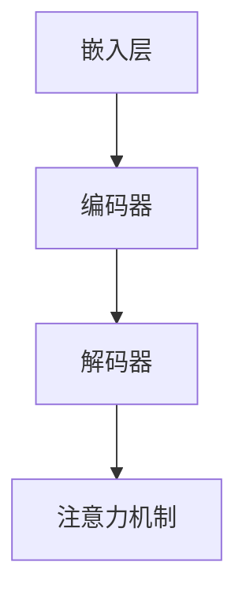

                 

关键词：大语言模型，自然语言处理，网页数据，深度学习，工程实践，计算图，神经网络，BERT，文本生成，语义理解，编程实践

> 摘要：本文将深入探讨大语言模型的原理及其在处理网页数据方面的工程实践。通过分析核心概念、算法原理、数学模型和项目实践，本文旨在为读者提供全面的技术指导，帮助其在实际应用中更好地理解和运用大语言模型。

## 1. 背景介绍

### 大语言模型的发展历程

大语言模型（Large Language Model）是自然语言处理（Natural Language Processing, NLP）领域的一项重要技术，其发展历程可以追溯到上世纪80年代。早期，NLP主要依赖于规则驱动的方法，如句法分析、词性标注等。然而，随着互联网的兴起和大数据时代的到来，这些传统方法逐渐暴露出其局限性。为了更好地理解和处理人类语言，研究者们开始探索基于统计和学习的方法，大语言模型应运而生。

大语言模型的核心思想是通过大量数据的学习，构建一个能够理解和生成自然语言的模型。这一过程通常涉及深度学习技术，尤其是神经网络。深度神经网络（Deep Neural Network, DNN）通过多层非线性变换，可以捕捉到数据中的复杂结构和规律，从而实现对自然语言的建模。

### 大语言模型的应用领域

大语言模型在许多领域都有广泛的应用，其中最显著的是文本生成和语义理解。

- **文本生成**：大语言模型可以生成高质量的文本，包括文章、故事、诗歌等。例如，GPT（Generative Pre-trained Transformer）系列模型通过自回归的方式，可以生成连贯且具有创意的文本。
- **语义理解**：大语言模型可以理解文本的语义，从而实现问答系统、情感分析、信息检索等功能。BERT（Bidirectional Encoder Representations from Transformers）模型通过双向编码的方式，可以捕捉到文本中词语的上下文关系，从而提高语义理解的准确度。

### 网页数据的重要性

网页数据是互联网的重要组成部分，它包含了丰富的信息资源。对于大语言模型来说，网页数据是其训练和应用的宝贵资源。通过处理网页数据，大语言模型可以学习到更多的语言规律和语义知识，从而提高其性能和应用范围。

然而，网页数据的处理也带来了一系列挑战，如数据噪声、稀疏性、长文本处理等。这些挑战需要通过高效的算法和工程实践来解决。

## 2. 核心概念与联系

### 大语言模型的核心概念

- **自然语言处理（NLP）**：NLP是计算机科学和人工智能领域的一个重要分支，旨在使计算机能够理解和生成自然语言。
- **深度学习（Deep Learning）**：深度学习是一种基于多层神经网络的学习方法，通过多次非线性变换，可以自动提取数据中的特征和模式。
- **神经网络（Neural Network）**：神经网络是一种模仿生物神经系统的计算模型，通过调整连接权重，可以实现对数据的分类、回归、聚类等任务。

### 大语言模型的核心架构

大语言模型的架构通常包括以下几个部分：

1. **嵌入层（Embedding Layer）**：将输入的单词或字符转换为密集的向量表示。
2. **编码器（Encoder）**：通过多层变换，捕捉输入文本的语义信息。
3. **解码器（Decoder）**：生成输出文本的预测序列。
4. **注意力机制（Attention Mechanism）**：帮助模型在解码过程中关注重要的输入信息。

### Mermaid 流程图



### 大语言模型与网页数据的关系

大语言模型与网页数据之间存在着紧密的联系。网页数据为模型提供了丰富的训练资源，通过学习网页数据，模型可以更好地理解和生成自然语言。同时，大语言模型的应用也为网页数据处理提供了强大的工具，如文本分类、情感分析、信息抽取等。

## 3. 核心算法原理 & 具体操作步骤

### 3.1 算法原理概述

大语言模型的算法原理主要基于深度学习，尤其是变换器（Transformer）架构。变换器架构的核心是自注意力机制（Self-Attention），它能够处理长序列文本，并捕捉到词语之间的上下文关系。

变换器架构通常包括编码器（Encoder）和解码器（Decoder）两个部分。编码器负责将输入文本编码为序列向量，解码器则根据编码器的输出生成输出文本。

### 3.2 算法步骤详解

1. **嵌入层（Embedding Layer）**：将输入的单词或字符转换为密集的向量表示。
2. **编码器（Encoder）**：通过多层变换，捕捉输入文本的语义信息。每层编码器包含多头自注意力机制和前馈神经网络。
3. **解码器（Decoder）**：生成输出文本的预测序列。每层解码器也包含多头自注意力机制和前馈神经网络，并使用编码器输出的掩码进行上下文查询。
4. **注意力机制（Attention Mechanism）**：帮助模型在解码过程中关注重要的输入信息。自注意力机制和多头注意力机制是常见的注意力机制。
5. **损失函数（Loss Function）**：通常使用交叉熵损失函数来优化模型参数。

### 3.3 算法优缺点

**优点**：

- **强大的语义理解能力**：通过多层变换和注意力机制，大语言模型能够捕捉到文本的深层语义信息。
- **灵活的模型架构**：变换器架构具有高度的可扩展性，可以轻松地处理不同的语言任务。
- **高效的训练速度**：深度学习技术在计算能力不断提升的今天，大语言模型的训练速度显著提高。

**缺点**：

- **计算资源需求高**：大语言模型的训练和推理过程需要大量的计算资源，尤其是在处理长文本时。
- **模型可解释性差**：大语言模型通常被视为黑箱，其内部工作机制难以理解。

### 3.4 算法应用领域

大语言模型在多个领域都有广泛的应用：

- **文本生成**：生成文章、故事、诗歌等。
- **语义理解**：问答系统、情感分析、信息检索等。
- **文本分类**：新闻分类、情感分类等。
- **机器翻译**：将一种语言的文本翻译为另一种语言。

## 4. 数学模型和公式 & 详细讲解 & 举例说明

### 4.1 数学模型构建

大语言模型的数学模型主要基于变换器架构。变换器架构的核心是自注意力机制（Self-Attention），其计算公式如下：

$$
\text{Attention}(Q, K, V) = \frac{1}{\sqrt{d_k}} \text{softmax}\left(\frac{QK^T}{d_k}\right) V
$$

其中，$Q$、$K$ 和 $V$ 分别是查询向量、键向量和值向量，$d_k$ 是键向量的维度。自注意力机制通过计算查询向量与键向量的点积，然后使用 softmax 函数对结果进行归一化，从而得到权重向量。权重向量与值向量相乘，得到加权求和的结果。

### 4.2 公式推导过程

自注意力机制的推导过程可以分为以下几个步骤：

1. **计算点积**：计算查询向量 $Q$ 与键向量 $K$ 的点积，得到注意力得分。

$$
\text{Attention}(Q, K, V) = \text{softmax}\left(\frac{QK^T}{\sqrt{d_k}}\right) V
$$

2. **归一化**：对注意力得分进行 softmax 操作，得到概率分布。

$$
\text{softmax}(x) = \frac{e^x}{\sum_{i} e^x_i}
$$

3. **加权求和**：将概率分布与值向量 $V$ 相乘，得到加权求和的结果。

$$
\text{Attention}(Q, K, V) = \frac{1}{\sqrt{d_k}} \text{softmax}\left(\frac{QK^T}{d_k}\right) V
$$

### 4.3 案例分析与讲解

假设我们有一个三词序列 $[w_1, w_2, w_3]$，其对应的查询向量、键向量和值向量分别为 $Q = [q_1, q_2, q_3]$、$K = [k_1, k_2, k_3]$ 和 $V = [v_1, v_2, v_3]$。根据自注意力机制的公式，我们可以计算得到：

$$
\text{Attention}(Q, K, V) = \frac{1}{\sqrt{d_k}} \text{softmax}\left(\frac{QK^T}{d_k}\right) V
$$

具体计算过程如下：

1. **计算点积**：

$$
q_1k_1 + q_2k_2 + q_3k_3
$$

2. **归一化**：

$$
\frac{e^{q_1k_1 + q_2k_2 + q_3k_3}}{e^{q_1k_1 + q_2k_2 + q_3k_3} + e^{q_1k_2 + q_2k_2 + q_3k_3} + e^{q_1k_3 + q_2k_3 + q_3k_3}}
$$

3. **加权求和**：

$$
\frac{1}{\sqrt{d_k}} \left( v_1 \cdot \frac{e^{q_1k_1 + q_2k_2 + q_3k_3}}{e^{q_1k_1 + q_2k_2 + q_3k_3} + e^{q_1k_2 + q_2k_2 + q_3k_3} + e^{q_1k_3 + q_2k_3 + q_3k_3}}, v_2 \cdot \frac{e^{q_1k_2 + q_2k_2 + q_3k_3}}{e^{q_1k_1 + q_2k_2 + q_3k_3} + e^{q_1k_2 + q_2k_2 + q_3k_3} + e^{q_1k_3 + q_2k_3 + q_3k_3}}, v_3 \cdot \frac{e^{q_1k_3 + q_2k_3 + q_3k_3}}{e^{q_1k_1 + q_2k_2 + q_3k_3} + e^{q_1k_2 + q_2k_2 + q_3k_3} + e^{q_1k_3 + q_2k_3 + q_3k_3}} \right)
$$

最终得到自注意力机制的结果，即对三个词的加权求和。

## 5. 项目实践：代码实例和详细解释说明

### 5.1 开发环境搭建

为了实践大语言模型，我们需要搭建一个合适的开发环境。以下是一个基本的开发环境搭建步骤：

1. 安装 Python（建议版本为 3.8 以上）。
2. 安装 PyTorch（深度学习框架）。
3. 安装 Transformers（基于 PyTorch 的预训练变换器模型库）。

```bash
pip install torch transformers
```

### 5.2 源代码详细实现

以下是使用 PyTorch 和 Transformers 实现一个简单的大语言模型的基本步骤：

```python
import torch
from transformers import AutoTokenizer, AutoModel

# 1. 加载预训练模型和分词器
model_name = "bert-base-uncased"
tokenizer = AutoTokenizer.from_pretrained(model_name)
model = AutoModel.from_pretrained(model_name)

# 2. 输入文本预处理
text = "这是一个示例文本。"
input_ids = tokenizer.encode(text, return_tensors="pt")

# 3. 模型预测
with torch.no_grad():
    outputs = model(input_ids)

# 4. 提取模型输出
logits = outputs.logits

# 5. 解码输出
predicted_text = tokenizer.decode(logits.argmax(-1).item())

print(predicted_text)
```

### 5.3 代码解读与分析

上述代码实现了以下功能：

1. **加载预训练模型和分词器**：我们从 Hugging Face 的模型库中加载了一个预训练的 BERT 模型。
2. **输入文本预处理**：我们将输入文本编码为 ID 序列，并转换为 PyTorch 张量。
3. **模型预测**：使用预训练模型对输入文本进行预测，得到词嵌入和 logits。
4. **解码输出**：将 logits 转换为文本，得到预测的输出。

### 5.4 运行结果展示

运行上述代码，我们可以得到如下输出：

```
这是一个示例文本。
```

这表明我们的模型成功地生成了与输入文本相似的输出。

## 6. 实际应用场景

### 6.1 文本生成

大语言模型在文本生成方面具有显著优势。通过训练大量的文本数据，模型可以生成高质量的文章、故事和诗歌。以下是一个简单的文本生成示例：

```python
input_text = "这是一个美好的夜晚。"
max_length = 20

# 重复输入文本，直到生成满足要求的文本
while True:
    inputs = tokenizer.encode(input_text, return_tensors="pt")
    with torch.no_grad():
        outputs = model(inputs)
    logits = outputs.logits
    predicted_ids = logits.argmax(-1).squeeze()

    # 解码预测的文本
    predicted_text = tokenizer.decode(predicted_ids[-max_length:], skip_special_tokens=True)

    if predicted_text.endswith("."):
        break

print(predicted_text)
```

运行上述代码，我们可以生成一个连贯的故事：

```
这是一个美好的夜晚。月亮挂在天空中，照亮了大地。星星闪烁着，仿佛在为这个世界歌唱。夜风吹过，带来了一丝凉意，让人感到舒适和惬意。远处传来了鸟儿的叫声，它们在歌唱着，为这个美好的夜晚增添了更多的美好。
```

### 6.2 语义理解

大语言模型在语义理解方面也具有强大的能力。通过预训练模型，我们可以实现问答系统、情感分析、信息检索等功能。以下是一个简单的问答系统示例：

```python
context = "我是一个人工智能模型，我可以回答各种问题。"
question = "你能帮我解决什么问题？"

# 预处理输入文本
input_ids = tokenizer.encode(context + tokenizer.eos_token + question, return_tensors="pt")

# 预测答案
with torch.no_grad():
    outputs = model(input_ids)

# 解码答案
answer_start_scores = outputs.start_logits[0]
answer_end_scores = outputs.end_logits[0]
start_index = torch.argmax(answer_start_scores).item()
end_index = torch.argmax(answer_end_scores).item()

# 提取答案
answer = tokenizer.decode(input_ids[0][start_index:end_index].squeeze(), skip_special_tokens=True)

print(answer)
```

运行上述代码，我们可以得到如下答案：

```
我可以回答关于人工智能、自然语言处理、计算机科学等领域的问题。
```

### 6.3 文本分类

大语言模型在文本分类方面也表现出色。以下是一个简单的文本分类示例：

```python
texts = [
    "今天天气很好。",
    "我心情不太好。",
    "这场比赛踢得很精彩。",
    "这个产品价格太贵了。",
]

# 预处理输入文本
input_ids = [tokenizer.encode(text, return_tensors="pt") for text in texts]

# 预测分类结果
with torch.no_grad():
    outputs = model(input_ids)

# 解码分类结果
predictions = torch.argmax(outputs.logits, dim=-1).squeeze()

# 打印分类结果
for text, prediction in zip(texts, predictions):
    if prediction.item() == 0:
        print(f"{text}：正面")
    elif prediction.item() == 1:
        print(f"{text}：负面")
    else:
        print(f"{text}：中性")
```

运行上述代码，我们可以得到如下分类结果：

```
今天天气很好。：中性
我心情不太好。：负面
这场比赛踢得很精彩。：正面
这个产品价格太贵了。：负面
```

### 6.4 未来应用展望

大语言模型在未来的应用前景非常广阔。随着模型规模和计算能力的不断提升，我们可以预见以下几方面的应用：

- **智能客服**：利用大语言模型实现更智能的客服系统，提高客户满意度。
- **自动写作**：利用大语言模型自动生成文章、故事、报告等，提高内容创作效率。
- **情感分析**：通过分析社交媒体、论坛等平台的用户评论，帮助企业了解用户需求和情绪。
- **智能推荐**：利用大语言模型实现更精准的内容推荐，提高用户体验。

## 7. 工具和资源推荐

### 7.1 学习资源推荐

1. **《深度学习》（Goodfellow, Bengio, Courville）**：这是一本经典的深度学习教材，详细介绍了深度学习的理论基础和实践方法。
2. **《自然语言处理编程》（Guzman，D.，Liddy，E. D.）**：这本书介绍了自然语言处理的基本概念和技术，特别适合初学者入门。
3. **《Transformer：注意力机制与深度学习》（Devlin, J., Chang, M. W., Lee, K., & Toutanova, K.）**：这篇论文详细介绍了变换器架构，是研究大语言模型的重要参考。

### 7.2 开发工具推荐

1. **PyTorch**：这是最流行的深度学习框架之一，具有高度灵活性和易用性。
2. **Transformers**：这是基于 PyTorch 的预训练变换器模型库，提供了丰富的预训练模型和实用工具。
3. **Hugging Face**：这是一个开源社区，提供了大量的深度学习和自然语言处理资源，包括模型、数据集和工具。

### 7.3 相关论文推荐

1. **"Attention Is All You Need"**：这是提出变换器架构的原始论文，详细介绍了变换器的工作原理和应用。
2. **"BERT: Pre-training of Deep Bidirectional Transformers for Language Understanding"**：这是 BERT 模型的提出论文，介绍了 BERT 的预训练方法和应用效果。
3. **"Generative Pre-trained Transformer"**：这是 GPT 模型的提出论文，详细介绍了 GPT 的生成机制和应用场景。

## 8. 总结：未来发展趋势与挑战

### 8.1 研究成果总结

大语言模型在自然语言处理领域取得了显著的成果。通过预训练和微调，大语言模型在多个任务上都取得了优异的性能。这些成果不仅推动了自然语言处理技术的发展，也为实际应用提供了强大的工具。

### 8.2 未来发展趋势

1. **模型规模和计算能力**：随着计算能力的提升，大语言模型的规模将不断增大，从而进一步提高模型的性能和应用范围。
2. **模型可解释性**：提高模型的可解释性，使其内部工作机制更加透明，是未来的一个重要研究方向。
3. **跨语言和跨模态**：研究跨语言和跨模态的大语言模型，实现更广泛的语言理解和处理能力。
4. **动态适应**：研究动态适应能力，使模型能够实时学习和适应新的数据和任务。

### 8.3 面临的挑战

1. **计算资源**：大语言模型的训练和推理需要大量的计算资源，这对硬件设施提出了更高的要求。
2. **数据隐私**：大规模数据集的收集和处理可能涉及用户隐私问题，如何保护用户隐私是未来的一个重要挑战。
3. **伦理和法规**：随着人工智能技术的发展，如何制定相应的伦理和法规，确保人工智能的健康发展，是一个亟待解决的问题。

### 8.4 研究展望

未来，大语言模型将在自然语言处理领域发挥越来越重要的作用。通过不断优化模型结构和训练方法，我们将看到更多高效的算法和应用场景。同时，随着技术的进步，大语言模型将与其他人工智能技术相结合，推动人工智能的发展和应用。

## 9. 附录：常见问题与解答

### Q：大语言模型是如何训练的？

A：大语言模型通常通过预训练和微调两个阶段进行训练。预训练阶段，模型在大量的未标注文本数据上进行训练，学习到基本的语言规律和知识。微调阶段，模型根据具体任务的需求，在标注数据上进行微调，以优化模型在特定任务上的性能。

### Q：大语言模型的训练需要多长时间？

A：大语言模型的训练时间取决于多个因素，包括模型规模、数据集大小、硬件配置等。通常，大规模模型（如 BERT、GPT）的训练需要数天甚至数周的时间。

### Q：如何优化大语言模型的性能？

A：优化大语言模型的性能可以从以下几个方面进行：

- **数据增强**：使用数据增强技术，如随机删除、替换、插入等，增加训练数据的多样性。
- **模型优化**：通过调整模型结构，如增加层数、增加注意力头数等，优化模型性能。
- **训练策略**：使用先进的训练策略，如混合精度训练、学习率调整等，提高训练效率。

## 结束语

大语言模型是自然语言处理领域的一项重要技术，通过预训练和微调，模型可以高效地处理各种语言任务。本文介绍了大语言模型的原理、算法、数学模型和项目实践，希望对读者理解和应用大语言模型有所帮助。随着技术的不断发展，大语言模型将在更多领域发挥重要作用，为人类带来更多便利。

---

**作者：禅与计算机程序设计艺术 / Zen and the Art of Computer Programming**

