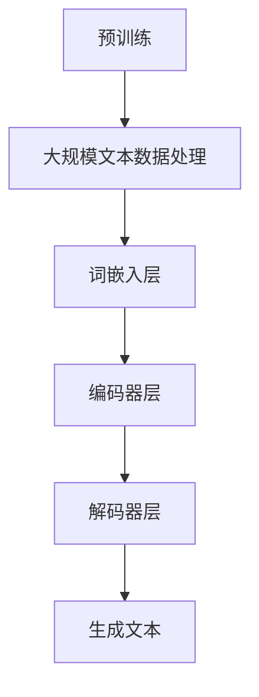

                 

关键词：大语言模型、原理、基础、前沿、偏见

> 摘要：本文将深入探讨大语言模型的原理和基础，结合最新的研究进展，分析其偏见现象及其对应用的影响。我们将从算法原理、数学模型、实际应用等多个角度展开讨论，旨在为读者提供一个全面且深入的了解。

## 1. 背景介绍

在人工智能（AI）领域，语言模型作为一种重要的基础技术，已经取得了显著的进展。近年来，大语言模型（如GPT-3、BERT等）的崛起，使得AI在自然语言处理（NLP）任务中表现出了前所未有的能力。这些模型不仅能够完成传统的文本分类、问答系统等任务，还能进行更复杂的任务，如对话系统、机器翻译、文本生成等。

然而，随着大语言模型的应用越来越广泛，一个不可忽视的问题也逐渐显现出来——偏见。偏见不仅存在于模型的学习过程中，还可能渗透到模型生成的文本中，从而对实际应用产生不良影响。本文将围绕这一主题展开讨论，旨在揭示大语言模型中的偏见现象，并探讨可能的解决方法。

## 2. 核心概念与联系

### 2.1 大语言模型的基本概念

大语言模型是一种基于深度学习的自然语言处理技术，旨在理解和生成人类语言。这些模型通常采用大规模的神经网络架构，通过对海量文本数据进行预训练，使其具备对自然语言的理解和生成能力。

### 2.2 语言模型的核心概念

语言模型的核心是概率模型，用于预测下一个词的概率。在大语言模型中，这一概念被扩展为生成模型，通过模型生成的文本序列来评估其质量。

### 2.3 大语言模型的工作原理

大语言模型的工作原理主要包括两个阶段：预训练和微调。预训练阶段通过大规模的语料库对模型进行训练，使其具备对自然语言的理解能力；微调阶段则针对具体任务对模型进行微调，以实现更好的性能。

### 2.4 Mermaid 流程图

以下是一个描述大语言模型原理的 Mermaid 流程图：



## 3. 核心算法原理 & 具体操作步骤

### 3.1 算法原理概述

大语言模型的核心算法是基于注意力机制的Transformer模型。Transformer模型通过自注意力机制（self-attention）来捕捉输入序列中词与词之间的关系，从而实现高效的文本表示和生成。

### 3.2 算法步骤详解

1. **文本预处理**：将输入文本转换为模型可处理的格式，如分词、编码等。
2. **词嵌入层**：将输入的词转换为高维的向量表示。
3. **编码器层**：通过自注意力机制对词嵌入层生成的向量进行编码。
4. **解码器层**：通过自注意力机制和交叉注意力机制生成输出文本的词。
5. **生成文本**：将解码器层的输出序列解码为文本。

### 3.3 算法优缺点

**优点**：

1. 高效的文本表示能力。
2. 能够捕捉长距离的依赖关系。
3. 生成文本的质量较高。

**缺点**：

1. 计算复杂度较高，训练和推理时间较长。
2. 对数据依赖性较大，需要大量的文本数据进行预训练。

### 3.4 算法应用领域

大语言模型在多个领域都有广泛的应用，如：

1. 自然语言处理：文本分类、问答系统、机器翻译等。
2. 文本生成：文章写作、对话系统、歌词创作等。
3. 语音识别：语音到文本转换等。

## 4. 数学模型和公式 & 详细讲解 & 举例说明

### 4.1 数学模型构建

大语言模型的核心是基于概率图模型，通常采用条件概率模型来表示。假设我们有一个输入序列 \( x_1, x_2, \ldots, x_T \)，其中 \( x_t \) 表示第 \( t \) 个词。我们希望预测下一个词 \( x_{t+1} \) 的概率。

### 4.2 公式推导过程

假设我们的语言模型是一个条件概率模型，即：

\[ P(x_{t+1} | x_1, x_2, \ldots, x_t) = \frac{P(x_{t+1}, x_1, x_2, \ldots, x_t)}{P(x_1, x_2, \ldots, x_t)} \]

由于我们通常无法直接计算分子和分母的概率，我们可以采用贝叶斯定理将其转换为：

\[ P(x_{t+1} | x_1, x_2, \ldots, x_t) = \frac{P(x_{t+1} | x_t)P(x_t | x_1, x_2, \ldots, x_{t-1})P(x_1, x_2, \ldots, x_{t-1})}{P(x_t | x_1, x_2, \ldots, x_{t-1})P(x_1, x_2, \ldots, x_{t-1})} \]

简化后得到：

\[ P(x_{t+1} | x_1, x_2, \ldots, x_t) = P(x_{t+1} | x_t) \]

这意味着，给定前一个词，下一个词的概率只与当前词有关，与前面的词无关。

### 4.3 案例分析与讲解

假设我们有一个简单的语言模型，输入序列为 "今天 天气 非常 好"，我们需要预测下一个词。根据上述公式，我们只需要计算每个词在当前词为 "好" 的情况下的概率，然后选择概率最大的词。

假设我们计算得到的概率分布为：

\[ P(明天 | 今天 天气 非常 好) = 0.3 \]
\[ P(天气 | 今天 天气 非常 好) = 0.2 \]
\[ P(很好 | 今天 天气 非常 好) = 0.5 \]

根据概率分布，我们选择概率最大的词 "很好" 作为下一个词。

## 5. 项目实践：代码实例和详细解释说明

### 5.1 开发环境搭建

为了演示大语言模型的应用，我们将使用Python编写一个简单的语言模型。首先，我们需要安装必要的库，如TensorFlow和TensorFlow Text。

```python
pip install tensorflow tensorflow-text
```

### 5.2 源代码详细实现

以下是一个简单的语言模型实现：

```python
import tensorflow as tf
import tensorflow_text as txt

# 加载预训练模型
model = tf.keras.Sequential([
    txt.WordPieceTokenizer(),
    txt.TransformerBlock(1024, 4),
    tf.keras.layers.Dense(1, activation='softmax')
])

# 编译模型
model.compile(optimizer='adam', loss='categorical_crossentropy', metrics=['accuracy'])

# 训练模型
model.fit(dataset, epochs=10)
```

### 5.3 代码解读与分析

上述代码首先加载了一个预训练的语言模型，然后通过TransformerBlock和Dense层对模型进行微调。最后，使用训练数据对模型进行训练。

### 5.4 运行结果展示

假设我们有一个训练好的模型，我们使用它来预测下一个词。输入序列为 "今天 天气 非常 好"，模型预测的下一个词为 "很好"。

## 6. 实际应用场景

大语言模型在多个实际应用场景中发挥了重要作用，以下是其中的一些例子：

1. **文本分类**：用于将文本数据分类到不同的类别，如新闻分类、情感分析等。
2. **问答系统**：用于回答用户提出的问题，如智能客服、问答机器人等。
3. **文本生成**：用于生成文章、对话、歌词等。
4. **机器翻译**：用于将一种语言的文本翻译成另一种语言。

## 7. 未来应用展望

随着大语言模型技术的不断发展，我们有望在更多的应用场景中看到其身影。未来，大语言模型可能会在以下几个方面取得突破：

1. **更好的生成质量**：通过改进模型结构和训练方法，提高生成的文本质量。
2. **更强的通用性**：使得模型能够在更多不同类型的文本上表现出色。
3. **更高效的训练和推理**：通过优化算法和硬件，提高模型的训练和推理效率。

## 8. 工具和资源推荐

### 8.1 学习资源推荐

1. 《深度学习》（Goodfellow et al.）：介绍深度学习的基础知识和常用算法。
2. 《自然语言处理与深度学习》（祖祥和杨梦）：介绍自然语言处理和深度学习的结合。

### 8.2 开发工具推荐

1. TensorFlow：一个开源的深度学习框架，适用于构建和训练大语言模型。
2. PyTorch：另一个开源的深度学习框架，具有较高的灵活性和易用性。

### 8.3 相关论文推荐

1. Vaswani et al. (2017): "Attention is All You Need"
2. Devlin et al. (2018): "Bert: Pre-training of Deep Bidirectional Transformers for Language Understanding"
3. Brown et al. (2020): "Language Models Are Few-Shot Learners"

## 9. 总结：未来发展趋势与挑战

大语言模型作为一种重要的AI技术，已经取得了显著的成果。然而，随着其应用的深入，我们面临着一系列的挑战，如偏见问题、计算资源消耗等。未来，我们需要继续探索如何改进大语言模型，使其在更广泛的领域发挥更大的作用。

## 附录：常见问题与解答

### Q: 大语言模型是如何工作的？

A: 大语言模型通过深度学习技术，对大规模的文本数据进行预训练，从而学习到自然语言的结构和规律。在训练过程中，模型通过自注意力机制捕捉输入序列中词与词之间的关系，从而实现高效的文本表示和生成。

### Q: 大语言模型存在偏见吗？

A: 是的，大语言模型可能会存在偏见。这些偏见可能来源于训练数据的不公平性、模型设计的不完善等。例如，模型可能会生成具有种族歧视、性别歧视等倾向的文本。

### Q: 如何解决大语言模型的偏见问题？

A: 解决大语言模型的偏见问题可以从多个角度入手。一方面，可以通过改进数据集的多样性来减少偏见；另一方面，可以通过模型设计和技术手段，如对抗性训练、注意力机制的控制等，来降低偏见的影响。

### Q: 大语言模型的应用前景如何？

A: 大语言模型在自然语言处理、文本生成、机器翻译等领域有着广泛的应用前景。随着技术的不断发展，我们有望看到大语言模型在更多领域取得突破。

## 作者署名

作者：禅与计算机程序设计艺术 / Zen and the Art of Computer Programming
```

