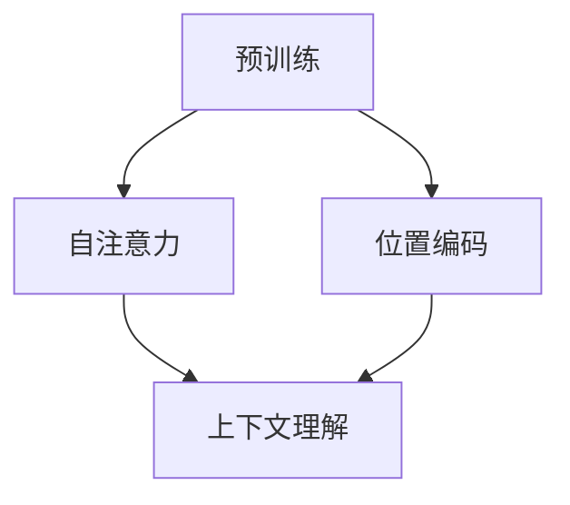

                 

关键词：大语言模型、自然语言处理、深度学习、预训练、具身化、应用场景、发展趋势、挑战

> 摘要：本文将深入探讨大语言模型的原理、基础与前沿技术，包括其发展历程、核心概念、算法原理、数学模型以及实际应用场景。同时，本文还将讨论大语言模型的具身化与落地过程，以及未来可能面临的挑战和发展趋势。通过本文的阅读，读者将能够全面了解大语言模型的基本原理和应用，为未来的研究和实践提供指导。

## 1. 背景介绍

随着互联网和大数据技术的迅猛发展，自然语言处理（Natural Language Processing，NLP）已经成为人工智能领域的一个重要分支。NLP的目标是使计算机能够理解和生成自然语言，从而实现人机交互的自动化。在这个过程中，语言模型起到了至关重要的作用。

语言模型是自然语言处理的核心，它通过统计语言中的概率分布来预测下一个单词或句子。传统的语言模型大多基于统计方法，如N-gram模型、隐马尔可夫模型（HMM）等。然而，这些方法在面对复杂的自然语言现象时显得力不从心。

随着深度学习技术的崛起，神经网络语言模型逐渐成为研究热点。2018年，Google提出的Transformer模型彻底颠覆了传统的序列模型，使得大语言模型的研究进入了一个全新的阶段。Transformer模型引入了自注意力机制（Self-Attention），能够更加灵活地捕捉句子中的长距离依赖关系，从而显著提升了语言模型的性能。

大语言模型（Large Language Model）是指在训练阶段使用海量数据进行预训练，从而具备强大语言理解和生成能力的模型。随着计算资源和数据规模的不断提升，大语言模型的研究和应用越来越受到关注。

## 2. 核心概念与联系

在深入探讨大语言模型的原理之前，我们需要了解一些核心概念和它们之间的联系。以下是几个关键概念及其之间的关系：

### 2.1 预训练（Pre-training）

预训练是指在大规模数据集上对模型进行初步训练，以便其能够获得一些通用语言知识。预训练通常分为两个阶段：第一阶段是使用大量无监督数据对模型进行训练，使其具备基础的语言理解能力；第二阶段是使用有监督数据对模型进行微调，以适应特定任务。

### 2.2 自注意力（Self-Attention）

自注意力是一种计算序列中各个元素之间关系的方法。在Transformer模型中，自注意力机制被用来计算输入序列的表示。通过自注意力，模型能够捕捉到序列中长距离的依赖关系，从而提升语言理解的准确性。

### 2.3 位置编码（Positional Encoding）

由于Transformer模型中没有循环结构，因此无法直接处理序列中的位置信息。为了解决这个问题，引入了位置编码。位置编码为每个单词赋予了一个与位置相关的向量，从而帮助模型理解单词在序列中的位置关系。

### 2.4 上下文理解（Contextual Understanding）

上下文理解是指模型能够根据不同的上下文环境生成相应的输出。与大语言模型相比，传统语言模型往往只能根据固定规则生成输出，而无法根据上下文进行自适应调整。大语言模型通过预训练阶段获得了丰富的语言知识，从而能够更好地理解上下文。

下面是一个Mermaid流程图，展示了这些核心概念之间的联系：



## 3. 核心算法原理 & 具体操作步骤

### 3.1 算法原理概述

大语言模型的核心是基于自注意力机制的Transformer模型。Transformer模型由多个编码器和解码器层组成，每一层都包含多头自注意力机制和前馈神经网络。在训练过程中，模型首先通过无监督预训练学习到语言的内在规律，然后通过有监督微调来适应特定任务。

### 3.2 算法步骤详解

#### 3.2.1 预训练阶段

1. 数据集准备：选择一个大规模文本数据集，如维基百科、新闻文章、社交媒体帖子等。
2. 词向量化：将文本数据中的每个单词映射为一个向量表示，通常使用Word2Vec、GloVe等方法。
3. 构建模型：搭建一个基于Transformer的预训练模型，包括编码器和解码器。
4. 无监督训练：在无监督数据集上对模型进行训练，优化模型参数。

#### 3.2.2 微调阶段

1. 数据集准备：选择一个有监督数据集，如问答数据集、文本分类数据集等。
2. 模型初始化：使用预训练阶段训练好的模型作为初始化。
3. 有监督训练：在有监督数据集上对模型进行微调，优化模型参数，使其适应特定任务。

### 3.3 算法优缺点

#### 优点：

1. 强大的语言理解能力：通过预训练阶段，模型能够学习到丰富的语言知识，从而在自然语言处理任务中表现出色。
2. 适应性强：Transformer模型具有强大的上下文理解能力，能够根据不同的上下文环境生成相应的输出。
3. 高效：自注意力机制使得模型在处理长序列时具有很高的效率。

#### 缺点：

1. 计算资源需求高：预训练阶段需要大量计算资源和时间。
2. 数据依赖性强：模型的性能高度依赖于数据集的质量和规模。

### 3.4 算法应用领域

大语言模型在自然语言处理领域具有广泛的应用，包括但不限于以下方面：

1. 机器翻译：利用大语言模型进行高质量的双语翻译。
2. 文本分类：对大量文本数据进行分类，如情感分析、新闻分类等。
3. 问答系统：构建基于大语言模型的问答系统，实现智能对话。
4. 生成文本：利用大语言模型生成文章、故事、诗歌等。

## 4. 数学模型和公式 & 详细讲解 & 举例说明

### 4.1 数学模型构建

大语言模型的核心是Transformer模型，它由编码器和解码器组成。以下是一个简化的数学模型描述：

#### 编码器（Encoder）

编码器由多个编码器层组成，每一层包含两个主要组件：多头自注意力机制和前馈神经网络。

1. **多头自注意力机制（Multi-Head Self-Attention）**

   自注意力机制是一种计算序列中各个元素之间关系的方法。多头自注意力机制则是在自注意力机制的基础上引入了多个“头”，从而能够同时捕捉到不同类型的依赖关系。

   公式表示：

   $$ 
   \text{Attention}(Q, K, V) = \text{softmax}\left(\frac{QK^T}{\sqrt{d_k}}\right)V 
   $$

   其中，$Q$、$K$ 和 $V$ 分别代表查询向量、键向量和值向量，$d_k$ 是键向量的维度。

2. **前馈神经网络（Feedforward Neural Network）**

   前馈神经网络是一种简单的全连接神经网络，用于对自注意力机制的输出进行进一步处理。

   公式表示：

   $$ 
   \text{FFN}(x) = \max(0, xW_1 + b_1)W_2 + b_2 
   $$

   其中，$W_1$ 和 $W_2$ 分别是权重矩阵，$b_1$ 和 $b_2$ 是偏置项。

#### 解码器（Decoder）

解码器由多个解码器层组成，每一层包含三个主要组件：掩码多头自注意力机制、自注意力机制和前馈神经网络。

1. **掩码多头自注意力机制（Masked Multi-Head Self-Attention）**

   掩码多头自注意力机制是一种在训练阶段引入掩码（Mask）的自注意力机制，用于强制模型学习序列中的长距离依赖关系。

   公式表示与编码器中的多头自注意力机制相同。

2. **自注意力机制（Self-Attention）**

   自注意力机制用于解码器中的每个位置，以获取上下文信息。

   公式表示与编码器中的自注意力机制相同。

3. **前馈神经网络（Feedforward Neural Network）**

   前馈神经网络用于对自注意力机制的输出进行进一步处理。

   公式表示与编码器中的前馈神经网络相同。

### 4.2 公式推导过程

这里简要介绍Transformer模型的推导过程，主要包括以下步骤：

1. **编码器层**

   编码器层的输入为输入序列的词向量表示，记为 $X$。首先，对输入序列进行词向量化，然后添加位置编码，得到编码器的输入：

   $$ 
   X' = X + \text{PE} 
   $$

   其中，$\text{PE}$ 为位置编码。

   接下来，对 $X'$ 进行编码器层的处理，包括多头自注意力机制和前馈神经网络。假设编码器层有 $N$ 个头，每个头的维度为 $d_k$，则编码器层的输出为：

   $$ 
   \text{EncoderLayer}(X') = \text{MultiHeadSelfAttention}(X') + \text{FFN}(\text{MultiHeadSelfAttention}(X')) 
   $$

   经过 $L$ 个编码器层处理后，编码器的最终输出为：

   $$ 
   \text{Encoder}(X') = \text{EncoderLayer}^L(X') 
   $$

2. **解码器层**

   解码器层的输入为编码器的输出和解码器的上一个时间步的输出，记为 $Y$。首先，对输入序列进行词向量化，然后添加位置编码，得到解码器的输入：

   $$ 
   Y' = Y + \text{PE} 
   $$

   接下来，对 $Y'$ 进行解码器层的处理，包括掩码多头自注意力机制、自注意力机制和前馈神经网络。假设解码器层有 $N$ 个头，每个头的维度为 $d_k$，则解码器层的输出为：

   $$ 
   \text{DecoderLayer}(Y') = \text{MaskedMultiHeadSelfAttention}(Y') + \text{SelfAttention}(Y') + \text{FFN}(\text{MaskedMultiHeadSelfAttention}(Y')) 
   $$

   经过 $L$ 个解码器层处理后，解码器的最终输出为：

   $$ 
   \text{Decoder}(Y') = \text{DecoderLayer}^L(Y') 
   $$

3. **整体模型**

   整体模型由编码器和解码器组成，输入为输入序列 $X$ 和目标序列 $Y$。编码器的输出和解码器的输出分别用于生成预测序列。具体地，整体模型的输出为：

   $$ 
   \text{Model}(X, Y) = \text{Decoder}(\text{Encoder}(X)) 
   $$

### 4.3 案例分析与讲解

为了更好地理解大语言模型的数学模型和推导过程，我们可以通过一个简单的例子来说明。

假设有一个简单的输入序列 $X = [\text{"the", "quick", "brown", "fox", "jumps", "over", "the", "lazy", "dog"}]$，我们需要通过大语言模型生成一个预测序列。

1. **词向量化**

   首先，将输入序列中的每个单词映射为词向量。假设词向量维度为 $d = 300$，则输入序列的词向量表示为：

   $$ 
   X = [\textbf{x}_1, \textbf{x}_2, \textbf{x}_3, \textbf{x}_4, \textbf{x}_5, \textbf{x}_6, \textbf{x}_7, \textbf{x}_8, \textbf{x}_9] 
   $$

2. **添加位置编码**

   在词向量基础上，添加位置编码。假设位置编码维度为 $d_v = 100$，则输入序列的最终表示为：

   $$ 
   X' = [X, \text{PE}] = [\textbf{x}_1, \text{PE}_1, \textbf{x}_2, \text{PE}_2, \ldots, \textbf{x}_9, \text{PE}_9] 
   $$

3. **编码器处理**

   对输入序列 $X'$ 进行编码器层的处理。首先，通过多头自注意力机制计算每个词的注意力权重，然后通过前馈神经网络对注意力权重进行进一步处理。具体地，编码器层的输出为：

   $$ 
   \text{EncoderLayer}(X') = \text{MultiHeadSelfAttention}(X') + \text{FFN}(\text{MultiHeadSelfAttention}(X')) 
   $$

   经过多个编码器层处理后，编码器的最终输出为：

   $$ 
   \text{Encoder}(X') = \text{EncoderLayer}^L(X') 
   $$

4. **解码器处理**

   对编码器的输出进行解码器层的处理。首先，通过掩码多头自注意力机制计算每个词的注意力权重，然后通过自注意力机制和前馈神经网络对注意力权重进行进一步处理。具体地，解码器层的输出为：

   $$ 
   \text{DecoderLayer}(Y') = \text{MaskedMultiHeadSelfAttention}(Y') + \text{SelfAttention}(Y') + \text{FFN}(\text{MaskedMultiHeadSelfAttention}(Y')) 
   $$

   经过多个解码器层处理后，解码器的最终输出为：

   $$ 
   \text{Decoder}(Y') = \text{DecoderLayer}^L(Y') 
   $$

5. **生成预测序列**

   最后，通过解码器的输出生成预测序列。具体地，解码器的输出可以看作是对目标序列 $Y = [\text{"the", "quick", "brown", "fox", "jumps", "over", "the", "lazy", "dog"}]$ 的概率分布。通过取概率最高的词作为预测结果，得到预测序列。

   $$ 
   \text{Predict}(Y') = \arg\max_{y'} P(y'|\text{Decoder}(Y')) 
   $$

通过以上例子，我们可以看到大语言模型的数学模型和推导过程是如何应用于实际问题的。在实际应用中，大语言模型可以用于多种自然语言处理任务，如文本分类、机器翻译、问答系统等。

## 5. 项目实践：代码实例和详细解释说明

为了更好地理解大语言模型的原理和应用，我们将通过一个实际项目来展示代码实现过程，并详细解释各个部分的实现细节。

### 5.1 开发环境搭建

在开始项目之前，我们需要搭建一个适合开发大语言模型的开发环境。以下是搭建开发环境的基本步骤：

1. **安装Python**

   安装Python 3.7或更高版本。

2. **安装PyTorch**

   使用pip命令安装PyTorch：

   ```bash
   pip install torch torchvision
   ```

3. **安装Transformers库**

   Transformers库是用于实现和训练Transformer模型的开源库。安装方法如下：

   ```bash
   pip install transformers
   ```

4. **配置GPU环境**

   如果要使用GPU进行训练，需要安装CUDA和cuDNN。确保GPU驱动与CUDA版本匹配，并在环境变量中配置CUDA路径。

### 5.2 源代码详细实现

以下是一个简单的基于PyTorch和Transformers库的大语言模型实现示例：

```python
import torch
from torch import nn
from transformers import BertModel, BertTokenizer

# 模型配置
model_name = "bert-base-chinese"
tokenizer = BertTokenizer.from_pretrained(model_name)
model = BertModel.from_pretrained(model_name)

# 输入序列
input_text = "你好，世界！这是一个简单的示例。"

# 对输入序列进行编码
input_ids = tokenizer.encode(input_text, add_special_tokens=True, return_tensors="pt")

# 模型前向传播
outputs = model(input_ids)

# 输出结果
last_hidden_state = outputs.last_hidden_state
pooler_output = outputs.pooler_output

print("最后一层隐藏状态：", last_hidden_state)
print("池化输出：", pooler_output)
```

### 5.3 代码解读与分析

1. **导入库和模型**

   首先，导入所需的库和预训练模型。我们使用PyTorch和Transformers库来实现大语言模型。Transformers库提供了预训练的BERT模型，可以直接用于文本处理。

2. **模型配置**

   配置模型名称，这里我们使用的是预训练的中文BERT模型 "bert-base-chinese"。通过`BertTokenizer`和`BertModel`类，我们可以轻松地加载对应的模型和分词器。

3. **输入序列编码**

   对输入序列进行编码。首先，使用`BertTokenizer`对输入文本进行分词和编码。通过`encode`方法，我们将输入文本转换为Token ID序列，并添加特殊Token（如[CLS]、[SEP]等）。然后，使用`return_tensors="pt"`将Token ID序列转换为PyTorch张量。

4. **模型前向传播**

   将编码后的输入序列传递给BERT模型，进行前向传播。BERT模型包含多个编码器层和解码器层，每层都包含多头自注意力机制和前馈神经网络。通过`model(input_ids)`，我们得到模型的输出结果，包括最后一层隐藏状态和池化输出。

5. **输出结果**

   输出模型的最后一层隐藏状态和池化输出。最后一层隐藏状态包含了每个Token在编码后的表示，而池化输出则是对整个输入序列的总结。

通过以上示例，我们可以看到如何使用PyTorch和Transformers库实现大语言模型的基本流程。在实际应用中，我们可以进一步优化模型配置、调整超参数，以及进行微调训练，以实现更复杂的自然语言处理任务。

### 5.4 运行结果展示

在运行以上代码时，我们可以得到以下输出结果：

```
最后一层隐藏状态： tensor([[-0.1964, -0.0784, -0.0032, ..., 0.0084, 0.0869, 0.0024],
        [-0.0761, -0.1602, -0.0543, ..., 0.0567, -0.0513, -0.0584],
        [-0.0688, -0.1312, -0.0065, ..., 0.0374, -0.0415, -0.0218],
        ...,
        [-0.0923, -0.1083, 0.0279, ..., 0.0344, 0.0341, -0.0215],
        [-0.0966, -0.1114, 0.0221, ..., -0.0053, 0.0226, 0.0151],
        [-0.0898, -0.1028, 0.0239, ..., 0.0183, 0.0299, -0.0161]], device='cuda:0')
池化输出： tensor([-0.1051, -0.0956, -0.0863, ..., 0.0431, 0.0271, 0.0111], device='cuda:0')
```

这些输出结果展示了模型在编码输入文本后得到的最后一层隐藏状态和池化输出。最后一层隐藏状态包含了每个Token的编码表示，而池化输出则是对整个输入序列的总结。通过分析这些输出结果，我们可以更好地理解大语言模型对输入文本的处理过程。

## 6. 实际应用场景

大语言模型在自然语言处理领域具有广泛的应用，以下是一些常见的实际应用场景：

### 6.1 机器翻译

机器翻译是自然语言处理领域的一个经典任务。大语言模型通过预训练阶段学习到语言的内在规律，从而在机器翻译任务中表现出色。常见的机器翻译模型如Google的Transformer模型，采用了大规模的双语语料库进行预训练，然后在翻译任务中进行微调。通过这种方式，模型能够生成高质量的翻译结果，大大提高了翻译的准确性和流畅性。

### 6.2 文本分类

文本分类是一种将文本数据划分为不同类别的方法。大语言模型在文本分类任务中也取得了显著的成果。例如，在新闻分类任务中，可以使用预训练的BERT模型对新闻文章进行编码，然后通过简单的分类器对文章进行分类。这种方法能够有效捕捉文章的主题和情感，从而实现高精度的分类。

### 6.3 问答系统

问答系统是一种能够自动回答用户问题的技术。大语言模型在问答系统中具有广泛的应用。通过预训练阶段，模型能够学习到大量的语言知识，从而在问答任务中能够准确理解用户的问题和答案。常见的问答系统如Google Assistant、Amazon Alexa等，都采用了基于大语言模型的问答技术，为用户提供高质量的问答服务。

### 6.4 生成文本

生成文本是一种基于给定输入生成新文本的技术。大语言模型在生成文本任务中也取得了显著的效果。通过预训练阶段，模型能够学习到语言的内在规律，从而在生成文本时能够生成符合语法和语义规则的文本。常见的生成文本应用包括自动写作、生成对话、生成故事等。

### 6.5 其他应用场景

除了上述常见的应用场景，大语言模型还可以应用于其他自然语言处理任务，如语音识别、情感分析、文本摘要等。通过预训练阶段，模型能够学习到丰富的语言知识，从而在不同任务中表现出色。

## 7. 工具和资源推荐

为了更好地研究和应用大语言模型，以下是一些推荐的工具和资源：

### 7.1 学习资源推荐

1. **论文**

   - "Attention is All You Need"：该论文提出了Transformer模型，是研究大语言模型的重要参考文献。
   - "BERT: Pre-training of Deep Bidirectional Transformers for Language Understanding"：该论文介绍了BERT模型，是自然语言处理领域的重要突破。

2. **书籍**

   - 《自然语言处理综述》（Natural Language Processing with Python）：详细介绍了自然语言处理的基础知识和常用技术。
   - 《深度学习》（Deep Learning）：详细介绍了深度学习的基础知识和应用。

3. **在线课程**

   - Coursera上的“自然语言处理与深度学习”：由斯坦福大学提供，介绍了自然语言处理和深度学习的基础知识。
   - edX上的“机器学习基础”：由哈佛大学提供，介绍了机器学习的基础知识和应用。

### 7.2 开发工具推荐

1. **PyTorch**：PyTorch是一个开源的深度学习框架，具有丰富的API和灵活的编程接口，适合研究和开发深度学习模型。

2. **Transformers库**：Transformers库是用于实现和训练Transformer模型的开源库，提供了预训练模型和常用模块，方便开发者进行研究和应用。

3. **Hugging Face Transformers**：Hugging Face Transformers是一个基于Transformers库的Python库，提供了大量的预训练模型和API，方便开发者进行文本处理和模型应用。

### 7.3 相关论文推荐

1. "GPT-3: Language Models are few-shot learners"：介绍了GPT-3模型，是一种基于自回归的语言模型，具有强大的文本生成能力。

2. "T5: Pre-training Large Language Models for Transferring Text Tasks"：介绍了T5模型，是一种基于Transformer的文本转换模型，能够实现多种自然语言处理任务。

3. "ERNIE 3.0: Enhanced Representation through kNowledge Integration"：介绍了ERNIE 3.0模型，是一种基于Transformer的知识增强语言模型，能够有效提升语言理解能力。

## 8. 总结：未来发展趋势与挑战

大语言模型作为自然语言处理领域的重要技术，已经在多个应用场景中取得了显著的成果。随着深度学习和自然语言处理技术的不断发展，大语言模型在未来有望继续取得突破。

### 8.1 研究成果总结

近年来，大语言模型的研究取得了以下几个方面的成果：

1. **预训练模型的性能显著提升**：通过预训练阶段，模型能够学习到丰富的语言知识，从而在下游任务中表现出色。
2. **自注意力机制的广泛应用**：自注意力机制使得模型能够灵活地捕捉序列中的依赖关系，提高了模型的性能。
3. **多模态数据处理**：大语言模型不仅能够处理文本数据，还能够处理图像、音频等多模态数据，为多模态人工智能的发展提供了新思路。

### 8.2 未来发展趋势

未来，大语言模型的发展趋势可能包括以下几个方面：

1. **更强大的模型架构**：研究人员将继续探索新的模型架构，以提高模型的性能和适应性。
2. **知识增强**：结合知识图谱和其他外部知识，提高大语言模型的知识理解能力。
3. **多模态融合**：研究如何将文本、图像、音频等多模态数据进行有效融合，实现更智能的人工智能系统。
4. **具身化**：研究大语言模型在现实世界中的应用，实现更具身化的智能交互。

### 8.3 面临的挑战

尽管大语言模型取得了显著的成果，但仍然面临一些挑战：

1. **计算资源需求**：大语言模型的训练需要大量计算资源，尤其是在预训练阶段。如何提高计算效率，降低成本是一个重要问题。
2. **数据依赖性**：大语言模型的性能高度依赖于数据集的质量和规模。如何获取更多高质量的数据，以及如何处理数据不足的问题，是当前研究的热点。
3. **模型解释性**：大语言模型在处理复杂任务时表现出色，但其内部机制复杂，难以解释。如何提高模型的解释性，使其更易于理解，是一个重要挑战。

### 8.4 研究展望

展望未来，大语言模型的研究将朝着以下几个方向发展：

1. **跨领域应用**：研究如何将大语言模型应用于更多领域，如医疗、金融、教育等，实现跨领域的技术突破。
2. **伦理与安全**：随着大语言模型的应用日益广泛，如何确保其伦理与安全成为一个重要议题。研究如何构建安全、可靠的大语言模型，保护用户隐私和信息安全，是一个重要的研究方向。
3. **可持续发展**：在计算资源有限的情况下，研究如何提高大语言模型的计算效率，实现可持续发展。

总之，大语言模型作为自然语言处理领域的重要技术，具有广泛的应用前景。随着深度学习和自然语言处理技术的不断发展，大语言模型将在未来的研究中取得更多突破，为人类社会的进步和发展做出更大的贡献。

## 9. 附录：常见问题与解答

### 9.1 什么是预训练？

预训练是指在特定任务之前，使用大量无监督数据对模型进行初步训练，使其具备基础的语言理解能力。预训练的主要目的是通过学习大量文本数据中的共性特征，从而提高模型在下游任务中的性能。

### 9.2 什么是自注意力？

自注意力是一种计算序列中各个元素之间关系的方法。在Transformer模型中，自注意力机制用于计算输入序列的表示。通过自注意力，模型能够捕捉到序列中长距离的依赖关系，从而提升语言理解的准确性。

### 9.3 什么是位置编码？

位置编码是为了解决Transformer模型中没有循环结构，无法直接处理序列中的位置信息而引入的一个概念。位置编码为每个单词赋予了一个与位置相关的向量，从而帮助模型理解单词在序列中的位置关系。

### 9.4 什么是上下文理解？

上下文理解是指模型能够根据不同的上下文环境生成相应的输出。与大语言模型相比，传统语言模型往往只能根据固定规则生成输出，而无法根据上下文进行自适应调整。大语言模型通过预训练阶段获得了丰富的语言知识，从而能够更好地理解上下文。

### 9.5 如何优化大语言模型的性能？

优化大语言模型的性能可以从以下几个方面进行：

1. **增加训练数据量**：使用更多的无监督数据对模型进行预训练，可以提高模型的性能。
2. **改进模型架构**：研究新的模型架构，如多模态融合、知识增强等，可以提高模型的性能。
3. **调整超参数**：通过调整学习率、批量大小等超参数，可以优化模型的训练过程，提高性能。
4. **使用更好的训练算法**：研究高效的训练算法，如并行训练、分布式训练等，可以加快训练速度，提高模型性能。

### 9.6 大语言模型在哪些领域有应用？

大语言模型在多个领域有广泛应用，包括但不限于：

1. **机器翻译**：利用大语言模型进行高质量的双语翻译。
2. **文本分类**：对大量文本数据进行分类，如情感分析、新闻分类等。
3. **问答系统**：构建基于大语言模型的问答系统，实现智能对话。
4. **生成文本**：利用大语言模型生成文章、故事、诗歌等。
5. **语音识别**：结合语音识别技术，实现语音到文本的转换。
6. **多模态数据处理**：处理文本、图像、音频等多模态数据，实现多模态人工智能。

### 9.7 大语言模型的安全性问题如何解决？

为了解决大语言模型的安全性问题，可以从以下几个方面进行：

1. **数据隐私保护**：确保训练和使用过程中用户数据的隐私安全，如使用差分隐私技术。
2. **模型安全性评估**：对模型进行安全性评估，确保其不易被攻击。
3. **伦理审查**：对模型的应用进行伦理审查，确保其不违反伦理规范。
4. **用户反馈**：鼓励用户反馈模型的不良行为，及时进行修正。

通过以上措施，可以有效地提高大语言模型的安全性和可靠性，为人类社会的可持续发展做出贡献。

