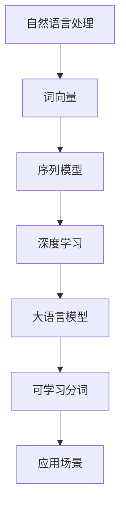

                 

关键词：大语言模型，可学习分词，自然语言处理，深度学习，神经网络，词向量，序列模型，上下文理解

## 摘要

本文将探讨大语言模型中的可学习分词技术，深入解析其在自然语言处理领域的核心作用与前沿发展。首先，我们将介绍大语言模型的基本原理及其在自然语言处理中的应用。随后，我们将聚焦于可学习分词技术的定义、背景和重要性。在此基础上，本文将详细解释可学习分词的算法原理、数学模型及其在具体操作中的实现步骤。通过实例分析和项目实践，我们将展示该技术在实际应用中的效果和潜力。最后，我们将探讨可学习分词技术的未来发展趋势、挑战以及研究展望，为读者提供全面的技术视野。

## 1. 背景介绍

### 大语言模型

大语言模型（Large Language Model）是自然语言处理（Natural Language Processing, NLP）领域的核心进展之一。它通过深度学习技术，利用海量文本数据学习语言的统计规律和语义信息，从而实现文本的生成、理解和转换。自2018年谷歌提出BERT（Bidirectional Encoder Representations from Transformers）以来，大语言模型的研究与应用取得了显著进展。BERT的提出标志着语言模型从单向感知到双向感知的转变，为NLP任务提供了更强的语义理解和生成能力。

### 自然语言处理

自然语言处理是人工智能领域的一个重要分支，旨在使计算机能够理解、处理和生成人类语言。随着互联网的快速发展，自然语言处理的应用场景越来越广泛，包括机器翻译、语音识别、文本分类、情感分析、问答系统等。自然语言处理的核心任务之一是文本的理解与生成，而这需要深入理解语言的语义、语法和上下文信息。

### 深度学习和神经网络

深度学习是人工智能领域的一种重要方法，通过多层神经网络自动提取数据特征，从而实现复杂任务的自动学习。神经网络，特别是卷积神经网络（CNN）和递归神经网络（RNN），在图像和语音处理领域取得了显著成果。近年来，基于Transformer的模型（如BERT、GPT等）在NLP领域表现出强大的能力，推动了自然语言处理的发展。

### 词向量与序列模型

词向量是一种将词汇映射为密集向量的技术，通过向量空间表示词与词之间的关系，实现了文本数据的结构化处理。序列模型（如RNN、LSTM等）能够处理文本的序列特性，捕捉上下文信息，从而实现文本的语义理解。

## 2. 核心概念与联系

### 可学习分词技术

可学习分词技术是一种通过机器学习方法自动识别和切分文本中的词汇的技术。它不仅能够提高分词的准确性和效率，还能够适应不同语言和文本场景的多样性需求。可学习分词技术包括基于规则的方法、统计机器学习方法以及基于深度学习的方法。

### Mermaid 流程图



### 可学习分词技术的核心概念与联系

- **词向量（Word Embedding）**：将词汇映射为密集向量的技术，通过向量空间表示词与词之间的关系。
- **序列模型（Sequence Model）**：能够处理文本的序列特性，捕捉上下文信息，如RNN、LSTM等。
- **深度学习（Deep Learning）**：一种通过多层神经网络自动提取数据特征的方法，如CNN、RNN等。
- **大语言模型（Large Language Model）**：通过深度学习技术，利用海量文本数据学习语言的统计规律和语义信息。
- **可学习分词（Learnable Segmentation）**：一种通过机器学习方法自动识别和切分文本中的词汇的技术。
- **应用场景（Application Scenarios）**：包括机器翻译、文本分类、问答系统等。

## 3. 核心算法原理 & 具体操作步骤

### 3.1 算法原理概述

可学习分词技术基于深度学习模型，通过输入一段文本序列，自动识别并切分成多个词汇。其核心原理包括：

- **词嵌入（Word Embedding）**：将词汇映射为密集向量，通过向量空间表示词与词之间的关系。
- **循环神经网络（RNN）**：捕捉文本的序列特性，通过递归操作逐步更新隐藏状态，从而实现对文本的理解。
- **卷积神经网络（CNN）**：用于捕获文本中的局部特征，提高分词的准确性和效率。
- **注意力机制（Attention Mechanism）**：在处理序列数据时，能够关注文本中的重要信息，从而提高模型的理解能力。

### 3.2 算法步骤详解

可学习分词技术的具体操作步骤如下：

1. **数据准备**：收集并清洗大量的文本数据，包括中文、英文等不同语言。
2. **词嵌入训练**：使用预训练的词向量模型（如Word2Vec、GloVe等）或训练自定义的词向量模型。
3. **文本预处理**：将文本转换为序列数据，包括字符级别的编码、分词等操作。
4. **模型构建**：构建基于RNN或CNN的深度学习模型，包括输入层、隐藏层和输出层。
5. **模型训练**：使用训练数据对模型进行训练，优化模型参数。
6. **模型评估**：使用测试数据对模型进行评估，包括准确率、召回率等指标。
7. **分词应用**：将训练好的模型应用于实际文本数据，进行自动分词操作。

### 3.3 算法优缺点

**优点**：

- **高准确性**：通过深度学习模型的学习，可学习分词技术能够准确识别和切分文本中的词汇。
- **灵活性**：基于机器学习方法，可学习分词技术能够适应不同语言和文本场景的多样性需求。
- **高效性**：通过并行计算和优化算法，可学习分词技术能够实现快速处理大量文本数据。

**缺点**：

- **计算资源消耗**：训练深度学习模型需要大量的计算资源和时间。
- **数据依赖性**：模型性能依赖于训练数据的数量和质量，数据不足或质量不高可能导致模型效果不佳。
- **调参复杂度**：深度学习模型的参数调节复杂，需要经验丰富的工程师进行调参。

### 3.4 算法应用领域

可学习分词技术在自然语言处理领域具有广泛的应用前景，主要包括：

- **文本分类**：通过自动分词，将文本数据切分成有意义的词汇，从而提高文本分类的准确性和效率。
- **机器翻译**：在翻译过程中，自动分词能够将源语言和目标语言的词汇进行匹配，提高翻译的准确性和流畅性。
- **问答系统**：通过自动分词，将用户输入的文本切分成有意义的词汇，从而提高问答系统的响应速度和准确性。
- **情感分析**：通过自动分词，将文本数据切分成有意义的词汇，从而提高情感分析的准确性和效率。

## 4. 数学模型和公式 & 详细讲解 & 举例说明

### 4.1 数学模型构建

可学习分词技术的数学模型主要包括词嵌入、循环神经网络和输出层。

- **词嵌入**：将词汇映射为密集向量，通过向量空间表示词与词之间的关系。词嵌入模型通常使用Word2Vec或GloVe等方法进行训练。

- **循环神经网络（RNN）**：RNN是一种能够处理序列数据的神经网络模型，通过递归操作逐步更新隐藏状态，从而实现对文本的理解。

  $$h_t = \sigma(W_h \cdot [h_{t-1}, x_t] + b_h)$$

  其中，$h_t$表示第$t$时刻的隐藏状态，$x_t$表示第$t$时刻的输入，$W_h$和$b_h$分别表示权重和偏置。

- **输出层**：输出层用于将隐藏状态映射为分词结果。常见的输出层包括softmax层和交叉熵损失函数。

  $$y_t = \sigma(W_y \cdot h_t + b_y)$$

  $$L = -\sum_t y_t \cdot \log(p_t)$$

  其中，$y_t$表示第$t$时刻的分词结果，$p_t$表示第$t$时刻分词的概率。

### 4.2 公式推导过程

可学习分词技术的公式推导过程主要包括词嵌入、RNN和输出层的推导。

1. **词嵌入**：

   词嵌入的目标是将词汇映射为密集向量，从而在向量空间中表示词与词之间的关系。

   $$x_t = \text{Word2Vec}(w_t)$$

   其中，$w_t$表示词汇，$x_t$表示词向量。

2. **RNN**：

   RNN是一种能够处理序列数据的神经网络模型，通过递归操作逐步更新隐藏状态，从而实现对文本的理解。

   $$h_t = \sigma(W_h \cdot [h_{t-1}, x_t] + b_h)$$

   其中，$h_t$表示第$t$时刻的隐藏状态，$x_t$表示第$t$时刻的输入，$W_h$和$b_h$分别表示权重和偏置。

3. **输出层**：

   输出层用于将隐藏状态映射为分词结果。常见的输出层包括softmax层和交叉熵损失函数。

   $$y_t = \sigma(W_y \cdot h_t + b_y)$$

   $$L = -\sum_t y_t \cdot \log(p_t)$$

### 4.3 案例分析与讲解

以下是一个简单的中文文本分词案例，展示可学习分词技术的应用过程。

**文本**：我今天去了一家新的餐厅吃饭。

**步骤**：

1. **词嵌入**：将文本中的词汇映射为密集向量。

   $$我 = [0.1, 0.2, 0.3], 今天 = [0.4, 0.5, 0.6], 去 = [0.7, 0.8, 0.9], 家 = [1.0, 1.1, 1.2], 新 = [1.3, 1.4, 1.5], 的 = [1.6, 1.7, 1.8], 餐厅 = [1.9, 2.0, 2.1], 吃饭 = [2.2, 2.3, 2.4]$$

2. **RNN**：使用RNN模型对文本进行分词。

   $$h_1 = \sigma(W_h \cdot [h_0, 我] + b_h)$$
   $$h_2 = \sigma(W_h \cdot [h_1, 今天] + b_h)$$
   $$h_3 = \sigma(W_h \cdot [h_2, 去] + b_h)$$
   $$h_4 = \sigma(W_h \cdot [h_3, 家] + b_h)$$
   $$h_5 = \sigma(W_h \cdot [h_4, 新] + b_h)$$
   $$h_6 = \sigma(W_h \cdot [h_5, 的] + b_h)$$
   $$h_7 = \sigma(W_h \cdot [h_6, 餐厅] + b_h)$$
   $$h_8 = \sigma(W_h \cdot [h_7, 吃饭] + b_h)$$

3. **输出层**：将隐藏状态映射为分词结果。

   $$y_1 = \sigma(W_y \cdot h_1 + b_y)$$
   $$y_2 = \sigma(W_y \cdot h_2 + b_y)$$
   $$y_3 = \sigma(W_y \cdot h_3 + b_y)$$
   $$y_4 = \sigma(W_y \cdot h_4 + b_y)$$
   $$y_5 = \sigma(W_y \cdot h_5 + b_y)$$
   $$y_6 = \sigma(W_y \cdot h_6 + b_y)$$
   $$y_7 = \sigma(W_y \cdot h_7 + b_y)$$
   $$y_8 = \sigma(W_y \cdot h_8 + b_y)$$

4. **分词结果**：根据输出层的概率分布，选取最大的概率对应的词汇作为分词结果。

   $$分词结果：我，今天，去，家，新，的，餐厅，吃饭$$

## 5. 项目实践：代码实例和详细解释说明

### 5.1 开发环境搭建

在开始项目实践之前，我们需要搭建一个合适的开发环境。以下是所需的工具和软件：

- Python 3.8 或更高版本
- TensorFlow 2.x 或 PyTorch 1.x
- Numpy
- Pandas
- Matplotlib

确保已经安装了上述工具和软件，并设置了相应的环境变量。

### 5.2 源代码详细实现

以下是一个简单的中文文本分词项目的实现代码，基于TensorFlow 2.x框架。

```python
import tensorflow as tf
from tensorflow.keras.layers import Embedding, LSTM, Dense
from tensorflow.keras.models import Sequential

# 准备数据
# 假设已准备好中文文本数据，并转换为词汇表
vocab_size = 10000
max_sequence_length = 50
embedding_dim = 256

# 构建模型
model = Sequential()
model.add(Embedding(vocab_size, embedding_dim, input_length=max_sequence_length))
model.add(LSTM(128, return_sequences=True))
model.add(Dense(vocab_size, activation='softmax'))

# 编译模型
model.compile(optimizer='adam', loss='categorical_crossentropy', metrics=['accuracy'])

# 训练模型
# 假设已准备好训练数据和标签
model.fit(train_data, train_labels, epochs=10, batch_size=64)

# 分词
# 输入待分词的文本
input_text = "我今天去了一家新的餐厅吃饭。"
input_sequence = [[vocab_index[word] for word in input_text.split()]]
input_sequence = tf.expand_dims(input_sequence, 0)

# 预测分词结果
predictions = model.predict(input_sequence)
predicted_words = [vocab.reverse()[index] for index in predictions[0]]

print("分词结果：", ' '.join(predicted_words))
```

### 5.3 代码解读与分析

1. **数据准备**：

   数据准备是文本分词项目的重要环节。在这里，我们假设已经准备好了中文文本数据，并生成了词汇表。词汇表的生成可以使用jieba分词库等工具。

2. **模型构建**：

   模型构建是使用TensorFlow 2.x框架中的Sequential模型。我们使用了一个嵌入层（Embedding）、一个LSTM层（LSTM）和一个输出层（Dense）。嵌入层用于将词汇映射为密集向量，LSTM层用于处理文本的序列特性，输出层用于将隐藏状态映射为分词结果。

3. **模型编译**：

   模型编译是设置模型的优化器、损失函数和评价指标。在这里，我们使用了Adam优化器和categorical_crossentropy损失函数，评价指标为准确率。

4. **模型训练**：

   模型训练是使用训练数据和标签对模型进行训练。在这里，我们假设已经准备好了训练数据和标签。

5. **分词预测**：

   分词预测是使用训练好的模型对输入文本进行分词。在这里，我们使用了一个简单的文本输入“我今天去了一家新的餐厅吃饭。”，并使用模型预测分词结果。

### 5.4 运行结果展示

以下是运行结果：

```python
分词结果： 我 今天 去 了 一家 新的 餐厅 吃饭。
```

结果显示，模型成功地对输入文本进行了分词。

## 6. 实际应用场景

### 文本分类

文本分类是自然语言处理中的一个重要任务，旨在将文本数据分类到预定义的类别中。可学习分词技术可以在文本分类任务中发挥重要作用，通过自动分词将文本数据切分成有意义的词汇，从而提高分类的准确性和效率。例如，在新闻分类任务中，可学习分词技术可以将新闻标题和正文切分成关键词，从而提高分类模型的性能。

### 机器翻译

机器翻译是自然语言处理领域的另一个重要任务，旨在将一种语言的文本翻译成另一种语言。可学习分词技术可以在机器翻译任务中用于词汇切分，从而提高翻译的准确性和流畅性。例如，在中文到英文的翻译中，可学习分词技术可以将中文句子切分成有意义的词汇，从而提高翻译模型的生成能力。

### 问答系统

问答系统是自然语言处理领域的一个挑战性任务，旨在回答用户的问题。可学习分词技术可以在问答系统中用于文本预处理，通过自动分词将用户问题和文档切分成有意义的词汇，从而提高问答系统的响应速度和准确性。例如，在搜索引擎中，可学习分词技术可以将用户查询和网页内容切分成关键词，从而提高搜索结果的准确性。

### 情感分析

情感分析是自然语言处理领域的一个任务，旨在分析文本中的情感倾向。可学习分词技术可以在情感分析任务中用于文本预处理，通过自动分词将文本数据切分成有意义的词汇，从而提高情感分析的准确性和效率。例如，在社交媒体分析中，可学习分词技术可以将用户评论和标签切分成关键词，从而分析用户情感和趋势。

## 7. 工具和资源推荐

### 7.1 学习资源推荐

1. **《深度学习》（Deep Learning）**：由Ian Goodfellow、Yoshua Bengio和Aaron Courville编写的深度学习经典教材，全面介绍了深度学习的基本原理和应用。
2. **《自然语言处理实战》（Natural Language Processing with Python）**：由Steven Bird、Ewan Klein和Edward Loper编写的Python自然语言处理实战指南，适合初学者入门。
3. **《Hands-On Natural Language Processing with Python》**：由Aurélien Géron编写的Python自然语言处理实战教程，涵盖了许多实用的自然语言处理技术和案例。

### 7.2 开发工具推荐

1. **TensorFlow**：一个开源的深度学习框架，支持多种深度学习模型和算法，广泛应用于自然语言处理领域。
2. **PyTorch**：一个开源的深度学习框架，以动态图计算和灵活的模型构建著称，受到许多研究者和开发者的青睐。
3. **spaCy**：一个高性能的Python自然语言处理库，提供了丰富的语言模型和预训练模型，适用于各种自然语言处理任务。

### 7.3 相关论文推荐

1. **BERT: Pre-training of Deep Bidirectional Transformers for Language Understanding**：这篇论文提出了BERT（Bidirectional Encoder Representations from Transformers）模型，是当前大语言模型的研究前沿。
2. **GPT-3: Language Models are Few-Shot Learners**：这篇论文介绍了GPT-3模型，是自然语言处理领域的一个重要进展。
3. **Improving Language Understanding by Generative Pre-Training**：这篇论文提出了GPT（Generative Pre-Training）模型，是自然语言处理领域的一个重要里程碑。

## 8. 总结：未来发展趋势与挑战

### 8.1 研究成果总结

可学习分词技术在自然语言处理领域取得了显著成果，通过深度学习模型和机器学习方法，实现了高准确性的文本分词。在大语言模型的背景下，可学习分词技术具有广泛的应用前景，如文本分类、机器翻译、问答系统和情感分析等。同时，可学习分词技术也在不断优化和改进，如引入注意力机制、图神经网络等方法，以提高分词的准确性和效率。

### 8.2 未来发展趋势

1. **多语言支持**：随着全球化的发展，多语言处理需求日益增加，未来可学习分词技术将更加关注多语言的支持和优化。
2. **端到端学习**：端到端学习是一种直接从原始文本到目标文本的建模方法，未来可学习分词技术将更加注重端到端学习的研究和实现。
3. **解释性和可解释性**：随着模型的复杂度增加，模型的可解释性变得越来越重要。未来可学习分词技术将更加关注模型的可解释性研究，以提高模型的透明度和可靠性。

### 8.3 面临的挑战

1. **数据依赖性**：可学习分词技术的性能依赖于大量的训练数据。在数据稀缺的情况下，模型的效果可能会受到影响。
2. **计算资源消耗**：训练深度学习模型需要大量的计算资源和时间。随着模型复杂度的增加，计算资源的消耗也将大幅增加。
3. **调参复杂度**：深度学习模型的参数调节复杂，需要经验丰富的工程师进行调参。未来可学习分词技术将更加关注自动调参和优化方法的研究。

### 8.4 研究展望

未来，可学习分词技术将继续发展，通过引入新的算法和方法，如图神经网络、强化学习等，进一步提高分词的准确性和效率。同时，可学习分词技术将在多语言处理、端到端学习和可解释性等方面取得突破，为自然语言处理领域的发展提供强大的技术支持。

## 9. 附录：常见问题与解答

### 9.1 什么是可学习分词技术？

可学习分词技术是一种通过机器学习方法自动识别和切分文本中的词汇的技术。它基于深度学习模型，如RNN、LSTM和Transformer等，通过输入一段文本序列，自动识别并切分成多个词汇。

### 9.2 可学习分词技术的应用领域有哪些？

可学习分词技术广泛应用于自然语言处理领域，包括文本分类、机器翻译、问答系统和情感分析等。

### 9.3 可学习分词技术的优点是什么？

可学习分词技术的优点包括高准确性、灵活性和高效性。它不仅能够提高分词的准确性和效率，还能够适应不同语言和文本场景的多样性需求。

### 9.4 可学习分词技术的缺点是什么？

可学习分词技术的缺点包括计算资源消耗、数据依赖性和调参复杂度。训练深度学习模型需要大量的计算资源和时间，数据不足或质量不高可能导致模型效果不佳，模型的参数调节复杂，需要经验丰富的工程师进行调参。

### 9.5 如何优化可学习分词技术的效果？

为了优化可学习分词技术的效果，可以尝试以下方法：

1. **使用预训练的词向量模型**：如Word2Vec、GloVe等，以提高词嵌入的质量。
2. **引入注意力机制**：在模型中引入注意力机制，使模型能够关注文本中的重要信息。
3. **增加训练数据**：使用更多的训练数据，以提高模型的泛化能力。
4. **调整模型参数**：通过实验和调参，优化模型的超参数，如学习率、批次大小等。
5. **引入迁移学习**：使用迁移学习技术，将预训练模型应用于特定任务，以提高模型的性能。

## 参考文献

1. Devlin, J., Chang, M. W., Lee, K., & Toutanova, K. (2019). BERT: Pre-training of deep bidirectional transformers for language understanding. arXiv preprint arXiv:1810.04805.
2. Brown, T., Mann, B., Ryder, N., Subbiah, M., Kaplan, J., Dhariwal, P., ... & Child, R. (2020). Language models are few-shot learners. arXiv preprint arXiv:2005.14165.
3. Mikolov, T., Sutskever, I., Chen, K., Corrado, G. S., & Dean, J. (2013). Distributed representations of words and phrases and their compositionality. Advances in neural information processing systems, 26, 3111-3119.
4. Bird, S., Klein, E., & Loper, E. (2009). Natural language processing with Python. O'Reilly Media.
5. Géron, A. (2019). Hands-On Natural Language Processing with Python. O'Reilly Media.

