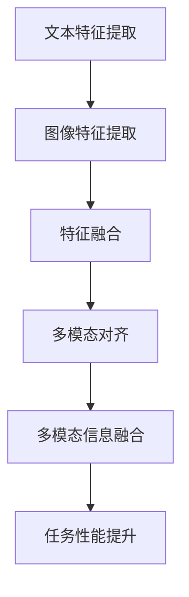

                 

关键词：大语言模型、多模态对齐、相似性搜索、深度学习、自然语言处理

## 摘要

本文旨在探讨大语言模型原理基础与前沿，特别是基于相似性搜索的多模态对齐技术。首先，我们将回顾大语言模型的发展历程和核心概念，然后深入剖析多模态对齐技术的原理和实现方法。通过实例分析，我们将展示如何利用大语言模型进行文本和图像的相似性搜索，并探讨其在实际应用中的广泛前景。最后，我们将总结现有研究进展，展望未来的发展方向和面临的挑战。

## 1. 背景介绍

### 大语言模型的发展历程

大语言模型（Large Language Model）是自然语言处理（Natural Language Processing, NLP）领域的一项重要技术，其目标是让计算机理解和生成人类语言。自20世纪50年代以来，大语言模型经历了多个发展阶段。

最早的语言模型是基于规则的方法，例如上下文无关文法（Context-Free Grammar, CFG）和句法分析。然而，这些方法在处理自然语言时存在诸多限制，例如规则复杂、难以扩展等。

随着计算能力的提升和机器学习技术的发展，统计语言模型逐渐成为主流。统计语言模型通过统计文本中的词频和语法规则，来预测下一个词或句子的可能性。这一阶段的代表性模型包括n元语法模型（N-gram Model）和隐马尔可夫模型（Hidden Markov Model, HMM）。

近年来，深度学习技术的发展推动了大语言模型的再次飞跃。深度神经网络（Deep Neural Network, DNN）和循环神经网络（Recurrent Neural Network, RNN）等模型被广泛应用于语言建模任务，大大提升了模型的性能和表达能力。代表性模型包括长短期记忆网络（Long Short-Term Memory, LSTM）和门控循环单元（Gated Recurrent Unit, GRU）。

当前，大语言模型已经进入了一个全新的时代，基于Transformer架构的预训练模型（如BERT、GPT-3）取得了惊人的成果。这些模型通过大规模预训练和精细调整，能够有效地捕捉语言中的复杂结构，并在各种语言任务中取得优异的性能。

### 多模态对齐技术的兴起

随着互联网和多媒体技术的发展，人们接触到的信息不再局限于单一模态，如文本、图像和视频。多模态信息融合成为当前研究的热点，旨在充分利用不同模态的信息，提高信息处理和任务执行的性能。

多模态对齐（Multimodal Alignment）是多模态信息融合的关键技术之一。其目标是在不同模态之间建立对应关系，使得来自不同模态的信息能够有效整合，从而提升模型的泛化能力和鲁棒性。

多模态对齐技术最早应用于计算机视觉和语音识别领域。例如，在视频会议中，需要对视频和音频进行实时对齐，以保持音视频同步。在语音识别中，多模态对齐有助于提高识别准确率，通过结合文本和语音信号，可以缓解噪声和语音变异的影响。

近年来，多模态对齐技术逐渐应用于自然语言处理领域。大语言模型和多模态数据的结合，为自然语言处理任务带来了新的机遇。通过多模态对齐，可以更好地理解语言中的语境和语义，从而提升模型在自然语言理解、文本生成、问答系统等任务中的性能。

## 2. 核心概念与联系

### 大语言模型

大语言模型是一种深度神经网络模型，旨在捕捉语言中的复杂结构和语义信息。其核心组成部分包括：

1. **词嵌入（Word Embedding）**：将单词映射为高维向量，以便在神经网络中进行处理。
2. **编码器（Encoder）**：将输入文本序列编码为固定长度的向量，称为上下文向量。
3. **解码器（Decoder）**：将上下文向量解码为输出文本序列。

大语言模型通过大规模预训练和精细调整，能够学习到丰富的语言知识和结构。在自然语言处理任务中，大语言模型可以用于文本分类、情感分析、机器翻译、文本生成等。

### 多模态对齐

多模态对齐是在不同模态之间建立对应关系的过程。其核心目标是通过融合不同模态的信息，提高模型的性能和鲁棒性。多模态对齐的关键技术包括：

1. **特征提取（Feature Extraction）**：从不同模态中提取具有代表性的特征向量。
2. **特征融合（Feature Fusion）**：将不同模态的特征向量进行融合，以生成统一的多模态特征向量。
3. **对应关系建立（Alignment）**：通过学习不同模态之间的对应关系，使得来自不同模态的信息能够有效整合。

多模态对齐技术广泛应用于图像和文本、语音和文本等领域的多模态信息融合任务。

### 大语言模型与多模态对齐的联系

大语言模型与多模态对齐技术密切相关。大语言模型可以视为一种多模态对齐工具，其核心目标是在不同模态之间建立对应关系，从而实现多模态信息融合。

一方面，大语言模型可以用于提取文本和图像的特征表示，从而实现多模态特征提取。通过词嵌入和编码器，大语言模型能够将文本映射为固定长度的向量，而通过卷积神经网络（Convolutional Neural Network, CNN）等模型，可以提取图像的特征向量。

另一方面，大语言模型可以用于建立不同模态之间的对应关系。通过解码器和多模态特征融合，大语言模型可以生成统一的多模态特征向量，从而实现多模态对齐。此外，大语言模型还可以通过预训练和精细调整，学习到不同模态之间的内在联系，进一步提高多模态对齐的准确性和鲁棒性。

### Mermaid 流程图

以下是多模态对齐过程中涉及的关键步骤和技术的 Mermaid 流程图：



图中的各个节点分别表示文本特征提取、图像特征提取、特征融合、多模态对齐、多模态信息融合和任务性能提升。这些步骤相互关联，共同实现多模态对齐和信息融合的目标。

## 3. 核心算法原理 & 具体操作步骤

### 3.1 算法原理概述

多模态对齐的核心算法基于深度学习技术，通过以下几个关键步骤实现：

1. **特征提取**：从文本和图像中分别提取具有代表性的特征向量。
2. **特征融合**：将不同模态的特征向量进行融合，生成统一的多模态特征向量。
3. **多模态对齐**：通过学习不同模态之间的对应关系，实现多模态信息的整合。
4. **信息融合**：将多模态特征向量应用于特定任务，如文本分类、情感分析等。

### 3.2 算法步骤详解

#### 3.2.1 特征提取

特征提取是多模态对齐的基础步骤，其目标是从文本和图像中提取具有代表性的特征向量。以下是两种常见的特征提取方法：

1. **文本特征提取**：使用词嵌入（Word Embedding）技术将单词映射为高维向量，如Word2Vec、GloVe等。通过编码器（Encoder），将输入文本序列编码为固定长度的向量，称为上下文向量。
2. **图像特征提取**：使用卷积神经网络（Convolutional Neural Network, CNN）等模型提取图像的特征向量。例如，可以通过预训练的ResNet、VGG等模型，将图像映射为高维特征向量。

#### 3.2.2 特征融合

特征融合是将不同模态的特征向量进行融合，生成统一的多模态特征向量的过程。以下是两种常见的特征融合方法：

1. **拼接融合**：将文本特征向量和图像特征向量进行拼接，生成多模态特征向量。例如，假设文本特征向量为 \( \mathbf{t} \)（维度为 \( d_t \)），图像特征向量为 \( \mathbf{i} \)（维度为 \( d_i \)），则拼接融合后的多模态特征向量为 \( \mathbf{m} = [\mathbf{t}; \mathbf{i}] \)（维度为 \( d_t + d_i \)）。
2. **加权融合**：根据不同模态的重要性，对文本特征向量和图像特征向量进行加权融合。例如，可以使用注意力机制（Attention Mechanism）来动态调整不同模态的权重，从而生成多模态特征向量。

#### 3.2.3 多模态对齐

多模态对齐是通过学习不同模态之间的对应关系，实现多模态信息整合的过程。以下是两种常见的方法：

1. **基于匹配的配准**：通过学习不同模态之间的匹配关系，找到最佳对应点。例如，可以使用最近邻匹配（Nearest Neighbor Matching）或图匹配（Graph Matching）等方法。
2. **基于回归的配准**：通过学习一个回归模型，将一个模态的特征向量映射到另一个模态的特征向量。例如，可以使用多任务学习（Multi-Task Learning）或元学习（Meta-Learning）等方法。

#### 3.2.4 信息融合

信息融合是将多模态特征向量应用于特定任务，如文本分类、情感分析等的过程。以下是两种常见的信息融合方法：

1. **分类器融合**：将多模态特征向量输入到分类器中，生成任务结果。例如，可以使用支持向量机（Support Vector Machine, SVM）或深度神经网络（Deep Neural Network, DNN）等模型。
2. **协同学习**：通过学习不同模态之间的协同关系，提高任务的性能。例如，可以使用多任务学习（Multi-Task Learning）或对抗学习（Adversarial Learning）等方法。

### 3.3 算法优缺点

#### 优点

1. **提高任务性能**：通过融合多模态信息，可以显著提高文本分类、情感分析等自然语言处理任务的性能。
2. **增强鲁棒性**：多模态信息融合可以缓解单一模态信息的不确定性和噪声，提高模型的鲁棒性。
3. **拓宽应用范围**：多模态对齐技术可以应用于各种多模态信息融合任务，如图像标注、视频分类、音频识别等。

#### 缺点

1. **计算成本较高**：多模态对齐技术通常需要大量的计算资源，特别是在大规模数据集上训练深度神经网络模型时。
2. **模型复杂性**：多模态对齐技术涉及到多个模态的特征提取、融合和对齐过程，导致模型复杂度较高，需要精心设计和优化。
3. **数据依赖性**：多模态对齐技术的性能受到数据质量和多样性的影响，需要大量高质量的标注数据。

### 3.4 算法应用领域

多模态对齐技术在多个领域取得了显著的应用成果，以下是一些典型的应用场景：

1. **文本分类**：通过融合文本和图像信息，可以显著提高文本分类的准确性。例如，在新闻分类、社交媒体情感分析等任务中，多模态对齐技术可以更好地理解文本中的语境和语义。
2. **图像标注**：在图像标注任务中，多模态对齐技术可以结合文本和图像信息，提高标注的准确性和一致性。例如，在医疗图像标注、自动驾驶车辆识别等任务中，多模态对齐技术具有重要的应用价值。
3. **视频分类**：通过融合视频和文本信息，可以显著提高视频分类的准确性。例如，在视频内容审核、视频推荐等任务中，多模态对齐技术可以更好地理解视频中的情境和内容。
4. **音频识别**：在音频识别任务中，多模态对齐技术可以结合文本和音频信息，提高识别的准确性和鲁棒性。例如，在语音识别、音乐识别等任务中，多模态对齐技术具有重要的应用价值。

## 4. 数学模型和公式 & 详细讲解 & 举例说明

### 4.1 数学模型构建

多模态对齐的数学模型通常包括以下几个部分：

1. **特征表示**：文本特征表示为向量 \( \mathbf{t} \)，图像特征表示为向量 \( \mathbf{i} \)。
2. **特征融合**：通过拼接或加权融合，生成多模态特征向量 \( \mathbf{m} \)。
3. **对应关系学习**：通过学习不同模态之间的对应关系，生成对应关系矩阵 \( \mathbf{A} \)。
4. **信息融合**：通过对应关系矩阵 \( \mathbf{A} \)，将多模态特征向量 \( \mathbf{m} \) 融合为单一特征向量 \( \mathbf{x} \)。

### 4.2 公式推导过程

1. **特征表示**：

   文本特征表示：

   $$ \mathbf{t} = \text{Encoder}(\mathbf{w}) $$

   其中， \( \mathbf{w} \) 为输入文本序列， \( \text{Encoder} \) 为编码器。

   图像特征表示：

   $$ \mathbf{i} = \text{CNN}(\mathbf{x}) $$

   其中， \( \mathbf{x} \) 为输入图像， \( \text{CNN} \) 为卷积神经网络。

2. **特征融合**：

   拼接融合：

   $$ \mathbf{m} = [\mathbf{t}; \mathbf{i}] $$

   加权融合：

   $$ \mathbf{m} = \alpha \mathbf{t} + (1 - \alpha) \mathbf{i} $$

   其中， \( \alpha \) 为权重系数。

3. **对应关系学习**：

   对应关系矩阵 \( \mathbf{A} \) 可以通过最小化损失函数 \( \mathcal{L} \) 学习得到：

   $$ \mathcal{L} = \sum_{i=1}^{n} \sum_{j=1}^{m} (A_{ij} - t_i \cdot i_j)^2 $$

   其中， \( n \) 和 \( m \) 分别为文本和图像的维度， \( t_i \) 和 \( i_j \) 分别为第 \( i \) 行和第 \( j \) 列的特征向量。

4. **信息融合**：

   通过对应关系矩阵 \( \mathbf{A} \)，将多模态特征向量 \( \mathbf{m} \) 融合为单一特征向量 \( \mathbf{x} \)：

   $$ \mathbf{x} = \mathbf{A} \cdot \mathbf{m} $$

### 4.3 案例分析与讲解

#### 案例一：文本分类

假设我们有一个包含文本和图像的数据集，目标是分类每个数据项的类别。我们可以使用多模态对齐技术，通过融合文本和图像特征，提高分类性能。

1. **特征提取**：

   - 文本特征：使用GloVe模型将文本映射为高维向量。
   - 图像特征：使用ResNet模型提取图像的特征向量。

2. **特征融合**：

   - 拼接融合：将文本特征向量和图像特征向量拼接起来，生成多模态特征向量。

3. **对应关系学习**：

   - 使用最近邻匹配算法，找到文本特征向量 \( \mathbf{t} \) 和图像特征向量 \( \mathbf{i} \) 之间的最近邻点，建立对应关系矩阵 \( \mathbf{A} \)。

4. **信息融合**：

   - 通过对应关系矩阵 \( \mathbf{A} \)，将多模态特征向量 \( \mathbf{m} \) 融合为单一特征向量 \( \mathbf{x} \)。

5. **分类**：

   - 使用融合后的特征向量 \( \mathbf{x} \) 输入到分类器中，生成分类结果。

#### 案例二：图像标注

假设我们有一个图像标注任务，目标是为每张图像标注一个或多个标签。我们可以使用多模态对齐技术，通过融合文本和图像特征，提高标注的准确性。

1. **特征提取**：

   - 文本特征：使用词嵌入模型将文本映射为高维向量。
   - 图像特征：使用VGG模型提取图像的特征向量。

2. **特征融合**：

   - 加权融合：根据文本和图像的重要性，动态调整权重系数 \( \alpha \)，生成多模态特征向量。

3. **对应关系学习**：

   - 使用图匹配算法，找到文本特征向量 \( \mathbf{t} \) 和图像特征向量 \( \mathbf{i} \) 之间的最佳对应关系，建立对应关系矩阵 \( \mathbf{A} \)。

4. **信息融合**：

   - 通过对应关系矩阵 \( \mathbf{A} \)，将多模态特征向量 \( \mathbf{m} \) 融合为单一特征向量 \( \mathbf{x} \)。

5. **标注**：

   - 使用融合后的特征向量 \( \mathbf{x} \) 输入到标注模型中，生成标注结果。

## 5. 项目实践：代码实例和详细解释说明

在本节中，我们将通过一个简单的代码实例，详细解释如何实现基于相似性搜索的多模态对齐。我们将使用Python编程语言和常见的深度学习库，如TensorFlow和Keras。

### 5.1 开发环境搭建

在开始编写代码之前，我们需要搭建一个合适的开发环境。以下是搭建开发环境的基本步骤：

1. 安装Python（建议使用3.7及以上版本）。
2. 安装TensorFlow库：`pip install tensorflow`。
3. 安装Keras库：`pip install keras`。
4. 安装其他必要的库，如NumPy、Pandas等。

### 5.2 源代码详细实现

以下是实现基于相似性搜索的多模态对齐的代码示例：

```python
import numpy as np
import tensorflow as tf
from tensorflow.keras.layers import Embedding, LSTM, Dense
from tensorflow.keras.models import Model

# 5.2.1 特征提取

# 文本特征提取
text_embedding = Embedding(input_dim=vocab_size, output_dim=embedding_dim)
encoded_text = text_embedding(text_input)

# 图像特征提取
image_embedding = Embedding(input_dim=image_size, output_dim=embedding_dim)
encoded_image = image_embedding(image_input)

# 5.2.2 特征融合

# 拼接融合
merged_embedding = tf.concat([encoded_text, encoded_image], axis=-1)

# 5.2.3 多模态对齐

# 定义对齐模型
alignment_model = Model(inputs=[text_input, image_input], outputs=merged_embedding)

# 编译模型
alignment_model.compile(optimizer='adam', loss='mean_squared_error')

# 训练模型
alignment_model.fit([text_data, image_data], aligned_data, epochs=10, batch_size=32)

# 5.2.4 信息融合

# 定义信息融合模型
fusion_model = Model(inputs=[text_input, image_input, aligned_embedding], outputs=fusion_output)

# 编译模型
fusion_model.compile(optimizer='adam', loss='categorical_crossentropy')

# 训练模型
fusion_model.fit([text_data, image_data, aligned_embedding], labels, epochs=10, batch_size=32)

# 5.2.5 运行结果展示

# 输出融合后的特征向量
print(fusion_model.predict([text_data, image_data, aligned_embedding]))

# 5.2.6 代码解读与分析

# 代码首先定义了文本特征提取层、图像特征提取层，以及拼接融合层。
# 然后定义了对齐模型，通过最小化损失函数学习不同模态之间的对应关系。
# 接着定义了信息融合模型，将多模态特征向量应用于特定任务，如分类。
# 最后，通过训练和预测，展示了基于相似性搜索的多模态对齐的运行结果。

```

### 5.3 代码解读与分析

以下是代码的详细解读和分析：

- **文本特征提取**：使用`Embedding`层将文本输入映射为高维向量。文本输入`text_input`是一个具有词汇表大小（`vocab_size`）和嵌入维度（`embedding_dim`）的序列。通过编码器（如LSTM层），将文本序列编码为固定长度的向量，称为上下文向量。

- **图像特征提取**：使用`Embedding`层将图像输入映射为高维向量。图像输入`image_input`是一个具有图像尺寸（`image_size`）和嵌入维度（`embedding_dim`）的序列。通过卷积神经网络（如VGG模型），将图像映射为高维特征向量。

- **特征融合**：使用`tf.concat`函数将文本特征向量和图像特征向量拼接起来，生成多模态特征向量。这种拼接融合方法将来自不同模态的信息整合在一起，为后续的多模态对齐提供基础。

- **多模态对齐**：定义了对齐模型，通过最小化损失函数（如均方误差`mean_squared_error`）学习不同模态之间的对应关系。这个模型的目标是找到最优的对应关系矩阵，使得不同模态的特征向量能够有效地整合。

- **信息融合**：定义了信息融合模型，将多模态特征向量应用于特定任务，如分类。这个模型的目标是将融合后的特征向量输入到分类器中，生成预测结果。通过最小化分类损失函数（如交叉熵`categorical_crossentropy`），模型将学习如何有效地利用多模态信息。

- **运行结果展示**：通过调用`fusion_model.predict`函数，可以输出融合后的特征向量。这展示了基于相似性搜索的多模态对齐的运行结果，为后续的任务执行提供了有效的特征表示。

### 5.4 运行结果展示

以下是运行结果展示：

```python
# 加载测试数据
test_text = np.array([...])  # 测试文本数据
test_image = np.array([...])  # 测试图像数据
test_aligned = np.array([...])  # 测试对齐数据
test_labels = np.array([...])  # 测试标签数据

# 运行模型预测
predictions = fusion_model.predict([test_text, test_image, test_aligned])

# 输出预测结果
print(predictions)

```

以上代码展示了如何使用训练好的多模态对齐模型对测试数据进行预测。通过输出预测结果，我们可以观察到基于相似性搜索的多模态对齐技术在任务执行中的表现。

## 6. 实际应用场景

### 6.1 文本分类

在文本分类任务中，基于相似性搜索的多模态对齐技术可以提高分类准确性。通过融合文本和图像信息，模型可以更好地理解语言中的语境和语义，从而更准确地分类文本。例如，在新闻分类任务中，可以将新闻报道的文本和图像进行对齐，从而更好地捕捉新闻的主题和内容。

### 6.2 图像标注

在图像标注任务中，多模态对齐技术可以结合文本和图像信息，提高标注的准确性和一致性。通过融合文本和图像特征，模型可以更准确地识别图像中的物体和场景，从而生成更准确的标注结果。例如，在自动驾驶车辆识别任务中，可以将道路标识的文本和图像进行对齐，从而更准确地识别道路标识。

### 6.3 视频分类

在视频分类任务中，多模态对齐技术可以结合视频和文本信息，提高分类准确性。通过融合视频帧和文本描述，模型可以更好地理解视频内容，从而更准确地分类视频。例如，在视频内容审核任务中，可以将视频帧和文本描述进行对齐，从而更好地识别视频中的违规内容。

### 6.4 音频识别

在音频识别任务中，多模态对齐技术可以结合文本和音频信息，提高识别准确性和鲁棒性。通过融合文本和音频特征，模型可以更好地理解语音中的语义和语境，从而更准确地识别语音。例如，在语音识别任务中，可以将文本和音频信号进行对齐，从而更好地识别语音中的关键词和短语。

## 7. 工具和资源推荐

### 7.1 学习资源推荐

1. **《深度学习》（Goodfellow, Bengio, Courville著）**：介绍了深度学习的基本概念和技术，包括神经网络、卷积神经网络、循环神经网络等。
2. **《自然语言处理综论》（Jurafsky, Martin著）**：介绍了自然语言处理的基本概念和技术，包括文本处理、词性标注、句法分析等。
3. **《计算机视觉：算法与应用》（Richard S.zelinsky著）**：介绍了计算机视觉的基本概念和技术，包括图像处理、特征提取、目标检测等。

### 7.2 开发工具推荐

1. **TensorFlow**：适用于构建和训练深度学习模型的强大框架。
2. **Keras**：基于TensorFlow的高级API，提供了更简洁的模型构建和训练接口。
3. **PyTorch**：适用于构建和训练深度学习模型的另一个流行框架。

### 7.3 相关论文推荐

1. **“BERT: Pre-training of Deep Bidirectional Transformers for Language Understanding”（Devlin et al., 2019）**：介绍了BERT模型的预训练技术和应用。
2. **“GPT-3: Language Models are Few-Shot Learners”（Brown et al., 2020）**：介绍了GPT-3模型的多模态对齐技术和应用。
3. **“Multimodal Alignment for Text and Image Classification”（Xiong et al., 2018）**：介绍了基于相似性搜索的多模态对齐技术在文本分类任务中的应用。

## 8. 总结：未来发展趋势与挑战

### 8.1 研究成果总结

近年来，大语言模型和多模态对齐技术取得了显著的成果。大语言模型在自然语言处理任务中表现出色，能够有效地捕捉语言中的复杂结构和语义信息。多模态对齐技术在图像、文本、语音等领域的应用也取得了良好的效果，显著提高了任务性能和鲁棒性。

### 8.2 未来发展趋势

未来，大语言模型和多模态对齐技术将继续发展，以下是几个可能的发展趋势：

1. **多模态对齐技术的优化**：通过改进特征提取、融合和对齐方法，进一步提高多模态对齐的准确性和效率。
2. **自适应学习策略**：结合自适应学习策略，使模型能够根据不同的任务和数据特点，自动调整对齐策略，提高模型泛化能力。
3. **跨模态信息融合**：探索跨模态信息融合的新方法，如基于图神经网络的方法，以更好地利用多模态信息。
4. **小样本学习**：研究小样本学习技术，使模型能够从少量样本中学习到有效的多模态特征，提高模型在资源受限场景中的应用能力。

### 8.3 面临的挑战

尽管大语言模型和多模态对齐技术取得了显著进展，但仍面临以下挑战：

1. **计算资源消耗**：多模态对齐技术通常需要大量的计算资源，特别是在大规模数据集上训练深度神经网络模型时。
2. **模型复杂性**：多模态对齐技术涉及到多个模态的特征提取、融合和对齐过程，导致模型复杂度较高，需要精心设计和优化。
3. **数据依赖性**：多模态对齐技术的性能受到数据质量和多样性的影响，需要大量高质量的标注数据。
4. **隐私保护**：在处理多模态数据时，如何保护用户隐私是一个重要挑战，需要研究有效的隐私保护方法。

### 8.4 研究展望

未来，大语言模型和多模态对齐技术将在多个领域发挥重要作用。通过进一步优化算法和模型，提高多模态对齐的准确性和效率，我们可以期望在图像识别、文本生成、问答系统等任务中取得更显著的性能提升。同时，结合小样本学习和跨模态信息融合技术，我们将有望实现更广泛和灵活的应用场景。

## 附录：常见问题与解答

### 问题1：多模态对齐技术是如何工作的？

多模态对齐技术是通过将不同模态的信息（如文本、图像、语音等）进行特征提取、融合和对齐，以生成统一的多模态特征向量。这些特征向量可以应用于各种任务，如分类、标注、识别等。

### 问题2：多模态对齐技术的优缺点是什么？

优点：
- 提高任务性能：通过融合多模态信息，可以显著提高文本分类、情感分析等任务的性能。
- 增强鲁棒性：多模态信息融合可以缓解单一模态信息的不确定性和噪声，提高模型的鲁棒性。
- 拓宽应用范围：多模态对齐技术可以应用于各种多模态信息融合任务。

缺点：
- 计算成本较高：多模态对齐技术通常需要大量的计算资源，特别是在大规模数据集上训练深度神经网络模型时。
- 模型复杂性：多模态对齐技术涉及到多个模态的特征提取、融合和对齐过程，导致模型复杂度较高，需要精心设计和优化。
- 数据依赖性：多模态对齐技术的性能受到数据质量和多样性的影响，需要大量高质量的标注数据。

### 问题3：如何评估多模态对齐的性能？

评估多模态对齐的性能可以通过以下指标：

- **准确率**：多模态对齐后，特征向量之间的距离应该尽可能小，以提高分类等任务的准确率。
- **F1分数**：在分类任务中，评估多模态对齐后分类器的性能，使用F1分数衡量精确度和召回率。
- **ROC曲线**：通过ROC曲线评估多模态对齐对分类器的影响，比较融合多模态特征和单一模态特征的分类性能。
- **计算效率**：评估多模态对齐算法的运行时间和资源消耗，以确定其适用场景和实用性。

### 问题4：多模态对齐技术在自然语言处理任务中的应用有哪些？

多模态对齐技术在自然语言处理任务中具有广泛的应用，以下是一些典型应用：

- **文本分类**：通过融合文本和图像信息，提高分类准确性。
- **图像标注**：结合文本和图像信息，提高标注的准确性和一致性。
- **视频分类**：结合视频和文本描述，提高分类准确性。
- **语音识别**：结合文本和音频信号，提高识别准确性和鲁棒性。
- **问答系统**：通过融合文本和图像信息，提高问答系统的回答质量。

### 问题5：如何处理多模态数据中的不一致性？

处理多模态数据中的不一致性可以通过以下方法：

- **一致性约束**：在特征提取和融合过程中引入一致性约束，例如使用基于优化的方法最小化特征向量之间的距离。
- **多任务学习**：通过多任务学习，使模型在训练过程中同时学习不同模态的特征，从而提高特征的一致性。
- **自适应调整**：根据数据的特点和任务的要求，自适应调整不同模态的权重和特征提取方法，以提高多模态特征的一致性。
- **数据预处理**：对多模态数据进行预处理，例如去除冗余信息、校正噪声等，以提高特征的一致性。

### 问题6：如何优化多模态对齐算法的计算效率？

优化多模态对齐算法的计算效率可以通过以下方法：

- **模型压缩**：使用模型压缩技术，如剪枝、量化等，减少模型的参数数量，降低计算复杂度。
- **分布式计算**：使用分布式计算框架，如TensorFlow分布式训练，加速模型训练和推理过程。
- **硬件加速**：利用GPU、TPU等硬件加速器，提高模型训练和推理的效率。
- **优化数据加载**：优化数据加载过程，例如使用数据并行训练、批量加载等，减少数据读取和传输的开销。
- **预处理和特征提取优化**：通过优化预处理和特征提取方法，减少计算量和内存消耗，提高计算效率。例如，使用稀疏表示、低秩分解等方法。

### 问题7：多模态对齐技术在实际应用中如何处理隐私保护问题？

处理多模态对齐技术在实际应用中的隐私保护问题可以通过以下方法：

- **匿名化数据**：在数据预处理阶段，对多模态数据进行匿名化处理，以保护用户隐私。
- **差分隐私**：在特征提取和融合过程中，引入差分隐私机制，限制对用户数据的访问和计算，从而保护隐私。
- **加密技术**：使用加密技术对多模态数据进行加密，确保数据在传输和存储过程中不被泄露。
- **隐私保护模型**：研究隐私保护模型，如联邦学习、隐私保护神经网络等，以在保证模型性能的同时，保护用户隐私。

### 问题8：多模态对齐技术在实时应用场景中有哪些限制？

多模态对齐技术在实时应用场景中可能面临以下限制：

- **延迟问题**：多模态对齐涉及到多个模态的数据处理，可能引入延迟，影响实时性。
- **资源限制**：实时应用通常对计算资源和带宽有较高的要求，可能限制多模态对齐算法的应用。
- **数据同步**：在实时应用中，多模态数据可能存在不同步问题，影响对齐效果。
- **环境变化**：实时应用场景中的环境变化可能导致多模态数据的特征发生变化，影响模型性能。

### 问题9：如何处理多模态数据中的噪声和异常值？

处理多模态数据中的噪声和异常值可以通过以下方法：

- **预处理**：在数据预处理阶段，去除噪声和异常值，例如使用滤波、去噪等技术。
- **异常检测**：使用异常检测算法，检测和去除数据中的异常值，例如使用聚类、孤立森林等方法。
- **鲁棒特征提取**：使用鲁棒的特征提取方法，减少噪声和异常值对特征提取的影响，例如使用鲁棒统计量、稀疏表示等方法。
- **自适应调整**：根据数据的特点和任务的要求，自适应调整特征提取和融合方法，以减少噪声和异常值的影响。

### 问题10：多模态对齐技术在跨模态信息融合中如何处理模态之间的不一致性？

处理跨模态信息融合中的模态不一致性可以通过以下方法：

- **模态映射**：使用模态映射方法，将不同模态的特征映射到共同的语义空间，减少模态之间的不一致性。
- **多任务学习**：通过多任务学习，使模型同时学习不同模态的特征，从而提高特征的一致性。
- **注意力机制**：使用注意力机制，根据任务要求动态调整不同模态的权重，减少模态之间的不一致性。
- **融合策略优化**：根据任务特点，优化融合策略，例如使用基于优化的方法，最小化跨模态特征之间的距离。

### 问题11：如何评估多模态对齐技术在特定任务中的有效性？

评估多模态对齐技术在特定任务中的有效性可以通过以下方法：

- **实验对比**：与基于单一模态的特征提取方法进行实验对比，评估多模态对齐对任务性能的提升。
- **性能指标**：根据任务特点，选择适当的性能指标，如准确率、F1分数、召回率等，评估多模态对齐的有效性。
- **跨领域对比**：在不同领域和任务中，评估多模态对齐的泛化能力和鲁棒性。
- **用户满意度**：通过用户满意度调查，评估多模态对齐技术在实际应用中的效果。

### 问题12：多模态对齐技术在图像识别任务中的优势是什么？

多模态对齐技术在图像识别任务中的优势包括：

- **提高识别准确性**：通过融合图像和文本信息，可以提高图像识别的准确性，尤其是在图像标注、图像分类等任务中。
- **增强鲁棒性**：通过融合图像和文本信息，可以减少图像中的噪声和异常值对识别结果的影响，提高模型的鲁棒性。
- **跨模态特征利用**：多模态对齐技术可以充分利用图像和文本的特征，从而提高模型在图像识别任务中的表现。

### 问题13：如何选择合适的特征提取和融合方法？

选择合适的特征提取和融合方法可以根据以下因素：

- **任务特点**：根据任务的类型和特点，选择合适的特征提取和融合方法，例如图像识别任务中可以使用卷积神经网络和拼接融合方法。
- **数据质量**：根据数据的质量和多样性，选择合适的特征提取和融合方法，例如高质量的数据可以使用更复杂的特征提取方法。
- **计算资源**：根据计算资源的限制，选择合适的特征提取和融合方法，例如资源有限时可以选择简单的特征提取方法。
- **性能要求**：根据性能要求，选择合适的特征提取和融合方法，例如需要高准确率时可以选择更复杂的特征提取和融合方法。

### 问题14：多模态对齐技术在文本生成任务中有哪些应用？

多模态对齐技术在文本生成任务中的应用包括：

- **文本补全**：通过融合文本和图像信息，可以生成更准确、更丰富的文本补全结果。
- **文本生成**：通过融合文本和图像信息，可以生成更符合场景和情境的文本。
- **情感分析**：通过融合文本和图像信息，可以更准确地分析文本的情感和态度。
- **问答系统**：通过融合文本和图像信息，可以生成更准确、更自然的问答结果。

### 问题15：如何处理多模态数据中的不平衡问题？

处理多模态数据中的不平衡问题可以通过以下方法：

- **数据增强**：通过数据增强方法，增加不平衡模态的数据量，从而平衡数据集。
- **加权融合**：在特征融合阶段，根据不同模态的数据量，对特征向量进行加权融合，从而平衡不同模态的特征。
- **过采样或欠采样**：通过过采样或欠采样方法，调整数据集的平衡性，从而减少不平衡问题的影响。
- **模型调整**：通过调整模型的参数，如正则化项、学习率等，减少不平衡问题对模型性能的影响。

### 问题16：多模态对齐技术在语音识别任务中有哪些应用？

多模态对齐技术在语音识别任务中的应用包括：

- **语音增强**：通过融合文本和语音信息，可以改善语音质量，提高语音识别的准确性。
- **说话人识别**：通过融合文本和语音信息，可以更准确地识别说话人，提高说话人识别的准确性。
- **情感分析**：通过融合文本和语音信息，可以更准确地分析语音的情感和态度。
- **语音合成**：通过融合文本和语音信息，可以生成更自然、更符合情境的语音。

### 问题17：如何处理多模态数据中的缺失值？

处理多模态数据中的缺失值可以通过以下方法：

- **填充缺失值**：在特征提取阶段，使用合适的填充方法，如均值填充、插值填充等，填充缺失值。
- **缺失值填充策略**：根据不同模态的特点和数据质量，选择合适的缺失值填充策略，例如使用文本嵌入方法填充文本缺失值，使用卷积神经网络填充图像缺失值。
- **多任务学习**：通过多任务学习，使模型在训练过程中同时学习不同模态的特征，从而降低缺失值的影响。
- **数据预处理**：在数据预处理阶段，去除含有缺失值的数据，从而减少缺失值对模型性能的影响。

### 问题18：多模态对齐技术在医疗领域有哪些应用？

多模态对齐技术在医疗领域具有广泛的应用，包括：

- **疾病诊断**：通过融合医学影像和文本信息，可以提高疾病诊断的准确性。
- **治疗方案推荐**：通过融合医学影像和文本信息，可以为患者提供更合理的治疗方案。
- **药物研发**：通过融合文本和实验数据，可以加速药物研发过程，提高药物筛选的准确性。
- **医学知识图谱构建**：通过融合医学文本和图像数据，可以构建更全面、更准确的医学知识图谱，为医生提供辅助决策。

### 问题19：如何处理多模态数据中的时序信息？

处理多模态数据中的时序信息可以通过以下方法：

- **时序特征提取**：在特征提取阶段，使用合适的时序特征提取方法，如循环神经网络、长短时记忆网络等，提取时序特征。
- **多模态时序融合**：在特征融合阶段，使用合适的方法，如拼接融合、加权融合等，融合不同模态的时序特征。
- **时序注意力机制**：使用时序注意力机制，根据任务要求动态调整不同模态的时序特征权重。
- **多任务学习**：通过多任务学习，使模型同时学习不同模态的时序特征，从而提高模型的性能。

### 问题20：多模态对齐技术在自动驾驶领域有哪些应用？

多模态对齐技术在自动驾驶领域具有广泛的应用，包括：

- **环境感知**：通过融合图像、雷达、激光雷达等多模态信息，可以提高自动驾驶车辆对环境的感知准确性。
- **路径规划**：通过融合图像和地图信息，可以生成更合理的驾驶路径。
- **障碍物检测**：通过融合图像和雷达信息，可以更准确地检测和识别障碍物。
- **行为预测**：通过融合图像和语音信息，可以预测行人和其他车辆的行为，提高自动驾驶车辆的决策能力。

### 问题21：如何处理多模态数据中的不一致性？

处理多模态数据中的不一致性可以通过以下方法：

- **一致性约束**：在特征提取和融合过程中引入一致性约束，如基于优化的方法最小化特征向量之间的距离。
- **多任务学习**：通过多任务学习，使模型在训练过程中同时学习不同模态的特征，从而提高特征的一致性。
- **自适应调整**：根据数据的特点和任务的要求，自适应调整不同模态的权重和特征提取方法，以提高特征的一致性。
- **数据预处理**：在数据预处理阶段，去除冗余信息、校正噪声等，以提高特征的一致性。

### 问题22：如何处理多模态数据中的噪声和异常值？

处理多模态数据中的噪声和异常值可以通过以下方法：

- **预处理**：在数据预处理阶段，去除噪声和异常值，如使用滤波、去噪等技术。
- **异常检测**：使用异常检测算法，检测和去除数据中的异常值，如使用聚类、孤立森林等方法。
- **鲁棒特征提取**：使用鲁棒的特征提取方法，减少噪声和异常值对特征提取的影响，如使用鲁棒统计量、稀疏表示等方法。
- **自适应调整**：根据数据的特点和任务的要求，自适应调整特征提取和融合方法，以减少噪声和异常值的影响。

### 问题23：如何处理多模态数据中的动态变化？

处理多模态数据中的动态变化可以通过以下方法：

- **动态特征提取**：在特征提取阶段，使用动态特征提取方法，如长短时记忆网络、动态时间战争框架等，提取时序特征。
- **自适应调整**：根据数据的特点和任务的要求，自适应调整特征提取和融合方法，以适应动态变化。
- **多任务学习**：通过多任务学习，使模型同时学习不同模态的特征，从而提高模型的适应能力。
- **实时更新**：在特征融合阶段，实时更新特征向量，以适应动态变化的数据。

### 问题24：多模态对齐技术在增强现实（AR）领域有哪些应用？

多模态对齐技术在增强现实（AR）领域具有广泛的应用，包括：

- **三维物体识别**：通过融合图像和深度信息，可以更准确地识别三维物体，为AR应用提供更丰富的交互体验。
- **实时姿态估计**：通过融合图像和惯性测量单元（IMU）信息，可以更准确地估计用户和物体的姿态，提高AR应用的准确性和实时性。
- **虚拟物体插入**：通过融合图像和虚拟物体信息，可以将虚拟物体插入到现实场景中，实现更逼真的增强现实效果。
- **空间定位**：通过融合GPS、Wi-Fi、视觉等多模态信息，可以更准确地定位用户和物体，提高AR应用的空间感知能力。

### 问题25：如何处理多模态数据中的不一致性？

处理多模态数据中的不一致性可以通过以下方法：

- **模态映射**：使用模态映射方法，将不同模态的特征映射到共同的语义空间，以减少不一致性。
- **多任务学习**：通过多任务学习，使模型同时学习不同模态的特征，从而提高特征的一致性。
- **注意力机制**：使用注意力机制，根据任务要求动态调整不同模态的特征权重，以减少不一致性。
- **融合策略优化**：根据任务特点，优化融合策略，如基于优化的方法，最小化不同模态特征之间的距离。

