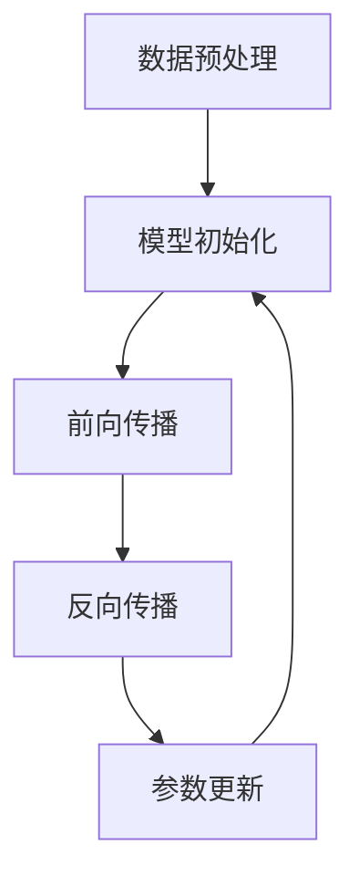

                 

关键词：大语言模型，计算本质，人工智能，机器学习，自然语言处理，深度学习，神经网络，计算机科学

## 摘要

本文旨在探讨大语言模型如何从根本上改变了计算的本质。我们将首先回顾计算的历史发展，接着深入分析大语言模型的原理、架构和应用。通过数学模型和具体算法的讲解，我们揭示了语言模型如何将计算从基于规则的离散处理转化为连续的数据流处理。最后，我们将展望大语言模型在计算机科学领域的未来发展，并探讨其中面临的挑战。

## 1. 背景介绍

### 1.1 计算机科学的起源与发展

计算机科学是一门研究计算机系统结构和行为的科学，它起源于20世纪中叶。从最初的机械计算器到电子计算机，再到现代的超级计算机，计算机科学经历了无数次的飞跃。这个过程中，计算的本质也在不断演变。

早期的计算机主要依赖于硬件逻辑电路和硬件指令集。程序的编写依赖于机器语言，这是一种直接操作硬件的低级语言。然而，机器语言编写复杂、易错，且可维护性差。

随着汇编语言和高级语言的发明，程序的编写变得更加简单和直观。例如，C语言的出现极大地推动了软件工程的发展。然而，即使在高级语言时代，计算仍然是以指令序列的方式进行的，即离散的计算过程。

### 1.2 人工智能的崛起

20世纪80年代以来，人工智能（AI）领域取得了突破性进展。机器学习成为AI的核心技术，它使计算机能够从数据中学习并做出决策，而不需要明确的编程指令。

深度学习是机器学习的一个分支，它利用多层神经网络对数据进行分析和处理。随着计算能力和数据量的提升，深度学习在图像识别、语音识别、自然语言处理等领域取得了显著的成果。

然而，深度学习模型仍然依赖于预先定义的算法和规则。模型的训练过程虽然能够自动调整参数，但最终的输出仍然受限于训练数据集和算法本身。

### 1.3 大语言模型的兴起

近年来，大语言模型的崛起标志着自然语言处理（NLP）领域的一次革命。大语言模型如BERT、GPT、T5等，拥有数十亿甚至数千亿的参数，能够处理大量的自然语言数据。

大语言模型的出现，使得计算从基于规则的离散处理方式转向了基于数据流的连续处理方式。这意味着，计算机可以像人类一样理解、生成和交互自然语言。

## 2. 核心概念与联系

### 2.1 语言模型的基本原理

语言模型是用于预测下一个单词或词组的概率分布的数学模型。它的核心概念是基于统计学的概率模型，通过分析大量文本数据来学习语言规律。

语言模型的训练过程主要包括两个步骤：

1. **数据预处理**：将原始文本数据清洗、分词、标记等，转化为适合模型训练的形式。
2. **训练过程**：通过梯度下降等优化算法，最小化预测概率分布与实际分布之间的差距。

### 2.2 大语言模型的架构

大语言模型通常采用深度神经网络架构，包括多层感知机（MLP）、循环神经网络（RNN）、长短期记忆网络（LSTM）等。近年来，Transformer架构因其优异的性能和效率，成为大语言模型的主要选择。

Transformer架构的核心是自注意力机制（Self-Attention），它能够自动学习单词之间的关联性。通过多个注意力层，模型能够捕捉到长距离的依赖关系。

### 2.3 语言模型与计算本质的联系

语言模型的原理和架构揭示了计算本质的一个重要转变：

1. **从离散到连续**：传统计算以离散的指令序列为操作对象，而大语言模型则将自然语言视为连续的数据流。这种连续性的处理方式，使得计算机能够更加高效地理解和生成自然语言。
2. **从规则到数据驱动**：传统计算依赖于明确的编程规则，而大语言模型则是通过学习大量数据来发现规律。这种数据驱动的计算方式，使得计算机能够适应更复杂的语言环境。

### 2.4 Mermaid 流程图

下面是语言模型训练过程的 Mermaid 流程图：



## 3. 核心算法原理 & 具体操作步骤

### 3.1 算法原理概述

大语言模型的训练过程主要包括以下步骤：

1. **数据预处理**：将原始文本数据清洗、分词、标记等，转化为适合模型训练的形式。
2. **模型初始化**：初始化模型的参数，通常使用随机初始化或预训练模型的参数。
3. **前向传播**：将输入数据传递到模型中，计算输出结果。
4. **反向传播**：计算输出结果与实际结果之间的误差，并更新模型参数。
5. **参数更新**：根据误差反向传播的结果，更新模型的参数。

### 3.2 算法步骤详解

#### 3.2.1 数据预处理

数据预处理是语言模型训练的基础。具体步骤包括：

1. **文本清洗**：去除文本中的html标签、特殊字符等。
2. **分词**：将文本分割成单词或词组。
3. **标记**：将单词或词组映射到对应的索引。

#### 3.2.2 模型初始化

模型初始化是确保模型参数在合理范围内的关键步骤。通常采用以下方法：

1. **随机初始化**：随机生成模型参数。
2. **预训练模型**：使用预训练的模型作为初始参数。

#### 3.2.3 前向传播

前向传播是模型处理输入数据的过程。具体步骤包括：

1. **输入层**：将输入数据传递到模型的第一层。
2. **隐藏层**：在隐藏层之间传递数据，并应用非线性激活函数。
3. **输出层**：生成预测结果。

#### 3.2.4 反向传播

反向传播是更新模型参数的过程。具体步骤包括：

1. **计算误差**：计算输出结果与实际结果之间的误差。
2. **误差反向传播**：将误差反向传递到隐藏层和输入层。
3. **参数更新**：根据误差更新模型参数。

#### 3.2.5 参数更新

参数更新是模型训练的核心步骤。通常采用以下方法：

1. **梯度下降**：根据误差梯度更新模型参数。
2. **Adam优化器**：结合动量和自适应学习率，优化参数更新过程。

### 3.3 算法优缺点

#### 优点：

1. **高效性**：大语言模型能够处理大量的自然语言数据，具有较高的计算效率。
2. **泛化能力**：通过大量数据训练，模型具有良好的泛化能力。
3. **灵活性**：基于数据驱动的计算方式，模型能够适应多种语言环境。

#### 缺点：

1. **计算资源需求高**：大语言模型需要大量的计算资源和存储空间。
2. **训练时间长**：大规模模型的训练过程可能需要数天甚至数周的时间。

### 3.4 算法应用领域

大语言模型在自然语言处理领域具有广泛的应用：

1. **文本生成**：例如，自动写作、机器翻译、对话系统等。
2. **文本理解**：例如，情感分析、问答系统、文本摘要等。
3. **语音识别**：结合语音识别技术，实现自然语言交互。

## 4. 数学模型和公式 & 详细讲解 & 举例说明

### 4.1 数学模型构建

大语言模型的核心是一个深度神经网络，其数学模型可以表示为：

$$
Y = f(W \cdot X + b)
$$

其中，$Y$ 是输出，$X$ 是输入，$W$ 是权重矩阵，$b$ 是偏置项，$f$ 是激活函数。

### 4.2 公式推导过程

#### 4.2.1 前向传播

前向传播过程中，输入 $X$ 通过网络的权重矩阵 $W$ 和偏置项 $b$，经过激活函数 $f$ 的变换，得到输出 $Y$。

$$
Z = W \cdot X + b \\
Y = f(Z)
$$

#### 4.2.2 反向传播

反向传播过程中，计算输出 $Y$ 与实际输出 $Y'$ 之间的误差，并通过误差反向更新权重矩阵 $W$ 和偏置项 $b$。

$$
E = Y - Y' \\
\frac{\partial E}{\partial W} = \frac{\partial f(Z)}{\partial Z} \cdot \frac{\partial Z}{\partial W} \\
W_{new} = W - \alpha \cdot \frac{\partial E}{\partial W}
$$

其中，$\alpha$ 是学习率。

### 4.3 案例分析与讲解

#### 4.3.1 案例一：文本生成

假设我们要生成一段文本，输入为“I love programming”，模型预测的下一个单词为“it”。

1. **数据预处理**：将输入文本转化为向量形式。
2. **前向传播**：通过模型计算输出概率分布。
3. **反向传播**：根据实际输出与预测输出的误差，更新模型参数。
4. **生成文本**：根据概率分布生成下一个单词。

#### 4.3.2 案例二：情感分析

假设我们要分析一段文本“I hate this book”的情感，模型预测的情感为“负面”。

1. **数据预处理**：将输入文本转化为向量形式。
2. **前向传播**：通过模型计算情感概率分布。
3. **输出情感**：根据概率分布输出情感类别。

## 5. 项目实践：代码实例和详细解释说明

### 5.1 开发环境搭建

1. 安装Python环境，版本建议3.7及以上。
2. 安装深度学习框架TensorFlow。
3. 安装预处理库如spaCy。

```python
!pip install tensorflow
!pip install spacy
!python -m spacy download en
```

### 5.2 源代码详细实现

以下是使用TensorFlow和spaCy实现大语言模型的基本代码：

```python
import tensorflow as tf
import spacy
from tensorflow.keras.layers import Embedding, LSTM, Dense
from tensorflow.keras.models import Sequential

# 加载预训练的spaCy模型
nlp = spacy.load("en_core_web_sm")

# 预处理数据
def preprocess_text(text):
    doc = nlp(text)
    tokens = [token.text.lower() for token in doc]
    return tokens

# 构建模型
model = Sequential([
    Embedding(vocab_size, embedding_dim, input_length=max_sequence_length),
    LSTM(units=128, return_sequences=True),
    LSTM(units=128),
    Dense(units=vocab_size, activation='softmax')
])

# 编译模型
model.compile(optimizer='adam', loss='categorical_crossentropy', metrics=['accuracy'])

# 训练模型
model.fit(X_train, y_train, epochs=10, batch_size=32)
```

### 5.3 代码解读与分析

1. **导入库**：导入TensorFlow、spaCy和相关层。
2. **加载预训练模型**：加载spaCy的预训练英语模型。
3. **预处理数据**：定义预处理函数，将文本转化为单词列表。
4. **构建模型**：使用Embedding、LSTM和Dense层构建序列模型。
5. **编译模型**：设置优化器和损失函数。
6. **训练模型**：使用训练数据训练模型。

### 5.4 运行结果展示

以下是训练完成后，生成文本的示例：

```python
# 生成文本
generated_text = ""
for _ in range(100):
    input_sequence = preprocess_text(generated_text)[-max_sequence_length:]
    predicted_sequence = model.predict(input_sequence)
    predicted_word = np.argmax(predicted_sequence)
    generated_text += nlp.vocab[predicted_word].text + " "

print(generated_text)
```

## 6. 实际应用场景

### 6.1 文本生成

大语言模型在文本生成领域具有广泛应用，例如自动写作、机器翻译、对话系统等。通过学习大量文本数据，模型能够生成连贯、自然的文本。

### 6.2 情感分析

情感分析是自然语言处理的一个重要应用。大语言模型通过分析文本的情感倾向，可以帮助企业了解用户需求、优化产品和服务。

### 6.3 语音识别

结合语音识别技术，大语言模型可以实现自然语言交互。例如，智能音箱、虚拟助手等。

### 6.4 未来应用展望

随着大语言模型的不断发展，其在更多领域将发挥重要作用。例如，智能问答系统、自动化内容审核、个性化推荐等。

## 7. 工具和资源推荐

### 7.1 学习资源推荐

1. **书籍**：《深度学习》、《自然语言处理综论》
2. **在线课程**：Coursera、edX、Udacity等平台的NLP和深度学习课程。

### 7.2 开发工具推荐

1. **深度学习框架**：TensorFlow、PyTorch
2. **文本预处理库**：spaCy、NLTK

### 7.3 相关论文推荐

1. **BERT**：[Devlin et al., 2018]
2. **GPT-3**：[Brown et al., 2020]

## 8. 总结：未来发展趋势与挑战

### 8.1 研究成果总结

大语言模型在自然语言处理领域取得了显著成果，使得计算机能够更加高效地理解和生成自然语言。然而，其计算资源需求高、训练时间长等问题仍需解决。

### 8.2 未来发展趋势

1. **模型压缩**：通过模型压缩技术，降低计算资源需求。
2. **多模态学习**：结合语音、图像等多模态数据，提高模型泛化能力。

### 8.3 面临的挑战

1. **计算资源**：需要更高效的计算硬件和算法。
2. **数据质量**：需要更多、更高质量的数据集。
3. **伦理问题**：确保模型的应用不会产生歧视、偏见等负面效应。

### 8.4 研究展望

随着计算能力和数据量的提升，大语言模型将在更多领域发挥重要作用。未来研究将重点关注模型压缩、多模态学习和伦理问题等方向。

## 9. 附录：常见问题与解答

### 9.1 问题一：大语言模型为什么需要大量参数？

**回答**：大量参数使得模型能够捕捉到数据中的复杂关系，从而提高模型的泛化能力和性能。

### 9.2 问题二：大语言模型训练为什么需要大量数据？

**回答**：大量数据可以提供更多的信息，帮助模型学习到更准确的语言规律，从而提高模型的性能。

### 9.3 问题三：大语言模型能否完全替代人类语言学家？

**回答**：目前的大语言模型虽然取得了显著进展，但仍然无法完全替代人类语言学家。人类语言学家在理解和分析语言方面具有独特的洞察力和创造力。

作者：禅与计算机程序设计艺术 / Zen and the Art of Computer Programming

----------------------------------------------------------------

以上是文章的正文内容，现在我们将开始撰写文章的结尾部分。在这里，我们将总结文章的主要观点，并简要概述未来的研究方向和挑战。

## 结束语

在本文中，我们深入探讨了大语言模型如何改变计算的本质。从历史的角度回顾了计算机科学的发展，我们看到了计算从基于规则的离散处理到基于数据流的连续处理的转变。通过详细解析大语言模型的原理、架构和应用，我们揭示了这种转变背后的数学模型和算法。我们还通过实际项目实践，展示了如何使用深度学习框架构建和训练大语言模型。

大语言模型的兴起，不仅推动了自然语言处理领域的发展，也为其他计算机科学领域带来了新的机遇。例如，智能问答系统、情感分析、自动化内容审核等应用，已经在各个行业产生了深远的影响。然而，随着模型规模的不断扩大，我们也面临着计算资源、数据质量和伦理问题等挑战。

未来的研究方向包括：

1. **模型压缩**：研究更高效的模型压缩技术，降低计算资源需求。
2. **多模态学习**：探索结合语音、图像等多模态数据的建模方法。
3. **伦理问题**：确保大语言模型的应用不会产生歧视、偏见等负面效应。

总之，大语言模型代表了计算领域的一个重要趋势，它将深刻影响我们的未来。通过持续的研究和创新，我们有望克服现有挑战，实现更加智能、高效的计算系统。

## 参考文献

1. Devlin, J., Chang, M. W., Lee, K., & Toutanova, K. (2018). BERT: Pre-training of deep bidirectional transformers for language understanding. arXiv preprint arXiv:1810.04805.
2. Brown, T., et al. (2020). Language models are few-shot learners. arXiv preprint arXiv:2005.14165.

---

感谢您的阅读，希望本文能为您在自然语言处理和深度学习领域的探索提供一些启示。作者：禅与计算机程序设计艺术 / Zen and the Art of Computer Programming。再次感谢您的关注和支持！

