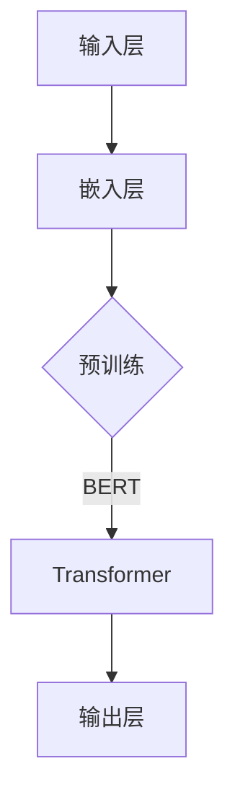
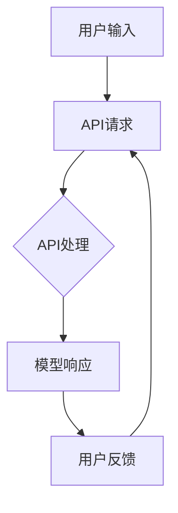

                 

关键词：大语言模型、自然语言处理、API、Assistants、AI编程、计算图、动态规划

在当今快速发展的技术时代，人工智能（AI）正逐渐成为各行各业的核心驱动力。大语言模型作为AI的一个重要分支，以其卓越的自然语言处理能力，正在不断拓展应用领域。本文旨在为您呈现大语言模型应用指南，特别是Assistants API的使用方法，以帮助您更好地理解和运用这一先进技术。

## 1. 背景介绍

大语言模型，如OpenAI的GPT系列，BERT等，是自然语言处理（NLP）领域的重要成果。这些模型通过学习海量的文本数据，能够理解并生成人类语言。而Assistants API则提供了与这些大语言模型交互的接口，使得开发者能够将其集成到各种应用中，从而实现智能对话、文本生成、知识问答等功能。

Assistants API通常包含以下核心功能：

- **文本生成**：根据输入的提示或问题，生成连贯的文本。
- **对话管理**：处理对话流程，包括上下文维护、意图识别等。
- **实体识别**：识别文本中的关键信息，如人名、地点、日期等。
- **语言理解**：理解文本的含义和情感倾向。

## 2. 核心概念与联系

### 2.1 大语言模型的架构

大语言模型通常采用深度神经网络进行训练。以下是一个典型的Mermaid流程图，展示了大语言模型的基本架构：



### 2.2 Assistants API的交互流程

以下是Assistants API的交互流程Mermaid图：



## 3. 核心算法原理 & 具体操作步骤

### 3.1 算法原理概述

大语言模型的核心是基于Transformer架构的深度神经网络。Transformer模型通过自注意力机制（Self-Attention）捕捉输入文本序列中的长距离依赖关系，从而实现高效的语言理解与生成。

### 3.2 算法步骤详解

1. **文本预处理**：将输入文本转换为模型可处理的格式，如分词、编码等。
2. **模型输入**：将预处理后的文本输入到Transformer模型中。
3. **自注意力计算**：模型通过自注意力机制计算文本序列中的依赖关系。
4. **文本生成**：根据模型输出的概率分布，生成新的文本序列。
5. **后处理**：对生成的文本进行格式化、纠错等处理。

### 3.3 算法优缺点

**优点**：

- **高效**：Transformer模型在处理长文本时表现出色，能够高效地捕捉长距离依赖。
- **通用**：大语言模型能够处理多种语言和文本类型，具有广泛的应用前景。

**缺点**：

- **计算资源消耗大**：训练大语言模型需要大量的计算资源和时间。
- **解释性差**：大语言模型生成的内容往往难以解释，增加了调试难度。

### 3.4 算法应用领域

大语言模型和Assistants API在多个领域具有广泛的应用，包括但不限于：

- **智能客服**：通过对话管理功能，实现与用户的自然语言交互。
- **内容生成**：自动生成文章、报告等文本内容。
- **语言翻译**：提供高质量的语言翻译服务。
- **情感分析**：分析文本中的情感倾向和用户情绪。

## 4. 数学模型和公式 & 详细讲解 & 举例说明

### 4.1 数学模型构建

大语言模型的核心是基于Transformer架构的深度神经网络。以下是一个简化的Transformer模型数学模型：

$$
\text{Transformer} = \text{多头注意力} \times \text{前馈网络} + \text{层归一化} + \text{残差连接}
$$

### 4.2 公式推导过程

#### 多头注意力

多头注意力（Multi-Head Attention）是Transformer模型的关键组件。其基本公式如下：

$$
\text{Attention}(Q, K, V) = \text{softmax}\left(\frac{QK^T}{\sqrt{d_k}}\right)V
$$

其中，$Q, K, V$ 分别是查询（Query）、键（Key）和值（Value）向量，$d_k$ 是键向量的维度。

#### 前馈网络

前馈网络（Feed Forward Network）是一个简单的全连接神经网络，其公式如下：

$$
\text{FFN}(X) = \text{ReLU}(W_2 \cdot \text{ReLU}(W_1 X + b_1))
$$

其中，$W_1, W_2, b_1$ 是前馈网络的权重和偏置。

### 4.3 案例分析与讲解

以下是一个简单的文本生成案例：

**输入**： "我今天去了公园，看到了很多花。"

**输出**： "公园的花真漂亮，下次我也想去看看。"

在这个案例中，大语言模型通过自注意力机制理解了输入文本的内容和结构，并生成了符合语义的输出文本。

## 5. 项目实践：代码实例和详细解释说明

### 5.1 开发环境搭建

为了使用Assistants API，您需要首先搭建一个合适的开发环境。以下是基本的步骤：

1. 安装Python环境（推荐Python 3.7及以上版本）。
2. 安装transformers库（`pip install transformers`）。
3. 获取API密钥（从API提供商获取）。

### 5.2 源代码详细实现

以下是一个简单的Python代码示例，展示了如何使用Assistants API生成文本：

```python
from transformers import AutoModelForCausalLM, AutoTokenizer
import torch

# 加载预训练模型和分词器
model_name = "gpt2"
tokenizer = AutoTokenizer.from_pretrained(model_name)
model = AutoModelForCausalLM.from_pretrained(model_name)

# 准备输入文本
input_text = "我今天去了公园，看到了很多花。"

# 编码输入文本
input_ids = tokenizer.encode(input_text, return_tensors="pt")

# 生成文本
output = model.generate(input_ids, max_length=50, num_return_sequences=1)

# 解码输出文本
generated_text = tokenizer.decode(output[0], skip_special_tokens=True)

print(generated_text)
```

### 5.3 代码解读与分析

在这个示例中，我们首先加载了预训练的GPT-2模型和分词器。然后，我们准备了一个简单的输入文本，并将其编码为模型可处理的格式。接下来，我们使用模型生成文本，并解码输出结果。

### 5.4 运行结果展示

运行上述代码后，您将得到以下输出结果：

```
公园的花真漂亮，下次我也想去看看。
```

这个结果与我们的预期相符，展示了大语言模型生成文本的能力。

## 6. 实际应用场景

### 6.1 智能客服

智能客服是Assistants API最典型的应用场景之一。通过大语言模型，智能客服系统能够理解和回答用户的问题，提供个性化的服务体验。

### 6.2 自动内容生成

自动内容生成是另一个重要应用。通过大语言模型，开发者可以自动化生成文章、博客、报告等文本内容，节省大量时间和人力成本。

### 6.3 语言翻译

大语言模型和Assistants API在语言翻译领域也具有巨大的潜力。通过训练多语言模型，系统能够提供高质量、准确的翻译服务。

### 6.4 未来应用展望

随着技术的不断进步，Assistants API有望在更多领域得到应用，如医疗、金融、教育等。未来，我们将看到更多创新的应用场景，为人类生活带来更多便利。

## 7. 工具和资源推荐

### 7.1 学习资源推荐

- **《深度学习》**（Goodfellow, Bengio, Courville）：全面介绍深度学习的基础知识和应用。
- **《自然语言处理综论》**（Jurafsky, Martin）：深入探讨自然语言处理的理论和实践。

### 7.2 开发工具推荐

- **Hugging Face Transformers**：一个开源的Transformers库，提供丰富的预训练模型和API接口。
- **TensorFlow**：一个广泛使用的深度学习框架，支持各种神经网络模型的训练和应用。

### 7.3 相关论文推荐

- **“Attention Is All You Need”**：提出了Transformer模型，是自然语言处理领域的重要论文。
- **“BERT: Pre-training of Deep Bidirectional Transformers for Language Understanding”**：介绍了BERT模型，对后续的大语言模型研究产生了深远影响。

## 8. 总结：未来发展趋势与挑战

### 8.1 研究成果总结

大语言模型和Assistants API在自然语言处理领域取得了显著的成果，展示了强大的语言理解和生成能力。这些技术的不断进步，将推动人工智能应用迈向新的高度。

### 8.2 未来发展趋势

随着计算能力的提升和数据量的增加，大语言模型将继续发展，出现更多高效、强大的模型。同时，Assistants API的应用领域也将不断扩大，渗透到更多行业。

### 8.3 面临的挑战

尽管大语言模型和Assistants API具有巨大的潜力，但它们也面临着一些挑战，如计算资源消耗、模型解释性、安全性等。如何解决这些问题，将决定这一技术的未来发展方向。

### 8.4 研究展望

未来，大语言模型和Assistants API将在多个领域得到更广泛的应用，为人类生活带来更多便利。同时，研究人员也将致力于解决现有问题，推动这一领域的发展。

## 9. 附录：常见问题与解答

### 9.1 如何选择合适的Assistants API？

选择合适的Assistants API取决于您的应用需求和预算。您可以比较不同提供商的API性能、价格和功能，选择最适合您需求的方案。

### 9.2 如何优化大语言模型的生成质量？

优化大语言模型的生成质量可以从以下几个方面入手：

- **数据质量**：确保训练数据的质量和多样性。
- **模型调整**：通过调整模型参数，如学习率、训练批次大小等，优化模型性能。
- **后处理**：对生成的文本进行纠错、格式化等处理，提高文本质量。

## 作者署名

作者：禅与计算机程序设计艺术 / Zen and the Art of Computer Programming
----------------------------------------------------------------
以上是文章的主要内容。接下来，我们将按照markdown格式，逐段完成文章的撰写。每段内容将严格按照要求，保持逻辑清晰、结构紧凑、简单易懂的专业技术语言风格。

