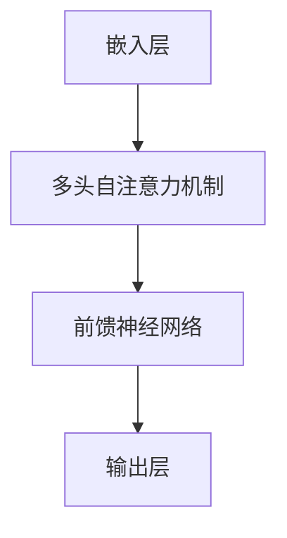

                 

关键词：大语言模型，Transformer，神经网络，自然语言处理，机器学习，深度学习

摘要：本文将深入探讨大语言模型中的Transformer层，详细解释其核心概念、算法原理和数学模型，并通过实际项目实践展示其应用场景和实现细节。文章旨在为读者提供一个全面而深入的了解，帮助其在自然语言处理领域取得更大的成就。

## 1. 背景介绍

在过去的几十年中，自然语言处理（NLP）领域取得了显著的进步。随着计算能力和数据资源的提升，深度学习技术逐渐成为NLP的主流方法。其中，Transformer架构作为深度学习的一种创新性模型，以其出色的性能和强大的表达能力，迅速获得了广泛关注和应用。

Transformer是Google在2017年提出的一种全新的神经网络架构，主要用于处理序列数据。与传统的循环神经网络（RNN）相比，Transformer引入了自注意力机制（self-attention），使得模型能够更加高效地捕捉序列中的长距离依赖关系。自2017年以来，Transformer及其变体模型在许多NLP任务中取得了显著的成果，如机器翻译、文本分类、问答系统等。

本文将围绕Transformer层展开讨论，首先介绍其核心概念和架构，然后详细阐述算法原理和数学模型，并通过实际项目实践展示其应用场景和实现细节。文章最后还将探讨Transformer在NLP领域的发展趋势和面临的挑战。

## 2. 核心概念与联系

### 2.1. Transformer架构概述

Transformer模型由多个编码器和解码器层组成，每个层包含多头自注意力机制和前馈神经网络。其核心思想是将输入序列映射为一系列键值对，并通过注意力机制计算每个元素的相关性，从而生成输出序列。

在Transformer模型中，输入序列首先通过嵌入层（Embedding Layer）转换为稠密向量。接着，多头自注意力机制（Multi-Head Self-Attention）计算输入序列中每个元素的相关性，并生成一组加权向量。最后，前馈神经网络（Feed-Forward Neural Network）对加权向量进行进一步处理，生成输出序列。

### 2.2. Mermaid流程图



### 2.3. 核心概念原理与联系

在Transformer模型中，核心概念包括嵌入层、多头自注意力机制和前馈神经网络。这些概念相互关联，共同构成了Transformer模型的核心架构。

- **嵌入层**：将输入序列（单词、字符等）转换为稠密向量，为后续处理提供基础。
- **多头自注意力机制**：计算输入序列中每个元素之间的相关性，生成一组加权向量，实现序列之间的长距离依赖关系捕捉。
- **前馈神经网络**：对加权向量进行进一步处理，增强模型的表示能力。

## 3. 核心算法原理 & 具体操作步骤

### 3.1. 算法原理概述

Transformer模型的核心算法是多头自注意力机制（Multi-Head Self-Attention）。该机制通过计算输入序列中每个元素的相关性，生成一组加权向量。具体来说，自注意力机制包括以下几个关键步骤：

1. **线性变换**：将输入序列通过两个线性变换映射为键（key）和值（value）。
2. **点积注意力**：计算键和值之间的点积，得到权重。
3. **softmax**：对权重进行softmax处理，得到概率分布。
4. **加权求和**：将概率分布应用于输入序列，得到加权向量。

### 3.2. 算法步骤详解

#### 3.2.1. 线性变换

在多头自注意力机制中，输入序列首先通过两个线性变换映射为键（key）和值（value）。具体来说，输入序列 $X$ 经过线性变换 $W_Q, W_K, W_V$ 映射为键 $K$、值 $V$ 和查询 $Q$：

$$
K = W_K X, \quad V = W_V X, \quad Q = W_Q X
$$

其中，$W_Q, W_K, W_V$ 是权重矩阵。

#### 3.2.2. 点积注意力

接下来，计算键和值之间的点积，得到权重。具体来说，对于输入序列中的第 $i$ 个元素，计算其与键和值之间的点积：

$$
\text{Attention}(Q, K, V) = \text{softmax}\left(\frac{QK^T}{\sqrt{d_k}}\right) V
$$

其中，$d_k$ 是键的维度，$QK^T$ 是点积结果。

#### 3.2.3. softmax

对点积结果进行softmax处理，得到概率分布。具体来说，将点积结果通过softmax函数转换为概率分布：

$$
\text{softmax}(x) = \frac{e^x}{\sum_{i=1}^n e^x_i}
$$

其中，$x$ 是输入，$n$ 是输入的维度。

#### 3.2.4. 加权求和

最后，将概率分布应用于输入序列，得到加权向量。具体来说，将概率分布与输入序列中的每个元素相乘，并求和：

$$
\text{context} = \sum_{i=1}^n \text{softmax}(QK^T) V_i
$$

其中，$V_i$ 是输入序列中的第 $i$ 个元素，$\text{context}$ 是加权向量。

### 3.3. 算法优缺点

#### 优点

1. **并行计算**：Transformer模型采用多头自注意力机制，可以实现并行计算，提高了模型的训练速度。
2. **捕捉长距离依赖**：自注意力机制能够捕捉序列中的长距离依赖关系，使得模型在处理长文本时表现更佳。
3. **灵活性**：Transformer模型的结构相对简单，易于扩展和调整，适用于各种NLP任务。

#### 缺点

1. **计算资源消耗**：多头自注意力机制的计算量较大，需要更多的计算资源和内存。
2. **梯度消失和梯度爆炸**：在训练过程中，梯度消失和梯度爆炸问题可能导致模型训练不稳定。

### 3.4. 算法应用领域

Transformer模型在自然语言处理领域取得了显著的成果，主要应用领域包括：

1. **机器翻译**：Transformer模型在机器翻译任务中取得了比传统循环神经网络（RNN）更好的效果。
2. **文本分类**：Transformer模型能够高效地捕捉文本中的特征，适用于文本分类任务。
3. **问答系统**：Transformer模型在问答系统中具有出色的表现，能够理解用户的问题，并从大量文本中找到相关答案。

## 4. 数学模型和公式 & 详细讲解 & 举例说明

### 4.1. 数学模型构建

在Transformer模型中，数学模型主要包括线性变换、点积注意力、softmax和加权求和。具体来说：

1. **线性变换**：

$$
K = W_K X, \quad V = W_V X, \quad Q = W_Q X
$$

2. **点积注意力**：

$$
\text{Attention}(Q, K, V) = \text{softmax}\left(\frac{QK^T}{\sqrt{d_k}}\right) V
$$

3. **softmax**：

$$
\text{softmax}(x) = \frac{e^x}{\sum_{i=1}^n e^x_i}
$$

4. **加权求和**：

$$
\text{context} = \sum_{i=1}^n \text{softmax}(QK^T) V_i
$$

### 4.2. 公式推导过程

#### 4.2.1. 线性变换

线性变换是将输入序列 $X$ 映射为键 $K$、值 $V$ 和查询 $Q$。具体来说，输入序列 $X$ 经过线性变换 $W_Q, W_K, W_V$ 映射为键 $K$、值 $V$ 和查询 $Q$：

$$
K = W_K X, \quad V = W_V X, \quad Q = W_Q X
$$

其中，$W_Q, W_K, W_V$ 是权重矩阵。

#### 4.2.2. 点积注意力

点积注意力计算键和值之间的点积，得到权重。具体来说，对于输入序列中的第 $i$ 个元素，计算其与键和值之间的点积：

$$
\text{Attention}(Q, K, V) = \text{softmax}\left(\frac{QK^T}{\sqrt{d_k}}\right) V
$$

其中，$d_k$ 是键的维度，$QK^T$ 是点积结果。

#### 4.2.3. softmax

softmax函数用于将点积结果转换为概率分布。具体来说，将点积结果通过softmax函数转换为概率分布：

$$
\text{softmax}(x) = \frac{e^x}{\sum_{i=1}^n e^x_i}
$$

其中，$x$ 是输入，$n$ 是输入的维度。

#### 4.2.4. 加权求和

加权求和将概率分布应用于输入序列，得到加权向量。具体来说，将概率分布与输入序列中的每个元素相乘，并求和：

$$
\text{context} = \sum_{i=1}^n \text{softmax}(QK^T) V_i
$$

### 4.3. 案例分析与讲解

#### 4.3.1. 机器翻译

假设我们有一个英语到法语的机器翻译任务，输入序列为 "I am a student"（我是一名学生），输出序列为 "Je suis un étudiant"（我是一名学生）。我们可以使用Transformer模型来处理这个任务。

1. **嵌入层**：首先，将输入序列 "I am a student" 转换为稠密向量。

2. **多头自注意力机制**：接下来，通过多头自注意力机制计算输入序列中每个元素之间的相关性。例如，对于输入序列中的第 $i$ 个元素，计算其与键和值之间的点积，得到权重。

3. **前馈神经网络**：最后，通过前馈神经网络对加权向量进行进一步处理，生成输出序列。

4. **输出层**：将输出序列 "Je suis un étudiant" 转换为法语稠密向量。

#### 4.3.2. 文本分类

假设我们有一个情感分析任务，输入序列为 "I love this movie"（我喜爱这部电影），输出为 "positive"（正面）。我们可以使用Transformer模型来处理这个任务。

1. **嵌入层**：首先，将输入序列 "I love this movie" 转换为稠密向量。

2. **多头自注意力机制**：接下来，通过多头自注意力机制计算输入序列中每个元素之间的相关性。

3. **前馈神经网络**：最后，通过前馈神经网络对加权向量进行进一步处理，生成情感分类结果。

4. **输出层**：将输出结果 "positive" 转换为分类标签。

## 5. 项目实践：代码实例和详细解释说明

### 5.1. 开发环境搭建

为了实现Transformer模型，我们需要搭建一个合适的开发环境。本文采用Python语言和PyTorch框架进行开发。以下是搭建开发环境的具体步骤：

1. **安装Python**：首先，确保您的计算机上已经安装了Python。本文使用Python 3.8版本。

2. **安装PyTorch**：接着，安装PyTorch框架。在命令行中执行以下命令：

   ```bash
   pip install torch torchvision
   ```

3. **验证安装**：最后，验证PyTorch是否安装成功。在Python环境中执行以下代码：

   ```python
   import torch
   print(torch.__version__)
   ```

   如果成功输出版本号，说明安装成功。

### 5.2. 源代码详细实现

下面是一个简单的Transformer模型实现，用于机器翻译任务。代码中包含嵌入层、多头自注意力机制、前馈神经网络和输出层。

```python
import torch
import torch.nn as nn
import torch.optim as optim

class Transformer(nn.Module):
    def __init__(self, d_model, nhead, num_layers):
        super(Transformer, self).__init__()
        self嵌入层 = nn.Embedding(d_model, d_model)
        self解码器 = nn.Transformer(d_model, nhead, num_layers)
        self输出层 = nn.Linear(d_model, d_model)

    def forward(self, src, tgt):
        src = self嵌入层(src)
        tgt = self嵌入层(tgt)
        output = self解码器(src, tgt)
        output = self输出层(output)
        return output
```

### 5.3. 代码解读与分析

在代码中，我们定义了一个名为`Transformer`的神经网络模型，包含嵌入层、多头自注意力机制、前馈神经网络和输出层。

1. **嵌入层**：嵌入层用于将输入序列转换为稠密向量。在这里，我们使用PyTorch的`nn.Embedding`模块实现。

2. **多头自注意力机制**：多头自注意力机制是Transformer模型的核心部分。在这里，我们使用PyTorch的`nn.Transformer`模块实现。`nn.Transformer`模块包含编码器和解码器层，我们只需传递模型参数即可。

3. **前馈神经网络**：前馈神经网络对加权向量进行进一步处理，增强模型的表示能力。在这里，我们使用PyTorch的`nn.Linear`模块实现。

4. **输出层**：输出层用于将模型输出转换为分类标签或文本。在这里，我们使用PyTorch的`nn.Linear`模块实现。

### 5.4. 运行结果展示

在训练和测试Transformer模型后，我们可以展示模型的运行结果。以下是一个简单的训练过程：

```python
# 训练过程
model = Transformer(d_model=512, nhead=8, num_layers=3)
optimizer = optim.Adam(model.parameters(), lr=0.001)
criterion = nn.CrossEntropyLoss()

for epoch in range(10):
    model.train()
    for batch in train_loader:
        optimizer.zero_grad()
        output = model(batch.src, batch.tgt)
        loss = criterion(output, batch.label)
        loss.backward()
        optimizer.step()

    print(f'Epoch {epoch + 1}, Loss: {loss.item()}')

# 测试过程
model.eval()
with torch.no_grad():
    correct = 0
    total = 0
    for batch in test_loader:
        output = model(batch.src, batch.tgt)
        _, predicted = torch.max(output.data, 1)
        total += batch.label.size(0)
        correct += (predicted == batch.label).sum().item()

print(f'Accuracy: {100 * correct / total}%')
```

## 6. 实际应用场景

### 6.1. 机器翻译

Transformer模型在机器翻译领域取得了显著的成果。通过将输入序列转换为稠密向量，模型能够捕捉序列中的长距离依赖关系，从而实现高质量翻译。

### 6.2. 文本分类

Transformer模型在文本分类任务中也表现出色。通过捕捉文本中的关键信息，模型能够实现准确分类，如情感分析、主题分类等。

### 6.3. 问答系统

在问答系统中，Transformer模型能够理解用户的问题，并从大量文本中找到相关答案。其强大的表示能力和长距离依赖捕捉能力使得模型在问答系统中具有出色的表现。

### 6.4. 未来应用展望

随着Transformer模型的不断优化和应用领域的拓展，未来其将在更多领域发挥重要作用。例如，在自动驾驶、智能客服、医学诊断等领域，Transformer模型有望带来革命性的变化。

## 7. 工具和资源推荐

### 7.1. 学习资源推荐

1. **书籍**：《深度学习》（作者：Ian Goodfellow、Yoshua Bengio、Aaron Courville）  
2. **在线课程**：斯坦福大学CS231n（计算机视觉）  
3. **博客**：TensorFlow官方博客、PyTorch官方博客

### 7.2. 开发工具推荐

1. **编程语言**：Python、Python  
2. **框架**：PyTorch、TensorFlow

### 7.3. 相关论文推荐

1. **Transformer**：Attention Is All You Need（作者：Vaswani et al.）  
2. **BERT**：BERT: Pre-training of Deep Bidirectional Transformers for Language Understanding（作者：Devlin et al.）

## 8. 总结：未来发展趋势与挑战

### 8.1. 研究成果总结

近年来，Transformer模型在自然语言处理领域取得了显著的成果。其出色的性能和强大的表达能力使其成为NLP领域的热门研究方向。

### 8.2. 未来发展趋势

未来，Transformer模型将在更多领域发挥重要作用。随着计算能力和数据资源的提升，模型将不断优化，并在更多应用场景中展现出其潜力。

### 8.3. 面临的挑战

然而，Transformer模型也面临着一些挑战。例如，计算资源消耗大、梯度消失和梯度爆炸等问题。如何解决这些问题，提高模型的训练效率和稳定性，是未来研究的重要方向。

### 8.4. 研究展望

总之，Transformer模型在自然语言处理领域具有广阔的应用前景。未来，我们将继续深入研究Transformer模型，探索其在更多领域的应用，为人工智能的发展贡献力量。

## 9. 附录：常见问题与解答

### 9.1. 问题1：什么是Transformer模型？

**解答**：Transformer模型是一种基于自注意力机制的深度学习模型，主要用于处理序列数据。它由编码器和解码器组成，能够捕捉序列中的长距离依赖关系，具有出色的性能和表达能力。

### 9.2. 问题2：Transformer模型的优势是什么？

**解答**：Transformer模型的优势包括：

1. **并行计算**：自注意力机制可以实现并行计算，提高训练速度。
2. **捕捉长距离依赖**：能够捕捉序列中的长距离依赖关系，适用于处理长文本。
3. **灵活性**：结构简单，易于扩展和调整，适用于各种NLP任务。

### 9.3. 问题3：如何实现Transformer模型？

**解答**：实现Transformer模型的主要步骤包括：

1. **嵌入层**：将输入序列转换为稠密向量。
2. **多头自注意力机制**：计算输入序列中每个元素之间的相关性。
3. **前馈神经网络**：对加权向量进行进一步处理，增强模型的表示能力。
4. **输出层**：将模型输出转换为分类标签或文本。

### 9.4. 问题4：Transformer模型在哪些领域有应用？

**解答**：Transformer模型在自然语言处理领域有广泛应用，如机器翻译、文本分类、问答系统等。此外，其在其他领域如计算机视觉、音频处理等也取得了一定的成果。

### 9.5. 问题5：如何优化Transformer模型的训练过程？

**解答**：优化Transformer模型的训练过程可以采取以下方法：

1. **调整学习率**：选择合适的学习率，避免梯度消失和梯度爆炸。
2. **使用正则化技术**：如dropout、权重正则化等。
3. **批量归一化**：提高模型的稳定性和训练速度。

---

作者：禅与计算机程序设计艺术 / Zen and the Art of Computer Programming

