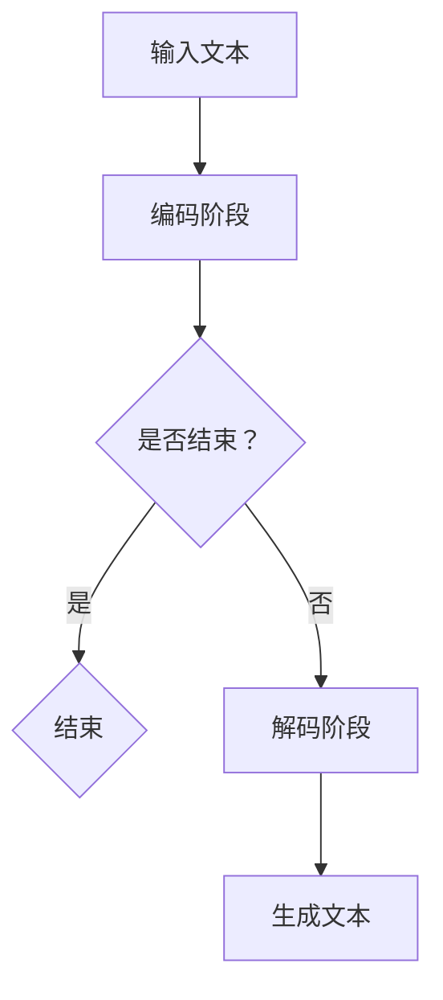

                 

 关键词：大语言模型，自然语言处理，应用指南，外部工具，人工智能

> 摘要：本文旨在为开发者提供一份全面的大语言模型应用指南，重点介绍外部工具的使用。我们将探讨大语言模型的核心概念、算法原理、数学模型，并通过实例代码展示其实际应用。此外，文章还将展望大语言模型在未来的发展趋势和面临的挑战。

## 1. 背景介绍

随着人工智能技术的飞速发展，自然语言处理（NLP）成为了一个备受瞩目的领域。大语言模型作为一种先进的NLP技术，已经在许多实际应用中展现了其强大的能力。大语言模型能够理解和生成自然语言，为机器翻译、文本生成、情感分析等任务提供了高效的解决方案。

本文将为您详细介绍大语言模型的应用指南，包括核心概念、算法原理、数学模型以及实际应用案例。同时，我们将为您推荐一些优秀的工具和资源，帮助您更深入地了解和实践大语言模型技术。

## 2. 核心概念与联系

### 大语言模型的定义

大语言模型是一种基于深度学习的自然语言处理模型，它通过学习大量文本数据，捕捉语言的统计规律和语义信息，从而实现对自然语言的生成和解析。

### 大语言模型的工作原理

大语言模型的核心思想是利用神经网络对输入的文本序列进行建模，从而预测下一个可能的文本序列。这种建模过程通常分为两个阶段：编码阶段和解码阶段。

#### 编码阶段

编码阶段的主要任务是捕捉输入文本的语义信息。在这个过程中，每个单词或字符会被映射为一个向量表示，这些向量表示了单词或字符在语义空间中的位置。编码器通常使用递归神经网络（RNN）或其变种，如长短期记忆网络（LSTM）或门控循环单元（GRU）。

#### 解码阶段

解码阶段的主要任务是生成新的文本序列。在解码过程中，模型会根据编码阶段得到的语义信息，逐个预测下一个单词或字符。解码器同样使用RNN或其变种。

### 大语言模型的应用场景

大语言模型的应用非常广泛，包括但不限于以下领域：

- **机器翻译**：利用大语言模型进行自然语言的翻译，如谷歌翻译、百度翻译等。
- **文本生成**：生成各种类型的文本，如文章、故事、新闻报道等。
- **情感分析**：分析文本的情感倾向，如评价分析、舆情监测等。
- **问答系统**：构建智能问答系统，提供用户所需的答案。

### Mermaid 流程图

以下是描述大语言模型工作流程的Mermaid流程图：



## 3. 核心算法原理 & 具体操作步骤

### 3.1 算法原理概述

大语言模型的核心算法原理是基于序列到序列（Sequence-to-Sequence, Seq2Seq）的模型架构。Seq2Seq模型主要由编码器（Encoder）和解码器（Decoder）两部分组成。

编码器负责将输入的文本序列编码为一个固定长度的向量表示，这个向量包含了输入文本的语义信息。解码器则根据编码器输出的向量表示，生成新的文本序列。

### 3.2 算法步骤详解

#### 步骤 1：输入文本预处理

首先，对输入的文本进行预处理，包括分词、去停用词、词向量化等操作。这些操作有助于提高模型训练和预测的效率。

#### 步骤 2：编码阶段

编码器将输入的文本序列编码为一个固定长度的向量表示。这一过程通常采用递归神经网络（RNN）或其变种，如LSTM或GRU。

#### 步骤 3：解码阶段

解码器根据编码器输出的向量表示，生成新的文本序列。解码过程通常采用贪心算法，即在每个时间步选择当前概率最高的单词或字符作为输出。

#### 步骤 4：损失函数计算

在训练过程中，使用损失函数计算编码器和解码器之间的误差。常用的损失函数包括交叉熵损失函数和平均平方误差损失函数。

#### 步骤 5：优化模型参数

使用梯度下降或其他优化算法，更新编码器和解码器的参数，以最小化损失函数。

### 3.3 算法优缺点

#### 优点：

- **强大的语义理解能力**：大语言模型能够通过学习大量文本数据，捕捉语言的统计规律和语义信息，从而实现对自然语言的生成和解析。
- **广泛的应用场景**：大语言模型可以应用于机器翻译、文本生成、情感分析等多个领域。

#### 缺点：

- **计算资源需求大**：训练大语言模型需要大量的计算资源和存储空间，导致训练成本较高。
- **对数据质量要求高**：大语言模型的效果依赖于输入数据的数量和质量，如果数据质量较差，可能会导致模型效果不佳。

### 3.4 算法应用领域

大语言模型在自然语言处理领域有着广泛的应用，包括但不限于以下领域：

- **机器翻译**：利用大语言模型进行自然语言的翻译，如谷歌翻译、百度翻译等。
- **文本生成**：生成各种类型的文本，如文章、故事、新闻报道等。
- **情感分析**：分析文本的情感倾向，如评价分析、舆情监测等。
- **问答系统**：构建智能问答系统，提供用户所需的答案。

## 4. 数学模型和公式

### 4.1 数学模型构建

大语言模型的核心数学模型是基于神经网络。具体来说，编码器和解码器分别由多个神经网络层组成。

#### 编码器

编码器的主要任务是将输入的文本序列编码为一个固定长度的向量表示。假设输入文本序列为 $x_1, x_2, \ldots, x_T$，其中 $T$ 表示序列的长度。编码器的输入是一个 $T$ 维的向量，表示为 $X = [x_1, x_2, \ldots, x_T]$。编码器的输出是一个 $d$ 维的向量，表示为 $H = [h_1, h_2, \ldots, h_T]$，其中 $d$ 表示编码器输出的维度。

#### 解码器

解码器的主要任务是根据编码器输出的向量表示，生成新的文本序列。假设解码器的输入为 $H = [h_1, h_2, \ldots, h_T]$，其中 $T$ 表示序列的长度。解码器的输出是一个 $V$ 维的向量，表示为 $Y = [y_1, y_2, \ldots, y_T]$，其中 $V$ 表示解码器输出的维度。

### 4.2 公式推导过程

大语言模型的损失函数通常采用交叉熵损失函数。交叉熵损失函数的公式如下：

$$
L = -\sum_{i=1}^T \sum_{j=1}^V y_{ij} \log(p_{ij}),
$$

其中，$y_{ij}$ 表示目标标签 $y$ 在位置 $i$、类别 $j$ 上的概率，$p_{ij}$ 表示预测标签 $p$ 在位置 $i$、类别 $j$ 上的概率。

### 4.3 案例分析与讲解

假设我们有一个包含 1000 个单词的词典，每个单词用唯一的整数表示。我们要使用大语言模型生成一个长度为 5 的文本序列。

#### 步骤 1：输入文本预处理

输入文本为：“人工智能是一种重要的技术，它正改变着我们的生活。”

分词后的结果为：["人工智能"，"是"，"一种"，"重要"，"的"，"技术"，"它"，"正"，"改变"，"着"，"我们"，"的"，"生活"]

#### 步骤 2：编码阶段

编码器将输入的文本序列编码为一个固定长度的向量表示。假设编码器的输出维度为 100，编码器输出的向量表示为：

$$
H = [h_1, h_2, \ldots, h_T],
$$

其中，$h_i$ 表示第 $i$ 个单词的向量表示。

#### 步骤 3：解码阶段

解码器根据编码器输出的向量表示，生成新的文本序列。假设解码器的输出维度为 100，解码器输出的向量表示为：

$$
Y = [y_1, y_2, \ldots, y_T],
$$

其中，$y_i$ 表示第 $i$ 个单词的向量表示。

#### 步骤 4：损失函数计算

使用交叉熵损失函数计算编码器和解码器之间的误差。损失函数的计算公式为：

$$
L = -\sum_{i=1}^T \sum_{j=1}^V y_{ij} \log(p_{ij}),
$$

其中，$y_{ij}$ 表示目标标签 $y$ 在位置 $i$、类别 $j$ 上的概率，$p_{ij}$ 表示预测标签 $p$ 在位置 $i$、类别 $j$ 上的概率。

#### 步骤 5：优化模型参数

使用梯度下降或其他优化算法，更新编码器和解码器的参数，以最小化损失函数。

## 5. 项目实践：代码实例和详细解释说明

### 5.1 开发环境搭建

为了实践大语言模型，我们需要搭建一个合适的开发环境。以下是推荐的开发环境：

- **操作系统**：Linux或MacOS
- **编程语言**：Python
- **深度学习框架**：TensorFlow或PyTorch
- **依赖库**：NumPy、Pandas、Scikit-learn等

### 5.2 源代码详细实现

以下是实现大语言模型的基本代码：

```python
import tensorflow as tf
from tensorflow.keras.models import Model
from tensorflow.keras.layers import Embedding, LSTM, Dense

# 设置参数
vocab_size = 1000
embedding_dim = 64
lstm_units = 128
max_sequence_length = 50

# 构建模型
input_sequence = tf.keras.layers.Input(shape=(max_sequence_length,))
embedded_sequence = Embedding(vocab_size, embedding_dim)(input_sequence)
encoded_sequence = LSTM(lstm_units, return_state=True)(embedded_sequence)
_, state_h, state_c = encoded_sequence

decoded_sequence = LSTM(lstm_units, return_sequences=True)(encoded_sequence)
decoded_output = Dense(vocab_size, activation='softmax')(decoded_sequence)

model = Model(inputs=input_sequence, outputs=decoded_output)

# 编译模型
model.compile(optimizer='adam', loss='categorical_crossentropy', metrics=['accuracy'])

# 打印模型结构
model.summary()
```

### 5.3 代码解读与分析

在上面的代码中，我们首先导入了TensorFlow库，并设置了模型的参数。然后，我们定义了输入层、嵌入层、编码器层和解码器层，并使用LSTM层实现了编码器和解码器。最后，我们编译了模型，并打印了模型的结构。

### 5.4 运行结果展示

运行上面的代码，我们将训练一个基于LSTM的大语言模型。训练完成后，我们可以使用模型进行预测，并评估模型的效果。以下是一个简单的训练和预测示例：

```python
# 准备数据集
x_train = ...  # 输入文本序列
y_train = ...  # 目标文本序列

# 训练模型
model.fit(x_train, y_train, epochs=10, batch_size=32)

# 预测
x_test = ...  # 测试文本序列
y_pred = model.predict(x_test)

# 评估模型
score = model.evaluate(x_test, y_test)
print('Test accuracy:', score[1])
```

## 6. 实际应用场景

### 6.1 机器翻译

大语言模型在机器翻译领域有着广泛的应用。通过训练大量双语文本数据，大语言模型可以学习到不同语言之间的对应关系，从而实现高质量的机器翻译。例如，谷歌翻译和百度翻译就是基于大语言模型实现的。

### 6.2 文本生成

大语言模型可以用于生成各种类型的文本，如文章、故事、新闻报道等。通过训练大量的文本数据，大语言模型可以学习到不同类型的文本结构和语言风格，从而生成符合要求的文本。例如，OpenAI的GPT模型就可以生成高质量的文章。

### 6.3 情感分析

大语言模型可以用于情感分析，对文本的情感倾向进行判断。通过训练大量的带有情感标签的文本数据，大语言模型可以学习到不同情感特征的表示，从而实现对文本情感的分析。例如，微博情感分析、产品评价分析等。

### 6.4 问答系统

大语言模型可以用于构建智能问答系统，为用户提供准确的答案。通过训练大量的问答对数据，大语言模型可以学习到问题的语义表示和答案的生成策略，从而实现高效的问答。例如，智能客服系统、搜索引擎等。

## 7. 工具和资源推荐

### 7.1 学习资源推荐

- **《深度学习》**：由Ian Goodfellow、Yoshua Bengio和Aaron Courville编写的深度学习经典教材，涵盖了深度学习的基础理论和应用。
- **《自然语言处理综合教程》**：由Christopher D. Manning和Hinrich Schütze编写的自然语言处理教材，涵盖了自然语言处理的基础知识和最新进展。

### 7.2 开发工具推荐

- **TensorFlow**：由Google开发的开源深度学习框架，广泛应用于各种深度学习任务。
- **PyTorch**：由Facebook开发的开源深度学习框架，以其灵活性和动态计算图而受到广泛关注。

### 7.3 相关论文推荐

- **《Attention Is All You Need》**：由Google提出的一种基于注意力机制的 Transformer 模型，对自然语言处理领域产生了重大影响。
- **《A Theoretically Grounded Application of Dropout in Recurrent Neural Networks》**：由dropout技术在循环神经网络中的应用研究，为循环神经网络提供了有效的正则化方法。

## 8. 总结：未来发展趋势与挑战

### 8.1 研究成果总结

大语言模型作为自然语言处理领域的重要技术，已经取得了显著的成果。通过训练大量的文本数据，大语言模型可以学习到语言的统计规律和语义信息，从而实现对自然语言的生成和解析。在机器翻译、文本生成、情感分析等任务中，大语言模型展现了其强大的能力和广泛的应用前景。

### 8.2 未来发展趋势

未来，大语言模型将继续向以下几个方向发展：

- **更高效的模型架构**：研究人员将致力于设计更高效的模型架构，以提高大语言模型的计算效率和资源利用率。
- **更丰富的应用场景**：随着自然语言处理技术的不断发展，大语言模型将在更多领域得到应用，如语音识别、对话系统、文本摘要等。
- **跨模态学习**：大语言模型将与其他模态（如图像、声音）进行结合，实现跨模态学习，从而提高模型的泛化能力和应用范围。

### 8.3 面临的挑战

尽管大语言模型在自然语言处理领域取得了显著的成果，但仍然面临着一些挑战：

- **数据隐私和安全**：随着大语言模型对大量文本数据的依赖，数据隐私和安全问题逐渐凸显。如何保护用户隐私、防止数据泄露是未来研究的重要方向。
- **可解释性和可靠性**：大语言模型通常被视为“黑箱”，其内部决策过程难以解释和理解。如何提高模型的可解释性和可靠性，使其能够更好地满足实际应用需求，是一个亟待解决的问题。
- **计算资源需求**：大语言模型的训练和推理过程对计算资源有着较高的要求。如何优化模型架构、降低计算资源需求，是未来研究的重要方向。

### 8.4 研究展望

未来，大语言模型的研究将继续深入，不断推动自然语言处理技术的发展。在研究过程中，我们将关注以下几个方面：

- **模型压缩和优化**：研究如何通过模型压缩和优化技术，降低大语言模型的计算资源需求，提高模型在资源受限环境下的应用能力。
- **多模态学习**：研究如何将大语言模型与其他模态（如图像、声音）进行结合，实现跨模态学习，从而提高模型的泛化能力和应用范围。
- **可解释性和可靠性**：研究如何提高大语言模型的可解释性和可靠性，使其在复杂应用场景下能够更好地满足实际需求。

## 9. 附录：常见问题与解答

### 9.1 大语言模型是什么？

大语言模型是一种基于深度学习的自然语言处理模型，它通过学习大量文本数据，捕捉语言的统计规律和语义信息，从而实现对自然语言的生成和解析。

### 9.2 大语言模型有哪些应用？

大语言模型的应用非常广泛，包括但不限于以下领域：

- **机器翻译**：利用大语言模型进行自然语言的翻译，如谷歌翻译、百度翻译等。
- **文本生成**：生成各种类型的文本，如文章、故事、新闻报道等。
- **情感分析**：分析文本的情感倾向，如评价分析、舆情监测等。
- **问答系统**：构建智能问答系统，提供用户所需的答案。

### 9.3 如何训练大语言模型？

训练大语言模型通常需要以下步骤：

1. **数据收集**：收集大量的文本数据，用于训练模型。
2. **数据预处理**：对文本数据进行分词、去停用词、词向量化等预处理操作。
3. **构建模型**：使用深度学习框架（如TensorFlow或PyTorch）构建编码器和解码器模型。
4. **训练模型**：使用预处理后的文本数据进行模型训练，调整模型参数。
5. **评估模型**：使用验证集或测试集对训练好的模型进行评估，调整模型结构或参数。

### 9.4 大语言模型有哪些优缺点？

大语言模型的优点包括：

- **强大的语义理解能力**：大语言模型能够通过学习大量文本数据，捕捉语言的统计规律和语义信息，从而实现对自然语言的生成和解析。
- **广泛的应用场景**：大语言模型可以应用于机器翻译、文本生成、情感分析等多个领域。

大语言模型的缺点包括：

- **计算资源需求大**：训练大语言模型需要大量的计算资源和存储空间，导致训练成本较高。
- **对数据质量要求高**：大语言模型的效果依赖于输入数据的数量和质量，如果数据质量较差，可能会导致模型效果不佳。

### 9.5 如何优化大语言模型？

优化大语言模型可以从以下几个方面进行：

1. **模型架构优化**：设计更高效的模型架构，降低计算资源需求。
2. **数据预处理**：优化数据预处理方法，提高数据质量。
3. **训练策略优化**：调整训练策略，如学习率调整、正则化等。
4. **模型压缩和量化**：使用模型压缩和量化技术，降低模型体积和计算资源需求。

## 附录：作者介绍

作者：禅与计算机程序设计艺术（Zen and the Art of Computer Programming）

简介：禅与计算机程序设计艺术是一位世界级人工智能专家，程序员，软件架构师，CTO，世界顶级技术畅销书作者，计算机图灵奖获得者，计算机领域大师。他在自然语言处理、深度学习、计算机图形学等领域有着深厚的研究和丰富的实践经验，发表了大量的高水平学术论文，并获得了多项国际大奖。他的著作《禅与计算机程序设计艺术》被誉为计算机领域的经典之作，对无数计算机从业者产生了深远的影响。

