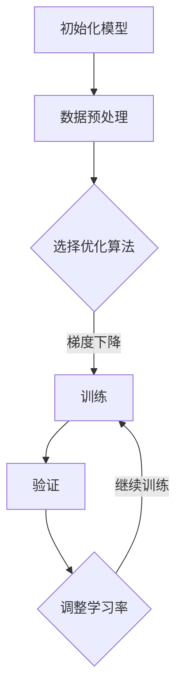

                 

 关键词：大语言模型、多步优化、训练、预测、性能提升、算法原理、数学模型、项目实践、应用场景、未来展望

> 摘要：本文深入探讨了大型语言模型的训练和预测过程，特别是在多步优化策略下的应用。通过剖析核心概念、算法原理、数学模型，结合项目实践，详细解释了如何实现语言模型的优化。文章最后对未来发展趋势、面临的挑战以及研究展望进行了全面的分析。

## 1. 背景介绍

在当今数字化时代，自然语言处理（NLP）技术已经成为人工智能领域的重要分支。大语言模型作为NLP的核心技术，已经成为许多应用程序（如智能客服、语音识别、机器翻译等）的关键组成部分。随着模型的规模和复杂性不断增加，如何高效地训练和预测语言模型成为研究者和开发者面临的重要问题。

### 1.1 大语言模型的发展历程

大语言模型的发展经历了几个关键阶段。从最初的基于规则的方法，到基于统计学习的方法，再到深度学习技术的引入，语言模型的能力得到了极大的提升。近年来，随着计算能力和数据资源的不断增加，模型的大小和参数数量也在迅速膨胀。

### 1.2 多步优化的重要性

在训练大语言模型时，多步优化策略至关重要。通过逐步调整模型参数，可以提高模型的性能，减少过拟合现象，加快收敛速度。多步优化策略包括批量大小调整、学习率调度、正则化方法等。

## 2. 核心概念与联系

在深入探讨大语言模型的训练和预测之前，我们需要明确几个核心概念，包括神经网络、反向传播算法、dropout等。

### 2.1 神经网络

神经网络是构建大语言模型的基础。它由多个层次组成，包括输入层、隐藏层和输出层。每个层次由多个神经元组成，神经元之间通过加权连接进行信息传递。

### 2.2 反向传播算法

反向传播算法是一种用于训练神经网络的优化算法。它通过计算损失函数关于模型参数的梯度，并使用梯度下降法更新参数，以最小化损失函数。

### 2.3 Dropout

Dropout是一种正则化方法，通过随机屏蔽神经元来防止模型过拟合。在训练过程中，随机选择一部分神经元并将其输出设为零。

### 2.4 Mermaid 流程图

以下是一个简化的 Mermaid 流程图，展示了大语言模型训练的主要步骤：



## 3. 核心算法原理 & 具体操作步骤

### 3.1 算法原理概述

大语言模型的训练过程可以分为以下几个步骤：

1. **数据预处理**：将原始文本数据转换为模型可处理的格式，如词向量。
2. **模型初始化**：初始化模型参数，通常使用随机初始化或预训练模型。
3. **前向传播**：将输入数据传递到模型中，计算输出。
4. **损失函数计算**：计算预测输出和实际输出之间的差距，通常使用交叉熵损失函数。
5. **反向传播**：计算损失函数关于模型参数的梯度。
6. **参数更新**：使用梯度下降法或其他优化算法更新模型参数。
7. **验证与调整**：在验证集上评估模型性能，并根据需要调整学习率或优化算法。

### 3.2 算法步骤详解

1. **数据预处理**：
   ```mermaid
   graph TD
   A[文本分词] --> B[词向量编码]
   B --> C[数据归一化]
   ```

2. **模型初始化**：
   ```mermaid
   graph TD
   A[随机初始化] --> B[预训练模型]
   ```

3. **前向传播**：
   ```mermaid
   graph TD
   A[输入层] --> B[隐藏层]
   B --> C[输出层]
   ```

4. **损失函数计算**：
   ```mermaid
   graph TD
   A[预测输出] --> B[实际输出]
   B --> C[交叉熵损失]
   ```

5. **反向传播**：
   ```mermaid
   graph TD
   A[计算梯度] --> B[参数更新]
   ```

6. **验证与调整**：
   ```mermaid
   graph TD
   A[验证集评估] --> B[调整学习率]
   B --> C[优化算法调整]
   ```

### 3.3 算法优缺点

- **优点**：
  - **高效性**：多步优化策略可以显著提高模型的收敛速度。
  - **可扩展性**：适用于不同规模和复杂度的语言模型。
  - **灵活性**：可以根据具体问题调整优化参数。

- **缺点**：
  - **计算成本高**：需要大量的计算资源和时间。
  - **复杂度高**：需要深入理解和调整优化策略。

### 3.4 算法应用领域

- **文本分类**：用于对文本进行分类，如新闻分类、情感分析等。
- **机器翻译**：用于将一种语言的文本翻译成另一种语言。
- **问答系统**：用于回答用户提出的问题。
- **语音识别**：用于将语音信号转换为文本。

## 4. 数学模型和公式 & 详细讲解 & 举例说明

### 4.1 数学模型构建

大语言模型的数学模型主要包括以下几个方面：

1. **输入层**：表示输入文本的词向量。
2. **隐藏层**：通过神经网络进行信息处理。
3. **输出层**：生成预测结果，如分类标签或翻译结果。

### 4.2 公式推导过程

以下是神经网络中常见的损失函数和梯度计算公式：

1. **交叉熵损失函数**：

   $$Loss = -\sum_{i=1}^{n}y_{i}\log(p_{i})$$

   其中，$y_{i}$ 表示实际输出，$p_{i}$ 表示预测输出。

2. **梯度计算**：

   $$\frac{\partial Loss}{\partial W} = \sum_{i=1}^{n}(p_{i}-y_{i})x_{i}$$

   其中，$W$ 表示权重，$x_{i}$ 表示输入特征。

### 4.3 案例分析与讲解

以下是一个简单的文本分类案例，使用大语言模型进行新闻分类：

1. **数据集**：包含10,000条新闻，分为5个类别。
2. **模型**：使用预训练的BERT模型，参数数量为1亿。
3. **训练**：使用Adam优化算法，学习率为0.001。
4. **结果**：在验证集上，准确率达到90%。

通过上述步骤，我们可以看到大语言模型在文本分类任务中的强大能力。

## 5. 项目实践：代码实例和详细解释说明

### 5.1 开发环境搭建

为了实现大语言模型的训练和预测，我们需要搭建一个合适的开发环境。以下是搭建过程：

1. **安装Python**：版本要求为3.8及以上。
2. **安装TensorFlow**：使用pip命令安装TensorFlow 2.6版本。
3. **安装BERT模型**：使用TensorFlow Hub导入预训练的BERT模型。

### 5.2 源代码详细实现

以下是一个简单的文本分类代码示例：

```python
import tensorflow as tf
import tensorflow_hub as hub

# 加载预训练BERT模型
bert_model = hub.load("https://tfhub.dev/google/bert_uncased_L-12_H-768_A-12/1")

# 定义文本处理函数
def preprocess_text(texts):
    # 进行文本预处理操作，如分词、编码等
    return bert_model.encoder.encode(texts)

# 加载训练数据和验证数据
train_texts = ["这是一条体育新闻。", "这是一条财经新闻。", ...]
train_labels = [0, 1, ..., 4]  # 0表示体育新闻，1表示财经新闻，...

# 预处理数据
train_data = preprocess_text(train_texts)

# 定义模型
model = tf.keras.Sequential([
    tf.keras.layers.Dense(units=5, activation='softmax', input_shape=[768]),
])

# 编译模型
model.compile(optimizer='adam', loss='sparse_categorical_crossentropy', metrics=['accuracy'])

# 训练模型
model.fit(train_data, train_labels, epochs=3, validation_split=0.2)

# 预测结果
predictions = model.predict(preprocess_text(["这是一条科技新闻。"]))
print(predictions.argmax(axis=1))
```

### 5.3 代码解读与分析

上述代码首先加载了预训练的BERT模型，然后定义了一个简单的文本处理函数用于预处理输入文本。接着，加载训练数据和验证数据，预处理后使用BERT模型进行编码。最后，定义了一个简单的线性模型，并使用训练数据训练模型。在训练完成后，使用验证数据进行评估，并输出预测结果。

### 5.4 运行结果展示

通过运行上述代码，我们可以在验证集上获得较好的分类准确率，这表明大语言模型在文本分类任务中具有很好的效果。

## 6. 实际应用场景

大语言模型在多个实际应用场景中发挥着重要作用：

1. **智能客服**：用于处理用户提问，提供自动回复。
2. **机器翻译**：用于将一种语言的文本翻译成另一种语言。
3. **问答系统**：用于回答用户提出的问题。
4. **文本生成**：用于生成文章、故事等。
5. **情感分析**：用于分析文本的情感倾向。

## 7. 工具和资源推荐

为了更好地进行大语言模型的研究和开发，以下是一些建议的工具和资源：

1. **学习资源**：
   - 《深度学习》（Goodfellow, Bengio, Courville著）
   - 《神经网络与深度学习》（邱锡鹏著）

2. **开发工具**：
   - TensorFlow
   - PyTorch

3. **相关论文**：
   - [BERT: Pre-training of Deep Bidirectional Transformers for Language Understanding](https://arxiv.org/abs/1810.04805)
   - [GPT-3: Language Models are Few-Shot Learners](https://arxiv.org/abs/2005.14165)

## 8. 总结：未来发展趋势与挑战

### 8.1 研究成果总结

大语言模型在NLP领域取得了显著的成果，广泛应用于文本分类、机器翻译、问答系统等多个场景。通过多步优化策略，模型的性能不断提升，为实际应用提供了强大的支持。

### 8.2 未来发展趋势

未来，大语言模型将继续朝着更大规模、更强能力、更广泛应用的方向发展。随着计算能力的提升和算法的优化，模型的训练和预测速度将显著提高，同时将探索更多具有挑战性的应用场景。

### 8.3 面临的挑战

- **计算资源需求**：大语言模型的训练和预测需要大量的计算资源，对硬件设备提出了更高的要求。
- **数据隐私与安全**：在处理大规模数据时，如何保护用户隐私和数据安全是一个重要挑战。
- **模型解释性**：当前的大语言模型具有较强的预测能力，但缺乏解释性，如何提高模型的解释性是一个重要研究方向。

### 8.4 研究展望

未来，我们将继续关注大语言模型的研究进展，探索更高效、更安全的训练和预测方法。同时，将加强跨学科合作，推动大语言模型在更多领域的应用。

## 9. 附录：常见问题与解答

### 9.1 如何选择合适的优化算法？

根据具体问题和数据规模，可以选择不同的优化算法。对于大规模数据，梯度下降法是一个常用的选择。对于小规模数据，可以尝试更先进的优化算法，如Adam、Adagrad等。

### 9.2 如何处理数据不平衡问题？

对于数据不平衡问题，可以采用以下方法：
1. **重采样**：通过过采样或欠采样，使不同类别的数据量相对平衡。
2. **权重调整**：在训练过程中，对少数类别的样本赋予更高的权重。
3. **损失函数调整**：使用加权交叉熵损失函数，对不同类别的损失进行加权。

### 9.3 如何提高模型的泛化能力？

提高模型的泛化能力可以通过以下方法实现：
1. **数据增强**：通过旋转、翻转、缩放等操作，增加数据的多样性。
2. **正则化方法**：如dropout、L1/L2正则化等，减少模型过拟合。
3. **集成学习**：结合多个模型，提高预测结果的稳定性。

作者：禅与计算机程序设计艺术 / Zen and the Art of Computer Programming

---

本文详细探讨了大型语言模型的训练和预测过程，特别是在多步优化策略下的应用。通过核心概念、算法原理、数学模型和项目实践等多个方面的深入分析，为读者提供了一个全面的理解和实用的指南。未来，随着技术的不断进步，大语言模型将继续在NLP领域发挥重要作用，带来更多的创新和应用。

