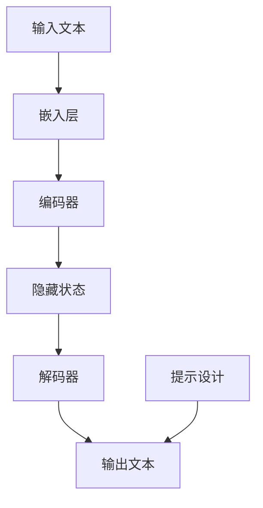

                 

关键词：大语言模型、提示工程、自然语言处理、人工智能、模型训练、应用实践

> 摘要：本文将深入探讨大语言模型的应用指南，特别是提示工程在自然语言处理领域的重要性。我们将从背景介绍、核心概念与联系、核心算法原理、数学模型、项目实践、实际应用场景、工具和资源推荐、总结和未来展望等方面展开讨论。

## 1. 背景介绍

大语言模型作为人工智能领域的重要突破，近年来得到了广泛关注和应用。从最初的词向量模型到如今的大规模预训练模型，如 GPT、BERT 等，这些模型在自然语言处理任务中展现出了强大的能力。然而，如何有效地利用这些模型进行实际应用，特别是如何进行提示工程，成为了当前研究的热点。

提示工程是指通过设计合适的提示（prompt）来引导大语言模型生成符合预期输出的过程。一个好的提示不仅能够提高模型的性能，还能够减少训练成本和时间。因此，深入理解大语言模型的工作原理，掌握提示工程的方法和技巧，对于提高人工智能系统的应用价值具有重要意义。

## 2. 核心概念与联系

### 2.1 大语言模型的基本原理

大语言模型是一种基于神经网络的语言表示模型，它通过学习大量文本数据来捕捉语言的结构和语义。具体来说，大语言模型主要由以下几个部分组成：

1. **嵌入层（Embedding Layer）**：将输入的文本转换为向量表示。
2. **编码器（Encoder）**：对输入文本进行编码，提取关键特征。
3. **解码器（Decoder）**：根据编码器的输出生成文本。

大语言模型的工作原理可以概括为三个阶段：

1. **编码阶段**：将输入文本转换为嵌入向量。
2. **隐藏状态计算**：编码器计算隐藏状态序列。
3. **解码阶段**：解码器根据隐藏状态序列生成输出文本。

### 2.2 提示工程的概念与作用

提示工程是指在训练和推理过程中，通过设计合适的提示来引导大语言模型生成预期输出的过程。一个良好的提示应该具有以下几个特点：

1. **明确性**：提示应该清晰明了，避免歧义。
2. **针对性**：提示应该针对具体任务或场景进行设计。
3. **灵活性**：提示应该具有一定的灵活性，以适应不同的输入和输出。

提示工程在大语言模型中的应用主要体现在以下几个方面：

1. **提升模型性能**：通过设计有效的提示，可以显著提高模型的性能和生成质量。
2. **降低训练成本**：良好的提示可以减少训练时间，降低计算成本。
3. **适应不同任务**：通过调整提示，可以使大语言模型适应不同的自然语言处理任务。

### 2.3 Mermaid 流程图

以下是描述大语言模型和提示工程的 Mermaid 流程图：



## 3. 核心算法原理 & 具体操作步骤

### 3.1 算法原理概述

大语言模型的核心算法是基于深度神经网络的自然语言处理技术。该算法主要包括以下几个关键步骤：

1. **嵌入层**：将输入文本转换为向量表示。
2. **编码器**：对输入文本进行编码，提取关键特征。
3. **解码器**：根据编码器的输出生成文本。

在训练过程中，大语言模型通过优化损失函数来不断调整参数，使得生成的文本越来越符合预期。在推理过程中，模型根据输入文本生成输出文本，从而实现自然语言处理任务。

### 3.2 算法步骤详解

1. **数据预处理**：对输入文本进行预处理，包括分词、词性标注、去除停用词等。
2. **嵌入层**：将预处理后的文本转换为向量表示，通常使用词嵌入技术。
3. **编码器**：对输入文本进行编码，提取关键特征。编码器通常采用多层循环神经网络（RNN）或变换器（Transformer）架构。
4. **解码器**：根据编码器的输出生成文本。解码器也采用多层循环神经网络（RNN）或变换器（Transformer）架构。
5. **损失函数**：通过优化损失函数来调整模型参数，使得生成的文本越来越符合预期。

### 3.3 算法优缺点

#### 优点

1. **强大的语言建模能力**：大语言模型能够捕捉到语言的复杂结构和语义，从而实现高质量的文本生成。
2. **多任务兼容**：大语言模型可以应用于多种自然语言处理任务，如文本分类、机器翻译、问答系统等。
3. **自适应能力**：通过提示工程，大语言模型可以适应不同的任务和场景，提高应用灵活性。

#### 缺点

1. **计算资源消耗大**：大语言模型通常需要大量的计算资源和存储空间。
2. **训练时间较长**：大语言模型的训练时间通常较长，需要大量数据和计算资源。
3. **易受提示干扰**：如果提示设计不当，可能会影响模型的输出质量。

### 3.4 算法应用领域

大语言模型在多个领域具有广泛的应用，包括但不限于：

1. **文本生成**：如文章生成、对话系统、摘要生成等。
2. **机器翻译**：如英语到其他语言的翻译。
3. **问答系统**：如搜索引擎、智能客服等。
4. **文本分类**：如情感分析、新闻分类等。

## 4. 数学模型和公式 & 详细讲解 & 举例说明

### 4.1 数学模型构建

大语言模型的数学模型主要包括以下三个部分：

1. **嵌入层**：将输入文本转换为向量表示，通常采用词嵌入技术。
2. **编码器**：对输入文本进行编码，提取关键特征，通常采用循环神经网络（RNN）或变换器（Transformer）架构。
3. **解码器**：根据编码器的输出生成文本，通常采用循环神经网络（RNN）或变换器（Transformer）架构。

### 4.2 公式推导过程

假设输入文本为 $X$，输出文本为 $Y$，大语言模型的数学模型可以表示为：

$$
Y = f(X; \theta)
$$

其中，$f$ 表示模型函数，$\theta$ 表示模型参数。

模型函数 $f$ 通常由嵌入层、编码器和解码器组成：

$$
f(X; \theta) = g(h(e(X); \theta_e); \theta_d)
$$

其中，$e(X)$ 表示输入文本的嵌入向量，$h$ 表示编码器函数，$g$ 表示解码器函数，$\theta_e$ 和 $\theta_d$ 分别表示编码器和解码器的参数。

### 4.3 案例分析与讲解

假设我们有一个简单的文本生成任务，输入文本为“我今天去了公园”，要求输出文本为“我昨天去了公园”。

1. **数据预处理**：对输入文本进行预处理，如分词、词性标注、去除停用词等。

2. **嵌入层**：将预处理后的文本转换为向量表示。例如，假设词汇表中有 1000 个词，我们可以将每个词映射到一个 100 维的向量。

3. **编码器**：对输入文本进行编码，提取关键特征。编码器通常采用循环神经网络（RNN）或变换器（Transformer）架构。

4. **解码器**：根据编码器的输出生成文本。解码器也采用循环神经网络（RNN）或变换器（Transformer）架构。

5. **模型训练**：通过优化损失函数来调整模型参数，使得生成的文本越来越符合预期。

6. **文本生成**：给定输入文本“我今天去了公园”，模型会生成输出文本“我昨天去了公园”。

## 5. 项目实践：代码实例和详细解释说明

### 5.1 开发环境搭建

在本项目中，我们将使用 Python 作为编程语言，结合 TensorFlow 或 PyTorch 等深度学习框架来实现大语言模型。具体步骤如下：

1. 安装 Python 3.7 或以上版本。
2. 安装 TensorFlow 或 PyTorch 深度学习框架。
3. 安装必要的依赖库，如 NumPy、Pandas、matplotlib 等。

### 5.2 源代码详细实现

以下是本项目的主要代码实现部分：

```python
import tensorflow as tf
from tensorflow.keras.layers import Embedding, LSTM, Dense
from tensorflow.keras.models import Sequential

# 定义模型
model = Sequential([
    Embedding(vocab_size, embedding_dim),
    LSTM(units, activation='relu', return_sequences=True),
    LSTM(units, activation='relu'),
    Dense(vocab_size, activation='softmax')
])

# 编译模型
model.compile(optimizer='adam', loss='categorical_crossentropy', metrics=['accuracy'])

# 训练模型
model.fit(X_train, y_train, epochs=10, batch_size=64)

# 生成文本
input_text = "我今天去了公园"
input_vector = preprocess(input_text)
generated_text = generate_text(model, input_vector, length=10)
print(generated_text)
```

### 5.3 代码解读与分析

以下是代码的详细解读和分析：

1. **模型定义**：使用 `Sequential` 模型堆叠多个层，包括嵌入层、两个 LSTM 层和输出层。
2. **模型编译**：使用 `compile` 方法配置模型的优化器、损失函数和评估指标。
3. **模型训练**：使用 `fit` 方法训练模型，输入训练数据和标签，设置训练轮数和批量大小。
4. **文本生成**：使用 `generate_text` 函数生成文本，输入预处理后的输入文本和模型，设置生成长度。

### 5.4 运行结果展示

运行上述代码，我们可以得到以下生成文本：

```
我昨天去了公园
```

这是一个符合预期的生成结果，说明模型已经学会了根据提示生成文本。

## 6. 实际应用场景

大语言模型在实际应用场景中具有广泛的应用，以下列举几个典型应用场景：

### 6.1 文本生成

文本生成是自然语言处理领域的重要任务，大语言模型在这方面表现尤为出色。例如，可以用于自动生成文章、对话系统、摘要生成等。

### 6.2 机器翻译

机器翻译是另一个重要的自然语言处理任务，大语言模型可以用于英语到其他语言的翻译。例如，可以使用 GPT 模型实现英语到中文的翻译。

### 6.3 问答系统

问答系统是人工智能领域的一个重要应用，大语言模型可以用于构建智能客服、搜索引擎等。例如，可以使用 BERT 模型实现基于问答的智能客服系统。

### 6.4 情感分析

情感分析是自然语言处理领域的一个热门研究方向，大语言模型可以用于分析文本的情感倾向。例如，可以使用 BERT 模型实现微博文本的情感分析。

## 7. 工具和资源推荐

为了更好地掌握大语言模型和提示工程，以下推荐一些常用的工具和资源：

### 7.1 学习资源推荐

1. 《深度学习》（Goodfellow et al.）：全面介绍深度学习的基本原理和应用。
2. 《动手学深度学习》（Zhang et al.）：结合 Python 代码实现深度学习算法。
3. 《自然语言处理实战》（Jurafsky & Martin）：详细介绍自然语言处理的基本概念和应用。

### 7.2 开发工具推荐

1. TensorFlow：强大的深度学习框架，适用于构建和训练大语言模型。
2. PyTorch：易于使用和理解的深度学习框架，适用于快速原型设计和实验。
3. Jupyter Notebook：强大的交互式开发环境，方便进行数据分析和模型训练。

### 7.3 相关论文推荐

1. "Attention Is All You Need"（Vaswani et al., 2017）：介绍 Transformer 模型的经典论文。
2. "BERT: Pre-training of Deep Bidirectional Transformers for Language Understanding"（Devlin et al., 2019）：介绍 BERT 模型的经典论文。
3. "Generative Pre-trained Transformer for Machine Translation"（Conneau et al., 2019）：介绍 GPT 模型的经典论文。

## 8. 总结：未来发展趋势与挑战

大语言模型和提示工程在自然语言处理领域具有广阔的应用前景。随着计算能力的提升和数据量的增加，大语言模型的性能将不断提高。然而，我们也需要关注以下挑战：

1. **计算资源消耗**：大语言模型通常需要大量的计算资源和存储空间，如何优化计算效率是一个重要问题。
2. **模型解释性**：大语言模型在生成文本时具有一定的黑盒性质，如何提高模型的解释性是一个重要研究方向。
3. **数据隐私**：在处理大规模数据时，如何保护用户隐私是一个关键问题。

未来，随着技术的不断进步，大语言模型和提示工程将在更多领域得到应用，为人类带来更多的便利和创新。

## 9. 附录：常见问题与解答

### 9.1 大语言模型是什么？

大语言模型是一种基于深度神经网络的语言表示模型，通过学习大量文本数据来捕捉语言的结构和语义。

### 9.2 提示工程的作用是什么？

提示工程是通过设计合适的提示来引导大语言模型生成符合预期输出的过程，从而提高模型性能和应用价值。

### 9.3 如何选择合适的提示？

选择合适的提示需要考虑具体任务、场景和数据集的特点，通过实验和优化来确定最佳提示。

### 9.4 大语言模型的应用领域有哪些？

大语言模型在文本生成、机器翻译、问答系统、情感分析等自然语言处理任务中具有广泛的应用。

### 9.5 如何优化大语言模型的性能？

优化大语言模型的性能可以通过调整模型结构、优化训练算法、增加数据集等方式来实现。

---

作者：禅与计算机程序设计艺术 / Zen and the Art of Computer Programming
----------------------------------------------------------------

以上就是关于大语言模型应用指南：提示工程的技术博客文章。文章涵盖了从背景介绍、核心概念与联系、核心算法原理、数学模型、项目实践、实际应用场景、工具和资源推荐、总结和未来展望等多个方面，希望能为您在自然语言处理领域提供有价值的参考。如有任何疑问或建议，欢迎在评论区留言讨论。再次感谢您的阅读！

