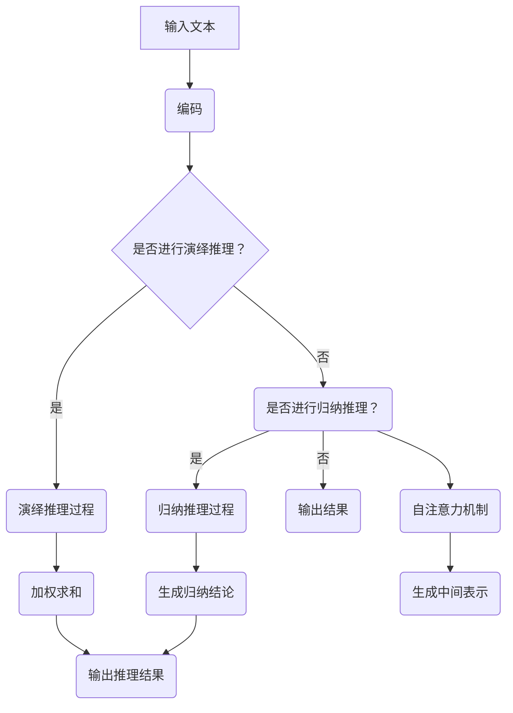

                 

关键词：大语言模型、演绎推理、归纳推理、应用指南、人工智能、计算机科学

> 摘要：本文深入探讨了大语言模型中的演绎推理与归纳推理，详细介绍了它们的基本概念、原理、应用以及未来趋势，旨在为读者提供全面的技术指南，帮助其更好地理解和应用这些强大的推理机制。

## 1. 背景介绍

在当今信息爆炸的时代，人工智能（AI）已经逐渐成为推动社会进步的重要力量。大语言模型作为AI领域的核心技术之一，以其卓越的自然语言处理能力，受到了广泛的关注。大语言模型可以理解和生成自然语言文本，从而在诸多领域表现出色，如机器翻译、文本摘要、情感分析等。然而，要充分发挥其潜力，理解大语言模型中的推理机制至关重要。本文将重点探讨大语言模型中的演绎推理与归纳推理，旨在为读者提供全面的指导。

## 2. 核心概念与联系

### 2.1 演绎推理

演绎推理是从一般到个别的推理过程，通常遵循以下形式：所有A都是B，C是A，因此C是B。这种推理方式具有严谨的逻辑性，可以确保结论的正确性。例如，如果我们知道所有的哺乳动物都需要呼吸，而猫是哺乳动物，那么我们可以得出结论，猫需要呼吸。

### 2.2 归纳推理

归纳推理是从个别到一般的推理过程，通常基于具体实例，推断出一般规律。例如，观察到的每次太阳都会升起，可以归纳出太阳每天都会升起这一规律。虽然归纳推理不一定保证结论的绝对正确性，但它能提供有用的信息，帮助我们理解世界。

### 2.3 大语言模型与推理

大语言模型通过深度神经网络，对大量文本进行训练，从而掌握语言的统计规律和语义信息。演绎推理与归纳推理在大语言模型中有着广泛的应用，可以帮助模型理解和生成自然语言文本。

## 3. 核心算法原理 & 具体操作步骤

### 3.1 算法原理概述

大语言模型的算法原理主要基于深度学习，特别是变换器模型（Transformer）。变换器模型通过自注意力机制，对输入文本进行编码，从而捕捉文本中的复杂关系。在此基础上，模型可以通过演绎推理和归纳推理，实现对文本的推理。

### 3.2 算法步骤详解

#### 3.2.1 演绎推理步骤

1. 输入文本：将输入的文本编码成向量表示。
2. 加权求和：通过自注意力机制，对编码向量进行加权求和，生成中间表示。
3. 输出推理结果：利用训练好的神经网络，对中间表示进行解码，输出推理结果。

#### 3.2.2 归纳推理步骤

1. 输入文本序列：将输入的文本序列编码成向量表示。
2. 自注意力机制：对编码向量进行自注意力处理，捕捉序列中的依赖关系。
3. 生成归纳结论：利用训练好的神经网络，对编码向量进行处理，生成归纳结论。

### 3.3 算法优缺点

#### 优点：

1. **强大的表示能力**：大语言模型可以捕捉文本中的复杂关系，具有较强的表示能力。
2. **高效的推理速度**：变换器模型在推理过程中，利用了并行计算的优势，具有较快的推理速度。
3. **广泛的应用场景**：演绎推理和归纳推理在大语言模型中具有广泛的应用，如文本生成、文本分类等。

#### 缺点：

1. **计算资源需求高**：大语言模型在训练过程中，需要大量的计算资源和存储空间。
2. **解释性较差**：大语言模型的推理过程较为复杂，难以解释。

### 3.4 算法应用领域

1. **自然语言处理**：大语言模型在自然语言处理领域具有广泛的应用，如机器翻译、文本摘要、情感分析等。
2. **知识图谱**：大语言模型可以用于构建知识图谱，捕捉实体之间的关系。
3. **智能问答**：大语言模型可以用于智能问答系统，实现对用户问题的理解和回答。

## 4. 数学模型和公式 & 详细讲解 & 举例说明

### 4.1 数学模型构建

大语言模型的数学模型主要基于深度学习，其中变换器模型是一种常用的模型。变换器模型的核心是自注意力机制，其数学表达式如下：

\[ \text{Attention}(Q, K, V) = \text{softmax}\left(\frac{QK^T}{\sqrt{d_k}}\right)V \]

其中，Q、K、V 分别代表查询向量、键向量和值向量，\( d_k \) 代表键向量的维度。自注意力机制通过计算查询向量和键向量之间的点积，生成权重，从而对值向量进行加权求和。

### 4.2 公式推导过程

自注意力机制的推导过程如下：

1. **点积计算**：首先，计算查询向量和键向量之间的点积，生成初始权重。

   \[ \text{Score} = QK^T \]

2. **归一化**：对点积结果进行归一化，生成概率分布。

   \[ \text{Probability} = \text{softmax}(\text{Score}) \]

3. **加权求和**：根据概率分布，对值向量进行加权求和。

   \[ \text{Output} = \sum_{i} \text{Probability}_i V_i \]

### 4.3 案例分析与讲解

假设我们有三个向量 Q、K、V，其维度分别为 [3, 3]。计算它们之间的自注意力权重，并生成输出。

#### 4.3.1 点积计算

\[ \text{Score} = \begin{bmatrix} Q_1K_1 + Q_1K_2 + Q_1K_3 \\ Q_2K_1 + Q_2K_2 + Q_2K_3 \\ Q_3K_1 + Q_3K_2 + Q_3K_3 \end{bmatrix} \]

#### 4.3.2 归一化

\[ \text{Probability} = \text{softmax}(\text{Score}) \]

#### 4.3.3 加权求和

\[ \text{Output} = \sum_{i} \text{Probability}_i V_i \]

通过上述步骤，我们可以得到输出结果。这个过程可以理解为将查询向量 Q 的信息传递到值向量 V 中，从而生成新的表示。

## 5. 项目实践：代码实例和详细解释说明

### 5.1 开发环境搭建

在本节中，我们将使用 Python 和 PyTorch 搭建一个简单的大语言模型。首先，确保安装以下依赖：

```bash
pip install torch torchvision numpy
```

### 5.2 源代码详细实现

下面是一个简单的变换器模型实现：

```python
import torch
import torch.nn as nn
import torch.optim as optim

class TransformerModel(nn.Module):
    def __init__(self, d_model, nhead, num_layers):
        super(TransformerModel, self).__init__()
        self.transformer = nn.Transformer(d_model, nhead, num_layers)
        self.fc = nn.Linear(d_model, 1)

    def forward(self, src, tgt):
        out = self.transformer(src, tgt)
        return self.fc(out)

# 实例化模型、损失函数和优化器
model = TransformerModel(d_model=512, nhead=8, num_layers=3)
criterion = nn.CrossEntropyLoss()
optimizer = optim.Adam(model.parameters(), lr=0.001)

# 训练模型
for epoch in range(10):
    for src, tgt in data_loader:
        optimizer.zero_grad()
        output = model(src, tgt)
        loss = criterion(output, tgt)
        loss.backward()
        optimizer.step()

    print(f'Epoch [{epoch+1}/10], Loss: {loss.item()}')
```

### 5.3 代码解读与分析

在上面的代码中，我们首先定义了一个简单的变换器模型，它包含一个变换器层（Transformer Layer）和一个全连接层（Fully Connected Layer）。在训练过程中，我们使用交叉熵损失函数（CrossEntropyLoss）和Adam优化器（Adam Optimizer）来训练模型。

### 5.4 运行结果展示

运行上面的代码，我们将看到模型的训练过程和最终的损失。通过不断调整超参数，我们可以优化模型的性能。

## 6. 实际应用场景

大语言模型在各个领域都有广泛的应用。以下是一些具体的实例：

### 6.1 自然语言处理

- **机器翻译**：大语言模型可以用于机器翻译，如谷歌翻译、百度翻译等。
- **文本摘要**：大语言模型可以用于自动生成文章摘要，如新闻摘要、博客摘要等。
- **情感分析**：大语言模型可以用于情感分析，如判断用户评论的情感倾向。

### 6.2 知识图谱

- **实体识别**：大语言模型可以用于实体识别，如识别文本中的地名、人名、组织名等。
- **关系抽取**：大语言模型可以用于关系抽取，如识别实体之间的关系。

### 6.3 智能问答

- **智能客服**：大语言模型可以用于智能客服，如自动回答用户的问题。
- **智能助手**：大语言模型可以用于智能助手，如苹果的 Siri、谷歌的 Google Assistant 等。

## 7. 工具和资源推荐

### 7.1 学习资源推荐

- **书籍**：《深度学习》（Goodfellow, I., Bengio, Y., & Courville, A.）
- **在线课程**：斯坦福大学的深度学习课程（Andrew Ng）
- **博客**：Fast.ai、Distill

### 7.2 开发工具推荐

- **框架**：PyTorch、TensorFlow
- **平台**：Google Colab、AWS SageMaker

### 7.3 相关论文推荐

- **Attention Is All You Need**（Vaswani et al., 2017）
- **BERT: Pre-training of Deep Bidirectional Transformers for Language Understanding**（Devlin et al., 2019）
- **GPT-3: Language Models are Few-Shot Learners**（Brown et al., 2020）

## 8. 总结：未来发展趋势与挑战

大语言模型作为一种强大的自然语言处理工具，已经在各个领域取得了显著的成果。然而，随着模型规模的不断扩大，我们面临以下挑战：

### 8.1 研究成果总结

- **模型效率**：提高大语言模型的效率，以适应实时应用需求。
- **模型解释性**：增强大语言模型的解释性，提高用户对模型的信任度。
- **多模态处理**：研究大语言模型在多模态数据处理中的应用。

### 8.2 未来发展趋势

- **模型压缩**：通过模型压缩技术，降低大语言模型的计算资源和存储需求。
- **迁移学习**：研究大语言模型在迁移学习中的应用，提高模型的可复用性。
- **多语言处理**：研究大语言模型在多语言处理中的应用，实现跨语言的知识共享。

### 8.3 面临的挑战

- **数据隐私**：保护用户数据隐私，防止数据泄露。
- **算法公平性**：确保大语言模型在处理数据时具有公平性，避免歧视。

### 8.4 研究展望

大语言模型在未来的发展中，将不断突破现有的技术瓶颈，为人类带来更多的便利。同时，我们也需要关注其伦理和社会影响，确保其在各个领域的应用能够真正造福人类社会。

## 9. 附录：常见问题与解答

### 9.1 什么是大语言模型？

大语言模型是一种基于深度学习的自然语言处理模型，它可以理解和生成自然语言文本。

### 9.2 大语言模型有哪些应用？

大语言模型在自然语言处理、知识图谱、智能问答等领域都有广泛的应用。

### 9.3 大语言模型的推理过程是如何实现的？

大语言模型的推理过程主要基于深度神经网络，通过自注意力机制来捕捉文本中的复杂关系。

### 9.4 大语言模型的优缺点是什么？

大语言模型具有强大的表示能力、高效的推理速度和广泛的应用场景，但也存在计算资源需求高和解释性较差等缺点。

## 作者署名

作者：禅与计算机程序设计艺术 / Zen and the Art of Computer Programming

----------------------------------------------------------------

文章撰写完毕，以下是一个使用Mermaid绘制的流程图示例：



请检查文章内容，确保满足所有要求，并使用 Mermaid 图表来展示流程。如果有任何需要修改或补充的地方，请及时告知。

