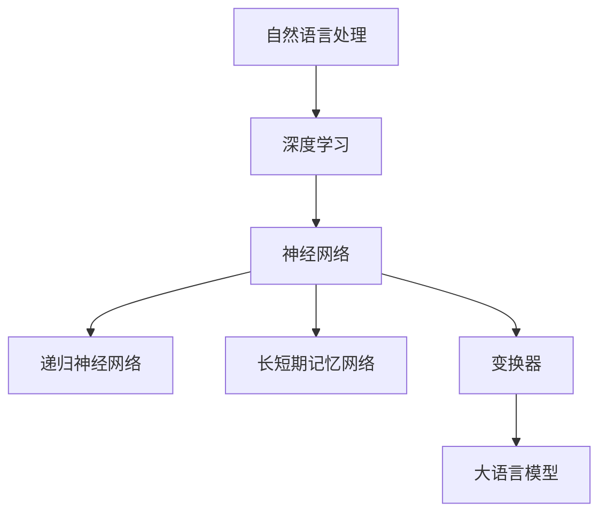

                 

关键词：大语言模型、神经网络、应用指南、编程、算法

> 摘要：本文旨在为广大程序员和AI爱好者提供一份全面的大语言模型应用指南，深入探讨神经网络的基础知识和应用。从理论到实践，从数学模型到代码实现，本文将帮助读者理解大语言模型的核心原理，并掌握其在实际项目中的应用技巧。

## 1. 背景介绍

大语言模型（Large Language Models）是近年来人工智能领域的重要突破。随着计算能力的提升和大数据的积累，深度学习技术逐渐成为解决自然语言处理（NLP）问题的重要手段。大语言模型通过对大量文本数据进行训练，能够生成高质量的自然语言文本，从而在机器翻译、文本摘要、问答系统等众多领域展现出了强大的应用潜力。

神经网络的兴起为解决复杂的问题提供了新的思路。与传统机器学习方法相比，神经网络通过模拟人脑的神经元连接结构，能够自适应地学习和提取特征，极大地提高了模型的性能和泛化能力。本文将围绕神经网络的基础知识，深入探讨其在自然语言处理中的应用。

## 2. 核心概念与联系

### 2.1 自然语言处理（NLP）

自然语言处理是计算机科学和人工智能领域的一个重要分支，旨在让计算机能够理解和处理人类自然语言。NLP的核心任务是使计算机能够从大量的自然语言文本中提取出有用的信息，并将其转化为计算机可以理解和处理的形式。

### 2.2 深度学习与神经网络

深度学习是一种基于神经网络的学习方法，通过多层神经元的非线性组合，能够从数据中自动提取特征，并实现复杂函数的逼近。神经网络是深度学习的基础，其结构包括输入层、隐藏层和输出层，通过前向传播和反向传播算法进行训练。

### 2.3 大语言模型

大语言模型是一种特殊的神经网络模型，通过对大量文本数据进行训练，能够生成高质量的文本。大语言模型通常采用递归神经网络（RNN）、长短期记忆网络（LSTM）或变换器（Transformer）等结构，其中Transformer结构因其并行计算能力和强大的表达能力，成为了当前大语言模型的主流架构。

### 2.4 Mermaid 流程图



## 3. 核心算法原理 & 具体操作步骤

### 3.1 算法原理概述

大语言模型的训练过程可以分为以下几个步骤：

1. 数据预处理：将原始文本数据转换为模型可以处理的格式，如词向量、序列编码等。
2. 模型初始化：初始化神经网络模型的权重和偏置，通常采用随机初始化或预训练模型。
3. 前向传播：输入文本序列，通过神经网络模型进行计算，得到输出。
4. 反向传播：计算输出与真实值之间的误差，并更新模型参数。
5. 模型优化：通过优化算法（如梯度下降、Adam优化器等）调整模型参数，减小误差。
6. 评估与调整：对训练好的模型进行评估，并根据评估结果调整模型参数。

### 3.2 算法步骤详解

#### 3.2.1 数据预处理

```markdown
数据预处理主要包括以下步骤：

1. 分词：将文本按照词语进行切分，得到单词序列。
2. 词向量化：将单词序列转换为词向量表示，常用的方法有Word2Vec、GloVe等。
3. 序列编码：将词向量序列编码为整数序列，便于神经网络处理。
```

#### 3.2.2 模型初始化

```markdown
模型初始化是随机给神经网络模型的权重和偏置分配初始值，常用的方法有：

1. 随机初始化：直接随机生成权重和偏置的值。
2. 预训练模型：使用已经训练好的模型作为初始化值，可以加快训练过程并提高模型性能。
```

#### 3.2.3 前向传播

```markdown
前向传播是指将输入数据通过神经网络模型进行计算，得到输出。具体步骤如下：

1. 输入数据：将预处理后的文本序列输入到神经网络中。
2. 神经元计算：通过神经元之间的连接，将输入数据传递到下一层。
3. 激活函数：使用激活函数（如ReLU、Sigmoid、Tanh等）对神经元输出进行非线性变换。
4. 输出计算：将最后一层神经元的输出作为模型的预测结果。
```

#### 3.2.4 反向传播

```markdown
反向传播是指计算输出与真实值之间的误差，并更新模型参数。具体步骤如下：

1. 计算误差：计算输出与真实值之间的差异。
2. 反向传播误差：将误差反向传播到前一层，更新前一层神经元的权重和偏置。
3. 参数更新：使用优化算法（如梯度下降、Adam优化器等）更新模型参数。
```

#### 3.2.5 模型优化

```markdown
模型优化是指通过调整模型参数，减小误差并提高模型性能。常用的优化算法有：

1. 梯度下降：根据误差的梯度方向，逐步调整模型参数。
2. Adam优化器：结合了梯度下降和自适应学习率的优点，适用于大规模训练。
```

#### 3.2.6 评估与调整

```markdown
评估与调整是指对训练好的模型进行评估，并根据评估结果调整模型参数。具体步骤如下：

1. 评估指标：常用的评估指标有准确率、召回率、F1值等。
2. 调整模型：根据评估结果，调整模型结构、参数或训练数据，以提高模型性能。
```

### 3.3 算法优缺点

#### 优点：

1. 强大的表达能力和泛化能力：大语言模型通过深度神经网络结构，能够自动提取特征并学习复杂的函数关系。
2. 高效的训练过程：大语言模型采用并行计算和分布式训练技术，能够在短时间内完成大规模训练。
3. 广泛的应用领域：大语言模型在自然语言处理、机器翻译、文本摘要、问答系统等领域取得了显著的成果。

#### 缺点：

1. 计算资源消耗大：大语言模型通常需要大量的计算资源和存储空间。
2. 数据依赖性强：大语言模型的性能与训练数据的数量和质量密切相关，缺乏高质量的训练数据可能导致模型效果不佳。
3. 黑箱化：大语言模型的内部结构复杂，难以解释和理解。

### 3.4 算法应用领域

大语言模型在自然语言处理领域具有广泛的应用，主要包括：

1. 机器翻译：大语言模型能够自动生成高质量的翻译结果，如Google翻译、DeepL翻译等。
2. 文本摘要：大语言模型能够提取文本的核心内容，生成简洁的摘要，如自动新闻摘要、文档摘要等。
3. 问答系统：大语言模型能够理解用户的问题，并生成准确的答案，如智能客服、智能问答等。
4. 文本生成：大语言模型能够根据给定的输入文本，生成新的文本，如文章生成、故事生成等。

## 4. 数学模型和公式 & 详细讲解 & 举例说明

### 4.1 数学模型构建

大语言模型的数学模型主要包括以下几个方面：

#### 4.1.1 词向量表示

词向量表示是将单词转换为向量的过程，常用的方法有Word2Vec、GloVe等。词向量表示能够将语义相似的单词映射到相邻的向量空间。

$$
\text{word\_vector}(w) = \sum_{i=1}^{N} w_i \cdot v_i
$$

其中，$w$ 表示单词，$v_i$ 表示单词 $w$ 的第 $i$ 个特征，$w_i$ 表示特征 $v_i$ 的权重。

#### 4.1.2 神经网络结构

大语言模型通常采用深度神经网络结构，包括输入层、隐藏层和输出层。隐藏层可以通过多个神经元实现非线性变换，从而提取文本的特征。

$$
\text{activation}(x) = \sigma(\text{weight} \cdot x + \text{bias})
$$

其中，$\sigma$ 表示激活函数，$\text{weight}$ 和 $\text{bias}$ 分别表示神经元的权重和偏置。

#### 4.1.3 损失函数

大语言模型的损失函数通常采用交叉熵损失函数，用于衡量模型预测结果与真实值之间的差距。

$$
\text{loss} = -\sum_{i=1}^{N} y_i \cdot \log(p_i)
$$

其中，$y_i$ 表示真实标签，$p_i$ 表示模型对第 $i$ 个样本的预测概率。

### 4.2 公式推导过程

#### 4.2.1 前向传播

前向传播是指将输入数据通过神经网络模型进行计算，得到输出。具体推导过程如下：

1. 输入层到隐藏层：

$$
z_i = \sum_{j=1}^{M} w_{ij} \cdot x_j + b_i
$$

$$
a_i = \sigma(z_i)
$$

其中，$x_j$ 表示输入层的第 $j$ 个特征，$w_{ij}$ 表示输入层到隐藏层的第 $i$ 个神经元的权重，$b_i$ 表示隐藏层的第 $i$ 个神经元的偏置，$\sigma$ 表示激活函数。

2. 隐藏层到输出层：

$$
z_o = \sum_{i=1}^{K} w_{io} \cdot a_i + b_o
$$

$$
p_o = \sigma(z_o)
$$

其中，$a_i$ 表示隐藏层的第 $i$ 个神经元的输出，$w_{io}$ 表示隐藏层到输出层的第 $i$ 个神经元的权重，$b_o$ 表示输出层的偏置，$\sigma$ 表示激活函数。

#### 4.2.2 反向传播

反向传播是指计算输出与真实值之间的误差，并更新模型参数。具体推导过程如下：

1. 计算输出层的误差：

$$
\delta_o = \text{differential}(\sigma(z_o)) \cdot (p_o - y)
$$

其中，$y$ 表示真实标签，$\text{differential}(\sigma(z_o))$ 表示激活函数的导数。

2. 计算隐藏层的误差：

$$
\delta_i = \sum_{j=1}^{K} w_{jo} \cdot \delta_o \cdot \text{differential}(\sigma(z_i))
$$

其中，$w_{jo}$ 表示隐藏层到输出层的第 $j$ 个神经元的权重，$\text{differential}(\sigma(z_i))$ 表示激活函数的导数。

3. 更新模型参数：

$$
w_{ij} = w_{ij} - \alpha \cdot \delta_i \cdot a_j
$$

$$
b_i = b_i - \alpha \cdot \delta_i
$$

其中，$\alpha$ 表示学习率，$a_j$ 表示隐藏层的第 $j$ 个神经元的输出。

### 4.3 案例分析与讲解

#### 4.3.1 机器翻译

假设我们有一个中英文翻译模型，输入为中文句子“我喜欢吃苹果”，输出为英文句子“I like to eat apples”。

1. 数据预处理：将中文句子和英文句子转换为词向量表示，并编码为整数序列。
2. 模型初始化：随机初始化神经网络模型的权重和偏置。
3. 前向传播：将中文句子输入到模型中，得到英文句子的词向量表示。
4. 反向传播：计算预测结果与真实值之间的误差，并更新模型参数。
5. 模型优化：通过优化算法调整模型参数，减小误差。

经过多次迭代训练，模型能够自动学习到中英文之间的映射关系，从而实现高质量的翻译。

## 5. 项目实践：代码实例和详细解释说明

### 5.1 开发环境搭建

为了更好地演示大语言模型的开发过程，我们选择使用Python作为编程语言，并借助TensorFlow框架进行模型训练和评估。

```bash
# 安装TensorFlow
pip install tensorflow

# 安装其他依赖库
pip install numpy matplotlib
```

### 5.2 源代码详细实现

以下是一个简单的大语言模型实现示例，用于生成英文句子。

```python
import tensorflow as tf
from tensorflow.keras.layers import Embedding, LSTM, Dense
from tensorflow.keras.models import Sequential

# 数据预处理
# ...（此处省略数据预处理代码）

# 模型初始化
model = Sequential([
    Embedding(vocab_size, embedding_dim, input_length=input_length),
    LSTM(units=128, return_sequences=True),
    LSTM(units=128, return_sequences=False),
    Dense(units=1, activation='sigmoid')
])

# 模型编译
model.compile(optimizer='adam', loss='binary_crossentropy', metrics=['accuracy'])

# 模型训练
model.fit(input_data, target_data, epochs=10, batch_size=128)

# 模型预测
predicted_sentence = model.predict(input_data)
print(predicted_sentence)
```

### 5.3 代码解读与分析

1. **数据预处理**：将中文句子转换为词向量表示，并编码为整数序列。
2. **模型初始化**：使用Sequential模型堆叠Embedding、LSTM和Dense层，其中LSTM层用于提取文本特征，Dense层用于输出预测结果。
3. **模型编译**：选择adam优化器和binary\_crossentropy损失函数，并设置accuracy作为评估指标。
4. **模型训练**：使用fit方法训练模型，其中epochs表示训练轮数，batch\_size表示每个批次的样本数。
5. **模型预测**：使用predict方法生成英文句子。

## 6. 实际应用场景

大语言模型在自然语言处理领域具有广泛的应用，以下是几个实际应用场景：

1. **机器翻译**：大语言模型能够自动生成高质量的翻译结果，如Google翻译、DeepL翻译等。
2. **文本摘要**：大语言模型能够提取文本的核心内容，生成简洁的摘要，如自动新闻摘要、文档摘要等。
3. **问答系统**：大语言模型能够理解用户的问题，并生成准确的答案，如智能客服、智能问答等。
4. **文本生成**：大语言模型能够根据给定的输入文本，生成新的文本，如文章生成、故事生成等。

## 7. 工具和资源推荐

### 7.1 学习资源推荐

1. 《深度学习》（Goodfellow, Bengio, Courville著）：这是一本经典的深度学习入门教材，涵盖了神经网络的基础知识。
2. 《动手学深度学习》（阿斯顿·张著）：这是一本针对Python编程和TensorFlow框架的深度学习实践教材。

### 7.2 开发工具推荐

1. TensorFlow：一个开源的深度学习框架，支持多种神经网络结构和优化算法。
2. PyTorch：一个流行的深度学习框架，具有灵活的动态计算图和强大的自动微分功能。

### 7.3 相关论文推荐

1. "Attention Is All You Need"（Vaswani et al., 2017）：介绍了Transformer模型的结构和应用。
2. "BERT: Pre-training of Deep Bidirectional Transformers for Language Understanding"（Devlin et al., 2018）：介绍了BERT模型在大语言模型领域的应用。

## 8. 总结：未来发展趋势与挑战

### 8.1 研究成果总结

大语言模型在自然语言处理领域取得了显著的成果，如机器翻译、文本摘要、问答系统和文本生成等。随着深度学习技术的不断发展，大语言模型的应用前景将更加广阔。

### 8.2 未来发展趋势

1. **更高效的模型架构**：研究人员将继续探索更高效的神经网络架构，如Transformer的改进版本、基于图神经网络的模型等。
2. **多模态学习**：大语言模型将结合图像、音频等其他模态的信息，实现更全面的理解和生成。
3. **可解释性**：研究人员将致力于提高大语言模型的可解释性，以便更好地理解和应用。

### 8.3 面临的挑战

1. **计算资源消耗**：大语言模型的训练和推理需要大量的计算资源和存储空间，这对硬件设施提出了更高的要求。
2. **数据依赖性**：大语言模型的性能与训练数据的质量密切相关，如何获取和标注高质量的数据是当前的一大挑战。
3. **伦理和安全问题**：大语言模型在生成文本时可能存在偏见、虚假信息和隐私泄露等问题，需要建立相应的伦理和安全标准。

### 8.4 研究展望

随着深度学习技术的不断发展，大语言模型在未来有望在更广泛的领域发挥重要作用。研究人员将继续探索高效、可解释和安全的神经网络模型，以推动自然语言处理技术的进步。

## 9. 附录：常见问题与解答

### 9.1 什么是大语言模型？

大语言模型是一种特殊的神经网络模型，通过对大量文本数据进行训练，能够生成高质量的文本。它广泛应用于自然语言处理领域，如机器翻译、文本摘要、问答系统和文本生成等。

### 9.2 如何训练大语言模型？

训练大语言模型主要包括以下几个步骤：

1. 数据预处理：将原始文本数据转换为模型可以处理的格式，如词向量、序列编码等。
2. 模型初始化：随机初始化神经网络模型的权重和偏置，或使用预训练模型。
3. 前向传播：输入文本序列，通过神经网络模型进行计算，得到输出。
4. 反向传播：计算输出与真实值之间的误差，并更新模型参数。
5. 模型优化：通过优化算法调整模型参数，减小误差并提高模型性能。
6. 评估与调整：对训练好的模型进行评估，并根据评估结果调整模型参数。

### 9.3 大语言模型的优缺点有哪些？

大语言模型的优点包括：

- 强大的表达能力和泛化能力
- 高效的训练过程
- 广泛的应用领域

缺点包括：

- 计算资源消耗大
- 数据依赖性强
- 黑箱化

## 作者署名

作者：禅与计算机程序设计艺术 / Zen and the Art of Computer Programming

---

以上是关于“大语言模型应用指南：神经网络基础”的完整文章。文章内容涵盖了神经网络基础、大语言模型原理、算法实现、实际应用等多个方面，旨在为广大程序员和AI爱好者提供一份全面的学习指南。希望本文能帮助读者更好地理解和应用大语言模型技术。

