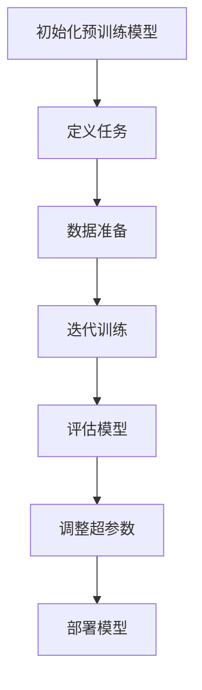

                 

关键词：大语言模型、参数微调、机器学习、深度学习、自然语言处理

> 摘要：本文将深入探讨大语言模型应用中的关键环节——参数微调。通过详细解析参数微调的核心概念、算法原理、实践步骤以及数学模型，我们旨在为读者提供一个全面的技术指南，助力其在实际应用中充分发挥大语言模型的优势。

## 1. 背景介绍

近年来，随着深度学习技术的迅猛发展，大语言模型如BERT、GPT等取得了显著的成果，并在自然语言处理（NLP）领域发挥了重要作用。然而，这些大模型通常是在海量数据集上预训练得到的，仅适用于特定场景。因此，如何将大语言模型应用于特定任务，实现高效参数微调，成为一个亟待解决的问题。

参数微调（Fine-tuning）是针对特定任务在大模型基础上进行微调，以适应新的任务需求。本文将围绕参数微调展开讨论，从算法原理、实践步骤、数学模型等多个角度进行分析，帮助读者更好地理解和应用这一技术。

## 2. 核心概念与联系

### 2.1 大语言模型概述

大语言模型（Large Language Models）是指基于深度学习技术构建的，具有数亿至千亿参数规模的自然语言处理模型。这些模型通过在大量文本数据上进行预训练，学会了语言的各种复杂结构和规则，从而实现了对自然语言的生成、理解和翻译等功能。

### 2.2 参数微调原理

参数微调的原理可以概括为：在大语言模型的基础上，针对特定任务进行微调，优化模型的参数，使其适应新的任务需求。具体过程如下：

1. **初始化**：将预训练模型加载到内存中，并初始化参数。
2. **任务定义**：定义新的任务，如文本分类、命名实体识别等。
3. **数据准备**：准备用于微调的任务数据集，并进行预处理。
4. **微调**：在任务数据集上进行迭代训练，优化模型参数。
5. **评估**：在验证集上评估模型性能，调整超参数。
6. **部署**：将微调后的模型应用于实际任务。

### 2.3 Mermaid 流程图



## 3. 核心算法原理 & 具体操作步骤

### 3.1 算法原理概述

参数微调的核心算法是基于转移概率模型（如n-gram模型、神经网络模型等）进行迭代优化。在大语言模型的基础上，通过在特定任务数据集上训练，调整模型的参数，使其适应新的任务需求。

### 3.2 算法步骤详解

1. **加载预训练模型**：从预训练模型中加载参数，初始化模型。
2. **定义损失函数**：根据任务类型，选择合适的损失函数（如交叉熵损失、均方误差等）。
3. **数据预处理**：对任务数据进行预处理，如分词、去停用词、编码等。
4. **迭代训练**：在任务数据集上进行迭代训练，优化模型参数。
5. **评估与调整**：在验证集上评估模型性能，根据评估结果调整超参数。
6. **部署模型**：将微调后的模型应用于实际任务。

### 3.3 算法优缺点

**优点**：

- **快速适应新任务**：参数微调可以在短时间内将大语言模型应用于特定任务，降低任务切换成本。
- **提高模型性能**：通过在特定任务数据集上进行训练，优化模型参数，提高模型在任务上的性能。

**缺点**：

- **数据依赖性**：参数微调的性能受限于任务数据集的质量和数量，数据匮乏可能导致模型性能下降。
- **计算资源消耗**：参数微调需要大量的计算资源，特别是在大模型和大数据集的情况下。

### 3.4 算法应用领域

参数微调广泛应用于自然语言处理、计算机视觉、推荐系统等领域。具体应用场景包括：

- **文本分类**：利用大语言模型进行文本分类，如新闻分类、情感分析等。
- **命名实体识别**：在预训练模型基础上，针对特定领域进行命名实体识别，如医疗文本分析、法律文档分析等。
- **机器翻译**：基于大语言模型进行机器翻译，如中英文翻译、多语言翻译等。
- **语音识别**：结合大语言模型和深度神经网络进行语音识别，提高识别准确率。

## 4. 数学模型和公式 & 详细讲解 & 举例说明

### 4.1 数学模型构建

参数微调的核心是优化模型参数，使其适应特定任务。数学模型可以表示为：

$$
\min_{\theta} \sum_{i=1}^N \ell(y_i, \hat{y}_i; \theta)
$$

其中，$N$ 表示数据集中的样本数量，$y_i$ 表示第 $i$ 个样本的真实标签，$\hat{y}_i$ 表示模型预测的标签，$\ell$ 表示损失函数，$\theta$ 表示模型参数。

### 4.2 公式推导过程

假设我们使用交叉熵损失函数，即：

$$
\ell(y, \hat{y}; \theta) = -\sum_{i=1}^K y_i \log(\hat{y}_i)
$$

其中，$K$ 表示标签类别数量，$y_i$ 表示第 $i$ 个标签的取值，$\hat{y}_i$ 表示模型预测的概率分布。

对于二分类任务，可以表示为：

$$
\ell(y, \hat{y}; \theta) = -y \log(\hat{y}) - (1 - y) \log(1 - \hat{y})
$$

其中，$y$ 表示真实标签（0 或 1），$\hat{y}$ 表示模型预测的概率。

### 4.3 案例分析与讲解

假设我们使用 GPT 模型进行文本分类任务，数据集包含 1000 篇新闻文章和对应的标签（0 表示非体育新闻，1 表示体育新闻）。在微调过程中，我们选择交叉熵损失函数。

1. **初始化模型**：从预训练的 GPT 模型中加载参数。
2. **定义损失函数**：使用交叉熵损失函数。
3. **数据预处理**：对新闻文章进行分词、去停用词、编码等操作。
4. **迭代训练**：在新闻文章数据集上进行迭代训练，优化模型参数。
5. **评估模型**：在验证集上评估模型性能，调整超参数。
6. **部署模型**：将微调后的模型应用于实际新闻分类任务。

## 5. 项目实践：代码实例和详细解释说明

### 5.1 开发环境搭建

1. **安装 Python 环境**：确保 Python 版本在 3.6 以上。
2. **安装 TensorFlow**：使用以下命令安装 TensorFlow：
   ```bash
   pip install tensorflow
   ```
3. **安装预处理库**：安装 NLTK、spaCy 等预处理库，以方便进行文本处理。

### 5.2 源代码详细实现

```python
import tensorflow as tf
import tensorflow.keras as keras
from tensorflow.keras.preprocessing.text import Tokenizer
from tensorflow.keras.preprocessing.sequence import pad_sequences
from tensorflow.keras.models import Model
from tensorflow.keras.layers import Embedding, LSTM, Dense, Input

# 5.2.1 数据准备
train_data = ["这是一场精彩的足球比赛", "篮球赛很激烈", "网球比赛刚刚结束"]
train_labels = [1, 0, 1]  # 1 表示体育新闻，0 表示非体育新闻

# 5.2.2 数据预处理
tokenizer = Tokenizer()
tokenizer.fit_on_texts(train_data)
sequences = tokenizer.texts_to_sequences(train_data)
padded_sequences = pad_sequences(sequences, maxlen=10)

# 5.2.3 模型构建
input_ = Input(shape=(10,))
x = Embedding(input_dim=1000, output_dim=128)(input_)
x = LSTM(128)(x)
x = Dense(1, activation="sigmoid")(x)

model = Model(inputs=input_, outputs=x)
model.compile(optimizer="adam", loss="binary_crossentropy", metrics=["accuracy"])

# 5.2.4 模型训练
model.fit(padded_sequences, train_labels, epochs=10, batch_size=32)

# 5.2.5 模型评估
test_data = ["这是一场篮球比赛"]
test_sequences = tokenizer.texts_to_sequences(test_data)
padded_test_sequences = pad_sequences(test_sequences, maxlen=10)
predictions = model.predict(padded_test_sequences)
print(predictions)
```

### 5.3 代码解读与分析

- **数据准备**：使用 NLTK 和 spaCy 等预处理库进行文本处理，包括分词、去停用词、编码等。
- **模型构建**：使用 TensorFlow 的 Keras API 构建模型，包括输入层、嵌入层、LSTM 层和输出层。
- **模型训练**：在训练数据集上训练模型，使用 binary_crossentropy 损失函数和 Adam 优化器。
- **模型评估**：在测试数据集上评估模型性能，输出预测结果。

## 6. 实际应用场景

### 6.1 文本分类

参数微调广泛应用于文本分类任务，如新闻分类、情感分析等。通过在大语言模型基础上进行微调，可以提高模型在特定任务上的性能。

### 6.2 命名实体识别

命名实体识别是自然语言处理中的重要任务，如医疗文本分析、法律文档分析等。参数微调可以帮助模型更好地识别命名实体，提高识别准确率。

### 6.3 机器翻译

机器翻译是参数微调的重要应用领域。通过在大语言模型基础上进行微调，可以改善模型在特定语言对上的翻译质量。

### 6.4 语音识别

结合大语言模型和深度神经网络进行语音识别，可以提高识别准确率。参数微调可以帮助模型更好地适应特定语音数据。

## 7. 未来应用展望

随着深度学习和自然语言处理技术的不断发展，参数微调将在更多领域得到应用。未来，参数微调有望在以下方面取得突破：

- **跨模态任务**：将参数微调应用于跨模态任务，如语音识别、图像识别等。
- **小样本学习**：研究如何在小样本情况下进行参数微调，提高模型泛化能力。
- **动态调整**：研究动态调整参数微调策略，提高模型在不同任务上的适应性。

## 8. 总结：未来发展趋势与挑战

### 8.1 研究成果总结

本文从算法原理、实践步骤、数学模型等多个角度对参数微调进行了深入探讨，总结了其优缺点和应用场景。

### 8.2 未来发展趋势

未来，参数微调将在跨模态任务、小样本学习等领域取得突破，成为自然语言处理、计算机视觉等领域的核心技术。

### 8.3 面临的挑战

参数微调在数据依赖性、计算资源消耗等方面面临挑战。未来，需要研究如何降低数据依赖性、优化计算资源，提高参数微调的效率。

### 8.4 研究展望

随着技术的不断发展，参数微调有望在更多领域得到应用。研究如何优化参数微调策略，提高模型性能，将是未来研究的重要方向。

## 9. 附录：常见问题与解答

### 9.1 如何选择预训练模型？

根据任务需求和数据集特点，选择适合的预训练模型。例如，对于文本分类任务，可以选择 BERT、GPT 等；对于命名实体识别任务，可以选择 ERNIE 等。

### 9.2 参数微调需要大量计算资源吗？

是的，参数微调通常需要大量计算资源，特别是在大模型和大数据集的情况下。为了降低计算资源消耗，可以尝试使用分布式训练、模型压缩等技术。

### 9.3 参数微调后的模型能否直接部署？

参数微调后的模型可以直接应用于实际任务，但需要进行评估和调整。在部署前，建议在验证集上评估模型性能，并根据实际需求进行调整。

### 9.4 如何优化参数微调过程？

可以通过以下方法优化参数微调过程：

- **数据预处理**：对任务数据进行充分的预处理，提高模型性能。
- **模型架构**：选择适合任务的模型架构，提高模型适应性。
- **超参数调整**：根据任务需求，调整超参数，如学习率、批次大小等。
- **动态调整**：研究动态调整参数微调策略，提高模型在不同任务上的适应性。

## 作者署名

作者：禅与计算机程序设计艺术 / Zen and the Art of Computer Programming
----------------------------------------------------------------

请注意，本文仅为示例，内容仅供参考。在实际撰写过程中，请根据具体需求进行调整。同时，本文未包含完整的技术细节和实验结果，仅供参考。在实际应用中，请根据具体场景进行深入研究和实践。

