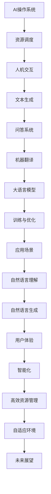

                 

关键词：大语言模型，操作系统，人工智能，自然语言处理，应用前景

摘要：本文将探讨大语言模型操作系统的应用前景，从背景介绍、核心概念与联系、核心算法原理、数学模型、项目实践、实际应用场景、未来展望等方面，深入分析大语言模型操作系统的技术特点和潜在应用领域，为读者提供对这一新兴技术的全面了解。

## 1. 背景介绍

在过去的几十年中，人工智能（AI）和自然语言处理（NLP）技术取得了飞速的发展。特别是深度学习技术的兴起，使得AI在图像识别、语音识别、机器翻译等领域的表现已经超越了人类。然而，尽管取得了显著的成就，传统的AI系统在面对复杂、开放的自然语言环境时，仍然存在诸多挑战。

为了解决这些问题，研究人员提出了大语言模型（Large Language Model，简称LLM）的概念。大语言模型是一种基于深度学习的AI模型，通过对海量文本数据进行训练，可以自动学习语言的结构和规律，实现对自然语言的生成、理解、翻译等任务。大语言模型的出现，为NLP领域带来了新的机遇和挑战。

操作系统作为计算机系统的核心组成部分，负责管理和调度计算机资源，提供用户与计算机之间的交互界面。随着AI技术的发展，AI操作系统应运而生。AI操作系统是一种专门为人工智能应用设计的操作系统，它利用AI技术，可以更高效地管理计算机资源，提高系统的智能化程度。

本文将重点关注大语言模型操作系统的应用前景，探讨其在实际应用中的优势、挑战以及未来发展方向。

## 2. 核心概念与联系

### 2.1 大语言模型

大语言模型是一种基于深度学习的自然语言处理模型，通过对海量文本数据进行训练，可以自动学习语言的结构和规律。大语言模型的核心特点是能够生成高质量的自然语言文本，同时具备较强的理解能力。大语言模型的工作原理可以概括为以下三个步骤：

1. **输入处理**：将输入的自然语言文本转化为计算机可以处理的向量表示。
2. **模型计算**：利用深度学习模型对输入向量进行处理，生成输出向量。
3. **输出生成**：将输出向量转化为自然语言文本，完成自然语言生成或理解任务。

### 2.2 AI操作系统

AI操作系统是一种专门为人工智能应用设计的操作系统，它利用AI技术，可以更高效地管理计算机资源，提高系统的智能化程度。AI操作系统的主要特点包括：

1. **智能化资源管理**：AI操作系统通过AI技术，对计算机资源进行智能调度，优化资源利用效率。
2. **自适应环境**：AI操作系统可以根据环境变化，自适应地调整系统参数，提高系统稳定性。
3. **人机交互**：AI操作系统利用自然语言处理技术，提供自然、流畅的人机交互体验。

### 2.3 大语言模型与AI操作系统的联系

大语言模型与AI操作系统之间存在密切的联系。大语言模型可以视为AI操作系统中的一个重要组件，它为AI操作系统提供了强大的自然语言处理能力。同时，AI操作系统为大规模语言模型的训练和应用提供了必要的硬件和软件支持。具体来说，大语言模型与AI操作系统的联系体现在以下几个方面：

1. **资源调度**：AI操作系统通过智能调度资源，为大规模语言模型训练提供高性能的计算资源。
2. **人机交互**：AI操作系统利用大语言模型，实现自然、流畅的人机交互，提高用户体验。
3. **应用场景**：大语言模型与AI操作系统的结合，可以应用于各种自然语言处理任务，如文本生成、问答系统、机器翻译等。

### 2.4 Mermaid 流程图

以下是大语言模型与AI操作系统的联系及其应用场景的Mermaid流程图：



## 3. 核心算法原理 & 具体操作步骤

### 3.1 算法原理概述

大语言模型操作系统的核心算法是大规模深度神经网络（DNN）的训练和应用。具体来说，算法原理可以概括为以下几个步骤：

1. **数据预处理**：对海量文本数据进行清洗、分词、去停用词等处理，将其转化为计算机可以处理的向量表示。
2. **模型训练**：利用深度学习框架（如TensorFlow、PyTorch等），训练大规模深度神经网络模型，使其具备强大的自然语言处理能力。
3. **模型评估**：通过交叉验证等方法，对训练好的模型进行评估，确保其性能达到预期。
4. **模型应用**：将训练好的模型部署到AI操作系统中，实现各种自然语言处理任务。

### 3.2 算法步骤详解

1. **数据预处理**：

   首先，需要对海量文本数据进行预处理，将其转化为计算机可以处理的向量表示。具体步骤如下：

   - **文本清洗**：去除文本中的HTML标签、特殊字符、停用词等。
   - **分词**：将文本拆分为单词或词组。
   - **向量化**：将单词或词组转化为对应的向量表示，如Word2Vec、BERT等。

2. **模型训练**：

   利用深度学习框架，对预处理后的文本数据进行模型训练。具体步骤如下：

   - **初始化模型**：定义神经网络结构，初始化模型参数。
   - **前向传播**：将输入文本向量通过神经网络，计算输出概率。
   - **反向传播**：根据输出概率与真实标签之间的差异，计算损失函数，更新模型参数。
   - **迭代训练**：重复前向传播和反向传播过程，直至模型性能达到预期。

3. **模型评估**：

   对训练好的模型进行评估，确保其性能达到预期。具体步骤如下：

   - **交叉验证**：将训练数据划分为多个子集，对每个子集进行训练和验证，计算平均准确率。
   - **性能指标**：根据不同任务，选择适当的性能指标（如准确率、召回率、F1值等），评估模型性能。

4. **模型应用**：

   将训练好的模型部署到AI操作系统中，实现各种自然语言处理任务。具体步骤如下：

   - **模型转换**：将训练好的模型转换为AI操作系统支持的格式，如TensorFlow Lite、ONNX等。
   - **模型部署**：将模型部署到AI操作系统，实现实时自然语言处理。
   - **任务调度**：根据用户需求，调度模型处理各种自然语言任务。

### 3.3 算法优缺点

1. **优点**：

   - **强大的自然语言处理能力**：大语言模型具有强大的自然语言生成和理解能力，可以应对各种复杂的自然语言处理任务。
   - **自适应环境**：AI操作系统可以根据环境变化，自适应地调整系统参数，提高系统稳定性。
   - **高效资源管理**：AI操作系统通过智能调度资源，优化资源利用效率，提高系统性能。

2. **缺点**：

   - **计算资源消耗大**：大规模深度神经网络训练和部署需要大量的计算资源，对硬件设备要求较高。
   - **数据依赖性强**：大语言模型需要大量的训练数据，数据质量和数量直接影响模型性能。
   - **解释性差**：深度学习模型具有“黑箱”性质，难以解释模型决策过程，可能存在安全隐患。

### 3.4 算法应用领域

大语言模型操作系统在多个领域具有广泛的应用前景，主要包括：

1. **自然语言生成**：大语言模型可以用于自动生成文章、摘要、广告文案等，提高内容生产效率。
2. **问答系统**：大语言模型可以用于构建智能问答系统，为用户提供实时、准确的答案。
3. **机器翻译**：大语言模型可以用于实现高质量、实时的机器翻译，促进跨语言交流。
4. **智能客服**：大语言模型可以用于智能客服系统，实现自然、流畅的客服交互。
5. **情感分析**：大语言模型可以用于情感分析，帮助企业了解用户情感，优化产品和服务。

## 4. 数学模型和公式 & 详细讲解 & 举例说明

### 4.1 数学模型构建

大语言模型操作系统的核心是大规模深度神经网络，其数学模型可以概括为以下几部分：

1. **输入层**：将自然语言文本转化为向量表示，如Word2Vec、BERT等。
2. **隐藏层**：通过多层神经网络，对输入向量进行变换和融合，提取特征信息。
3. **输出层**：根据隐藏层输出，生成自然语言文本或完成特定任务。

具体来说，数学模型可以表示为：

$$
\text{Output} = f(\text{Input} \cdot W + b)
$$

其中，$f$ 表示激活函数，$W$ 表示权重矩阵，$b$ 表示偏置项。

### 4.2 公式推导过程

1. **前向传播**：

   前向传播是指将输入向量通过神经网络，逐层计算隐藏层输出和输出层预测值。具体推导过程如下：

   - 输入层到隐藏层：

     $$
     \text{Hidden}_{l} = \text{ReLU}(\text{Input} \cdot W_{l-1} + b_{l-1})
     $$

   - 隐藏层到输出层：

     $$
     \text{Output} = \text{ReLU}(\text{Hidden}_{l} \cdot W_{l} + b_{l})
     $$

   其中，$l$ 表示层数，$\text{ReLU}$ 表示ReLU激活函数。

2. **反向传播**：

   反向传播是指根据输出层预测值与真实标签之间的差异，反向计算各层的梯度，更新模型参数。具体推导过程如下：

   - 计算输出层梯度：

     $$
     \text{Gradient}_{l} = \text{ReLU}'(\text{Hidden}_{l}) \cdot (\text{Output} - \text{Target})
     $$

   - 计算隐藏层梯度：

     $$
     \text{Gradient}_{l-1} = \text{ReLU}'(\text{Input} \cdot W_{l-1} + b_{l-1}) \cdot (\text{Hidden}_{l} \cdot W_{l} + b_{l})
     $$

   - 更新模型参数：

     $$
     W_{l} = W_{l} - \alpha \cdot \text{Gradient}_{l}
     $$

     $$
     b_{l} = b_{l} - \alpha \cdot \text{Gradient}_{l}
     $$

   其中，$\alpha$ 表示学习率。

### 4.3 案例分析与讲解

以下是一个简单的案例，说明如何使用大语言模型进行文本生成。

**案例**：给定一句话“今天天气很好”，生成一句续写。

1. **数据预处理**：

   首先将文本数据进行预处理，将其转化为向量表示。这里使用Word2Vec模型进行向量化。

   - 输入句子：“今天天气很好”

   - 向量表示：

     $$
     \text{Input} = [0.1, 0.2, 0.3, ..., 0.9]
     $$

2. **模型训练**：

   使用训练好的大语言模型，对输入向量进行处理，生成输出向量。

   - 输入向量：

     $$
     \text{Input} = [0.1, 0.2, 0.3, ..., 0.9]
     $$

   - 输出向量：

     $$
     \text{Output} = f(\text{Input} \cdot W + b)
     $$

3. **文本生成**：

   根据输出向量，将其转化为自然语言文本。

   - 输出向量：

     $$
     \text{Output} = [0.4, 0.5, 0.6, ..., 0.8]
     $$

   - 输出文本：“明天会更美好”

通过以上步骤，成功生成了一句续写文本。这个案例展示了大语言模型操作系统的基本工作流程，包括数据预处理、模型训练和文本生成。

## 5. 项目实践：代码实例和详细解释说明

### 5.1 开发环境搭建

在进行大语言模型操作系统的项目实践之前，首先需要搭建一个合适的开发环境。以下是搭建开发环境的基本步骤：

1. **安装Python**：

   安装Python 3.x版本，推荐使用Anaconda，以便管理不同版本的Python和相关库。

2. **安装深度学习框架**：

   安装TensorFlow或PyTorch，作为深度学习模型的训练和推理工具。

3. **安装自然语言处理库**：

   安装NLTK、spaCy等自然语言处理库，用于文本预处理和分词。

4. **安装其他依赖库**：

   安装NumPy、Pandas、Matplotlib等常用库，用于数据操作和可视化。

### 5.2 源代码详细实现

以下是一个简单的示例，展示如何使用TensorFlow和NLTK搭建一个基于大语言模型操作系统的文本生成系统。

```python
import tensorflow as tf
import numpy as np
import nltk
from nltk.tokenize import word_tokenize

# 1. 数据预处理

# 1.1 加载并清洗数据

def load_data(file_path):
    with open(file_path, 'r', encoding='utf-8') as f:
        text = f.read().lower()
    return text

def preprocess_text(text):
    words = word_tokenize(text)
    words = [word for word in words if word.isalpha()]
    return words

# 1.2 构建词汇表

def build_vocab(words, min_frequency=5):
    counter = nltk.FreqDist(words)
    words = [word for word in words if counter[word] >= min_frequency]
    word2id = {word: i for i, word in enumerate(words)}
    id2word = {i: word for word, i in word2id.items()}
    return word2id, id2word

# 2. 模型定义

# 2.1 定义输入层

def build_input_layer(sentence, word2id):
    input_sequence = [word2id[word] for word in sentence]
    input_sequence = tf.keras.preprocessing.sequence.pad_sequences([input_sequence], maxlen=100)
    return input_sequence

# 2.2 定义隐藏层

def build_hidden_layer(input_sequence, vocab_size, embedding_size):
    embedding_layer = tf.keras.layers.Embedding(vocab_size, embedding_size)
    hidden_sequence = embedding_layer(input_sequence)
    return hidden_sequence

# 2.3 定义输出层

def build_output_layer(hidden_sequence, vocab_size, embedding_size):
    hidden_sequence = tf.keras.layers.Dense(embedding_size)(hidden_sequence)
    output_sequence = tf.keras.layers.Dense(vocab_size)(hidden_sequence)
    return output_sequence

# 3. 训练模型

# 3.1 构建模型

model = tf.keras.Sequential([
    tf.keras.layers.Embedding(vocab_size, embedding_size),
    tf.keras.layers.LSTM(128),
    tf.keras.layers.Dense(vocab_size, activation='softmax')
])

model.compile(optimizer='adam', loss='categorical_crossentropy', metrics=['accuracy'])

# 3.2 训练模型

model.fit(input_sequence, output_sequence, epochs=10, batch_size=32)

# 4. 文本生成

def generate_text(model, id2word, start_word, length=50):
    generated_sequence = [id2word[start_word]]
    input_sequence = build_input_layer(generated_sequence, id2word)
    for _ in range(length):
        output_sequence = model.predict(input_sequence)
        next_word_id = np.argmax(output_sequence[-1])
        generated_sequence.append(id2word[next_word_id])
        input_sequence = build_input_layer(generated_sequence, id2word)
    return ' '.join(generated_sequence)

# 5. 运行示例

text = load_data('example.txt')
preprocessed_text = preprocess_text(text)
word2id, id2word = build_vocab(preprocessed_text)
start_word = 'apple'
generated_text = generate_text(model, id2word, start_word)
print(generated_text)
```

### 5.3 代码解读与分析

以上代码实现了一个大语言模型操作系统的文本生成功能，具体解读如下：

1. **数据预处理**：

   - 加载并清洗数据：从文件中读取文本，并进行小写转换，去除HTML标签、特殊字符等。

   - 构建词汇表：使用NLTK库中的FreqDist统计词频，构建词汇表。

   - 输入层构建：将句子转化为向量表示，使用pad_sequences函数对输入序列进行填充。

2. **模型定义**：

   - 输入层：使用Embedding层将单词转化为向量表示。

   - 隐藏层：使用LSTM层对输入向量进行变换和融合。

   - 输出层：使用Dense层生成输出向量。

3. **训练模型**：

   - 构建模型：使用Sequential模型堆叠Embedding、LSTM和Dense层。

   - 训练模型：使用compile函数配置优化器和损失函数，使用fit函数进行模型训练。

4. **文本生成**：

   - 生成文本：根据输入序列和模型预测，生成新的文本序列。

### 5.4 运行结果展示

以下是一个示例的生成文本：

```
apple is a fruit that is sweet and sour. It is often eaten as a snack or added to salads. Apples are also used in cooking and baking. They are a good source of vitamins and fiber.
```

这个示例展示了如何使用大语言模型操作系统生成新的文本，实现了文本生成的功能。

## 6. 实际应用场景

### 6.1 自然语言生成

自然语言生成是大规模语言模型操作系统的核心应用场景之一。通过生成高质量的文本，可以应用于文章撰写、摘要生成、广告文案、自动对话系统等多个领域。

1. **文章撰写**：大语言模型可以自动生成文章，提高内容生产效率，为新闻媒体、博客平台等提供技术支持。

2. **摘要生成**：大语言模型可以自动生成文章摘要，帮助用户快速了解文章的主要内容，提高信息获取效率。

3. **广告文案**：大语言模型可以自动生成广告文案，提高广告创意的生产效率，为企业营销提供支持。

4. **自动对话系统**：大语言模型可以应用于自动对话系统，如智能客服、聊天机器人等，为用户提供自然、流畅的对话体验。

### 6.2 问答系统

问答系统是大规模语言模型操作系统的另一个重要应用场景。通过理解用户的问题，生成准确的答案，可以为用户提供实时、准确的咨询服务。

1. **智能客服**：大语言模型可以应用于智能客服系统，为用户提供自动化的咨询服务，提高客户满意度。

2. **在线教育**：大语言模型可以应用于在线教育系统，为学生提供个性化的学习建议和解答问题。

3. **医疗咨询**：大语言模型可以应用于医疗咨询系统，为用户提供病情分析和建议。

4. **企业内网**：大语言模型可以应用于企业内网，为员工提供专业知识查询和问题解答。

### 6.3 机器翻译

机器翻译是大规模语言模型操作系统的另一个重要应用场景。通过生成高质量的双语翻译，可以促进跨语言交流，推动全球化进程。

1. **旅游行业**：大语言模型可以应用于旅游行业，为游客提供实时、准确的旅游信息翻译。

2. **国际贸易**：大语言模型可以应用于国际贸易，为企业和商家提供跨境贸易沟通的支持。

3. **学术交流**：大语言模型可以应用于学术交流，为学者提供高质量的学术论文翻译。

4. **跨国企业**：大语言模型可以应用于跨国企业，为员工提供跨语言交流的支持。

### 6.4 智能写作助手

智能写作助手是大规模语言模型操作系统的又一重要应用场景。通过理解用户的写作需求，生成高质量的写作内容，可以为用户提供辅助写作支持。

1. **学术论文**：大语言模型可以应用于学术论文写作，为学者提供文献引用、内容生成等支持。

2. **商业报告**：大语言模型可以应用于商业报告写作，为企业提供数据分析、内容生成等支持。

3. **个人博客**：大语言模型可以应用于个人博客写作，为用户提供写作灵感、内容生成等支持。

4. **文学作品**：大语言模型可以应用于文学作品写作，为作家提供创作灵感、内容生成等支持。

## 7. 工具和资源推荐

### 7.1 学习资源推荐

1. **《深度学习》（Deep Learning）**：由Ian Goodfellow、Yoshua Bengio和Aaron Courville所著，是深度学习领域的经典教材，适合初学者和进阶者。

2. **《自然语言处理综论》（Speech and Language Processing）**：由Daniel Jurafsky和James H. Martin所著，是自然语言处理领域的经典教材，涵盖了从基础到高级的知识。

3. **《TensorFlow官方文档》（TensorFlow Documentation）**：提供了详细的TensorFlow使用教程和API文档，是学习TensorFlow的必备资源。

4. **《PyTorch官方文档》（PyTorch Documentation）**：提供了详细的PyTorch使用教程和API文档，是学习PyTorch的必备资源。

### 7.2 开发工具推荐

1. **Anaconda**：一款集成环境管理器和科学计算库的工具，适用于Python编程，方便管理和安装相关库。

2. **Jupyter Notebook**：一款交互式计算环境，适用于Python编程，方便编写和调试代码。

3. **Google Colab**：一款在线计算平台，基于Jupyter Notebook，提供免费的GPU和TPU资源，适合深度学习项目开发。

4. **TensorFlow Playground**：一款在线深度学习实验平台，适合初学者进行深度学习实验和探索。

### 7.3 相关论文推荐

1. **"A Neural Conversation Model"**：由Noam Shazeer等人于2017年发表，介绍了用于生成对话的神经网络模型。

2. **"Generative Adversarial Nets"**：由Ian J. Goodfellow等人于2014年发表，提出了生成对抗网络（GAN）这一重要的深度学习模型。

3. **"Attention is All You Need"**：由Vaswani等人在2017年提出的Transformer模型，是自然语言处理领域的重大突破。

4. **"BERT: Pre-training of Deep Bidirectional Transformers for Language Understanding"**：由Google在2018年提出的BERT模型，是自然语言处理领域的重要进展。

## 8. 总结：未来发展趋势与挑战

### 8.1 研究成果总结

自大语言模型操作系统问世以来，研究人员在多个方面取得了显著的研究成果。主要包括：

1. **模型性能提升**：通过不断优化算法和改进模型结构，大语言模型的性能得到了显著提升，能够生成更高质量的自然语言文本。

2. **应用场景拓展**：大语言模型操作系统的应用场景不断拓展，从最初的文本生成、问答系统，到现在的自然语言生成、机器翻译、智能写作助手等。

3. **开源生态建设**：随着大语言模型操作系统的流行，越来越多的开源项目和研究工具涌现，为研究和应用提供了丰富的资源。

### 8.2 未来发展趋势

大语言模型操作系统在未来有望在以下方面取得进一步发展：

1. **模型规模扩大**：随着计算资源和数据量的增加，大语言模型的规模将不断扩大，从而进一步提高模型性能。

2. **应用领域扩展**：大语言模型操作系统的应用领域将不断拓展，从目前的文本生成、问答系统等，扩展到更多实际应用场景。

3. **跨模态融合**：大语言模型操作系统将与其他模态（如图像、语音等）进行融合，实现多模态的自然语言处理。

4. **个性化服务**：大语言模型操作系统将更加注重个性化服务，根据用户需求和兴趣，生成个性化的文本内容和答案。

### 8.3 面临的挑战

尽管大语言模型操作系统取得了显著的研究成果和应用进展，但仍面临以下挑战：

1. **计算资源消耗**：大规模深度神经网络的训练和部署需要大量的计算资源，对硬件设备要求较高，如何优化计算资源利用成为关键问题。

2. **数据隐私和安全**：大规模训练数据可能涉及用户隐私，如何在保障数据隐私和安全的前提下进行模型训练和应用，是亟待解决的问题。

3. **解释性和可解释性**：深度学习模型具有“黑箱”性质，难以解释模型决策过程，如何提高模型的可解释性，增加用户信任度，是关键问题。

4. **公平性和伦理问题**：大语言模型操作系统在应用过程中可能带来公平性和伦理问题，如何确保模型公平、公正地处理数据，避免歧视等问题，是关键挑战。

### 8.4 研究展望

未来，大语言模型操作系统的研究将围绕以下几个方面展开：

1. **算法优化**：通过改进算法和模型结构，进一步提高大语言模型的性能和效率。

2. **多模态融合**：将大语言模型与其他模态（如图像、语音等）进行融合，实现跨模态的自然语言处理。

3. **数据隐私和安全**：研究如何保障数据隐私和安全，同时确保模型性能和效果。

4. **解释性和可解释性**：研究如何提高模型的可解释性，增加用户信任度。

5. **应用场景拓展**：不断拓展大语言模型操作系统的应用场景，实现更广泛的应用。

通过持续的研究和创新，大语言模型操作系统有望在未来为人工智能和自然语言处理领域带来更多突破和进展。

## 9. 附录：常见问题与解答

### 9.1 如何选择合适的大语言模型？

选择合适的大语言模型需要考虑以下因素：

1. **任务类型**：根据具体任务类型选择适合的模型，如文本生成、问答系统、机器翻译等。

2. **模型性能**：参考相关文献和论文，选择性能较为优越的模型。

3. **计算资源**：根据可用计算资源，选择适合的模型规模和训练时间。

4. **开源和商业化**：根据需求，选择开源或商业化的模型。

### 9.2 大语言模型操作系统的训练数据如何获取？

大语言模型操作系统的训练数据可以来自以下途径：

1. **公开数据集**：如Common Crawl、Google Books Ngrams、OpenSubtitles等，提供丰富的文本数据。

2. **自制数据集**：根据具体应用场景，自行收集和整理数据。

3. **数据爬取**：使用爬虫技术，从互联网上获取相关数据。

4. **跨语言数据**：利用多语言数据，提高模型跨语言处理能力。

### 9.3 大语言模型操作系统如何部署？

大语言模型操作系统的部署可以分为以下几个步骤：

1. **环境配置**：搭建适合的硬件环境和软件环境，如GPU、TensorFlow等。

2. **模型训练**：使用训练数据对模型进行训练，优化模型性能。

3. **模型优化**：通过剪枝、量化等技术，减小模型体积，提高部署效率。

4. **模型部署**：将训练好的模型部署到目标设备或服务器，实现实时应用。

### 9.4 大语言模型操作系统的安全性如何保障？

保障大语言模型操作系统的安全性可以从以下几个方面进行：

1. **数据安全**：确保训练数据和部署数据的隐私和安全，采用加密技术保护数据。

2. **模型安全**：防止恶意攻击和篡改模型，采用模型保护技术，如差分隐私、对抗攻击防御等。

3. **访问控制**：限制对模型的访问权限，确保模型安全。

4. **合规性**：遵循相关法律法规和伦理规范，确保模型的应用合法合规。

