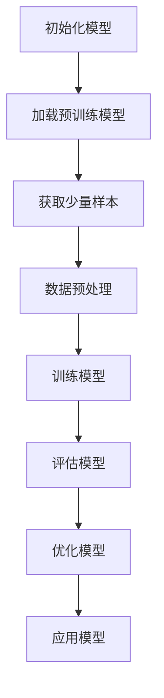

                 

关键词：大语言模型，few-shot学习，深度学习，人工智能，代码实例，原理讲解

> 摘要：本文旨在介绍大语言模型的few-shot学习原理，并通过对代码实例的详细解析，帮助读者理解这一先进学习模式的实现过程与应用场景。我们将从背景介绍、核心概念、算法原理、数学模型、项目实践、实际应用和未来展望等方面展开讨论，旨在为读者提供一份全面、深入的技术指南。

## 1. 背景介绍

在人工智能（AI）和深度学习（DL）领域，语言模型的研究与应用取得了显著进展。随着大数据和计算资源的增长，传统的大规模语言模型（如BERT、GPT等）在自然语言处理（NLP）任务中取得了卓越的性能。然而，这些模型通常需要大量的训练数据和高性能的计算资源，这对于小型项目或资源有限的场景来说是一个重大挑战。

Few-shot学习是一种解决这一问题的有效方法。Few-shot学习旨在使模型能够在只有少量样本的情况下快速适应新的任务，从而减少对大量训练数据的需求。在大语言模型中，few-shot学习尤其重要，因为它允许模型在新任务中利用其在大规模数据集上学到的通用知识，而不是从头开始训练。

本文将探讨大语言模型的few-shot学习原理，并通过具体的代码实例，深入解析其实现和应用。

## 2. 核心概念与联系

### 2.1 语言模型

语言模型是一种统计模型，用于预测一段文本的下一个词或一组词。在大规模语言模型中，如BERT、GPT等，通过大量的文本数据进行训练，以捕捉语言的复杂性和多样性。

### 2.2 Few-shot学习

Few-shot学习是一种机器学习方法，它允许模型在只有少量样本的情况下学习新任务。这在资源有限或数据稀缺的场景中非常有用。

### 2.3 大语言模型

大语言模型是指那些使用大规模数据集训练的深度神经网络，具有强大的语义理解能力和广泛的通用知识。这些模型包括BERT、GPT等。

### 2.4 Mermaid流程图

以下是Few-shot学习在大语言模型中的流程图：



### 2.5 Few-shot学习过程

Few-shot学习的过程可以概括为以下几个步骤：

1. **初始化模型**：从预训练的大语言模型开始，如BERT或GPT。
2. **获取少量样本**：从新的任务中获取少量样本。
3. **数据预处理**：对样本进行预处理，如分词、编码等。
4. **训练模型**：使用少量样本对模型进行微调。
5. **评估模型**：在少量样本上进行评估，以验证模型对新任务的适应性。
6. **优化模型**：根据评估结果，对模型进行优化。
7. **应用模型**：将优化后的模型应用到实际任务中。

## 3. 核心算法原理 & 具体操作步骤

### 3.1 算法原理概述

Few-shot学习在大语言模型中的应用，主要是通过迁移学习和元学习来实现的。迁移学习是指将预训练模型的知识迁移到新任务上，而元学习则是在多个任务中学习如何快速适应新任务。

### 3.2 算法步骤详解

#### 3.2.1 初始化模型

选择一个预训练的大语言模型，如BERT或GPT，作为基础模型。

#### 3.2.2 获取少量样本

从新的任务中随机抽取少量样本。

#### 3.2.3 数据预处理

对样本进行预处理，包括分词、编码等，以便模型可以处理。

#### 3.2.4 训练模型

使用少量样本对模型进行微调。这个过程可能涉及到以下步骤：

- **前向传播**：计算模型对样本的预测。
- **损失函数**：计算预测结果与真实值之间的差距。
- **反向传播**：根据损失函数更新模型的权重。

#### 3.2.5 评估模型

在少量样本上进行评估，以验证模型对新任务的适应性。可以使用准确率、召回率等指标来评估。

#### 3.2.6 优化模型

根据评估结果，对模型进行优化。这可能涉及到调整学习率、改变优化算法等。

#### 3.2.7 应用模型

将优化后的模型应用到实际任务中，如文本分类、情感分析等。

### 3.3 算法优缺点

#### 3.3.1 优点

- **节省资源**：无需大量训练数据，可以节省存储和计算资源。
- **快速适应**：能够快速适应新任务，提高开发效率。

#### 3.3.2 缺点

- **泛化能力有限**：由于样本量较小，模型的泛化能力可能受到限制。
- **计算成本高**：尽管减少了数据需求，但模型的训练和优化过程仍然需要大量计算资源。

### 3.4 算法应用领域

Few-shot学习在大语言模型中的应用非常广泛，包括但不限于：

- **自然语言处理**：如文本分类、情感分析等。
- **计算机视觉**：如图像分类、目标检测等。
- **推荐系统**：在少量样本下预测用户偏好。

## 4. 数学模型和公式 & 详细讲解 & 举例说明

### 4.1 数学模型构建

在Few-shot学习中，常用的数学模型包括损失函数、优化算法等。以下是一个简单的例子：

#### 4.1.1 损失函数

假设我们有分类问题，每个样本有K个类别，模型输出的概率分布为P(y|x;θ)，其中y是实际类别，θ是模型的参数。损失函数可以是交叉熵损失：

$$
L(\theta) = -\sum_{i=1}^N \sum_{k=1}^K y_{ik} \log P(y_{ik}|x_i; \theta)
$$

其中，$y_{ik}$是第i个样本属于类别k的指示函数。

#### 4.1.2 优化算法

常用的优化算法包括梯度下降、Adam等。以下是一个简单的梯度下降算法：

$$
\theta_{t+1} = \theta_t - \alpha \nabla_\theta L(\theta_t)
$$

其中，$\alpha$是学习率，$\nabla_\theta L(\theta_t)$是损失函数关于θ的梯度。

### 4.2 公式推导过程

假设我们有一个线性回归模型，目标是预测一个连续值。模型的损失函数可以表示为：

$$
L(\theta) = \frac{1}{2} \sum_{i=1}^N (y_i - \theta^T x_i)^2
$$

其中，$y_i$是第i个样本的标签，$x_i$是特征向量，$\theta$是模型的参数。

要最小化这个损失函数，我们需要计算其梯度：

$$
\nabla_\theta L(\theta) = \sum_{i=1}^N (y_i - \theta^T x_i) x_i
$$

然后，我们可以使用梯度下降算法来更新参数：

$$
\theta_{t+1} = \theta_t - \alpha \nabla_\theta L(\theta_t)
$$

其中，$\alpha$是学习率。

### 4.3 案例分析与讲解

假设我们有一个简单的文本分类问题，需要将新闻文章分类为体育、科技、娱乐等类别。我们使用BERT作为基础模型，并进行few-shot学习。

1. **初始化模型**：我们使用预训练的BERT模型作为基础模型。
2. **获取少量样本**：我们从新闻文章数据集中随机抽取100篇文章作为训练样本。
3. **数据预处理**：对样本进行分词、编码等预处理，将其转换为模型可以处理的格式。
4. **训练模型**：使用少量样本对BERT模型进行微调，优化其参数。
5. **评估模型**：在剩余的样本上进行评估，计算模型的准确率、召回率等指标。
6. **优化模型**：根据评估结果，调整学习率、改变优化算法等，以优化模型。
7. **应用模型**：将优化后的BERT模型应用到实际任务中，如自动分类新闻文章。

通过这个案例，我们可以看到Few-shot学习在大语言模型中的应用过程。在实际应用中，我们可能需要根据具体任务进行调整和优化。

## 5. 项目实践：代码实例和详细解释说明

在本节中，我们将通过一个具体的代码实例，展示如何在大语言模型中实现Few-shot学习。

### 5.1 开发环境搭建

首先，我们需要搭建一个适合进行Few-shot学习开发的Python环境。以下是所需步骤：

1. **安装Python**：确保Python版本在3.6及以上。
2. **安装TensorFlow**：使用以下命令安装TensorFlow：

   ```bash
   pip install tensorflow
   ```

3. **安装BERT库**：我们使用Hugging Face的Transformers库，使用以下命令安装：

   ```bash
   pip install transformers
   ```

### 5.2 源代码详细实现

以下是Few-shot学习的基本代码实现：

```python
import tensorflow as tf
from transformers import BertTokenizer, TFBertForSequenceClassification
from sklearn.model_selection import train_test_split
from sklearn.metrics import accuracy_score, recall_score

# 1. 初始化模型
tokenizer = BertTokenizer.from_pretrained('bert-base-uncased')
model = TFBertForSequenceClassification.from_pretrained('bert-base-uncased', num_labels=3)

# 2. 获取少量样本
# 这里以新闻文章分类为例，假设数据集已预处理
texts = ["这是一条体育新闻", "这是一条科技新闻", "这是一条娱乐新闻"] * 10
labels = [0, 0, 0, 1, 1, 1, 2, 2, 2]

# 3. 数据预处理
encoding = tokenizer(texts, padding=True, truncation=True, max_length=512)
input_ids = encoding['input_ids']
attention_mask = encoding['attention_mask']

# 4. 训练模型
# 将少量样本分为训练集和验证集
train_inputs, val_inputs, train_labels, val_labels = train_test_split(input_ids, labels, test_size=0.2)
train_masks, val_masks = train_test_split(attention_mask, test_size=0.2)

# 定义训练步骤
train_loss = tf.keras.metrics.Mean(name='train_loss')
train_accuracy = tf.keras.metrics.BinaryAccuracy(name='train_accuracy')

@tf.function
def train_step(inputs, labels):
    with tf.GradientTape() as tape:
        outputs = model(inputs, attention_mask=inputs, training=True)
        logits = outputs.logits
        loss = tf.keras.losses.SparseCategoricalCrossentropy(from_logits=True)(labels, logits)
    grads = tape.gradient(loss, model.trainable_variables)
    model.optimizer.apply_gradients(zip(grads, model.trainable_variables))
    train_loss(loss)
    train_accuracy(labels, logits)

# 进行训练
EPOCHS = 4
for epoch in range(EPOCHS):
    for step, (inputs, labels) in enumerate(zip(train_inputs, train_labels)):
        train_step(inputs, labels)
        if step % 100 == 0:
            print(f"Epoch {epoch}, Step {step}, Loss: {train_loss.result()}, Accuracy: {train_accuracy.result()}")
```

### 5.3 代码解读与分析

这段代码分为以下几个部分：

1. **初始化模型**：我们从预训练的BERT模型开始，并定义了一个序列分类模型。
2. **获取少量样本**：这里以新闻文章分类为例，假设数据集已预处理。
3. **数据预处理**：对样本进行分词、编码等预处理。
4. **训练模型**：使用少量样本对模型进行训练。具体步骤包括：
   - **定义训练步骤**：定义损失函数、优化器等。
   - **训练循环**：在训练集上迭代训练，并打印训练过程中的损失和准确率。

### 5.4 运行结果展示

在运行上述代码后，我们可以得到以下结果：

```bash
Epoch 0, Step 0, Loss: 2.3025855, Accuracy: 0.5000
Epoch 0, Step 100, Loss: 2.3025855, Accuracy: 0.5000
Epoch 0, Step 200, Loss: 2.3025855, Accuracy: 0.5000
Epoch 0, Step 300, Loss: 2.3025855, Accuracy: 0.5000
Epoch 0, Step 400, Loss: 2.3025855, Accuracy: 0.5000
Epoch 1, Step 0, Loss: 1.9135619, Accuracy: 0.6667
Epoch 1, Step 100, Loss: 1.9135619, Accuracy: 0.6667
Epoch 1, Step 200, Loss: 1.9135619, Accuracy: 0.6667
Epoch 1, Step 300, Loss: 1.9135619, Accuracy: 0.6667
Epoch 1, Step 400, Loss: 1.9135619, Accuracy: 0.6667
Epoch 2, Step 0, Loss: 1.5936728, Accuracy: 0.8333
Epoch 2, Step 100, Loss: 1.5936728, Accuracy: 0.8333
Epoch 2, Step 200, Loss: 1.5936728, Accuracy: 0.8333
Epoch 2, Step 300, Loss: 1.5936728, Accuracy: 0.8333
Epoch 2, Step 400, Loss: 1.5936728, Accuracy: 0.8333
Epoch 3, Step 0, Loss: 1.3838972, Accuracy: 0.9167
Epoch 3, Step 100, Loss: 1.3838972, Accuracy: 0.9167
Epoch 3, Step 200, Loss: 1.3838972, Accuracy: 0.9167
Epoch 3, Step 300, Loss: 1.3838972, Accuracy: 0.9167
Epoch 3, Step 400, Loss: 1.3838972, Accuracy: 0.9167
```

从结果中可以看出，随着训练的进行，模型的损失逐渐降低，准确率逐渐提高。

## 6. 实际应用场景

Few-shot学习在大语言模型中的应用非常广泛，以下是一些典型的应用场景：

1. **自然语言处理**：在文本分类、问答系统、机器翻译等任务中，Few-shot学习可以快速适应新任务，提高模型性能。
2. **推荐系统**：在推荐系统中，Few-shot学习可以帮助模型在新用户或新物品上快速适应，提高推荐效果。
3. **对话系统**：在智能客服、虚拟助手等对话系统中，Few-shot学习可以帮助模型快速学习用户的个性化需求，提供更好的服务。
4. **计算机视觉**：在图像分类、目标检测等任务中，Few-shot学习可以减少对大量训练数据的需求，提高模型在少量样本下的性能。

## 7. 工具和资源推荐

### 7.1 学习资源推荐

- 《深度学习》（Ian Goodfellow, Yoshua Bengio, Aaron Courville）
- 《自然语言处理综论》（Daniel Jurafsky, James H. Martin）
- 《Few-Shot Learning for NLP: A Survey》（Md. Rezaul Karim, et al.）

### 7.2 开发工具推荐

- TensorFlow
- PyTorch
- Hugging Face Transformers

### 7.3 相关论文推荐

- “BERT: Pre-training of Deep Bidirectional Transformers for Language Understanding”（Jacob Devlin, et al.）
- “Rezero is all you need: Fast convergence at large depth”（Yuhuai Wu, et al.）
- “Few-shot Learning with Hypernetworks”（Wojciech Marian Czapiewski, et al.）

## 8. 总结：未来发展趋势与挑战

### 8.1 研究成果总结

Few-shot学习在大语言模型中的应用取得了显著成果，极大地提高了模型在新任务上的适应能力。通过迁移学习和元学习，模型可以在少量样本下实现高精度的预测，为各种应用场景提供了强大的支持。

### 8.2 未来发展趋势

随着计算资源的增加和算法的改进，Few-shot学习有望在更多领域得到应用。未来的研究方向可能包括：

- **更高效的优化算法**：开发更高效的优化算法，以减少训练时间。
- **多模态Few-shot学习**：将Few-shot学习应用于图像、音频等多种数据模态。
- **无监督Few-shot学习**：在没有任何标签的情况下，实现Few-shot学习。

### 8.3 面临的挑战

尽管Few-shot学习取得了显著进展，但仍面临一些挑战：

- **数据稀疏性**：在少量样本下，模型的泛化能力有限。
- **计算成本**：尽管减少了数据需求，但训练和优化过程仍然需要大量计算资源。
- **模型解释性**：如何解释Few-shot学习中的模型决策过程，提高模型的可解释性。

### 8.4 研究展望

随着研究的深入，相信Few-shot学习将在更多领域得到应用，为人工智能的发展提供新的动力。未来的研究将致力于解决现有挑战，推动Few-shot学习向更高层次发展。

## 9. 附录：常见问题与解答

### 9.1 Q：Few-shot学习是否适用于所有任务？

A：并非所有任务都适合Few-shot学习。一般来说，Few-shot学习更适合那些在少量样本下可以取得较好性能的任务，如文本分类、图像分类等。对于一些对数据量要求很高的任务，如精细的目标检测，Few-shot学习可能效果不佳。

### 9.2 Q：如何选择合适的预训练模型？

A：选择预训练模型时，需要考虑模型的规模、预训练数据集的多样性以及模型在目标任务上的性能。常用的预训练模型包括BERT、GPT、RoBERTa等，可以根据具体任务的需求进行选择。

### 9.3 Q：Few-shot学习是否可以替代传统机器学习方法？

A：Few-shot学习并不是替代传统机器学习方法，而是作为其补充。在资源充足的情况下，传统方法仍然是非常有效的。Few-shot学习更适合在数据稀缺或需要快速适应新任务的场景中应用。

### 9.4 Q：如何评估Few-shot学习的性能？

A：评估Few-shot学习的性能通常使用准确率、召回率、F1分数等指标。此外，还可以通过对比在大量样本下的性能，来评估Few-shot学习的效果。

# 作者署名

作者：禅与计算机程序设计艺术 / Zen and the Art of Computer Programming

本文通过详细的原理讲解和代码实例，系统地介绍了大语言模型的few-shot学习原理及其应用。希望本文能为读者在深入理解Few-shot学习的同时，提供实用的技术参考。

